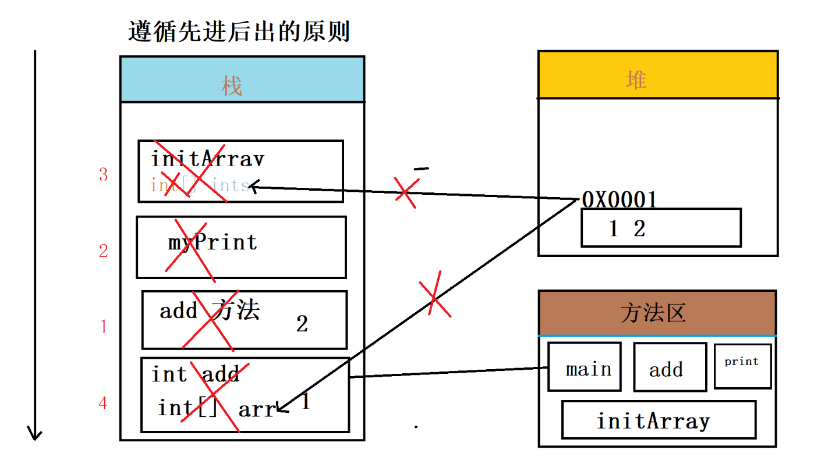

# JVM内存模型变化

1. 栈：是线程私有的，生命周期与线程相同，线程之间不共享，里面拥有多个栈帧
   - 局部变量
     - 方法内定义的局部变量
     - 参数列表变量
     - 对象引用（指向对象的引用地址）指向堆里面
   - 栈是一块连续的空间，相对于堆来说，内存较小，运行速度较快，不需要垃圾回收机制
2. 堆：是jvm 内存模型最大的一块，被所有共享，在jvm 启动时所创建。
   - 存放对象实例（new 对象）并且会给初始值
   - 需要垃圾回收机制回收垃圾，
   - 配置大小：-Xmx -Xms
   - 如果堆中的对象没有被栈引用时，会被垃圾回收器不定时回收。
3. **字符串常量池**：存储在类加载完成，经过验证，解析阶段的一些常量字符串。
4. 程序计数器pc:
   - 是一块很小的内存区域，记录当前线程执行的字节码的行号指示器，可以去通过计数器控制，指令，循环，跳转。
   - 线程私有，每条线程都有自己的程序计数器
5. 方法区：
   - 类信息，记录类的字节码信息，常量池（String 和 包装类）
6. GC（垃圾回收器）：不定时的回收垃圾，回收一些没有引用的堆内存的垃圾，不需要程序员手动操作。


# jvm方法执行内存模型变化



```java
public static void main(String[] args) {

        int a = 10;
        int b = 20;
        System.out.println("------------");
        int add = add(1, 2);
        System.out.println(add);

        myPrint(4);

        int[] arr = initArray(1, 2);
        System.out.println(Arrays.toString(arr));

        System.out.println("main 方法结束了");

    }

    public static int add(int num, int num1) {
        System.out.println("num+num1");
        return num + num1;
    }

    public static void myPrint(int num) {
        System.out.println("num:" + num);
    }

    public static int[] initArray(int num, int num2) {
        System.out.println("数组初始化方法");
        int[] ints = new int[2];
        ints[0] = num;
        ints[1] = num2;
        return ints;
    }
}
```


