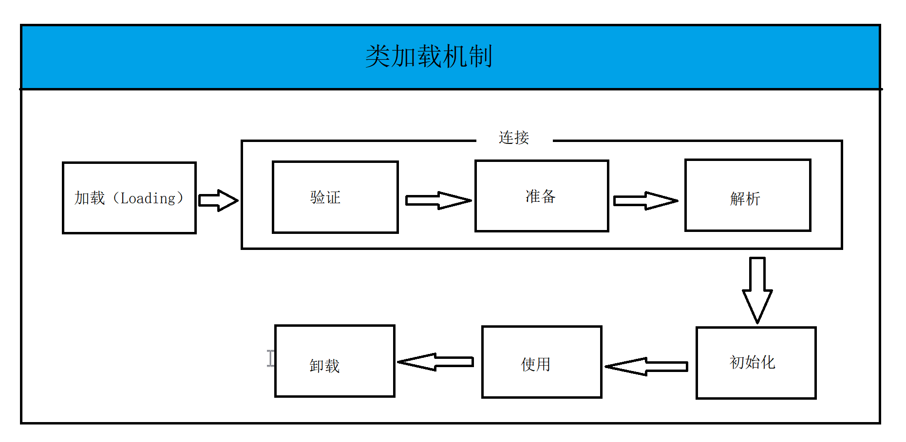
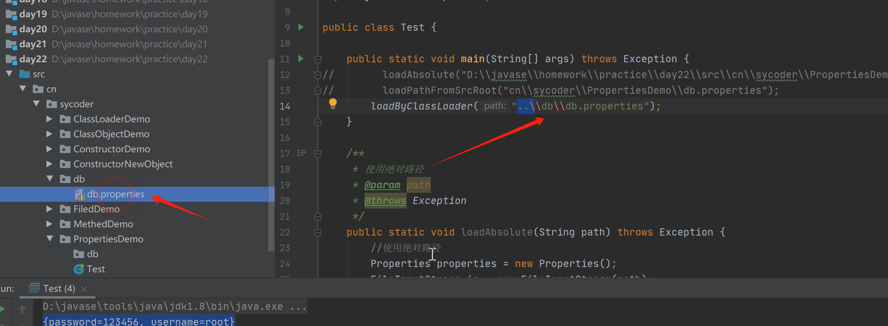

# 反射

## 类加载机制

1. jvm 和类的关系

   - 运行带有main方法的类（主方法），启动 jvm 进程，并加载字节码，同一个jvm 所有线程已经变量都处于同一个进程中
   - jvm 何时退出？
     - **程序正常运行结束**
     - **出现异常，没有捕获异常时**
     - System.exit() 方法
     - 强制杀进程的时候
   - **重点**：jvm 进程一旦结束，进程中的内存中的数据会丢失

2. 类加载机制

   

3. 类加载初始化具体步骤（加载，连接，初始化）
   - 类的加载
     - 类加载器（ClassLoader），将字节码文件（class 文件）加载进内存中，并且创建一个**字节码对象（java.lang.Class）**,类加载器由JVM提供，或者自定义
   - 类的连接（类加载进内存之后，生成 Class 对象，把类的二进制数据合并到 JRE 中）
     - 验证：检测被加载的类是否有正确的内部结构
     - **准备：负责为类的 static 变量分配内存，设置默认值（并不是初始化操作）**
     - 解析：把类的二进制数据中的符号引用替换为直接引用（深入分析 jvm）
   - 类的初始化（jvm 负责对类进行初始化，主要是对 static 变量进行初始化）
     - 如果该类未被加载和连接，则程序先加载并连接该类（**类还可以动态加载**）groovy
     - 如果该类的父类未被初始化，则优先初始化父类
     - 如果该类有初始化语句（静态代码块），系统依次执行这些初始化语句


# 反射的概述

1. 问题：Object obj = new String("abc");
   - 需求：如何调用 String 中的length 方法
     - 使用强制类型转换
   - **如果不知道真实的类型怎么办？**
2. 问题：一切皆对象，**类这种事物是啥对象?**使用什么类来表示这种对象？
   - Class :表示所有的类
   - Constructor:表示所有的构造器
   - Method :表示所有的方法
   - Field:表示所有的字段
   - **通过反射：得到类的元数据信息（构造器，方法，字段，内部类）**
3. **类加载进内存，变成 Class 对象，也叫字节码对象**


# Class 类和 Class 实例

1. Class 表示所有的类

2. Class 实例表示：一份份的字节码（类，接口，注解）

3. 各种类如何表示？

   - String Class<java.lang.String>
   - HashMap Class<java.util.HashMap>

4. 如何获取Class 的实例

   ```java
   //1:使用类名.class
   Class<String> stringClass = String.class;
   //2:通过对象调用 getClass();
   String str = "abc";
   Class<? extends String> aClass = str.getClass();
   //3:使用类的全限定类名 java.lang.String
   Class<?> aClass1 = Class.forName("java.lang.String");
   Class<?> stuClass = Class.forName("cn.sycoder.ClassObjectDemo.Student");
   System.out.println(stuClass);
   ```

   - 注意：同一个JVM中，只存在一个类的一份字节码和一份字节码对象
   - 使用最多的 Class.forName(类的全限定类名);

5. 基本数据类型的字节码如何表示：

   - jvm 已经提前内置好基本数据类型字节码实例

     ```java
     Class<Integer> aClass2 = int.class;
     ```

   - 包装类型提供了一个 TYPE 常量，也是可以去获取基本类型的类实例

     ```JAVA
     Class<Integer> type = Integer.TYPE;
     ```

   - 如何证明 Integer 和 int 不是同一种数据类型

     ```java
     Integer.class == int.class
     ```

     

# 类加载

1. 直接使用类.class

   ```java
   Class<String> stringClass = String.class;
   ```

2. 使用对象调用getClass()

   ```java
   String str = "abc";
   Class<? extends String> aClass = str.getClass();
   ```

3. 使用类全限定类名

   ```java
   Class<?> aClass1 = Class.forName("java.lang.String");
   Class<?> stuClass = Class.forName("cn.sycoder.ClassObjectDemo.Student");
   ```


# 反射操作构造器

1. Class 去操作 Constructor 类

2. 常用的方法

   ```java
   //获取构造器对象
   public Constructor<T> getConstructor(Class<?>... parameterTypes)
   //获取全部构造器对象
   public Constructor<?>[] getConstructors()
   //获取全部构造器包括私有
   public Constructor<?>[] getDeclaredConstructors()
   ```

3. 常见错误

   

4. 常用获取构造器方法

   ```java
   //获取单个
   Class<?> aClass = Class.forName("cn.sycoder.ConstructorDemo.User");
   Constructor<?> constructor = aClass.getConstructor();
   //获取非私有全部
   Constructor<?>[] constructors = aClass.getConstructors();
   //获取私有的单个
   Constructor<?> declaredConstructor = aClass.getDeclaredConstructor();
   //获取带私有的全部
   Constructor<?>[] declaredConstructors = aClass.getDeclaredConstructors();
   //带参数的
   Constructor<?> constructor1 = aClass.getConstructor(String.class);
   ```

   

# 反射创建对象

1. 问题：为啥使用反射创建对象，不直接使用 new 创建对象

   - 框架中，多半使用反射创建对象，使用类全限定类名操作

2. 如何使用反射创建对象

   - 获取类字节码对象

   - 获取构造器对象

   - 通过反射获取的构造器创建对象

     ```java
     Class<?> aClass = Class.forName("cn.sycoder.ConstructorNewObject.Person");
     Constructor<?> constructor = aClass.getConstructor();
     //通过构造器创建对象
     Object o = constructor.newInstance();
     ```

     

   - **如果构造器是私有的，还需要去设置可以访问**

     ```java
     constructor.setAccessible(true);
     ```

     

   

3. 常见错误：

   - cn.sycoder.ConstructorNewObject.Person with modifiers "private"

     ```java
     constructor.setAccessible(true);
     ```

   - Exception in thread "main" java.lang.IllegalArgumentException: wrong number of arguments

     ```java
      Constructor<?> constructor1 = aClass.getConstructor(String.class, int.class);
     Object o1 = constructor1.newInstance("上云",18);
     ```

     

# 反射操作方法

1. 实例方法

   - 获取字节码对象

   - 使用构造器获取对象

   - 获取方法对象

   - 反射调用方法

     - 调用方法

       - Object invoke(Object obj,Object...args)

       ```java
       Class<?> aClass = Class.forName("cn.sycoder.MethedDemo.MethodDemo");
       Constructor<?> constructor = aClass.getConstructor();
       Object o = constructor.newInstance();
       
       
       Method eat = aClass.getMethod("eat");
       Object invoke = eat.invoke(o);
       
       Method eat1 = aClass.getMethod("eat", String.class);
       Object obj = eat1.invoke(o, "鱼");
       ```

       

2. 静态方法

   - 静态方法不属于对象，属于类本身

   - 如何执行：

     - 获取类字节码对象

     - 获取方法对象

     - 执行（invoke）不需要传对象

       ```java
       Method getName = aClass.getMethod("getName", String.class);
       Object object = getName.invoke(null, "上云");
       System.out.println(object);
       ```

       

# 反射操作字段

1. 获取类字节码对象

2. 获取对象

3. 操作字段

   ```java
   Class<?> aClass = Class.forName("cn.sycoder.FiledDemo.FiledDemo");
   Constructor<?> constructor = aClass.getConstructor();
   Object o = constructor.newInstance();
   Field age = aClass.getDeclaredField("age");
   age.setAccessible(true);
   
   age.set(o,19);
   
   Object o1 = age.get(o);
   System.out.println(o1);
   ```

   


# 类加载器加载 Properties

```java
public static void main(String[] args) throws Exception {
        loadAbsolute("D:\\javase\\homework\\practice\\day22\\src\\cn\\sycoder\\PropertiesDemo\\db.properties");
        loadPathFromSrcRoot("cn\\sycoder\\PropertiesDemo\\db.properties");
        loadByClassLoader("..\\db\\db.properties");
        // .. 代表返回上一层
    }
```


1. 使用绝对路径

   ```java
   //使用绝对路径
   Properties properties = new Properties();
   FileInputStream in = new FileInputStream(path);
   properties.load(in);
   System.out.println(properties);
   ```

2. 使用相对路径从根目录开始找

   ```java
   Properties properties = new Properties();
   ClassLoader classLoader = Thread.currentThread().getContextClassLoader();
   InputStream resourceAsStream = classLoader.getResourceAsStream(path);
   properties.load(resourceAsStream);
   System.out.println(properties);
   ```

3. **使用相对路径（相对于我们使用的类的文件夹开始）**

   ```java
   Properties properties = new Properties();
   InputStream inputStream = Test.class.getResourceAsStream(path);
   properties.load(inputStream);
   System.out.println(properties);
   ```

   当要知道Test包上层的包时，用..\\返回上一层
   
   

# 补充

- ##### **利用反射机制，设计可以输出任何类的字段和字段值**

```java
public <T> void out(Class<T> cls, T obj) {
        System.out.println("Fields of object of type " + cls.getName() + ":");
        for (Field field : cls.getDeclaredFields()) {
            field.setAccessible(true); // 绕过Java的访问控制检查
            try {
                Object value = field.get(obj);
                System.out.println(field.getName() + " = " + value);
            } catch (IllegalAccessException e) {
                e.printStackTrace();
            }
        }
    }
```

