# 一、引言

## 1.回顾 JavaWEB

### 1.1新建项目结构

- 新建 javaweb 项目目录结构

  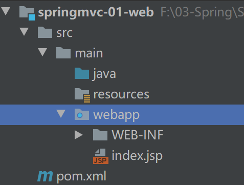

### 1.2导入依赖

- 依赖

  ```java
  <dependency>
        <groupId>javax.servlet</groupId>
        <artifactId>javax.servlet-api</artifactId>
        <version>3.1.0</version>
        <scope>provided</scope>
      </dependency>
      <dependency>
        <groupId>javax.servlet</groupId>
        <artifactId>jsp-api</artifactId>
        <version>2.0</version>
        <scope>provided</scope>
      </dependency>
  
  	<dependency>
        <groupId>jstl</groupId>
        <artifactId>jstl</artifactId>
        <version>1.2</version>
      </dependency>
      <dependency>
        <groupId>taglibs</groupId>
        <artifactId>standard</artifactId>
        <version>1.1.2</version>
      </dependency>
  ```

### 1.3实现第一个 servlet

- 通过注解写 servlet 实现 HttpServlet

  ```java
  @WebServlet("/first")
  public class FirstServlet extends HttpServlet {
      @Override
      protected void service(HttpServletRequest req, HttpServletResponse resp) throws ServletException, IOException {
          System.out.println("====进入了servlet===");
          req.setAttribute("username","sy");
  
          req.getRequestDispatcher("/test.jsp").forward(req,resp);
      }
  }
  ```

- 通过 web.xml 配置

  ```java
  <web-app>
    <display-name>Archetype Created Web Application</display-name>
    <servlet>
      <servlet-name>first-servlet</servlet-name>
      <servlet-class>cn.sycoder.FirstServlet</servlet-class>
    </servlet>
    <servlet-mapping>
      <servlet-name>first-servlet</servlet-name>
      <url-pattern>/test</url-pattern>
    </servlet-mapping>
  </web-app>
  ```

- 开启 el 表达式支持

  ```java
  <%@ page contentType="text/html;charset=UTF-8" language="java" %>
  <%@ taglib uri="http://java.sun.com/jsp/jstl/core" prefix="c" %>
  <%@page isELIgnored="false" %>
  <html>
  <head>
      <title>Title</title>
  </head>
  <body>
  ${username}
  </body>
  </html>
  ```

  

### 1.4思考问题

- 获取请求参数不方便

  ```java
  //获取请求参数
  String username = req.getParameter("username");
  String password = req.getParameter("password");
  ```

  - 给出的解决方案

    - 如果可以直接从方法入参传参是不是很方便,可以直接拿来用

      ```java
      protected void service(String username,String password)
      ```

- 设置响应视图或者设置响应的参数类型不方便

  ```java
  req.getRequestDispatcher("/test.jsp").forward(req,resp);
  ```

  - 给出的解决方案

    - 如果不需要设置响应类型

    - 如果不需要设置请求转发，直接跳转更方便

      ```java
      req.getRequestDispatcher("/test.jsp").forward(req,resp);
      //return "test";
      ```

## 2.回顾MVC

- 概述：MVC是一种软件架构的思想，将软件按照模型、视图、控制器来划分
- MVC分别是什么
  - M：Model：模型层，指工程中的JavaBean，作用是处理数据
    - domain 对象，Student 对象
    - 业务bean：Service,Mapper
  - V：View：视图层，指工程中的html或jsp等页面，作用是与用户进行交互，展示数据
  - C：Controller：控制层，指工程中的servlet，作用是接收请求和响应浏览器


## 3.SpringMVC

- 概述：SpringMVC 是 Spring 框架的一部分，它是一个基于 Java 的轻量级 Web 应用框架，主要用于简化 Web 开发。SpringMVC 遵循 MVC（Model-View-Controller）设计模式，帮助开发者构建清晰分离的组件化 Web 应用程序。
- 特点：
  - Spring 系列产品，可以与Spring无缝衔接
  - 基于原生的Servlet,使用DispatcherServlet对Servlet进行封装，可以对请求或者响应做统一的处理
  - 组件非常丰富，以后想用什么组件，直接配置使用就可以

### 1. 核心组件

- **DispatcherServlet**：前端控制器，接收所有的HTTP请求，并将它们分派到不同的处理器。
- **HandlerMapping**：映射处理器，负责为DispatcherServlet提供一个合适的处理器来处理请求。
- **Controller**：控制器，处理具体的业务逻辑，返回ModelAndView对象给DispatcherServlet。
- **ModelAndView**：包含视图信息和模型数据的对象。
- **ViewResolver**：视图解析器，用于解析逻辑视图名称到实际的物理视图页面。

### 2. 请求处理流程

1. 用户发送请求至前端控制器DispatcherServlet。
2. DispatcherServlet收到请求后，调用HandlerMapping进行处理。
3. HandlerMapping找到指定的Controller（处理器），并将其返回给DispatcherServlet。
4. DispatcherServlet调用Controller执行相应的业务方法。
5. Controller处理完用户请求后，返回ModelAndView给DispatcherServlet。
6. DispatcherServlet根据ModelAndView选择合适的ViewResolver进行视图解析。
7. ViewResolver解析后返回具体View。
8. DispatcherServlet把Model数据传给View结果，返回给客户端。

### 3. 注解支持

SpringMVC 提供了丰富的注解支持，简化了开发过程：

- **@Controller**：标记在一个类上，表示这是一个控制器类。
- **@RequestMapping**：可以放在类或方法上，用来映射HTTP请求。
- **@RequestParam**：用于绑定web请求参数到控制器的方法参数上。
- **@PathVariable**：用于接收URL中的动态值。
- **@ModelAttribute**：用于将请求参数绑定到模型中。
- **@ResponseBody**：指示方法返回的结果直接写入HTTP响应体。
- **@RestController**：组合了@Controller和@ResponseBody两个注解的功能。

### 4. 数据校验

SpringMVC 支持使用JSR-303标准进行数据校验，例如使用`@Valid`注解配合`@NotNull`, `@Size`等校验注解对表单数据进行校验。

### 5. 异常处理

- **@ExceptionHandler**：用于处理异常，可以定义在全局异常处理器中。
- **@ControllerAdvice**：可以用来定义全局的异常处理机制。

### 6. 国际化支持

SpringMVC 支持国际化，可以通过`LocaleResolver`获取用户的地区设置，并通过`MessageSource`获取相应的国际化资源文件。

### 7. 文件上传下载

SpringMVC 内置支持文件上传下载功能，通过`MultipartFile`接口可以方便地实现文件上传。

以上就是SpringMVC的一些基础知识点，希望对你有所帮助！如果有更具体的问题或者需要深入了解某个方面，请随时提问。

# 二、SpringMVC快速入门

## 1.基于XML方式配置

### 1.1导入依赖

- 导入依赖

  ```java
  <dependency>
        <groupId>org.springframework</groupId>
        <artifactId>spring-webmvc</artifactId>
        <version>5.2.17.RELEASE</version>
      </dependency>
      <dependency>
        <groupId>javax.servlet</groupId>
        <artifactId>javax.servlet-api</artifactId>
        <version>3.1.0</version>
        <scope>provided</scope>
      </dependency>
      <dependency>
        <groupId>javax.servlet</groupId>
        <artifactId>jsp-api</artifactId>
        <version>2.0</version>
        <scope>provided</scope>
      </dependency>
  
      <dependency>
        <groupId>jstl</groupId>
        <artifactId>jstl</artifactId>
        <version>1.2</version>
      </dependency>
      <dependency>
        <groupId>taglibs</groupId>
        <artifactId>standard</artifactId>
        <version>1.1.2</version>
      </dependency>
  ```

### 1.2创建SpringMVC配置文件

- 配置文件

  ```java
  <?xml version="1.0" encoding="UTF-8"?>
  <beans xmlns="http://www.springframework.org/schema/beans"
         xmlns:xsi="http://www.w3.org/2001/XMLSchema-instance"
         xmlns:context="http://www.springframework.org/schema/context"
         xsi:schemaLocation="http://www.springframework.org/schema/beans http://www.springframework.org/schema/beans/spring-beans.xsd http://www.springframework.org/schema/context https://www.springframework.org/schema/context/spring-context.xsd">
  <!--    配置包扫描-->
      <context:component-scan base-package="cn.sycoder.controller"/>
  </beans>
  ```

### 1.3配置DispatcherServlet

- web.xml

  ```java
  <!DOCTYPE web-app PUBLIC
   "-//Sun Microsystems, Inc.//DTD Web Application 2.3//EN"
   "http://java.sun.com/dtd/web-app_2_3.dtd" >
  
  <web-app>
    <display-name>Archetype Created Web Application</display-name>
    <servlet>
      <servlet-name>spring-mvc</servlet-name>
      <servlet-class>org.springframework.web.servlet.DispatcherServlet</servlet-class>
  <!--    初始化 spring-mvc 配置-->
      <init-param>
        <param-name>contextConfigLocation</param-name>
        <param-value>classpath:spring-mvc.xml</param-value>
      </init-param>
    </servlet>
    <servlet-mapping>
      <servlet-name>spring-mvc</servlet-name>
      <url-pattern>/</url-pattern>
    </servlet-mapping>
  </web-app>
  
  ```

  

### 1.4配置控制器

- 配置

  ```java
  @Controller
  public class XmlController {
  
      @RequestMapping("/test")
      public void test(){
          System.out.println("---------");
      }
  }
  ```

  

### 1.5配置视图解析器（ViewResolver）

- 视图解析器

  ```java
  <?xml version="1.0" encoding="UTF-8"?>
  <beans xmlns="http://www.springframework.org/schema/beans"
         xmlns:xsi="http://www.w3.org/2001/XMLSchema-instance"
         xmlns:context="http://www.springframework.org/schema/context"
         xsi:schemaLocation="http://www.springframework.org/schema/beans http://www.springframework.org/schema/beans/spring-beans.xsd http://www.springframework.org/schema/context https://www.springframework.org/schema/context/spring-context.xsd">
  <!--    配置包扫描-->
      <context:component-scan base-package="cn.sycoder.controller"/>
      <bean id="view" class="org.springframework.web.servlet.view.InternalResourceViewResolver">
  <!--        配置视图前缀-->
          <property name="prefix" value="/WEB-INF/pages/"/>
  <!--        配置视图后缀-->
          <property name="suffix" value=".jsp"/>
      </bean>
  </beans>
  ```

- 视图解析操作

  - 配置控制器

    ```java
    @RequestMapping("/login")
        public String login(String username, String password) {
            if ("sy".equals(username) && "123456".equals(password))
                return "success";
    
            return "fail";
        }
    ```

    

  - 配置视图

    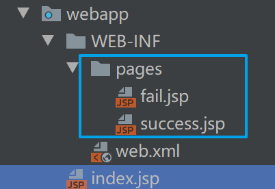

    

    

## 2.基于注解方式配置

### 2.1导入依赖

- 导入依赖

  ```java
  <dependency>
        <groupId>org.springframework</groupId>
        <artifactId>spring-webmvc</artifactId>
        <version>5.2.17.RELEASE</version>
      </dependency>
      <dependency>
        <groupId>javax.servlet</groupId>
        <artifactId>javax.servlet-api</artifactId>
        <version>3.1.0</version>
        <scope>provided</scope>
      </dependency>
      <dependency>
        <groupId>javax.servlet</groupId>
        <artifactId>jsp-api</artifactId>
        <version>2.0</version>
        <scope>provided</scope>
      </dependency>
  ```

### 2.2创建SpringMVC配置类

- 创建配置类

  ```java
  @Configuration
  @ComponentScan("cn.sycoder.controller")
  public class SpringMvcConfig {
  }
  ```

### 2.3通过配置类替换web.xml

- 替换操作

  ```java
  public class ServletConfig extends AbstractDispatcherServletInitializer {
  
      @Override
      protected WebApplicationContext createServletApplicationContext() {
          //获取SpringMVC容器
          //
          AnnotationConfigWebApplicationContext context = new AnnotationConfigWebApplicationContext();
          context.register(SpringMvcConfig.class);
          return context;
      }
  
      @Override
      protected String[] getServletMappings() {
          return new String[]{"/"};
      }
  
      @Override
      protected WebApplicationContext createRootApplicationContext() {
          return null;
      }
  }
  ```
  
  > 下面是对 `ServletConfig` 类的详细解释：
  >
  > ### 类概述
  >
  > `ServletConfig` 继承自 `AbstractDispatcherServletInitializer`，这是一个Spring框架提供的抽象类，用于初始化Spring MVC的`DispatcherServlet`。通过继承这个类，我们可以自定义Spring MVC的初始化过程。
  >
  > ### 方法详解
  >
  > #### 1. `createServletApplicationContext()`
  >
  > ```java
  > @Override
  > protected WebApplicationContext createServletApplicationContext() {
  >     // 获取SpringMVC容器
  >     AnnotationConfigWebApplicationContext context = new AnnotationConfigWebApplicationContext();
  >     context.register(SpringMvcConfig.class);
  >     return context;
  > }
  > ```
  >
  > - **作用**：创建并返回一个用于Spring MVC的`WebApplicationContext`。
  > - **详细步骤**：
  >   - 创建一个 `AnnotationConfigWebApplicationContext` 实例。这是一个基于注解的Web应用上下文，用于管理Spring MVC的Bean。
  >   - 使用 `context.register(SpringMvcConfig.class)` 注册配置类 `SpringMvcConfig`。这个配置类通常包含Spring MVC的各种配置，如视图解析器、拦截器等。
  >   - 返回创建好的 `WebApplicationContext`。
  >
  > #### 2. `getServletMappings()`
  >
  > ```java
  > @Override
  > protected String[] getServletMappings() {
  >     return new String[]{"/"};
  > }
  > ```
  >
  > - **作用**：定义Spring MVC的`DispatcherServlet`应该映射到哪些URL路径。
  > - **详细步骤**：
  >   - 返回一个字符串数组 `new String[]{"/"}`，表示`DispatcherServlet`将处理所有以根路径（`/`）开头的请求。
  >   - 这意味着所有的HTTP请求都会被`DispatcherServlet`捕获并分发到相应的控制器。
  >
  > #### 3. `createRootApplicationContext()`
  >
  > ```java
  > @Override
  > protected WebApplicationContext createRootApplicationContext() {
  >     return null;
  > }
  > ```
  >
  > - **作用**：创建并返回一个根`WebApplicationContext`。
  > - **详细步骤**：
  >   - 返回 `null`，表示不创建根`WebApplicationContext`。
  >   - 如果你需要一个根上下文来管理全局的Bean（例如数据库连接池、服务层Bean等），可以在这里创建并返回一个 `AnnotationConfigWebApplicationContext` 实例，并注册相应的配置类。
  >
  > ### 总结
  >
  > - **`createServletApplicationContext()`**：创建并配置Spring MVC的上下文，注册Spring MVC的配置类。
  > - **`getServletMappings()`**：定义`DispatcherServlet`的URL映射，使其能够处理所有请求。
  > - **`createRootApplicationContext()`**：可选地创建一个根上下文，用于管理全局的Bean。在这个例子中，没有创建根上下文。
  >
  > 通过这种方式，你可以完全控制Spring MVC的初始化过程，并确保所有必要的配置都被正确加载和应用。希望这些解释对你有所帮助！如果有更多问题，请随时提问。

### 2.4配置Controller

- 配置Controller

  ```java
  @Controller
  public class SpringMvcController {
      @RequestMapping("/get")
      public void getSpring(){
          System.out.println("========");
      }
  }
  ```

  

# 三、发送Http请求

- 准备工作

  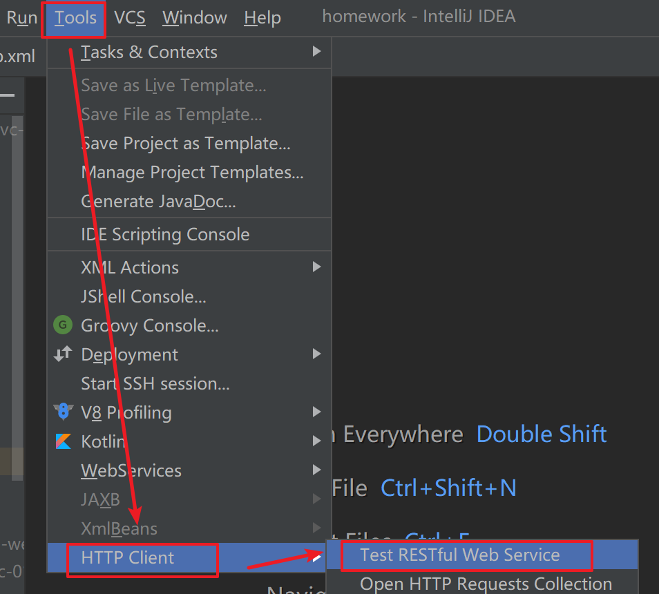

  

## 1.发起get请求

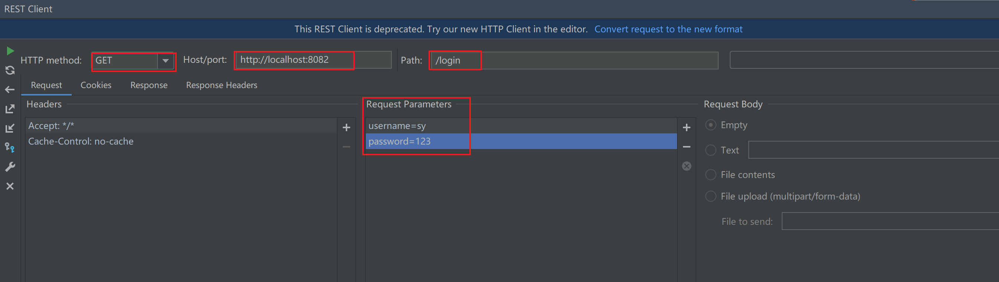


## 2.发起Post请求

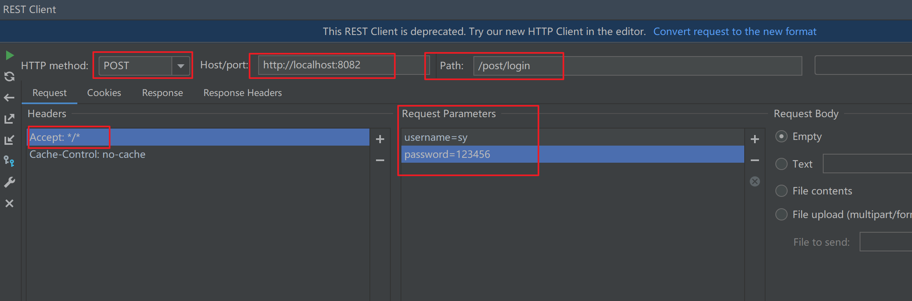

# 四、请求

## 1.@RequestMapping

- 作用：设置请求映射路径

- SpringMVC 接收到指定请求时，在映射关系中找到对应的控制方法

`@RequestMapping` 是Spring MVC中一个非常重要的注解，用于映射Web请求到控制器方法。它可以帮助你定义哪些URL请求应该由特定的方法处理。`@RequestMapping` 可以放在类级别和方法级别，提供了丰富的配置选项。

### 类级别的 `@RequestMapping`

当 `@RequestMapping` 放在类级别时，它定义了该类中所有方法的公共请求路径前缀。

#### 示例

```java
@Controller
@RequestMapping("/user")
public class UserController {

    @RequestMapping("/list")
    public String listUsers() {
        // 处理用户列表请求
        return "userList";
    }

    @RequestMapping("/detail/{id}")
    public String userDetails(@PathVariable("id") Long id) {
        // 处理用户详情请求
        return "userDetail";
    }
}
```

在这个例子中，`UserController` 类的所有方法都将以 `/user` 开头。因此：

- `/user/list` 请求将被 `listUsers` 方法处理。
- `/user/detail/{id}` 请求将被 `userDetails` 方法处理，其中 `{id}` 是一个路径变量。

### 方法级别的 `@RequestMapping`

当 `@RequestMapping` 放在方法级别时，它定义了该方法处理的具体请求路径。

#### 示例

```java
@Controller
public class HomeController {

    @RequestMapping(value = "/home", method = RequestMethod.GET)
    public String home() {
        // 处理主页请求
        return "home";
    }

    @RequestMapping(value = "/login", method = RequestMethod.POST)
    public String login(@RequestParam("username") String username, @RequestParam("password") String password) {
        // 处理登录请求
        return "loginResult";
    }
}
```

在这个例子中：

- `/home` 请求将被 `home` 方法处理，且只接受GET请求。
- `/login` 请求将被 `login` 方法处理，且只接受POST请求。

### `@RequestMapping` 的属性

`@RequestMapping` 注解提供了多个属性，用于更细粒度地控制请求映射：

1. **value**：指定请求的URL路径。
   ```java
   @RequestMapping(value = "/home")
   ```

2. **method**：指定请求的方法类型（GET, POST, PUT, DELETE等）。
   ```java
   @RequestMapping(value = "/login", method = RequestMethod.POST)
   ```

3. **params**：指定请求参数的条件。
   ```java
   @RequestMapping(value = "/search", params = {"name=John", "age"})
   ```

4. **headers**：指定请求头的条件。
   ```java
   @RequestMapping(value = "/api/data", headers = "Content-Type=application/json")
   ```

5. **consumes**：指定请求的内容类型。
   ```java
   @RequestMapping(value = "/upload", consumes = "multipart/form-data")
   ```

6. **produces**：指定响应的内容类型。
   ```java
   @RequestMapping(value = "/data", produces = "application/json")
   ```

### 衍生注解

Spring MVC还提供了一些衍生注解，这些注解是 `@RequestMapping` 的特化版本，用于更简洁地处理特定类型的请求：

- **@GetMapping**：等同于 `@RequestMapping(method = RequestMethod.GET)`
  ```java
  @GetMapping("/home")
  public String home() {
      return "home";
  }
  ```

- **@PostMapping**：等同于 `@RequestMapping(method = RequestMethod.POST)`
  ```java
  @PostMapping("/login")
  public String login(@RequestParam("username") String username, @RequestParam("password") String password) {
      return "loginResult";
  }
  ```

- **@PutMapping**：等同于 `@RequestMapping(method = RequestMethod.PUT)`
  ```java
  @PutMapping("/user/{id}")
  public String updateUser(@PathVariable("id") Long id, @RequestBody User user) {
      return "userUpdated";
  }
  ```

- **@DeleteMapping**：等同于 `@RequestMapping(method = RequestMethod.DELETE)`
  ```java
  @DeleteMapping("/user/{id}")
  public String deleteUser(@PathVariable("id") Long id) {
      return "userDeleted";
  }
  ```

- **@PatchMapping**：等同于 `@RequestMapping(method = RequestMethod.PATCH)`
  ```java
  @PatchMapping("/user/{id}")
  public String patchUser(@PathVariable("id") Long id, @RequestBody User user) {
      return "userPatched";
  }
  ```

> ### 总结
>
> `@RequestMapping` 注解是Spring MVC中用于映射Web请求的核心注解。它提供了丰富的配置选项，可以灵活地控制请求的处理方式。通过结合类级别和方法级别的 `@RequestMapping`，以及其衍生注解，你可以构建出高效、清晰的Web应用程序。希望这些解释对你有所帮助！如果有更多问题，请随时提问。


## 2.@RequestParam 

`@RequestParam` 是Spring MVC中一个非常有用的注解，用于将请求参数绑定到控制器方法的参数上。它可以处理GET和POST请求中的查询参数或表单字段。下面是对 `@RequestParam` 注解的详细解释，包括其主要属性和使用示例。

### 主要属性

1. **value**：指定请求参数的名称。如果方法参数名与请求参数名相同，可以省略此属性。
2. **required**：指定该参数是否必须存在，默认值为 `true`。如果设置为 `false`，则该参数可以不存在。
3. **defaultValue**：指定该参数的默认值，如果请求中没有提供该参数，则使用默认值。

### 示例

#### 示例1：基本用法

```java
@Controller
public class UserController {

    @RequestMapping("/user")
    public String getUser(@RequestParam("id") int userId) {
        // 处理用户请求
        System.out.println("User ID: " + userId);
        return "user";
    }
}
```

在这个例子中，`@RequestParam("id")` 将请求中的 `id` 参数绑定到方法参数 `userId` 上。如果请求中没有提供 `id` 参数，将会抛出 `MissingServletRequestParameterException` 异常。

#### 示例2：使用 `value` 属性

```java
@Controller
public class UserController {

    @RequestMapping("/user")
    public String getUser(@RequestParam(value = "id") int userId) {
        // 处理用户请求
        System.out.println("User ID: " + userId);
        return "user";
    }
}
```

在这个例子中，`value` 属性指定了请求参数的名称，与上面的例子效果相同。

#### 示例3：使用 `required` 属性

```java
@Controller
public class UserController {

    @RequestMapping("/user")
    public String getUser(@RequestParam(value = "id", required = false) Integer userId) {
        if (userId != null) {
            System.out.println("User ID: " + userId);
        } else {
            System.out.println("User ID is not provided");
        }
        return "user";
    }
}
```

在这个例子中，`required = false` 表示 `id` 参数是可选的。如果请求中没有提供 `id` 参数，`userId` 将为 `null`。

#### 示例4：使用 `defaultValue` 属性

```java
@Controller
public class UserController {

    @RequestMapping("/user")
    public String getUser(@RequestParam(value = "id", defaultValue = "1") int userId) {
        // 处理用户请求
        System.out.println("User ID: " + userId);
        return "user";
    }
}
```

在这个例子中，`defaultValue = "1"` 表示如果请求中没有提供 `id` 参数，则使用默认值 `1`。

### 处理多个参数

你可以同时使用多个 `@RequestParam` 注解来处理多个请求参数。

```java
@Controller
public class UserController {

    @RequestMapping("/user")
    public String getUser(
            @RequestParam(value = "id", required = false) Integer userId,
            @RequestParam(value = "name", defaultValue = "Guest") String userName) {
        
        if (userId != null) {
            System.out.println("User ID: " + userId);
        } else {
            System.out.println("User ID is not provided");
        }
        
        System.out.println("User Name: " + userName);
        
        return "user";
    }
}
```

在这个例子中，方法处理两个请求参数：`id` 和 `name`。`id` 是可选的，如果没有提供则为 `null`；`name` 如果没有提供则使用默认值 `Guest`。

### 总结

`@RequestParam` 注解是Spring MVC中用于将请求参数绑定到控制器方法参数上的重要工具。通过使用 `value`、`required` 和 `defaultValue` 属性，你可以灵活地处理各种请求参数的情况。


## 3.参数传递

在Spring MVC中，除了简单的请求参数传递外，还可以传递复杂的对象、数组和集合。下面分别介绍这些高级参数传递方式，并给出相应的示例。

### 1. 对象参数传递

#### 示例

假设有一个 `User` 对象，包含 `id` 和 `name` 属性。

```java
public class User {
    private int id;
    private String name;

    // Getters and Setters
    public int getId() {
        return id;
    }

    public void setId(int id) {
        this.id = id;
    }

    public String getName() {
        return name;
    }

    public void setName(String name) {
        this.name = name;
    }
}
```

在控制器中，可以直接将 `User` 对象作为方法参数：

```java
@Controller
public class UserController {

    @RequestMapping("/user")
    public String getUser(User user) {
        System.out.println("User ID: " + user.getId());
        System.out.println("User Name: " + user.getName());
        return "user";
    }
}
```

假设请求URL为 `/user?id=1&name=John`，Spring MVC会自动将请求参数绑定到 `User` 对象的属性上。

### 2. 复合型对象参数传递

#### 示例

假设有一个 `Address` 对象，包含 `city` 和 `zipCode` 属性，并且 `User` 对象包含一个 `Address` 属性。

```java
public class Address {
    private String city;
    private String zipCode;

    // Getters and Setters
    public String getCity() {
        return city;
    }

    public void setCity(String city) {
        this.city = city;
    }

    public String getZipCode() {
        return zipCode;
    }

    public void setZipCode(String zipCode) {
        this.zipCode = zipCode;
    }
}

public class User {
    private int id;
    private String name;
    private Address address;

    // Getters and Setters
    public int getId() {
        return id;
    }

    public void setId(int id) {
        this.id = id;
    }

    public String getName() {
        return name;
    }

    public void setName(String name) {
        this.name = name;
    }

    public Address getAddress() {
        return address;
    }

    public void setAddress(Address address) {
        this.address = address;
    }
}
```

在控制器中，可以直接将 `User` 对象作为方法参数：

```java
@Controller
public class UserController {

    @RequestMapping("/user")
    public String getUser(User user) {
        System.out.println("User ID: " + user.getId());
        System.out.println("User Name: " + user.getName());
        System.out.println("City: " + user.getAddress().getCity());
        System.out.println("Zip Code: " + user.getAddress().getZipCode());
        return "user";
    }
}
```

假设请求URL为 `/user?id=1&name=John&address.city=NewYork&address.zipCode=10001`，Spring MVC会自动将请求参数绑定到 `User` 对象及其嵌套的 `Address` 对象的属性上。

### 3. 数组参数传递

#### 示例

假设有一个方法需要接收一个整数数组。

```java
@Controller
public class UserController {

    @RequestMapping("/users")
    public String getUsers(@RequestParam("ids") int[] ids) {
        for (int id : ids) {
            System.out.println("User ID: " + id);
        }
        return "users";
    }
}
```

假设请求URL为 `/users?ids=1&ids=2&ids=3`，Spring MVC会将多个 `ids` 参数值绑定到数组 `ids` 上。

### 4. 集合参数传递

#### 示例

假设有一个方法需要接收一个字符串列表。

```java
@Controller
public class UserController {

    @RequestMapping("/users")
    public String getUsers(@RequestParam("names") List<String> names) {
        for (String name : names) {
            System.out.println("User Name: " + name);
        }
        return "users";
    }
}
```

假设请求URL为 `/users?names=John&names=Alice&names=Bob`，Spring MVC会将多个 `names` 参数值绑定到列表 `names` 上。

> ### 总结
>
> - **对象参数传递**：Spring MVC会自动将请求参数绑定到对象的属性上。
> - **复合型对象参数传递**：可以嵌套对象，Spring MVC会递归地绑定请求参数。
> - **数组参数传递**：使用 `@RequestParam` 注解将多个请求参数绑定到数组上。
> - **集合参数传递**：使用 `@RequestParam` 注解将多个请求参数绑定到集合上。
>


## 4.JSON 参数传递(⭐️)

- 在现代Web开发中，JSON（JavaScript Object Notation）是一种非常流行的格式，用于在客户端和服务器之间交换数据。Spring MVC提供了强大的支持，使得处理JSON参数变得非常简单。下面详细介绍如何在Spring MVC中处理JSON参数，并给出相应的示例。

- springMVC 默认支持的json处理不是使用fastjson,而是使用 jackson 处理的

### 4.1导入依赖

- 依赖

  ```java
  <dependency>
          <groupId>org.springframework</groupId>
          <artifactId>spring-webmvc</artifactId>
          <version>5.2.17.RELEASE</version>
     </dependency>
  <dependency>
    <groupId>com.fasterxml.jackson.core</groupId>
    <artifactId>jackson-databind</artifactId>
    <version>2.12.5</version>
  </dependency>
  ```


### 4.2开启 SpringMVC 注解支持

- 开启支持

  ```java
  @Configuration
  @ComponentScan("cn.sycoder.controller")
  @EnableWebMvc
  public class SpringMvcConfig {
  }
  ```

- @EnableWebMvc（⭐️）

  | 名称 | @EnableWebMvc                |
  | ---- | ---------------------------- |
  | 位置 | SpringMVC 配置类上           |
  | 作用 | 开启SpringMVC 的辅助功能支持 |

- @RequestBody

  | 名称 | @RequestBody                         |
  | ---- | ------------------------------------ |
  | 位置 | SpringMVC控制方法形参里面            |
  | 作用 | 将请求中的请求体包含的数据传递给形参 |
  | 属性 | boolean required() 表示是否必填      |


### 4.3处理简单的JSON对象

假设你有一个 `User` 对象，包含 `id` 和 `name` 属性。

```java
public class User {
    private int id;
    private String name;

    // Getters and Setters
    public int getId() {
        return id;
    }

    public void setId(int id) {
        this.id = id;
    }

    public String getName() {
        return name;
    }

    public void setName(String name) {
        this.name = name;
    }
}
```

在控制器中，可以使用 `@RequestBody` 注解将请求体中的JSON数据绑定到 `User` 对象上。

```java
import org.springframework.http.ResponseEntity;
import org.springframework.web.bind.annotation.PostMapping;
import org.springframework.web.bind.annotation.RequestBody;
import org.springframework.web.bind.annotation.RestController;

@RestController
public class UserController {

    @PostMapping("/user")
    public ResponseEntity<String> createUser(@RequestBody User user) {
        System.out.println("User ID: " + user.getId());
        System.out.println("User Name: " + user.getName());
        return ResponseEntity.ok("User created successfully");
    }
}
```

假设客户端发送以下JSON请求：

```json
{
    "id": 1,
    "name": "John Doe"
}
```

Spring MVC会自动将请求体中的JSON数据绑定到 `User` 对象上。

### 4.4 处理嵌套的JSON对象

假设你有一个 `User` 对象，包含一个嵌套的 `Address` 对象。

```java
public class Address {
    private String city;
    private String zipCode;

    // Getters and Setters
    public String getCity() {
        return city;
    }

    public void setCity(String city) {
        this.city = city;
    }

    public String getZipCode() {
        return zipCode;
    }

    public void setZipCode(String zipCode) {
        this.zipCode = zipCode;
    }
}

public class User {
    private int id;
    private String name;
    private Address address;

    // Getters and Setters
    public int getId() {
        return id;
    }

    public void setId(int id) {
        this.id = id;
    }

    public String getName() {
        return name;
    }

    public void setName(String name) {
        this.name = name;
    }

    public Address getAddress() {
        return address;
    }

    public void setAddress(Address address) {
        this.address = address;
    }
}
```

在控制器中，仍然使用 `@RequestBody` 注解将请求体中的JSON数据绑定到 `User` 对象上。

```java
import org.springframework.http.ResponseEntity;
import org.springframework.web.bind.annotation.PostMapping;
import org.springframework.web.bind.annotation.RequestBody;
import org.springframework.web.bind.annotation.RestController;

@RestController
public class UserController {

    @PostMapping("/user")
    public ResponseEntity<String> createUser(@RequestBody User user) {
        System.out.println("User ID: " + user.getId());
        System.out.println("User Name: " + user.getName());
        System.out.println("City: " + user.getAddress().getCity());
        System.out.println("Zip Code: " + user.getAddress().getZipCode());
        return ResponseEntity.ok("User created successfully");
    }
}
```

假设客户端发送以下JSON请求：

```json
{
    "id": 1,
    "name": "John Doe",
    "address": {
        "city": "New York",
        "zipCode": "10001"
    }
}
```

Spring MVC会自动将请求体中的嵌套JSON数据绑定到 `User` 对象及其嵌套的 `Address` 对象上。

### 4.5处理JSON数组

假设你有一个 `User` 对象列表。

```java
public class User {
    private int id;
    private String name;

    // Getters and Setters
    public int getId() {
        return id;
    }

    public void setId(int id) {
        this.id = id;
    }

    public String getName() {
        return name;
    }

    public void setName(String name) {
        this.name = name;
    }
}
```

在控制器中，可以使用 `@RequestBody` 注解将请求体中的JSON数组绑定到 `List<User>` 上。

```java
import org.springframework.http.ResponseEntity;
import org.springframework.web.bind.annotation.PostMapping;
import org.springframework.web.bind.annotation.RequestBody;
import org.springframework.web.bind.annotation.RestController;

import java.util.List;

@RestController
public class UserController {

    @PostMapping("/users")
    public ResponseEntity<String> createUsers(@RequestBody List<User> users) {
        for (User user : users) {
            System.out.println("User ID: " + user.getId());
            System.out.println("User Name: " + user.getName());
        }
        return ResponseEntity.ok("Users created successfully");
    }
}
```

假设客户端发送以下JSON请求：

```json
[
    {
        "id": 1,
        "name": "John Doe"
    },
    {
        "id": 2,
        "name": "Jane Smith"
    }
]
```

Spring MVC会自动将请求体中的JSON数组绑定到 `List<User>` 上。

> ### 总结
>
> - **处理简单的JSON对象**：使用 `@RequestBody` 注解将请求体中的JSON数据绑定到Java对象上。
> - **处理嵌套的JSON对象**：Spring MVC会递归地将嵌套的JSON数据绑定到嵌套的Java对象上。
> - **处理JSON数组**：使用 `@RequestBody` 注解将请求体中的JSON数组绑定到Java集合上。
>


## 5.@RequestParam 和 @RequestBody总结

- 区别
  - @RequestBody 用于接收json 数据的[application/json]
  - @RequestParam 用于接收 url 地址参数的 [application/x-www-form]
- 应用
  - 后面的开发，都是前后端分离的，以 json 数据传输为主，所以 @RequestBody 使用更多
  - 如果不是使用json传输，就用 @RequestParam


## 6.日期类型参数传递

### 6.1@DateTimeFormat

| 名称     | @DateTimeFormat                                            |
| -------- | ---------------------------------------------------------- |
| 作用     | 指定日期格式（yyyy-MM-dd）                                 |
| 属性     | String pattern() 指定日期格式                              |
| 使用位置 | SpringMVC 控制器方法形参前面，还可以使用到具体的对象属性上 |

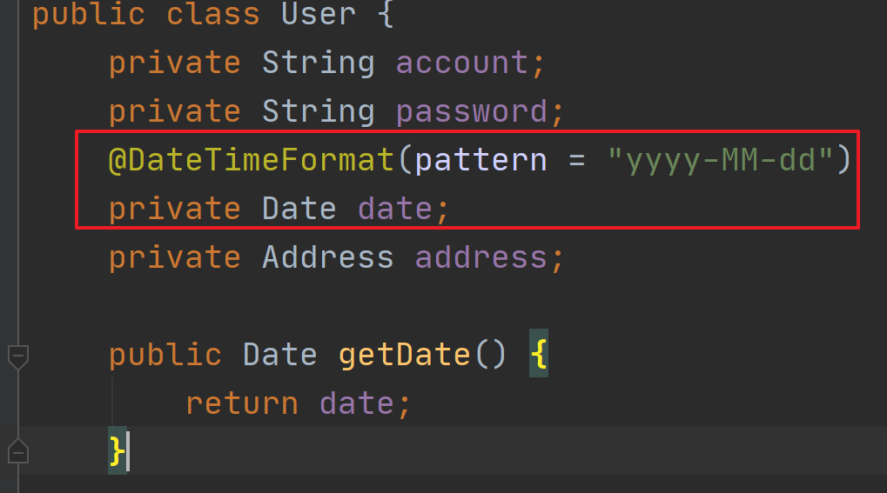

#### 示例：基本日期类型参数传递

假设你有一个控制器方法，需要接收一个日期参数。你可以使用 `@RequestParam` 注解，并指定日期格式。

```java
import org.springframework.format.annotation.DateTimeFormat;
import org.springframework.web.bind.annotation.GetMapping;
import org.springframework.web.bind.annotation.RequestParam;
import org.springframework.web.bind.annotation.RestController;

import java.util.Date;

@RestController
public class DateController {

    @GetMapping("/date")
    public String handleDate(@RequestParam("date") @DateTimeFormat(pattern = "yyyy-MM-dd") Date date) {
        System.out.println("Date: " + date);
        return "Date received: " + date;
    }
}
```

在这个例子中，`@DateTimeFormat(pattern = "yyyy-MM-dd")` 注解用于指定日期格式。假设请求URL为 `/date?date=2023-10-30`，Spring MVC会自动将请求参数 `date` 转换为 `Date` 对象。

### 6.2底层转换的原理

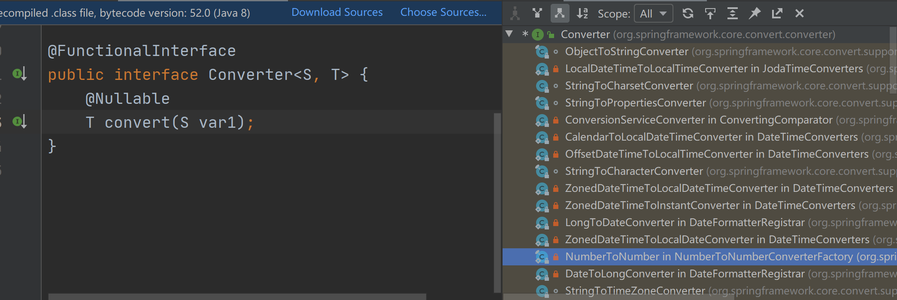

### 6.3自定义转换器

​	如果你需要处理更复杂的日期格式或自定义转换逻辑，可以使用自定义转换器。

> **自定义转换器**：适用于更复杂的日期格式或自定义转换逻辑，可以通过实现 `Converter` 接口并注册到Spring中来实现。

- #### 步骤1：创建自定义转换器

  ```java
  import org.springframework.core.convert.converter.Converter;
  import java.text.ParseException;
  import java.text.SimpleDateFormat;
  import java.util.Date;
  
  public class CustomDateConverter implements Converter<String, Date> {
  
      private final SimpleDateFormat dateFormat = new SimpleDateFormat("yyyy-MM-dd");
  
      @Override
      public Date convert(String source) {
          try {
              return dateFormat.parse(source);
          } catch (ParseException e) {
              throw new IllegalArgumentException("Invalid date format. Expected format: yyyy-MM-dd");
          }
      }
  }
  ```

- #### 步骤2：注册自定义转换器

  在Spring配置类中注册自定义转换器。

  ```java
  import org.springframework.context.annotation.Configuration;
  import org.springframework.format.FormatterRegistry;
  import org.springframework.web.servlet.config.annotation.WebMvcConfigurer;
  
  @Configuration
  public class WebConfig implements WebMvcConfigurer {
  
      @Override
      public void addFormatters(FormatterRegistry registry) {
          registry.addConverter(new CustomDateConverter());
      }
  }
  ```

- #### 步骤3：使用自定义转换器

  在控制器方法中，可以直接使用 `@RequestParam` 注解而无需额外的格式注解。

  ```java
  import org.springframework.web.bind.annotation.GetMapping;
  import org.springframework.web.bind.annotation.RequestParam;
  import org.springframework.web.bind.annotation.RestController;
  
  import java.util.Date;
  
  @RestController
  public class DateController {
  
      @GetMapping("/customDate")
      public String handleCustomDate(@RequestParam("date") Date date) {
          System.out.println("Date: " + date);
          return "Date received: " + date;
      }
  }
  ```

  

## 7.路径中占位符

- 路径占位符获取参数

  ```java
  @RequestMapping("/path")
  public class PathController {
  
      @RequestMapping("/test/{id}")
      @ResponseBody
      public String test(@PathVariable("id")String name){
          System.out.println(name);
          return "ok";
      }
  }
  ```

- 参数传递

  ```java
  http://localhost:8082/path/test/2
  ```

  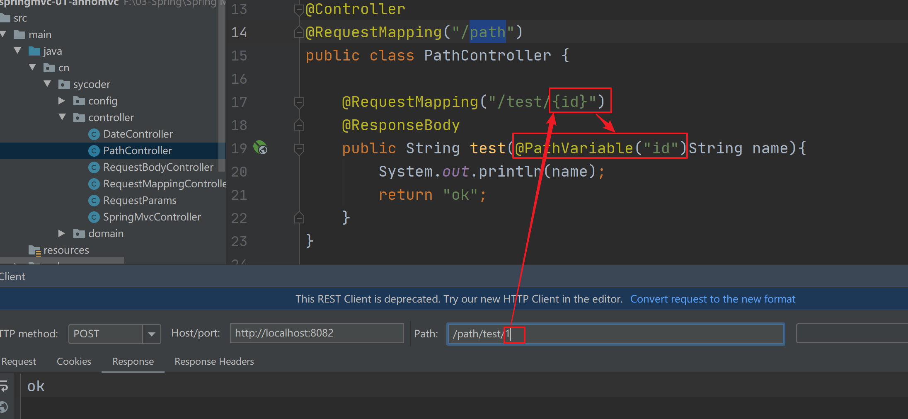

- @PathVariable

  | 名称 | @PathVariable                               |
  | ---- | ------------------------------------------- |
  | 作用 | 从请求路径上获取参数                        |
  | 位置 | 控制器方法形参前                            |
  | 属性 | String value() default ""; 指定路径参数名称 |

  

# 五、响应

## 1.注解配置的另一种方式(官网的方式)

- 配置

  ```java
  public class ServletConfig  extends AbstractAnnotationConfigDispatcherServletInitializer {
      @Override
      protected Class<?>[] getRootConfigClasses() {
          return new Class[0];
      }
  
      @Override
      protected Class<?>[] getServletConfigClasses() {
          return new Class[]{SpringMvcConfig.class};
      }
  
      @Override
      protected String[] getServletMappings() {
          return new String[]{"/"};
      }
  }
  ```
  
  > - **`getRootConfigClasses()`**：返回根上下文的配置类数组，这里为空数组，表示没有单独的根上下文配置类。
  > - **`getServletConfigClasses()`**：返回Servlet上下文的配置类数组，这里指定了 `SpringMvcConfig` 类。
  > - **`getServletMappings()`**：返回DispatcherServlet的映射路径，这里映射到所有以 `/` 开头的请求路径。
  
- 注解配置视图解析器（不要忘记）

  ```java
  @Configuration
  @ComponentScan("cn.sycoder.controller")
  @EnableWebMvc
  public class SpringMvcConfig implements WebMvcConfigurer {
  
  
     @Bean
     public ViewResolver viewResolver(){
         InternalResourceViewResolver resolver = new InternalResourceViewResolver();
         resolver.setPrefix("/WEB-INF/pages/");
         resolver.setSuffix(".jsp");
         return resolver;
     }
  }
  ```

## 2.设置响应页面

- 配置视图解析器之后跳转

  ```java
  @Controller
  public class TestController {
      @RequestMapping("/test")
      public String test(){
          return "ok.jsp";
      }
      //配置视图解析器之后的视图跳转
      @RequestMapping("/view")
      public String view(){
          return "view";
      }
  }
  ```

- 图示

  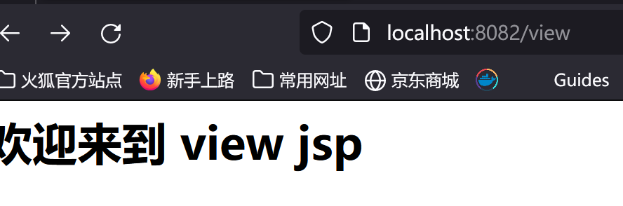

  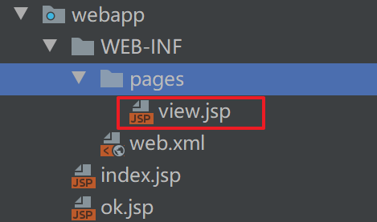

  

## 3.@ResponseBody

`@ResponseBody` 是Spring MVC提供的一个注解，用于指示控制器方法的返回值应直接写入HTTP响应体中，而不是解析为视图。这个注解在处理RESTful API时非常有用，因为它允许你直接返回JSON、XML或其他格式的数据。下面详细介绍 `@ResponseBody` 注解的用法和示例。

### 1. 基本用法

#### 示例1：返回简单的字符串

```java
import org.springframework.web.bind.annotation.GetMapping;
import org.springframework.web.bind.annotation.ResponseBody;
import org.springframework.web.bind.annotation.RestController;

@RestController
public class SimpleController {

    @GetMapping("/hello")
    @ResponseBody
    public String hello() {
        return "Hello, World!";
    }
}
```

在这个例子中，`@ResponseBody` 注解告诉Spring MVC将方法的返回值 `"Hello, World!"` 直接写入HTTP响应体中。

#### 示例2：返回JSON对象

假设你有一个 `User` 对象，包含 `id` 和 `name` 属性。

```java
public class User {
    private int id;
    private String name;

    // Getters and Setters
    public int getId() {
        return id;
    }

    public void setId(int id) {
        this.id = id;
    }

    public String getName() {
        return name;
    }

    public void setName(String name) {
        this.name = name;
    }
}
```

在控制器中，可以使用 `@ResponseBody` 注解将 `User` 对象转换为JSON格式并返回。

```java
import org.springframework.web.bind.annotation.GetMapping;
import org.springframework.web.bind.annotation.ResponseBody;
import org.springframework.web.bind.annotation.RestController;

@RestController
public class UserController {

    @GetMapping("/user")
    @ResponseBody
    public User getUser() {
        User user = new User();
        user.setId(1);
        user.setName("John Doe");
        return user;
    }
}
```

在这个例子中，Spring MVC会自动将 `User` 对象转换为JSON格式，并将其写入HTTP响应体中。

### 2. 结合 `@PostMapping` 和 `@PutMapping`

#### 示例3：处理POST请求并返回JSON

```java
import org.springframework.web.bind.annotation.PostMapping;
import org.springframework.web.bind.annotation.RequestBody;
import org.springframework.web.bind.annotation.ResponseBody;
import org.springframework.web.bind.annotation.RestController;

@RestController
public class UserController {

    @PostMapping("/user")
    @ResponseBody
    public User createUser(@RequestBody User user) {
        // 处理用户创建逻辑
        return user;
    }
}
```

在这个例子中，`@RequestBody` 注解用于将请求体中的JSON数据绑定到 `User` 对象上，然后 `@ResponseBody` 注解将返回的 `User` 对象转换为JSON格式并写入HTTP响应体中。

### 3. 返回自定义对象

#### 示例4：返回包含多个属性的自定义对象

假设你有一个 `ResponseMessage` 对象，用于封装响应消息和状态码。

```java
public class ResponseMessage {
    private String message;
    private int statusCode;

    // Getters and Setters
    public String getMessage() {
        return message;
    }

    public void setMessage(String message) {
        this.message = message;
    }

    public int getStatusCode() {
        return statusCode;
    }

    public void setStatusCode(int statusCode) {
        this.statusCode = statusCode;
    }
}
```

在控制器中，可以使用 `@ResponseBody` 注解返回 `ResponseMessage` 对象。

```java
import org.springframework.web.bind.annotation.GetMapping;
import org.springframework.web.bind.annotation.ResponseBody;
import org.springframework.web.bind.annotation.RestController;

@RestController
public class MessageController {

    @GetMapping("/message")
    @ResponseBody
    public ResponseMessage getMessage() {
        ResponseMessage message = new ResponseMessage();
        message.setMessage("Request processed successfully");
        message.setStatusCode(200);
        return message;
    }
}
```

在这个例子中，Spring MVC会自动将 `ResponseMessage` 对象转换为JSON格式，并将其写入HTTP响应体中。

### 4. 返回集合

#### 示例5：返回用户列表

假设你有一个 `User` 列表。

```java
import org.springframework.web.bind.annotation.GetMapping;
import org.springframework.web.bind.annotation.ResponseBody;
import org.springframework.web.bind.annotation.RestController;

import java.util.Arrays;
import java.util.List;

@RestController
public class UserController {

    @GetMapping("/users")
    @ResponseBody
    public List<User> getUsers() {
        User user1 = new User();
        user1.setId(1);
        user1.setName("John Doe");

        User user2 = new User();
        user2.setId(2);
        user2.setName("Jane Smith");

        return Arrays.asList(user1, user2);
    }
}
```

在这个例子中，Spring MVC会自动将 `List<User>` 转换为JSON数组，并将其写入HTTP响应体中。

### 总结

> - **`@ResponseBody` 注解**：用于指示控制器方法的返回值应直接写入HTTP响应体中，而不是解析为视图。
> - **常见用法**：
>   - 返回简单的字符串。
>   - 返回JSON对象。
>   - 处理POST请求并返回JSON。
>   - 返回自定义对象。
>   - 返回集合。
>


# 六、域对象共享

## 1.HttpServletRequest

- 具体应用

  ```java
  @RequestMapping("/ok")
      public String okServletRequest(HttpServletRequest request){
          request.setAttribute("ok","66666");
          return "ok";
      }
  ```

- jsp

  ```jsp
  <%@ page contentType="text/html;charset=UTF-8" language="java" %>
  <%@ taglib uri="http://java.sun.com/jsp/jstl/core" prefix="c" %>
  <%@page isELIgnored="false" %>
  <html>
  <head>
      <title>Title</title>
  </head>
  <body>
  ${ok}
  </body>
  </html>
  ```

  

  

## 2.ModelAndView（不常用）

- 具体应用

  ```java
  @RequestMapping("/modelAndView")
      public ModelAndView modelAndView(){
          ModelAndView view = new ModelAndView();
          // 设置视图名称
          view.setViewName("ok");
          // 添加模型数据
          view.addObject("ok","==============");
          return view;
      }
  ```

- jsp

  ```jsp
  <%@ page contentType="text/html;charset=UTF-8" language="java" %>
  <%@ taglib uri="http://java.sun.com/jsp/jstl/core" prefix="c" %>
  <%@page isELIgnored="false" %>
  <html>
  <head>
      <title>Title</title>
  </head>
  <body>
  ${ok}
  </body>
  </html>
  ```

## 3.Map 向 Request 中共享数据

- 具体应用

  ```java
  @RequestMapping("/testMap")
  public String testMap(Map<String,Object> map){
      map.put("ok","-------------");
      return "ok";
  }
  ```

- jsp

  ```jsp
  <%@ page contentType="text/html;charset=UTF-8" language="java" %>
  <%@ taglib uri="http://java.sun.com/jsp/jstl/core" prefix="c" %>
  <%@page isELIgnored="false" %>
  <html>
  <head>
      <title>Title</title>
  </head>
  <body>
  ${ok}
  </body>
  </html>
  ```

  

# 七、RESTFul 风格

## 1.REST简介

- RESTful（Representational State Transfer）是一种软件架构风格，用于设计网络应用程序，特别是Web服务。RESTful架构的核心思想是通过HTTP协议与服务器进行交互，利用HTTP方法（如GET、POST、PUT、DELETE等）对资源进行操作。

## 2.传统访问资源和 REST 对照

| 操作     | 传统方式              | REST风格              |
| -------- | --------------------- | --------------------- |
| 查询操作 | /student/getById?id=5 | student/5 get请求     |
| 保存操作 | /saveStudent          | student   post 请求   |
| 更新     | /updateStudent        | student   put 请求    |
| 删除     | /deleteById?id=5      | student/5 delete 请求 |

- REST 优点
  - 隐藏资源访问行为，做到无法根据资源访问猜测是什么样的逻辑
  - 书写也简单化
- 注意
  - REST 风格只是一种约定方式，并不是规范
  - 以后通过 REST 风格访问网络资源就叫 RESTFul

## 3.案例实现

### 3.1案例分析

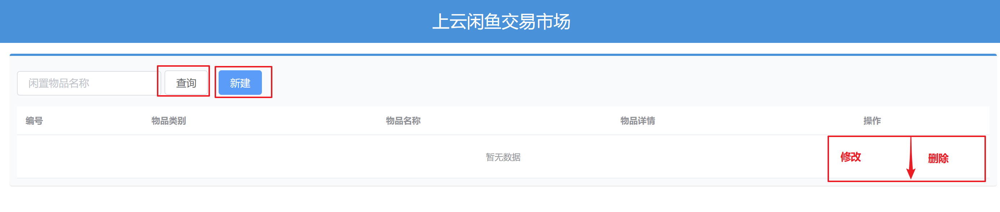

### 3.2传统实现方式

- 实现

  ```java
  @Controller
  @RequestMapping("/item")
  public class ItemController {
  
      //增加
      @RequestMapping("/save")
      @ResponseBody
      public String save(@RequestBody Item item){
          System.out.println(item);
          return "save OK";
      }
      //删除
      @RequestMapping("/delete")
      @ResponseBody
      public String delete(Long id){
          System.out.println(id);
          return "delete OK";
      }
      //修改
      @RequestMapping("/update")
      @ResponseBody
      public String update(@RequestBody Item item){
          System.out.println(item);
          return "update OK";
      }
      //查询
      @RequestMapping("/getById")
      @ResponseBody
      public String getById(Long id){
          System.out.println(id);
          return "getById OK";
      }
  }
  ```

### 3.3RESTFul 实现方式

- 实现

  ```java
  @RestController
  public class ItemRestController {
      //增加
      @PostMapping("/item")
      public String save(@RequestBody Item item){
          System.out.println(item);
          return "rest save OK";
      }
      //删除
      @DeleteMapping("/item/{id}")
      public String delete(@PathVariable Long id){
          System.out.println(id);
          return "rest delete OK";
      }
      //修改
      @PutMapping("/item")
      public String update(@RequestBody Item item){
          System.out.println(item);
          return "rest update OK";
      }
      //查询
      @GetMapping("/item/{id}")
      public String getById(@PathVariable Long id){
          System.out.println(id);
          return "rest getById OK";
      }
  }
  ```

## 4.静态资源的处理（⭐️）

### 4.1拷贝静态资源到项目webapp 下面

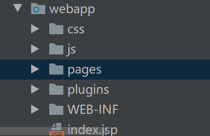

- 但是出现如下问题

  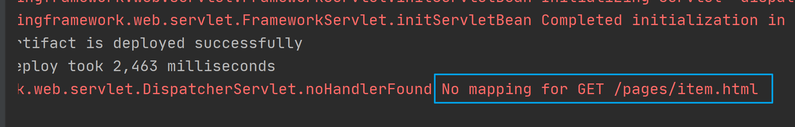

  

- 原因：SpringMVC 拦截了静态资源，根据 /pages/item.html 去找对于的 controller 方法执行，匹配我们配置的 / 的getServletMappings，找不到所以 404 

### 4.2解决方案

- 配置静态资源放行就可以了

- 配置如下

  ```java
  @Configuration
  public class StaticSupport extends WebMvcConfigurationSupport {
  
      @Override
      protected void addResourceHandlers(ResourceHandlerRegistry registry) {
          //当访问 /pages/ 资源的时候，设置放行
          registry.addResourceHandler("/pages/**").addResourceLocations("/pages/");
          registry.addResourceHandler("/js/**").addResourceLocations("/js/");
          registry.addResourceHandler("/css/**").addResourceLocations("/css/");
          registry.addResourceHandler("/plugins/**").addResourceLocations("/plugins/");
  
      }
  }
  ```

- 注意，需要将静态支持交给 springmvc 管理

  ```java
  @Configuration
  @ComponentScan("cn.sycoder")
  @EnableWebMvc
  public class SpringMvcConfig  {
  }
  ```

  