# 一、回顾SpringMVC访问接口流程


## 1.容器加载分析

- 容器分析

  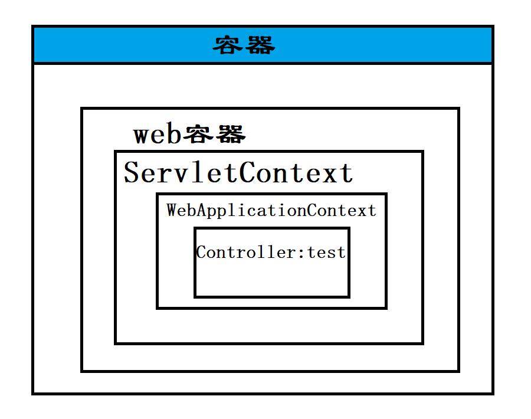

- 手动注册WebApplicationContext

  ```java
  public class ServletConfig extends AbstractDispatcherServletInitializer {
  
      @Override
      protected WebApplicationContext createServletApplicationContext() {
          //获取SpringMVC容器
          AnnotationConfigWebApplicationContext context = new AnnotationConfigWebApplicationContext();
          context.register(SpringMvcConfig.class);
          return context;
      }
  
      @Override
      protected String[] getServletMappings() {
          return new String[]{"/"};
      }
  
      @Override
      protected WebApplicationContext createRootApplicationContext() {
          return null;
      }
  }
  ```

## 2.容器加载过程分析

- tomcat 服务器启动的时候，加载ServletConfig类之后，做初始化web容器操作，相当于 web.xml

- 执行注册容器的方法,获取 SpringMVC容器 WebApplicationContext

  ```java
  @Nullable
      protected WebApplicationContext createRootApplicationContext() {
          Class<?>[] configClasses = this.getRootConfigClasses();
          if (!ObjectUtils.isEmpty(configClasses)) {
              AnnotationConfigWebApplicationContext context = new AnnotationConfigWebApplicationContext();
              context.register(configClasses);
              return context;
          } else {
              return null;
          }
      }
  
      protected WebApplicationContext createServletApplicationContext() {
          AnnotationConfigWebApplicationContext context = new AnnotationConfigWebApplicationContext();
          Class<?>[] configClasses = this.getServletConfigClasses();
          if (!ObjectUtils.isEmpty(configClasses)) {
              context.register(configClasses);
          }
  
          return context;
      }
  ```

- 通过@ComponentScan("cn.sycoder.controller") 加载 Controller 下面的bean 进 WebApplicationContext

  ```java
  @RestController
  public class TestController {
  
      @GetMapping("/test/{id}")
      public String test(@PathVariable Long id) {
          return "ok:" + id;
      }
  }
  ```

- 把使用了 RequestMapping 注解的方法的 value --- 对应一个方法，建立起了一对一映射关系（可以想象hashmap）

  - /test/{id} ---- test 方法

## 3.请求接口过程

- 访问 http://localhost:8082/test/1
- 匹配 springmvc 的 /  servletMapping 规则，交给 springmvc 处理
- 解析 /test/1路径找到对应的 test 方法
- 执行方法
- 因为使用 RestController ，所以返回方法的返回值作为响应体返回给浏览器

## 4.SSM整合会出现bean界定不清楚问题

- SpringMVC 需要加载哪些bean?
  - controller 层（表现层即可）
- Spring 加载哪些bean?
  - service
  - dao

### 4.1如何处理

- 将spring配置注入到 web 容器中

  ```java
  @Configuration
  @ComponentScan(value={"cn.sycoder.service","cn.sycoder.dao"})
  public class SpringConfig {
  }
  
  ```

  

  ```java
  public class ServletConfig  extends AbstractAnnotationConfigDispatcherServletInitializer {
      @Override
      protected Class<?>[] getRootConfigClasses() {
          return new Class[]{SpringConfig.class};
      }
  
      @Override
      protected Class<?>[] getServletConfigClasses() {
          return new Class[]{SpringMvcConfig.class};
      }
  
      @Override
      protected String[] getServletMappings() {
          return new String[]{"/"};
      }
  }
  ```

### 4.2验证两个容器的bean相互不干扰

- 验证代码

  ```java
  @Test
  public void test(){
      AnnotationConfigApplicationContext applicationContext =
              new AnnotationConfigApplicationContext(SpringConfig.class);
      ITestService bean = applicationContext.getBean(ITestService.class);
      bean.get(1L);
  
      TestController bean1 = applicationContext.getBean(TestController.class);
      System.out.println(bean1.test(1L));
  }
  ```

  

# 二、SSM整合

## 1.SSM整合流程分析

- 概述SSM：Spring SpringMVC Mybatis

### 1.1创建工程

- 导入依赖

  - ssm 所需要的依赖包

- 配置 web 项目入口配置替换 web.xml（AbstractAnnotationConfigDispatcherServletInitializer）

  - 配置 Spring 配置类交给 web 容器管理

    ```java
    @Override
        protected Class<?>[] getRootConfigClasses() {
            return new Class[]{SpringConfig.class};
        }
    ```

  - 配置 SpringMVC 配置类交给 web 容器管理

    ```java
    @Override
        protected Class<?>[] getServletConfigClasses() {
            return new Class[]{SpringMvcConfig.class};
        }
    ```

  - 配置请求拦截规则,交给 springmvc 处理

    ```java
    @Override
        protected String[] getServletMappings() {
            return new String[]{"/"};
        }
    ```

  

### 1.2配置 Spring

- SpringConfig
  - @Configuration 标记Spring配置类，替换Spring-config-xml
  - @ComponetScan 扫描需要被Spring 管理的bean
  - @EnableTransactionManagment 启动管理事务支持
  - @PropertySource 引入db.properties 配置文件
- 配置 JdbcConfig 配置类
  - 使用德鲁伊 DataSource 数据源
  - 构建平台事务管理器 DataSourceTransactionManager
- 配置 MyBatis 配置类
  - 构建 SqlSessionFactoryBean
  - 指定 MapperScanner 设置 mapper 包扫描寻找 mapper.xml 文件


### 1.3配置 SpringMVC

- 配置SpringMvcConfig
  - @Configuration
  - @ComponentScan 只扫描 Controller
  - 开启SpringMVC 注解支持 @EnableWebMvc


### 1.4开发业务

- 使用注解
  - 注入bean 注解
    - @Autowired
  - @RestController
    - @GetMapping
      - @RequestParam
    - @PostMapping
      - @RequestBody
    - @DeleteMapping
      - @PathVariable
    - @PutMapping
  - @Service
    - @Transactional
  - junit
    - @RunWith
    - @ContextConfiguration
    - @Test

## 2.SSM整合

### 2.1导入依赖

- 依赖

  ```java
  <dependencies>
      <dependency>
        <groupId>org.springframework</groupId>
        <artifactId>spring-webmvc</artifactId>
        <version>5.2.17.RELEASE</version>
      </dependency>
  
      <dependency>
        <groupId>org.springframework</groupId>
        <artifactId>spring-jdbc</artifactId>
        <version>5.2.17.RELEASE</version>
      </dependency>
  
      <dependency>
        <groupId>org.springframework</groupId>
        <artifactId>spring-test</artifactId>
        <version>5.2.17.RELEASE</version>
      </dependency>
  
      <dependency>
        <groupId>org.mybatis</groupId>
        <artifactId>mybatis</artifactId>
        <version>3.5.6</version>
      </dependency>
  
      <dependency>
        <groupId>org.mybatis</groupId>
        <artifactId>mybatis-spring</artifactId>
        <version>1.3.0</version>
      </dependency>
  
      <dependency>
        <groupId>mysql</groupId>
        <artifactId>mysql-connector-java</artifactId>
        <version>8.0.29</version>
      </dependency>
  
      <dependency>
        <groupId>com.alibaba</groupId>
        <artifactId>druid</artifactId>
        <version>1.1.16</version>
      </dependency>
  
      <dependency>
        <groupId>junit</groupId>
        <artifactId>junit</artifactId>
        <version>4.12</version>
        <scope>test</scope>
      </dependency>
  
      <dependency>
        <groupId>javax.servlet</groupId>
        <artifactId>javax.servlet-api</artifactId>
        <version>3.1.0</version>
        <scope>provided</scope>
      </dependency>
  
      <dependency>
        <groupId>com.fasterxml.jackson.core</groupId>
        <artifactId>jackson-databind</artifactId>
        <version>2.9.0</version>
      </dependency>
    </dependencies>
  ```

### 2.2创建各目录结构

- 目录如下

  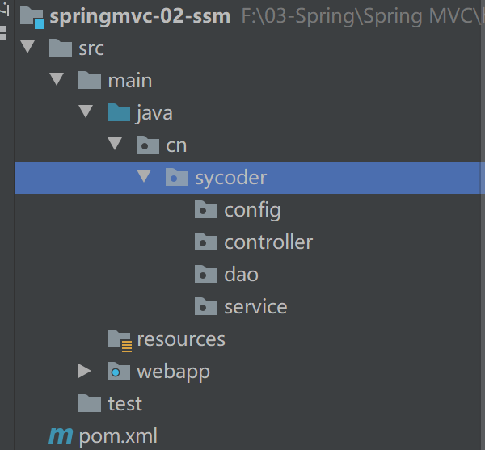

### 2.3创建SpringConfig

- SpringConfig

  ```java
  @Configuration
  @ComponentScan(value = {"cn.sycoder.service","cn.sycoder.dao"})
  @EnableTransactionManagement
  @PropertySource("classpath:db.properties")
  @Import({DbConfig.class,MybatisConfig.class})
  public class SpringConfig {
  }
  ```


### 2.4创建DbConfig配置类

- 创建数据库配置文件

  ```java
  jdbc.url=jdbc:mysql://localhost:3306/ssm
  jdbc.driver=com.mysql.cj.jdbc.Driver
  jdbc.username=root
  jdbc.password=123456
  ```

- 创建DbConfig

  ```java
  public class DbConfig {
      
      @Value("${jdbc.url}")
      private String url;
      @Value("${jdbc.driver}")
      private String driver;
      @Value("${jdbc.username}")
      private String username;
      @Value("${jdbc.password}")
      private String password;
  
      /**
       * 配置德鲁伊连接池
       * @return
       */
      @Bean
      public DataSource dataSource(){
          DruidDataSource source = new DruidDataSource();
          source.setUrl(url);
          source.setDriverClassName(driver);
          source.setPassword(password);
          source.setUsername(username);
          return source;
      }
      
      @Bean
      public PlatformTransactionManager transactionManager(DataSource dataSource){
          DataSourceTransactionManager manager = new DataSourceTransactionManager();
          manager.setDataSource(dataSource);
          return manager;
      }
      
  }
  ```

### 2.5创建MybatisConfig配置类

- MyBatisConfig

  ```java
  public class MybatisConfig {
      
      @Bean
      public SqlSessionFactoryBean sessionFactoryBean(DataSource dataSource){
          SqlSessionFactoryBean bean = new SqlSessionFactoryBean();
          bean.setDataSource(dataSource);
          bean.setTypeAliasesPackage("cn.sycoder.domain");
          return bean;
      }
      
      @Bean
      public MapperScannerConfigurer mapperScannerConfigurer(){
          MapperScannerConfigurer configurer = new MapperScannerConfigurer();
          configurer.setBasePackage("cn.sycoder.dao");
          return configurer;
      }
  }
  ```

  

### 2.6创建SpringMVC配置类

- SpringMvcConfig

  ```java
  @Configuration
  @ComponentScan("cn.sycoder.controller")
  @EnableWebMvc
  public class SpringMvcConfig {
  }
  ```

  

### 2.7创建Web项目入口配置类

- ServletConfig

  ```java
  public class ServletConfig extends AbstractAnnotationConfigDispatcherServletInitializer {
      @Override
      protected Class<?>[] getRootConfigClasses() {
          return new Class[]{SpringConfig.class};//配置Spring交给Web 管理
      }
  
      @Override
      protected Class<?>[] getServletConfigClasses() {
          return new Class[]{SpringMvcConfig.class};
      }
  
      @Override
      protected String[] getServletMappings() {
          return new String[]{"/"};
      }
  }
  ```

  

## 3.功能开发

### 3.1创建数据库及表

- 创建 ssm 数据库

- 创建 item 表

  ```java
  create table item
  (
  	id bigint auto_increment,
  	type varchar(64) null,
  	name varchar(64) null,
  	remark text null,
  	constraint item_pk
  		primary key (id)
  );
  
  ```

### 3.2编写模型类

- 添加 lombok 依赖

  ```java
  <dependency>
    <groupId>org.projectlombok</groupId>
    <artifactId>lombok</artifactId>
    <version>1.18.22</version>
  </dependency>
  ```

  

- 模型类

  ```java
  @Data
  public class Item {
      private Long id;
      private String name;
      private String type;
      private String remark;
  }
  ```

### 3.3编写Mapper接口

- Mapper 接口

  ```java
  @Repository
  public interface ItemMapper {
      @Insert("insert into item(name,type,remark) value(#{name},#{type},#{remark})")
      public int save(Item item);
      @Delete("delete from item where id = #{id}")
      public int delete(Long id);
      @Update("update item set name = #{name},type = #{type},remark=#{remark} where id=#{id}")
      public int update(Item item);
      @Select("select * from item where id = #{id}")
      public Item getById(Long id);
      @Select("select * from item")
      public List<Item> list();
  
  }
  ```

### 3.4编写Service接口和实现类

- Service 接口

  ```java
  public interface IItemService {
      /**
       * 添加闲置物品方法
       * @param item
       * @return
       */
      public boolean save(Item item);
  
      /**
       * 删除闲置物品
       * @param id
       * @return
       */
      public boolean delete(Long id);
  
      /**
       * 更新闲置物品
       * @param item
       * @return
       */
      public boolean update(Item item);
  
      /**
       * 查询闲置物品通过id
       * @param id
       * @return
       */
      public Item getById(Long id);
  
      /**
       * 查询所有闲置商品
       * @return
       */
      public List<Item> lists();
  }
  ```

- 定义接口实现类

  ```java
  @Service
  public class ItemServiceImpl implements IItemService {
      
      @Autowired
      ItemMapper mapper;
      
      @Override
      @Transactional
      public boolean save(Item item) {
          return mapper.save(item) > 0;
      }
  
      @Override
      @Transactional
      public boolean delete(Long id) {
          return mapper.delete(id) >0;
      }
  
      @Override
      @Transactional
      public boolean update(Item item) {
          return mapper.update(item) >0;
      }
  
      @Override
      public Item getById(Long id) {
          return mapper.getById(id);
      }
  
      @Override
      public List<Item> lists() {
          return mapper.list();
      }
  }
  ```

### 3.5编写Contorller类

- Controller

  ```java
  @RestController
  @RequestMapping("/item")
  public class ItemController {
  
      @Autowired
      IItemService service;
  
      @PostMapping
      public boolean save(@RequestBody Item item){
          return service.save(item);
      }
  
      @PutMapping
      public boolean update(@RequestBody Item item){
          return service.update(item);
      }
  
      @DeleteMapping("/{id}")
      public boolean delete(@PathVariable Long id){
          return service.delete(id);
      }
  
      @GetMapping("/{id}")
      public Item getById(@PathVariable Long id){
          return service.getById(id);
      }
  
      @GetMapping
      public List<Item> list(){
          return service.lists();
      }
  }
  ```

  

## 4.验证 ssm 整合结果

- ### 启动项目并且解决问题

  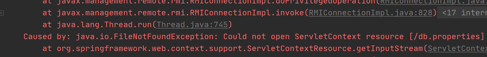

- 修改Spring配置类

  ```java
  @Configuration
  @ComponentScan(value = {"cn.sycoder.service","cn.sycoder.dao"})
  @EnableTransactionManagement
  @PropertySource("classpath:db.properties")
  @Import({DbConfig.class,MybatisConfig.class})
  public class SpringConfig {
  }
  ```

  

### 4.1添加item 数据

- 准备 item 数据

  ```java
  {"name":"键盘","type":"电脑外设","remark":"9成新，半价卖"}
  ```

  ```java
  {"name":"笔记本","type":"电脑","remark":"9成新，8折出售"}
  ```

  ```java
  {"name":"鞋子","type":"收藏鞋","remark":"科比签名的，独一无二"}
  ```

- 添加数据

  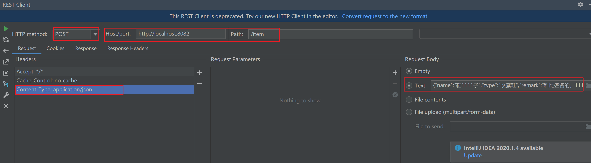

### 4.2修改数据

- 准备数据

  ```java
  {"id":4,"name":"二手鞋子","type":"废鞋","remark":"破鞋子"}
  ```

- 修改操作

  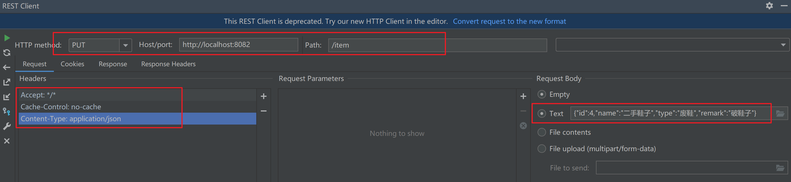


### 4.3查询单个数据

- 查询id=4的物品

  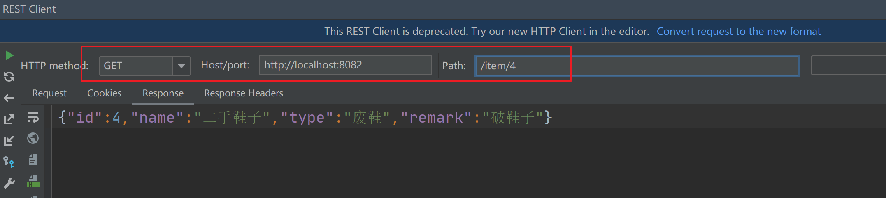


### 4.4删除单个数据

- 删除id=4的物品

  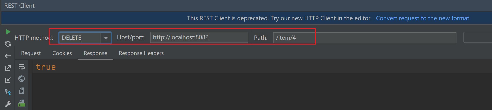


### 4.5查询全部数据操作

- 查询全部

  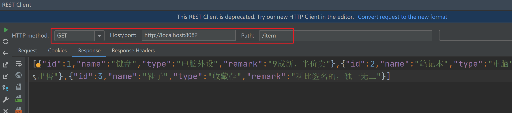

## 5.整合单元测试

- 目录结构

  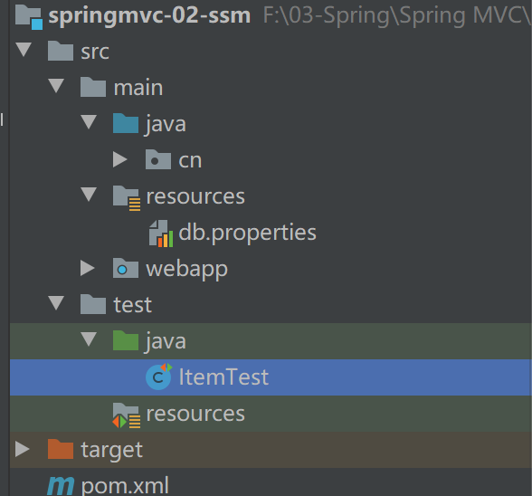

- 新建测试类

  ```java
  @RunWith(SpringJUnit4ClassRunner.class)
  @ContextConfiguration(classes = SpringConfig.class)
  public class ItemTest {
  
      @Autowired
      IItemService service;
  
  
      @Test
      public void save(){
          Item item = new Item();
          item.setName("单元测试");
          item.setRemark("单元测试");
          item.setType("单元测试");
          boolean save = service.save(item);
          System.out.println(save);
      }
  
      @Test
      public void update(){
          Item item = new Item();
          item.setId(5L);
          item.setName("单元测试");
          item.setRemark("单元测试");
          item.setType("单元测试");
          boolean save = service.update(item);
          System.out.println(save);
      }
  
      @Test
      public void getById(){
          Item byId = service.getById(5L);
          System.out.println(byId);
      }
  
      @Test
      public void list(){
          List<Item> lists = service.lists();
          System.out.println(lists);
      }
  }
  ```

  

# 三、项目实战中细节问题

## 1.导入前端资源

### 1.1静态资源拦截处理

- 设置访问 index 访问主页

  ```java
  @Controller
  public class IndexController {
      @RequestMapping("/index")
      public String index(){
          System.out.println("----------------");
          return "/pages/items.html";
      }
  
  }
  ```

  

- 出现静态资源被拦截问题

  ```java
  @Configuration
  public class StaticSupport extends WebMvcConfigurationSupport {
  
      @Override
      protected void addResourceHandlers(ResourceHandlerRegistry registry) {
          registry.addResourceHandler("/pages/**").addResourceLocations("/pages/");
          registry.addResourceHandler("/js/**").addResourceLocations("/js/");
          registry.addResourceHandler("/css/**").addResourceLocations("/css/");
          registry.addResourceHandler("/plugins/**").addResourceLocations("/plugins/");
  
      }
  }
  ```

- 将 staticSupport 交给 SpringMvc 管理

  ```java
  @Configuration
  @ComponentScan(value = {"cn.sycoder.controller","cn.sycoder.config"})
  @EnableWebMvc
  public class SpringMvcConfig {
  }
  ```


### 1.2项目实现

- 保存方法

  ```html
  handleAdd () {
      console.log("========")
      axios.post("/item",this.formData).then((res)=>{
          //todo
      })
  },
  ```

- 列表查询

  ```java
  getAll() {
      axios.get("/item",).then((res)=>{
          this.dataList = res.data;
      })
  },
  ```

- 删除操作

  ```java
  handleDelete(row) {
      axios.delete("/item/"+row.id).then((res)=>{
          //todo
      })
  }
  ```

- 编辑操作

  ```java
  ```

  

## 2.全局统一结果集处理

### 2.1分析目前写代码存在的问题

- 查询单个物品时返回单条数据

  ```java
  {"id":2,"name":"笔记本","type":"电脑","remark":"9成新，8折出售"}
  ```

- 查询列表返回列表数据

  ```java
  [{"id":1,"name":"键盘","type":"电脑外设","remark":"9成新，半价卖"},{"id":2,"name":"笔记本","type":"电脑","remark":"9成新，8折出售"},{"id":3,"name":"鞋子","type":"收藏鞋","remark":"科比签名的，独一无二"},{"id":5,"name":"单元测试","type":"单元测试","remark":"单元测试"}]
  ```

- 删除数据返回单个结果

  ```java
  true
  ```

- **目前对于系统而言参数了三种数据类型**

  - 不能做到前后端同时开发
  - 前后端的交互很乱

- 最后处理

  ```java
  {"data":true}
  {"data":{"id":2,"name":"笔记本","type":"电脑","remark":"9成新，8折出售"}}
  
  
  {
      "code":2000,
      "data":true,
      "msg":"详情"  
  }
  ```


### 2.2处理方式

- 通过定义一个统一结果集处理

  ```java
  {
      "code":2000,
      "data":true,
      "msg":"详情"  
  }
  ```

- 后端实体

  ```java
  @Data
  public class ResultResp {
      private Integer code;
      private Object data;
      private String msg;
  }
  ```

- 后端返回实体最终结果

  ```java
  @Data
  public class ResultResp {
      private Integer code;
      private Object data;
      private String msg;
  
      public ResultResp(){
      }
  
      public ResultResp(Integer code,Object data){
          this.code = code;
          this.data=data;
      }
  
      public ResultResp(Integer code,Object data,String msg){
          this.code=code;
          this.data=data;
          this.msg=msg;
      }
  
      public static ResultResp success(Integer code,Object data){
          return new ResultResp(code,data);
      }
  }
  ```

- 状态码类

  ```java
  public class Code {
      /**
       * 定义好协议之后，前端和后端统一按照协议执行
       */
      public static final Integer SAVE_OK = 20000;
      public static final Integer SAVE_FAIL = 20001;
  
  
      public static final Integer UPDATE_OK = 20010;
      public static final Integer UPDATE_FAIL = 20011;
  
      public static final Integer DELETE_OK = 20020;
      public static final Integer DELETE_FAIL = 20021;
  
      public static final Integer GET_OK = 20030;
      public static final Integer GET_FAIL = 20031;
  
      public static final Integer PAGE_OK = 20040;
      public static final Integer PAGE_FAIL = 20041;
  }
  ```

  

- 修改控制层返回代码

  - save 方法

    ```java
    @PostMapping
    public ResultResp save(@RequestBody Item item){
        boolean ret = service.save(item);
        return new ResultResp(ret? Code.SAVE_OK:Code.SAVE_FAIL,ret);
    }
    ```

    

    

  - update 方法

    ```java
    @PutMapping
    public ResultResp update(@RequestBody Item item){
        boolean ret = service.update(item);
        return new ResultResp(ret? Code.UPDATE_OK:Code.UPDATE_FAIL,ret);
    }
    ```

    

  - delete 方法

    ```java
    @DeleteMapping("/{id}")
    public ResultResp delete(@PathVariable Long id){
        boolean ret = service.delete(id);
        return new ResultResp(ret? Code.DELETE_OK:Code.DELETE_FAIL,ret);
    }
    ```

    

  - 单个结果集处理

    ```java
    @GetMapping("/{id}")
    public ResultResp getById(@PathVariable Long id){
        Item ret = service.getById(id);
        return ResultResp.success(ret==null?Code.GET_FAIL:Code.GET_OK,ret);
    }
    ```

    

  - 集合结果集

    ```java
    @GetMapping
    public ResultResp list(){
        List<Item> ret = service.lists();
        return ResultResp.success(ret==null?Code.PAGE_FAIL:Code.PAGE_OK,ret);
    }
    ```

    

- 最终实现截图

  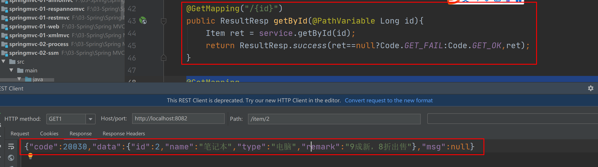

  

### 2.3前后端联调

- 保存操作

  ```java
  handleAdd() {
      console.log("========")
      axios.post("/item", this.formData).then((res) => {
          if (res.data.code == 20000) {
              //关闭新增弹框
              this.dialogFormVisible = false;
              this.$message.success("添加物品成功")
          } else {
              this.$message.error("添加失败")
          }
      }).finally(() => {
          this.getAll();
      })
  },
  ```

- 列表查询

  ```java
  getAll() {
      axios.get("/item",{
              params:{
                  name:this.pagination.queryString
              }
      }).then((res)=>{
          // this.dataList = res.data;
          if(res.data.code == 20040){
              this.dataList = res.data.data;
          }else{
              this.$message.error("加载失败")
          }
      })
  },
  ```

- 删除操作

  ```java
   handleDelete(row) {
      axios.delete("/item/" + row.id).then((res) => {
          if (res.data.code == 20020) {
              this.$message.success("删除物品成功")
          } else {
              this.$message.error("删除失败")
          }
      }).finally(() => {
          this.getAll();
      })
  }
  ```

  

- 编辑操作

  ```java
  handleEdit() {
      axios.put("/item", this.formData).then((res) => {
          if (res.data.code == 20010) {
              this.dialogFormVisible4Edit = false;
              this.$message.success("编辑物品成功")
          } else {
              this.$message.error("编辑失败")
          }
      }).finally(() => {
          this.getAll();
      })
  },
  ```

  

- 高级查询修改

  - controller

    ```java
    @GetMapping
        public ResultResp list(@RequestParam(required = false) String name){
            List<Item> ret = service.lists(name);
            return ResultResp.success(ret==null?Code.PAGE_FAIL:Code.PAGE_OK,ret);
        }
    ```

  - 业务层

    ```java
    @Override
        public List<Item> lists(String name) {
            if (name != null && !"".equals(name.trim())) {
    
                return mapper.list(name);
            }
    
            return mapper.listNull();
        }
    ```

  - mapper 接口

    ```java
    @Select("select * from item where name like concat('%',#{name},'%')")
    public List<Item> list(String name);
    
    @Select("select * from item ")
    public List<Item> listNull();
    ```

## 3.全局统一异常处理

### 3.1目前存在问题

- 模拟后台出现服务器异常

  ```java
  @GetMapping
      public ResultResp list(@RequestParam(required = false) String name){
          System.out.println(1/0);
          List<Item> ret = service.lists(name);
          return ResultResp.success(ret==null?Code.PAGE_FAIL:Code.PAGE_OK,ret);
      }
  ```

- 出现如下错误

  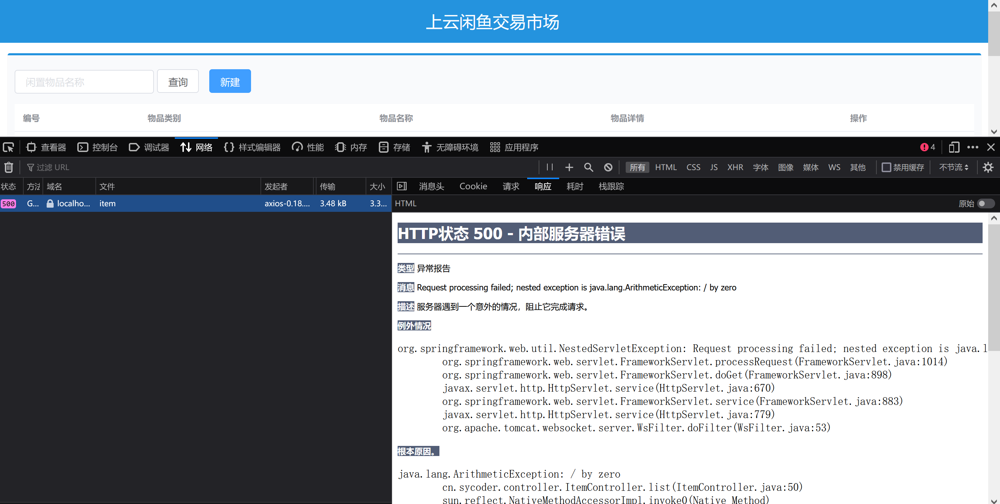

### 3.2后端服务可能会出现的异常

- 框架可能报错

- 持久层代码报错

- 业务层业务代码报错

- 控制层业务代码报错

- 注意：这些异常不能避免的，此时应该把所有的异常在表现层进行统一的处理（aop）

- 解决方案

  ```java
  @RestControllerAdvice
  public class ExceptionHandlerController {
  
      @ExceptionHandler(ArithmeticException.class)
      public ResultResp handlerException(){
          System.out.println("出现异常了");
          return new ResultResp(500,null,"服务繁忙，请稍后再试");
      }
  }
  ```

  

  

### 3.3@RestControllerAdvice

- 使用来做控制器增强操作

  | 名称 | @RestControllerAdvice |
  | ---- | --------------------- |
  | 位置 | Rest 风格增强类上     |
  | 作用 | 给控制器做增强操作    |
  | 使用 | 类上面                |

  - 包含了如下注解
    - @ResponseBody
    - @ControllerAdvice
    - @Component

### 3.4@ExceptionHandler

- 异常处理器

  | 名称 | @ExceptionHandler                                            |
  | ---- | ------------------------------------------------------------ |
  | 位置 | 方法上                                                       |
  | 属性 | 具体的异常类型                                               |
  | 作用 | 处理具体异常的，设定具体异常类型，出现异常后，终止controller中方法的执行，转入当前方法执行 |

  

### 3.5项目中具体处理

- 业务异常

  ```java
  @Data
  public class BusinessException extends RuntimeException{
      private Integer code;
  }
  ```

- 持久层异常

  ```java
  @Data
  public class DaoException extends RuntimeException{
      private Integer code;
  }
  ```

- 系统异常

  ```java
  @Data
  public class SystemException extends RuntimeException{
      private Integer code;
  }
  ```

- 其它异常

  ```java
  @Data
  public class OtherException extends RuntimeException{
      private Integer code;
  }
  
  ```

  

- 定义code

  ```java
  public class Code {
      /**
       * 定义好协议之后，前端和后端统一按照协议执行
       */
      public static final Integer SAVE_OK = 20000;
      public static final Integer SAVE_FAIL = 20001;
  
  
      public static final Integer UPDATE_OK = 20010;
      public static final Integer UPDATE_FAIL = 20011;
  
      public static final Integer DELETE_OK = 20020;
      public static final Integer DELETE_FAIL = 20021;
  
      public static final Integer GET_OK = 20030;
      public static final Integer GET_FAIL = 20031;
  
      public static final Integer PAGE_OK = 20040;
      public static final Integer PAGE_FAIL = 20041;
  
      
      public static final Integer BUSINESS_ERR = 50001;
      public static final Integer SYSTEM_ERR = 50002;
      public static final Integer DAO_ERR = 50003;
      public static final Integer OTHER_ERR = 50005;
      
      
  
  }
  ```

  

- 统一异常处理

  ```java
  @RestControllerAdvice
  public class ExceptionHandlerController {
      //业务异常的例子：账户名和密码错误
      @ExceptionHandler(BusinessException.class)
      public ResultResp handlerBusinessException(BusinessException e){
          return new ResultResp(e.getCode(),null,e.getMessage());
      }
      
      //需要发送短信提醒运维人员
      @ExceptionHandler(SystemException.class)
      public ResultResp handlerSystemException(SystemException e){
          //发送短信提醒业务人员的操作
          //日志打印
          return new ResultResp(e.getCode(),null,e.getMessage());
      }
  
      @ExceptionHandler(OtherException.class)
      public ResultResp handlerException(OtherException e){
          return new ResultResp(e.getCode(),null,e.getMessage());
      }
  }
  ```

  

- 控制层方法

  ```java
   @GetMapping
  public ResultResp list(@RequestParam(required = false) String name) {
      if (name == null || name.equals(""))
          throw new BusinessException(Code.BUSINESS_ERR,"传参不正常请重试");
      List<Item> ret = null;
      try {
          ret = service.lists(name);
      } catch (Exception e) {
          throw new SystemException(Code.SYSTEM_ERR,"系统繁忙，请稍后再试");
      }
      return ResultResp.success(ret == null ? Code.PAGE_FAIL : Code.PAGE_OK, ret);
  }
  ```

  

## 4.拦截器

### 4.1拦截器概述

- 概述：一种动态拦截方法调用的机制，在SpringMVC中动态拦截控制器方法的执行
- 实际开发中，静态资源（HTML/CSS）不需要交给框架处理，需要拦截的是动态资源

### 4.2图示

- 图示

  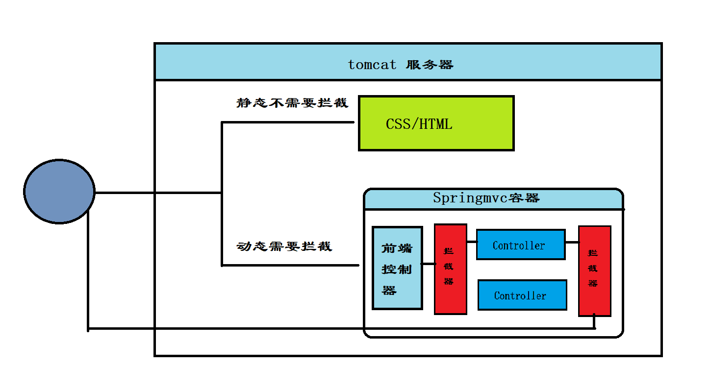

  

### 4.3案例实现

- 模拟没有登录拦截操作

- 新定义拦截器

  ```java
  @Component
  public class LoginInterceptor implements HandlerInterceptor {
      @Override
      public boolean preHandle(HttpServletRequest request, HttpServletResponse response, Object handler) throws Exception {
          System.out.println("登录拦截操作");
          String username = request.getParameter("username");
          if("sy".equals(username)){
              return true;
          }
          System.out.println("preHandle");
          return false;
      }
  
      @Override
      public void postHandle(HttpServletRequest request, HttpServletResponse response, Object handler, ModelAndView modelAndView) throws Exception {
          System.out.println("postHandle");
      }
  
      @Override
      public void afterCompletion(HttpServletRequest request, HttpServletResponse response, Object handler, Exception ex) throws Exception {
          System.out.println("afterCompletion");
      }
  }
  ```

- 修改SpringMvc 配置

  ```java
  @Configuration
  @ComponentScan({"cn.sycoder.controller","cn.sycoder.interceptor"})
  @EnableWebMvc
  public class SpringMvcConfig implements WebMvcConfigurer {
  
      @Autowired
      LoginInterceptor loginInterceptor;
  
      @Override
      public void addInterceptors(InterceptorRegistry registry) {
          registry.addInterceptor(loginInterceptor).addPathPatterns("/item","/item/*");
      }
  }
  ```

- controller 确实被拦截

  ```java
  @RestController
  @RequestMapping("/item")
  public class ItemController {
  
      @GetMapping("/{id}")
      public String getById(@PathVariable Long id){
          return "query"+id;
      }
  
      @GetMapping
      public String list(){
          return "list";
      }
  }
  ```

  

### 4.4拦截器参数讲解

- HttpServletRequest request
- HttpServletResponse response
- Object handler 相当于是对访问接口的一种包装

### 4.5拦截器链

- 新增拦截器

  ```java
  @Component
  public class AuthInterceptor implements HandlerInterceptor {
      @Override
      public boolean preHandle(HttpServletRequest request, HttpServletResponse response, Object handler) throws Exception {
          System.out.println("权限拦截的方法");
          return true;
      }
  
      @Override
      public void postHandle(HttpServletRequest request, HttpServletResponse response, Object handler, ModelAndView modelAndView) throws Exception {
          System.out.println("权限拦截的postHandle方法");
      }
  
      @Override
      public void afterCompletion(HttpServletRequest request, HttpServletResponse response, Object handler, Exception ex) throws Exception {
          System.out.println("权限拦截的afterCompletion方法");
      }
  }
  ```

  


- 添加到拦截器链中

  ```java
  @Configuration
  @ComponentScan({"cn.sycoder.controller","cn.sycoder.interceptor"})
  @EnableWebMvc
  public class SpringMvcConfig implements WebMvcConfigurer {
  
      @Autowired
      LoginInterceptor loginInterceptor;
  
      @Autowired
      AuthInterceptor authInterceptor;
  
      @Override
      public void addInterceptors(InterceptorRegistry registry) {
          registry.addInterceptor(loginInterceptor).addPathPatterns("/item","/item/*");
          registry.addInterceptor(authInterceptor).addPathPatterns("/item","/item/*");
      }
  }
  ```

  

- 拦截器链注意点
  - 拦截器有着先进后出的原则
  - preHandle : 与配置顺序保持一致的执行顺序
  - postHandle：与配置顺序相反，可能不运行
  - afterCompletion：与配置顺序相反，可能不运行

### 4.6面试题拦截器与过滤器的区别

- 区别
  - 技术所属不同
    - 过滤器：Servlet 技术
    - 拦截器：SpringMVC技术
  - 拦截内容不同
    - Filter : 是对所有访问进行过滤
    - Interceptor：仅仅针对访问SpringMVC

- 访问流程

  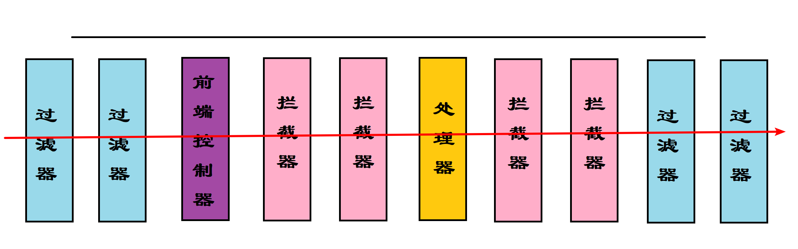

# 四、SpringMVC执行流程

## 1.SpringMVC 常用组件

- **DispatcherServlet**：前端控制器，用于对请求和响应进行统一处理
- **HandlerMapping**：处理器映射器，根据 url/method可以去找到具体的 Handler(Controller)
- **Handler**:具体处理器（程序员，以后开发这一部分需要）
- **HandlerAdapter**：处理器适配器，进行处理器方法的执行
- **ViewResolver**：处理视图相关的

## 2.处理流程图

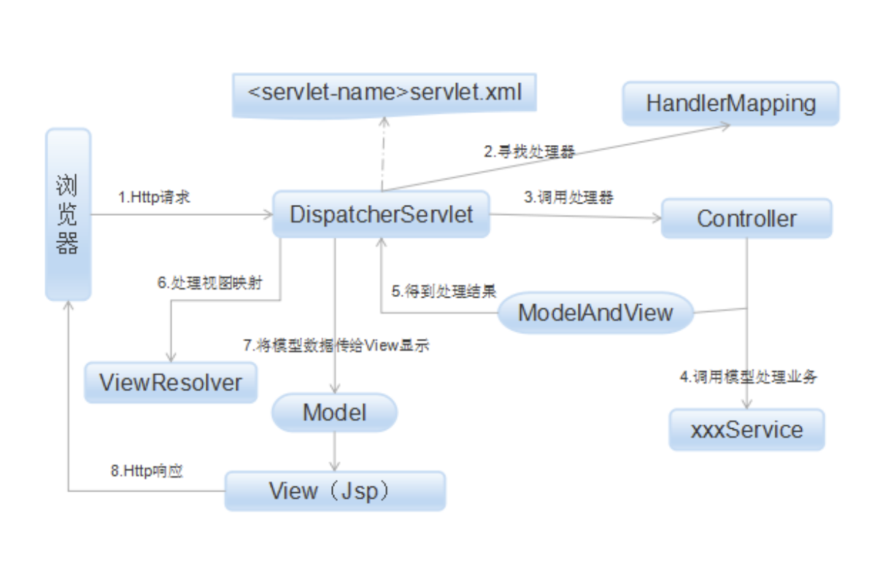

## 3.执行流程原理分析

### 3.1DispatcherServlet

- 初始化操作

  ```java
  protected void initStrategies(ApplicationContext context) {
          this.initMultipartResolver(context);
          this.initLocaleResolver(context);
          this.initThemeResolver(context);
          this.initHandlerMappings(context);
          this.initHandlerAdapters(context);
          this.initHandlerExceptionResolvers(context);
          this.initRequestToViewNameTranslator(context);
          this.initViewResolvers(context);
          this.initFlashMapManager(context);
      }
  ```

- 具体处理请求的方法

  ```java
  protected final void processRequest(HttpServletRequest request, HttpServletResponse response) throws ServletException, IOException {
          //删掉了一系列没用方法
  
          try {
              //具体执行方法
              this.doService(request, response);
          } catch (IOException | ServletException var16) {
              failureCause = var16;
              throw var16;
          } catch (Throwable var17) {
              failureCause = var17;
              throw new NestedServletException("Request processing failed", var17);
          } finally {
              this.resetContextHolders(request, previousLocaleContext, previousAttributes);
              if (requestAttributes != null) {
                  requestAttributes.requestCompleted();
              }
  
              this.logResult(request, response, (Throwable)failureCause, asyncManager);
              this.publishRequestHandledEvent(request, response, startTime, (Throwable)failureCause);
          }
  
      }
  ```

  ```java
  protected void doService(HttpServletRequest request, HttpServletResponse response) throws Exception {
          //删掉一系列干扰代码
  
          try {
              //具体执行
              this.doDispatch(request, response);
          } finally {
              if (!WebAsyncUtils.getAsyncManager(request).isConcurrentHandlingStarted() && attributesSnapshot != null) {
                  this.restoreAttributesAfterInclude(request, attributesSnapshot);
              }
  
          }
  
      }
  ```

  ```java
  protected void doDispatch(HttpServletRequest request, HttpServletResponse response) throws Exception {
          HttpServletRequest processedRequest = request;
          HandlerExecutionChain mappedHandler = null;
          boolean multipartRequestParsed = false;
          WebAsyncManager asyncManager = WebAsyncUtils.getAsyncManager(request);
  
          try {
              try {
                  ModelAndView mv = null;
                  Object dispatchException = null;
  
                  try {
                      processedRequest = this.checkMultipart(request);
                      multipartRequestParsed = processedRequest != request;
                      //获取处理器就是具体的需要执行的 Tontroller
                      mappedHandler = this.getHandler(processedRequest);
                      if (mappedHandler == null) {
                          this.noHandlerFound(processedRequest, response);
                          return;
                      }
  					//获取处理器适配器
                      HandlerAdapter ha = this.getHandlerAdapter(mappedHandler.getHandler());
                      String method = request.getMethod();
                      boolean isGet = "GET".equals(method);
                      if (isGet || "HEAD".equals(method)) {
                          long lastModified = ha.getLastModified(request, mappedHandler.getHandler());
                          if ((new ServletWebRequest(request, response)).checkNotModified(lastModified) && isGet) {
                              return;
                          }
                      }
  
                      if (!mappedHandler.applyPreHandle(processedRequest, response)) {
                          return;
                      }
  					//具体调用 Controller 中的方法
                      mv = ha.handle(processedRequest, response, mappedHandler.getHandler());
                      if (asyncManager.isConcurrentHandlingStarted()) {
                          return;
                      }
  
                      this.applyDefaultViewName(processedRequest, mv);
                      mappedHandler.applyPostHandle(processedRequest, response, mv);
                  } catch (Exception var20) {
                      dispatchException = var20;
                  } catch (Throwable var21) {
                      dispatchException = new NestedServletException("Handler dispatch failed", var21);
                  }
  
                  this.processDispatchResult(processedRequest, response, mappedHandler, mv, (Exception)dispatchException);
              } catch (Exception var22) {
                  this.triggerAfterCompletion(processedRequest, response, mappedHandler, var22);
              } catch (Throwable var23) {
                  this.triggerAfterCompletion(processedRequest, response, mappedHandler, new NestedServletException("Handler processing failed", var23));
              }
  
          } finally {
              if (asyncManager.isConcurrentHandlingStarted()) {
                  if (mappedHandler != null) {
                      mappedHandler.applyAfterConcurrentHandlingStarted(processedRequest, response);
                  }
              } else if (multipartRequestParsed) {
                  this.cleanupMultipart(processedRequest);
              }
  
          }
      }
  ```

  ```java
  //获取具体执行的
  protected HandlerExecutionChain getHandler(HttpServletRequest request) throws Exception {
          if (this.handlerMappings != null) {
              Iterator var2 = this.handlerMappings.iterator();
  
              while(var2.hasNext()) {
                  HandlerMapping mapping = (HandlerMapping)var2.next();
                  HandlerExecutionChain handler = mapping.getHandler(request);
                  if (handler != null) {
                      return handler;
                  }
              }
          }
  
          return null;
      }
  ```

  

### 3.2HandlerMapping

- dbug 的图示

  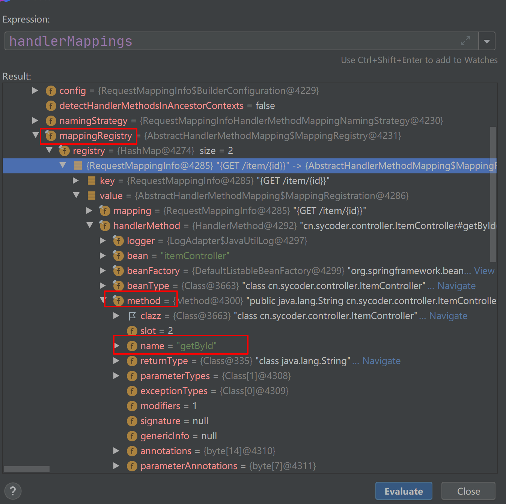

  

- <font color="red">让我们在下一阶段、不见不散！</font>