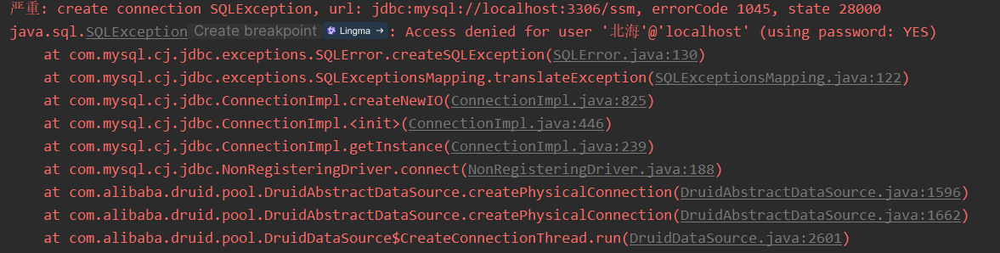
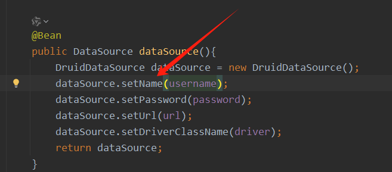
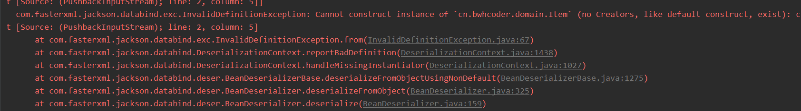
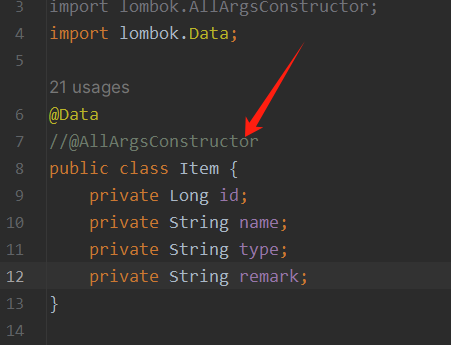

# 问题一：



### 描述：

​	访问数据库出现username不是root的 情况

### 解决：

在设置username时，用错方法，应该使用setUsername



# 问题二：



```java
com.fasterxml.jackson.databind.exc.InvalidDefinitionException: Cannot construct instance of `cn.bwhcoder.domain.Item` (no Creators, like default construct, exist): cannot deserialize from Object value (no delegate- or property-based Creator)
```

### 描述：

​	无法创建item实例，缺少对应的构造器。

### 解决：

当使用@AllArgsConstructor 时，失去无参的构造函数。

​	