# 一、SpringBoot 概述

- 文档下载地址：https://docs.spring.io/spring-boot/docs/current/reference/

## 1.SpringBoot介绍

- 概述：SpringBoot 开发团队认为Spring操作太繁琐了，目的在于简化开发配置，能够快速搭建开发环境，集成了tomcat，对于开发者而已特别方便友好。

## 2.特点

- 开箱即用
- 简化配置
- 集成了很多组件


## 3.系统要求

- 要求如下

  | 名称       | 版本要求 |
  | ---------- | -------- |
  | Maven      | 3.5+     |
  | Tomcat 9.0 | 4.0      |
  | jdk        | 1.8+     |
  | idea       | 2020.2   |

# 二、快速入门

## 1.通过SpringBoot官网构建项目

- 官网构建地址：https://start.spring.io/

### 1.1进入网页

- 进入页面选择如下

  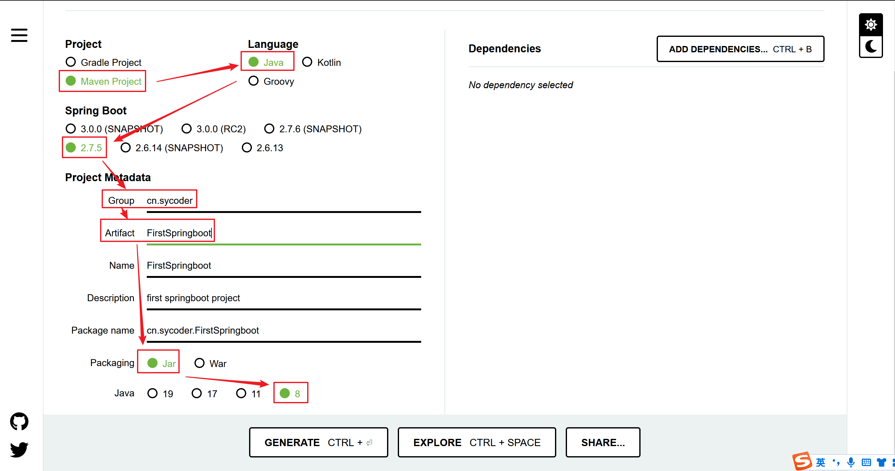

  

### 1.2添加依赖

- 点击右侧的ADD Dependencies

- 进入选择页面

  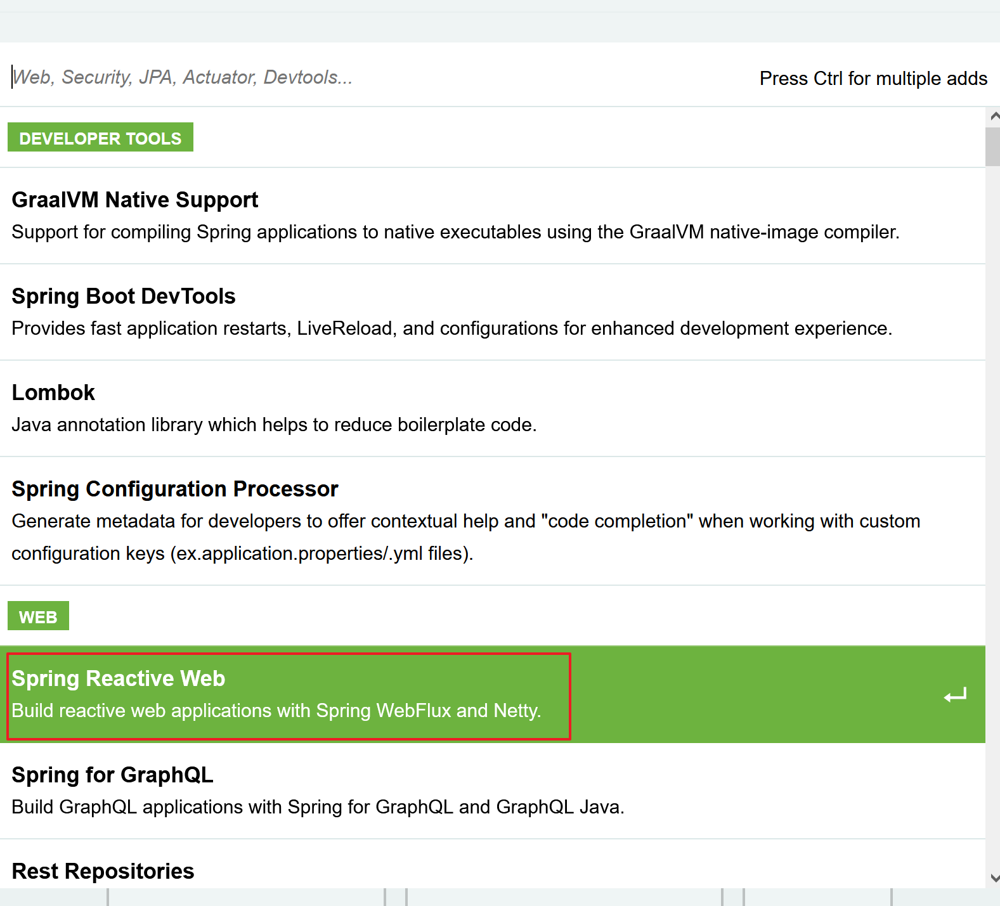

- 选一个 SpringWeb 依赖

  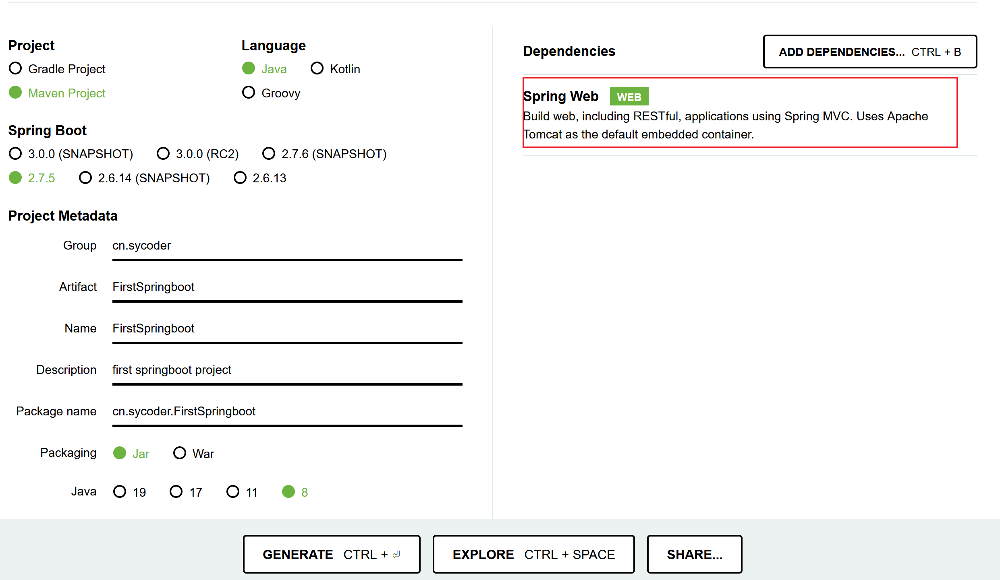

### 1.3生成文件包

- 点击GENERATE 生成程序文件包

  

  

  

### 1.4用Idea打开项目

- 直接Open 项目

  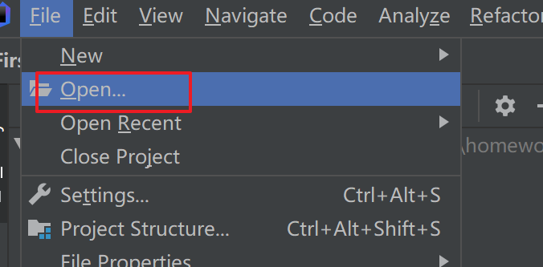

- 配置 maven 从阿里云下载依赖

  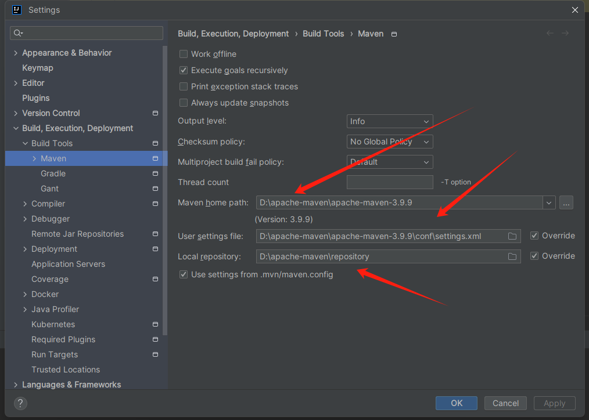

- 第一次下载需要不少时间，创建好空项目的时候，就应该把maven 设置好

- 得到如下代码

  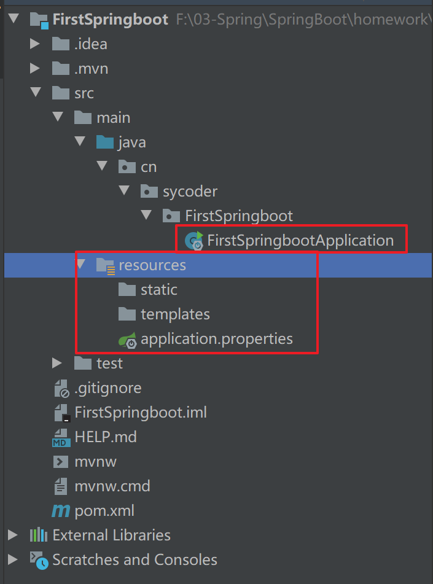

### 1.5新建Controller测试

- controller

  ```java
  @RestController
  public class TestController {
  
      @GetMapping("/test")
      public String test(){
          return "OK";
      }
  }
  ```

- 访问

  

## 2.通过idea快速构建SpringMVC项目

### 2.1创建新模块

- 创建新模块

  

- 添加基础信息

  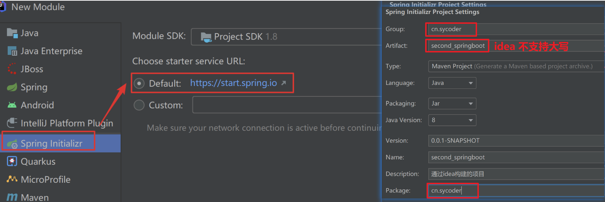

### 2.2添加依赖

- 选择需要的依赖

  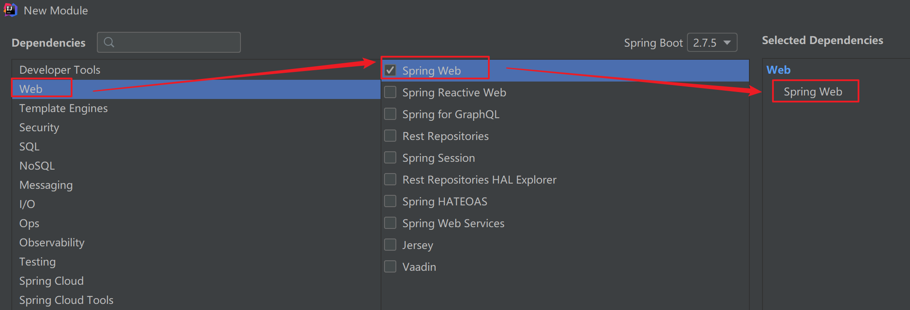

- 避免出现嵌套

  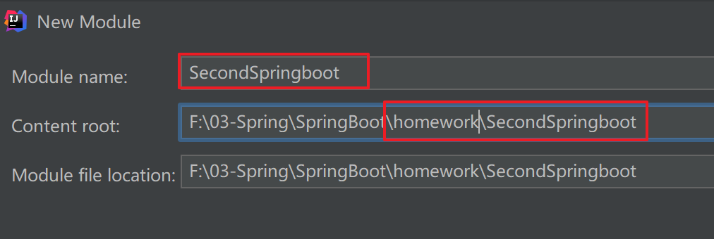

### 2.3注意点

- 如果修改过模块名称，导致模块不是正常的结构，可以通过重新导入模块解决

  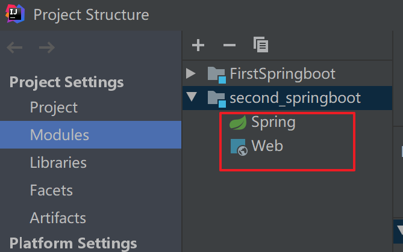

- 自己手动标记

  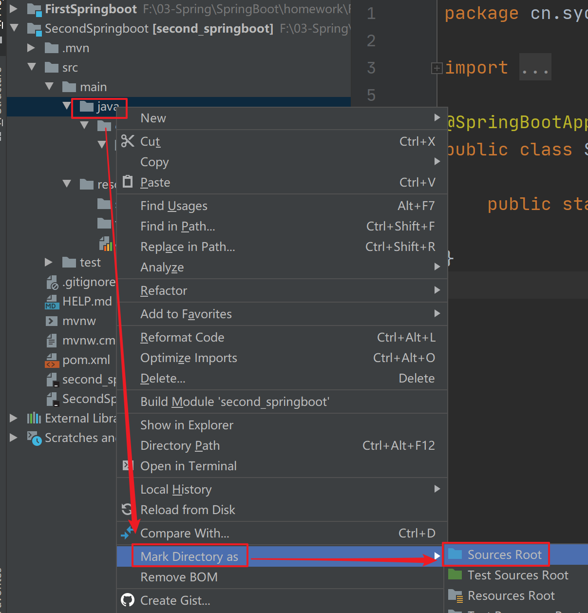

### 2.4新建Controller测试

- controller

  ```java
  @RestController
  public class TestController {
  
      @GetMapping("/test1")
      public String getTest(){
          return "OK1";
      }
  }
  ```

- 运行启动类 SecondSpringbootApplication

  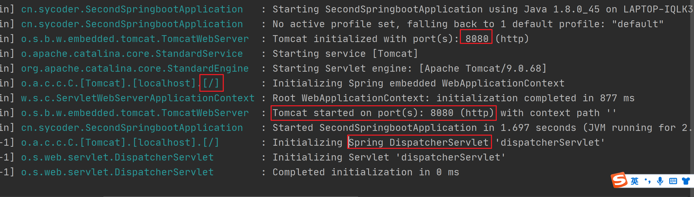

- 测试

  ```java
  http://localhost:8080/test1
  ```

## 3.通过Idea自定义服务网址构建

- 网址：https://start.aliyun.com

### 3.1新建模块

- 新建模块

  

- 添加基础信息

  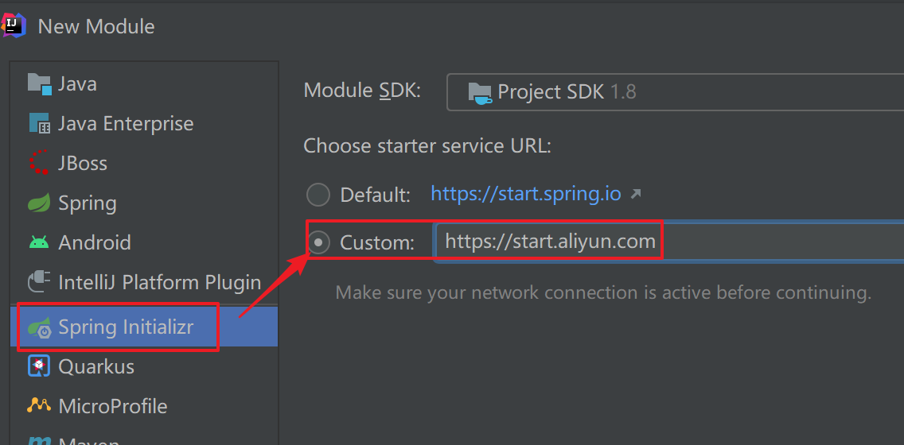


### 3.2添加依赖

- 添加依赖

  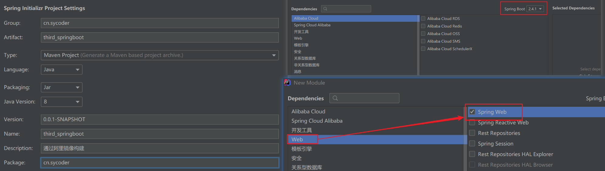

- 新建模块

  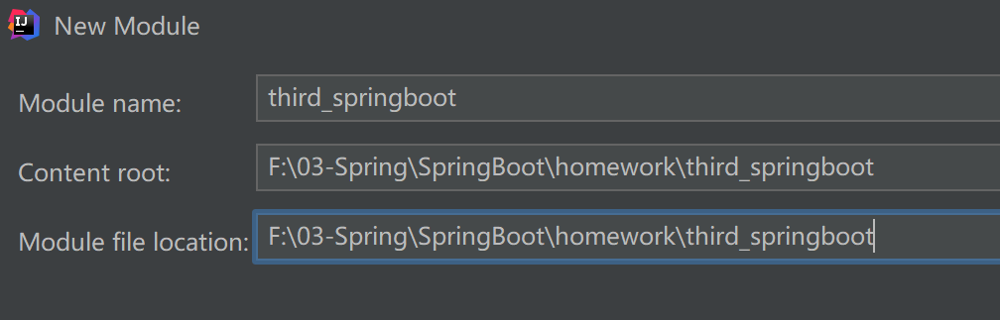


- 创建完成项目结构

  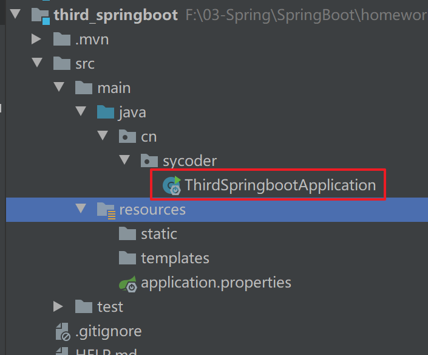

### 3.3新建Controller测试

- 新建Controller

  ```java
  @RestController
  public class TestController {
  
      @GetMapping("/test3")
      public String test3(){
          return "OK3";
      }
  }
  ```

- 运行启动类 SpringBootApplication

  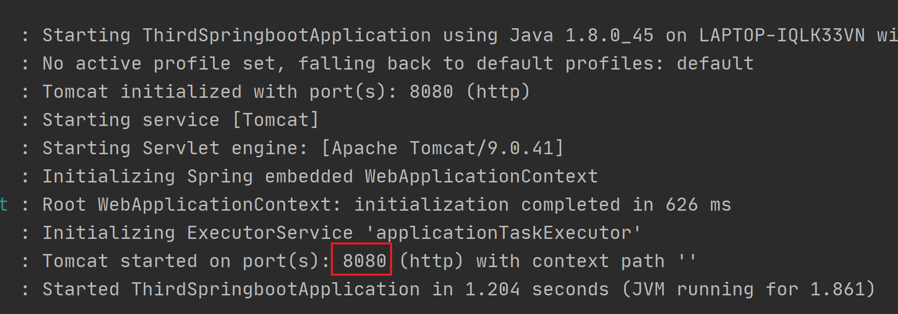


- 测试

  ```java
  localhost:8080/test3
  ```

  


## 4.前三种的共同问题

- 都需要联网才能使用
- 对于一些保密单位只能访问内网，这个时候，前三种构建方式就行不通了

## 5.保密单位构建方式

- 华为/政府...进公司都需要过安检，一个U盘都带不进去也带不出去
- 联网就是通过Maven 加载一些需要的依赖而已，如果私服上面已经有了这些依赖


### 5.1新建模块

- 使用Maven 新建模块

  

  

- 使用Maven 构建

  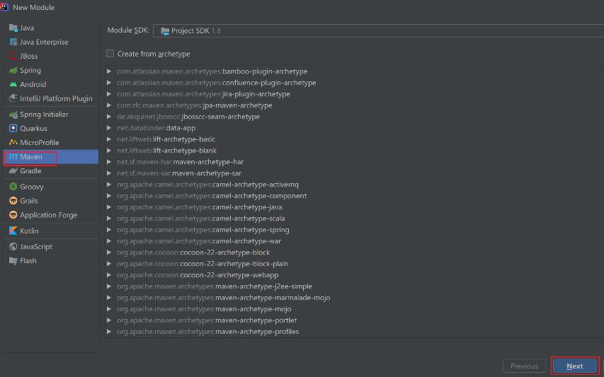

  

- 基础信息配置

  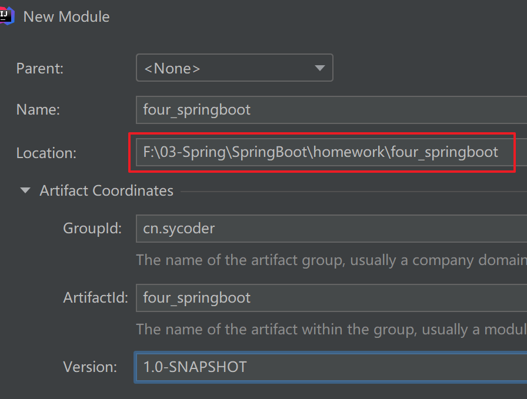

### 5.2添加依赖

- 添加依赖

  ```java
  <?xml version="1.0" encoding="UTF-8"?>
  <project xmlns="http://maven.apache.org/POM/4.0.0"
           xmlns:xsi="http://www.w3.org/2001/XMLSchema-instance"
           xsi:schemaLocation="http://maven.apache.org/POM/4.0.0 http://maven.apache.org/xsd/maven-4.0.0.xsd">
      <modelVersion>4.0.0</modelVersion>
  
      <groupId>cn.sycoder</groupId>
      <artifactId>four_springboot</artifactId>
      <version>1.0-SNAPSHOT</version>
      <parent>
          <groupId>org.springframework.boot</groupId>
          <artifactId>spring-boot-starter-parent</artifactId>
          <version>2.7.5</version>
          <relativePath/> <!-- lookup parent from repository -->
      </parent>
      <properties>
          <java.version>1.8</java.version>
      </properties>
      <dependencies>
          <dependency>
              <groupId>org.springframework.boot</groupId>
              <artifactId>spring-boot-starter-web</artifactId>
          </dependency>
  
          <dependency>
              <groupId>org.springframework.boot</groupId>
              <artifactId>spring-boot-starter-test</artifactId>
              <scope>test</scope>
          </dependency>
      </dependencies>
      <build>
          <plugins>
              <plugin>
                  <groupId>org.springframework.boot</groupId>
                  <artifactId>spring-boot-maven-plugin</artifactId>
              </plugin>
          </plugins>
      </build>
  
  </project>
  ```

### 5.3添加启动类

- 添加启动类

  ```java
  @SpringBootApplication
  public class FourSpringbootApplication {
      public static void main(String[] args) {
          SpringApplication.run(FourSpringbootApplication.class, args);
      }
  }
  ```

- 注意：

  - @SpringBootApplication 别遗漏，这个是SpringBoot 的核心

### 5.4新建Controller测试

- 新建Controller

  ```java
  @RestController
  public class TestController {
      @GetMapping("/test04")
      public String test04(){
          return "OK4";
      }
  }
  ```

- 访问地址

  ```java
  localhost:8080/test04
  ```

- 总结

  - 创建Maven工程
  - 继承 spring-boot-starter-parent
  - 添加依赖 spring-boot-starter-web
  - 创建启动类 FourSpringbootApplication
  - 测试验证

# 三、SpringBoot介绍

## 1.parent

> - 前言：之前是使用spring/springmvc 开发，整合不同的组件会有很多依赖，这些依赖会涉及到很多的版本信息，版本信息多了之后可能会导致版本冲突问题。在 Spring Boot 项目中，使用 `parent` 标签可以指定一个父项目，这通常用于继承 Spring Boot 的依赖管理和插件管理。这种方式可以简化项目的依赖管理和构建过程。
> - 概述：把很多组件技术的搭配放到一起，名字就叫 parent
>

### 1.1实际开发中会引入 parent

- 用parent引入父项目

  > #### `spring-boot-starter-parent`
  >
  > Spring Boot 提供了一个标准的父项目 `spring-boot-starter-parent`，它包含了许多常用的依赖版本和插件配置。
  >
  > 作用：
  >
  > 1. 定义了 Java 编译版本为 1.8 。
  > 2. 使用 UTF-8 格式编码。
  > 3. **继承自 spring-boot-dependencies，这个里边定义了依赖的版本，也正是因为继承了这个依**
  > **赖，所以我们在写依赖时才不需要写版本号。**
  > 4. 执行打包操作的配置。
  > 5. 自动化的资源过滤。
  > 6. 自动化的插件配置。
  > 7. 针对 application.properties 和 application.yml 的资源过滤，包括通过 profile 定义的不同
  > 环境的配置文件，例如 application-dev.properties 和 application-dev.yml。

  ```java
  <parent>
      <groupId>org.springframework.boot</groupId>
      <artifactId>spring-boot-starter-parent</artifactId>
      <version>2.7.5</version>
      <relativePath/> <!-- lookup parent from repository -->
  </parent>
  ```

- 点击后发现又引入了一个 parent

  - 通过该parent 能够找到对应的搭配

  ```java
  <parent>
      <groupId>org.springframework.boot</groupId>
      <artifactId>spring-boot-dependencies</artifactId>
      <version>2.7.5</version>
  </parent>
  ```

- 通过propertie管理版本信息

  ```java
  <properties>
      <activemq.version>5.16.5</activemq.version>
      <antlr2.version>2.7.7</antlr2.version>
      <appengine-sdk.version>1.9.98</appengine-sdk.version>
      <artemis.version>2.19.1</artemis.version>
      <aspectj.version>1.9.7</aspectj.version>
      <assertj.version>3.22.0</assertj.version>
      <atomikos.version>4.0.6</atomikos.version>
      <awaitility.version>4.2.0</awaitility.version>
      <build-helper-maven-plugin.version>3.3.0</build-helper-maven-plugin.version>
      <byte-buddy.version>1.12.18</byte-buddy.version>
      <cache2k.version>2.6.1.Final</cache2k.version>
  </properties>
  ```

- 通过dependencyManagement去管理依赖

  ```java
  <dependencyManagement>
      <dependencies>
        <dependency>
          <groupId>org.apache.activemq</groupId>
          <artifactId>activemq-amqp</artifactId>
          <version>${activemq.version}</version>
        </dependency>
        <dependency>
          <groupId>org.apache.activemq</groupId>
          <artifactId>activemq-blueprint</artifactId>
          <version>${activemq.version}</version>
        </dependency>
  </dependencyManagement>
  ```

### 1.2引入依赖

- 通过 dependencies

  ```java
  <dependency>
      <groupId>org.springframework.boot</groupId>
      <artifactId>spring-boot-starter-web</artifactId>
  </dependency>
  ```

- 通过导入方式获取依赖

  ```java
  <dependencyManagement>
          <dependencies>
              <dependency>
                  <groupId>org.springframework.boot</groupId>
                  <artifactId>spring-boot-dependencies</artifactId>
                  <version>${spring-boot.version}</version>
                  <type>pom</type>
                  <scope>import</scope>
              </dependency>
          </dependencies>
  </dependencyManagement>
  ```

## 2.starter

- 回顾springmvc
  - 问题：之前的操作导入依赖比较麻烦，比如我们要使用Spring-webmvc 一定会去使用Spring-web
  - 引入太繁琐不好管理
- starter：springboot团队直接把这些固定搭配技术做成一个成品
  - `Starter` 是一种特殊的依赖管理工具，它将一组相关的依赖项打包在一起，提供了一个简化的入口点。通过使用 `starter`，你可以快速地引入一组依赖项，并且这些依赖项会被自动配置好，以便立即使用。


### 2.1实际开发体验

- 开发springmvc

  ```java
  <dependency>
      <groupId>org.springframework.boot</groupId>
      <artifactId>spring-boot-starter-web</artifactId>
  </dependency>
  ```

- 点击引入的依赖会有如下依赖

  ```java
  <dependencies>
      <dependency>
        <groupId>org.springframework.boot</groupId>
        <artifactId>spring-boot-starter</artifactId>
        <version>2.7.5</version>
        <scope>compile</scope>
      </dependency>
      <dependency>
        <groupId>org.springframework.boot</groupId>
        <artifactId>spring-boot-starter-json</artifactId>
        <version>2.7.5</version>
        <scope>compile</scope>
      </dependency>
      <dependency>
        <groupId>org.springframework.boot</groupId>
        <artifactId>spring-boot-starter-tomcat</artifactId>
        <version>2.7.5</version>
        <scope>compile</scope>
      </dependency>
      <dependency>
        <groupId>org.springframework</groupId>
        <artifactId>spring-web</artifactId>
        <version>5.3.23</version>
        <scope>compile</scope>
      </dependency>
      <dependency>
        <groupId>org.springframework</groupId>
        <artifactId>spring-webmvc</artifactId>
        <version>5.3.23</version>
        <scope>compile</scope>
      </dependency>
    </dependencies>
  ```

- ### 如何引入json操作

  ```java
  <dependency>
        <groupId>org.springframework.boot</groupId>
        <artifactId>spring-boot-starter-json</artifactId>
        <version>2.7.5</version>
        <scope>compile</scope>
      </dependency>
  ```

- 点开又会找到曾经我们导入的依赖

  ```java
  <dependencies>
      <dependency>
        <groupId>org.springframework.boot</groupId>
        <artifactId>spring-boot-starter</artifactId>
        <version>2.7.5</version>
        <scope>compile</scope>
      </dependency>
      <dependency>
        <groupId>org.springframework</groupId>
        <artifactId>spring-web</artifactId>
        <version>5.3.23</version>
        <scope>compile</scope>
      </dependency>
      <dependency>
        <groupId>com.fasterxml.jackson.core</groupId>
        <artifactId>jackson-databind</artifactId>
        <version>2.13.4.2</version>
        <scope>compile</scope>
      </dependency>
      <dependency>
        <groupId>com.fasterxml.jackson.datatype</groupId>
        <artifactId>jackson-datatype-jdk8</artifactId>
        <version>2.13.4</version>
        <scope>compile</scope>
      </dependency>
      <dependency>
        <groupId>com.fasterxml.jackson.datatype</groupId>
        <artifactId>jackson-datatype-jsr310</artifactId>
        <version>2.13.4</version>
        <scope>compile</scope>
      </dependency>
      <dependency>
        <groupId>com.fasterxml.jackson.module</groupId>
        <artifactId>jackson-module-parameter-names</artifactId>
        <version>2.13.4</version>
        <scope>compile</scope>
      </dependency>
    </dependencies>
  ```

### 2.2starter总结

- starter 其实就是很多个坐标的组合

- 以后引入了什么坐标，直接通过maven观察即可

  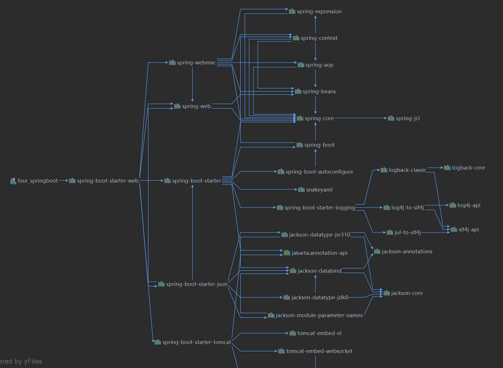

  

### 2.3parent和starter总结

- parent作用：
  - 定义若干版本信息，交给springboot统一管理，目的是减少依赖冲突
- starter作用
  - 在同一个坐标中定义多个坐标，目的是简化依赖配置
- 使用步骤
  - 先去找有没有starter ，如果有直接引用
  - 没有直接提供版本信息即可


## 3.引导类（也称为主应用类）

### 3.1传统spring配置

- 提供如下配置
  - SpringConfig
  - SpringMvcConfig

### 3.2引导类作用

> 在 Spring Boot 应用程序中，引导类（也称为主应用类）是应用程序的入口点。这个类通常包含一个 `main` 方法，该方法负责启动 Spring Boot 应用程序。引导类通常使用 `@SpringBootApplication` 注解，该注解是一个组合注解，包含了以下几个注解：
>
> - `@SpringBootConfiguration`：表示这是一个配置类。
> - `@EnableAutoConfiguration`：启用 Spring Boot 的自动配置机制。
> - `@ComponentScan`：启用组件扫描，自动发现和注册带有 `@Component`、`@Service`、`@Repository` 和 `@Controller` 注解的类。

- SpringBoot工程提供引导类用来**启动程序**

- SpringBoot工程启动后创建并初始化Spring容器

  - 证明创建了Spring容器

    ```java
    @SpringBootApplication
    public class FourSpringbootApplication {
        public static void main(String[] args) {
            ConfigurableApplicationContext context = SpringApplication.run(FourSpringbootApplication.class, args);
            TestController bean = context.getBean(TestController.class);
            System.out.println(bean.test04());
        }
    }
    ```

### 3.3 自定义配置

​	虽然 `@SpringBootApplication` 注解已经包含了上述三个注解，但在某些情况下，你可能需要更细粒度的控制。你可以手动添加这些注

```java
package com.example.demo;

import org.springframework.boot.SpringApplication;
import org.springframework.boot.autoconfigure.SpringBootApplication;
import org.springframework.context.annotation.ComponentScan;
import org.springframework.context.annotation.Configuration;

@Configuration
@EnableAutoConfiguration
@ComponentScan(basePackages = "com.example")
public class DemoApplication {

    public static void main(String[] args) {
        SpringApplication.run(DemoApplication.class, args);
    }
}
```

在这个例子中，我们手动添加了 `@Configuration`、`@EnableAutoConfiguration` 和 `@ComponentScan` 注解，并指定了扫描的基础包。

## 4.内嵌tomcat

### 4.1定义依赖

- 依赖

  ```java
  <dependency>
      <groupId>org.springframework.boot</groupId>
      <artifactId>spring-boot-starter-web</artifactId>
  </dependency>
  ```

- 点开发现如下依赖

  ```java
  <dependencies>
      <dependency>
        <groupId>org.springframework.boot</groupId>
        <artifactId>spring-boot-starter</artifactId>
        <version>2.7.5</version>
        <scope>compile</scope>
      </dependency>
      <dependency>
        <groupId>org.springframework.boot</groupId>
        <artifactId>spring-boot-starter-json</artifactId>
        <version>2.7.5</version>
        <scope>compile</scope>
      </dependency>
      <dependency>
        <groupId>org.springframework.boot</groupId>
        <artifactId>spring-boot-starter-tomcat</artifactId>
        <version>2.7.5</version>
        <scope>compile</scope>
      </dependency>
      <dependency>
        <groupId>org.springframework</groupId>
        <artifactId>spring-web</artifactId>
        <version>5.3.23</version>
        <scope>compile</scope>
      </dependency>
      <dependency>
        <groupId>org.springframework</groupId>
        <artifactId>spring-webmvc</artifactId>
        <version>5.3.23</version>
        <scope>compile</scope>
      </dependency>
    </dependencies>
  ```

- 点击spring-boot-starter-tomcat

  ```java
  <dependencies>
      <dependency>
        <groupId>jakarta.annotation</groupId>
        <artifactId>jakarta.annotation-api</artifactId>
        <version>1.3.5</version>
        <scope>compile</scope>
      </dependency>
      <dependency>
        <groupId>org.apache.tomcat.embed</groupId>
        <artifactId>tomcat-embed-core</artifactId>
        <version>9.0.68</version>
        <scope>compile</scope>
        <exclusions>
          <exclusion>
            <artifactId>tomcat-annotations-api</artifactId>
            <groupId>org.apache.tomcat</groupId>
          </exclusion>
        </exclusions>
      </dependency>
      <dependency>
        <groupId>org.apache.tomcat.embed</groupId>
        <artifactId>tomcat-embed-el</artifactId>
        <version>9.0.68</version>
        <scope>compile</scope>
      </dependency>
      <dependency>
        <groupId>org.apache.tomcat.embed</groupId>
        <artifactId>tomcat-embed-websocket</artifactId>
        <version>9.0.68</version>
        <scope>compile</scope>
        <exclusions>
          <exclusion>
            <artifactId>tomcat-annotations-api</artifactId>
            <groupId>org.apache.tomcat</groupId>
          </exclusion>
        </exclusions>
      </dependency>
    </dependencies>
  ```


### 4.2Tomcat运行原理

- tomcat:是java语言开发的软件，就可以通过直接创建tomcat对象的方式去运行tomcat

- 如何交给spring管理的

  ```java
  <dependency>
    <groupId>org.apache.tomcat.embed</groupId>
    <artifactId>tomcat-embed-core</artifactId>
    <version>9.0.68</version>
    <scope>compile</scope>
    <exclusions>
      <exclusion>
        <artifactId>tomcat-annotations-api</artifactId>
        <groupId>org.apache.tomcat</groupId>
      </exclusion>
    </exclusions>
  </dependency>
  ```

- 通过 starter引入 tomcat 服务器之后就可以直接创建tomcat对象了

  ```java
  <dependency>
    <groupId>org.springframework.boot</groupId>
    <artifactId>spring-boot-starter-tomcat</artifactId>
    <version>2.7.5</version>
    <scope>compile</scope>
  </dependency>
  ```

### 4.3更换内置服务器

- **tomcat(默认)**：apache公司的，受众大，使用多，提供了较多组件
- jetty：轻量级服务器，负载比tomcat弱
- undertow

- 更换内置服务器操作

  ```java
  <dependencies>
          <dependency>
              <groupId>org.springframework.boot</groupId>
              <artifactId>spring-boot-starter-web</artifactId>
              <exclusions>
                  <exclusion>
                      <groupId>org.springframework.boot</groupId>
                      <artifactId>spring-boot-starter-tomcat</artifactId>
                  </exclusion>
              </exclusions>
          </dependency>
          <dependency>
              <groupId>org.springframework.boot</groupId>
              <artifactId>spring-boot-starter-jetty</artifactId>
          </dependency>
      </dependencies>
  ```

# Tomcat(详细讲解)⭐️

在 Spring Boot 中，内嵌的 Tomcat 服务器是一个非常重要的组件，它使得应用程序可以独立运行，而无需外部的 Servlet 容器。理解 Tomcat 在 Spring Boot 中的运行原理有助于更好地管理和优化应用程序。以下是对 Spring Boot 中 Tomcat 运行原理的详细解释：

### 1. Spring Boot 启动流程

当你运行一个 Spring Boot 应用程序时，Spring Boot 的启动流程大致如下：

1. **加载引导类**：Spring Boot 应用程序从引导类（通常是带有 `@SpringBootApplication` 注解的类）开始。
2. **初始化 `SpringApplication` 对象**：在引导类的 `main` 方法中，调用 `SpringApplication.run` 方法，创建一个 `SpringApplication` 对象。
3. **加载配置**：`SpringApplication` 对象会加载应用的配置文件（如 `application.properties` 或 `application.yml`）。
4. **创建 `ApplicationContext`**：根据配置文件和注解，创建一个 `ApplicationContext`。
5. **初始化 Bean**：在 `ApplicationContext` 中初始化所有的 Bean。
6. **启动嵌入式容器**：如果项目中包含 `spring-boot-starter-web` 依赖，Spring Boot 会自动配置并启动嵌入式 Tomcat 服务器。

### 2. 内嵌 Tomcat 的启动过程

在 Spring Boot 中，内嵌 Tomcat 的启动过程主要包括以下几个步骤：

1. **创建 `TomcatServletWebServerFactory`**：
   - Spring Boot 会创建一个 `TomcatServletWebServerFactory` 实例，这个工厂类负责创建和配置 Tomcat 服务器。
   - 你可以通过配置文件或 Java 代码自定义 `TomcatServletWebServerFactory` 的行为。

2. **配置 Tomcat 服务器**：
   - `TomcatServletWebServerFactory` 会根据配置文件（如 `application.properties` 或 `application.yml`）中的属性配置 Tomcat 服务器。
   - 你可以在配置文件中设置端口号、上下文路径、连接超时时间等属性。

3. **创建 `Tomcat` 实例**：
   - `TomcatServletWebServerFactory` 创建一个 `Tomcat` 实例，并设置相关配置。
   - 创建 `Context` 对象，用于管理应用程序的 Servlet 容器上下文。

4. **添加 Servlet 和 Filter**：
   - `TomcatServletWebServerFactory` 将应用程序中的 Servlet 和 Filter 注册到 Tomcat 服务器中。
   - 这些 Servlet 和 Filter 通常由 Spring Boot 的自动配置机制管理。

5. **启动 Tomcat 服务器**：
   - 调用 `Tomcat.start()` 方法启动 Tomcat 服务器。
   - Tomcat 开始监听指定的端口，并处理客户端请求。

### 3. 关键类和接口

以下是一些关键的类和接口，它们在 Spring Boot 中管理内嵌 Tomcat 服务器的过程中起着重要作用：

- **`SpringApplication`**：
  - 负责启动 Spring Boot 应用程序。
  - 通过调用 `run` 方法启动应用程序。

- **`ServletWebServerApplicationContext`**：
  - 扩展了 `ApplicationContext`，专门用于管理嵌入式 Servlet 容器。
  - 在启动过程中创建并初始化嵌入式容器。

- **`TomcatServletWebServerFactory`**：
  - 负责创建和配置 Tomcat 服务器。
  - 可以通过配置文件或 Java 代码进行自定义。

- **`WebServer`**：
  - 表示一个嵌入式 Servlet 容器。
  - `TomcatServletWebServer` 是 `WebServer` 的具体实现，用于管理 Tomcat 服务器。

- **`Connector`**：
  - 表示一个网络连接器，用于处理客户端请求。
  - 可以配置多个 `Connector`，例如 HTTP 和 HTTPS。

- **`Context`**：
  - 表示一个 Servlet 容器上下文，用于管理应用程序的 Servlet 和 Filter。
  - 在 Tomcat 中，每个应用程序都有一个对应的 `Context`。

### 4. 示例代码

以下是一个简单的示例，展示了如何在 Spring Boot 中配置和启动内嵌的 Tomcat 服务器：

#### 引导类

```java
package com.example.demo;

import org.springframework.boot.SpringApplication;
import org.springframework.boot.autoconfigure.SpringBootApplication;

@SpringBootApplication
public class DemoApplication {

    public static void main(String[] args) {
        SpringApplication.run(DemoApplication.class, args);
    }
}
```

#### 配置文件 `application.properties`

```properties
# 设置服务器端口
server.port=8080

# 设置上下文路径
server.servlet.context-path=/myapp

# 设置连接超时时间
server.tomcat.connection-timeout=20000

# 设置最大线程数
server.tomcat.max-threads=100

# 设置最小空闲线程数
server.tomcat.min-spare-threads=10

# 设置最大连接数
server.tomcat.max-connections=10000
```

#### 自定义配置类

```java
package com.example.demo.config;

import org.springframework.boot.web.embedded.tomcat.TomcatServletWebServerFactory;
import org.springframework.boot.web.server.WebServerFactoryCustomizer;
import org.springframework.context.annotation.Bean;
import org.springframework.context.annotation.Configuration;

import org.apache.catalina.connector.Connector;
import org.apache.coyote.http11.Http11NioProtocol;

@Configuration
public class TomcatConfig {

    @Bean
    public WebServerFactoryCustomizer<TomcatServletWebServerFactory> tomcatCustomizer() {
        return factory -> {
            factory.addConnectorCustomizers(connector -> {
                connector.setPort(8080);
                connector.setConnectionTimeout(20000);

                Http11NioProtocol protocol = (Http11NioProtocol) connector.getProtocolHandler();
                protocol.setMaxThreads(100);
                protocol.setMinSpareThreads(10);
            });

            factory.addContextCustomizers(context -> {
                context.setPath("/myapp");
            });
        };
    }
}
```

### 5. 总结

内嵌的 Tomcat 服务器是 Spring Boot 应用程序的重要组成部分，它使得应用程序可以独立运行，而无需外部的 Servlet 容器。通过 `SpringApplication`、`TomcatServletWebServerFactory` 和其他相关类，Spring Boot 能够自动配置并启动 Tomcat 服务器。你可以通过配置文件或 Java 代码自定义 Tomcat 的各种属性，以满足不同的需求。

# 四、配置文件

## 1.前言

- 曾经使用SpringMVC的时候是手动修改tomcat配置的端口信息，那现在Springboot如何修改？
- springboot有一个默认的配置文件  application.properties

## 2.配置文件分类

- 常用配置信息官方文档地址

  https://docs.spring.io/spring-boot/docs/current/reference/html/application-properties.html#appendix.application-properties
  
- 以后记不住什么配置的时候，就去官方找

### 2.1properties

#### 2.1.1修改端口测试

- 默认Springboot 通过 application.properties就可以修改默认配置

- 通过properties 修改端口信息

  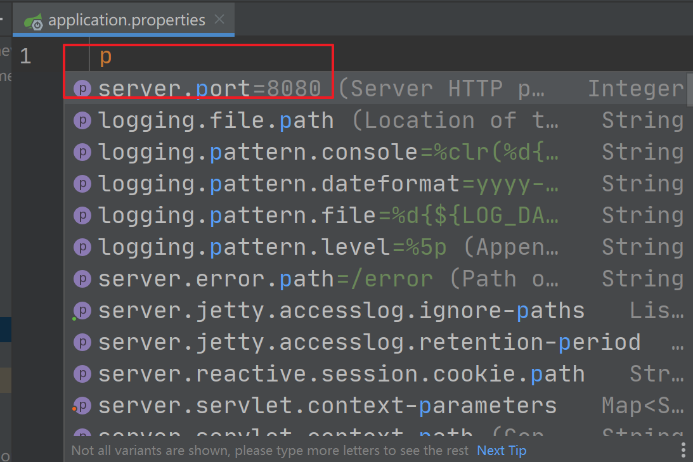

  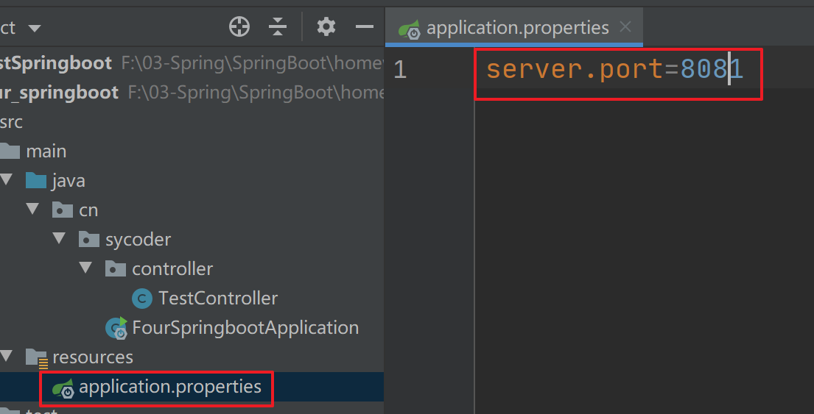

- 修改后重启项目查看日志

  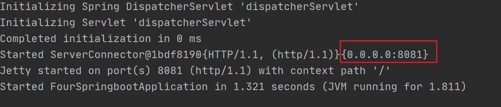

- 修改 banner 文件(直接新建一个 banner.txt 文件在idea resources下面即可)


### 2.2yaml 格式

#### 2.2.1语法要求

- 要求
  - #号 表示注释
  - 大小写敏感
  - 属性层级关系使用多行描述，每行结尾使用冒号结束
  - 使用缩进表示层级关系，同层级左侧对齐，只允许使用空格（不允许使用Tab键）
  - 属性值前面添加空格（属性名与属性值之间使用冒号+空格作为分隔）

#### 2.2.2分类

- yml格式（主流格式）

  - 修改端口信息为8082:新建 application.yml

    ```java
    server:
      port: 8082
    ```

    

- yaml格式

  - 修改端口信息为8888：新建 application.yaml

    ```java
    server:
      port: 8888
    ```

- 如果两者没有配置提示，添加一个操作即可

  - 找到项目设置

    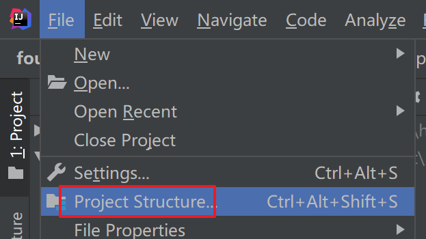

    

  - 点击Facets找到叶子

    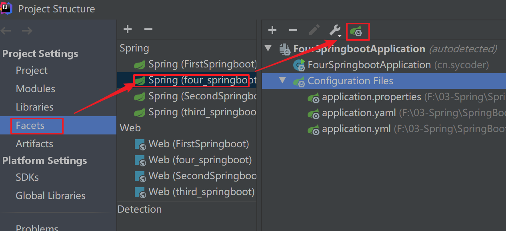

    

  - 添加文件即可

    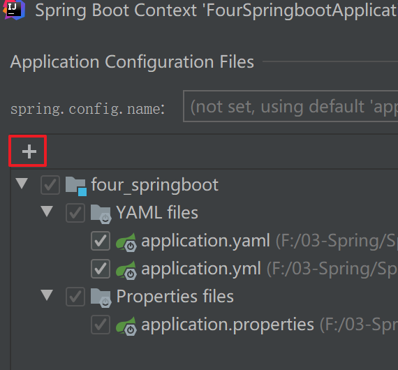

#### 2.2.3读取 yaml 数据

- 读取单行数据

  ```java
  @Value("${sy.name}")
  private String name;
  ```

### 2.3`@ConfigurationProperties`

#### 1. 基本概念

`@ConfigurationProperties` 注解用于将配置文件中的属性绑定到一个 Java 对象上。这些属性可以来自 `application.properties` 或 `application.yml` 文件。Spring Boot 会自动将这些属性**映射**到相应的字段上。

#### 2.示例

#### 1.配置依赖

```xml
<!-- Maven -->
<dependency>
    <groupId>org.springframework.boot</groupId>
    <artifactId>spring-boot-configuration-processor</artifactId>
    <optional>true</optional>
</dependency>
```

#### 2. 配置文件 `application.yml`

```java
server:
  port: 8080
  servlet:
    context-path: /myapp

app:
  name: My Application
  version: 1.0.0
  settings:
    timeout: 30000
    max-threads: 100
```

#####   3. 配置类 AppProperties.java

```java
import org.springframework.boot.context.properties.ConfigurationProperties;
import org.springframework.stereotype.Component;

@Component
@ConfigurationProperties(prefix = "app")
@Data
public class AppProperties {
    private String name;
    private String version;
    private Settings settings;
}
```

##### 4. 服务类 ConfigService.java

```java
import org.springframework.beans.factory.annotation.Autowired;
import org.springframework.stereotype.Service;

@Service
public class ConfigService {			
	@Autowired
    private  AppProperties appProperties;

    public String getAppName() {
        return appProperties.getName();
    }

    public String getAppVersion() {
        return appProperties.getVersion();
    }

    public int getAppTimeout() {
        return appProperties.getSettings().getTimeout();
    }

    public int getAppMaxThreads() {
        return appProperties.getSettings().getMaxThreads();
    }
}
```

### 2.4 `Environment` 接口

`Environment` 接口用于获取应用程序的环境信息，包括系统属性、环境变量和配置文件中的属性。通过 `Environment` 接口，你可以在应用程序中动态地访问和使用这些配置信息。

- 假设你有一个 `application.yml` 文件，内容如下：

  ```java
  server:
    port: 8080
    servlet:
      context-path: /myapp
  
  app:
    name: My Application
    version: 1.0.0
  ```

- 依赖注入，并获取

  ```java
  @Service
  public class ConfigService {
  
      @Autowired
      private Environment environment;
      
      public String getAppName() {
          return environment.getProperty("app.name");
      }
  }
  ```

### 2.5配置文件优先级

- properties > yml > yaml

## 3.配置文件抽取公共配置

- 重复配置需要抽取

  ```java
  basedir: /home/springboot
  
  dir:
    logdir: ${basedir}/log
    picturedir: ${basedir}/picture
  ```

# 五、SSM整合

## 1.整合Mybatis

### 1.1springmvc 整合回顾

- 导入坐标

  ```java
  <dependency>
        <groupId>org.springframework</groupId>
        <artifactId>spring-jdbc</artifactId>
        <version>5.2.17.RELEASE</version>
      </dependency>
      <dependency>
        <groupId>org.mybatis</groupId>
        <artifactId>mybatis</artifactId>
        <version>3.5.6</version>
      </dependency>
  
      <dependency>
        <groupId>org.mybatis</groupId>
        <artifactId>mybatis-spring</artifactId>
        <version>1.3.0</version>
      </dependency>
  
      <dependency>
        <groupId>mysql</groupId>
        <artifactId>mysql-connector-java</artifactId>
        <version>8.0.29</version>
      </dependency>
  
      <dependency>
        <groupId>com.alibaba</groupId>
        <artifactId>druid</artifactId>
        <version>1.1.16</version>
      </dependency>
  ```

- 创建数据库配置文件

  ```java
  jdbc.url=jdbc:mysql://localhost:3306/ssm
  jdbc.driver=com.mysql.cj.jdbc.Driver
  jdbc.username=root
  jdbc.password=123456
  ```

- 提供jdbcconfig

  ```java
  public class DbConfig {
  
      @Value("${jdbc.url}")
      private String url;
      @Value("${jdbc.driver}")
      private String driver;
      @Value("${jdbc.username}")
      private String username;
      @Value("${jdbc.password}")
      private String password;
  
      /**
       * 配置德鲁伊连接池
       * @return
       */
      @Bean
      public DataSource dataSource(){
          DruidDataSource source = new DruidDataSource();
          source.setUrl(url);
          source.setDriverClassName(driver);
          source.setPassword(password);
          source.setUsername(username);
          return source;
      }
  
      @Bean
      public PlatformTransactionManager transactionManager(DataSource dataSource){
          DataSourceTransactionManager manager = new DataSourceTransactionManager();
          manager.setDataSource(dataSource);
          return manager;
      }
  
  }
  ```

- springconfig

  ```java
  @Configuration
  @ComponentScan(value = {"cn.sycoder.service","cn.sycoder.dao"})
  @EnableTransactionManagement
  @PropertySource("classpath:db.properties")
  @Import({DbConfig.class,MybatisConfig.class})
  public class SpringConfig {
  }
  ```

- mybatis 交给spring管理

  ```java
  public class MybatisConfig {
  
      @Bean
      public SqlSessionFactoryBean sessionFactoryBean(DataSource dataSource){
          SqlSessionFactoryBean bean = new SqlSessionFactoryBean();
          bean.setDataSource(dataSource);
          bean.setTypeAliasesPackage("cn.sycoder.domain");
          return bean;
      }
  
      @Bean
      public MapperScannerConfigurer mapperScannerConfigurer(){
          MapperScannerConfigurer configurer = new MapperScannerConfigurer();
          configurer.setBasePackage("cn.sycoder.dao");
          return configurer;
      }
  }
  ```

### 1.2SpringBoot整合Mybatis

#### 1.2.1创建模块

- 创建模块并填入基础信息

  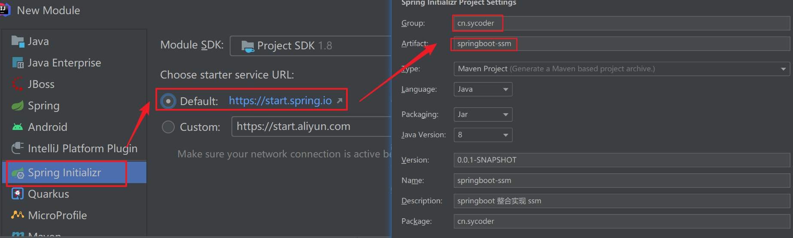

  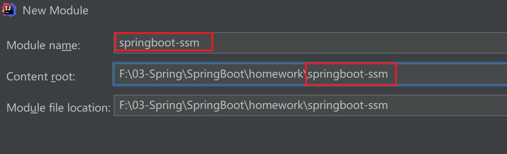

- 添加依赖

  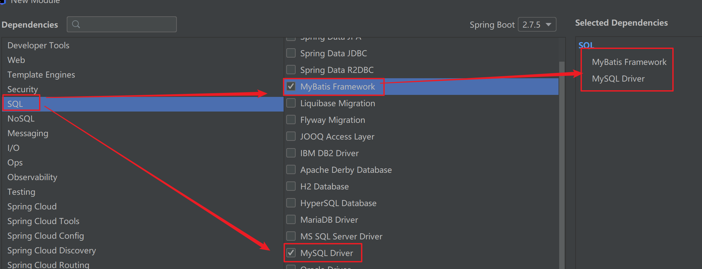

  - 等价于手动添加配置依赖

    ```java
    <dependency>
        <groupId>org.mybatis.spring.boot</groupId>
        <artifactId>mybatis-spring-boot-starter</artifactId>
        <version>2.2.2</version>
    </dependency>
    
    <dependency>
        <groupId>com.mysql</groupId>
        <artifactId>mysql-connector-j</artifactId>
        <scope>runtime</scope>
    </dependency>
    ```

  

#### 1.2.2添加配置

- 添加mysql配置

  ```yml
  spring:
    datasource:
      driver-class-name: com.mysql.cj.jdbc.Driver
      url: jdbc:mysql://localhost:3306/springboot_ssm
      username: root
      password: 123456
  ```

#### 1.2.3创建mapper并且测试

- 创建 domain

  ```java
  @Data
  public class Item {
      private Long id;
      private String name;
      private String remark;
  }
  ```

- 创建 mapper

  ```java
  @Mapper
  public interface ItemMapper {
      @Insert("insert into item(name,remark) value(#{name},#{remark})")
      void insert(Item item);
  
      @Select("select * from item where id = #{id}")
      public Item getById(Long id);
  }
  ```

- 测试验证

  ```java
  @SpringBootTest
  class SpringbootSsmApplicationTests {
  
      @Autowired
      ItemMapper mapper;
  
      @Test
      void contextLoads() {
          Item item = new Item();
          item.setName("BWH javase 精讲");
          item.setRemark("课程免费，知识全面");
          mapper.insert(item);
  
          System.out.println(mapper.getById(1L));
      }
  
  }
  ```

  

#### 1.2.4总结

- 使用SpringBoot 整合真的太方便了
  - 需要添加 mybatis 的依赖也即mybatis-spring-boot-starter
  - **@Mapper 将Mapper 映射交给容器管理**
  - 如果有下划线你觉得难受，添加 @Repository就可以解决（不解决也行）


## 2.整合Druid

### 2.1目前使用的数据连接池

- 默认springboot会给我们使用 Hikari 连接池

  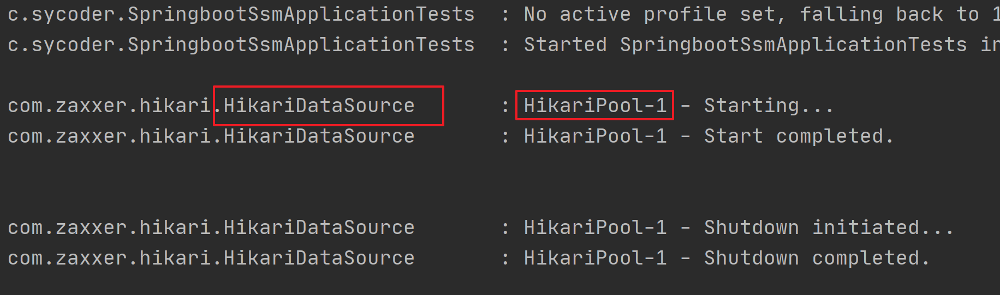

- 整合德鲁伊
  - 导入对应starter
  - 修改配置即可

### 2.2导入依赖

- 导入依赖

  **SpringBoot2**
  
  ```xml
  <dependency>
      <groupId>com.alibaba</groupId>
      <artifactId>druid-spring-boot-starter</artifactId>
      <version>1.2.15</version>
  </dependency>
  ```
  
  **SpringBoot3**
  
  ```xml
  <dependency>
  	<groupId>com.alibaba</groupId>
  	<artifactId>druid-spring-boot-3-starter</artifactId>
      <version>1.2.20</version>
  </dependency>
  ```
  
  

### 2.3修改配置

- 配置如下

  ```java
  spring:
    datasource:
      druid:
        url: jdbc:mysql://localhost:3306/springboot_ssm
        username: root
        password: 123456
        driver-class-name: com.mysql.cj.jdbc.Driver
  ```

  

- 日志查看

  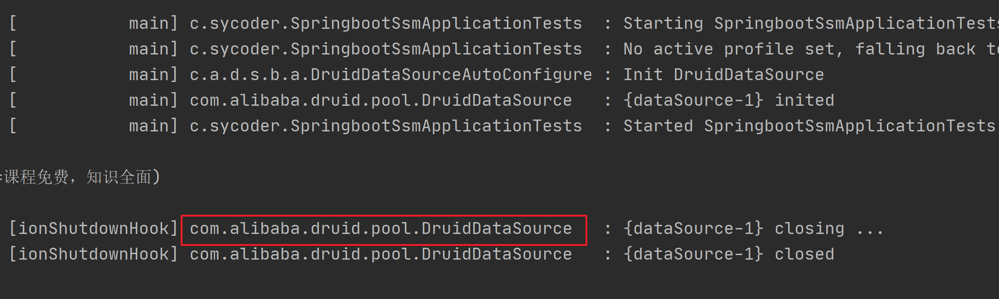

- 配置总结
  - 导入Druid starter
  - 提供配置文件

## 3.整合JUnit

- 导入依赖

  ```java
  <dependency>
      <groupId>org.springframework.boot</groupId>
      <artifactId>spring-boot-starter-test</artifactId>
      <scope>test</scope>
  </dependency>
  ```

- 传统方式

  ```java
  @RunWith(SpringJUnit4ClassRunner.class)
  @ContextConfiguration(classes = SpringConfig.class)
  public class ItemTest {
  
      @Autowired
      IItemService service;
      @Test
      public void save(){
          Item item = new Item();
          item.setName("单元测试");
          item.setRemark("单元测试");
          item.setType("单元测试");
          boolean save = service.save(item);
          System.out.println(save);
      }
  }
  ```

### 3.1@SpringBootTest

- 现在的使用

  ```java
  @SpringBootTest
  class SpringbootSsmApplicationTests {
  
      @Autowired
      ItemMapper mapper;
  
      @Test
      void contextLoads() {
          Item item = new Item();
          item.setName("上云 javase 精讲");
          item.setRemark("课程免费，知识全面");
          mapper.insert(item);
  
          System.out.println(mapper.getById(1L));
      }
  
  }
  ```

  

## 4.整合其它总结

- 导入对应的 starter
- 需要写配置的提供配置

# 六、热部署

## 1.热部署概述

- 概述：程序更改后，不需要重新启动服务器也能够实现动态更新


- springboot 项目如何实现热部署？
  - tomcat 已经内置到项目容器中了
  - 希望tomcat监听外部程序变化
  - 通过新建一个程序来监控你代码的变化


## 2.依赖导入

- 依赖

  ```java
  <dependency>
         <groupId>org.springframework.boot</groupId>
         <artifactId>spring-boot-devtools</artifactId>
         <optional>true</optional>
   </dependency>
  ```


## 3.手动 builder

- 图示

  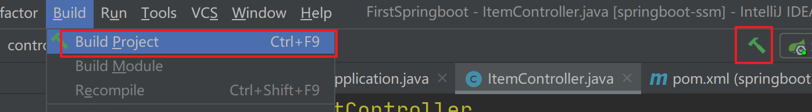

- 快捷键 ctrl + f9

## 4.自动热部署

- 设置自动热部署

- 打开设置

  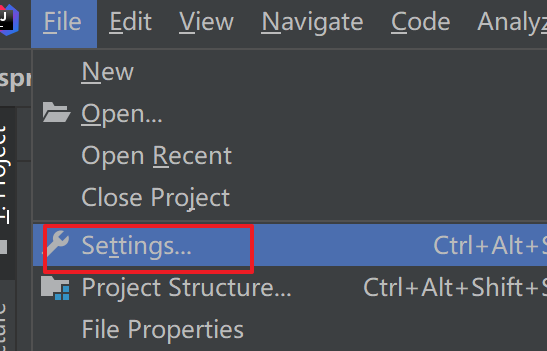

  

- 设置 complier

  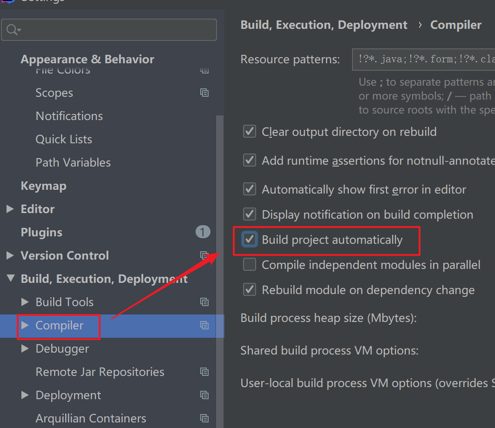

  

- ctrl + shfit + alt + / 打开一个维护面板

  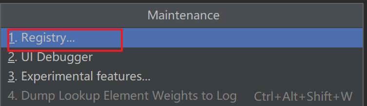

  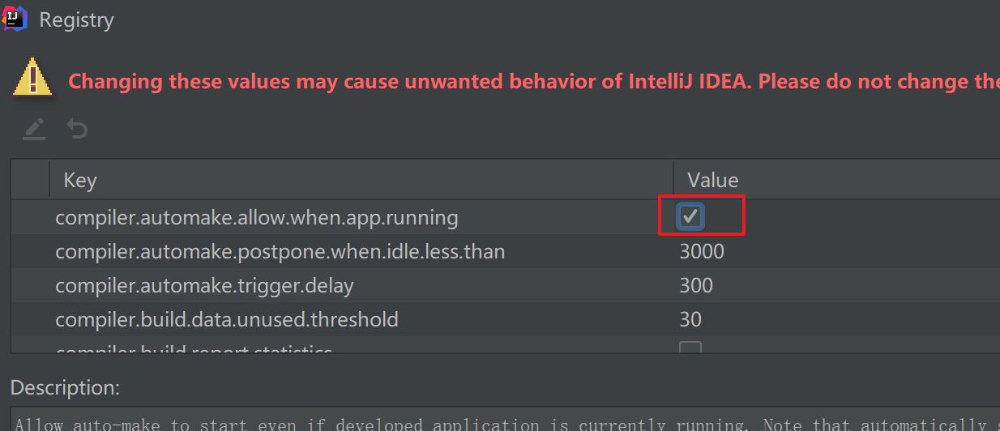

  

## 5.修改热部署监控资源

- 通过配置指定热部署不参与文件

  ```java
  devtools:
    restart:
      exclude: application.yml,application.properties
  ```

- **尽量不要太依赖热部署，万一热部署出问题的时候，一直在找幽灵BUG**

# 七、SpringBoot项目的打包与运行

## 1.目前项目怎么运行的

- 通过浏览器访问idea

  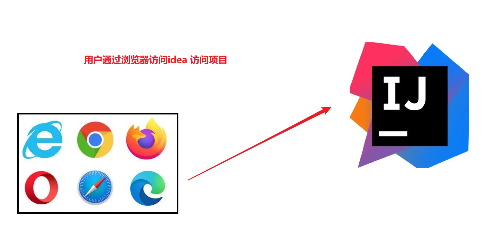

- 将jar部署到服务器

  


## 2.maven 打包项目

- 命令

  ```java
  mvn package
  ```

- 使用命令后会得到如下的jar

  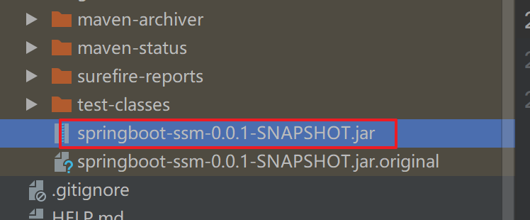

## 3.程序运行

- 命令

  ```java
  java -jar 项目.jar
  ```

- 启动如下

  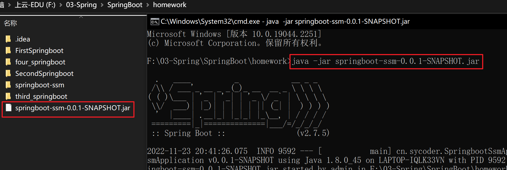

## 4.springboot打包需要插件

- 插件

  ```java
  <plugin>
      <groupId>org.springframework.boot</groupId>
      <artifactId>spring-boot-maven-plugin</artifactId>
  </plugin>
  ```

  

- 如果没有插件会出现如下问题

  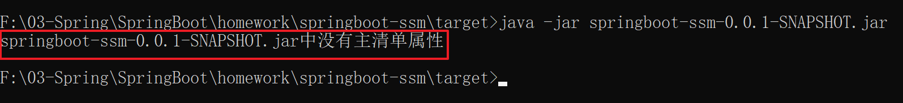

  

- 如果不加插件，打包只是打自己，代码量很少

  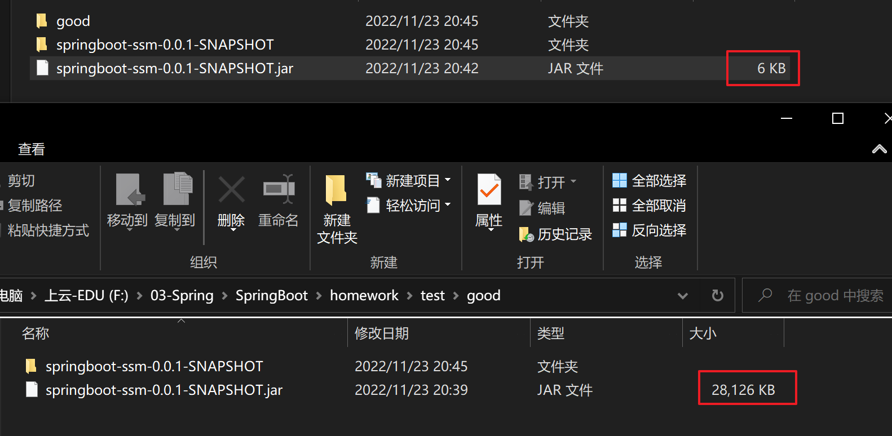

- 解压后对比

  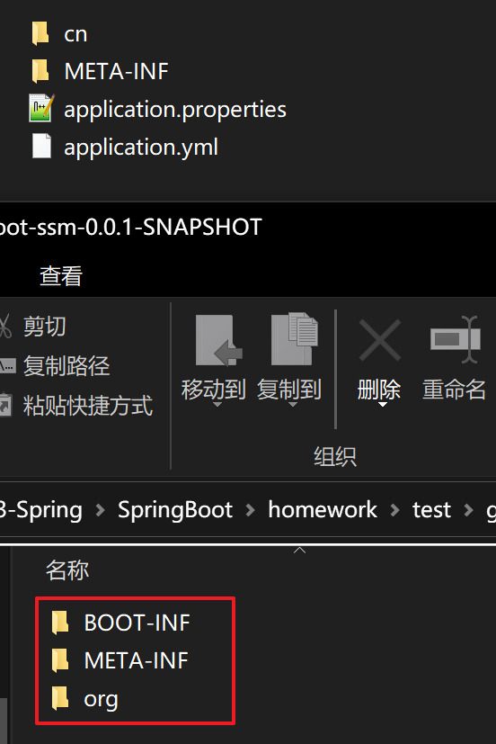

- 正确打包的包含这个配置文件

  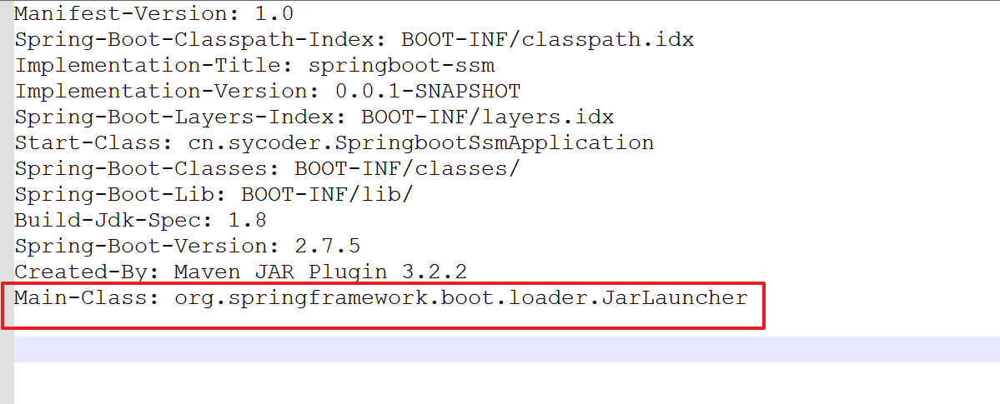

- 通过插件打包，可以把当前的jar打包成一个独立可运行的jar运行
  - 包含原始工程的依赖jar
  - 读取MANIFEST.MF Main-Class 可以得到启动类
  - 运行JarLauncher 类执行


`JarLauncher` 是 Spring Boot 内部使用的一个类，用于启动打包成 JAR 文件的 Spring Boot 应用程序。当你运行一个 Spring Boot JAR 文件时，`JarLauncher` 会负责初始化和启动应用程序。

### 什么是 JarLauncher？

`JarLauncher` 是 `org.springframework.boot.loader.JarLauncher` 类的一个实例，它是 Spring Boot 的 `spring-boot-loader` 模块的一部分。这个模块提供了加载和启动嵌入式 JAR 文件所需的功能。

### 工作原理

当你使用 `java -jar your-app.jar` 命令启动一个 Spring Boot 应用程序时，以下是发生的过程：

1. **启动 `JarLauncher`**：
   - JVM 加载 `JarLauncher` 类。
   - `JarLauncher` 类的 `main` 方法被调用。
2. **初始化 ClassLoader**：
   - `JarLauncher` 初始化一个自定义的 `ClassLoader`，用于加载 JAR 文件中的类和资源。
3. **启动应用程序**：
   - `JarLauncher` 调用 `SpringApplication.run` 方法，启动 Spring Boot 应用程序。
   - `SpringApplication` 负责初始化 Spring 容器，加载配置文件，启动嵌入式服务器（如 Tomcat），并启动应用程序。

### 示例

假设你有一个简单的 Spring Boot 应用程序，打包成 `myapp.jar`。你可以使用以下命令启动它：

sh浅色版本

```
java -jar myapp.jar
```

在这个过程中，`JarLauncher` 会执行以下步骤：

1. **加载 `JarLauncher` 类**：
   - JVM 加载 `org.springframework.boot.loader.JarLauncher` 类。
2. **调用 `main` 方法**：
   - `JarLauncher` 类的 `main` 方法被调用。
3. **初始化 ClassLoader**：
   - `JarLauncher` 初始化一个 `LaunchedURLClassLoader`，用于加载 JAR 文件中的类和资源。
4. **启动应用程序**：
   - `JarLauncher` 调用 `SpringApplication.run` 方法，启动 Spring Boot 应用程序。

## 5. Spring Boot 打成的 jar 和普通的 jar 有什么区别 ?

- Spring Boot 项目最终打包成的 jar 是可执行 jar ，这种 jar 可以直接通过 java -jar xxx.jar 命
  令来运行，这种 jar 不可以作为普通的 jar 被其他项目依赖，即使依赖了也无法使用其中的类。
- Spring Boot 的 jar 无法被其他项目依赖，主要还是他和普通 jar 的结构不同。普通的 jar 包，解压
  后直接就是包名，包里就是我们的代码，而 Spring Boot 打包成的可执行 jar 解压后，在 \BOOT-
  INF\classes 目录下才是我们的代码，因此无法被直接引用。如果非要引用，可以在 pom.xml
  文件中增加配置，将 Spring Boot 项目打包成两个 jar ，一个可执行，一个可引用