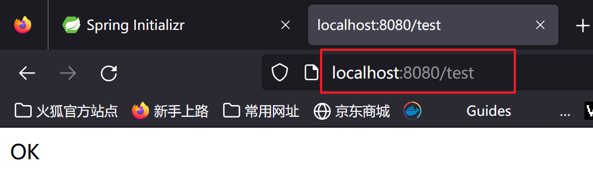
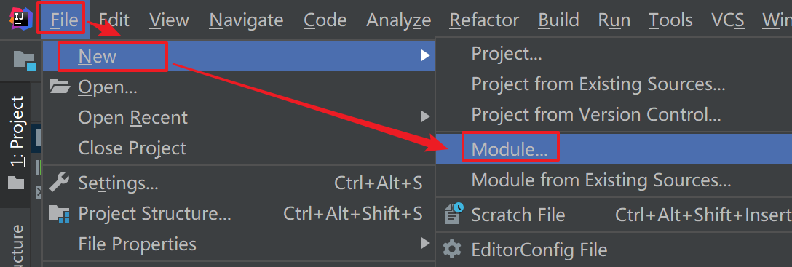

# 一、SpringBoot 概述

- 文档下载地址：https://docs.spring.io/spring-boot/docs/current/reference/

## 1.SpringBoot介绍

- 概述：SpringBoot 开发团队认为Spring操作太繁琐了，目的在于简化开发配置，能够快速搭建开发环境，集成了tomcat，对于开发者而已特别方便友好。

## 2.特点

- 开箱即用
- 简化配置
- 集成了很多组件


## 3.系统要求

- 要求如下

  | 名称       | 版本要求 |
  | ---------- | -------- |
  | Maven      | 3.5+     |
  | Tomcat 9.0 | 4.0      |
  | jdk        | 1.8+     |
  | idea       | 2020.2   |

# 二、快速入门

## 1.通过SpringBoot官网构建项目

- 官网构建地址：https://start.spring.io/

### 1.1进入网页

- 进入页面选择如下

  

  

### 1.2添加依赖

- 点击右侧的ADD Dependencies

- 进入选择页面

  

- 选一个 SpringWeb 依赖

  

### 1.3生成文件包

- 点击GENERATE 生成程序文件包

  

  

  

### 1.4用Idea打开项目

- 直接Open 项目

  

- 配置 maven 从阿里云下载依赖

- 第一次下载需要不少时间，创建好空项目的时候，就应该把maven 设置好

- 得到如下代码

  

### 1.5新建Controller测试

- controller

  ```java
  @RestController
  public class TestController {
  
      @GetMapping("/test")
      public String test(){
          return "OK";
      }
  }
  ```

- 访问

  

## 2.通过idea快速构建SpringMVC项目

### 2.1创建新模块

- 创建新模块

  

- 添加基础信息

  

### 2.2添加依赖

- 选择需要的依赖

  

- 避免出现嵌套

  

### 2.3注意点

- 如果修改过模块名称，导致模块不是正常的结构，可以通过重新导入模块解决

  

- 自己手动标记

  

### 2.4新建Controller测试

- controller

  ```java
  @RestController
  public class TestController {
  
      @GetMapping("/test1")
      public String getTest(){
          return "OK1";
      }
  }
  ```

- 运行启动类 SecondSpringbootApplication

  

- 测试

  ```java
  http://localhost:8080/test1
  ```

## 3.通过Idea自定义服务网址构建

- 网址：https://start.aliyun.com

### 3.1新建模块

- 新建模块

  

- 添加基础信息

  


### 3.2添加依赖

- 添加依赖

  

- 新建模块

  


- 创建完成项目结构

  

### 3.3新建Controller测试

- 新建Controller

  ```java
  @RestController
  public class TestController {
  
      @GetMapping("/test3")
      public String test3(){
          return "OK3";
      }
  }
  ```

- 运行启动类 SpringBootApplication

  


- 测试

  ```java
  localhost:8080/test3
  ```

  


## 4.前三种的共同问题

- 都需要联网才能使用
- 对于一些保密单位只能访问内网，这个时候，前三种构建方式就行不通了

## 5.保密单位构建方式

- 华为/政府...进公司都需要过安检，一个U盘都带不进去也带不出去
- 联网就是通过Maven 加载一些需要的依赖而已，如果私服上面已经有了这些依赖


### 5.1新建模块

- 使用Maven 新建模块

  

  

- 使用Maven 构建

  

  

- 基础信息配置

  

### 5.2添加依赖

- 添加依赖

  ```java
  <?xml version="1.0" encoding="UTF-8"?>
  <project xmlns="http://maven.apache.org/POM/4.0.0"
           xmlns:xsi="http://www.w3.org/2001/XMLSchema-instance"
           xsi:schemaLocation="http://maven.apache.org/POM/4.0.0 http://maven.apache.org/xsd/maven-4.0.0.xsd">
      <modelVersion>4.0.0</modelVersion>
  
      <groupId>cn.sycoder</groupId>
      <artifactId>four_springboot</artifactId>
      <version>1.0-SNAPSHOT</version>
      <parent>
          <groupId>org.springframework.boot</groupId>
          <artifactId>spring-boot-starter-parent</artifactId>
          <version>2.7.5</version>
          <relativePath/> <!-- lookup parent from repository -->
      </parent>
      <properties>
          <java.version>1.8</java.version>
      </properties>
      <dependencies>
          <dependency>
              <groupId>org.springframework.boot</groupId>
              <artifactId>spring-boot-starter-web</artifactId>
          </dependency>
  
          <dependency>
              <groupId>org.springframework.boot</groupId>
              <artifactId>spring-boot-starter-test</artifactId>
              <scope>test</scope>
          </dependency>
      </dependencies>
      <build>
          <plugins>
              <plugin>
                  <groupId>org.springframework.boot</groupId>
                  <artifactId>spring-boot-maven-plugin</artifactId>
              </plugin>
          </plugins>
      </build>
  
  </project>
  ```

### 5.3添加启动类

- 添加启动类

  ```java
  @SpringBootApplication
  public class FourSpringbootApplication {
      public static void main(String[] args) {
          SpringApplication.run(FourSpringbootApplication.class, args);
      }
  }
  ```

- 注意：

  - @SpringBootApplication 别遗漏，这个是SpringBoot 的核心

### 5.4新建Controller测试

- 新建Controller

  ```java
  @RestController
  public class TestController {
      @GetMapping("/test04")
      public String test04(){
          return "OK4";
      }
  }
  ```

- 访问地址

  ```java
  localhost:8080/test04
  ```

- 总结

  - 创建Maven工程
  - 继承 spring-boot-starter-parent
  - 添加依赖 spring-boot-starter-web
  - 创建启动类 FourSpringbootApplication
  - 测试验证

# 三、SpringBoot介绍

## 1.parent

- 前言：之前是使用spring/springmvc 开发，整合不同的组件会有很多依赖，这些依赖会涉及到很多的版本信息，版本信息多了之后可能会导致版本冲突问题
- 概述：把很多组件技术的搭配放到一起，名字就叫 parent

### 1.1实际开发中会引入 parent

- 引入parent

  ```java
  <parent>
      <groupId>org.springframework.boot</groupId>
      <artifactId>spring-boot-starter-parent</artifactId>
      <version>2.7.5</version>
      <relativePath/> <!-- lookup parent from repository -->
  </parent>
  ```

- 点击后发现又引入了一个 parent

  - 通过该parent 能够找到对应的搭配

  ```java
  <parent>
      <groupId>org.springframework.boot</groupId>
      <artifactId>spring-boot-dependencies</artifactId>
      <version>2.7.5</version>
  </parent>
  ```

- 通过propertie管理版本信息

  ```java
  <properties>
      <activemq.version>5.16.5</activemq.version>
      <antlr2.version>2.7.7</antlr2.version>
      <appengine-sdk.version>1.9.98</appengine-sdk.version>
      <artemis.version>2.19.1</artemis.version>
      <aspectj.version>1.9.7</aspectj.version>
      <assertj.version>3.22.0</assertj.version>
      <atomikos.version>4.0.6</atomikos.version>
      <awaitility.version>4.2.0</awaitility.version>
      <build-helper-maven-plugin.version>3.3.0</build-helper-maven-plugin.version>
      <byte-buddy.version>1.12.18</byte-buddy.version>
      <cache2k.version>2.6.1.Final</cache2k.version>
  </properties>
  ```

- 通过dependencyManagement去管理依赖

  ```java
  <dependencyManagement>
      <dependencies>
        <dependency>
          <groupId>org.apache.activemq</groupId>
          <artifactId>activemq-amqp</artifactId>
          <version>${activemq.version}</version>
        </dependency>
        <dependency>
          <groupId>org.apache.activemq</groupId>
          <artifactId>activemq-blueprint</artifactId>
          <version>${activemq.version}</version>
        </dependency>
  </dependencyManagement>
  ```

### 1.2引入依赖

- 通过 dependencies

  ```java
  <dependency>
      <groupId>org.springframework.boot</groupId>
      <artifactId>spring-boot-starter-web</artifactId>
  </dependency>
  ```

- 通过导入方式获取依赖

  ```java
  <dependencyManagement>
          <dependencies>
              <dependency>
                  <groupId>org.springframework.boot</groupId>
                  <artifactId>spring-boot-dependencies</artifactId>
                  <version>${spring-boot.version}</version>
                  <type>pom</type>
                  <scope>import</scope>
              </dependency>
          </dependencies>
  </dependencyManagement>
  ```

## 2.starter

- 回顾springmvc
  - 问题：之前的操作导入依赖比较麻烦，比如我们要使用Spring-webmvc 一定会去使用Spring-web
  - 引入太繁琐不好管理
- starter：springboot团队直接把这些固定搭配技术做成一个成品

### 2.1实际开发体验

- 开发springmvc

  ```java
  <dependency>
      <groupId>org.springframework.boot</groupId>
      <artifactId>spring-boot-starter-web</artifactId>
  </dependency>
  ```

- 点击引入的依赖会有如下依赖

  ```java
  <dependencies>
      <dependency>
        <groupId>org.springframework.boot</groupId>
        <artifactId>spring-boot-starter</artifactId>
        <version>2.7.5</version>
        <scope>compile</scope>
      </dependency>
      <dependency>
        <groupId>org.springframework.boot</groupId>
        <artifactId>spring-boot-starter-json</artifactId>
        <version>2.7.5</version>
        <scope>compile</scope>
      </dependency>
      <dependency>
        <groupId>org.springframework.boot</groupId>
        <artifactId>spring-boot-starter-tomcat</artifactId>
        <version>2.7.5</version>
        <scope>compile</scope>
      </dependency>
      <dependency>
        <groupId>org.springframework</groupId>
        <artifactId>spring-web</artifactId>
        <version>5.3.23</version>
        <scope>compile</scope>
      </dependency>
      <dependency>
        <groupId>org.springframework</groupId>
        <artifactId>spring-webmvc</artifactId>
        <version>5.3.23</version>
        <scope>compile</scope>
      </dependency>
    </dependencies>
  ```

- ### 如何引入json操作

  ```java
  <dependency>
        <groupId>org.springframework.boot</groupId>
        <artifactId>spring-boot-starter-json</artifactId>
        <version>2.7.5</version>
        <scope>compile</scope>
      </dependency>
  ```

- 点开又会找到曾经我们导入的依赖

  ```java
  <dependencies>
      <dependency>
        <groupId>org.springframework.boot</groupId>
        <artifactId>spring-boot-starter</artifactId>
        <version>2.7.5</version>
        <scope>compile</scope>
      </dependency>
      <dependency>
        <groupId>org.springframework</groupId>
        <artifactId>spring-web</artifactId>
        <version>5.3.23</version>
        <scope>compile</scope>
      </dependency>
      <dependency>
        <groupId>com.fasterxml.jackson.core</groupId>
        <artifactId>jackson-databind</artifactId>
        <version>2.13.4.2</version>
        <scope>compile</scope>
      </dependency>
      <dependency>
        <groupId>com.fasterxml.jackson.datatype</groupId>
        <artifactId>jackson-datatype-jdk8</artifactId>
        <version>2.13.4</version>
        <scope>compile</scope>
      </dependency>
      <dependency>
        <groupId>com.fasterxml.jackson.datatype</groupId>
        <artifactId>jackson-datatype-jsr310</artifactId>
        <version>2.13.4</version>
        <scope>compile</scope>
      </dependency>
      <dependency>
        <groupId>com.fasterxml.jackson.module</groupId>
        <artifactId>jackson-module-parameter-names</artifactId>
        <version>2.13.4</version>
        <scope>compile</scope>
      </dependency>
    </dependencies>
  ```

### 2.2starter总结

- starter 其实就是很多个坐标的组合

- 以后引入了什么坐标，直接通过maven观察即可

  

  

### 2.3parent和starter总结

- parent作用：
  - 定义若干版本信息，交给springboot统一管理，目的是减少依赖冲突
- starter作用
  - 在同一个坐标中定义多个坐标，目的是简化依赖配置
- 使用步骤
  - 先去找有没有starter ，如果有直接引用
  - 没有直接提供版本信息即可


## 3.引导类

### 3.1传统spring配置

- 提供如下配置
  - SpringConfig
  - SpringMvcConfig


### 3.2引导类作用

- SpringBoot工程提供引导类用来**启动程序**

- SpringBoot工程启动后创建并初始化Spring容器

  - 证明创建了Spring容器

    ```java
    @SpringBootApplication
    public class FourSpringbootApplication {
        public static void main(String[] args) {
            ConfigurableApplicationContext context = SpringApplication.run(FourSpringbootApplication.class, args);
            TestController bean = context.getBean(TestController.class);
            System.out.println(bean.test04());
        }
    }
    ```

- 注意：引导类必须有一个注解@SpringBootApplication，否则启动不起来

## 4.内嵌tomcat

### 4.1定义依赖

- 依赖

  ```java
  <dependency>
      <groupId>org.springframework.boot</groupId>
      <artifactId>spring-boot-starter-web</artifactId>
  </dependency>
  ```

- 点开发现如下依赖

  ```java
  <dependencies>
      <dependency>
        <groupId>org.springframework.boot</groupId>
        <artifactId>spring-boot-starter</artifactId>
        <version>2.7.5</version>
        <scope>compile</scope>
      </dependency>
      <dependency>
        <groupId>org.springframework.boot</groupId>
        <artifactId>spring-boot-starter-json</artifactId>
        <version>2.7.5</version>
        <scope>compile</scope>
      </dependency>
      <dependency>
        <groupId>org.springframework.boot</groupId>
        <artifactId>spring-boot-starter-tomcat</artifactId>
        <version>2.7.5</version>
        <scope>compile</scope>
      </dependency>
      <dependency>
        <groupId>org.springframework</groupId>
        <artifactId>spring-web</artifactId>
        <version>5.3.23</version>
        <scope>compile</scope>
      </dependency>
      <dependency>
        <groupId>org.springframework</groupId>
        <artifactId>spring-webmvc</artifactId>
        <version>5.3.23</version>
        <scope>compile</scope>
      </dependency>
    </dependencies>
  ```

- 点击spring-boot-starter-tomcat

  ```java
  <dependencies>
      <dependency>
        <groupId>jakarta.annotation</groupId>
        <artifactId>jakarta.annotation-api</artifactId>
        <version>1.3.5</version>
        <scope>compile</scope>
      </dependency>
      <dependency>
        <groupId>org.apache.tomcat.embed</groupId>
        <artifactId>tomcat-embed-core</artifactId>
        <version>9.0.68</version>
        <scope>compile</scope>
        <exclusions>
          <exclusion>
            <artifactId>tomcat-annotations-api</artifactId>
            <groupId>org.apache.tomcat</groupId>
          </exclusion>
        </exclusions>
      </dependency>
      <dependency>
        <groupId>org.apache.tomcat.embed</groupId>
        <artifactId>tomcat-embed-el</artifactId>
        <version>9.0.68</version>
        <scope>compile</scope>
      </dependency>
      <dependency>
        <groupId>org.apache.tomcat.embed</groupId>
        <artifactId>tomcat-embed-websocket</artifactId>
        <version>9.0.68</version>
        <scope>compile</scope>
        <exclusions>
          <exclusion>
            <artifactId>tomcat-annotations-api</artifactId>
            <groupId>org.apache.tomcat</groupId>
          </exclusion>
        </exclusions>
      </dependency>
    </dependencies>
  ```

  

### 4.2Tomcat运行原理

- tomcat:是java语言开发的软件，就可以通过直接创建tomcat对象的方式去运行tomcat

- 如何交给spring管理的

  ```java
  <dependency>
    <groupId>org.apache.tomcat.embed</groupId>
    <artifactId>tomcat-embed-core</artifactId>
    <version>9.0.68</version>
    <scope>compile</scope>
    <exclusions>
      <exclusion>
        <artifactId>tomcat-annotations-api</artifactId>
        <groupId>org.apache.tomcat</groupId>
      </exclusion>
    </exclusions>
  </dependency>
  ```

  

- 通过 starter引入 tomcat 服务器之后就可以直接创建tomcat对象了

  ```java
  <dependency>
    <groupId>org.springframework.boot</groupId>
    <artifactId>spring-boot-starter-tomcat</artifactId>
    <version>2.7.5</version>
    <scope>compile</scope>
  </dependency>
  ```

### 4.3更换内置服务器

- **tomcat(默认)**：apache公司的，受众大，使用多，提供了较多组件
- jetty：轻量级服务器，负载比tomcat弱
- undertow

- 更换内置服务器操作

  ```java
  <dependencies>
          <dependency>
              <groupId>org.springframework.boot</groupId>
              <artifactId>spring-boot-starter-web</artifactId>
              <exclusions>
                  <exclusion>
                      <groupId>org.springframework.boot</groupId>
                      <artifactId>spring-boot-starter-tomcat</artifactId>
                  </exclusion>
              </exclusions>
          </dependency>
          <dependency>
              <groupId>org.springframework.boot</groupId>
              <artifactId>spring-boot-starter-jetty</artifactId>
          </dependency>
      </dependencies>
  ```

### 4.4总结

- tomcat 只是springboot中的一个依赖而已
- 想要什么服务器，直接导入对应的starter包即可


# 四、配置文件

## 1.前言

- 曾经使用SpringMVC的时候是手动修改tomcat配置的端口信息，那现在Springboot如何修改？
- springboot有一个默认的配置文件  application.properties

## 2.配置文件分类

- 常用配置信息官方文档地址

  ```java
  https://docs.spring.io/spring-boot/docs/current/reference/html/application-properties.html#appendix.application-properties
  ```

- 以后记不住什么配置的时候，就去官方找

### 2.1properties

#### 2.1.1修改端口测试

- 默认Springboot 通过 application.properties就可以修改默认配置

- 通过properties 修改端口信息

  

  

- 修改后重启项目查看日志

  

- 修改 banner 文件(直接新建一个 banner.txt 文件在idea resources下面即可)

  ```java
              _.._       ,------------------------.
          ,'      `.    (        云哥带我们月薪上万！  )
         /  __) __` \    `-,----------------------'
        (  (`-`(-')  ) _.-'
        /)  \  = /  (
       /'    |--' .  \
      (  ,---|  `-.)__`
       )(  `-.,--'   _`-.
      '/,'          (  Uu",
       (。       ,    `/,-' )
       `.__,  : `。'/  /`--'
         |     `--'  |
         `   `-._   /
          \        (
          /\ .      \.
         / |` \     ,-\
        /  \| .)   /   \
       ( ,'|\    ,'     :
       | \,`.`--"/      }
       `,'    \  |,'    /
      / "-._   `-/      |
      "-.   "-.,'|     ;
     /        _/["---'""]
    :        /  |"-     '
    '           |      /
    |           `      |
  ```

  

### 2.2yaml 格式

#### 2.2.1语法要求

- 要求
  - #号 表示注释
  - 大小写敏感
  - 属性层级关系使用多行描述，每行结尾使用冒号结束
  - 使用缩进表示层级关系，同层级左侧对齐，只允许使用空格（不允许使用Tab键）
  - 属性值前面添加空格（属性名与属性值之间使用冒号+空格作为分隔）

#### 2.2.2分类

- yml格式（主流格式）

  - 修改端口信息为8082:新建 application.yml

    ```java
    server:
      port: 8082
    ```

    

- yaml格式

  - 修改端口信息为8888：新建 application.yaml

    ```java
    server:
      port: 8888
    ```

- 如果两者没有配置提示，添加一个操作即可

  - 找到项目设置

    

    

  - 点击Facets找到叶子

    

    

  - 添加文件即可

    

#### 2.2.3读取 yaml 数据

- 读取单行数据

  ```java
  @Value("${sy.name}")
  private String name;
  ```

- 读取配置全部数据:注意要导入spring包的类

  ```java
  @Autowired
  private Environment env;
  ```

- 读取对象数据

  ```java
  @Component
  @ConfigurationProperties(prefix = "sy")
  @Data
  public class User {
      private String name;
      private String password;
  }
  ```

  - @ConfigurationProperties 注解必须指定读取数据的前缀

### 2.3配置文件优先级

- properties > yml > yaml


## 3.配置文件抽取公共配置

- 重复配置需要抽取

  ```java
  basedir: /home/springboot
  
  dir:
    logdir: ${basedir}/log
    picturedir: ${basedir}/picture
  ```

# 五、SSM整合

## 1.整合Mybatis

### 1.1springmvc 整合回顾

- 导入坐标

  ```java
  <dependency>
        <groupId>org.springframework</groupId>
        <artifactId>spring-jdbc</artifactId>
        <version>5.2.17.RELEASE</version>
      </dependency>
      <dependency>
        <groupId>org.mybatis</groupId>
        <artifactId>mybatis</artifactId>
        <version>3.5.6</version>
      </dependency>
  
      <dependency>
        <groupId>org.mybatis</groupId>
        <artifactId>mybatis-spring</artifactId>
        <version>1.3.0</version>
      </dependency>
  
      <dependency>
        <groupId>mysql</groupId>
        <artifactId>mysql-connector-java</artifactId>
        <version>8.0.29</version>
      </dependency>
  
      <dependency>
        <groupId>com.alibaba</groupId>
        <artifactId>druid</artifactId>
        <version>1.1.16</version>
      </dependency>
  ```

- 创建数据库配置文件

  ```java
  jdbc.url=jdbc:mysql://localhost:3306/ssm
  jdbc.driver=com.mysql.cj.jdbc.Driver
  jdbc.username=root
  jdbc.password=123456
  ```

- 提供jdbcconfig

  ```java
  public class DbConfig {
  
      @Value("${jdbc.url}")
      private String url;
      @Value("${jdbc.driver}")
      private String driver;
      @Value("${jdbc.username}")
      private String username;
      @Value("${jdbc.password}")
      private String password;
  
      /**
       * 配置德鲁伊连接池
       * @return
       */
      @Bean
      public DataSource dataSource(){
          DruidDataSource source = new DruidDataSource();
          source.setUrl(url);
          source.setDriverClassName(driver);
          source.setPassword(password);
          source.setUsername(username);
          return source;
      }
  
      @Bean
      public PlatformTransactionManager transactionManager(DataSource dataSource){
          DataSourceTransactionManager manager = new DataSourceTransactionManager();
          manager.setDataSource(dataSource);
          return manager;
      }
  
  }
  ```

- springconfig

  ```java
  @Configuration
  @ComponentScan(value = {"cn.sycoder.service","cn.sycoder.dao"})
  @EnableTransactionManagement
  @PropertySource("classpath:db.properties")
  @Import({DbConfig.class,MybatisConfig.class})
  public class SpringConfig {
  }
  ```

- mybatis 交给spring管理

  ```java
  public class MybatisConfig {
  
      @Bean
      public SqlSessionFactoryBean sessionFactoryBean(DataSource dataSource){
          SqlSessionFactoryBean bean = new SqlSessionFactoryBean();
          bean.setDataSource(dataSource);
          bean.setTypeAliasesPackage("cn.sycoder.domain");
          return bean;
      }
  
      @Bean
      public MapperScannerConfigurer mapperScannerConfigurer(){
          MapperScannerConfigurer configurer = new MapperScannerConfigurer();
          configurer.setBasePackage("cn.sycoder.dao");
          return configurer;
      }
  }
  ```

### 1.2SpringBoot整合Mybatis

#### 1.2.1创建模块

- 创建模块并填入基础信息

  

  

- 添加依赖

  

  - 等价于手动添加配置依赖

    ```java
    <dependency>
        <groupId>org.mybatis.spring.boot</groupId>
        <artifactId>mybatis-spring-boot-starter</artifactId>
        <version>2.2.2</version>
    </dependency>
    
    <dependency>
        <groupId>com.mysql</groupId>
        <artifactId>mysql-connector-j</artifactId>
        <scope>runtime</scope>
    </dependency>
    ```

  

#### 1.2.2添加配置

- 添加mysql配置

  ```yml
  spring:
    datasource:
      driver-class-name: com.mysql.cj.jdbc.Driver
      url: jdbc:mysql://localhost:3306/springboot_ssm
      username: root
      password: 123456
  ```

#### 1.2.3创建mapper并且测试

- 创建 domain

  ```java
  @Data
  public class Item {
      private Long id;
      private String name;
      private String remark;
  }
  ```

- 创建 mapper

  ```java
  @Mapper
  public interface ItemMapper {
      @Insert("insert into item(name,remark) value(#{name},#{remark})")
      void insert(Item item);
  
      @Select("select * from item where id = #{id}")
      public Item getById(Long id);
  }
  ```

- 测试验证

  ```java
  @SpringBootTest
  class SpringbootSsmApplicationTests {
  
      @Autowired
      ItemMapper mapper;
  
      @Test
      void contextLoads() {
          Item item = new Item();
          item.setName("上云 javase 精讲");
          item.setRemark("课程免费，知识全面");
          mapper.insert(item);
  
          System.out.println(mapper.getById(1L));
      }
  
  }
  ```

  

#### 1.2.4总结

- 使用SpringBoot 整合真的太方便了
  - 需要添加 mybatis 的依赖也即mybatis-spring-boot-starter
  - @Mapper 将Mapper 映射交给容器管理
  - 如果有下划线你觉得难受，添加 @Repository就可以解决（不解决也行）


## 2.整合Druid

### 2.1目前使用的数据连接池

- 默认springboot会给我们使用 Hikari 连接池

  

- 整合德鲁伊
  - 导入对应starter
  - 修改配置即可

### 2.2导入依赖

- 导入依赖

  ```java
  <dependency>
      <groupId>com.alibaba</groupId>
      <artifactId>druid-spring-boot-starter</artifactId>
      <version>1.2.15</version>
  </dependency>
  ```

### 2.3修改配置

- 配置如下

  ```java
  spring:
    datasource:
      druid:
        url: jdbc:mysql://localhost:3306/springboot_ssm
        username: root
        password: 123456
        driver-class-name: com.mysql.cj.jdbc.Driver
  ```

  

- 日志查看

  

- 配置总结
  - 导入Druid starter
  - 提供配置文件

## 3.整合JUnit

- 导入依赖

  ```java
  <dependency>
      <groupId>org.springframework.boot</groupId>
      <artifactId>spring-boot-starter-test</artifactId>
      <scope>test</scope>
  </dependency>
  ```

- 传统方式

  ```java
  @RunWith(SpringJUnit4ClassRunner.class)
  @ContextConfiguration(classes = SpringConfig.class)
  public class ItemTest {
  
      @Autowired
      IItemService service;
      @Test
      public void save(){
          Item item = new Item();
          item.setName("单元测试");
          item.setRemark("单元测试");
          item.setType("单元测试");
          boolean save = service.save(item);
          System.out.println(save);
      }
  }
  ```

### 3.1@SpringBootTest

- 现在的使用

  ```java
  @SpringBootTest
  class SpringbootSsmApplicationTests {
  
      @Autowired
      ItemMapper mapper;
  
      @Test
      void contextLoads() {
          Item item = new Item();
          item.setName("上云 javase 精讲");
          item.setRemark("课程免费，知识全面");
          mapper.insert(item);
  
          System.out.println(mapper.getById(1L));
      }
  
  }
  ```

  

## 4.整合其它总结

- 导入对应的 starter
- 需要写配置的提供配置

# 六、热部署

## 1.热部署概述

- 概述：程序更改后，不需要重新启动服务器也能够实现动态更新


- springboot 项目如何实现热部署？
  - tomcat 已经内置到项目容器中了
  - 希望tomcat监听外部程序变化
  - 通过新建一个程序来监控你代码的变化


## 2.依赖导入

- 依赖

  ```java
  <dependency>
    <groupId>org.springframework.boot</groupId>
    <artifactId>spring-boot-devtools</artifactId>
    <optional>true</optional>
  </dependency>
  ```


## 3.手动 builder

- 图示

  

- 快捷键 ctrl + f9

## 4.自动热部署

- 设置自动热部署

- 打开设置

  

  

- 设置 complier

  

  

- ctrl + shfit + alt + / 打开一个维护面板

  

  

  

## 5.修改热部署监控资源

- 通过配置指定热部署不参与文件

  ```java
  devtools:
    restart:
      exclude: application.yml,application.properties
  ```

- **尽量不要太依赖热部署，万一热部署出问题的时候，一直在找幽灵BUG**

# 七、SpringBoot项目的打包与运行

## 1.目前项目怎么运行的

- 通过浏览器访问idea

  

- 将jar部署到服务器

  


## 2.maven 打包项目

- 命令

  ```java
  mvn package
  ```

- 使用命令后会得到如下的jar

  

## 3.程序运行

- 命令

  ```java
  java -jar 项目.jar
  ```

- 启动如下

  

## 4.springboot打包需要插件

- 插件

  ```java
  <plugin>
      <groupId>org.springframework.boot</groupId>
      <artifactId>spring-boot-maven-plugin</artifactId>
  </plugin>
  ```

  

- 如果没有插件会出现如下问题

  

  

- 如果不加插件，打包只是打自己，代码量很少

  

- 解压后对比

  

- 正确打包的包含这个配置文件

  

- 通过插件打包，可以把当前的jar打包成一个独立可运行的jar运行
  - 包含原始工程的依赖jar
  - 读取MANIFEST.MF Main-Class 可以得到启动类
  - 运行JarLauncher 类执行