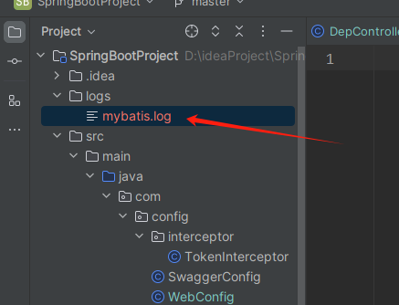

# Log4j2作为日志框架

在Spring Boot + MyBatis项目中开启日志以查看SQL执行语句，可以通过配置MyBatis的日志实现来实现。这里我们将使用Log4j2作为日志框架，并确保MyBatis的SQL语句能够被正确记录和输出。以下是详细的步骤：

### 1. 添加依赖

首先，在`pom.xml`文件中添加必要的依赖项。确保包含`log4j2`的依赖，并移除或排除Spring Boot默认的日志框架（如`spring-boot-starter-logging`，它通常基于Logback）。

```xml
<dependencies>
    <!-- Spring Boot Starter for MyBatis -->
    <dependency>
        <groupId>org.mybatis.spring.boot</groupId>
        <artifactId>mybatis-spring-boot-starter</artifactId>
        <version>3.0.1</version>
    </dependency>

    <!-- Log4j2 dependencies -->
    <dependency>
        <groupId>org.springframework.boot</groupId>
        <artifactId>spring-boot-starter-log4j2</artifactId>
    </dependency>

    <!-- Exclude the default logging starter to avoid conflicts -->
    <dependency>
        <groupId>org.springframework.boot</groupId>
        <artifactId>spring-boot-starter</artifactId>
        <exclusions>
            <exclusion>
                <groupId>org.springframework.boot</groupId>
                <artifactId>spring-boot-starter-logging</artifactId>
            </exclusion>
        </exclusions>
    </dependency>

    <!-- Other dependencies as needed -->
</dependencies>
```

### 2. 配置Log4j2

创建一个`log4j2.xml`文件并放在`src/main/resources`目录下。这个文件将配置Log4j2的行为，包括日志级别、输出格式和目标等。以下是一个示例配置文件，它启用了MyBatis的日志输出，并将其记录到控制台和文件中：

```xml
<?xml version="1.0" encoding="UTF-8"?>
<Configuration status="WARN">
    <Appenders>
<!--        控制台输出-->
        <Console name="Console" target="SYSTEM_OUT">
            <PatternLayout pattern="%d{yyyy-MM-dd HH:mm:ss} %-5level %logger{36} - %msg%n"/>
        </Console>
<!--        文件输出-->
        <File name="MyBatisLog" fileName="logs/mybatis.log">
            <PatternLayout pattern="%d{yyyy-MM-dd HH:mm:ss} %-5level %logger{36} - %msg%n"/>
        </File>
    </Appenders>
    <Loggers>
        <!-- Root logger configuration -->
        <Root level="info">
            <AppenderRef ref="Console"/>
        </Root>

        <!-- MyBatis logger configuration -->
        <Logger name="org.apache.ibatis" level="DEBUG" additivity="false">
            <AppenderRef ref="Console"/>
            <AppenderRef ref="MyBatisLog"/>
        </Logger>

<!--        注意此处修改为你的mapper位置-->
        <Logger name="com.example.demo.mapper" level="DEBUG" additivity="false">
            <AppenderRef ref="Console"/>
            <AppenderRef ref="MyBatisLog"/>
        </Logger>
    </Loggers>
</Configuration>
```

在这个配置文件中：

- **`Appenders`**：定义了日志输出的目标，例如控制台和文件。
- **`Loggers`**：定义了不同包或类的日志级别。这里我们特别为`org.apache.ibatis`和你自己的Mapper包（例如`com.example.demo.mapper`）设置了`DEBUG`级别的日志，以确保SQL语句、参数和结果能够被记录下来。

日志文件位置



### 3. 配置MyBatis

为了确保MyBatis能够正确输出日志，你还需要在`application.yml`或`application.properties`中进行一些配置。对于`application.yml`，可以这样配置：

```yaml
mybatis:
  configuration:
    log-impl: org.apache.ibatis.logging.log4j2.Log4j2Impl
```

这行配置指定了MyBatis应该使用Log4j2作为其日志实现。

### 4. 启用SQL日志

为了确保MyBatis输出SQL语句，你需要设置相应的日志级别为`DEBUG`或更低。在`log4j2.xml`中，我们已经为`org.apache.ibatis`和你的Mapper包设置了`DEBUG`级别。这意味着所有与MyBatis相关的日志信息，包括SQL语句、参数和结果，都会被记录下来。

### 5. 测试日志输出

完成上述配置后，启动你的Spring Boot应用程序，并执行一些涉及MyBatis的操作。你应该能够在控制台和指定的日志文件中看到SQL语句、参数以及查询结果的日志输出。例如，当你执行一个查询时，可能会看到类似如下的输出：

```plaintext
2024-12-02 16:28:00 DEBUG org.apache.ibatis.logging.LogFactory - Logging initialized using 'class org.apache.ibatis.logging.log4j2.Log4j2Impl' adapter.
2024-12-02 16:28:00 DEBUG com.example.demo.mapper.UserMapper.selectUsers - ==>  Preparing: SELECT * FROM users 
2024-12-02 16:28:00 DEBUG com.example.demo.mapper.UserMapper.selectUsers - ==> Parameters: 
2024-12-02 16:28:00 DEBUG com.example.demo.mapper.UserMapper.selectUsers - <==      Total: 3
2024-12-02 16:28:00 DEBUG com.example.demo.mapper.UserMapper.selectUsers - <==    Columns: id, username, email
2024-12-02 16:28:00 DEBUG com.example.demo.mapper.UserMapper.selectUsers - <==        Row: 1, Alice, alice@example.com
2024-12-02 16:28:00 DEBUG com.example.demo.mapper.UserMapper.selectUsers - <==        Row: 2, Bob, bob@example.com
2024-12-02 16:28:00 DEBUG com.example.demo.mapper.UserMapper.selectUsers - <==        Row: 3, Charlie, charlie@example.com
```

### 6. 进一步优化

根据需要，你可以进一步调整`log4j2.xml`中的配置，例如：

- 更改日志文件的路径和名称。
- 设置不同的日志级别，如`TRACE`、`DEBUG`、`INFO`、`WARN`、`ERROR`等。
- 使用滚动文件追加器（`RollingFile`）来管理日志文件的大小和数量，防止日志文件过大。
- 配置异步日志记录以提高性能。

### 总结

通过以上步骤，你可以在Spring Boot + MyBatis项目中成功开启日志，并查看SQL执行语句。如果你有其他特定的需求或问题，请随时告知！

# 面向切面编程（AOP）

为了实现你提到的需求，我们将逐步完成以下任务：

### 1. 给删除、新增、更新操作添加操作日志；给数据库操作添加打印日志（打印耗时）

#### 1.1 使用 AOP 和日志框架输出到日志文件

##### 1.1.1 添加依赖

确保你的 `pom.xml` 中包含以下依赖：

```xml
<dependencies>
    <!-- Spring Boot Starter AOP -->
    <dependency>
        <groupId>org.springframework.boot</groupId>
        <artifactId>spring-boot-starter-aop</artifactId>
    </dependency>

    <!-- Log4j2 for logging -->
    <dependency>
        <groupId>org.springframework.boot</groupId>
        <artifactId>spring-boot-starter-log4j2</artifactId>
    </dependency>

    <!-- MyBatis for ORM -->
    <dependency>
        <groupId>org.mybatis.spring.boot</groupId>
        <artifactId>mybatis-spring-boot-starter</artifactId>
        <version>2.2.0</version>
    </dependency>

    <!-- Druid for database connection pooling -->
    <dependency>
        <groupId>com.alibaba</groupId>
        <artifactId>druid-spring-boot-starter</artifactId>
        <version>1.2.8</version>
    </dependency>
</dependencies>
```

##### 1.1.2 配置日志框架

在 `src/main/resources` 目录下创建 `log4j2.xml` 文件，配置日志输出到文件，并记录数据库操作的耗时。

```xml
<?xml version="1.0" encoding="UTF-8"?>
<Configuration status="WARN">
    <Appenders>
        <Console name="Console" target="SYSTEM_OUT">
            <PatternLayout pattern="%d{yyyy-MM-dd HH:mm:ss} %-5level %logger{36} - %msg%n"/>
        </Console>
        <File name="OperationLog" fileName="logs/operation.log">
            <PatternLayout pattern="%d{yyyy-MM-dd HH:mm:ss} %-5level %logger{36} - %msg%n"/>
        </File>
        <File name="DatabaseLog" fileName="logs/database.log">
            <PatternLayout pattern="%d{yyyy-MM-dd HH:mm:ss} %-5level %logger{36} - %msg%n"/>
        </File>
    </Appenders>
    <Loggers>
        <Root level="info">
            <AppenderRef ref="Console"/>
        </Root>

        <!-- 操作日志配置 -->
        <Logger name="com.example.demo.aspect.OperationLogAspect" level="DEBUG" additivity="false">
            <AppenderRef ref="Console"/>
            <AppenderRef ref="OperationLog"/>
        </Logger>

        <!-- 数据库操作日志配置 -->
        <Logger name="com.example.demo.aspect.DatabaseLogAspect" level="DEBUG" additivity="false">
            <AppenderRef ref="Console"/>
            <AppenderRef ref="DatabaseLog"/>
        </Logger>
    </Loggers>
</Configuration>
```

##### 1.1.3 创建操作日志实体类

定义一个日志实体类 `OperationLog`，用于存储操作日志信息。

```java
import javax.persistence.Entity;
import javax.persistence.GeneratedValue;
import javax.persistence.GenerationType;
import javax.persistence.Id;
import java.time.LocalDateTime;

@Entity
public class OperationLog {

    @Id
    @GeneratedValue(strategy = GenerationType.IDENTITY)
    private Long id;

    private String requestUrl;
    private String requestMethod;
    private String httpMethod;
    private String parameters;
    private Long executionTime; // 操作耗时（毫秒）
    private LocalDateTime operationTime;

    // Getters and Setters
}
```

##### 1.1.4 创建操作日志服务

创建一个服务类 `OperationLogService`，用于将操作日志保存到数据库中。

```java
import org.springframework.beans.factory.annotation.Autowired;
import org.springframework.stereotype.Service;

@Service
public class OperationLogService {

    @Autowired
    private OperationLogRepository operationLogRepository;

    public void saveOperationLog(OperationLog log) {
        operationLogRepository.save(log);
    }
}
```

##### 1.1.5 创建操作日志仓库接口

创建一个仓库接口 `OperationLogRepository`，继承 `JpaRepository`，用于与数据库交互。

```java
import org.springframework.data.jpa.repository.JpaRepository;

public interface OperationLogRepository extends JpaRepository<OperationLog, Long> {
}
```

##### 1.1.6 创建 AOP 切面类

创建一个 AOP 切面类 `OperationLogAspect`，用于拦截控制器中的方法调用，并记录操作日志。

```java
import org.aspectj.lang.ProceedingJoinPoint;
import org.aspectj.lang.annotation.Around;
import org.aspectj.lang.annotation.Aspect;
import org.aspectj.lang.reflect.MethodSignature;
import org.springframework.beans.factory.annotation.Autowired;
import org.springframework.stereotype.Component;
import org.springframework.web.context.request.RequestContextHolder;
import org.springframework.web.context.request.ServletRequestAttributes;

import javax.servlet.http.HttpServletRequest;
import java.time.LocalDateTime;
import java.util.Arrays;

@Aspect
@Component
public class OperationLogAspect {

    @Autowired
    private OperationLogService operationLogService;

    @Around("execution(* com.example.demo.controller.*.*(..))")
    public Object logAround(ProceedingJoinPoint joinPoint) throws Throwable {
        long startTime = System.currentTimeMillis();

        // 获取请求信息
        HttpServletRequest request = ((ServletRequestAttributes) RequestContextHolder.getRequestAttributes()).getRequest();
        String requestUrl = request.getRequestURL().toString();
        String httpMethod = request.getMethod();
        String requestMethod = joinPoint.getSignature().getName();
        Object[] args = joinPoint.getArgs();

        // 打印请求信息到控制台和日志文件
        System.out.println("请求地址: " + requestUrl);
        System.out.println("请求类型: " + httpMethod);
        System.out.println("请求方法: " + requestMethod);
        System.out.println("方法参数: " + Arrays.toString(args));

        // 执行目标方法
        Object result = joinPoint.proceed();

        long endTime = System.currentTimeMillis();
        long executionTime = endTime - startTime;

        // 记录操作日志
        OperationLog log = new OperationLog();
        log.setRequestUrl(requestUrl);
        log.setHttpMethod(httpMethod);
        log.setRequestMethod(requestMethod);
        log.setParameters(Arrays.toString(args));
        log.setExecutionTime(executionTime);
        log.setOperationTime(LocalDateTime.now());

        operationLogService.saveOperationLog(log);

        // 打印耗时到控制台和日志文件
        System.out.println("方法执行耗时: " + executionTime + " ms");

        return result;
    }
}
```

##### 1.1.7 创建数据库操作日志切面类

创建一个 AOP 切面类 `DatabaseLogAspect`，用于拦截 `Mapper` 方法并记录数据库操作的耗时。

```java
import org.aspectj.lang.ProceedingJoinPoint;
import org.aspectj.lang.annotation.Around;
import org.aspectj.lang.annotation.Aspect;
import org.aspectj.lang.annotation.Pointcut;
import org.slf4j.Logger;
import org.slf4j.LoggerFactory;
import org.springframework.stereotype.Component;

@Aspect
@Component
public class DatabaseLogAspect {

    private static final Logger logger = LoggerFactory.getLogger(DatabaseLogAspect.class);

    @Pointcut("execution(* com.example.demo.mapper.*.*(..))")
    public void databaseOperations() {}

    @Around("databaseOperations()")
    public Object logDatabaseOperations(ProceedingJoinPoint joinPoint) throws Throwable {
        long startTime = System.currentTimeMillis();

        // 执行目标方法
        Object result = joinPoint.proceed();

        long endTime = System.currentTimeMillis();
        long executionTime = endTime - startTime;

        // 打印数据库操作耗时到日志文件
        logger.debug("数据库操作: " + joinPoint.getSignature().getName() + " 耗时: " + executionTime + " ms");

        return result;
    }
}
```

#### 1.2 写入日志数据表

如果你希望将操作日志写入数据库，已经在 `OperationLogAspect` 中实现了这一点。你可以通过查询 `operation_log` 表来查看所有的操作日志。

