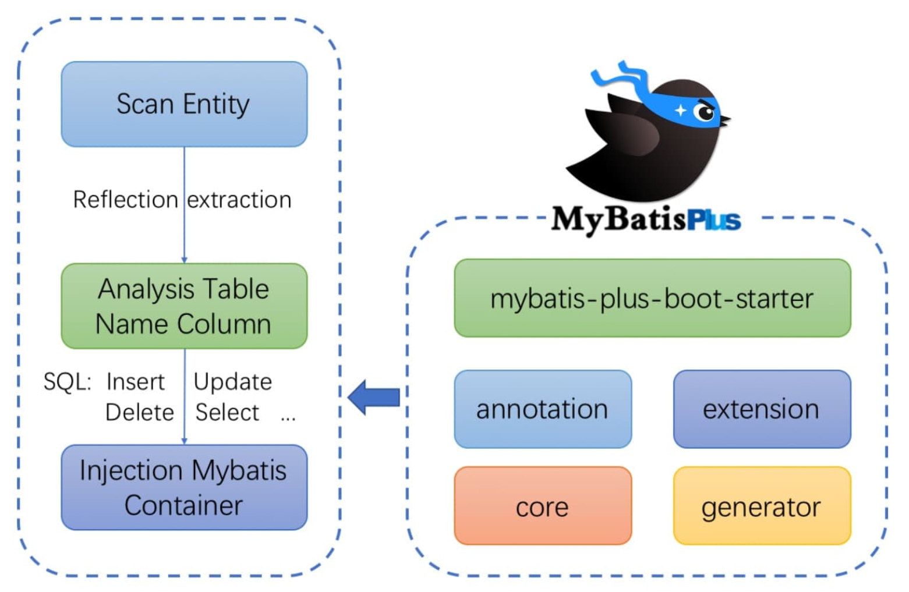
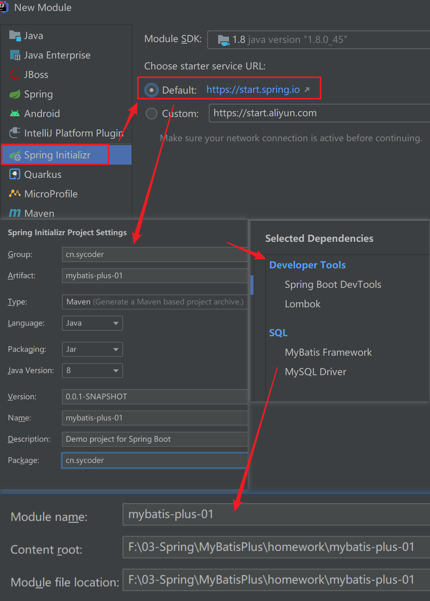
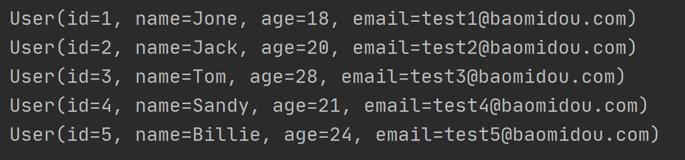
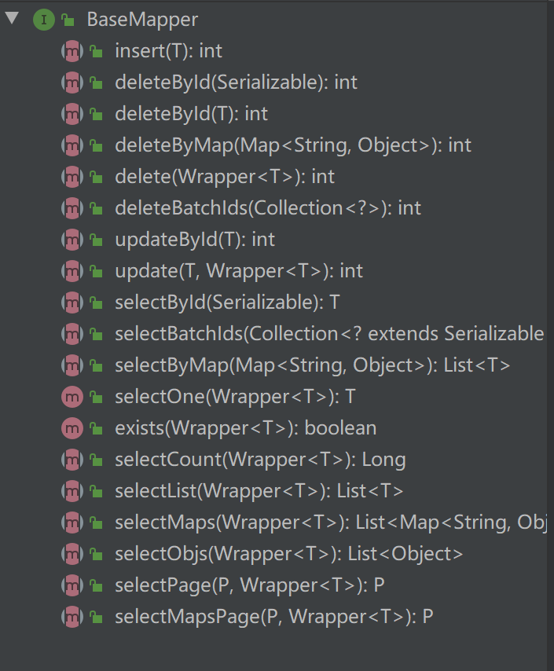
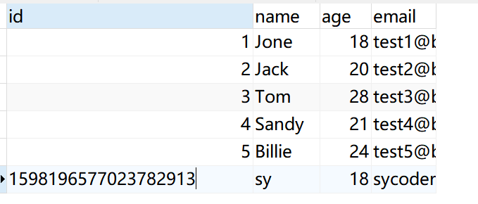
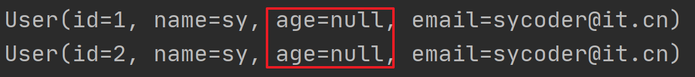
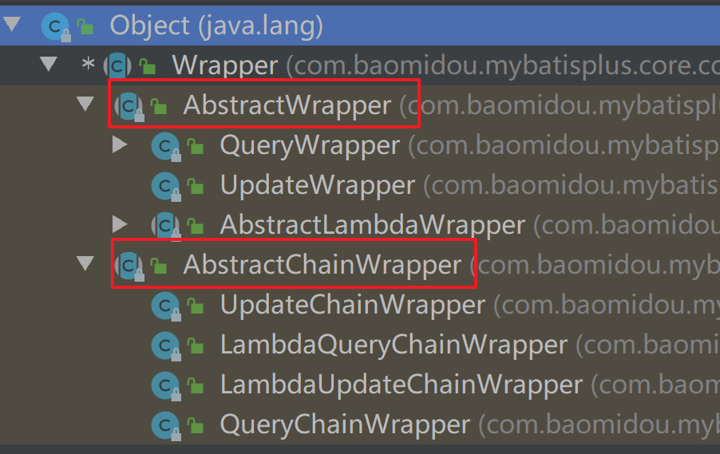

# 一、简介

## 1.概述

- 文档地址：https://baomidou.com/

- 概述：[MyBatis-Plus](https://github.com/baomidou/mybatis-plus)[ ](https://github.com/baomidou/mybatis-plus)[ (opens new window)](https://github.com/baomidou/mybatis-plus)（简称 MP）是一个 [MyBatis](https://www.mybatis.org/mybatis-3/)[ ](https://www.mybatis.org/mybatis-3/)[ (opens new window)](https://www.mybatis.org/mybatis-3/) 的增强工具，在 MyBatis 的基础上只做增强不做改变，为简化开发、提高效率而生。

- 愿景：

  

## 2.特性

- **无侵入**：只做增强不做改变，引入它不会对现有工程产生影响，如丝般顺滑
- **损耗小**：启动即会自动注入基本 CURD，性能基本无损耗，直接面向对象操作
- **强大的 CRUD 操作**：内置通用 Mapper、通用 Service，仅仅通过少量配置即可实现单表大部分 CRUD 操作，更有强大的条件构造器，满足各类使用需求
- **支持 Lambda 形式调用**：通过 Lambda 表达式，方便的编写各类查询条件，无需再担心字段写错
- **支持主键自动生成**：支持多达 4 种主键策略（内含分布式唯一 ID 生成器 - Sequence），可自由配置，完美解决主键问题
- **支持 ActiveRecord 模式**：支持 ActiveRecord 形式调用，实体类只需继承 Model 类即可进行强大的 CRUD 操作
- **支持自定义全局通用操作**：支持全局通用方法注入（ Write once, use anywhere ）
- **内置代码生成器**：采用代码或者 Maven 插件可快速生成 Mapper 、 Model 、 Service 、 Controller 层代码，支持模板引擎，更有超多自定义配置等您来使用
- **内置分页插件**：基于 MyBatis 物理分页，开发者无需关心具体操作，配置好插件之后，写分页等同于普通 List 查询
- **分页插件支持多种数据库**：支持 MySQL、MariaDB、Oracle、DB2、H2、HSQL、SQLite、Postgre、SQLServer 等多种数据库
- **内置性能分析插件**：可输出 SQL 语句以及其执行时间，建议开发测试时启用该功能，能快速揪出慢查询
- **内置全局拦截插件**：提供全表 delete 、 update 操作智能分析阻断，也可自定义拦截规则，预防误操作

## 3.架构




# 二、快速入门

## 1.创建数据库以及表

- 创建 mybatis-plus 数据库

- 创建user表

  ```sql
  DROP TABLE IF EXISTS user;
  
  CREATE TABLE user
  (
      id BIGINT(20) NOT NULL COMMENT '主键ID',
      name VARCHAR(30) NULL DEFAULT NULL COMMENT '姓名',
      age INT(11) NULL DEFAULT NULL COMMENT '年龄',
      email VARCHAR(50) NULL DEFAULT NULL COMMENT '邮箱',
      PRIMARY KEY (id)
  );
  ```

- 添加用户信息

  ```sql
  DELETE FROM user;
  
  INSERT INTO user (id, name, age, email) VALUES
  (1, 'Jone', 18, 'test1@baomidou.com'),
  (2, 'Jack', 20, 'test2@baomidou.com'),
  (3, 'Tom', 28, 'test3@baomidou.com'),
  (4, 'Sandy', 21, 'test4@baomidou.com'),
  (5, 'Billie', 24, 'test5@baomidou.com');
  
  ```

## 2.初始化工程

- 创建空项目

- 创建springboot 模块

  

  

## 3.添加依赖

- 添加 springboot依赖

  ```java
  <parent>
      <groupId>org.springframework.boot</groupId>
      <artifactId>spring-boot-starter-parent</artifactId>
      <version>2.7.5</version>
  </parent>
  ```

- 引入 `spring-boot-starter`、`spring-boot-starter-test`、`mybatis-plus-boot-starter`、`mysql` 依赖

  ```java
  <dependencies>
          <dependency>
              <groupId>org.springframework.boot</groupId>
              <artifactId>spring-boot-starter</artifactId>
          </dependency>
          <dependency>
              <groupId>org.springframework.boot</groupId>
              <artifactId>spring-boot-starter-test</artifactId>
              <scope>test</scope>
          </dependency>
          <dependency>
              <groupId>org.projectlombok</groupId>
              <artifactId>lombok</artifactId>
          </dependency>
          <dependency>
              <groupId>mysql</groupId>
              <artifactId>mysql-connector-java</artifactId>
          </dependency>
          <dependency>
              <groupId>com.baomidou</groupId>
              <artifactId>mybatis-plus-boot-starter</artifactId>
              <version>3.5.2</version>
          </dependency>
      </dependencies>
  ```

  

## 4.配置

### 4.1添加springboot启动类

- 启动类

  ```java
  @SpringBootApplication
  public class MybatisPlusApplication {
      public static void main(String[] args) {
          SpringApplication.run(MybatisPlusApplication.class,args);
      }
  }
  ```

  

### 4.2application.yml

- 数据库信息

  ```yaml
  spring:
    datasource:
      url: jdbc:mysql://localhost:3306/mybatis-plus
      password: 123456
      username: root
      driver-class-name: com.mysql.cj.jdbc.Driver
  ```


### 4.3启动类添加@MapperScan

- 作用：用于扫描 Mapper 文件夹

  ```java
  @SpringBootApplication
  @MapperScan("cn.sycoder.mapper")
  public class MybatisPlusApplication {
      public static void main(String[] args) {
          SpringApplication.run(MybatisPlusApplication.class,args);
      }
  }
  ```

## 5.编码实现

### 5.1创建实体类

- 实体类user

  ```java
  @Data
  public class User {
      private Long id;
      private String name;
      private Integer age;
      private String email;
  }
  ```

  

### 5.2编写mapper

- mapper文件

  ```java
  public interface UserMapper extends BaseMapper<User> {
  }
  ```

## 6.测试

- 新建测试类

  ```java
  @SpringBootTest
  public class MybatisPlusTest {
      @Autowired
      private UserMapper userMapper;
  
      @Test
      public void testSelect() {
          System.out.println(("----- selectAll method test ------"));
          List<User> userList = userMapper.selectList(null);
          userList.forEach(System.out::println);
      }
  }
  ```

- 结果

  

# 三、Mapper CRUD接口

- 根据userMapper 可以知道，我们使用的方法是BaseMapper 中定义好的，才提高了开发效率。

  

## 1.添加

### 1.1方法

- insert 方法

  ```java
  int insert(T entity);
  ```

### 1.2测试

- 测试

  ```java
  @Test
      public void testInsert(){
          User entity = User.builder().name("sy").age(18).email("sycoder@it.cn").build();
          int count = userMapper.insert(entity);//受影响结果集
          Long id = entity.getId();
          System.out.println("受影响结果数--->"+count);
          System.out.println("id--->"+id);
      }
  ```

- 问题

  - 自增主键值太大了，不符合我们mysql自增的逻辑

    

### 1.3使用MybatisPlus 支持id策略

- IdType

  ```java
  public enum IdType {
      AUTO(0),//数据库自增id
      NONE(1),//没有主键
      INPUT(2),//用户输入id
      ASSIGN_ID(3),//
      ASSIGN_UUID(4);//时间戳，或者叫随机字符串
  
      private final int key;
  
      private IdType(int key) {
          this.key = key;
      }
  
      public int getKey() {
          return this.key;
      }
  }
  ```

### 1.4@TableId

- @TableId修改User 类实体

  ```java
  @Data
  @Builder
  public class User {
      @TableId(type = IdType.AUTO)
      private Long id;
      private String name;
      private Integer age;
      private String email;
  }
  ```

### 1.5@TableField

- @TableField 修改字段名称

  ```java
  @Data
  public class User {
      @TableId(type = IdType.AUTO)
      private Long id;
      private String name;
      @TableField(select = false)
      private Integer age;
      @TableField(value = "uemail")
      private String email;
  }
  ```



- 注意：提供无参构造器

## 2.删除

### 2.1根据主键删除

- deleteById方法:根据主键id删除

  ```java
  int deleteById(Serializable id);
  int deleteById(T entity);//传一个对象进来
  ```

- 测试

  ```java
  @Test
  public void testDeleteById(){
      int count = userMapper.deleteById(2L);
      System.out.println("受影响结果数--->"+count);
  }
  ```

- 结果

  ```java
  ==>  Preparing: DELETE FROM user WHERE id=?
  ==> Parameters: 3(Long)
  <==    Updates: 1
  ```

  

### 2.2根据列删除通过Map方式

- deleteByMap：根据列删除

- 方法

  ```java
  int deleteByMap(@Param("cm") Map<String, Object> columnMap);
  ```

- 测试

  ```java
  @Test
      public void testDeleteByMap(){
          Map<String,Object> map = new HashMap<>();
          map.put("name","sy");
          int count = userMapper.deleteByMap(map);
          System.out.println("受影响结果数--->"+count);
      }
  ```

- 注意：如果map 中没有列信息，是删除整表

- 结果

  ```java
  ==>  Preparing: DELETE FROM user WHERE name = ?
  ==> Parameters: sy(String)
  <==    Updates: 1
  ```

### 2.2根据列删除通过包装方式

- delete:根据 entity 对象的条件进行删除

- 方法

  ```java
  int delete(@Param("ew") Wrapper<T> queryWrapper);
  ```

- 测试

  ```java
  @Test
  public void testDelete(){
      User user = new User();
      user.setName("sy");
      Wrapper wrapper = new QueryWrapper(user);
      int count = userMapper.delete(wrapper);
      System.out.println("受影响结果数--->"+count);
  }
  ```

- 结果

  ```java
  ==>  Preparing: DELETE FROM user WHERE name=?
  ==> Parameters: sy(String)
  <==    Updates: 1
  ```

  

### 2.3批量删除

- deleteBatchIds：通过ids 集合实现批量删除

- 方法

  ```java
  int deleteBatchIds(@Param("coll") Collection<?> idList);
  ```

- 测试

  ```java
  @Test
      public void testDeleteBatchIds(){
          List list = new ArrayList<>();
          list.add(1L);
          list.add(3L);
          int count = userMapper.deleteBatchIds(list);
          System.out.println("受影响结果数--->"+count);
      }
  ```

- 结果

  ```java
  ==>  Preparing: DELETE FROM user WHERE id IN ( ? , ? )
  ==> Parameters: 1(Long), 3(Long)
  <==    Updates: 2
  ```

## 3.修改

### 3.1根据id更新

- updateById：根据id更新

- 方法

  ```java
  int updateById(@Param("et") T entity);
  ```

- 测试

  ```java
  @Test
  public void testUpdateById(){
      User user = new User();
      user.setId(3L);
      user.setName("zs");
      user.setEmail("sy@qq.com");
      int count = userMapper.updateById(user);
      System.out.println("受影响结果数--->"+count);
  }
  ```

- 结果

  ```java
  ==>  Preparing: UPDATE user SET name=?, uemail=? WHERE id=?
  ==> Parameters: zs(String), sy@qq.com(String), 3(Long)
  <==    Updates: 1
  ```

### 3.2根据条件更新

- 方法

  ```java
  int update(@Param("et") T entity, @Param("ew") Wrapper<T> updateWrapper);
  ```

- 测试

  ```java
  @Test
  public void testUpdate(){
      User user = new User();
      user.setAge(100);//设置需要更新的字段
  
      //设置需要更新的条件
      UpdateWrapper<User> wrapper = new UpdateWrapper<>();
      wrapper.eq("name","zs");
  
       int count = userMapper.update(user,wrapper);
      System.out.println("受影响结果数--->"+count);
  }
  ```

  ```java
  @Test
  public void testUpdate2() {
      //设置需要更新的条件
      UpdateWrapper<User> wrapper = new UpdateWrapper<>();
      wrapper.eq("name", "zs");
      wrapper.set("age",5);
  
      int count = userMapper.update(null, wrapper);
      System.out.println("受影响结果数--->" + count);
  }
  ```

  

- 结果

  ```java
  ==>  Preparing: UPDATE user SET age=? WHERE (name = ?)
  ==> Parameters: 100(Integer), zs(String)
  <==    Updates: 1
  ```

  

## 4.查询

### 4.1selectById

- selectById:通过主键id 查询

- 方法

  ```java
  T selectById(Serializable id);
  ```

- 测试

  ```java
  @Test
  public void testSelectById(){
      User user = userMapper.selectById(1L);
      System.out.println(user);
  }
  ```

- 结果

  ```java
  ==>  Preparing: SELECT id,name,uemail AS email FROM user WHERE id=?
  ==> Parameters: 1(Long)
  <==      Total: 1
  ```

### 4.2selectBatchIds

- selectBatchIds：通过批量的id 查询

- 方法

  ```java
  List<T> selectBatchIds(@Param("coll") Collection<? extends Serializable> idList);
  ```

- 测试

  ```java
  @Test
  public void testSelectBatchIds(){
      List<Long> ids = new ArrayList<>();
      ids.add(1L);
      ids.add(3L);
  
      List<User> users = userMapper.selectBatchIds(ids);
      System.out.println(users);
  }
  ```

- 结果

  ```java
  ==>  Preparing: SELECT id,name,uemail AS email FROM user WHERE id IN ( ? , ? )
  ==> Parameters: 1(Long), 3(Long)
  <==      Total: 2
  ```

### 4.3selectOne

- selectOne:查询单条信息

- 方法

  ```java
  default T selectOne(@Param("ew") Wrapper<T> queryWrapper) {
      List<T> ts = this.selectList(queryWrapper);
      if (CollectionUtils.isNotEmpty(ts)) {
          if (ts.size() != 1) {
              throw ExceptionUtils.mpe("One record is expected, but the query result is multiple records", new Object[0]);
          } else {
              return ts.get(0);
          }
      } else {
          return null;
      }
  }
  ```

- 测试

  ```java
  @Test
  public void testSelectOne(){
      QueryWrapper<User> wrapper = new QueryWrapper<>();
      wrapper.eq("name","sy");
      User user = userMapper.selectOne(wrapper);
      System.out.println(user);
  }
  ```

- 结果

  ```java
  ==>  Preparing: SELECT id,name,uemail AS email FROM user WHERE (name = ?)
  ==> Parameters: sy(String)
  <==      Total: 1
  ```

### 4.4selectCount

- selectCount：表示总记录数

- 方法

  ```java
  Long selectCount(@Param("ew") Wrapper<T> queryWrapper);
  ```

- 测试

  ```java
  @Test
  public void testSelectCount(){
      QueryWrapper<User> wrapper = new QueryWrapper<>();
      wrapper.eq("name","sy");
      Long count = userMapper.selectCount(wrapper);
      System.out.println(count);
  }
  ```

- 结果

  ```java
  ==>  Preparing: SELECT COUNT( * ) FROM user WHERE (name = ?)
  ==> Parameters: sy(String)
  <==      Total: 1
  ```

### 4.5selectList

- selectList:查询全部记录

- 方法

  ```java
  List<T> selectList(@Param("ew") Wrapper<T> queryWrapper);
  ```

- 测试

  ```java
  @Test
  public void testSelectList(){
      QueryWrapper<User> wrapper = new QueryWrapper<>();
      wrapper.eq("name","sy");
      List<User> users = userMapper.selectList(wrapper);
      System.out.println(users);
  }
  ```

- 结果

  ```java
  ==>  Preparing: SELECT id,name,uemail AS email FROM user WHERE (name = ?)
  ==> Parameters: sy(String)
  <==      Total: 1
  ```

### 4.6selectPage

- selectPage:查询出分页结果

- 方法

  ```java
  <P extends IPage<T>> P selectPage(P page, @Param("ew") Wrapper<T> queryWrapper);
  ```

- 配置分页插件

  ```java
  @Configuration
  @MapperScan("cn.sycoder.mapper")
  public class MybatisPlusConfig {
      @Bean
      public MybatisPlusInterceptor mybatisPlusInterceptor() {
          MybatisPlusInterceptor interceptor = new MybatisPlusInterceptor();
          interceptor.addInnerInterceptor(new PaginationInnerInterceptor(DbType.MYSQL));
          return interceptor;
      }
  
  }
  ```

  

- 测试

  ```java
  @Test
  public void testSelectPage(){
      QueryWrapper<User> wrapper = new QueryWrapper<>();
      wrapper.eq("name","sy");
      Page<User> page = new Page<>(1,1);
      IPage<User> userPage = userMapper.selectPage(page, wrapper);
      System.out.println("总条数为："+userPage.getTotal());
      System.out.println("总页数为："+userPage.getPages());
      List<User> records = userPage.getRecords();
      System.out.println(records);
  }
  ```

- 结果

  ```java
   ==>  Preparing: SELECT COUNT(*) AS total FROM user WHERE (name = ?)
   ==> Parameters: sy(String)
   <==      Total: 1
   ==>  Preparing: SELECT id,name,uemail AS email FROM user WHERE (name = ?) LIMIT ?
   ==> Parameters: sy(String), 1(Long)
   <==      Total: 1
  ```


# 四、Service CRUD接口

>
>
>说明：
>
>通用 Service CRUD 封装IService接口，进一步封装 CRUD 采用 `get 查询单行` `remove 删除` `list 查询集合` `page 分页` 前缀命名方式区分 `Mapper` 层避免混淆，
>
>泛型 `T` 为任意实体对象
>
>建议如果存在自定义通用 Service 方法的可能，请创建自己的 `IBaseService` 继承 `Mybatis-Plus` 提供的基类
>
>对象 `Wrapper` 为 条件构造器

## 1.提供Service 接口

- service 接口

  ```java
  public interface IUserService extends IService<User> {
  }
  ```

- service 实现类

  ```java
  @Service
  public class UserServiceImpl extends ServiceImpl<UserMapper, User> implements IUserService {
  }
  ```

## 2.api使用

### 2.1保存

- save 方法

  ```java
  // 插入一条记录（选择字段，策略插入）
  boolean save(T entity);
  // 插入（批量）
  boolean saveBatch(Collection<T> entityList);
  // 插入（批量）
  boolean saveBatch(Collection<T> entityList, int batchSize);
  
  ```

- 测试

  ```java
  @Autowired
  IUserService service;
  
  @Test
  public void testServiceSave(){
      User user = new User();
      user.setName("service 创建");
      user.setAge(18);
      user.setEmail("xxx");
      boolean save = service.save(user);
      System.out.println("保存结果："+save);
  }
  ```

- 结果

  ```java
  ==>  Preparing: INSERT INTO user ( name, age, uemail ) VALUES ( ?, ?, ? )
  ==> Parameters: service 创建(String), 18(Integer), xxx(String)
  <==    Updates: 1
  ```

  

### 2.2保存或者更新

- 方法

  ```java
  // TableId 注解存在更新记录，否插入一条记录
  boolean saveOrUpdate(T entity);
  // 根据updateWrapper尝试更新，否继续执行saveOrUpdate(T)方法
  boolean saveOrUpdate(T entity, Wrapper<T> updateWrapper);
  // 批量修改插入
  boolean saveOrUpdateBatch(Collection<T> entityList);
  // 批量修改插入
  boolean saveOrUpdateBatch(Collection<T> entityList, int batchSize);
  ```

- 测试

  ```java
  @Test
  public void testServiceSaveOrUpdate(){
      User user = new User();
      user.setId(6L);
      user.setName("ser1231233vice 创建");
      user.setAge(18);
      user.setEmail("xxx");
      boolean save = service.saveOrUpdate(user);
      System.out.println("保存更新结果："+save);
  }
  ```

- 结果

  ```java
  ==>  Preparing: SELECT id,name,uemail AS email FROM user WHERE id=?
  ==> Parameters: 6(Long)
  <==      Total: 1
  ==>  Preparing: UPDATE user SET name=?, age=?, uemail=? WHERE id=?
  ==> Parameters: ser1231233vice 创建(String), 18(Integer), xxx(String), 6(Long)
  <==    Updates: 1
  ```

### 2.3删除

- 删除方法

  ```java
  // 根据 entity 条件，删除记录
  boolean remove(Wrapper<T> queryWrapper);
  // 根据 ID 删除
  boolean removeById(Serializable id);
  // 根据 columnMap 条件，删除记录
  boolean removeByMap(Map<String, Object> columnMap);
  // 删除（根据ID 批量删除）
  boolean removeByIds(Collection<? extends Serializable> idList);
  ```

- 测试

  ```java
  @Test
  public void testServiceDelete(){
      boolean ret = service.removeById(6L);
      System.out.println("删除的结果："+ret);
  }
  ```

- 结果

  ```java
  ==>  Preparing: DELETE FROM user WHERE id=?
  ==> Parameters: 6(Long)
  <==    Updates: 1
  ```

### 2.4更新

- 更新方法

  ```java
  // 根据 UpdateWrapper 条件，更新记录 需要设置sqlset
  boolean update(Wrapper<T> updateWrapper);
  // 根据 whereWrapper 条件，更新记录
  boolean update(T updateEntity, Wrapper<T> whereWrapper);
  // 根据 ID 选择修改
  boolean updateById(T entity);
  // 根据ID 批量更新
  boolean updateBatchById(Collection<T> entityList);
  // 根据ID 批量更新
  boolean updateBatchById(Collection<T> entityList, int batchSize);
  ```

- 测试

  ```java
  @Test
  public void testServiceUpdate(){
      User user = new User();
      user.setId(6L);
      user.setName("ser1231233vice 创建");
      user.setAge(18);
      user.setEmail("xxx");
      boolean ret = service.updateById(user);
      System.out.println("更新结果："+ret);
  }
  ```

- 结果

  ```java
  ==>  Preparing: UPDATE user SET name=?, age=?, uemail=? WHERE id=?
  ==> Parameters: ser1231233vice 创建(String), 18(Integer), xxx(String), 6(Long)
  <==    Updates: 0
  ```

### 2.5查询

- 查询方法

  ```java
  // 根据 ID 查询
  T getById(Serializable id);
  // 根据 Wrapper，查询一条记录。结果集，如果是多个会抛出异常，随机取一条加上限制条件 wrapper.last("LIMIT 1")
  T getOne(Wrapper<T> queryWrapper);
  // 根据 Wrapper，查询一条记录
  T getOne(Wrapper<T> queryWrapper, boolean throwEx);
  // 根据 Wrapper，查询一条记录
  Map<String, Object> getMap(Wrapper<T> queryWrapper);
  // 根据 Wrapper，查询一条记录
  <V> V getObj(Wrapper<T> queryWrapper, Function<? super Object, V> mapper);
  ```

- 测试

  ```java
  @Test
  public void testServiceGet(){
      User user = service.getById(7L);
      System.out.println(user);
  }
  ```

- 结果

  ```java
  ==>  Preparing: SELECT id,name,uemail AS email FROM user WHERE id=?
  ==> Parameters: 7(Long)
  <==      Total: 1
  ```

### 2.6查询多结果集

- 查询多条数据

  ```java
  // 查询所有
  List<T> list();
  // 查询列表
  List<T> list(Wrapper<T> queryWrapper);
  // 查询（根据ID 批量查询）
  Collection<T> listByIds(Collection<? extends Serializable> idList);
  // 查询（根据 columnMap 条件）
  Collection<T> listByMap(Map<String, Object> columnMap);
  // 查询所有列表
  List<Map<String, Object>> listMaps();
  // 查询列表
  List<Map<String, Object>> listMaps(Wrapper<T> queryWrapper);
  // 查询全部记录
  List<Object> listObjs();
  // 查询全部记录
  <V> List<V> listObjs(Function<? super Object, V> mapper);
  // 根据 Wrapper 条件，查询全部记录
  List<Object> listObjs(Wrapper<T> queryWrapper);
  // 根据 Wrapper 条件，查询全部记录
  <V> List<V> listObjs(Wrapper<T> queryWrapper, Function<? super Object, V> mapper);
  
  ```

- 测试

  ```java
  @Test
  public void testServiceList(){
      List<User> list = service.list();
      System.out.println(list);
  }
  ```

- 结果

  ```java
  ==>  Preparing: SELECT id,name,uemail AS email FROM user
  ==> Parameters: 
  <==      Total: 5
  ```

### 2.7分页查询

- 分页方法

  ```java
  // 无条件分页查询
  IPage<T> page(IPage<T> page);
  // 条件分页查询
  IPage<T> page(IPage<T> page, Wrapper<T> queryWrapper);
  // 无条件分页查询
  IPage<Map<String, Object>> pageMaps(IPage<T> page);
  // 条件分页查询
  IPage<Map<String, Object>> pageMaps(IPage<T> page, Wrapper<T> queryWrapper);
  
  ```

### 2.8查询数量

- 查询数量方法

  ```java
  // 查询总记录数
  int count();
  // 根据 Wrapper 条件，查询总记录数
  int count(Wrapper<T> queryWrapper);
  ```

  

# 五、条件构造器

## 1.allEq

- AbstractWrapper

  

- 常用方法

  ```java
  allEq(Map<R, V> params)
  allEq(Map<R, V> params, boolean null2IsNull)
  allEq(boolean condition, Map<R, V> params, boolean null2IsNull)
  ```

- 测试

  ```java
  @Test
      public void testAllEq(){
          QueryWrapper<User> wrapper = new QueryWrapper<>();
          Map<String,Object> parms = new HashMap();
          parms.put("name","sy");
          parms.put("age",18);
          wrapper.allEq(parms);
          List<User> users = userMapper.selectList(wrapper);
          System.out.println(users);
      }
  ```

- 结果

  ```java
  ==>  Preparing: SELECT id,name,uemail AS email FROM user WHERE (name = ? AND age = ?)
  ==> Parameters: sy(String), 18(Integer)
  <==      Total: 1
  ```

- 带过滤的常用方法

  ```java
  allEq(BiPredicate<R, V> filter, Map<R, V> params)
  allEq(BiPredicate<R, V> filter, Map<R, V> params, boolean null2IsNull)
  allEq(boolean condition, BiPredicate<R, V> filter, Map<R, V> params, boolean null2IsNull) 
  ```

- 测试

  ```java
   @Test
      public void testAllEq(){
          QueryWrapper<User> wrapper = new QueryWrapper<>();
          Map<String,Object> parms = new HashMap();
          parms.put("name","sy");
          parms.put("age",18);
          parms.put("uemail",null);
          //SELECT id,name,uemail AS email FROM user WHERE (name = ?)
          wrapper.allEq((k,v)->("name".equals(k)),parms);
          List<User> users = userMapper.selectList(wrapper);
          System.out.println(users);
      }
  ```

  

## 2.比较操作

- 比较符

  | 比较符     | 说明     | 符号                                          |
  | ---------- | -------- | --------------------------------------------- |
  | eq         | 等于     | =                                             |
  | ne         | 不等于   | != <>                                         |
  | gt         | 大于     | >                                             |
  | ge         | 大于等于 | >=                                            |
  | lt         | 小于     | <                                             |
  | le         | 小于等于 | <=                                            |
  | between    | 包含     | BETWEEN 值1 AND 值2                           |
  | notBetween | 不包含   | NOT BETWEEN 值1 AND 值2                       |
  | in         | 包含     | 字段 IN (value.get(0), value.get(1), ...)     |
  | notIn      | 不包含   | 字段 NOT IN (value.get(0), value.get(1), ...) |

- 测试

  ```java
  @Test
      public void testBasicSwap(){
          QueryWrapper<User> wrapper = new QueryWrapper<>();
          wrapper.eq("name","sy").ge("age",18)
                  .in("uemail","xxx");
          List<User> users = userMapper.selectList(wrapper);
          System.out.println(users);
      }
  ```

- 结果

  ```java
  ==>  Preparing: SELECT id,name,uemail AS email FROM user WHERE (name = ? AND age >= ? AND uemail IN (?))
  ==> Parameters: sy(String), 18(Integer), xxx(String)
  <==      Total: 1
  ```

  

## 3.模糊查询

- 模糊查询

  | 方法      | 说明            |
  | --------- | --------------- |
  | like      | LIKE '%值%'     |
  | notLike   | NOT LIKE '%值%' |
  | likeLeft  | LIKE '%值'      |
  | likeRight | LIKE '值%'      |

- 测试

  ```java
  @Test
      public void testLike(){
          QueryWrapper<User> wrapper = new QueryWrapper<>();
          wrapper.like("name","s");
          List<User> users = userMapper.selectList(wrapper);
          System.out.println(users);
      }
  ```

- 结果

  ```java
  ==>  Preparing: SELECT id,name,uemail AS email FROM user WHERE (name LIKE ?)
  ==> Parameters: %s%(String)
  <==      Total: 5
  ```

- likeLeft

  ```java
  @Test
  public void testLike(){
      QueryWrapper<User> wrapper = new QueryWrapper<>();
      wrapper.likeLeft("name","y");//%y
      List<User> users = userMapper.selectList(wrapper);
      System.out.println(users);
  }
  ```

- 结果

  ```java
  ==>  Preparing: SELECT id,name,uemail AS email FROM user WHERE (name LIKE ?)
  ==> Parameters: %y(String)
  <==      Total: 4
  ```

  

## 4.排序操作

- 排序分组操作

  | 方法        | 说明                          |
  | ----------- | ----------------------------- |
  | groupBy     | 分组：GROUP BY 字段, ...      |
  | orderByAsc  | 排序：ORDER BY 字段, ... ASC  |
  | orderByDesc | 排序：ORDER BY 字段, ... DESC |
  | orderBy     | 排序：ORDER BY 字段, ...      |

- 测试分组

  ```java
  @Test
  public void testGroupBy(){
      QueryWrapper<User> wrapper = new QueryWrapper<>();
      wrapper.groupBy("name");
      List<User> users = userMapper.selectList(wrapper);
      System.out.println(users);
  }
  ```

- 结果

  ```java
  ==>  Preparing: SELECT id,name,uemail AS email FROM user GROUP BY name
  ==> Parameters: 
  <==      Total: 2
  ```

- 测试排序

  ```java
  @Test
  public void testOrder(){
      QueryWrapper<User> wrapper = new QueryWrapper<>();
      wrapper.orderBy(true,false,"id");
      List<User> users = userMapper.selectList(wrapper);
      System.out.println(users);
  }
  ```

- 结果

  ```java
  ==>  Preparing: SELECT id,name,uemail AS email FROM user ORDER BY id DESC
  ==> Parameters: 
  <==      Total: 5
  ```

## 5.逻辑查询

- 逻辑查询

  | 方法 | 说明                                                         |
  | ---- | ------------------------------------------------------------ |
  | or   | 例: `eq("id",1).or().eq("name","老王")`--->`id = 1 or name = '老王'` |
  | and  | 例: `and(i -> i.eq("name", "李白").ne("status", "活着"))`--->`and (name = '李白' and status <> '活着')` |

- or 方法

  >注意事项:
  >
  >主动调用`or`表示紧接着下一个**方法**不是用`and`连接!(不调用`or`则默认为使用`and`连接)
  
- 测试方法

  ```java
  @Test
  public void testOr(){
      QueryWrapper<User> wrapper = new QueryWrapper<>();
      wrapper.eq("name","sy").or().eq("age",18);
      List<User> users = userMapper.selectList(wrapper);
      System.out.println(users);
  }
  ```

- 结果

  ```java
  ==>  Preparing: SELECT id,name,uemail AS email FROM user WHERE (name = ? OR age = ?)
  ==> Parameters: sy(String), 18(Integer)
  <==      Total: 4
  ```

- and 方法测试

  ```java
  @Test
  public void testAnd(){
      QueryWrapper<User> wrapper = new QueryWrapper<>();
      wrapper.eq("name","sy").and(i -> i.ne("age", 18)
              .or().ne("age",1));
      //select * from user where name = sy and (age != 18  or age != 1)
      List<User> users = userMapper.selectList(wrapper);
      System.out.println(users);
  
  }
  ```

- 结果

  ```java
  ==>  Preparing: SELECT id,name,uemail AS email FROM user WHERE (name = ? AND (age <> ? OR age <> ?))
  ==> Parameters: sy(String), 18(Integer), 1(Integer)
  <==      Total: 4
  ```

## 6.select

- select 方法

  >
  >
  >例子 select("id", "name", "age")：具体需要查询的列

- 方法测试

  ```java
  @Test
  public void testSelect(){
      QueryWrapper<User> wrapper = new QueryWrapper<>();
      wrapper.select("id");
      List<User> users = userMapper.selectList(wrapper);
      System.out.println(users);
  
  }
  ```

- 结果

  ```java
  ==>  Preparing: SELECT id FROM user
  ==> Parameters: 
  <==      Total: 5
  ```

## 7.UpdateWrapper

- 更新 wrapper

  >
  >
  >说明:
  >
  >继承自 `AbstractWrapper` ,自身的内部属性 `entity` 也用于生成 where 条件
  > 及 `LambdaUpdateWrapper`, 可以通过 `new UpdateWrapper().lambda()` 方法获取!

- ### set

  ```java
  SQL SET 字段
  例: set("name", "老李头")
  例: set("name", "")--->数据库字段值变为空字符串
  例: set("name", null)--->数据库字段值变为null
  ```

  

- ### setSql

  ```java
  设置 SET 部分 SQL
  例: setSql("name = '老李头'")
  ```

  
