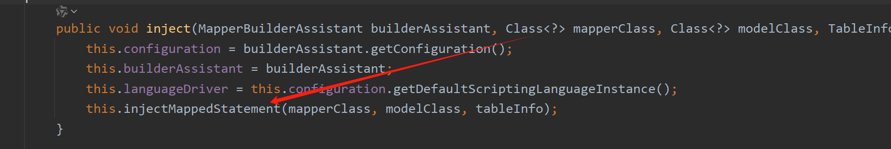
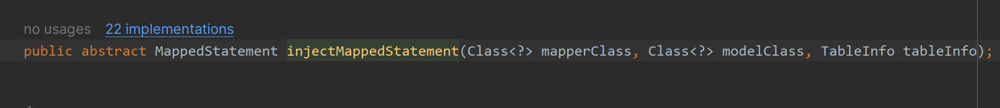
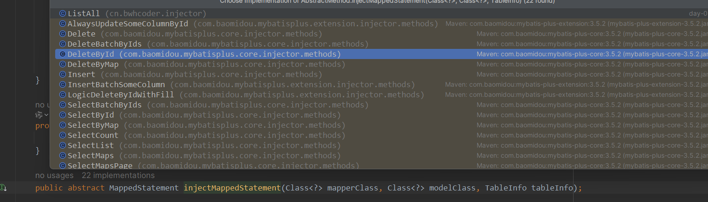
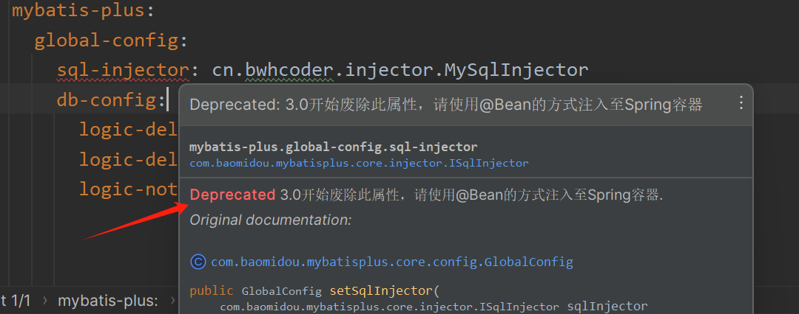

# 一、逻辑删除

>曾经我们写的删除代码都是物理删除。
>
>逻辑删除：删除转变为更新
>
>​	update user set deleted=1 where id = 1 and deleted=0
>
>查找: 追加 where 条件过**滤掉已删除数据**,如果使用 wrapper.entity 生成的 where 条件也会自动追加该字段
>
>​	查找: `select id,name,deleted from user where deleted=0`

## 1.修改表结构

- 给 user 表增加 deleted 字段（1代表删除0代表未删除）

  ```java
  CREATE TABLE `user` (
    `id` bigint NOT NULL AUTO_INCREMENT COMMENT '主键ID',
    `name` varchar(30) DEFAULT NULL COMMENT '姓名',
    `age` int DEFAULT NULL COMMENT '年龄',
    `uemail` varchar(128) CHARACTER SET utf8mb4 COLLATE utf8mb4_0900_ai_ci DEFAULT NULL COMMENT '邮箱',
    `deleted` int DEFAULT '0' COMMENT '删除与否',
    PRIMARY KEY (`id`)
  ) ENGINE=InnoDB AUTO_INCREMENT=8 DEFAULT CHARSET=utf8mb4 COLLATE=utf8mb4_0900_ai_ci;
  ```

- 修改字段的方式

  ```
  ALTER TABLE user ADD column `deleted` int DEFAULT '0' COMMENT '删除与否';
  ```

## 2.开启配置支持

- 配置`com.baomidou.mybatisplus.core.config.GlobalConfig$DbConfig`

  ```java
  mybatis-plus:
    global-config:
      db-config:
        logic-delete-field: deleted # 全局逻辑删除字段名
        logic-delete-value: 1 # 逻辑已删除值(默认为 1)
        logic-not-delete-value: 0 # 逻辑未删除值(默认为 0)
  ```

## 3.`@TableLogic`

- 实体类字段上加上`@TableLogic`注解

  ```java
  @Data
  public class User {
      @TableId(type = IdType.AUTO)
      private Long id;
      private String name;
      @TableField(select = false)
      private Integer age;
      @TableField(value = "uemail")
      private String email;
      @TableLogic
      private Integer deleted;
  }
  ```

## 4.测试

- 测试删除

  ```java
  @Test
  public void testLogicDeleted(){
      int ret = userMapper.deleteById(3L);
      System.out.println("删除受影响行数为："+ret);
  }
  ```

- 结果

  > 可以发现删除操作变成了更新

  ```java
  ==>  Preparing: UPDATE user SET deleted=1 WHERE id=? AND deleted=0
  ==> Parameters: 3(Long)
  <==    Updates: 1
  ```

- 测试查询

  ```java
  @Test
  public void testLogicDeletedSelect(){
      QueryWrapper<User> wrapper = new QueryWrapper<>();
      List<User> user = userMapper.selectList(wrapper);
      System.out.println(user);
  }
  ```

- 结果

  ```java
  ==>  Preparing: SELECT id,name,uemail AS email,deleted FROM user WHERE deleted=0
  ==> Parameters: 
  <==      Total: 3
  ```

- 数据库结果

  

# 二、通用枚举

>解决了繁琐的配置，让 mybatis 优雅的使用枚举属性！ 从 3.5.2 版本开始只需完成 `步骤1: 声明通用枚举属性` 即可使用。

> ### 作用
>
> 1. **类型安全**：通过使用枚举类型来表示数据库中的某些字段值，可以避免使用字符串或整数等原始类型带来的潜在错误，比如拼写错误或者非法值。枚举提供了有限的选择集合，确保了数据的正确性和一致性。
> 2. **代码可读性**：枚举可以为程序提供更好的可读性和可维护性。相比直接使用数字或字符串常量，使用枚举可以更清晰地表达代码意图。
> 3. (⭐️）**自动映射**：MyBatis-Plus 支持自动将数据库中的值映射到枚举对象，反之亦然。这意味着你可以在实体类中直接定义枚举类型的属性，框架会自动处理好数据库值与枚举值之间的转换。
> 4. **减少硬编码**：使用枚举可以减少代码中的硬编码值，使得代码更加灵活，更容易适应需求变化。
> 5. **业务逻辑封装**：枚举可以包含方法，实现特定的业务逻辑。例如，可以通过枚举的方法来决定某个状态是否有效，或者返回某种状态的具体描述。

## 1.修改表结构

- 添加性别字段

  ```java
  ALTER TABLE user ADD column `sex` int DEFAULT '1' COMMENT '1-男 0-女';
  ```

## 2.声明通用枚举属性

- 枚举

  ```java
  public enum SexEnum implements IEnum<Integer> {
      MAN(1, "男"),
      WOMAN(0, "女");
  
      private int value;
      private String desc;
  
      SexEnum(int value,String desc){
          this.value = value;
          this.desc = desc;
      }
  
      @Override
      public Integer getValue() {
          return this.value;
      }
  
      @Override
      public String toString() {
          return this.desc;
      }
  }
  ```

## 3.实体属性使用枚举类型

- 实体属性添加枚举类型

  ```java
  @Data
  public class User {
      @TableId(type = IdType.AUTO)
      private Long id;
      private String name;
      @TableField(select = false)
      private Integer age;
      @TableField(value = "uemail")
      private String email;
      @TableLogic
      private Integer deleted;
      private SexEnum sex;
  }
  ```

## 4.额外补充(到时候，用到回来看)

>如果是3.5.2版本之后的不需要配置了

- 之前版本的按如下配置

  ```java
  mybatis-plus:
      # 支持统配符 * 或者 ; 分割
      typeEnumsPackage: com.baomidou.springboot.entity.enums
  ```


### 4.1序列化给前端按如下两种方式都可以实现

#### Fastjson

- 添加如下注解

  ```java
  @JSONField(serialzeFeatures= SerializerFeature.WriteEnumUsingToString)
  private UserStatus status;
  ```

####  jackson

- 添加如下注解

  ```java
  @JsonValue	//标记响应json值
  private final int code;
  ```


## 5.测试

- 测试

  ```java
  @Test
  public void testEnum(){
      User entity = new User();
      entity.setEmail("erew");
      entity.setAge(19);
      entity.setName("小红");
      entity.setSex(SexEnum.MAN);  // MyBatis-Plus自动处理好数据库值与枚举值之间的转换
      int insert = userMapper.insert(entity);
      System.out.println("受影响行数为："+insert);
  }
  ```

- 结果

  ```java
  ==>  Preparing: INSERT INTO user ( name, age, uemail, sex ) VALUES ( ?, ?, ?, ? )
  ==> Parameters: 小红(String), 19(Integer), erew(String), 1(Integer)
  <==    Updates: 1
  ```

- 数据库结果

  

# 三、自动填充功能

>开发中，比如
>
>- 插入数据的时候需要插入创建时间
>
>- 更新数据的时候需要添加更新时间

## 1.修改表结构

- 修改表结构

  ```java
  CREATE TABLE `user` (
    `id` bigint NOT NULL AUTO_INCREMENT COMMENT '主键ID',
    `name` varchar(30) DEFAULT NULL COMMENT '姓名',
    `age` int DEFAULT NULL COMMENT '年龄',
    `uemail` varchar(128) CHARACTER SET utf8mb4 COLLATE utf8mb4_0900_ai_ci DEFAULT NULL COMMENT '邮箱',
    `deleted` int DEFAULT '0' COMMENT '删除与否',
    `sex` int DEFAULT '1' COMMENT '性别',
    `create_time` datetime DEFAULT NULL COMMENT '创建时间',
    `update_time` datetime DEFAULT NULL COMMENT '更新时间',
    PRIMARY KEY (`id`)
  ) ENGINE=InnoDB AUTO_INCREMENT=11 DEFAULT CHARSET=utf8mb4 COLLATE=utf8mb4_0900_ai_ci;
  ```

## 2.@TableField

- FieldFill

  ```java
  public enum FieldFill {
      DEFAULT,//不处理
      INSERT,//插入查出
      UPDATE,//更新处理
      INSERT_UPDATE;//插入和更新处理
  }
  ```

- 添加字段

  ```java
  @TableField(value = "create_time",fill = FieldFill.INSERT)
  private Date createTime;
  @TableField(value = "update_time",fill = FieldFill.UPDATE)
  private Date updateTime;
  ```

## 3.自定义实现类 MyMetaObjectHandler

> `MyMetaObjectHandler` 是 MyBatis-Plus 框架中的一个接口，用于自定义字段填充逻辑。
>
> ### 实现步骤
>
> 1. **创建自定义的 `MetaObjectHandler` 类**： 继承 `MyMetaObjectHandler` 接口并实现其方法。
> 2. **重写 `insertFill` 和 `updateFill` 方法**： 这两个方法分别用于在插入和更新记录时填充字段。
> 3. **在实体类中使用注解**： 使用 `@TableField` 注解标记需要自动填充的字段。
> 4. **配置 Spring Boot**： 将自定义的 `MetaObjectHandler` 注册为 Spring Bean。

- 自定义实现类 MyMetaObjectHandler

  ```JAVA
  @Slf4j
  @Component
  public class MyMetaObjectHandler implements MetaObjectHandler {
      @Override
      public void insertFill(MetaObject metaObject) {
          log.info("start insert fill ....");
          this.setFieldValByName("createTime",new Date(),metaObject);
          // 或者
           this.strictInsertFill(metaObject, "createTime", Date.class, new Date());  // 注意此处类型类型要匹配
      }
  
      @Override
      public void updateFill(MetaObject metaObject) {
          log.info("start update fill ....");
          this.setFieldValByName("updateTime",new Date(),metaObject);
          // 或者
          this.strictUpdateFill(metaObject, "updateTime", Date.class, new Date());
      }
  }
  ```
  
  > **注意**⚠️
  >
  > 如果，你给update设置为 `INSERT_UPDATE`。那么，在重写insertFill方法时，需要写入**更新时间** 和 **创建时间**两个操作。
  >
  > ```java
  >  @Override
  >     public void insertFill(MetaObject metaObject) {
  >         log.info("start insert fill ....");
  > 		this.strictUpdateFill(metaObject, "updateTime", Date.class, new Date());
  >          this.strictInsertFill(metaObject, "createTime", Date.class, new Date());
  >     }
  > ```

### 3.1MetaObject

> `MetaObject` 是 MyBatis 框架中的一个重要工具类，用于封装和操作对象的属性。它通过反射机制提供了一种统一的方式来访问和修改对象的属性，无论这些属性是通过字段、getter/setter 方法还是其他方式来表示的。
>
> ### 核心概念
>
> 1. **对象封装**：
>    - `MetaObject` 封装了一个对象，提供了统一的接口来访问和修改该对象的属性。
>    - 它可以处理不同类型的对象，如普通的 JavaBean、集合（List、Set、Map）等。
> 2. ⭐️**反射机制**：
>    - `MetaObject` 内部使用反射机制来操作对象的属性，使得开发者可以更加方便地进行属性的读写操作。
> 3. **属性表达式**：
>    - `MetaObject` 支持通过属性表达式来访问深层次的属性，如 `user.address.city`，它会自动处理多级属性访问，不需要手动逐级访问属性
>
> ### 使用场景
>
> 1. **对象属性的动态访问**：
>    - 在 MyBatis 的结果映射中，`MetaObject` 用于将查询结果的列值填充到 Java 对象的属性中。
>    - 在参数处理中，`MetaObject` 用于从传入的参数对象中读取属性值。
> 2. **对象属性的动态修改**：
>    - 在 MyBatis 的插入和更新操作中，`MetaObject` 用于设置对象的属性值。
>    - 在 MyBatis-Plus 中，`MetaObject` 用于实现字段的自动填充，如创建时间和更新时间。
> 3. **集合和映射的处理**：
>    - `MetaObject` 可以操作集合（List、Set、Map）中的元素，或者操作 JavaBean 中的属性。
>
> ### 总结
>
> `MetaObject` 是 MyBatis 框架中的一个重要工具类，通过封装对象的元数据信息，提供了一种灵活的方式来访问和操作对象的属性。它在 MyBatis 的结果映射、参数处理、字段自动填充等场景中发挥着重要作用。通过使用 `MetaObject`，开发者可以更加方便地进行对象属性的动态访问和修改，提高开发效率和代码的可维护性。

## 4.测试

- 测试插入操作

  ```java
  @Test
  public void testFillInsert(){
      User entity = new User();
      entity.setEmail("erew");
      entity.setAge(19);
      entity.setName("小红");
      entity.setSex(SexEnum.MAN);
      int insert = userMapper.insert(entity);
      System.out.println("受影响行数为："+insert);
  }
  ```

- 测试结果

  ```java
  ==>  Preparing: INSERT INTO user ( name, age, uemail, sex, create_time ) VALUES ( ?, ?, ?, ?, ? )
  ==> Parameters: 小红(String), 19(Integer), erew(String), 1(Integer), 2022-12-03 11:34:41.169(Timestamp)
  <==    Updates: 1
  ```

- 测试更新操作

  ```java
  @Test
  public void testFillUpdate(){
      User entity = new User();
      entity.setId(15L);
      entity.setEmail("erew");
      entity.setAge(19);
      entity.setName("小红");
      entity.setSex(SexEnum.MAN);
      int insert = userMapper.updateById(entity);
      System.out.println("受影响行数为："+insert);
  }
  ```

- 测试结果

  ```java
  ==>  Preparing: UPDATE user SET name=?, age=?, uemail=?, sex=?, update_time=? WHERE id=? AND deleted=0
  ==> Parameters: 小红(String), 19(Integer), erew(String), 1(Integer), 2022-12-03 11:37:10.716(Timestamp), 15(Long)
  <==    Updates: 1
  ```

- 数据库结果

  


# 四、SQL注入器（⭐️）

## 1.SQL注入的原理分析

>MyBatisPlus 是使用 ISqlInjector 接口负责SQL注入工作


- 具体实现注入

  ```java
  public void inspectInject(MapperBuilderAssistant builderAssistant, Class<?> mapperClass) {
      // 获取 Mapper 接口对应的实体类
      Class<?> modelClass = ReflectionKit.getSuperClassGenericType(mapperClass, Mapper.class, 0);
      if (modelClass != null) {
          // 获取 Mapper 接口的名称
          String className = mapperClass.toString();
          
          // 获取全局配置中的 Mapper 注册缓存
          Set<String> mapperRegistryCache = GlobalConfigUtils.getMapperRegistryCache(builderAssistant.getConfiguration());
          
          // 检查该 Mapper 接口是否已经被处理过
          if (!mapperRegistryCache.contains(className)) {
              // 初始化表信息
              TableInfo tableInfo = TableInfoHelper.initTableInfo(builderAssistant, modelClass);
              
              // 获取需要注入的方法列表
              List<AbstractMethod> methodList = this.getMethodList(mapperClass, tableInfo);
              
              // 如果方法列表不为空，则逐个注入方法
              if (CollectionUtils.isNotEmpty(methodList)) {
                  methodList.forEach((m) -> {
                      m.inject(builderAssistant, mapperClass, modelClass, tableInfo);
                  });
              } else {
                  // 如果没有有效的注入方法，记录日志
                  this.logger.debug(mapperClass.toString() + ", No effective injection method was found.");
              }
              
              // 将该 Mapper 接口添加到缓存中，避免重复处理
              mapperRegistryCache.add(className);
          }
      }
  }
  ```

- 实际的实现代码

  ```java
  methodList.forEach((m) -> {
                          m.inject(builderAssistant, mapperClass, modelClass, tableInfo);
                      });
  ```

  

  

- m.inject 调用具体方法

  ```java
  this.injectMappedStatement(mapperClass, modelClass, tableInfo);			
  ```

- 最终具体的执行就是自己定义的类

  > 调用实现类各自实现的injectMappedStatement方法。 （多态的体现）
  
  

## 2.扩充BaseMapper中方法

### 步骤 1:编写自己的BaseMapper

- 编写MyBaseMapper

  ```java
  public interface MyBaseMapper<T> extends BaseMapper<T> {
      List<T> listAll();
  }
  ```

- 需要用到的mapper 直接继承即可

  ```java
  public interface UserMapper extends MyBaseMapper<User> {
      
  }
  ```

### 步骤 2:定义SQL&编写自定义方法

- 需要定义自定义方法的SQL语句。这通常在继承了`AbstractMethod`的类中完成

- 创建ListAll 类 

  > 可以参考官方是怎么写的
  
  ```java
  public class ListAll extends AbstractMethod {
      @Override
      public MappedStatement injectMappedStatement(Class<?> mapperClass, Class<?> modelClass, TableInfo tableInfo) {
          String sqlMethod = "listAll"; // 必须和baseMapper的自定义方法名一致
          String sql = "select * from "+tableInfo.getTableName();
          SqlSource sqlSource = this.languageDriver.createSqlSource(this.configuration, sql, modelClass);
          return this.addSelectMappedStatementForTable(mapperClass,sqlMethod,sqlSource,tableInfo);
      }
  }
  ```

### 步骤 3:注册自定义方法

- 创建一个类来继承`DefaultSqlInjector`，并重写`getMethodList`方法来注册你的自定义方法。

- 创建MySqlInjector类

  ```java
  public class MySqlInjector extends DefaultSqlInjector {
      @Override
      public List<AbstractMethod> getMethodList(Class<?> mapperClass, TableInfo tableInfo) {
          //默认的mybatis-plus 的注入方法（⭐️）
          List<AbstractMethod> methodList = super.getMethodList(mapperClass, tableInfo);
          //添加自己的 listAll 类
          methodList.add(new ListAll());
          return methodList;
      }
  }
  ```

### 步骤 4:配置SqlInjector

最后，你需要在配置文件中指定你的自定义SQL注入器。

> 注意⚠️： 此方法已经废弃。
>
> #### 在 application.yml 中配置
>
> ```xml
> mybatis-plus:
>   global-config:
>     sql-injector: com.example.MyLogicSqlInjector
> ```
>
> 

```java
// 将MySqlInjector 交给容器管理
@Component
public class MySqlInjector extends DefaultSqlInjector {
    @Override
    public List<AbstractMethod> getMethodList(Class<?> mapperClass, TableInfo tableInfo) {
        //默认的mybatis-plus 的注入方法
        List<AbstractMethod> methodList = super.getMethodList(mapperClass, tableInfo);
        //添加自己的 listAll 类
        methodList.add(new ListAll());
        return methodList;
    }
}
```

### 2.5测试

- 测试

  ```java
  @Test
  public void testInjector(){
      List<User> users = userMapper.listAll();
      System.out.println(users);
  }
  ```

- 结果

  ```java
  ==>  Preparing: select * from user
  ==> Parameters: 
  <==      Total: 13
  ```


# 五、插件

## 1.拦截器核心代码

>## MybatisPlusInterceptor
>
>该插件是核心插件,目前代理了 `Executor#query` 和 `Executor#update` 和 `StatementHandler#prepare` 方法

- 拦截器核心代码

  ```java
  @Intercepts({
          @Signature(type = StatementHandler.class, method = "prepare", args = {Connection.class, Integer.class}),
  })
  @Component
  public class MyInterceptor implements Interceptor {
      @Override
      public Object intercept(Invocation invocation) throws Throwable {
          System.out.println("拦截前操作");
          //做拦截操作
          return invocation.proceed();
      }
  
      @Override
      public Object plugin(Object target) {
          System.out.println("装配插件");
          //装配插件
          return Plugin.wrap(target, this);
      }
  
      @Override
      public void setProperties(Properties properties) {
          System.out.println("设置属性");
          //属性设置
      }
  }
  ```

- 交给容器管理即可实现拦截操作

## 2.分页插件

- 使用

  ```java
  @Configuration
  @MapperScan("cn.sycoder.mapper")
  public class MybatisPlusConfig {
      @Bean
      public MybatisPlusInterceptor mybatisPlusInterceptor() {
          MybatisPlusInterceptor interceptor = new MybatisPlusInterceptor();
          interceptor.addInnerInterceptor(new PaginationInnerInterceptor(DbType.MYSQL));
          return interceptor;
      }
  }
  ```

## 3.乐观锁插件（⭐️）

> 乐观锁是一种并发控制机制，用于确保在更新记录时，该记录未被其他事务修改。MyBatis-Plus 提供了 `OptimisticLockerInnerInterceptor` 插件，使得在应用中实现乐观锁变得简单。

### 3.1实现原理

乐观锁的实现通常包括以下步骤：

1. 读取记录时，获取当前的版本号（version）。

2. 在更新记录时，将这个版本号一同传递。

3. 执行更新操作时，设置 `version = newVersion` 的条件为 `version = oldVersion`。

   > `oldVersion`: 更新前的版本号
   >
   > `newVersion`: 更新操作后，修改version，表明这条数据更新过了。 

4. 如果版本号不匹配，则更新失败。

### 3.2乐观锁补充

- 在数据库增加一个 version 字段来管理数据，假设没有其它人操作过这条数据，先读取本条数据的version,然后再修改的时候，判断之前拿出来的version 和现在的version是否一致，如果不一致，则表示被人操作过，不能够正常实现更新

- sql 演示

  ```java
  update user set age = 123123,version = version+1  where id = 16 and version = 0;
  ```

  

### 3.3添加乐观锁配置

- 添加配置

  ```java
  @Configuration
  @MapperScan("cn.sycoder.mapper")
  public class MybatisPlusConfig {
      @Bean
      public MybatisPlusInterceptor mybatisPlusInterceptor() {
          MybatisPlusInterceptor interceptor = new MybatisPlusInterceptor();
          interceptor.addInnerInterceptor(new PaginationInnerInterceptor(DbType.MYSQL));
          interceptor.addInnerInterceptor(new OptimisticLockerInnerInterceptor());
          return interceptor;
      }
  }
  ```

  

### 3.4修改表结构

- 表结构

  ```java
  CREATE TABLE `user` (
    `id` bigint NOT NULL AUTO_INCREMENT COMMENT '主键ID',
    `name` varchar(30) DEFAULT NULL COMMENT '姓名',
    `age` int DEFAULT NULL COMMENT '年龄',
    `uemail` varchar(128) CHARACTER SET utf8mb4 COLLATE utf8mb4_0900_ai_ci DEFAULT NULL COMMENT '邮箱',
    `deleted` int DEFAULT '0' COMMENT '删除与否',
    `sex` int DEFAULT '1' COMMENT '性别',
    `create_time` datetime DEFAULT NULL COMMENT '创建时间',
    `update_time` datetime DEFAULT NULL COMMENT '更新时间',
    `version` int DEFAULT NULL COMMENT '乐观锁控制',
    PRIMARY KEY (`id`)
  ) ENGINE=InnoDB AUTO_INCREMENT=17 DEFAULT CHARSET=utf8mb4 COLLATE=utf8mb4_0900_ai_ci;
  ```

  

### 3.5添加 version 字段

- 实体添加字段

  ```java
  @Version
  private Integer version;
  ```

### 3.6测试

- 测试乐观锁

  ```java
  @Test
  public void testVersion(){
      User user = userMapper.selectById(16L);
      user.setName("BWH666");
      int count = userMapper.updateById(user);
      System.out.println("受影响行数："+count);
  }
  ```

- 结果

  ```java
  ==>  Preparing: UPDATE user SET name=?, uemail=?, sex=?, create_time=?, update_time=?, version=? WHERE id=? AND version=? AND deleted=0
  ==> Parameters: 云哥666(String), sy@qq.com(String), 1(Integer), 2022-12-03 11:34:41.0(Timestamp), 2022-12-03 17:44:05.425(Timestamp), 3(Integer), 16(Long), 2(Integer)
  <==    Updates: 1
  ```

## 4.防全表更新与删除插件

>## BlockAttackInnerInterceptor
>
>针对 update 和 delete 语句 作用: 阻止恶意的全表更新删除


### 4.1配置拦截器

- 配置

  ```java
  @Configuration
  @MapperScan("cn.sycoder.mapper")
  public class MybatisPlusConfig {
      @Bean
      public MybatisPlusInterceptor mybatisPlusInterceptor() {
          MybatisPlusInterceptor interceptor = new MybatisPlusInterceptor();
          interceptor.addInnerInterceptor(new PaginationInnerInterceptor(DbType.MYSQL));
          interceptor.addInnerInterceptor(new OptimisticLockerInnerInterceptor());
          interceptor.addInnerInterceptor(new BlockAttackInnerInterceptor());
          return interceptor;
      }
  }
  ```

### 4.2测试

- 测试全表删除

  ```java
  @Test
  public void testDeleteAll(){
      QueryWrapper<User> wrapper = new QueryWrapper<>();
      int count = userMapper.delete(wrapper);
      System.out.println("受影响行数："+count);
  }
  ```

# 六、代码生成器

- 简化开发流程，提高开发效率，让程序写很少的代码就能实现开发

## 1.添加依赖

- 依赖

  > **mybatis-plus generator 依赖**
  >
  > ```xml
  > <dependency>
  >     <groupId>com.baomidou</groupId>
  >     <artifactId>mybatis-plus-generator</artifactId>
  >     <version>3.5.9</version>
  > </dependency>
  > ```
  
  ```xml
  <parent>
          <groupId>org.springframework.boot</groupId>
          <artifactId>spring-boot-starter-parent</artifactId>
          <version>2.7.5</version>
      </parent>
  
      <dependencies>
          <dependency>
              <groupId>org.springframework.boot</groupId>
              <artifactId>spring-boot-starter</artifactId>
          </dependency>
          <dependency>
              <groupId>org.springframework.boot</groupId>
              <artifactId>spring-boot-starter-test</artifactId>
              <scope>test</scope>
          </dependency>
          <dependency>
              <groupId>org.projectlombok</groupId>
              <artifactId>lombok</artifactId>
          </dependency>
          <dependency>
              <groupId>mysql</groupId>
              <artifactId>mysql-connector-java</artifactId>
          </dependency>
          <dependency>
              <groupId>com.baomidou</groupId>
              <artifactId>mybatis-plus-boot-starter</artifactId>
              <version>3.5.2</version>
          </dependency>
          <dependency>
              <groupId>com.baomidou</groupId>
              <artifactId>mybatis-plus-generator</artifactId>
              <version>3.5.2</version>
          </dependency>
          <dependency>
              <groupId>org.springframework.boot</groupId>
              <artifactId>spring-boot-starter-freemarker</artifactId>
          </dependency>
          <dependency>
              <groupId>org.springframework.boot</groupId>
              <artifactId>spring-boot-starter-web</artifactId>
          </dependency>
          <dependency>
              <groupId>org.freemarker</groupId>
              <artifactId>freemarker</artifactId>
              <version>2.3.31</version>
          </dependency>
          <dependency>
              <groupId>io.springfox</groupId>
              <artifactId>springfox-swagger-ui</artifactId>
              <version>2.10.1</version>
          </dependency>
          <dependency>
              <groupId>io.springfox</groupId>
              <artifactId>springfox-swagger2</artifactId>
              <version>2.10.1</version>
          </dependency>
          <dependency>
              <groupId>com.alibaba</groupId>
              <artifactId>druid-spring-boot-starter</artifactId>
              <version>1.2.15</version>
          </dependency>
      </dependencies>
  ```

## 2.使用

- 旧版

  ```java
  public static void main(String[] args) {
          FastAutoGenerator.create("jdbc:mysql://localhost:3306/mybatis-plus", "root", "123456")
                  .globalConfig(builder -> {
                      builder.author("sy") // 设置作者
                              .enableSwagger() // 开启 swagger 模式
                              .fileOverride() // 覆盖已生成文件
                              .outputDir("F:\\03-Spring\\MyBatisPlus\\homework\\mybatis-plus-02\\src\\main\\java\\"); // 指定输出目录
                  })
                  .packageConfig(builder -> {
                      builder.parent("cn") // 设置父包名
                              .moduleName("sycoder") // 设置父包模块名
                              .pathInfo(Collections.singletonMap(OutputFile.xml, "F:\\03-Spring\\MyBatisPlus\\homework\\mybatis-plus-02\\src\\main\\resources\\cn\\sycoder")); // 设置mapperXml生成路径
                  })
                  .strategyConfig(builder -> {
                      builder.addInclude("user"); // 设置需要生成的表名
  //                            .addTablePrefix("t_", "c_"); // 设置过滤表前缀
                  })
                  .templateEngine(new FreemarkerTemplateEngine()) // 使用Freemarker引擎模板，默认的是Velocity引擎模板
                  .execute();
  
      }
  ```

- **新版**(更加简洁)

  ```java
  FastAutoGenerator.create("jdbc:mysql://localhost:3306/springboot_ssm", "root", "123456")
                  .globalConfig(builder -> builder
                          .author("bwh") // 设置作者
                          .outputDir("D:\\ideaProject\\MyBatis-plus\\test\\src\\main\\java") // 指定输出目录
                          .commentDate("yyyy-MM-dd") 
                  )
                  .packageConfig(builder -> builder
                          .parent("cn.bwhcoder") // 设置父包名
                          .entity("entity")
                          .mapper("mapper")
                          .service("service")
                          .serviceImpl("service.impl")
                          .pathInfo(Collections.singletonMap(OutputFile.xml, "D:\\ideaProject\\MyBatis-plus\\test\\src\\main\\resources\\cn\\bwhcoder"))// 设置mapperXml生成路径
  
  
                  )
                  .strategyConfig(builder -> builder  // 将数据库下的所有表进行生成
                          .entityBuilder()
                          .enableLombok()
                  )
                  .templateEngine(new FreemarkerTemplateEngine())
                  .execute();
  ```

  
