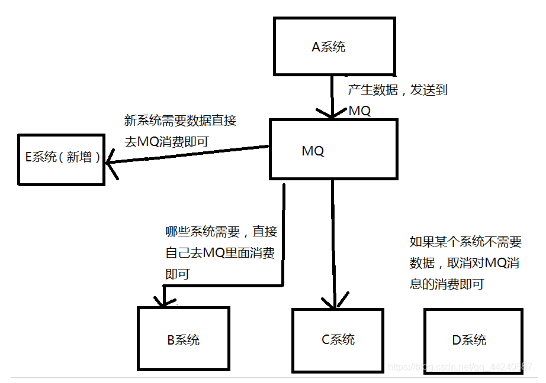
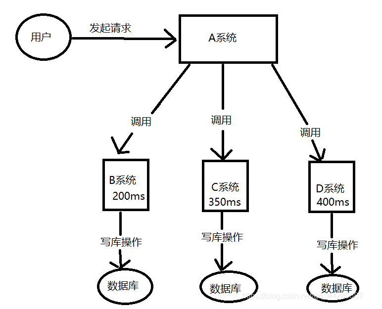
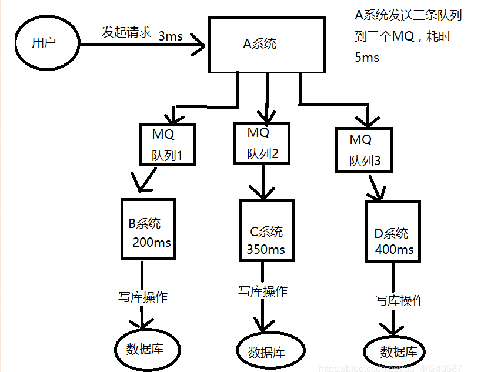
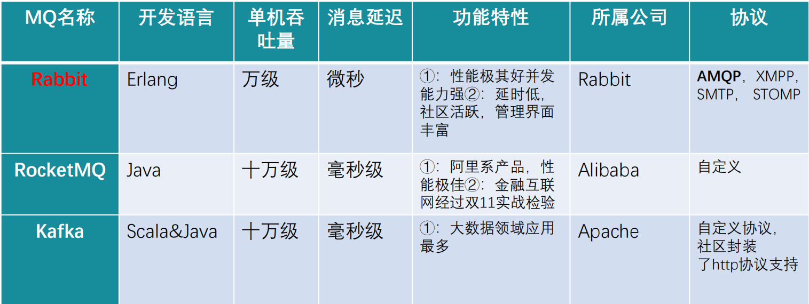

# 一、MQ的介绍

> MQ（Message Queue）：消息队列，是基础数据结构中FIFO的一种数据结构。一般用来解决流量削峰、应用解耦、
>
> 异步处理等问题，实现高性能，高可用，可伸缩和最终一致性架构。
>

## MQ思考

- **首先，你们系统里面为什么要用MQ**
  不少去面试的人，都知道自己以前项目里面用过MQ、Redis，但是为什么用这个，却不知道，这种人说白了就是为了用而用，又或者这个框架就是别人设计的，他自己都没了解过里面的东西，自然也不知道为什么要用。如果面试的时候面试官问你这种问题你答不上来，可能已经被pass百分之三十了，面试官通常对这种人印象很不好，他怕你进了公司只会埋头苦干，不懂得自己思考。

- **第二，你既然用了MQ，那你知不知道MQ有什么好处和坏处**

  如果没考虑过这个问题一定要慎重回答，因为你没考虑过这个，盲目的弄个MQ进系统，当下的问题可能是解决了，但万一后面出了问题不是给公司留坑吗，面试官就怕这样的人，招进来干了一年，自己跳槽了，给系统挖一堆坑，留下无穷祸患。

- **第三，既然你用了MQ，比如其中一种MQ，那你当时做没做过调研**

  别看别人用了MQ，咦，感觉挺好的，就自己瞎弄了一个，根本没考虑过MQ的选型，比如kafka，每个MQ并没有绝对的好处和坏处，现在业界流行的MQ各有各的好处，各有各的坏处，你要做的就是扬长避短，挑选最适合自己系统的MQ。

## MQ优点

### 1.系统解耦

- **场景描述**

  现有ABCDE五个系统，最初的时候BCD三个系统都要调用A系统的接口获取数据，一切都很正常，但是突然，D系统说：我不要了，你不用给我传数据了，A系统无奈，只能修改代码，将调用D系统的代码删除，这时候还没删除呢，E系统发送了请求，但是A系统这时候还没处理完D系统的请求，A系统卒！！！彻底崩溃。看下图↓↓↓↓↓↓↓↓↓↓↓
  

- **问题**

  上述场景中，BCDE都需要用到A系统提供的数据，A系统跟其他四个系统严重耦合，需要时时刻刻考虑其他四个系统要是挂了怎么办，需不需要重新发送数据给他们，这个时候的A系统内心是崩溃的。

- **解决办法**

  使用了MQ之后 ，A系统的数据只需要放到MQ里面，其他的系统想请求获取数据只需要去MQ里面消费即可，如果突然不想请求了，就取消对MQ的消费就行了，A系统根本不需要考虑给谁去响应这个数据，也不需要去维护代码，也不用考虑其他系统是否调用成功，失败超时等情况。

  

- **总结**

  通过MQ发布订阅消息的模型，A系统就成功的跟其他系统解耦了。

- **面试技巧**

  你需要思考一下，在你自己的系统里面有没有类似的情况，一个系统或者模块，调用了多个系统或者模块，它们互相之间的调用非常复杂，并且维护起来很麻烦，但其实这个调用是不需要直接同步调用接口的，如果用MQ给它异步化解耦也是可以的，你就需要思考在你的项目里，是不是可以用MQ给它进行系统的解耦，可以自己组织一下语言回答。

### 2.异步调用

- **场景描述**

  ABCD四个系统，A系统收到一个请求，需要在自己本地写库，还需要往BCD三个系统写库，A系统自己写本地库需要3ms，往其他系统写库相对较慢，B系统200ms ，C系统350ms，D系统400ms，这样算起来，整个功能从请求到响应的时间为3ms+200ms+350ms+400ms=953ms，接近一秒，对于用户来说，点个按钮要等这么长时间，基本是无法接受的，侧面也反映出这家研发人员技术不咋地。
  

- **问题**

  系统反应时间过长。一般的互联网企业，对于用户请求响应的时间要求在100ms-200ms之间，这样，用户的眼睛存在视觉暂停现象，用户响应时间在此范围内就可以了，所以上面的现象是不可取的。

- **解决办法**

  用了MQ，用户发送请求到A系统耗时3ms，A系统发送三条消息到MQ，假如耗时5ms，用户从发送请求到相应3ms+5ms=8ms，仅用了8ms，用户的体验非常好。

  

  

### 3.流量削峰

- **场景描述**

  2020年爆发的这场新冠病毒，导致各大线上商城APP里面的口罩被抢购一空，在这种情况下，JD商城开启了一场每晚八点的抢购3Q口罩的活动，每天下午三点进行预约，晚上八点抢购，从JD商城刚上线这个活动，我连续抢了近一个周，也算是见证了一个百万并发量系统从出现问题到完善的一个过程，最初第一天，我抢购的时候，一百多万预约，到八点抢购估计也能有百万的并发量，可是第一天，到八点我抢的时候，由于并发量太高，直接把JD服务器弄崩了，直接报了异常，可能JD在上线这个活动的时候也没能够想到会有那么高的并发，打了一个猝不及防，但是这只是在前一两天出现报异常的情况，后面却没有再出现异常信息，到后来再抢购只是响应的时间变得很慢，但是JD系统并没有崩溃，这种情况下一般就是用了MQ（或者之前用了MQ，这次换了个吞吐量级别更高的MQ），也正是利用了MQ的三大好处之一——削峰。
  JD系统每天0—19点，系统风平浪静，结果一到八点抢购的时候，每秒并发达到百万，
  假设JD数据库没秒能处理1.5w条并发请求（并非实际数据，主要为了举例）,到八点抢购的时候，每秒并发百万，这直接导致系统异常，但是八点一过，可能也就几万用户在线操作，每秒的请求可能也就几百条，对整个系统毫无压力。

- 解决办法

  使用了MQ，每秒百万个请求写入MQ，因为JD系统每秒能处理1W+的请求，JD系统处理完然后再去MQ里面，再拉取1W+的请求处理，每次不要超过自己能处理的最大请求量就ok，这样下来，等到八点高峰期的时候，系统也不会挂掉，但是近一个小时内，系统处理请求的速度是肯定赶不上用户的并发请求的，所以都会积压在MQ中，甚至可能积压千万条，但是高峰期过后，每秒只会有一千多的并发请求进入MQ，但是JD系统还是会以每秒1W+的速度处理请求，所以高峰期一过，JD系统会很快消化掉积压在MQ的请求，在用户那边可能也就是等的时间长一点，但是绝对不会让系统挂掉。
  

## MQ缺点

### 1.系统可用性降低

系统引入的外部依赖越多，系统要面对的风险越高，拿场景一来说，本来A、、BCD四个系统配合的好好的，没啥问题，但是你偏要弄个MQ进来插一脚，虽然好处挺多，但是万一MQ挂掉了呢，那样你系统不也就挂掉了。

### 2.系统复杂程度提高

非要加个MQ进来，如何保证没有重复消费呢？如何处理消息丢失的情况？怎么保证消息传递的顺序？问题太多。

### 3.一致性的问题

A系统处理完再传递给MQ就直接返回成功了，用户以为你这个请求成功了，但是，如果在BCD的系统里，BC两个系统写库成功，D系统写库失败了怎么办，这样就导致数据不一致了。所以。消息队列其实是一套非常复杂的架构，你在享受MQ带来的好处的同时，也要做各种技术方案把MQ带来的一系列的问题解决掉，等一切都做好之后，系统的复杂程度硬生生提高了一个等级。

## 主流MQ

> **AMQP**（Advanced Message Queuing Protocol，高级消息队列协议）是一种开放标准的应用层协议，用于中间件消息传递。它旨在提供统一的消息传递模型，使得不同系统之间的消息传递更加标准化和可靠。

# RabbitMQ

官网地址：https://www.rabbitmq.com/

架构图：

> 1. Producer:生产者，发送消息的程序
>
> 2. Consumer:消费者，接收消息的程序
>
> 3. Broker:接收和分发消息的应用，RabbitMQServer 就是Message Broker 
>
> 4. Connection:生产者，消费者，Broker之间的TCP连接
>
> 5. Channel:通信连接信道，降低TCP连接开销
>
> 6. Virtual host：虚拟主机
>
> 7. Exchange:交换机，message 到达broker 先存放到交换机
>
> 8. Queue:队列，消费者从这里获取消息
>
> 9. Binding:交换机与队列之间的虚拟连接，用于消息分发

## 工作模式

### 1. **Simple 模式（简单模式）**

**描述**：

- 生产者将消息发送到队列，消费者从队列中接收消息。

- 这是最简单的模式，适用于一对一的通信场景。

  
