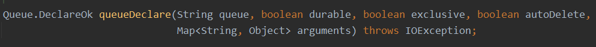
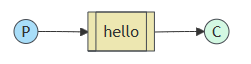

# 一、MQ的介绍

> MQ（Message Queue）：消息队列，是基础数据结构中FIFO的一种数据结构。一般用来解决流量削峰、应用解耦、
>
> 异步处理等问题，实现高性能，高可用，可伸缩和最终一致性架构。
>

## MQ思考

- **首先，你们系统里面为什么要用MQ**
  不少去面试的人，都知道自己以前项目里面用过MQ、Redis，但是为什么用这个，却不知道，这种人说白了就是为了用而用，又或者这个框架就是别人设计的，他自己都没了解过里面的东西，自然也不知道为什么要用。如果面试的时候面试官问你这种问题你答不上来，可能已经被pass百分之三十了，面试官通常对这种人印象很不好，他怕你进了公司只会埋头苦干，不懂得自己思考。

- **第二，你既然用了MQ，那你知不知道MQ有什么好处和坏处**

  如果没考虑过这个问题一定要慎重回答，因为你没考虑过这个，盲目的弄个MQ进系统，当下的问题可能是解决了，但万一后面出了问题不是给公司留坑吗，面试官就怕这样的人，招进来干了一年，自己跳槽了，给系统挖一堆坑，留下无穷祸患。

- **第三，既然你用了MQ，比如其中一种MQ，那你当时做没做过调研**

  别看别人用了MQ，咦，感觉挺好的，就自己瞎弄了一个，根本没考虑过MQ的选型，比如kafka，每个MQ并没有绝对的好处和坏处，现在业界流行的MQ各有各的好处，各有各的坏处，你要做的就是扬长避短，挑选最适合自己系统的MQ。

## MQ优点

### 1.系统解耦

- **场景描述**

  现有ABCDE五个系统，最初的时候BCD三个系统都要调用A系统的接口获取数据，一切都很正常，但是突然，D系统说：我不要了，你不用给我传数据了，A系统无奈，只能修改代码，将调用D系统的代码删除，这时候还没删除呢，E系统发送了请求，但是A系统这时候还没处理完D系统的请求，A系统卒！！！彻底崩溃。看下图↓↓↓↓↓↓↓↓↓↓↓
  

- **问题**

  上述场景中，BCDE都需要用到A系统提供的数据，A系统跟其他四个系统严重耦合，需要时时刻刻考虑其他四个系统要是挂了怎么办，需不需要重新发送数据给他们，这个时候的A系统内心是崩溃的。

- **解决办法**

  使用了MQ之后 ，A系统的数据只需要放到MQ里面，其他的系统想请求获取数据只需要去MQ里面消费即可，如果突然不想请求了，就取消对MQ的消费就行了，A系统根本不需要考虑给谁去响应这个数据，也不需要去维护代码，也不用考虑其他系统是否调用成功，失败超时等情况。

  

- **总结**

  通过MQ发布订阅消息的模型，A系统就成功的跟其他系统解耦了。

- **面试技巧**

  你需要思考一下，在你自己的系统里面有没有类似的情况，一个系统或者模块，调用了多个系统或者模块，它们互相之间的调用非常复杂，并且维护起来很麻烦，但其实这个调用是不需要直接同步调用接口的，如果用MQ给它异步化解耦也是可以的，你就需要思考在你的项目里，是不是可以用MQ给它进行系统的解耦，可以自己组织一下语言回答。


### 2.异步调用

- **场景描述**

  ABCD四个系统，A系统收到一个请求，需要在自己本地写库，还需要往BCD三个系统写库，A系统自己写本地库需要3ms，往其他系统写库相对较慢，B系统200ms ，C系统350ms，D系统400ms，这样算起来，整个功能从请求到响应的时间为3ms+200ms+350ms+400ms=953ms，接近一秒，对于用户来说，点个按钮要等这么长时间，基本是无法接受的，侧面也反映出这家研发人员技术不咋地。
  

- **问题**

  系统反应时间过长。一般的互联网企业，对于用户请求响应的时间要求在100ms-200ms之间，这样，用户的眼睛存在视觉暂停现象，用户响应时间在此范围内就可以了，所以上面的现象是不可取的。

- **解决办法**

  用了MQ，用户发送请求到A系统耗时3ms，A系统发送三条消息到MQ，假如耗时5ms，用户从发送请求到相应3ms+5ms=8ms，仅用了8ms，用户的体验非常好。

  

  

### 3.流量削峰

- **场景描述**

  2020年爆发的这场新冠病毒，导致各大线上商城APP里面的口罩被抢购一空，在这种情况下，JD商城开启了一场每晚八点的抢购3Q口罩的活动，每天下午三点进行预约，晚上八点抢购，从JD商城刚上线这个活动，我连续抢了近一个周，也算是见证了一个百万并发量系统从出现问题到完善的一个过程，最初第一天，我抢购的时候，一百多万预约，到八点抢购估计也能有百万的并发量，可是第一天，到八点我抢的时候，由于并发量太高，直接把JD服务器弄崩了，直接报了异常，可能JD在上线这个活动的时候也没能够想到会有那么高的并发，打了一个猝不及防，但是这只是在前一两天出现报异常的情况，后面却没有再出现异常信息，到后来再抢购只是响应的时间变得很慢，但是JD系统并没有崩溃，这种情况下一般就是用了MQ（或者之前用了MQ，这次换了个吞吐量级别更高的MQ），也正是利用了MQ的三大好处之一——削峰。
  JD系统每天0—19点，系统风平浪静，结果一到八点抢购的时候，每秒并发达到百万，
  假设JD数据库没秒能处理1.5w条并发请求（并非实际数据，主要为了举例）,到八点抢购的时候，每秒并发百万，这直接导致系统异常，但是八点一过，可能也就几万用户在线操作，每秒的请求可能也就几百条，对整个系统毫无压力。


- 解决办法

  使用了MQ，每秒百万个请求写入MQ，因为JD系统每秒能处理1W+的请求，JD系统处理完然后再去MQ里面，再拉取1W+的请求处理，每次不要超过自己能处理的最大请求量就ok，这样下来，等到八点高峰期的时候，系统也不会挂掉，但是近一个小时内，系统处理请求的速度是肯定赶不上用户的并发请求的，所以都会积压在MQ中，甚至可能积压千万条，但是高峰期过后，每秒只会有一千多的并发请求进入MQ，但是JD系统还是会以每秒1W+的速度处理请求，所以高峰期一过，JD系统会很快消化掉积压在MQ的请求，在用户那边可能也就是等的时间长一点，但是绝对不会让系统挂掉。
  

## MQ缺点

### 1.系统可用性降低

系统引入的外部依赖越多，系统要面对的风险越高，拿场景一来说，本来A、、BCD四个系统配合的好好的，没啥问题，但是你偏要弄个MQ进来插一脚，虽然好处挺多，但是万一MQ挂掉了呢，那样你系统不也就挂掉了。

### 2.系统复杂程度提高

非要加个MQ进来，如何保证没有重复消费呢？如何处理消息丢失的情况？怎么保证消息传递的顺序？问题太多。

### 3.一致性的问题

A系统处理完再传递给MQ就直接返回成功了，用户以为你这个请求成功了，但是，如果在BCD的系统里，BC两个系统写库成功，D系统写库失败了怎么办，这样就导致数据不一致了。所以。消息队列其实是一套非常复杂的架构，你在享受MQ带来的好处的同时，也要做各种技术方案把MQ带来的一系列的问题解决掉，等一切都做好之后，系统的复杂程度硬生生提高了一个等级。

## 主流MQ


> **AMQP**（Advanced Message Queuing Protocol，高级消息队列协议）是一种开放标准的应用层协议，用于中间件消息传递。它旨在提供统一的消息传递模型，使得不同系统之间的消息传递更加标准化和可靠。

# RabbitMQ

官网地址：https://www.rabbitmq.com/

架构图：


> 1. Producer:生产者，发送消息的程序
>
> 2. Consumer:消费者，接收消息的程序
>
> 3. Broker:接收和分发消息的应用，RabbitMQServer 就是Message Broker 
>
> 4. Connection:生产者，消费者，Broker之间的TCP连接
>
> 5. Channel:通信连接信道，降低TCP连接开销。在客户端的每个连接里，可建立多个channel，每个channel代表一个会话
>
>    任务。
>
> 6. Virtual host：虚拟主机
>
> 7. Exchange:交换机，message 到达broker 先存放到交换机
>
> 8. Queue:队列，消费者从这里获取消息
>
> 9. Binding:它的作用就是把exchange和queue按照路由规则绑定起来，用于消息分发。
>
> 10. Routing Key： 路由关键字，exchange根据这个关键字进行消息投递
>
> `由Exchange、Queue、RoutingKey三个才能决定一个从Exchange到Queue的唯一的线路。`

## 常用方法

### `queueDeclare`:用于声明一个队列



> ### 参数说明
>
> 1. **queue**: 队列的名称。如果传入空字符串 `""`，RabbitMQ 会自动生成一个唯一的队列名称。
> 2. **durable**: 是否持久化队列。如果设置为 `true`，队列将在 RabbitMQ 重启后仍然存在。
> 3. **exclusive**: 是否独占队列。如果设置为 `true`，队列只允许当前连接使用，且在连接断开后自动删除。
> 4. **autoDelete**: 是否自动删除队列。如果设置为 `true`，队列在没有任何消费者订阅时自动删除。
> 5. **arguments**: 队列的其他属性，如 TTL（Time-To-Live）、死信交换等。这是一个 `Map<String, Object>` 类型的参数。
>
> ### 返回值
>
> `queueDeclare` 方法返回一个 `Queue.DeclareOk` 对象，该对象包含以下信息：
>
> - **queue**: 实际使用的队列名称。如果传入的是空字符串，这里会是 RabbitMQ 自动生成的队列名称。
> - **messageCount**: 队列中当前的消息数量。

### `exchangeDeclare`:用于声明一个交换机


### `basicPublish`:用于发布消息到指定的交换机


> ### 参数说明
>
> 1. **exchange**: 交换机的名称。如果传入空字符串 `""`，表示使用默认交换机（default exchange）。
> 2. **routingKey**: 路由键。路由键用于将消息路由到特定的队列。对于默认交换机，路由键就是队列的名称。(其实，就是在多个队列和一个交换机绑定时，通过路由键，去确定将消息交给哪个队列)
> 3. **props**: 消息的属性。这是一个 `BasicProperties` 对象，可以包含各种属性，如消息的持久性、内容类型、头信息等。
> 4. **body**: 消息的主体内容，是一个字节数组。

### `basicConsume`:用于开始消费指定队列中的消息


> ### 参数说明
>
> 1. **queue**: 要消费的队列名称。
> 2. **autoAck**: 是否自动确认消息。如果设置为 `true`，消费者接收到消息后会自动向 RabbitMQ 发送确认。如果设置为 `false`，则需要手动确认消息。
> 3. **deliverCallback**: 消息到达时的回调函数。每当有新的消息到达时，这个回调函数会被调用。
> 4. **cancelCallback**: 取消消费时的回调函数。当消费者被取消（例如，队列被删除或消费者被显式取消）时，这个回调函数会被调用。
>
> ### 返回值
>
> `basicConsume` 方法返回一个 `consumerTag` 字符串，这是 RabbitMQ 分配给消费者的唯一标识符。你可以使用这个标识符来取消消费。

### `queueBind`:Bind a queue to an exchange.


> #### Params:
>
> - **queue** – the name of the queue
> -  **exchange** – the name of the exchange
> -  **routingKey** – the routing key to use for the binding 
> - **arguments** – other properties (binding parameters)
>
> #### Returns:
>
> - a binding-confirm method if the binding was successfully created

## 工作模式

### 1. Simple 模式（简单模式）



**描述**：

- 消息产生消息，将消息放入队列。
- 消息的消费者(consumer) 监听 消息队列,如果队列中有消息,就消费掉,消息被拿走后,自动从队列中

  删除(隐患 消息可能没有被消费者正确处理,已经从队列中消失了,造成消息的丢失，这里可以设置

  成手动的ack,但如果设置成手动ack，处理完后要及时发送ack消息给队列，否则会造成内存溢

  出)。

#### Sending

```java
public class ProducerDemo1 {
    private final static String QUEUE_NAME = "hello";
    public static void main(String[] args) {
        ConnectionFactory factory = new ConnectionFactory();
        factory.setHost("118.31.104.65");
        factory.setUsername("bwh");
        factory.setPassword("123456");
        try (Connection connection = factory.newConnection();
            Channel channel = connection.createChannel()) {
            channel.queueDeclare(QUEUE_NAME, false, false, false, null);
            String message = "Hello World!";
            channel.basicPublish("", QUEUE_NAME, null, message.getBytes());
            System.out.println(" [x] Sent '" + message + "'");
        } catch (IOException e) {
            throw new RuntimeException(e);
        } catch (TimeoutException e) {
            throw new RuntimeException(e);
        }
    }
}
```

#### Receiving

```java
public class ConsumerDemo1 {
    private final static String QUEUE_NAME = "hello";
    public static void main(String[] argv) throws Exception {
        ConnectionFactory factory = new ConnectionFactory();
        factory.setHost("118.31.104.65");

        factory.setUsername("bwh");
        factory.setPassword("123456");
        Connection connection = factory.newConnection();
        Channel channel = connection.createChannel();

        channel.queueDeclare(QUEUE_NAME, false, false, false, null);
        System.out.println(" [*] Waiting for messages. To exit press CTRL+C");

        DeliverCallback deliverCallback = (consumerTag, delivery) -> {
            String message = new String(delivery.getBody(), "UTF-8");
            System.out.println(" [x] Received '" + message + "'");
        };
        channel.basicConsume(QUEUE_NAME, true, deliverCallback, consumerTag -> { });
    }
}
```

### **Work Queues** 工作队列


**描述**

消息产生者将消息放入队列消费者可以有多个,消费者1,消费者2同时监听同一个队列,消息被消费。C1 C2共同争抢当前的消息队列内容,谁先拿到谁负责消费消息(隐患：高并发情况下,默认会产生某一个消息被多个消费者共同使用,可以设置一个开关(syncronize) 保证一条消息只能被一个消费者使用)。

**关键特性**

1. **消息分发**: 消息会按照轮询（Round-robin）的方式分发给各个工作者。(同一条消息，在多个消费者之间只能有一个消费，应用于只需要单节点消费的场景)
2. **消息确认（Message Acknowledgments）**: 工作者在处理完消息后，需要向 RabbitMQ 发送确认，以防止消息丢失。
3. **持久化（Durability）**: 可以设置队列和消息的持久化，以确保在 RabbitMQ 重启后任务不会丢失。

#### 生产者（Producer）

```java

public class Producer {
    private final static String QUEUE_NAME = "task_queue";

    public static void main(String[] args) throws Exception {
        ConnectionFactory factory = new ConnectionFactory();
        factory.setHost("localhost");

        try (Connection connection = factory.newConnection();
             Channel channel = connection.createChannel()) {

            // 声明一个持久化的队列
            channel.queueDeclare(QUEUE_NAME, true, false, false, null);

            // 消息内容
            String message = "Hello, RabbitMQ!";
            channel.basicPublish("", QUEUE_NAME, null, message.getBytes("UTF-8"));

            System.out.println(" [x] Sent '" + message + "'");
        }
    }
}
```

#### 消费者（Consumer）

```java
public class Worker {
    private final static String QUEUE_NAME = "task_queue";

    public static void main(String[] args) throws Exception {
        ConnectionFactory factory = new ConnectionFactory();
        factory.setHost("118.31.104.65");
        factory.setUsername("bwh");
        factory.setPassword("123456");

        Connection connection = factory.newConnection();
        Channel channel = connection.createChannel();

        // 声明一个持久化的队列
        channel.queueDeclare(QUEUE_NAME, true, false, false, null);

        // 设置预取计数，表示每个消费者最多同时处理一个消息
        channel.basicQos(1);

        // 消息到达时的回调函数
        DeliverCallback deliverCallback = (consumerTag, delivery) -> {
            String message = new String(delivery.getBody(), "UTF-8");
            System.out.println(" [x] Received '" + message + "'");

            // 模拟处理时间
            try {
                Thread.sleep(1000);
            } catch (InterruptedException e) {
                e.printStackTrace();
            }

            // 发送确认
            channel.basicAck(delivery.getEnvelope().getDeliveryTag(), false);
        };

        // 取消消费时的回调函数
        CancelCallback cancelCallback = consumerTag -> {
            System.out.println(" [x] Consumer cancelled");
        };

        // 开始消费消息
        channel.basicConsume(QUEUE_NAME, false, deliverCallback, cancelCallback);

        System.out.println(" [*] Waiting for messages. To exit press CTRL+C");

    }
}
```

### **Publish/Subscribe**  发布订阅模式


发布/订阅（Publish/Subscribe）模式是消息传递中的一种常见模式，用于将消息从生产者（Publisher）发送到多个消费者（Subscriber）。在这种模式下，生产者将消息发布到一个特定的主题（Topic），所有订阅了该主题的消费者都会收到这些消息。这种模式非常适合于广播消息和事件通知。

**关键概念**

1. **生产者（Publisher）**: 发布消息到特定的主题。
2. **交换机（Exchange）**: 负责将消息路由到一个或多个队列。
3. **消费者（Subscriber）**: 订阅特定主题的队列，接收并处理消息。
4. **绑定（Binding）**: 将队列绑定到交换机，指定路由键（Routing Key）。

**常见的交换机类型**

1. **Direct Exchange**: 根据路由键将消息路由到特定的队列。
2. **Fanout Exchange**: 将**消息广播**到所有绑定的队列，不考虑路由键。
3. **Topic Exchange**: 根据路由键的模式匹配将消息路由到多个队列。

**使用场景**

1. **日志收集**：多个消费者订阅同一个日志主题，每个消费者可以独立处理日志。
2. **事件通知**：发布事件到一个主题，多个订阅者可以接收并处理这些事件。
3. **实时更新**：将实时数据推送到多个客户端，例如股票价格更新、天气预报等。
4. **系统监控**：多个监控系统订阅同一个事件流，实时监控系统状态。
5. **分布式系统**：在分布式系统中，多个节点可以订阅同一个主题，接收并处理消息。

**关键点**

- **交换机（Exchange）**: 负责将消息路由到一个或多个队列。常见的交换机类型有 `fanout`、`direct` 和 `topic`。
- **绑定（Binding）**: 将队列绑定到交换机，指定路由键。对于 `fanout` 交换机，路由键通常为空字符串 `""`。
- **临时队列**：消费者可以声明一个临时队列，RabbitMQ 会自动生成一个唯一的队列名称，并在消费者断开连接后自动删除队列。

#### 生产者（Publisher）

```java
public class Publisher {
    private final static String EXCHANGE_NAME = "logs";

    public static void main(String[] args) throws Exception {
        ConnectionFactory factory = new ConnectionFactory();
        factory.setHost("localhost");

        try (Connection connection = factory.newConnection();
             Channel channel = connection.createChannel()) {

            // 声明一个 fanout 类型的交换机
            channel.exchangeDeclare(EXCHANGE_NAME, "fanout");

            // 消息内容
            String message = "Hello, RabbitMQ!";
            channel.basicPublish(EXCHANGE_NAME, "", null, message.getBytes("UTF-8"));

            System.out.println(" [x] Sent '" + message + "'");
        }
    }
}
```

#### 消费者（Subscriber）

```java
import com.rabbitmq.client.*;

public class Subscriber {
    private final static String EXCHANGE_NAME = "logs";

    public static void main(String[] args) throws Exception {
        ConnectionFactory factory = new ConnectionFactory();
        factory.setHost("118.31.104.65");
        factory.setUsername("bwh");
        factory.setPassword("123456");

        Connection connection = factory.newConnection();
        Channel channel = connection.createChannel();

        // 声明一个 fanout 类型的交换机
        channel.exchangeDeclare(EXCHANGE_NAME, "fanout");

        // 声明一个临时队列		
        String queueName = channel.queueDeclare().getQueue();

        // 将队列绑定到交换机
        channel.queueBind(queueName, EXCHANGE_NAME, "");

        // 消息到达时的回调函数
        DeliverCallback deliverCallback = (consumerTag, delivery) -> {
            String message = new String(delivery.getBody(), "UTF-8");
            System.out.println(" [x] Received '" + message + "'");
        };

        // 取消消费时的回调函数
        CancelCallback cancelCallback = consumerTag -> {
            System.out.println(" [x] Consumer cancelled");
        };

        // 开始消费消息
        channel.basicConsume(queueName, true, deliverCallback, cancelCallback);

        System.out.println(" [*] Waiting for messages. To exit press CTRL+C");

    }
}
```

### **Routing** 路由模式


路由（Routing）模式是 RabbitMQ 中另一种常见的消息传递模式，用于根据路由键（Routing Key）将消息路由到一个或多个队列。这种模式扩展了发布/订阅模式，允许更灵活的消息路由策略。路由模式通常使用 `direct` 或 `topic` 类型的交换机。

**常见的交换机类型**

1. **Direct Exchange**: 根据路由键将消息路由到特定的队列。只有路由键完全匹配的队列才能接收到消息。
2. **Topic Exchange**: 根据路由键的模式匹配将消息路由到多个队列。路由键可以包含通配符。

**业务场景**

- error 通知;EXCEPTION;错误通知的功能;传统意义的错误通知;客户通知;利用key路由,可

  以将程序中的错误封装成消息传入到消息队列中,开发者可以自定义消费者,实时接收错误;

#### 生产者（Publisher）

```java
public class Publisher {
    private final static String EXCHANGE_NAME = "direct_logs";

    public static void main(String[] args) throws Exception {
        ConnectionFactory factory = new ConnectionFactory();
        factory.setHost("localhost");

        try (Connection connection = factory.newConnection();
             Channel channel = connection.createChannel()) {

            // 声明一个 direct 类型的交换机
            channel.exchangeDeclare(EXCHANGE_NAME, "direct");

            // 消息内容
            String severity = "info"; // 路由键
            String message = "Hello, RabbitMQ!";
            channel.basicPublish(EXCHANGE_NAME, severity, null, message.getBytes("UTF-8"));

            System.out.println(" [x] Sent '" + severity + "':'" + message + "'");
        }
    }
}
```

#### 消费者（Subscriber）

```java
import com.rabbitmq.client.*;

public class Subscriber {
    private final static String EXCHANGE_NAME = "direct_logs";

    public static void main(String[] args) throws Exception {
        ConnectionFactory factory = new ConnectionFactory();
        factory.setHost("118.31.104.65");
        factory.setUsername("bwh");
        factory.setPassword("123456");

        Connection connection = factory.newConnection();
        Channel channel = connection.createChannel();

        // 声明一个 direct 类型的交换机
        channel.exchangeDeclare(EXCHANGE_NAME, "direct");

        // 声明一个临时队列
        String queueName = channel.queueDeclare().getQueue();

        // 绑定队列到交换机，并指定路由键
        String[] severities = {"info", "error"};
        for (String severity : severities) {
            channel.queueBind(queueName, EXCHANGE_NAME, severity);
        }

        // 消息到达时的回调函数
        DeliverCallback deliverCallback = (consumerTag, delivery) -> {
            String message = new String(delivery.getBody(), "UTF-8");
            System.out.println(" [x] Received '" + delivery.getEnvelope().getRoutingKey() + "':'" + message + "'");
        };

        // 取消消费时的回调函数
        CancelCallback cancelCallback = consumerTag -> {
            System.out.println(" [x] Consumer cancelled");
        };

        // 开始消费消息
        channel.basicConsume(queueName, true, deliverCallback, cancelCallback);

        System.out.println(" [*] Waiting for messages. To exit press CTRL+C");
    }

}
```

### **Topics** 通配符模式


在 RabbitMQ 中，`topic` 类型的交换机允许使用通配符模式进行消息路由。这种模式使得消息可以根据路由键的模式匹配被路由到多个队列。`topic` 交换机使用点号（`.`）分隔的路由键，并支持两种通配符：

1. **`*`（星号）**: 匹配一个**单词**。
2. **`#`（井号）**: 匹配零个或多个**单词**。

#### 生产者（Publisher）

```java
import com.rabbitmq.client.Channel;
import com.rabbitmq.client.Connection;
import com.rabbitmq.client.ConnectionFactory;

public class Publisher {
    private final static String EXCHANGE_NAME = "topic_logs";

    public static void main(String[] args) throws Exception {
        ConnectionFactory factory = new ConnectionFactory();
        factory.setHost("localhost");

        try (Connection connection = factory.newConnection();
             Channel channel = connection.createChannel()) {

            // 声明一个 topic 类型的交换机
            channel.exchangeDeclare(EXCHANGE_NAME, "topic");

            // 消息内容
            String routingKey = "kern.info"; // 路由键
            String message = "Kernel info log.";
            channel.basicPublish(EXCHANGE_NAME, routingKey, null, message.getBytes("UTF-8"));

            System.out.println(" [x] Sent '" + routingKey + "':'" + message + "'");
        }
    }
}
```

#### 消费者（Subscriber）

```java
import com.rabbitmq.client.*;


public class Subscriber {
    private final static String EXCHANGE_NAME = "topic_logs";

    public static void main(String[] args) throws Exception {
        ConnectionFactory factory = new ConnectionFactory();
        factory.setHost("118.31.104.65");
        factory.setUsername("bwh");
        factory.setPassword("123456");

        Connection connection = factory.newConnection();
        Channel channel = connection.createChannel();

        // 声明一个 topic 类型的交换机
        channel.exchangeDeclare(EXCHANGE_NAME, "topic");

        // 声明一个临时队列
        String queueName = channel.queueDeclare().getQueue();

        // 绑定队列到交换机，并指定路由键模式
        String[] bindings = {"kern.*", "*.info"};
        for (String bindingKey : bindings) {
            channel.queueBind(queueName, EXCHANGE_NAME, bindingKey);
        }

        // 消息到达时的回调函数
        DeliverCallback deliverCallback = (consumerTag, delivery) -> {
            String message = new String(delivery.getBody(), "UTF-8");
            System.out.println(" [x] Received '" + delivery.getEnvelope().getRoutingKey() + "':'" + message + "'");
        };

        // 取消消费时的回调函数
        CancelCallback cancelCallback = consumerTag -> {
            System.out.println(" [x] Consumer cancelled");
        };

        // 开始消费消息
        channel.basicConsume(queueName, true, deliverCallback, cancelCallback);

        System.out.println(" [*] Waiting for messages. To exit press CTRL+C");
    }

}
```

### 总结

> 1. 简单模式 HelloWorld。一个生产者、一个消费者，不需要设置交换机使用默认的交换机
>
> 2. 工作队列模式 Work Queue 。一个生产者、多个消费者（排它关系），不需要设置交换机，使用默认的交换机
>
> 3. 发布订阅模式 Publish/subscribe。设置类型为 fanout 的交换机同时让交换机和队列绑定，交换机会将消息发送到绑定的队列
>
> 4. 路由模式 Routing。设置 direct 交换机，并且指定 routing key，交换机根据routing key 将消息发送到对应的队列
>
> 5. 通配符模式 Topic。设置类型为 topic 的交换机，交换机和队列进行绑定，并且指定通配符方式的 routing key，交换机根据通配符分发消息到队列

# SpringBoot整合RabbitMQ

## 1. 添加依赖

```xml
<dependencies>
    <!-- Spring Boot Starter AMQP -->
    <dependency>
        <groupId>org.springframework.boot</groupId>
        <artifactId>spring-boot-starter-amqp</artifactId>
    </dependency>

    <!-- RabbitMQ Client -->
    <dependency>
        <groupId>com.rabbitmq</groupId>
        <artifactId>amqp-client</artifactId>
    </dependency>

    <!-- 其他依赖 -->
    <dependency>
        <groupId>org.springframework.boot</groupId>
        <artifactId>spring-boot-starter-web</artifactId>
    </dependency>
</dependencies>
```

## 2. 配置 RabbitMQ 连接

**application.yml**

```yml
spring:
  rabbitmq:
    host: 118.31.104.65
    port: 5672
    username: bwh
    password: 123456
```

## 3. 创建 RabbitMQ 配置类

创建一个配置类来定义交换机、队列和绑定关系。

```java
import org.springframework.amqp.core.*;
import org.springframework.context.annotation.Bean;
import org.springframework.context.annotation.Configuration;

@Configuration
@EnableRabbit
public class RabbitMQConfig {

    public static final String EXCHANGE_NAME = "my_exchange";
    public static final String QUEUE_NAME = "my_queue";
    public static final String ROUTING_KEY = "my_routing_key";

    @Bean
    public Queue myQueue() {
        return new Queue(QUEUE_NAME, true); // durable queue
    }

    @Bean
    public DirectExchange myExchange() {
        return new DirectExchange(EXCHANGE_NAME, true, false); // durable exchange
    }

    @Bean
    public Binding myBinding(Queue myQueue, DirectExchange myExchange) {
        return BindingBuilder.bind(myQueue).to(myExchange).with(ROUTING_KEY);
    }
}
```

## 4. 创建生产者

创建一个生产者类，用于发送消息到 RabbitMQ。

```java
import org.springframework.amqp.rabbit.core.RabbitTemplate;
import org.springframework.beans.factory.annotation.Autowired;
import org.springframework.stereotype.Component;

@Component
public class MessageSender {

    @Autowired
    private RabbitTemplate rabbitTemplate;

    public void send(String message) {
        rabbitTemplate.convertAndSend(RabbitMQConfig.EXCHANGE_NAME, RabbitMQConfig.ROUTING_KEY, message);
        System.out.println(" [x] Sent '" + message + "'");
    }
}
```

## 5. 创建消费者

创建一个消费者类，用于接收和处理消息。

```java
import org.springframework.amqp.rabbit.annotation.RabbitListener;
import org.springframework.stereotype.Component;

@Component
public class MessageReceiver {

    @RabbitListener(queues = RabbitMQConfig.QUEUE_NAME)
    public void receive(String message) {
        System.out.println(" [x] Received '" + message + "'");
    }
}	
```

## 6. 测试

你可以在主应用类中测试生产者和消费者的功能。

```java
import org.springframework.beans.factory.annotation.Autowired;
import org.springframework.boot.CommandLineRunner;
import org.springframework.boot.SpringApplication;
import org.springframework.boot.autoconfigure.SpringBootApplication;

@SpringBootApplication
public class RabbitmqApplication implements CommandLineRunner {

    @Autowired
    private MessageSender messageSender;

    public static void main(String[] args) {
        SpringApplication.run(RabbitmqApplication.class, args);
    }

    @Override
    public void run(String... args) throws Exception {
        String message = "Hello, RabbitMQ!";
        messageSender.send(message);
    }
}
```

> `CommandLineRunner` 是 Spring Boot 提供的一个接口，用于在应用启动后立即执行一些初始化或启动任务。实现 `CommandLineRunner` 接口的方法会在 `SpringApplication.run` 方法执行完成后调用。这使得你可以在应用启动时执行一些必要的操作，比如发送一条消息、初始化数据库等。

# `RabbitTemplate`

是 Spring AMQP 提供的一个核心类，用于简化与 RabbitMQ 的交互。它提供了发送消息、接收消息以及管理连接等功能。下面详细介绍 `RabbitTemplate` 的主要功能和用法。

#### 主要功能

1. **发送消息**：可以发送不同类型的消息，包括普通消息、延迟消息等。
2. **接收消息**：可以同步或异步接收消息。
3. **消息转换**：支持自定义消息转换器，将对象转换为消息或从消息转换为对象。
4. **事务管理**：支持事务管理，确保消息的可靠发送和接收。
5. **确认模式**：支持多种确认模式，如 `CORRELATION_DATA`、`MANDATORY` 等。

# `@RabbitListener`

是 Spring AMQP 提供的一个注解，用于简化消息监听和处理。通过在方法上使用 `@RabbitListener` 注解，你可以指定该方法作为消息的接收处理器，监听特定的队列或交换机。

#### 主要功能

1. **监听队列**：可以指定监听一个或多个队列。
2. **消息处理**：可以定义消息处理逻辑。
3. **异常处理**：可以捕获和处理消息处理过程中的异常。
4. **并发处理**：可以配置并发消费者，提高消息处理效率。
5. **消息确认**：可以配置消息确认模式，确保消息被正确处理。

#### 1. 监听单个队列

```java
import org.springframework.amqp.rabbit.annotation.RabbitListener;
import org.springframework.stereotype.Component;

@Component
public class MessageReceiver {

    @RabbitListener(queues = "my_queue")
    public void receive(String message) {
        System.out.println(" [x] Received '" + message + "'");
    }
}
```

#### 2. 监听多个队列

```java
import org.springframework.amqp.rabbit.annotation.RabbitListener;
import org.springframework.stereotype.Component;

@Component
public class MessageReceiver {

    @RabbitListener(queues = { "queue1", "queue2" })
    public void receive(String message) {
        System.out.println(" [x] Received '" + message + "'");
    }
}
```

#### 3. 异常处理

你可以使用 `@RabbitListener` 注解的 `exceptionHandler` 属性来指定异常处理器。

```java
import org.springframework.amqp.rabbit.annotation.RabbitListener;
import org.springframework.amqp.rabbit.listener.api.ChannelAwareMessageListener;
import org.springframework.amqp.rabbit.core.RabbitTemplate;
import org.springframework.amqp.rabbit.listener.exception.ListenerExecutionFailedException;
import org.springframework.beans.factory.annotation.Autowired;
import org.springframework.stereotype.Component;

@Component
public class MessageReceiver {

    @RabbitListener(queues = "my_queue", exceptionHandler = "myExceptionHandler")
    public void receive(String message) {
        System.out.println(" [x] Received '" + message + "'");
        // 模拟异常
        if (message.equals("error")) {
            throw new RuntimeException("Error processing message");
        }
    }

    @Component
    public class MyExceptionHandler {
        public void handle(Exception e, String message) {
            System.out.println(" [x] Exception handling for message: " + message);
            System.out.println(" [x] Exception: " + e.getMessage());
        }
    }
}
```

#### 4. 并发处理

你可以配置并发消费者来提高消息处理效率。

```java
import org.springframework.amqp.rabbit.annotation.RabbitListener;
import org.springframework.stereotype.Component;

@Component
public class MessageReceiver {

    @RabbitListener(queues = "my_queue", concurrency = "3-5")
    public void receive(String message) {
        System.out.println(" [x] Received '" + message + "'");
    }
}
```

#### 5. 消息确认

你可以配置消息确认模式，确保消息被正确处理。默认情况下，消息会在方法执行完毕后自动确认。你也可以手动确认消息。

```java
import org.springframework.amqp.rabbit.annotation.RabbitListener;
import org.springframework.amqp.rabbit.core.RabbitTemplate;
import org.springframework.amqp.rabbit.listener.api.ChannelAwareMessageListener;
import org.springframework.amqp.rabbit.listener.api.MessageAcknowledger;
import org.springframework.beans.factory.annotation.Autowired;
import org.springframework.stereotype.Component;

@Component
public class MessageReceiver {

    @RabbitListener(queues = "my_queue", ackMode = "MANUAL")
    public void receive(String message, MessageAcknowledger acker) {
        System.out.println(" [x] Received '" + message + "'");
        // 手动确认消息
        acker.acknowledge();
    }
}
```
