# 确认机制

## 发布确认机制

**问题：**如果生产者 P 投递消息到交换机 X 的过程中，出现了网络延迟，导致消息丢失，怎么保证消息安全?

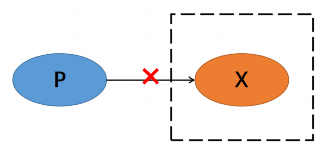

**解决办法：**生产者 P 投递消息到交换机 X 的过程中，交换机 X 会给生产者 P一个 ACK 确认回调，生产者可以根据收到 ACK 值知道是否投递成功。生产者可以根据这些通知采取相应的措施，如重试发送。

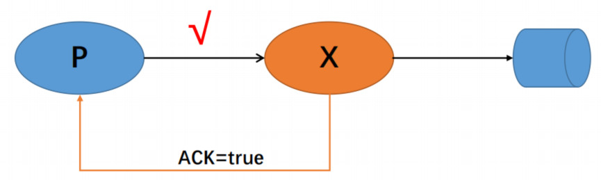

**具体实现办法：**通过 `RabbitTemplate` 的 `setConfirmCallback`

```java
rabbitTemplate.setConfirmCallback( ((correlationData, ack, cause) -> {
            String id = correlationData != null ?correlationData.getId():"";
            if(ack){
                log.info("交换机已经收到id:{}消息了",id);
            }else{
                log.info("交换机没有收到id:{}消息,原因是：{}",id,cause);
            }
        }));
```

## 回退机制

**问题：**当生产者 P 投递消息到交换机  的过程中，消息确定收到了，但是路由配置错误，或者没有绑定队列，此时又如何保证消息安全性?

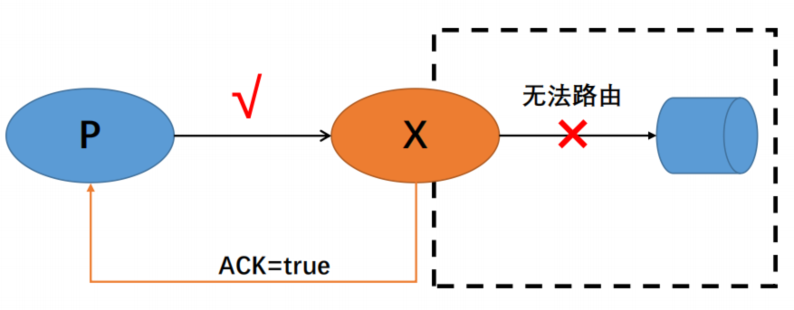

**解决办法：**仅仅开启确认机制无法保证消息安全性，可以通过回退机制，使得生产者能够收到通知并采取相应的措施。

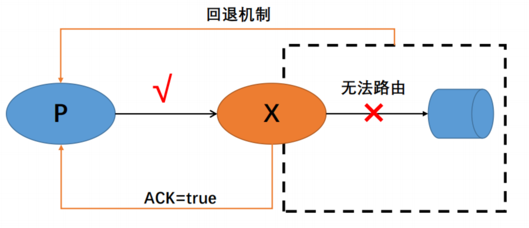

**具体实现办法：**通过 `RabbitTemplate` 的 `setReturnCallback` 方法来实现。当消息无法路由到任何队列时，RabbitMQ 会将消息返回给生产者。**生产者**可以通过设置回调函数来处理这些**未路由**的消息。

```java
rabbitTemplate.setReturnsCallback((returned -> {
            log.info("消息：{}被Return了, 原因：{}， 交换机:{}，路由键:{}",
                    new String(returned.getMessage().getBody()),
                    returned.getReplyText(),
                    returned.getExchange(),
                    returned.getRoutingKey());
        }));
```

## 备份交换机

**备份交换机概述**

备份交换机是一种特殊类型的交换机，它用于接收那些无法路由到任何队列的消息。当消息被发送到主交换机时，<u>如果没有任何队列匹配路由键</u>，消息将被转发到备份交换机。备份交换机可以是任何类型的交换机，例如直接交换机、主题交换机等。

> Note:
>
> 使用备份交换机后，回退机制会失效。

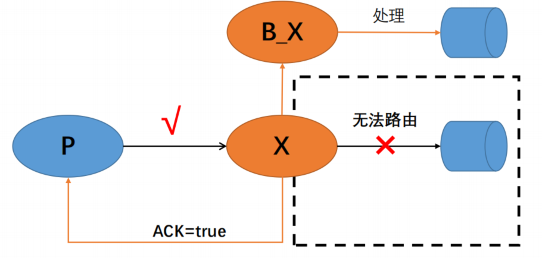

**具体实现办法：**配置一个带有备份交换机（Alternate Exchange）的确认交换机（Confirm Exchange）。这个配置确保当消息无法路由到任何队列时，消息会被发送到备份交换机而不是丢失。

```java
@Bean("confirmExchange")
public DirectExchange confirmExchange() {
    return ExchangeBuilder.
            directExchange(CONFIRM_EXCHANGE_NAME).
            durable(true).
            withArgument("alternate-exchange", BACK_EXCHANGE_NAME).
            build();
}
```

> `withArgument` 方法用于向交换机、队列或绑定添加额外的参数。这些参数可以用来配置各种高级功能，例如备份交换机、死信队列、TTL（Time-To-Live）等。
>
> 在这个例子中，`alternate-exchange` 参数的值被设置为 `BACK_EXCHANGE_NAME`，表示当消息无法路由到任何队列时，消息会被发送到名为 `BACK_EXCHANGE_NAME` 的备份交换机。

## 消费者确认机制

**问题**:如果消费者处理的过程中发生异常，导致消息丢失怎么办?

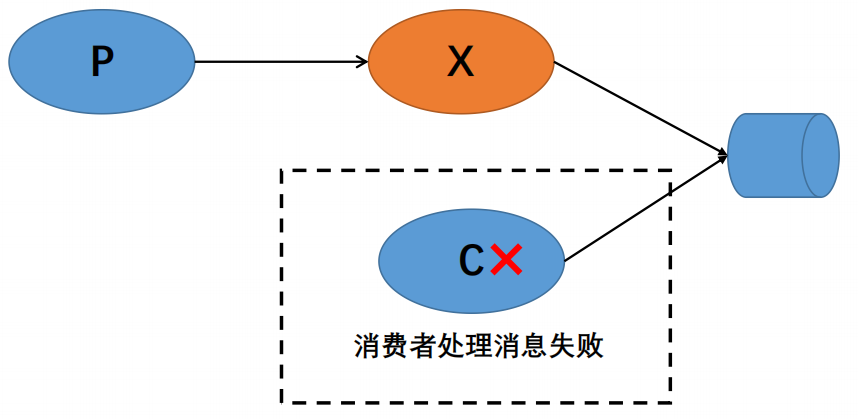

**解决办法**：

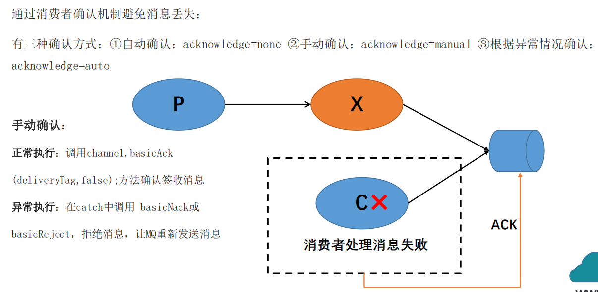

### `basicAck`

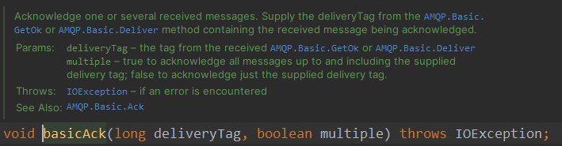

### `basicReject`

> 拒绝一条消息

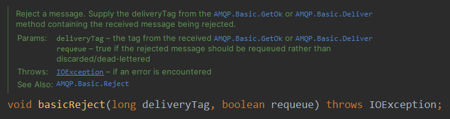

### `basicNack`

> 拒绝一条或多条消息

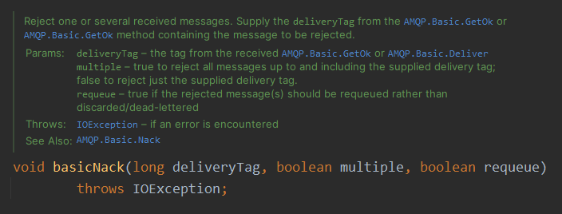

### `deliveryTag` 

1. **唯一标识消息**：每个消息在队列中都有一个唯一的 `deliveryTag`，确保消息可以被精确地识别和处理。
2. **消息确认**：消费者可以通过 `deliveryTag` 来确认消息已经成功处理，告诉 RabbitMQ 可以安全地删除该消息。
3. **消息拒绝**：消费者可以通过 `deliveryTag` 来拒绝消息，并指定是否重新入队。
4. **消息重试**：消费者可以通过 `deliveryTag` 来重新入队消息，以便其他消费者可以再次尝试处理。

**具体实现办法：**

```yml
spring:
  rabbitmq:
    host: 118.31.104.65
    port: 5672
    username: bwh
    password: 123456
    listener:
      simple:
        retry:
          enabled: true
        acknowledge-mode: manual #手动 ack
```

```java
@RabbitListener(queues = {"back-queue"})
public void receive(String body, Channel channel, Message message) throws IOException {
    try {
        log.info("收到队列信息" + body);
        //开始业务处理
        //            int ret = 1 / 0;
        //业务处理结束
        channel.basicAck(message.getMessageProperties().getDeliveryTag(), false);
    } catch (Exception e) {
        //表示消息是否重复处理
        if(message.getMessageProperties().getRedelivered()){
            //拒绝签收
            channel.basicReject(message.getMessageProperties().getDeliveryTag(),false);
        }else{
            //返回队列，重新发送
            channel.basicNack(message.getMessageProperties().getDeliveryTag(),false,true);
        }
    }
}
```


## `具体实现代码`

**1.配置application.yml**

```yml
spring:
  rabbitmq:
    host: 118.31.104.65
    port: 5672
    username: bwh
    password: 123456
```

**2.配置 RabbitMQ**

```java
@Configuration
@EnableRabbit
@Slf4j
public class RabbitMqConfig {

    public static final String CONFIRM_EXCHANGE_NAME = "confirm-exchange";
    public static final String BACK_EXCHANGE_NAME = "back-confirm-exchange";
    public static final String CONFIRM_QUEUE_NAME = "confirm-queue";
    public static final String BACK_QUEUE_NAME = "back-queue";

    @Value("${spring.rabbitmq.host}")
    private String host;
    @Value("${spring.rabbitmq.port}")
    private Integer port;
    @Value("${spring.rabbitmq.username}")
    private String username;
    @Value("${spring.rabbitmq.password}")
    private String password;

//    @Bean(name = "myRabbitTemplate")
//    public RabbitTemplate rabbitTemplate(AckCallBack ackCallBack, ReturnCallBack returnCallBack) {
//        RabbitTemplate template = new RabbitTemplate(cachingConnectionFactory());
//        template.setConfirmCallback(ackCallBack);
//        template.setMandatory(true);// 启用返回未路由消息的功能
//        template.setReturnsCallback(returnCallBack);
//        return template;
//    }
//
//
//    @Bean
//    public CachingConnectionFactory cachingConnectionFactory() {
//        //创建缓存连接工厂
//        CachingConnectionFactory factory = new CachingConnectionFactory();
//
//
//        factory.setHost(host);
//        factory.setPassword(password);
//        factory.setUsername(username);
//        factory.setPort(port);
//        factory.setPublisherConfirmType(CachingConnectionFactory.ConfirmType.CORRELATED);
//        return factory;
//    }
//
//    @Bean("confirmExchange")
//    public DirectExchange confirmExchange() {
//        return ExchangeBuilder.
//                directExchange(CONFIRM_EXCHANGE_NAME).
//                durable(true).
//                withArgument("alternate-exchange",BACK_EXCHANGE_NAME).
//                build();
//    }
//
//    @Bean("confirmQueue")
//    public Queue confirmQueue(){
//        return QueueBuilder.durable(CONFIRM_QUEUE_NAME).build();
//    }
//
//    @Bean
//    public Binding confirmBinding(){
//        return BindingBuilder.bind(confirmQueue()).to(confirmExchange()).with("ack");
//    }
//    //申明备份交换机
//    @Bean("backExchange")
//    public FanoutExchange backExchange() {
//        return new FanoutExchange(BACK_EXCHANGE_NAME);
//    }
//
//    //申明备份队列
//    @Bean("backQueue")
//    public Queue backQueue(){
//        return QueueBuilder.durable(BACK_QUEUE_NAME).build();
//    }
//    //绑定备份交换机和备份队列之间的关系
//    @Bean
//    public Binding backBinding(){
//        return BindingBuilder.bind(backQueue()).to(backExchange());
//    }


    /**
     * 注释掉的内容是返回机制和回退机制的代码，新代码是备份交换机
     */
    @Bean(name="myRabbitTemplate")
    public RabbitTemplate rabbitTemplate(){
        RabbitTemplate rabbitTemplate = new RabbitTemplate(cachingConnectionFactory());

        rabbitTemplate.setConfirmCallback( ((correlationData, ack, cause) -> {
            String id = correlationData != null ?correlationData.getId():"";
            if(ack){
                log.info("交换机已经收到id:{}消息了",id);
            }else{
                log.info("交换机没有收到id:{}消息,原因是：{}",id,cause);
            }
        }));

        rabbitTemplate.setMandatory(true);//启用返回未路由消息的功能

        rabbitTemplate.setReturnsCallback((returned -> {
            log.info("消息：{}被Return了, 原因：{}， 交换机:{}，路由键:{}",
                    new String(returned.getMessage().getBody()),
                    returned.getReplyText(),
                    returned.getExchange(),
                    returned.getRoutingKey());
        }));
        return rabbitTemplate;
    }

    @Bean
    public CachingConnectionFactory cachingConnectionFactory(){
        //创建缓存连接工厂
        CachingConnectionFactory factory = new CachingConnectionFactory();
        factory.setHost(host);
        factory.setPassword(password);
        factory.setUsername(username);
        factory.setPort(port);
        factory.setPublisherConfirmType(CachingConnectionFactory.ConfirmType.CORRELATED);
        return factory;
    }

    //确认交换机
    @Bean
    public DirectExchange confirmExchange(){
       return ExchangeBuilder.
               directExchange(CONFIRM_EXCHANGE_NAME).
               durable(true).
               build();
    }
    //确认队列
    @Bean
    public Queue confirmQueue(){

        return QueueBuilder.durable(CONFIRM_QUEUE_NAME).build();
    }
    //绑定交换机和队列之间的关系
    @Bean
    public Binding confirmBinding(){
        return BindingBuilder.bind(confirmQueue()).to(confirmExchange()).with("ack");
    }
}
```

# 死信队列

死信队列（Dead Letter Queue, DLQ）是消息队列系统中的一种特殊队列，用于存放那些无法被正常消费的消息。这些消息可能因为各种原因无法被处理，例如消息过期、消费者拒绝消息、达到最大重试次数等。通过配置死信队列，可以捕获这些消息并进行进一步的处理，从而避免消息丢失。

**死信队列**：Dead Letter Queue用来存放死信消息的队列

**死信交换机**：Dead Letter Exchange用来路由死信消息的交换机

## **常见的死信场景**

1. **消息过期**：消息在队列中的生存时间超过了预设的时间限制(TTL)。
2. **消息被拒绝**：消费者调用 `basicNack` 或 `basicReject` 方法拒绝消息，并且设置了 `requeue` 参数为 `false`。
3. **队列达到最大长度**：队列中的消息数量达到了预设的最大值

## **架构图**

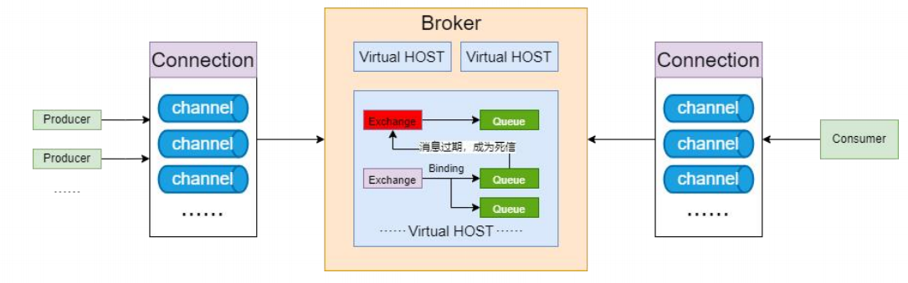

## TTL（生存时间）(⭐️)

> **TTL**概述：用来控制消息或者是队列的最大存活时间，单位是毫秒。
>
> **设置TTL两种方式：**
>
> 1. 给消息设置TTL：在发送消息时指定该消息的有效时间。
>
> 2. 给队列设置TTL：声明队列时指定该队列中所有消息的有效时间。
>
> **注意：**如果同时配置了队列的 TTL 和消息的 TTL，那么较小的那个值将会被使用。
>
> #### 区别总结
>
> 1. **作用对象不同**：
>    - **消息 TTL**：作用于单个消息，可以为每个消息设置不同的 TTL。
>    - **队列 TTL**：作用于整个队列，队列中的所有消息都遵循相同的 TTL。
> 2. **配置方式不同**：
>    - **消息 TTL**：在发送消息时通过 `MessagePostProcessor` 设置。
>    - **队列 TTL**：在声明队列时通过队列参数设置。
> 3. **灵活性不同**：
>    - **消息 TTL**：提供了更高的灵活性，可以根据具体业务需求为每个消息设置不同的 TTL。
>
> # 主要区别⭐️⭐️
>
> 1、**在普通队列中，`R**
>
>   假设你有一个队列 `my_queue`，其中包含以下消息：
>
> 1. 消息 A：永久消息（没有 TTL）
>
> 2. 消息 B：TTL 为 10 秒
>
>    消息 A、B  进入队列。
>
> 3. 只要，A没有被消费，B即使已经超过生存时间，也不会消失。
>
> 2、**队列设置过期是直接丢弃或丢到死信队列**

- ### 图形界面方式设置

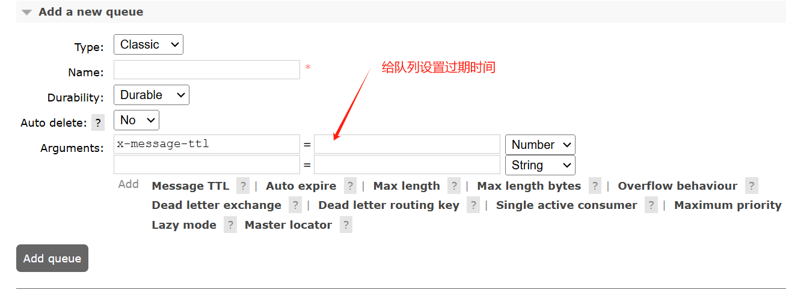

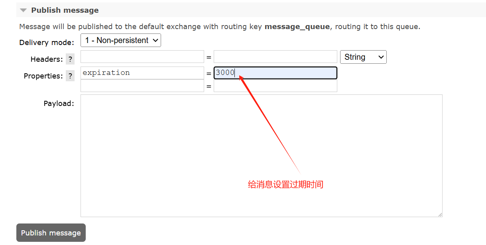

- ### 代码方式

  - **消息 TTL**

    ```java
    @Test
    void contextLoads() {
        CorrelationData data = new CorrelationData("1");//设置当前的数据id为1
        MessagePostProcessor processor = new MessagePostProcessor() {
            @Override
            public Message postProcessMessage(Message message) throws AmqpException {
                MessageProperties properties = message.getMessageProperties();
                properties.setExpiration("5000");
                return message;
            }
        };
        //        rabbitTemplate.convertAndSend("test-exchange","ack","你好",processor,data);
        rabbitTemplate.convertAndSend("test-exchange", "ack", "你好", processor,data);
    }
    ```

  - 队列TTL

    ```java
    @Bean("confirmQueue")
        public Queue confirmQueue(){
            Map<String, Object> map = new HashMap<>();
            // 指定死信交换机
    //        map.put("x-dead-letter-exchange",DEAD_EXCHANGE_NAME);
            //限制队列最大长度
    //        map.put("x-max-length",10);
            //设置队列的过期时间
            map.put("x-message-ttl",5000);
            return QueueBuilder.durable(TEST_QUEUE_NAME).withArguments(map).build();//设置过期队列
        }
    ```

    > ### Note:
    >
    > map的 key具体写什么，可以通过RabbitMQ图形化界面，增加队列中Argument进行查看。
    >
    > 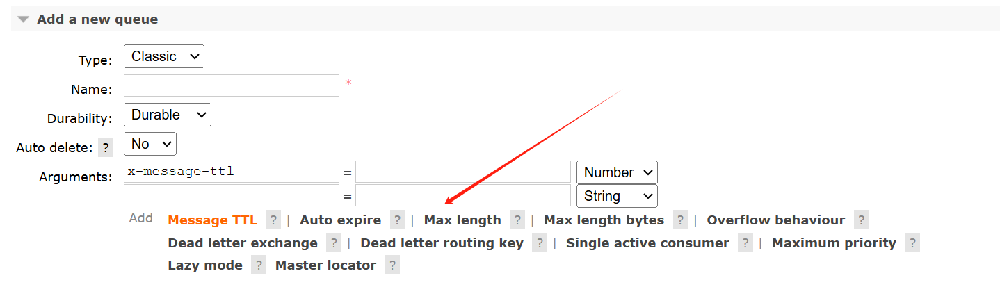

## 死信队列实现（⭐️）

1. #### 申明死信交换机

   ```java
   @Bean("deadExchange")
   public DirectExchange deadExchange() {
       return new DirectExchange(DEAD_EXCHANGE_NAME);
   }
   ```

2. #### 申明死信队列

   ```java
   @Bean("deadQueue")
   public Queue deadQueue(){
       return QueueBuilder.durable(DEAD_QUEUE_NAME).build();
   }
   ```

3. #### 绑定死信交换机和死信队列之间的关系

   ```java
   @Bean
   public Binding deadBinding(){
       return BindingBuilder.bind(deadQueue()).to(deadExchange()).with("ack");
   }
   ```

4. #### 将死信交换机绑定到需要处理死信的队列上，并设置路由指明将死亡消息发送到哪个死信队列

   ```java
   @Bean("confirmQueue")
   public Queue confirmQueue(){
   
       Map<String, Object> map = new HashMap<>();
       map.put("x-dead-letter-exchange",DEAD_EXCHANGE_NAME); // 设置死信交换机
   	map.put("x-dead-letter-routing-key", DEAD_LETTER_ROUTING_KEY); // 设置死信路由键，一个死信交换机可能存在多个死信队列，所以要指明。
       return QueueBuilder.durable(TEST_QUEUE_NAME).withArguments(map).build();
   }
   ```

## 总结

> - 死信交换机和死信队列和普通的没有区别
>
> - 当消息成为死信后，如果该队列绑定了死信交换机，则消息会被死信交换机重新路由到死信队列
>
> - 消息成为死信的三种情况：
>
>   • 消息在队列的存活时间超过设置的生存时间（TTL)时间
>
>   • 消息队列的消息数量已经超过最大队列长度
>
>   • 消息被否定确认，使用basicNack或basicReject并且requeue=false

# 延迟队列

消息进入队列后不会立即被消费，只有到达指定时间后，才会被消费，最重要的特征就是延迟上

## **使用场景**

1. **订单超时处理**：在电子商务系统中，可以设置一个延迟队列来处理订单的超时问题。如果用户在一定时间内没有完成支付，系统可以自动取消订单。
2. **任务重试**：在分布式系统中，某些任务可能由于临时性问题（如网络故障）而失败。可以将这些任务放入延迟队列，稍后再进行重试。
3. **定时通知**：发送定时通知或提醒，例如用户订阅的服务到期提醒。

## 实现方式

### TTL + 死信队列的方式

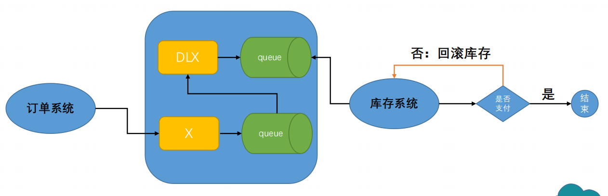

> **存在的问题**
>
> 消费不及时，不按时消费。
>
> 因为`RabbitMQ`是等消息到达队列顶部即将被消费时，才会判断其是否过期并删除或者移至死信队列。
>
> 最顶端的数据一直不过期，会导致后面的消息不能够进入死信。

### 通过延时Plugin

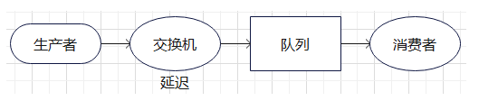

#### 安装

 **下载地址**： https://github.com/rabbitmq/rabbitmq-delayed-message-exchange/releases

**上传位置** 

```sh
cd /usr/lib/rabbitmq/lib/rabbitmq_server-3.8.34/plugins
```

**启用插件**

```sh
rabbitmq-plugins enable rabbitmq_delayed_message_exchange
```

安装插件后，交换机类型多出`x-delayed-message`

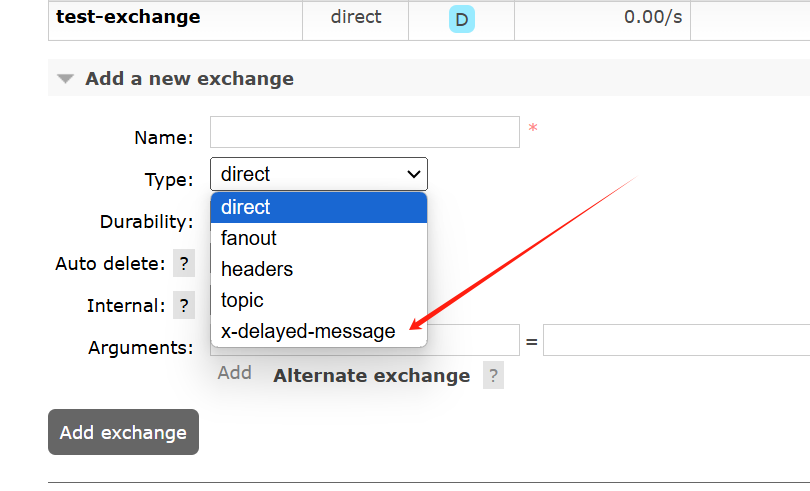

**重启服务** 

```sh
rabbitmqctl start
```

#### 1. 创建延迟交换机

```java
import org.springframework.amqp.core.*;
import org.springframework.context.annotation.Bean;
import org.springframework.context.annotation.Configuration;

@Configuration
public class RabbitConfig {

    public static final String DELAYED_EXCHANGE_NAME = "delayed_exchange";
    public static final String DELAYED_QUEUE_NAME = "delayed_queue";
    public static final String ROUTING_KEY = "delayed_routing_key";

    @Bean
    public CustomExchange delayedExchange() {
        Map<String, Object> arguments = new HashMap<>();
        arguments.put("x-delayed-type", "direct"); // 可以选择 direct, fanout, topic 等类型
        return new CustomExchange(DELAYED_EXCHANGE_NAME, "x-delayed-message", true, false, arguments);
    }

    @Bean
    public Queue delayedQueue() {
        return new Queue(DELAYED_QUEUE_NAME, true, false, false);
    }

    @Bean
    public Binding delayedBinding(Queue delayedQueue, CustomExchange delayedExchange) {
        return BindingBuilder.bind(delayedQueue).to(delayedExchange).with(ROUTING_KEY).noargs();
    }
}
```

#### 2. 发送延迟消息

```java
 @Test
    void plugsTest() {
        CorrelationData data = new CorrelationData("1");//设置当前的数据id为1
        MessagePostProcessor processor = new MessagePostProcessor() {
            @Override
            public Message postProcessMessage(Message message) throws AmqpException {
                MessageProperties properties = message.getMessageProperties();

                properties.setDelay(5000);
                
                return message;
            }
        };
        rabbitTemplate.convertAndSend("plugs-delayed-exchange","ack","1111111",processor,data);
    }
```

