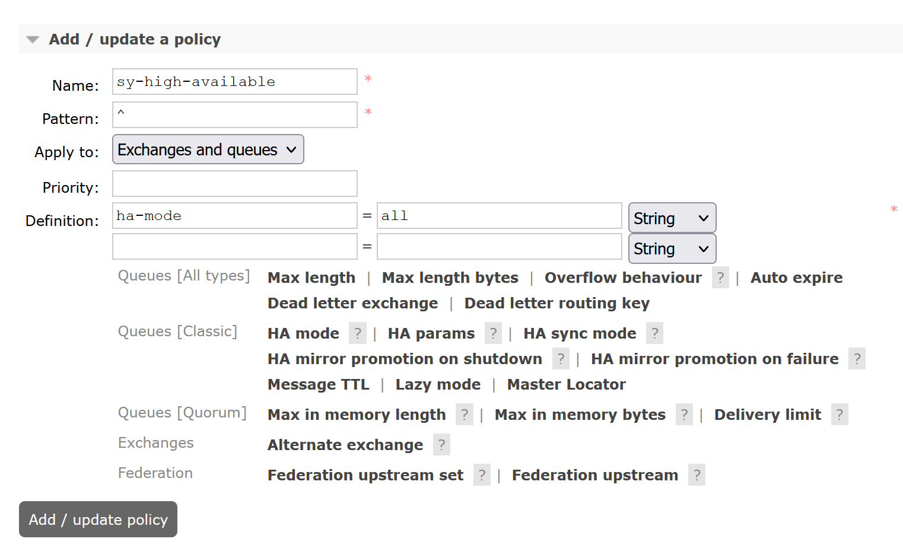

# RabbitMQ安装文档

官方文档：https://www.rabbitmq.com/clustering.html

## 1.停止服务

```shell
/bin/systemctl stop rabbitmq-server.service
```


## 2.分别启动节点

### 2.1启动节点1

```shell
RABBITMQ_NODE_PORT=5673 RABBITMQ_NODENAME=rabbit-1 rabbitmq-server start
```


### 2.2启动节点2

```shell
RABBITMQ_NODE_PORT=5674 RABBITMQ_SERVER_START_ARGS="-rabbitmq_management listener [{port,15674}]" RABBITMQ_NODENAME=rabbit-2 rabbitmq-server start
```

### 2.3开放端口

```shell
firewall-cmd --zone=public --add-port=15674/tcp --permanent
firewall-cmd --reload
```

## 3.设置主从节点

### 3.1设置节点1为主节点

- 停止节点1

  ```shell
  rabbitmqctl -n rabbit-1 stop_app
  ```

- 重置节点1

  ```shell
  rabbitmqctl -n rabbit-1 reset
  ```

- 启动节点1

  ```shell
  rabbitmqctl -n rabbit-1 start_app
  ```

  

### 3.2设置节点2为从节点

- 停止节点2

  ```shell
  rabbitmqctl -n rabbit-2 stop_app
  ```

- 重置节点2

  ```shell
  rabbitmqctl -n rabbit-2 reset
  ```

- 设置从节点2

  ```shell
  rabbitmqctl -n rabbit-2 join_cluster rabbit-1@'localhost'
  ```

- 启动节点2

  ```shell
  rabbitmqctl -n rabbit-2 start_app
  ```


### 3.3查看集群状态

```shell
rabbitmqctl cluster_status -n rabbit-1
```


## 4.添加用户

添加节点1的用户

- 添加用户

  ```shell
  rabbitmqctl -n rabbit-1 add_user sy1 123456
  ```

- 添加角色

  ```shell
  rabbitmqctl -n rabbit-1 set_user_tags sy1 administrator
  ```

- 添加权限

  ```shell
  rabbitmqctl -n rabbit-1 set_permissions -p "/" sy1 ".*" ".*" ".*"
  ```

添加节点2的用户

- 添加用户

  ```shell
  rabbitmqctl -n rabbit-2 add_user sy2 123456
  ```

- 添加角色

  ```shell
  rabbitmqctl -n rabbit-2 set_user_tags sy2 administrator
  ```

- 添加权限

  ```shell
  rabbitmqctl -n rabbit-2 set_permissions -p "/" sy2 ".*" ".*" ".*"
  ```


## 5.集群数据同步配置




## 6.HAProxy安装与使用

**HAProxy**是一个使用C语言编写的[自由及开放源代码软件](https://baike.baidu.com/item/自由及开放源代码软件?fromModule=lemma_inlink)[1]，其提供[高可用性](https://baike.baidu.com/item/高可用性/909038?fromModule=lemma_inlink)、[负载均衡](https://baike.baidu.com/item/负载均衡/932451?fromModule=lemma_inlink)，以及基于[TCP](https://baike.baidu.com/item/TCP?fromModule=lemma_inlink)和[HTTP](https://baike.baidu.com/item/HTTP?fromModule=lemma_inlink)的应用程序[代理](https://baike.baidu.com/item/代理/3242667?fromModule=lemma_inlink)。

下载地址：https://www.haproxy.org/download/

- ### 上传包做准备

  ```shell
  //下载依赖包
  yum install gcc wget
  //解压
  tar -zxvf haproxy-2.3.21.tar.gz -C /usr/local
  //进行编译、安装
  cd /usr/local/haproxy-2.3.21
  make TARGET=linux31 PREFIX=/usr/local/haproxy
  make install PREFIX=/usr/local/haproxy
  //赋权
  groupadd -r -g 149 haproxy
  useradd -g haproxy -r -s /sbin/nologin -u 149 haproxy
  ```

  

- 添加配置文件

  ```shell
  //创建haproxy配置文件
  mkdir /etc/haproxy
  vim /etc/haproxy/haproxy.cfg
  ```

- 启动 haproxy

  ```shell
  /usr/local/haproxy/sbin/haproxy -f /etc/haproxy/haproxy.cfg
  ```

- 查看监控页面

  ```shell
  http://192.168.222.135:8100/rabbitmq-stats
  ```

  
