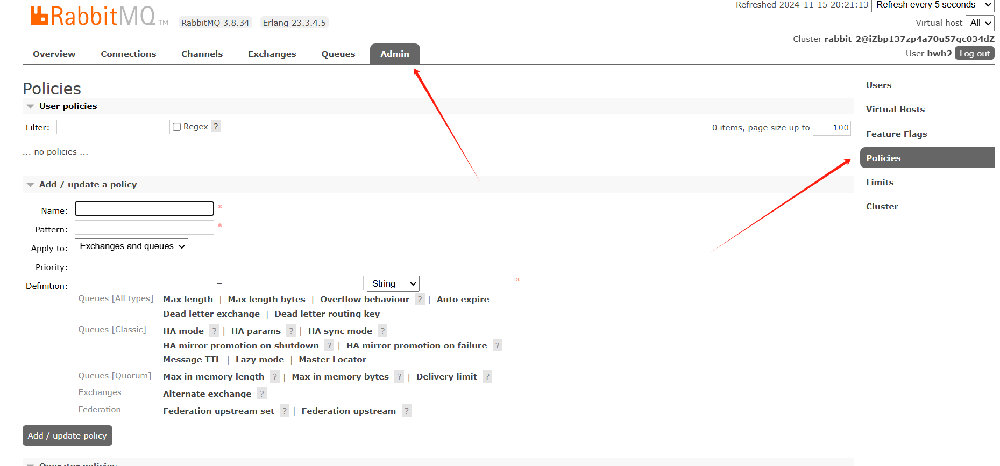
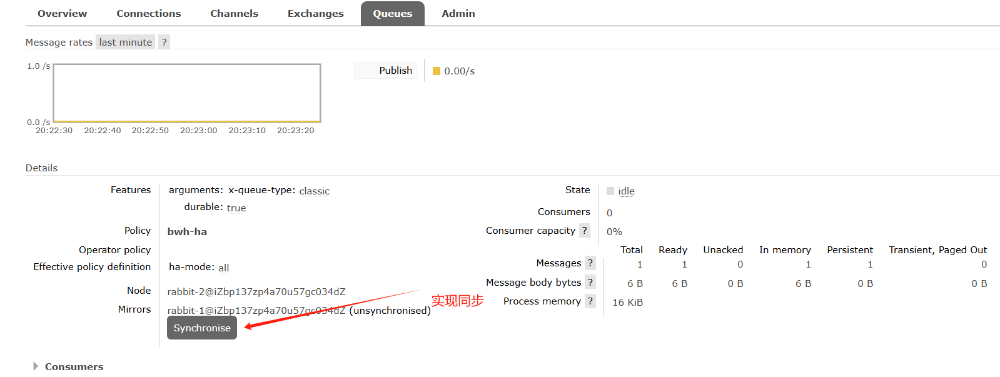
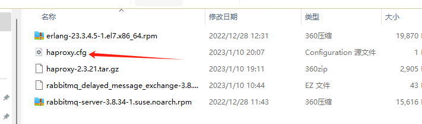
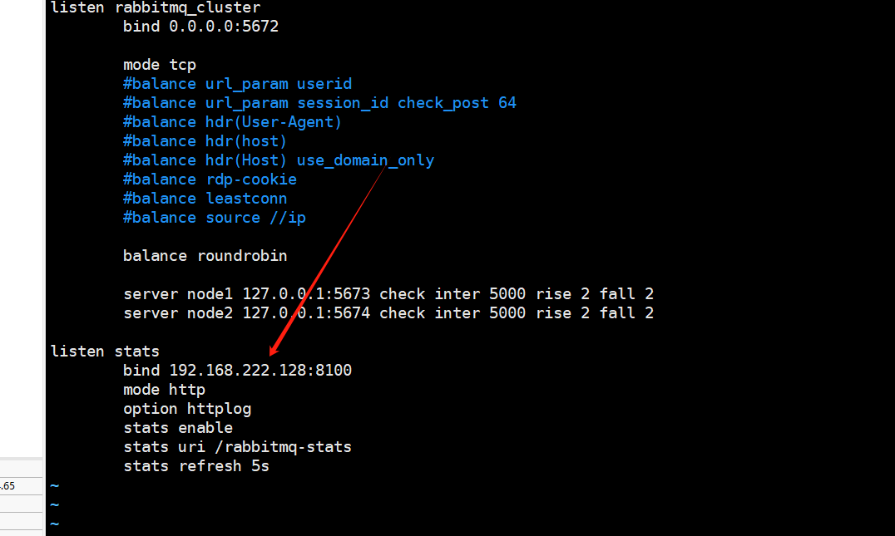

# RabbitMQ安装文档

官方文档：https://www.rabbitmq.com/clustering.html

## 1.停止服务

```shell
/bin/systemctl stop rabbitmq-server.service
```

> 额外添加：
>
> **获取所有 RabbitMQ 相关进程的 PID**：
>
> ```shell
> ps aux | grep rabbitmq | grep -v grep | awk '{print $2}'
> ```
>
> **强制终止这些进程**：
>
> ```shell
> pids=$(ps aux | grep rabbitmq | grep -v grep | awk '{print $2}')
> for pid in $pids; do
>     kill -9 $pid
> done
> ```

## 2.分别启动节点

### 2.1启动节点1

```shell
RABBITMQ_NODE_PORT=5673 RABBITMQ_NODENAME=rabbit-1 rabbitmq-server start
```

> #### 环境变量
>
> 1. `RABBITMQ_NODE_PORT=5673`
>    - 这个环境变量设置 RabbitMQ 节点使用的 AMQP 端口。默认情况下，RabbitMQ 使用端口 5672。通过设置 `RABBITMQ_NODE_PORT=5673`，您将 RabbitMQ 节点的 AMQP 端口更改为 5673。
> 2. `RABBITMQ_NODENAME=rabbit-1`
>    - 这个环境变量设置 RabbitMQ 节点的名称。节点名称用于在网络中唯一标识该节点。通过设置 `RABBITMQ_NODENAME=rabbit-1`，您将节点名称设置为 `rabbit-1`。
>
> #### 启动命令
>
> - `rabbitmq-server start`
>   - 这是启动 RabbitMQ 服务器的命令。它会启动一个 RabbitMQ 节点，并应用前面设置的环境变量。
>
> ### 整体效果
>
> 这条命令的整体效果是启动一个名为 `rabbit-1` 的 RabbitMQ 节点，并将其 AMQP 端口设置为 5673。

### 2.2启动节点2

先复制会话，在新会话中

```shell
RABBITMQ_NODE_PORT=5674 RABBITMQ_SERVER_START_ARGS="-rabbitmq_management listener [{port,15674}]" RABBITMQ_NODENAME=rabbit-2 rabbitmq-server start
```

> 1. **`RABBITMQ_SERVER_START_ARGS="-rabbitmq_management listener [{port,15674}]"`**:
>    - 这个环境变量设置 RabbitMQ 服务器启动时的额外参数。具体来说，`-rabbitmq_management listener [{port,15674}]` 配置了 RabbitMQ 管理插件的监听端口。通过设置这个参数，您将管理插件的监听端口更改为 15674。

### 2.3开放端口

```shell
firewall-cmd --zone=public --add-port=15674/tcp --permanent
firewall-cmd --reload
```

## 3.设置主从节点

### 3.1设置节点1为主节点

- 停止节点1

  ```shell
  rabbitmqctl -n rabbit-1 stop_app
  ```

- 重置节点1

  ```shell
  rabbitmqctl -n rabbit-1 reset
  ```

- 启动节点1

  ```shell
  rabbitmqctl -n rabbit-1 start_app
  ```

  

### 3.2设置节点2为从节点

- 停止节点2

  ```shell
  rabbitmqctl -n rabbit-2 stop_app
  ```

- 重置节点2

  ```shell
  rabbitmqctl -n rabbit-2 reset
  ```

- 设置从节点2

  ```shell
  rabbitmqctl -n rabbit-2 join_cluster rabbit-1@'localhost'
  rabbitmqctl -n rabbit-2 join_cluster rabbit-1@iZbp137zp4a70u57gc034dZ
  ```

  > Note:  rabbit-1@'localhost',是要根据自己电脑上的节点1

- 启动节点2

  ```shell
  rabbitmqctl -n rabbit-2 start_app
  ```


### 3.3查看集群状态

```shell
rabbitmqctl cluster_status -n rabbit-1
```


## 4.添加用户

添加节点1的用户

- 添加用户

  ```shell
  rabbitmqctl -n rabbit-1 add_user bwh1 123456
  ```

- 添加角色

  ```shell
  rabbitmqctl -n rabbit-1 set_user_tags bwh1 administrator
  ```

- 添加权限

  ```shell
  rabbitmqctl -n rabbit-1 set_permissions -p "/" bwh1 ".*" ".*" ".*"
  ```

添加节点2的用户

- 添加用户

  ```shell
  rabbitmqctl -n rabbit-2 add_user bwh2 123456
  ```

- 添加角色

  ```shell
  rabbitmqctl -n rabbit-2 set_user_tags bwh2 administrator
  ```

- 添加权限

  ```shell
  rabbitmqctl -n rabbit-2 set_permissions -p "/" bwh2 ".*" ".*" ".*"
  ```


## 5.集群数据同步配置






## 6.HAProxy安装与使用

**HAProxy**是一个使用C语言编写的[自由及开放源代码软件](https://baike.baidu.com/item/自由及开放源代码软件?fromModule=lemma_inlink)[1]，其提供[高可用性](https://baike.baidu.com/item/高可用性/909038?fromModule=lemma_inlink)、[负载均衡](https://baike.baidu.com/item/负载均衡/932451?fromModule=lemma_inlink)，以及基于[TCP](https://baike.baidu.com/item/TCP?fromModule=lemma_inlink)和[HTTP](https://baike.baidu.com/item/HTTP?fromModule=lemma_inlink)的应用程序[代理](https://baike.baidu.com/item/代理/3242667?fromModule=lemma_inlink)。

下载地址：https://www.haproxy.org/download/

- ### 上传包做准备

  ```shell
  //下载依赖包
  yum install gcc wget
  //解压
  tar -zxvf haproxy-2.3.21.tar.gz -C /usr/local
  //进行编译、安装
  cd /usr/local/haproxy-2.3.21
  make TARGET=linux31 PREFIX=/usr/local/haproxy
  make install PREFIX=/usr/local/haproxy
  //赋权
  groupadd -r -g 149 haproxy
  useradd -g haproxy -r -s /sbin/nologin -u 149 haproxy
  ```

  

- 添加配置文件

  ```shell
  //创建haproxy配置文件
  mkdir /etc/haproxy
  vim /etc/haproxy/haproxy.cfg
  ```

  > 或者直接用写好的
  >
  > ```shell
  > cd /etc/haproxy
  > 
  > rz 
  > ```
  >
  > 
  >
  > 注意⚠️：
  >
  > 修改`0.0.0.0`（表示所有可用的网络接口）或主机的实际 IP 地址。
  >
  > 用的阿里云服务那就改成 0.0.0.0
  >
  > 

- 启动 haproxy

  ```shell
  /usr/local/haproxy/sbin/haproxy -f /etc/haproxy/haproxy.cfg
  ```

- 查看监控页面

  > Note:
  >
  > 注意在阿里云开放 8100端口

  ```shell
  http://118.31.104.65:8100/rabbitmq-stats
  ```
  
  
