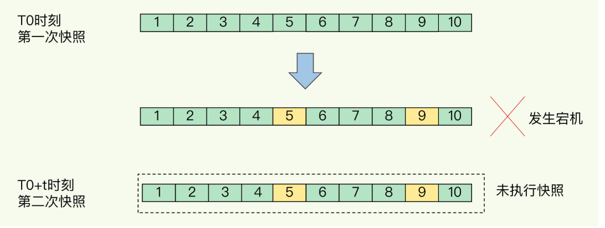
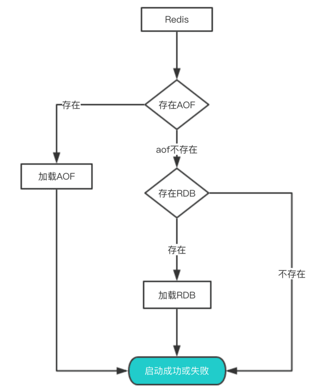
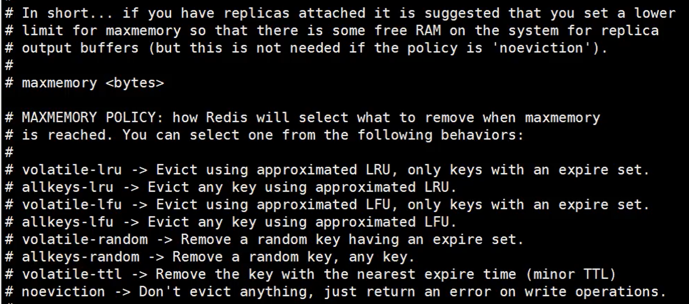
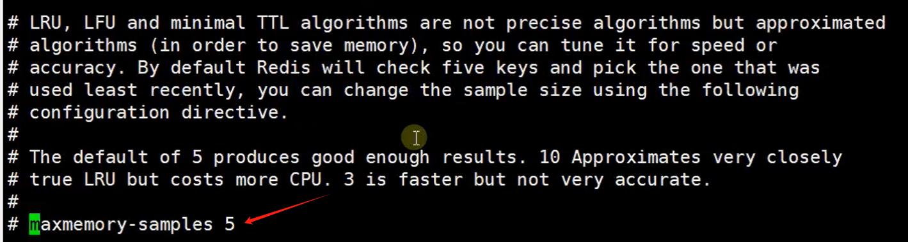

# 1.redis概述

## **1.1** 简介

- 数据库排名https://db-engines.com/en/ranking
- redis英文文档 https://redis.io/topics/data-types
- 笔记参考文章:https://www.pdai.tech/md/db/nosql-redis/db-redis-overview.html
- redis(Remote Dictionary Server) 一个开源的key-value存储系统
- 它支持存储的Value类型：包括String(字符串),list(链表),set(集合),zset(sorted set 有序集合),hash(哈希类型)。都支持push/pop、add/romove，获取交集、并集、差集等一些相关操作，操作是原子性的。
- redis支持各种不同方式的排序
- redis (与memcatched相同)数据存在内存中
- redis会周期性的把更新的数据写入磁盘，或者把修改的操作追加到记录文件
- redis支持集群，实现master-slave(主从)同步操作

## **1.2** 应用场景

- 缓存：配合关系型数据库做高速缓存
- 计数器：进行自增自减运算
- 时效性数据：利用expire过期，例如手机验证码功能
- 海量数据统计：利用位图，存储用户是否是会员、日活统计、文章已读统计、是否参加过某次活动
- 会话缓存：使用redis统一存储多台服务器用到的session信息
- 分布式队列/阻塞队列：通过List双向链表实现读取和阻塞队列
- 分布式锁: 使用redis自带setnx命令实现分布式锁
- 热点数据存储：最新文章、最新评论，可以使用redis的list存储，ltrim取出热点数据，删除旧数据
- 社交系统：通过Set功能实现，交集、并集实现获取共同好友，差集实现好友推荐，文章推荐
- 排行榜：利用sorted-set的有序性，实现排行榜功能，取top n
- 延迟队列：利用消费者和生产者模式实现延迟队列
- 去重复数据：利用Set集合，去除大量重复数据
- 发布/订阅消息：pub/sub模式

# 2.redis使用的基本命令

1. **默认16个数据库，类似数组下标从0开始，初始默认使用0号库。使用select 命令进行切换。**

   ```shell
   select < dbid>
   select 1
   ```

2. **通过key获取value**

   ```shell
   get <key>
   ```

3. **统一密码管理 ，所有库使用同样的密码**

3. **查看当前数据库的key的数量**

   ```shell
   dbsize
   ```

4.  **清空当前库**

   ```shell
   flushdb
   ```

5. **清空全部库**

   ```shell
   flushall 
   ```

6. **查看当前库所有key**

   ```shell
   keys *
   ```

7. **判断某个key是否存在**

   ```shell
   exists < key>
   ```

8.  **相看key的类型**

   ```shell
   type < key>
   ```

9.  **查看底层数据类型**

   ```shell
   object encoding < key>
   ```

10. **删除指定的key数据**

    ```shell
    del < key>
    ```

11. **根据选择非阻塞删除。仅将key从keyspace元数据中删除，真正的删除会在后续中做异步操作**

    ```shell
    unlink < key> 
    ```

12. **为给定的key设置过期时间，以秒为单位**

    ```shell
    expire < key>< seconds>：
    ```

13. **查看给定key的过期时间：-1表示永不过期 -2 表示已过期**

    ```shell
    ttl < key>：
    ```

# 3.<font color='#2980B9'>redis数据类型</font>

## 5种基础数据类型

### 1 Redis String字符串

#### 简介

- String类型在redis中最常见的一种类型
- string类型是二制安全的，可以存放字符串、数值、json、图像数据
- value存储最大数据量是512M

#### 常用命令

- **set** < key>< value>：添加键值对

  - nx：当数据库中key**不存在时**，可以将key-value添加到数据库

    ```shell
    set key value nx
    ```

  - xx: 当数据库key**存在时**，可以将key-value添加到数据库，与nx参数互斥

  - ex: 设置key-value添加到数据库，并设置key的超时时间(以秒钟为单位)

    ```shell
    set key value ex 10
    ```

  - px:设置key-value添加到数据库，并设置key的超时时间(以豪秒钟为单位)，与ex互斥

- **get** < key>查询对应键值

- **append** < key>< value>：将给定的值追加到key的末尾

- **strlen** < key>：获取值的长度

- **setnx** < key>< value>：只有在key不存在时，设置key-value加入到数据库

- **setex** < key> < timeout>< value>：添加键值对，同时设置过期时间(以秒为单位)

- **incr** < key>：将key中存储的数字加1处理，只能对数字值操作。如果是空，值为1

- **decr** < key>：将key中存储的数字减1处理，只能对数字值操作。如果是空，值为1

- **incrby** < key>< increment>：将key中存储的数字值增加指定步长的数值,如果是空，值为步长。(具有原子性)

  > `原子性`:
  >
  > 这意味着在执行命令时，Redis 会保证整个操作在一个步骤内完成，不会被其他命令中断。这种原子性确保了在高并发环境下，多个客户端同时对同一个键进行增量操作时，结果是正确且一致的。

- **decrby** < key>< decrement>: 将key中存储的数字值减少指定步长的数值,如果是空，值为步长。(具有原子性)

- **mset** < key1>< value1>[< key2>< value2>...]：同时设置1个或多个key-value值

- **mget** < key1>[< key2>...]：同时获取1个或多个value

- **msetnx** < key1>< value1>[< key2>< value2>...]：当所有给定的key都不存在时，同时设置1个或多个key-value值(具有原子性)

- **getrange** / **substr** < key>< start>< end> 将给定key，获取从start(包含)到end(包含)的值

  

- **setrange** < key>< offset>< value>：从偏移量offset开始，用value去覆盖key中存储的字符串值

- **getset**< key>< value>： 对给定的key设置新值，同时返回旧值。如果key不存在，则添加一个key-value值

#### 应用场景

- **单值缓存** 

  ```shell
  set key value get key 
  ```

- **对象缓存**

  ```shell
   set stu:001 value(json)
  
   mset stu:001:name zhangsan stu:001:age 18 stu:001:gender 男
  
   mget stu:001:name stu:001:age
  ```

- **分布式锁**（⭐️）

  ```shell
  setnx key:001 true //返回1代表加锁成功
  setnx key:001 true //返回0代表加锁失败
  //.....业务操作
  del key:001 //执行完业务释放锁
  
  
  set key:001 true ex 20 nx //防止程序意外终止导致死锁 ,可以在加锁时设置过期时间。
  ```

- **分布式系统全局序列号**

  ```shell
  incrby orderid 100 //批量生成序列号	
  ```

### 2 Redis List列表

#### 简介

- Redis列表是简单的字符串列表，单键多值。按照插入顺序排序。可以添加一个元素到列表的头部(左边)或者尾部(右边)
- 一个列表最多可以包含2^32-1个元素
- 底层是一个**双向链表**，对两端的操作性能很高，通过索引下标的操作中间的节点性能会较差

#### 常用命令

- **lpush** < key> < value1>[< value2>...]：从左侧插入一个或多个值

- **lpushx** < key> < value1>[< value2>...]：将一个或多个值插入到**已存在的列表**头部

- **lrange** < key>< start>< stop>：获取列表指定范围内的元素。

  0：左边第1位

  -1：右边第1 位

  0 ~-1：取出所有

  ```java
  lrange list start stop //  取出下标[start,stop]
  
  lrange list 0 -1  // 取出所有
  ```

- **rpush** < key> < value1>[< value2>...]：从右侧插入一个或多个值

- **rpushx** < key> < value1>[< value2>...]：将一个或多个值插入到已存在的列表尾部

- **lpop** < key>[count]：移除并获取列表中左边第1个元素，count表明获取的总数量,返回的为移除的元素

- **rpop** < key>[count]：移除并获取列表中右边第1个元素，count表明获取的总数量,返回的为移除的元素

- **rpoplpush** < source>< destination>：移除源列表的尾部的元素(右边第一个)，将该元素添加到目标列表的头部(左边第一个)，并返回

- **lindex** < key>< index>:通过索引获取列表中的元素

- **llen** < key>：获取列表长度

- **linsert** < key> before|after < pivot>< element>：在< pivot>基准元素前或者后面插入<element>，如果key不存在，返回0。如果< pivot>不存在，返回-1，如果操作成功，返回执行后的列表长度

- **lrem** < key>< count>< element>：根据count的值，移除列表中与参数相等的元素

  - **count**=0 移除表中所有与参数相等的值	
  - **count**>0 从表头开始向表尾搜索，移除与参数相等的元素，**数量为count**
  - **count**<0 从表尾开始向表头搜索，移除与参数相等的元素，数量为count的绝对值

- **lset** < key>< index> < element>：设置给定索引位置的值ltrim< key>< start> < stop>：对列表进行修剪，只保留给定区间的元素，不在指定区间的被删除

- **ltrim**< key>< start> < stop>：对列表进行修剪，只保留给定区间的元素，不在指定区间的被删除

- **brpop** < key> timeout：阻塞式移除指定key的元素，如果key中没有元素，就等待，直到有元素或超时，执行结束。

#### 应用场景

- 数据队列
  - 堆栈stack=lpush+lpop
  - 队列queue=lpush+rpop
  - 阻塞式消息队列 blocking mq=lpush+brpop
- 订阅号时间线
  - lrange key start stop

### 3 Redis Hash 哈希

#### 简介

- 是一个string类型的键和value（对象），特别适合于存储对象，类似于java里面学习的Map<String,Object>。

- 假设场景：需要在redis中存储学生对象,对象属性包括(id,name,gender,age)，有以下几种处理方式

  - 方式一：用key存储学生id，用value存储序列化之后用户对象(如果用户属性数据需要修改，操作较复杂，开销较大)

  - 方式二：用key存储学生id+属性名，用value存储属性值（用户id数据冗余）

  - 方式三：用key存储学生id，用value存储field+value的hash。通过key(学生d)+field(属性)可以操作对应数据。（哈希）

#### 常用命令

- **hset** < key>< field>< value>[< field>< value>...]：用于为哈希表中的字段赋值，如果字段在hash表中存在，则会被覆盖。

  ```shell
  hset stu:001 name bwh
  ```

- **hmset**:用法同hset，在redis4.0.0中被弃用

- **hsetnx** < key>< field>< value>：只有在字段不存在时，才设置哈希表字段中的值

- **hget** < key>< field> 返回哈希表中指定的字段的值

- **hmget** < key>< field>[< field>...]：获取哈希表中所有给定的字段值

- **hgetall** < key>：获取在哈希表中指定key的所有字段和值

- **hexists** < key>< field>：判断哈希表中指定的字段是否存在，存在返回1 ，否则返回0

- **hkeys** < key>：获取哈希表中所有的字段

- **hvals** < key>：获取哈希表中所有的值

- **hlen** < key>：获取哈希表中的field数量

- **hdel** < key>< field>[< field>...]：删除一个或多个哈希表字段

- **hincrby** < key>< field>< increment>：为哈希表key中指定的field字段的**整数**值加上增加increment

- **hincrbyfloat** < key>< field>< increment>：为哈希表key中指定的field字段的**浮点数**值加上增加increment

  > 如果< increment> 为负数，那就做减法。

#### 应用场景

1. 对象缓存 hset stu:001 name zhangsan age 20 gender man

2. 电商购物车操作

   - 以用户id作为key, 以商品id作为field，以商品数量作为value

   - 添加商品: 
     - hset user:001 s:001 1
   
     - hset user:001 s:002 2
   
   - 增/减商品数量:
     - hincrby user:001 s:001 3

   - 查看购物车商品总数: 
     - hlen user:001
   
   - 删除商品 : 
     - hdel user:001 s:001
   
   - 获取所有商品 :
     - hgetall user:001
   

### 4 Redis Set集合

#### 简介

set是string类型元素无序集合。对外提供的功能和list类似，是一个列表功能。集合成员是唯一的。

#### 常用命令

- **sadd** < key>< member>[< member>...]：将一个或多个成员元素加入到集合中，如果集合中已经包含成员元素，则被忽略
- **smembers** < key>：返回集合中的所有成员。
- **sismember** < key>< member>：判断给定的成员元素是否是集合中的成员，如果是返回1,否则返回0
- **scard** < key>：返回集合中元素个数
- **srem** < key>< member>[< member>...]：移除集合中一个或多个元素
- **spop** < key>[< count>]：移除并返回集合中的一个或count个随机元素
- **srandmember** < key>[< count>]：与spop相似，返回随机元素，不做移除
- **smove** < source> < destination> < member>：将member元素从source源移动到destination目标

- **sinter** < key>[< key>...]：返回给定集合的**交集**(共同包含)元素
- **sinterstore** < destination> < key1>[< key2>...]：返回给定所有集合的交集，并存储到destination目标中

- **sunion** < key>[< key>...]：返回给定集合的**并集**(所有)元素
- **sunionstore** < destination> < key1>[< key2>...]：返回给定所有集合的并集，并存储到destination目标中

- **sdiff** < key>[< key>...]：返回给定集合的**差集**(key1中不包含key2中的元素)
- **sdiffstore** < destination> < key1>[< key2>...]：返回给定所有集合的差集，并存储到destination目标中

#### 应用场景

- 抽奖

  - 参与抽奖：sadd cj001 user:13000000000 user:13455556666 user:13566667777

  - 查看所有参与用户： smembers cj001

  - 实现抽奖： spop cj001 3 / srandmember cj001 3 （注意区别）

- 朋友圈点赞 快手/抖音

  - 点赞 sadd like:friend001 user:001
  - sadd like:friend001 user:002取消点赞 srem like:friend001 user:001
  - 判断用户是否已点赞 sismember like:friend001 user:001

  - 显示点赞用户 smembers like:friend001

  - 获取点赞次数 scard like:friend001

- 关注模型： sinter交集 sunion并集 sdiff 差集
  - 微博 sadd g:list:u001 1001 sadd g:list:u002 1001 你们共同关注的 sinter交集
  - QQ 你们有共同好友 sinter交集
  - 快手 可能认识的人 sdiff差集

### 5 Redis zset有序集合

#### 简介

- 有序集合是string类型元素的集合，不允许重复出现成员
- 每个元素会关联一个double类型的分数，redis是通过分数为集合中的成员进行从小到大的排序
- 有序集合的成员是唯一的，但是分数可以重复
- 成员因为有序，可以根据分数或者次序来快速获取一个范围内的元素

#### 常用命令	

- **zadd** < key> < score>< member>[< score>< member>...]：将一个或多个元素及其分数加入到有序集合中

- **zrange** < key>< min>< max> [byscore|bylex] [rev] [ limit offset count] [withscores]：返回有序集合指定区间的成员，

  （byscore按分数区间，bylex按字典区间，rev 反向排序(分数大的写前边，小的写后边)，

  ​	limit分页(offset偏移量，count返回的总数)，withscores返回时带有对应的分数)

- **zrevrange** < key>< start>< stop>[ limit offset count]：返回集合反转后的成员

- **zrangebyscore** < key>< min>< max> [withscores] [ limit offset count]：参考zrange用法

- **zrevrangebyscore**< key>< max>< min> [withscores] [ limit offset count]：参考zrange用法

- **zrangebylex** < key>< min>< max>] [ limit offset count]：通过字典区间返回有序集合的成员

- **zrangebylex** k2 - +：减号最小值,加号最大值

- **zrangebylex** k2 [aa (ac：[ 中括号表示包含给定值，( 小括号表示不包含给定值 

- **zcard** < key>：获取集合中的成员数量

- **zincrby** < key> < increment>< member> ：为集合中指定成员分数加上增量increment

- **zrem** < key> < member>[< member>...]：移除集合的一个或多个成员

- **zcount** < key>< min>< max>：统计集合中指定区间分数(都包含)的成员数量

- **zrank** < key>< member>：获取集合中成员的索引位置

- **zscore** < key>< member>：获取集合中成员的分数值

#### 应用场景

1. 按时间先后顺序排序：朋友圈点赞 zadd 1656667779666

2. 热搜 微博 今日头条 快手 

3. 获取topN zrevrange k1 300 10 limit 0 10

## 3种特殊类型

## HyperLogLogs（基数统计）

> **什么是基数？**
>
> 举个例子，A = {1, 2, 3, 4, 5}， B = {3, 5, 6, 7, 9}；那么基数（不重复的元素）= 1, 2, 4, 6, 7, 9； （允许容错，即可以接受一定误差）

### Redis HyperLogLog 的特点

1. **高效率**：HyperLogLog 在 Redis 中的实现非常高效，可以在极小的内存开销下处理大量数据。
2. **低内存消耗**：一个 HyperLogLog 键大约只需要 12 KB 的内存，这使得它非常适合处理大规模数据集。
3. **近似结果**：HyperLogLog 提供的是一个近似值，其标准误差约为 0.81%。
4. **可并行化**：多个 HyperLogLog 键可以合并，从而支持分布式系统的基数计算。

### 常用命令

Redis 为 HyperLogLog 提供了几个基本的命令，用于插入元素、合并多个 HyperLogLog 键以及获取基数估计值。

1. **PFADD**：向 HyperLogLog 键中添加一个或多个元素。

   ```shell
   PFADD key element [element ...]
   ```

2. **PFCOUNT**：返回给定 HyperLogLog 键中不同元素的数量估计值。

   ```shell
   PFCOUNT key [key ...]
   ```

3. **PFMERGE**：将多个 HyperLogLog 键合并到一个新的 HyperLogLog 键中。

   ```shell
   PFMERGE destkey sourcekey [sourcekey ...]
   ```

### 示例

假设我们有一个应用，需要统计每天访问某个网站的独立访客数。我们可以使用 Redis 的 HyperLogLog 来实现这一功能。

1. **初始化 HyperLogLog 键**：

   ```shell
   # 创建一个名为 "visitors" 的 HyperLogLog 键
   PFADD visitors user1
   ```

2. **添加更多元素**：

   ```shell
   # 继续添加其他用户的访问记录
   PFADD visitors user2 user3 user4
   ```

3. **获取基数估计值**：

   ```shell
   # 获取 "visitors" 键中不同元素的数量估计值
   PFCOUNT visitors
   ```

4. **合并多个 HyperLogLog 键**：

   ```shell
   # 假设我们有多个 HyperLogLog 键，分别对应不同日期的访客记录
   PFMERGE all_visitors visitors_20231001 visitors_20231002 visitors_20231003
   ```

5. **查询合并后的基数**：

   ```shell
   # 查询合并后的 "all_visitors" 键中不同元素的数量估计值
   PFCOUNT all_visitors
   ```

### 注意事项

- **近似结果**：HyperLogLog 提供的是一个近似值，其标准误差约为 0.81%。对于大多数应用场景来说，这个误差是可以接受的。
- **内存消耗**：尽管 HyperLogLog 的内存开销非常小，但如果需要处理大量的 HyperLogLog 键，仍然需要注意总的内存使用情况。
- **数据持久化**：如果需要持久化 HyperLogLog 的数据，可以通过 Redis 的持久化机制（如 RDB 或 AOF）来实现。

## Bitmap （位存储）

> Bitmap 即位图数据结构，都是操作二进制位来进行记录，只有0 和 1 两个状态。

### 常用命令

- `SETBIT key offset value `    将位图中的某个位设置为 1 或 0。
  - `key`：位图的键名。
  - `offset`：位的索引。
  - `value`：要设置的值（0 或 1）。
- `GETBIT key offset `  获取位图中某个位的值。
  - `key`：位图的键名。
  - `offset`：位的索引。
- `BITCOUNT key [start end]` 统计位图中设置为 1 的位的数量
  - `key`：位图的键名。
  - `start` 和 `end`：可选参数，用于指定统计的范围。
- `BITOP operation destkey key [key ...]`   对多个位图进行位运算（AND、OR、XOR、NOT）。
  - `operation`：位运算类型（AND、OR、XOR、NOT）。
  - `destkey`：结果存储的键名。
  - `key`：参与运算的位图键名。

## <a id="geospatial">geospatial (地理位置)</a>

### 简介

基于位置信息服务(Location-Based Service,LBS)的应用。Redis3.2版本后增加了对GEO类型的支持。主要来维护元素的经纬度。redis基于这种类型，提供了经纬度设置、查询、范围查询、距离查询、经纬度hash等一些相关操作。

### GEO底层结构

> geo底层的实现原理实际上就是Zset, 我们可以通过Zset命令来操作geo。
>

### GEOHash编码

Geohash 是一种用于将地理位置（经纬度）编码为字符串的方法。这种编码方式不仅能够将**地理位置转换为短字符串，还可以通过字符串的前缀来近似表示地理位置的邻近性**。Geohash 编码在地理信息系统（GIS）、地图应用、位置服务等领域有广泛的应用。

#### Geohash 编码的基本原理

1. **经纬度范围**：

   - 经度范围：[-180, 180]
   - 纬度范围：[-90, 90]

2. **编码过程**：

   - 将经度和纬度分别划分为多个区间，每个区间用一个二进制位表示。

   - 将经度和纬度的二进制位交替组合，形成一个长的二进制字符串。

   - 将这个二进制字符串转换为 Base32 编码的字符串。

     > Base32 是一种二进制到文本的编码方法，用于将任意二进制数据转换成可打印的 ASCII 字符串。

#### 编码步骤

1. **初始化**：
   - 经度范围：[-180, 180]
   - 纬度范围：[-90, 90]

2. **划分区间**：
   - 每次迭代将当前范围划分为两个区间，并根据目标经纬度所在的区间更新范围。
   - 经度和纬度的划分交替进行。

3. **生成二进制位**：
   - 根据每次划分的结果生成一个二进制位（0 或 1）。
   - 经度和纬度的二进制位**交替组合**。

4. **转换为 Base32 字符串**：
   - 将生成的二进制字符串每5位一组转换为一个 Base32 字符。
   - Base32 字符集：`0123456789bcdefghjkmnpqrstuvwxyz`

#### 示例

假设我们要将经纬度 `(37.8199, -122.4783)` 编码为 Geohash：

1. **初始化范围**：
   - 经度：[-180, 180]
   - 纬度：[-90, 90]

2. **划分区间**：
   - 第一次划分：
     - 经度：[-180, 0) 和 [0, 180]
     - 目标经度 `-122.4783` 在 [-180, 0) 区间内，生成二进制位 `0`
     - 纬度：[-90, 0) 和 [0, 90]
     - 目标纬度 `37.8199` 在 [0, 90] 区间内，生成二进制位 `1`
   - 结果：`01`

3. **继续划分**：
   - 经度：[-180, 0) → [-180, -90) 和 [-90, 0)
     - 目标经度 `-122.4783` 在 [-180, -90) 区间内，生成二进制位 `0`
   - 纬度：[0, 90] → [0, 45) 和 [45, 90]
     - 目标纬度 `37.8199` 在 [0, 45) 区间内，生成二进制位 `0`
   - 结果：`0100`

4. **重复上述步骤**，直到生成足够长度的二进制字符串。

5. **转换为 Base32 字符串**：
   - 将二进制字符串每5位一组转换为一个 Base32 字符。
   - 例如，二进制字符串 `010011011000100101000010000101` 转换为 `wgs84g`

#### 解码过程

解码过程是编码过程的逆过程。通过将 Base32 字符串转换回二进制字符串，然后逐步恢复经纬度范围，最终得到原始的经纬度值。

#### 应用场景

1. **地图应用**：将地理位置编码为短字符串，便于存储和传输。
2. **位置搜索**：通过 Geohash 的前缀匹配，快速找到附近的地点。
3. **地理围栏**：定义地理区域的边界，用于触发特定事件。
4. **数据索引**：在数据库中使用 Geohash 作为索引，提高地理数据的查询性能。

#### 总结

Geohash 是一种高效的地理位置编码方法，通过将经纬度转换为短字符串，不仅节省了存储空间，还提供了方便的地理位置邻近性判断能力。在地理信息系统和位置服务中有着广泛的应用。

### GEO操作指令

#### 主要地理空间命令

1. **GEOADD**: 向有序集合中添加一个或多个地理位置（经度、纬度和名称）。

   ```shell
   GEOADD key longitude latitude member [longitude latitude member ...]
   ```

   示例：

   ```shell
   GEOADD cities 139.6917 35.6895 Tokyo 2.3522 48.8566 Paris
   ```

2. **GEOPOS**: 返回地理空间索引中一个或多个成员的坐标。

   ```shell
   GEOPOS key member [member ...]
   ```

   示例：

   ```shell
   GEOPOS cities Tokyo
   ```

3. **GEODIST**: 计算地理空间索引中两个成员之间的距离。

   ```shell
   GEODIST key member1 member2 [unit]
   ```

   单位可以是 `m`（米）、`km`（千米）、`mi`（英里）或 `ft`（英尺）。
   示例：

   ```shell
   GEODIST cities Tokyo Paris km
   ```

4. **GEORADIUS**: 返回地理空间索引中位于指定半径内的成员。

   ```shell
   GEORADIUS key longitude latitude radius m|km|ft|mi [WITHCOORD] [WITHDIST] [WITHHASH] [COUNT count] [ASC|DESC] [STORE key] [STOREDIST key]
   ```

   示例：

   ```shell
   GEORADIUS cities 139.6917 35.6895 100 km WITHDIST
   ```

5. **GEORADIUSBYMEMBER**: 类似于 `GEORADIUS`，但使用地理空间索引中已有的成员位置作为中心点。

   ```shell
   GEORADIUSBYMEMBER key member radius m|km|ft|mi [WITHCOORD] [WITHDIST] [WITHHASH] [COUNT count] [ASC|DESC] [STORE key] [STOREDIST key]
   ```

   示例：

   ```shell
   GEORADIUSBYMEMBER cities Tokyo 100 km WITHDIST
   ```

#### 示例用法

让我们通过一个简单的例子来说明如何使用这些命令。

1. **添加位置**：

   ```shell
   GEOADD cities 139.6917 35.6895 Tokyo 2.3522 48.8566 Paris 114.1772 22.3193 HongKong
   ```

2. **获取坐标**：

   ```shell
   GEOPOS cities Tokyo
   ```

3. **计算距离**：

   ```shell
   GEODIST cities Tokyo Paris km
   ```

4. **查找附近的位置**：

   ```shell
   GEORADIUS cities 139.6917 35.6895 100 km WITHDIST
   ```

5. **按成员查找附近的位置**：

   ```shell
   GEORADIUSBYMEMBER cities Tokyo 100 km WITHDIST
   ```

#### 应用场景

1. **基于位置的服务**：
   - 如拼车服务、食品配送和社交媒体等应用程序可以使用 Redis 的地理空间功能来查找附近的用户、餐厅或司机。

2. **地理围栏**：
   - 可以在特定区域创建虚拟边界，并在用户进入或离开这些区域时触发动作。

3. **实时追踪**：
   - 实时追踪资产、车辆或设备可以使用 Redis 的地理空间功能高效管理。

4. **路线优化**：
   - 地理空间数据可以用于优化配送服务、公共交通和物流的路线。

#### 性能考虑

- **内存使用**：Redis 中的地理空间数据存储在内存中，因此需要监控和管理内存使用，特别是对于大型数据集。
- **索引**：Redis 使用基于 geohash 的索引来高效存储和查询地理空间数据，这使得查找和半径查询非常快速。
- **扩展性**：对于非常大的数据集或高并发情况，可以考虑将数据分片到多个 Redis 实例或使用 Redis 集群

## Stream

> Redis5.0 中还增加了一个数据类型Stream，它借鉴了Kafka的设计，是一个新的强大的支持多播的可持久化的消息队列。

参考文章：https://www.pdai.tech/md/db/nosql-redis/db-redis-data-type-stream.html

# 4.Redis RDB&AOF

## 4.1Redis RDB

> RDB 就是 Redis DataBase 的缩写，中文名为快照/内存快照，RDB持久化是把当前进程数据生成快照保存到磁盘上的过程，由于是某一时刻的快照，那么快照中的值要早于或者等于内存中的值。

### 触发方式

> 触发rdb持久化的方式有2种，分别是**手动触发**和**自动触发**。

**手动触发**

- **save命令**：阻塞当前Redis服务器，直到RDB过程完成为止，对于内存 比较大的实例会造成长时间**阻塞**，线上环境不建议使用
- **bgsave命令**：Redis进程执行fork操作创建子进程，RDB持久化过程由子 进程负责，完成后自动结束。阻塞只发生在fork阶段，一般时间很短。

bgsave流程图如下所示


具体流程如下：

- redis客户端执行bgsave命令或者自动触发bgsave命令；
- 主进程判断当前是否已经存在正在执行的子进程，如果存在，那么主进程直接返回；
- 如果不存在正在执行的子进程，那么就fork一个新的子进程进行持久化数据，fork过程是阻塞的，fork操作完成后主进程即可执行其他操作；
- 子进程先将数据写入到临时的rdb文件中，待快照数据写入完成后再原子替换旧的rdb文件；
- 同时发送信号给主进程，通知主进程rdb持久化完成，主进程更新相关的统计信息（info Persitence下的rdb_*相关选项）。

**自动触发**

> 在以下4种情况时会自动触发

- redis.conf中配置`save m n`，即在m秒内有n次修改时，自动触发bgsave生成rdb文件；
- 主从复制时，从节点要从主节点进行全量复制时也会触发bgsave操作，生成当时的快照发送到从节点；
- 执行debug reload命令重新加载redis时也会触发bgsave操作；
- 默认情况下执行shutdown命令时，如果没有开启aof持久化，那么也会触发bgsave操作；

### **快照频率/快照周期**

通过redis.conf配置文件去做处理


- 如果3600秒内有1条Key信息发生变化，则进行快照；
- 如果300秒内有100条Key信息发生变化，则进行快照；
- 如果60秒内有10000条Key信息发生变化，则进行快照。

### RDB 更深入理解

> **问题一：**由于生产环境中我们为Redis开辟的内存区域都比较大（例如6GB），那么将内存中的数据同步到硬盘的过程可能就会持续比较长的时间，而实际情况是这段时间Redis服务一般都会收到数据写操作请求。那么如何保证数据一致性呢？

RDB中的核心思路是Copy-on-Write（<font color='#E74C3C'>写时复刻技术</font>），来保证在进行快照操作的这段时间，需要压缩写入磁盘上的数据在内存中不会发生变化。在正常的快照操作中，一方面Redis主进程会fork一个新的快照进程专门来做这个事情，这样保证了Redis服务不会停止对客户端包括写请求在内的任何响应。另一方面这段时间发生的数据变化会以副本的方式存放在另一个新的内存区域，待快照操作结束后才会同步到原来的内存区域。

举个例子：如果主线程对这些数据也都是读操作（例如图中的键值对 A），那么，主线程和 bgsave 子进程相互不影响。但是，如果主线程要修改一块数据（例如图中的键值对 C），那么，这块数据就会被复制一份，生成该数据的副本。然后，bgsave 子进程会把这个副本数据写入 RDB 文件，而在这个过程中，主线程仍然可以直接修改原来的数据。


> **问题二：在进行快照操作的这段时间，如果发生服务崩溃怎么办**？

很简单，在没有将数据全部写入到磁盘前，这次快照操作都不算成功。如果出现了服务崩溃的情况，将以上一次完整的RDB快照文件作为恢复内存数据的参考。也就是说，在快照操作过程中不能影响上一次的备份数据。Redis服务会在磁盘上创建一个临时文件进行数据操作，待操作成功后才会用这个临时文件替换掉上一次的备份。

> **问题三：可以每秒做一次快照吗**？

对于快照来说，所谓“连拍”就是指连续地做快照。这样一来，快照的间隔时间变得很短，即使某一时刻发生宕机了，因为上一时刻快照刚执行，丢失的数据也不会太多。但是，这其中的快照间隔时间就很关键了。

如下图所示，我们先在 T0 时刻做了一次快照，然后又在 T0+t 时刻做了一次快照，在这期间，数据块 5 和 9 被修改了。如果在 t 这段时间内，机器宕机了，那么，只能按照 T0 时刻的快照进行恢复。此时，数据块 5 和 9 的修改值因为没有快照记录，就无法恢复了。 　



所以，要想尽可能恢复数据，t 值就要尽可能小，t 越小，就越像“连拍”。那么，t 值可以小到什么程度呢，比如说是不是可以每秒做一次快照？毕竟，每次快照都是由 bgsave 子进程在后台执行，也不会阻塞主线程。

这种想法其实是错误的。虽然 bgsave 执行时不阻塞主线程，但是，**如果频繁地执行全量快照，也会带来两方面的开销**：

- 一方面，频繁将全量数据写入磁盘，会给磁盘带来很大压力，多个快照竞争有限的磁盘带宽，前一个快照还没有做完，后一个又开始做了，容易造成恶性循环。
- 另一方面，bgsave 子进程需要通过 fork 操作从主线程创建出来。虽然，子进程在创建后不会再阻塞主线程，但是，fork 这个创建过程本身会阻塞主线程，而且主线程的内存越大，阻塞时间越长。如果频繁 fork 出 bgsave 子进程，这就会频繁**阻塞主线程**了。

那么，有什么其他好方法吗？此时，我们可以做增量快照，就是指做了一次全量快照后，后续的快照只对修改的数据进行快照记录，这样可以避免每次全量快照的开销。这个比较好理解。

但是它需要我们使用额外的元数据信息去记录哪些数据被修改了，这会带来额外的**空间开销问题**。那么，还有什么方法既能利用 RDB 的快速恢复，又能以较小的开销做到尽量少丢数据呢？且看后文中4.0版本中引入的RDB和AOF的混合方式。

### RDB优缺点

- **优点**
  - RDB文件是某个时间节点的快照，默认使用LZF算法进行压缩，压缩后的文件体积远远小于内存大小，适用于备份、全量复制等场景；
  - Redis加载RDB文件恢复数据要远远快于AOF方式；
- **缺点**
  - RDB方式实时性不够，无法做到秒级的持久化；
  - 每次调用bgsave都需要fork子进程，fork子进程属于重量级操作，频繁执行成本较高；
  - RDB文件是二进制的，没有可读性，AOF文件在了解其结构的情况下可以手动修改或者补全；
  - 版本兼容RDB文件问题；

### 关于对redis执久化处理的建议

- 如果数据在服务器运行的时候，使用redis做缓冲，可以不使用任何持久化方式
- 数据不能丢失，rdb和aof混合使用是一个好的选择
- 如果数据不要求非常严格，要以允许分钟级别丢失，可以使用rdb
- 如果只使用AOF，建议配置策略是everysec，在可靠性和性能之间做了一个折中
- 如果磁盘允许，尽量避免AOF重写的频率,将默认值64M进行修改

## 4.2Redis AOF

> Redis是“写后”日志，Redis先执行命令，把数据写入内存，然后才记录日志。日志里记录的是Redis收到的每一条命令，这些命令是以文本形式保存。PS: 大多数的数据库采用的是写前日志（WAL），例如MySQL，通过写前日志和两阶段提交，实现数据和逻辑的一致性。
>
> - AOF以日志的形式来记录每个写操作(增量保存),将redis执行过的所有写指令全部记录下来(**读操作不记录**)。只许追加文件，但不可以改写文件。
> - **redis启动之初会读取该文件，进行重新构建数据。**

### AOF的配置

- AOF默认不开启,在conf配置文件中进行配置。

- 修改redis.conf配置文件

  ```shell
  cd /opt/tools/redis-6.2.6
  vim redis.conf
  ```

  ```shell
  appendonly no
  //修改
  appendonly yes
  ```

- 默认文件名是appendonly.aof

- 默认是启动后的相对路径，redis在哪里启动，appendonly.aof文件就在哪生成

### AOF日志是如何实现

- 数据库写前日志(Write Ahead Log ,WAL)，在实际写数据库前，先把修改的数据记录到日志文件中，以便发生故障时，时行恢复。

- AOF日志是**写后日志**。redis先去执行命令，把数据写入内存中，然后才去记录日志。

- AOF日志记录Redis的每个写命令，步骤分为：

  - 命令追加（append）、文件写入（write）和文件同步（sync）。
  - **命令追加** 当AOF持久化功能打开了，服务器在执行完一个写命令之后，会以协议格式将被执行的写命令追加到服务器的 aof_buf 缓冲区。
  - **文件写入和同步** 关于何时将 aof_buf 缓冲区的内容写入AOF文件中，Redis提供了三种[写回策略](#strategy)。

  

- **查看AOF文件**

  

### **<font color='#E74C3C'>为什么使用写后日志？</font>**

Redis要求高性能，采用写日志有两方面好处：

- redis为了避免检查开销，向AOF中记录日志，是不做检查的。如果写前执行，很有可能将错误指令记

   录到日志中，在使用redis恢复日志时，就可能会出现错误

- 不会阻塞当前的写操作

但这种方式存在潜在风险：

- 如果命令执行完成，写日志之前宕机了，会丢失数据。
- 主线程写磁盘压力大，导致写盘慢，阻塞后续操作。

### AOF潜在风险

1. **aof文件可能由于异常原因被损坏。**

   可以使用redis自带的命令redis-check-aof --fix appendonly.aof文件，修复成功，可以正确启动

   ```shell
   cd /usr/local/bin
   ```

   

   ```shell
   redis-check-aof --fix /opt/tools/redis-6.2.6/appendonly.aof
   ```

2. 由于刚刚执行一个指令，还没有写入日志，就宕机了。就会导致数据永久丢失(redis做为数据库存储的情况)

3. AOF避免了对**当前**指令的阻塞，但可能会由于磁盘写入压力较大，对**下一个**操作带来阻塞风险

### <a id = "strategy">AOF三种写回策略</a>

- **打开redis.conf配置文件 appendfsync选项**

  
  
  - always：同步写回:每个写指令执行完，立即同步将指令写入磁盘日志文件中
  - everysec：每秒写回：默认配置方式。每个写指令执行完，先把日志写到AOF文件的内存缓冲区。每隔一秒把缓冲区的内容写入磁盘
  - no：操作系统控制写回：每个写指令执行完，先把日志写到AOF文件的内存缓冲区，由操作系统决定何时把缓冲区的内容写入磁盘

  | **选项** | **写日志时机** | **优点**                 | **缺点**                          |
  | -------- | -------------- | ------------------------ | --------------------------------- |
  | always   | 同步写回       | 数据可靠性高，基本不丢失 | 对性能影响较大                    |
  | everysec | 每秒写回       | 性能适中                 | 当服务器宕机时，丢失上1秒内的数据 |
  | no       | 操作系统控制写 | 性能最高                 | 当服务器宕机时，丢失的数据较多    |

- **三种写回策略的优缺点**

  上面的三种写回策略体现了一个重要原则：**trade-off**，取舍，指在性能和可靠性保证之间做取舍。

  关于AOF的同步策略是涉及到操作系统的 write 函数和 fsync 函数的，在《Redis设计与实现》中是这样说明的：

  ```txt
  为了提高文件写入效率，在现代操作系统中，当用户调用write函数，将一些数据写入文件时，操作系统通常会将数据暂存到一个内存缓冲区里，当缓冲区的空间被填满或超过了指定时限后，才真正将缓冲区的数据写入到磁盘里。
  
  这样的操作虽然提高了效率，但也为数据写入带来了安全问题：如果计算机停机，内存缓冲区中的数据会丢失。为此，系统提供了fsync、fdatasync同步函数，可以强制操作系统立刻将缓冲区中的数据写入到硬盘里，从而确保写入数据的安全性。
  ```

  

### AOF重写机制

> AOF会记录每个写命令到AOF文件，随着时间越来越长，AOF文件会变得越来越大。如果不加以控制，会对Redis服务器，甚至对操作系统造成影响，而且AOF文件越大，数据恢复也越慢。为了解决AOF文件体积膨胀的问题，Redis提供AOF文件重写机制来对AOF文件进行“瘦身”。

#### AOF触发重写

- **手动触发**

​	可以使用bgrewriteaof命令手动触发 AOF 重写。

- **自动触发**


```shell
auto-aof-rewrite-percentage 100
auto-aof-rewrite-min-size 64mb
```

如果aof文件超过64m，且比上次重写后的大小增加了100%，自动触发重写。

例如 文件80m，开如重写，重写后降到50m，下一次，达到100m再开始重写。

#### AOF重写流程


- bgrewirteaof触发重写，判断是否当前有重写在运行，如果有，则等待重写结束后再执行
- 主进程fork出一个子进程，执行重写操作，保证主进程不阻塞，可以继续执行命令
- 子进程循环遍历reids内存中的所有数据和临时文件，客户端的写请求同时写入aof缓冲区和aof重写缓冲区。保证原AOF文件完整以及新的AOF文件生成期间的新的数据修改操作不会丢失
- 子进程写完新AOF文件以后，向主进程发送信号，主进程更新统计信息
- 主进程把aof重写缓冲区中的数据追加到新的AOF文件
- 用新AOF文件覆盖掉旧的AOF文件，完成AOF重写

## 4.3混合使用AOF和RDB

> Redis 4.0 中提出了一个**混合使用 AOF 日志和内存快照**的方法。简单来说，内存快照以一定的频率执行，在两次快照之间，使用 AOF 日志记录这期间的所有命令操作。

通过redis.conf配置文件

1. 打开aof

   ```shell
   appendonly yes
   ```

2. 打开混合配置

   ```shell
   aof-use-rdb-preamble yes
   ```

3. 混合过程

   这样一来，快照不用很频繁地执行，这就避免了频繁 fork 对主线程的影响。而且，AOF 日志也只用记录两次快照间的操作，也就是说，不需要记录所有操作了，因此，就不会出现文件过大的情况了，也可以避免重写开销。

   如下图所示，T1 和 T2 时刻的修改，用 AOF 日志记录，等到第二次做全量快照时，就可以清空 AOF 日志，因为此时的修改都已经记录到快照中了，恢复时就不再用日志了。

   

这个方法既能享受到 RDB 文件快速恢复的好处，又能享受到 AOF 只记录操作命令的简单优势, 实际环境中用的很多。

## 4.4从持久化中恢复数据

> 数据的备份、持久化做完了，我们如何从这些持久化文件中恢复数据呢？如果一台服务器上有既有RDB文件，又有AOF文件，该加载谁呢？



- redis重启时判断是否开启aof，如果开启了aof，那么就优先加载aof文件；
- 如果aof存在，那么就去加载aof文件，加载成功的话redis重启成功，如果aof文件加载失败，那么会打印日志表示启动失败，此时可以去修复aof文件后重新启动；
- 若aof文件不存在，那么redis就会转而去加载rdb文件，如果rdb文件不存在，redis直接启动成功；
- 如果rdb文件存在就会去加载rdb文件恢复数据，如加载失败则打印日志提示启动失败，如加载成功，那么redis重启成功，且使用rdb文件恢复数据；

那么为什么会优先加载AOF呢？因为AOF保存的数据更完整，通过上面的分析我们知道AOF基本上最多损失1s的数据。

# 5.主从复制

> 主从复制，是指将一台Redis服务器的数据，复制到其他的Redis服务器。前者称为主节点(master)，后者称为从节点(slave)；数据的复制是单向的，只能由主节点到从节点。

**主从复制的作用**主要包括：

- **数据冗余**：主从复制实现了数据的热备份，是持久化之外的一种数据冗余方式。
- **故障恢复**：当主节点出现问题时，可以由从节点提供服务，实现快速的故障恢复；实际上是一种服务的冗余。
- **负载均衡**：在主从复制的基础上，配合读写分离，可以由主节点提供写服务，由从节点提供读服务（即写Redis数据时应用连接主节点，读Redis数据时应用连接从节点），分担服务器负载；尤其是在写少读多的场景下，通过多个从节点分担读负载，可以大大提高Redis服务器的并发量。
- **高可用基石**：除了上述作用以外，主从复制还是哨兵和集群能够实施的基础，因此说主从复制是Redis高可用的基础。

主从库之间采用的是**读写分离**的方式。

- 读操作：主库、从库都可以接收；
- 写操作：首先到主库执行，然后，主库将写操作同步给从库。


## 主从复制原理

> 注意：在2.8版本之前只有全量复制，而2.8版本后有全量和增量复制：

- `全量（同步）复制`：比如第一次同步时
- `增量（同步）复制`：只会把主从库网络断连期间主库收到的命令，同步给从库

### 全量复制

> 当我们启动多个 Redis 实例的时候，它们相互之间就可以通过 replicaof命令形成主库和从库的关系，之后会按照三个阶段完成数据的第一次同步。

**全量复制的三个阶段**


**第一阶段是主从库间建立连接、协商同步的过程**，主要是为全量复制做准备。在这一步，从库和主库建立起连接，并告诉主库即将进行同步，主库确认回复后，主从库间就可以开始同步了。

具体来说，从库给主库发送 psync 命令，表示要进行数据同步，主库根据这个命令的参数来启动复制。psync 命令包含了主库的 runID 和复制进度 offset 两个参数。runID，是每个 Redis 实例启动时都会自动生成的一个随机 ID，用来唯一标记这个实例。当从库和主库第一次复制时，因为不知道主库的 runID，所以将 runID 设为“？”。offset，此时设为 -1，表示第一次复制。主库收到 psync 命令后，会用 FULLRESYNC 响应命令带上两个参数：主库 runID 和主库目前的复制进度 offset，返回给从库。从库收到响应后，会记录下这两个参数。这里有个地方需要注意，FULLRESYNC 响应表示第一次复制采用的全量复制，也就是说，主库会把当前所有的数据都复制给从库。

**第二阶段，主库将所有数据同步给从库**。从库收到数据后，在本地完成数据加载。这个过程依赖于内存快照生成的 RDB 文件。

具体来说，主库执行 bgsave 命令，生成 RDB 文件，接着将文件发给从库。从库接收到 RDB 文件后，会先清空当前数据库，然后加载 RDB 文件。这是因为从库在通过 replicaof 命令开始和主库同步前，可能保存了其他数据。为了避免之前数据的影响，从库需要先把当前数据库清空。在主库将数据同步给从库的过程中，主库不会被阻塞，仍然可以正常接收请求。否则，Redis 的服务就被中断了。但是，这些请求中的写操作并没有记录到刚刚生成的 RDB 文件中。为了保证主从库的数据一致性，主库会在内存中用专门的 replication buffer，记录 RDB 文件生成后收到的所有写操作。

**第三个阶段，主库会把第二阶段执行过程中新收到的写命令，再发送给从库**。具体的操作是，当主库完成 RDB 文件发送后，就会把此时 replication buffer 中的修改操作发给从库，从库再重新执行这些操作。这样一来，主从库就实现同步了。

### 增量复制

- **为什么会设计增量复制**？

  如果主从库在命令传播时出现了网络闪断，那么，从库就会和主库重新进行一次全量复制，开销非常大。从 Redis 2.8 开始，**网络断了之后**，主从库会采用增量复制的方式继续同步。

- **增量复制的流程**


`repl_backlog_buffer`：它是为了从库断开之后，如何找到主从差异数据而设计的`环形缓冲区`，从而避免全量复制带来的性能开销。如果从库断开时间太久，repl_backlog_buffer环形缓冲区被主库的写命令覆盖了，那么从库连上主库后只能乖乖地进行一次全量复制，所以**repl_backlog_buffer配置尽量大一些，可以降低主从断开后全量复制的概率**。而在repl_backlog_buffer中找主从差异的数据后，如何发给从库呢？这就用到了replication buffer。

`replication buffer`：Redis和客户端通信也好，和从库通信也好，Redis都需要给分配一个 内存buffer进行数据交互，客户端是一个client，从库也是一个client，我们每个client连上Redis后，Redis都会分配一个client buffer，所有数据交互都是通过这个buffer进行的：Redis先把数据写到这个buffer中，然后再把buffer中的数据发到client socket中再通过网络发送出去，这样就完成了数据交互。所以主从在增量同步时，从库作为一个client，也会分配一个buffer，只不过这个buffer专门用来传播用户的写命令到从库，保证主从数据一致，我们通常把它叫做replication buffer。

- **如果在网络断开期间，repl_backlog_size环形缓冲区写满之后，从库是会丢失掉那部分被覆盖掉的数据，还是直接进行全量复制呢**？

  对于这个问题来说，有两个关键点：

  1. 一个从库如果和主库断连时间过长，造成它在主库repl_backlog_buffer的slave_repl_offset位置上的数据已经被覆盖掉了，此时从库和主库间将进行全量复制。
  2. 每个从库会记录自己的slave_repl_offset，每个从库的复制进度也不一定相同。在和主库重连进行恢复时，从库会通过psync命令把自己记录的slave_repl_offset发给主库，主库会根据从库各自的复制进度，来决定这个从库可以进行增量复制，还是全量复制。

## 主从复制步骤演示

1. 创建一个目录 ,在root下创建一个myredis的目录

   ```shell
   mkdir myredis//创建目录
   cd myredis //进行目录
   cp /opt/tools/redis-6.2.6/redis.conf redis.conf //cp 源文件 目标文件
   ls
   ```

2. 关闭aof

3. 使用vi编辑三个conf文件，redis_6379.conf,redis_6380.conf,redis_6381.conf做为一主二从配置

   ```shell
   touch redis_6379.conf
   touch redis_6380.conf
   touch redis_6381.conf
   ```

   ```shell
   include redis.conf
   pidfile /var/run/reids_6379.pid
   port 6379
   dbfilename dump6379.rdb
   ```

   ```shell
   include redis.conf
   pidfile /var/run/reids_6380.pid
   port 6380
   dbfilename dump6380.rdb
   ```

   ```shell
   include redis.conf
   pidfile /var/run/reids_6381.pid
   port 6381
   dbfilename dump6381.rdb
   ```

4. 分别启动三个服务

   ```shell
   redis-server redis_6380.conf
   redis-server redis_6379.conf
   redis-server redis_6381.conf
   ps -ef|grep redis
   ```

5. 在三个客户端，模拟分别连接到不同服务器

   ```shell
   redis-cli -p 端口号
   redis-cli -p 6379
   redis-cli -p 6380
   redis-cli -p 6381
   ```

6. 查看服务器状态

   ```shell
   info replication
   ```

7. 在6380和6381上调用replicaof ，将其从属于6379

   ```shell
   replicaof 127.0.0.1 6379
   ```

   

   

8. 在主库上可以写入数据，从库不能写入数据

9. 主库和从库都可以读数据

## 服务器宕机演示

**从服务器宕机**

- 6381上调用shutdown
- 在主服务器上写入数据
- 6381重新连上时，仍然可以接收到主服务器的数据

**主服务器宕机**

- 6379服务器调用shutdown
- 在从服务器上仍然可以读取数据
- 从服务器显示主服务器的状态为down
- 当主服务器重新启动，从服务器显示主服务器的状态是up


## 主-从-从-模式

### 为什么要设计主-从-从-模式？

通过分析主从库间第一次数据同步的过程，你可以看到，一次全量复制中，对于主库来说，需要完成两个耗时的操作：**生成 RDB 文件和传输 RDB 文件**。

如果从库数量很多，而且都要和主库进行全量复制的话，就会导致主库忙于 fork 子进程生成 RDB 文件，进行数据全量复制。fork 这个操作会阻塞主线程处理正常请求，从而导致主库响应应用程序的请求速度变慢。此外，传输 RDB 文件也会占用主库的网络带宽，同样会给主库的资源使用带来压力。那么，有没有好的解决方法可以分担主库压力呢？

其实是有的，这就是“主 - 从 - 从”模式。

在刚才介绍的主从库模式中，所有的从库都是和主库连接，所有的全量复制也都是和主库进行的。现在，我们可以通过“主 - 从 - 从”模式**将主库生成 RDB 和传输 RDB 的压力，以级联的方式分散到从库上**。

简单来说，我们在部署主从集群的时候，可以手动选择一个从库（比如选择内存资源配置较高的从库），用于级联其他的从库。然后，我们可以再选择一些从库（例如三分之一的从库），在这些从库上执行如下命令，让它们和刚才所选的从库，建立起主从关系。


<font color='#E74C3C'>采用主-从-从模式，将主库生成和传输rdb文件的压力，以级联方式分散到从库上。	</font>


## 网络连接异常情况

- 在redis2.8之前，如果网络异常，再次连接后，需要做**全量复制**

- 从redis2.8之后，采用**增量复制方式**。repl_backlog_buffer缓冲区。当主从网络断开后，主库把收到写

  操作，写入replication buffer,同时，也写入到repl_backlog_buffer缓冲区。

  

  这个缓冲区，是一个环形缓冲区，主库会记录自己写到的位置，从库会记录自己读到的位置。

  

  repl_backlog_size参数

  缓冲空间大小=主库写入速度 * 操作大小-主从库网络传输速度 * 操作大小

  repl_backlog_size=缓冲空间大小*2

  2000 * 2-1000 * 2=2000 2M 4M

# 6.哨兵模式

> Redis 哨兵（Redis Sentinel）模式是 Redis 提供的一种高可用解决方案，用于监控 Redis 主从集群中的节点状态，并在主节点出现故障时自动进行故障转移。哨兵系统由一个或多个哨兵进程组成，这些进程负责定期检查主从节点的健康状况，以及协调主节点的自动故障转移过程。
>
> 当主库宕机，在从库中选择一个，切换为主库。
>
> 问题:
>
> 1、主库是否真正宕机?
>
> 2、哪一个从库可以作为主库使用?
>
> 3、如何实现将新的主库的信息通过给从库和客户端？

## 哨兵主要功能

- **监控（Monitoring）**：哨兵会不断地检查主节点和从节点是否运作正常。
- **自动故障转移（Automatic failover）**：当主节点不能正常工作时，哨兵会开始自动故障转移操作，它会将失效主节点的其中一个从节点升级为新的主节点，并让其他从节点改为复制新的主节点。
- **配置提供者（Configuration provider）**：客户端在初始化时，通过连接哨兵来获得当前Redis服务的主节点地址。
- **通知（Notification）**：哨兵可以将故障转移的结果发送给客户端。

其中，监控和自动故障转移功能，使得哨兵可以及时发现主节点故障并完成转移；而配置提供者和通知功能，则需要在与客户端的交互中才能体现

## 哨兵模式配置

1. 创建一个sentinel.conf文件，进行配置

   ```shell
   #端口号
   port 26379
   #sentinel monitor <自定义的reids主节点名称> <IP> <port> <quorum>
   sentinel monitor mymaster 127.0.0.1 6379 1  # 至少 1 个哨兵同意才能将节点标记为 OOD。
   #指定多少毫秒后，主节点没有应答哨兵，就认为下线了
   sentinel down-after-milliseconds mymaster 30000
   ```

2. 启动三个redis实例，配置成一主二从模式

3. 启动哨兵

   ```shell
   redis-sentinel sentinel.conf
   ```

4. 将主服务器宕机，观察哨兵监控信息变化

   将一个从库6380，切换成主库，将6381，切换成6380的从库

5. 将原来主库6379再次启动，6379切换成6380的从库

## 哨兵集群的组建

> 哨兵实例之间可以相互发现，要归功于 Redis 提供的 pub/sub 机制，也就是**发布 / 订阅机制**。

在主从集群中，主库上有一个名为`__sentinel__:hello`的频道，不同哨兵就是通过它来相互发现，实现互相通信的。在下图中，哨兵 1 把自己的 IP（172.16.19.3）和端口（26579）发布到`__sentinel__:hello`频道上，哨兵 2 和 3 订阅了该频道。那么此时，哨兵 2 和 3 就可以从这个频道直接获取哨兵 1 的 IP 地址和端口号。然后，哨兵 2、3 可以和哨兵 1 建立网络连接。


通过这个方式，哨兵 2 和 3 也可以建立网络连接，这样一来，哨兵集群就形成了。它们相互间可以通过网络连接进行通信，比如说对主库有没有下线这件事儿进行判断和协商。

## 哨兵监控Redis库

> 哨兵监控什么呢？怎么监控呢？

这是由哨兵向主库发送 **INFO** 命令来完成的。就像下图所示，哨兵 2 给主库发送 INFO 命令，主库接受到这个命令后，就会把从库列表返回给哨兵。接着，哨兵就可以根据从库列表中的连接信息，和每个从库建立连接，并在这个连接上持续地对从库进行监控。哨兵 1 和 3 可以通过相同的方法和从库建立连接。


## 主库下线的判定

> 哨兵如何判断主库已经下线了呢？

首先要理解两个概念：**主观下线**和**客观下线**

- **主观下线**：任何一个哨兵都是可以监控探测，并作出Redis节点下线的判断；
- **客观下线**：有哨兵集群共同决定Redis节点是否下线；

当某个哨兵（如下图中的哨兵2）判断主库“主观下线”后，就会给其他哨兵发送 `is-master-down-by-addr` 命令。接着，其他哨兵会根据自己和主库的连接情况，做出 Y 或 N 的响应，Y 相当于赞成票，N 相当于反对票。


如果赞成票数（这里是2）是大于等于哨兵配置文件中的 `quorum` 配置项（比如这里如果是quorum=2）, 则可以判定**主库客观下线**了

## 哨兵集群的选举（⭐️）

> 判断完主库下线后，由哪个哨兵节点来执行主从切换呢？这里就需要哨兵集群的选举机制了。

- **为什么必然会出现选举/共识机制**？

  为了避免哨兵的单点情况发生，所以需要一个哨兵的分布式集群。作为分布式集群，必然涉及共识问题（即选举问题）；同时故障的转移和通知都只需要一个主的哨兵节点就可以了。

- **哨兵的选举机制是什么样的**？

  哨兵的选举机制其实很简单，就是一个**Raft选举算法**： **选举的票数大于等于num(sentinels)/2+1时，将成为领导者，如果没有超过，继续选举**

- **任何一个想成为 Leader 的哨兵，要满足两个条件**
  - 第一，拿到半数以上的赞成票；
  - 第二，拿到的票数同时还需要大于等于哨兵配置文件中的 quorum 值。

以 3 个哨兵为例，假设此时的 quorum 设置为 2，那么，任何一个想成为 Leader 的哨兵只要拿到 2 张赞成票，就可以了。

> 更进一步理解
>
> 这里很多人会搞混 **判定客观下线** 和 **是否能够主从切换（用到选举机制）** 两个概念，我们再看一个例子。
>
> Redis 1主4从，5个哨兵，哨兵配置quorum为2，如果3个哨兵故障，当主库宕机时，哨兵能否判断主库“客观下线”？能否自动切换？

经过实际测试：

1、哨兵集群可以判定主库“主观下线”。由于quorum=2，所以当一个哨兵判断主库“主观下线”后，询问另外一个哨兵后也会得到同样的结果，2个哨兵都判定“主观下线”，达到了quorum的值，因此，**哨兵集群可以判定主库为“客观下线”**。

2、**但哨兵不能完成主从切换**。哨兵标记主库“客观下线后”，在选举“哨兵领导者”时，一个哨兵必须拿到超过多数的选票(5/2+1=3票)。但目前只有2个哨兵活着，无论怎么投票，一个哨兵最多只能拿到2票，永远无法达到`N/2+1`选票的结果。

## 新主库的选出

> 主库既然判定客观下线了，那么如何从剩余的从库中选择一个新的主库呢？

- 过滤掉不健康的（下线或断线），没有回复过哨兵ping响应的从节点
- 选择`salve-priority`从节点优先级最高（redis.conf）的
- 选择复制偏移量最大，只复制最完整的从节点


## 故障的转移

> 新的主库选择出来后，就可以开始进行故障的转移了。

假设根据我们一开始的图：（我们假设：判断主库客观下线了，同时选出`sentinel 3`是哨兵leader）


**故障转移流程如下**


- 将slave-1脱离原从节点（PS: 5.0 中应该是`replicaof no one`)，升级主节点，
- 将从节点slave-2指向新的主节点
- 通知客户端主节点已更换
- 将原主节点（oldMaster）变成从节点，指向新的主节点

**转移之后**


# 7.redis分片集群

## 简介

Redis 分片集群（Redis Cluster）是一种分布式存储解决方案，旨在通过水平扩展来提高 Redis 的容量和可用性。Redis 分片集群通过将数据分布在多个节点上来实现负载均衡和高可用性。

业务场景，需要存储50G的数据。对于内存和硬盘配置不足，选用两种方式

一种：纵向扩展：加内存，加硬盘，提高CPU。简单、直接。RDB存储效率要考虑。成本要考虑。

二种：横向（水平）扩展：加实例。

## 配置

步骤1：创建一个mycluster目录，复制redis.conf文件

```shell
mkdir mycluster
cp /opt/redis-6.2.6/redis.conf redis.conf
```

将后台启动打开

步骤2：创建一个redis6379.conf

````shell
include redis.conf
pidfile "/var/run/redis_6379.pid"
port 6379
dbfilename "dump6379.rdb"
#打开集群模式
cluster-enabled yes
#设定节点配置文件
cluster-config-file nodes-6379.conf
#设定节点失联时间，超过，会自动进行主从切换
cluster-node-timeout 15000
````

步骤3:根据6379的配置文件，再配置5个不同的端口

```shell
:%S/原内容/要替换的内容
:%s/6379/6380
```

步骤4:修改redis.conf配置文件，将bind ip地址加入

```shell
打开bind 127.0.0.1
加入 192.168.44.4
```

步骤5 启动六个服务，保证六个服务启动成功

步骤6 将六个服务合成一个集群

````shell
redis-cli --cluster create --cluster-replicas 1 192.168.44.4:6379
192.168.44.4:6380 192.168.44.4:6381 192.168.44.4:6579 192.168.44.4:6580
192.168.44.4:6581
````

输入yes去接受配置

## Hash Slot

### 简介

在使用redis cluster方案中，一个分片集群有**16384**个哈希槽。

根据键值对的key，按照CRC16算法计算一个16bit的值。再用这个值对16384取模运算，得到的数代表对应编号的hash slot

### 部署方案

- cluster create命令创建集群时，redis会自动把这些hash slot平均分布在集群实例上。如果集群中有N个实例(主库)，每个实例上分配到的hash slot就是16384/N

- 也可使用cluster addslos 手工分配哈希槽。

### 集群中的数据操作（⭐️）

步骤1：使用集群方式启动redis的命令行,加 -c参数

```shell
redis-cli -c -p 6379
```

步骤2：向redis中设置一个键值对，key会经过运算后，得到相应的hash slot进行存储

```shell
set k1 v1
set k2 v2
get k1
get k2
```

结果：


<font color='#C0392B'>步骤3：测试向集群中加入多个key-value，由于在不同的hash slot，此时会报错</font>

```shell
mset k3 v3 k4 v4 k5 v5
```

结果：发现无法插入


**要通过{}来定义组的概念，使用key中{｝内相同内容的键值对放在一个slot中**（⭐️）

```shell
mset name{user:001} zhangsan age{user:001} 18 gender{user:001} man
```

结果：


步骤4:获取key中的值

```shell
get k1
get name{user:001}
```

### 常用命令

- cluster nodes：显示集群节点的配置信息
- cluster keyslot < key>：获取key的哈希槽
- cluster countkeysinslot < slot>：返回当前哈希槽中key的数量(仅查询当前redis实例)
- cluster getkeysinslot < slot>< count>：返回当前槽中指定的count数量的key

### 故障演示

步骤1：将6379宕机，以集群方式登录6380

```shell
127.0.0.1:6379>shutdown
exit
redis-cli -c -p 6380
```

步骤2:使用cluster nodes查看节点状态，6379的从机6581变成了主机

步骤3: 把6379再次启动，启动后，6379变成了6581的从机


**如果有一段hash slot的主从节点都宕机，redis是否继续工作？**

通过下面配置，默认是yes，如果主从都挂掉，整个集群就都挂掉

如果是no，就表示该hash slot数据全部都不能使用，也无法存储

```shell
cluster-require-full-coverage yes
```

> #### 1. `cluster-require-full-coverage yes`
>
> - **行为**：当集群中任何一个哈希槽没有对应的主节点时，集群将停止接受写操作，并返回错误信息。这意味着集群要求所有哈希槽都必须有主节点覆盖，否则集群将进入只读模式或完全不可用状态。
> - **优点**：确保数据的完整性和一致性，避免在部分节点失效时写入数据导致的数据不一致。
> - **缺点**：在部分节点失效时，集群的服务可能会中断，影响系统的可用性
>
> #### 2. `cluster-require-full-coverage no`
>
> - **行为**：当集群中部分哈希槽没有对应的主节点时，集群仍然可以接受写操作，但这些写操作不会影响到没有主节点覆盖的哈希槽。也就是说，集群会继续提供部分服务，但无法访问或写入没有主节点覆盖的哈希槽。
> - **优点**：提高了集群的可用性，即使部分节点失效，集群仍然可以提供部分服务。
> - **缺点**：可能会导致数据不一致，因为部分哈希槽无法访问或写入。

# 8.亿级访问量数据处理

## 场景描述

- 手机APP用户登录信息，一天用户登录ID或设备ID
- 电商或者美团平台，一个商品对应的评论
- 文章对应的评论
- APP上有打卡信息
- 网站上访问量统计
- 统计新增用户第二天还留存
- 商品评论的排序
- 月活统计
- 统计独立访客(Unique Vistitor UV)量

## 集合的统计模式

四种统计模式：聚合统计、排序统计、二值状态统计、基数统计

## 聚合统计

**多个集合的交集、差集、并集**

set集合，来存储所有登录系统的用户 user:id

set集合，来存储当日新增用户信息 user:id :20211222

假设系统是2021年12月22日上线，统计当天用户

```shell
sadd user:id:20211222 1001 1002 1003 1004 1005
```

统计总用户量

> **sunionstore** < destination> < key1>[< key2>...]：返回给定所有集合的并集，并存储到destination目标中	

```shell
sunionstore user:id user:id user:id:20211222
```

第2天12月23日上线用户

> **sdiffstore** < destination> < key1>[< key2>...]：返回给定所有集合的差集，并存储到destination目标中

```shell
sadd user:id:20211223 1001 1003 1006 1007
```

统计当日新增用户

```shell
sdiffstore user:new user:id:20211223 user:id
```

统计第一天登录，第二天还在的用户

```shell
sinterstore user:save user:id:20211222 user:id:20211223
```

统计第一天登录，第二天流失的用户

```shell
sdiffstore user:rem user:id:20211222 user:id:20211223
```

## 排序统计

List、Set 、Hash 、ZSet四种集合中，List和Zset是属于有序的集合

一种使用List，通过lpush加入

一种使用Zset，按分数权重处理

## 二值状态统计

统计疫苗接种人数(没有接种0 接种1)、打卡(没有打卡0 打卡1)、签到。

例：统计一下，2022年1月份的一个上班打卡情况

```shell
setbit user:sign:202201 0 1
setbit user:sign:202201 2 1
setbit user:sign:202201 3 1
getbit user:sign:202201 0 //1
getbit user:sign:202201 1 //0
bitcount user:sign:202201
```


例：统计1亿个用户，10天签到情况

setbit user:sign:1222 0 1

..........

bitop and signmap user:sign:1222 user:sign:1223 user:sign:1224

## 基数统计

统计一个集合中不重复的元素个数，例如统计网页的UV

第一种，使用set或者hash来完成统计

```shell
sadd page1:uv u1001 u1002 u1003

scard page1:uv
```

存在的问题：如果数据量非常大，且页面多，访问人数非常多，造成内存紧张


第二种，Redis提供了**HyperLogLog**（hll）

HyperLogLog是用于统计基数的一种数据集合类型。

优点:  在于当集合元素非常多，使用hll所需要的空间是固定且很小，使用12kb内存，可以存储2^64个元素的基数。

缺点: 在于统计规则是基于概率完成的。会有0.81%左右的误差。如果统计1000万次，实际上可以是1100万 或900万人。

## 小结

| **数据类型** | **聚合统计**         | **排序统计** | **二值状态统计** | **基数统计**                                       |
| ------------ | -------------------- | ------------ | ---------------- | -------------------------------------------------- |
| set          | 支持差集、交集、并集 | 不支持       | 不支持           | 支持精确统计，数据量大时占用内存较大               |
| zset         | 支持差集、交集、并集 | 支持         | 不支持           | 支持精确统计，数据量大时占用内存较大               |
| hash         | 不支持               | 不支持       | 不支持           | 支持精确统计，数据量大时占用内存较大               |
| list         | 不支持               | 支持         | 不支持           | 不支持                                             |
| bitmap       | 与、或、异或运算     | 不支持       | 支持             | 支持精确统计，数据量大时占用内存较大               |
| hyperloglog  | 不支持               | 不支持       | 不支持           | 支持，采用概率算法，大数据量时，节省内存，但不精确 |

# 9.Geospatial

详情见上面笔记 [redis](#geospatial) 

> - 在markdown上阅读时：ctrl + 鼠标左键
> - git上阅读时：直接点击

# 10.redis事务操作

## 事务简介

### 1. 原子性（Atomicity）

**定义**： 原子性是指事务是一个不可分割的最小工作单位，事务中的所有操作要么全部完成，要么完全不执行。如果事务在执行过程中发生错误，整个事务将被回滚，所有已完成的操作都将被撤销。

**作用**：

- 确保事务的完整性。
- 防止部分操作导致的数据不一致。

**示例**： 假设一个银行转账事务包括两个操作：从账户A扣款100元和向账户B存款100元。如果在扣款成功后，存款操作失败，原子性确保整个事务被回滚，账户A的扣款也会被撤销。

### 2. 一致性（Consistency）

**定义**： 一致性是指事务执行前后，数据库的状态必须保持一致，即事务的执行不会破坏数据库的一致性约束。事务执行后，数据库必须处于一个有效的状态。

**作用**：

- 确保数据库的完整性。
- 防止非法数据的写入。

**示例**： 假设有一个订单系统，订单总金额必须等于所有商品价格的总和。事务在添加新商品时，必须同时更新订单总金额。如果事务只更新了商品价格但未更新订单总金额，一致性确保事务被回滚。

### 3. 隔离性（Isolation）

**定义**： 隔离性是指多个事务并发执行时，每个事务的执行互不干扰。一个事务的中间状态对其他事务是不可见的，事务的执行结果只有在事务提交后才对其他事务可见。

**作用**：

- 防止并发事务之间的相互干扰。
- 确保事务的独立性。

**示例**： 假设两个事务同时读取同一个账户的余额并进行操作。事务1读取余额1000元，扣款500元；事务2也读取余额1000元，扣款300元。如果没有隔离性，两个事务可能会同时扣款，导致账户余额变成200元而不是200元。隔离性确保事务1和事务2互不影响，最终账户余额应该是700元。

### 4. 持久性（Durability）

**定义**： 持久性是指一旦事务提交，事务对数据库的改变将永久保存，即使系统发生故障也不会丢失。

**作用**：

- 确保数据的持久性和可靠性。
- 防止数据丢失。

## Redis事务

Redis 事务允许你将多个命令打包在一起，作为一个整体来执行。事务在 Redis 中的主要特点是原子性和顺序执行。一旦事务开始，所有的命令都会被排队，然后按顺序执行。即使其中一个命令失败，也不会影响其他命令的执行。

### Redis 事务的基本命令

1. **MULTI**: 开始一个事务。

2. **EXEC**: 执行事务中的所有命令。

3. **DISCARD**: 取消事务，丢弃事务中所有已排队的命令。 

   > 与rollback不相同。

4. **WATCH**: 监视一个或多个键，如果这些键在事务执行前被修改，则事务会被取消。

### 事务的工作流程

1. **开始事务**：使用 `MULTI` 命令开始一个事务。
2. **排队命令**：在事务中使用任何 Redis 命令，这些命令会被排队而不是立即执行。
3. **执行事务**：使用 `EXEC` 命令执行所有排队的命令。
4. **取消事务**：使用 `DISCARD` 命令取消事务，丢弃所有已排队的命令。

### 示例

假设我们有一个简单的事务，包含几个命令：

1. **开始事务**：
   ```shell
   MULTI
   ```

2. **排队命令**：
   ```shell
   set k1 v1
   set k2 v2
   set k3 v3
   get k1
   ```

3. **执行事务**：
   ```shell
   EXEC
   ```

### 详细示例

```shell
# 开始事务
MULTI

# 排队命令
set k1 v1
set k2 v2
set k3 v3
get k1

# 执行事务
EXEC
```


### 使用 WATCH 命令

`WATCH` 命令用于监视一个或多个键。如果这些键在事务执行前被其他客户端修改，事务将被取消。

```shell
# 监视 key1
WATCH key1

# 检查 key1 是否被修改
GET key1

# 如果 key1 没有被修改，开始事务
MULTI

# 排队命令
SET key1 newvalue
INCR key2

# 执行事务
EXEC
```

### 注意事项

1. **事务的原子性**：事务中的所有命令要么全部执行，要么全部不执行。但是，如果某个命令在执行过程中出错，不会回滚已经成功执行的命令。
2. **错误处理**：如果事务中的某个命令出错，事务会继续执行后续的命令。错误信息会在 `EXEC` 命令的响应中返回。
3. **性能**：事务可以提高批量操作的性能，因为它减少了网络往返次数。

### 总结

Redis 的事务功能提供了一种简单而有效的方式来批量执行多个命令，确保这些命令按顺序执行且不会被其他客户端中断。通过使用 `MULTI`、`EXEC`、`DISCARD` 和 `WATCH` 命令，你可以灵活地管理和控制事务的行为。这对于需要保证一组命令原子性执行的场景非常有用。

## Redis的事务处理机制

### 原子性

**第一种情况**，在执行exec指令前，客户端发送操作命令有误,redis会报错并记录这个错误。此时，还可以继续发送命令操作，在执行exec命令之后，redis拒绝执行所有提交的指令，返回事务失败的结果。（保证了原子性）


**第二种情况**，向服务器发送指令，其中有指令和操作的数据类型不匹配，放入队列时并没有报错。使用

lpop指令操作失败，但get指令成功了。（不能保证原子性）


**第三种情况**，在执行事务的exec指令时，redis实例发生了故障,导致事务执行失败

如果redis开启了aof日志，可能会有一部分指令被记录到AOF日志中，需要使用redis-check-aof 去检查

aof文件，将未完成事务操作从aof清除，从而保证原子性

### 一致性

- 第一种情况，指令进入队列时就报错，整个事务全部被放弃执行，可以保证数据的一致性
- 第二种情况，进入队列时没有报错，实际执行时报错，有错误的指令不去执行，正确的指令可以正常执行，可以保证数据的一致性
- 第三种情况，exec指令时redis实例发生故障，根据RDB和AOF情况来做判断
  - 如果没有开启rdb和aof，数据在重启后没有，一致的
  - 如果使用了rdb方式，rdb不会在事务执行的时候去保存数据，数据库也是一致的
  - 使用aof日志，如果事务队列操作记录没有进入aof，可以保证一致性。如果已加入了一部分，使用redis-check-aof清除事务中已完成的操作，保证事务的一致性

### 隔离性

- 提交exec指令去执行事务，分成exec之前和exec之后两种情况

- 并发操作在exec指令前，要实现隔离性的保证 ，需要使用watch机制，否则不能保证隔离性

- 在事务执行前，相当于有一个监控器，在监控key是否已经被修改过了，如果已修改，则放弃事务执行，

  避免了事务的隔离性被破坏。如果客户再次执行，此时，没有其他客户端去修改数据，则执行成功。

悲观锁：synchronized

乐观锁：Atomic原子操作（mybatis-plus的版本号）


使用unwatch取消watch命令对所有key的监控。

### 持久性

- redis内存数据库，取决于持久化配置模式
- 不开启rdb和aof，只当作缓存使用，是不能保证持久性
- 使用rdb，如果在一个事务执行后，下一次的rdb快照还未执行前，redis实例发生故障了，不能保证持久性
- 使用aof， 配置选项 everysec、always、no，也不能保证持久性
- **不管redis采用什么配置模式，都不能保证事务的持久性**

# 11.redis缓存

## 简介

**穿透型缓存：**


缓存与后端数据交互在一起，对服务端的调用隐藏细节。如果从缓存中可以读到数据，就直接返回，如果读不到，就到数据库中去读取，从数据库中读到数据，也是先更新缓存，再返回给服务端。向数据库中写入数据，也是先写入缓存中，再同步给数据库。

**旁路型缓存：**


1. 服务先到缓存中读取数据，如果数据存在，就直接返回

2. 如果缓存中没有数据，就到数据库中去读取

3. 服务再将从数据库中读到的数据同步给缓存

**redis是旁路型缓存**

## 缓存的特征

缓存是提高应用程序性能的一种常见技术，通过将经常访问的数据存储在快速访问的存储介质中，减少对后端数据源的访问次数，从而降低延迟和提高吞吐量。缓存具有多个特征，这些特征决定了其在不同应用场景中的有效性和适用性。

### 1. **高速访问**
- **定义**：缓存通常存储在内存中，访问速度远远快于磁盘或其他持久化存储。
- **优点**：显著减少数据访问时间，提高应用程序的响应速度。
- **示例**：Redis、Memcached 等内存数据库。

### 2. **容量有限**
- **定义**：缓存的存储容量通常有限，无法存储所有数据。
- **管理**：需要使用缓存替换算法（如 LRU、LFU）来管理缓存中的数据。
- **示例**：LRU（Least Recently Used）算法会移除最近最少使用的数据。

### 3. **数据一致性**
- **定义**：缓存中的数据需要与后端数据源保持一致。
- **挑战**：在高并发环境下，保持数据一致性是一个复杂的问题。
- **解决方案**：使用缓存失效策略、写穿透、读穿透等技术。
- **示例**：写穿透（Write-Through）策略在写数据时同时更新缓存和后端数据源。

### 4. **缓存命中率**
- **定义**：缓存命中率是指从缓存中成功获取数据的请求占总请求数的比例。
- **重要性**：高命中率意味着更多的请求可以直接从缓存中获取数据，减少对后端数据源的压力。
- **优化**：通过调整缓存策略和算法来提高命中率。

### 5. **缓存失效**
- **定义**：缓存失效是指从缓存中删除数据，以确保数据的一致性。
- **类型**：
  - **定时失效**：设置数据的过期时间（TTL）。
  - **手动失效**：应用程序显式地删除缓存中的数据。
  - **自动失效**：使用缓存替换算法自动移除数据。
- **示例**：设置 TTL 为 1 小时，数据将在 1 小时后自动从缓存中删除。

### 6. **缓存预热**
- **定义**：缓存预热是指在应用程序启动时或特定时间点预先加载常用数据到缓存中。
- **优点**：减少初始访问的延迟，提高用户体验。
- **示例**：在应用程序启动时，从数据库中加载热门商品的数据到缓存中。

### 7. **分布式缓存**
- **定义**：分布式缓存允许多个节点共享缓存数据，适用于大规模分布式系统。
- **优点**：提高缓存的容量和可用性，支持水平扩展。
- **示例**：Redis Cluster、Apache Ignite 等分布式缓存系统。

### 8. **缓存分区**
- **定义**：缓存分区是指将缓存数据分散到多个缓存节点上，以提高性能和可靠性。
- **策略**：常见的分区策略包括一致性哈希（Consistent Hashing）。
- **示例**：使用一致性哈希算法将数据均匀分布到多个 Redis 节点上。

### 9. **缓存穿透**
- **定义**：缓存穿透是指查询一个不存在的数据，导致每次查询都穿透到后端数据源。
- **影响**：增加后端数据源的负担，可能导致性能下降。
- **解决方案**：使用布隆过滤器（Bloom Filter）或缓存空对象。
- **示例**：使用布隆过滤器预先检查数据是否存在，避免不必要的后端查询。

### 10. **缓存雪崩**
- **定义**：缓存雪崩是指大量缓存数据在同一时间失效，导致大量请求直接访问后端数据源。
- **影响**：可能导致后端数据源过载，甚至崩溃。
- **解决方案**：设置不同的缓存过期时间，避免集中失效；使用限流和降级策略。
- **示例**：为不同类型的缓存数据设置随机的过期时间。

### 11. **缓存击穿**
- **定义**：缓存击穿是指高并发请求同时访问一个即将失效的缓存数据，导致大量请求穿透到后端数据源。
- **影响**：可能导致后端数据源过载。
- **解决方案**：使用互斥锁（Mutex）或分布式锁确保只有一个请求去更新缓存。
- **示例**：使用 Redis 的 SETNX 命令加锁，确保只有一个请求更新缓存。

### 总结

缓存通过高速访问、数据一致性、缓存命中率等特征提高了应用程序的性能和响应速度。然而，缓存的设计和管理也需要考虑多种因素，如缓存失效、缓存穿透、缓存雪崩等问题，以确保系统的稳定性和可靠性。通过合理选择和配置缓存策略，可以充分发挥缓存的优势，提升系统的整体性能。

## redis缓存处理的两种情况

- **缓存命中**：redis中有相应的数据，直接从redis中读取，性能很高

- **缓存缺失**：redis中没有相应的数据，从后端关系型数据库中读取数据，性能很低。如果发生缓存缺失，为了后续程序请求中可以从缓存中读取数据，要将缺失的数据写入redis,也称作缓存更新。

  ```java
  String cache_key="user1001";
  String cache_value=redis.get(cache_key);//想要从缓存中读取数据
  if (cache_value!=null){
      //做相关业务逻辑
      }else{
      cache_value=mysql.getUserById(cache_key);//从关系型数据库中去读取数据
      redis.set(cache_key,cache_value);//缓存更新处理
  }
  ```

  redis不适用于无法获取源码的应用

## 缓存的类型

### 只读缓存

只用读取数据的缓存。如果有写入数据的请求，直接发到后端的mysql或oracle数据库，在数据库中完成增删除改。对于删除和修改的数据来说，redis中可能会有旧的数据，需要将旧的数据删除，下一次读取时，redis缓存缺失，那么就从数据库中读数据，并更新到redis缓存中。


- 适用于读操作远多于写操作的场景，如新闻网站、博客、缓存图片、视频、手机的通讯记录、银行的以往帐单等。

### 读写缓存

- 读写缓存，不只完成对数据读取任务，数据的增加、删除、修改操作，也是在redis缓存中完成，由于redis内存数据库效率很高，所以可以快速响应给服务端调用。

- redis内存数据，在redis实例出现问题时，导致数据丢失。

  ### 同步直写

  **定义**： 同步直写是一种缓存写入策略，其中数据在写入缓存的同时也写入后端数据源。这种策略确保了缓存和后端数据源的一致性。

  **优点**：

  - **数据一致性**：每次写操作都会同步更新缓存和后端数据源，确保数据的一致性。
  - **简单易用**：实现相对简单，不需要额外的同步机制。

  **缺点**：

  - **性能影响**：每次写操作都需要同步更新两个地方，可能会增加写操作的延迟。
  - **单点故障**：如果后端数据源写入失败，缓存中的数据也会不一致。

  ### 异步写回

  **定义**： 异步写回是一种缓存写入策略，其中数据首先写入缓存，然后异步地写入后端数据源。这种策略通过异步写操作来减少写入延迟，提高性能。

  **优点**：

  - **高性能**：写操作只更新缓存，减少了写入延迟。
  - **可扩展性**：异步写回可以更好地处理高并发写操作。

  **缺点**：

  - **数据一致性**：写操作和后端数据源的同步可能存在延迟，可能导致短暂的数据不一致。
  - **复杂性**：需要额外的机制来确保异步写操作的可靠性和一致性。

## 缓存数据的删除和替换

### 过期数据

可以使用ttl查看key的状态。已过期的数据，redis并未马上删除。优先去执行读写数据操作，删除操作延后执行。		

### 删除策略

redis中每一个value对应一个内存地址，在expires，一个内存地址，对应一个时间截，如果达到指定时间，就完成删除处理。


### 三种删除策略

- **定时删除**：创建一个定时器，当key设置过期时间已到达，删除key,同时expires中也删除。

  - 优点：节约内存
  - 缺点：对于cpu实时处理压力影响，对redis执行的效率有影响

- **惰性删除：**数据到达过期时间，先不做删除，直到下次访问该数据时，再做删除。（用空间换性能）

  - 执行流程：在get数据时，先执行redis中一个内部函数 expireIfNeeded()，如果没有过期，就返回，如果已过期，就删除，返回-2
  - 优点：节约CPU资源。
  - 缺点：内存占用过大。

- **定期删除**：

  redis启动服务时，读取server.hz的值，默认为10，可以通过info server指令查看。

  每秒钟执行server.hz次定时轮询，调用serverCron()函数，函数中又执行databasesCron()，对16个数据库（redis中有16个库）进行轮询，执行了activeExpireCycle()，检测其中元素的过期情况。每次轮询都执行250ms/server.hz时长。随机从对应的库中抽取20个(默认)key进行检测。

  如果key已过期，则删除key

  如果一轮中删除的key数量>20*25%，则再次循环刚才的过程淘汰策略。

  如果一轮中删除的key数量<=20*25%，则开始检查下一个库。

> redis中使用惰性删除和定期删除

## 逐出算法

通过 配置文件 maxmemory < bytes>来设置最大缓存容量。一般情况，建议设置为总数据的15%到30%，在实际生产环境下，可以设置50%。如果不设置，默认全部使用。




在redis默认情况下，不进行数据淘汰noevction,一旦缓存被写满了，再有写请求，redis直接返回错误。

**过期数据淘汰策略**，先限定了，数据都是在过期范围。

- valotile-ttl：在进行筛选时，根据过期时间先后顺序进行一个删除，越早过期的越先被删除
- valotile-random：在设置了过期时间的键值对中，进行随机删除
- valotile-lru：会使用LRU算法筛选设置了过期的键值对
- valotile-lfu：会使用LFU算法筛选设置了过期的键值对

**所有数据淘汰策略**：

- allkeys-random：从所有键值对中随机筛选并删除
- allkeys-lru：从所有键值对中采用LRU算法进行筛选删除
- allkeys-lfu：从所有键值对中采用LFU算法进行筛选删除

**LRU算法**

- 算法Least Recently Used，最近最少使用原则，最近不用的数据会被筛选出来，最近频繁使用的数据会保留

- lru算法，需要使用链表来管理所有缓存数据，带来内存开销。有数据被访问时，需要执行链表数据的移动，会降低redis性能。

- 记录数据最后一次访问的时间截，第一次会随机选出N个数据,作为一个候选集合，作一个排序，再把lru最小的数据进行淘汰

  N的配置

  maxmemory-samples 5

  

**LFU算法**

- 算法Least Frequently Used，最不常用原则。根据历史访问频率来淘汰数据。
- 每个数据块都有一个引用计数,按引用计数来排序。如果引用计数相同，按照时间排序
  - 新加入的数据放在队尾，引用计为1
  - 当数据被访问，引用计数增加，队列重排
  - 当需要淘汰数据时，将队列尾部的数据块删除

**逐出算法选择**

maxmemory-policy noeviction

优先使用allkeys-lru策略。

如果业务数据访问频率差别不大，可以建议使用allkeys-random。

首推的新闻、置顶视频，不设置过期时间，可以建议使得volatile-lru。

# 12.缓存异常

## 数据不一致

**一致性包括两种情况**

- 缓存中有数据，需要和数据库值相同
- 缓存中没有数据，数据库中的数据是最新值

如果不符合以上两种情况，则出现数据不一致的问题。

**读写缓存**

- 同步直写
- 异步写回

**只读缓存**

1. 新增数据

   数据直接写到数据库中，缓存不做操作。满足一致性两种情况的第2种。

2. 删改数据

   - **先删除缓存，后更新数据库。**可能会导致，缓存删除成功，数据库更新失败。业务逻辑去访问数据时，缓存中查不到数据，缓存缺失，到数据库中查询，所以只拿到旧的数据。
   - **先更新数据库，后删除缓存**。可能会导致，数据库更新成功，缓存删除失败。数据库中的数据是新的值，缓存中存储的是旧值。再读取时，先从缓存中读取，读取到了旧值。

**解决数据不一致的方案**

重试机制：把删除的缓存值或要更新数据库值先存储到消息队列中(kafka消息队列)。


**多线程访问的情况**

1. 先删除缓存，再更新数据库。

   假设T1线程先删除缓存，再执行更新数据库。还未更新成功时，T2线程进行读取，发现缓存中没有数据，到数据库中读取，会读取到旧的数据。如果T2还将旧数据更新到缓存中，那T1线程再进行读取，也读到的旧值。

   解决办法：**延迟双删**，让T1线程先执行休眠一段时间。T1线程在休眠时间，让T2线程执行结束，会将数据重新写入缓存。T1线

   程再做一次缓存删除操作。

   ```java
   redis.delCache() //第一次删除
       
   db.update()
       
   Thread.sleep(2000) // T1线程休眠，让T2线程执行完。
       
   redis.delCache()// 第二次删除
   ```

2. .**先更新数据库值，再去删除缓存**<font color='#C0392B'>(推荐)</font>

   假设T1线程先删除或更新数据库中的值，还没来得及删除缓存时，T2线程就开始读取数据。T2会先从缓存中读取，缓存命中，T2拿到的就是旧的数据。直到T1将缓存中数据删除，其他线程再次读取，可以拿到新值。（所以会出现小段数据不一致的情况）

| 并发操作 | 顺序                       | 可能出现的问题                               | 问题描述                                                     | 解决方案                   |
| -------- | -------------------------- | -------------------------------------------- | ------------------------------------------------------------ | -------------------------- |
| 没有     | 先删除缓存，后再更新数据库 | 缓存删除成功，数据库更新失败                 | 从数据库读到旧值                                             | 重试（消息队列）           |
| 有       | 先删除缓存，后再更新数据库 | 缓存删除，未更新数据库，其他线程并发访问     | 并发线程从数据库读到旧值，并更新了缓存，其他线程都从缓存中读到旧值 | 延迟双删                   |
| 没有     | 先更新数据库，后删除缓存   | 数据库更新成功，缓存删除失败                 | 从缓存中读到旧值                                             | 重试（消息队列）           |
| 有       | 先更新数据库，后删除缓存   | 数据库更新成功，未删除缓存，其他进程并发访问 | 并发线程从缓存中读到旧值                                     | 会有数据不一致情况短暂存在 |


## 缓存雪崩

大量的应用请求无法在redis中完成处理。缓存中读取不到数据，直接进入到数据库服务器。数据库压力激增，数据库崩溃，请求堆积在redis，导致redis服务器崩溃，导致redis集群崩溃，应用服务器崩溃，称为雪崩。

**原因1：**缓存中有大量数据同时过期

解决方案：

1. 页面静态化处理数据：对于不经常更换的数据，生成静态页

2. 避免大量数据同时过期:为商品过期时间追加一个随机数，在一个较小的范围内(1~3分钟)。

3. 构建多级缓存架构：redis缓存+nginx缓存+ehcache缓存

4. 延长或取消热度超高的数据过期时间

5. 服务降级

   不同的数据采取不同的处理方式。

**原因2：**redis实例故障

解决方案：

1. 服务熔断或限流处理

2. 提前预防

   灾难预警：监控redis服务器性能指标，包括数据库服务器性能指标，CPU、内存、平均响应时间、线程数等

3. 集群：有节点出一故障，主从切换。


## 缓存击穿

缓存击穿是指在一个高并发的系统中，某个热点数据在缓存中失效，大量请求同时访问该数据，导致数据库压力激增，甚至可能导致数据库崩溃。这种情况通常发生在缓存过期或被删除后，大量请求直接打到数据库上。

**解决方案：**

- 预先设定：电商双11,商铺设定几款是主打商品，延长过期时间
- 实时监控：监控访问量，避免访问量激增
- 定时任务：启动任务调度器，后台刷新数据有效期
- 分布式锁：可防止缓存击穿，但会有性能问题

## 缓存穿透

缓存穿透是指在缓存系统中，客户端请求一个不存在的数据，由于缓存中没有该数据，请求会直接穿透到数据库，导致数据库压力增大。这种情况不仅增加了数据库的负担，还可能导致系统性能下降。

**原因：**

1. 业务层误操作

2. <font color='#E74C3C'>恶意攻击</font>

**解决方案：**

1. 缓存空值或缺省值
   - 对于查询结果为空的数据，也缓存一个空值（如 `null`），并设置较短的过期时间。这样可以防止后续请求直接穿透到数据库。

2. 使用布隆过滤器，快速判断数据是否存在
   - 布隆过滤器是一个空间效率高的概率型数据结构，用于判断一个元素是否在一个集合中。虽然它可能会有误判（即假阳性），但不会产生假阴性。
3. 在请求入口前端进行请求检测
   - 在请求进入系统前，通过前端或网关层进行请求检测，过滤掉无效的请求。

4. 实时监控: 通过实时监控系统性能指标，及时发现和处理缓存穿透问题。
   - **监控缓存命中率**：定期检查缓存的命中率，如果命中率突然下降，可能意味着出现了缓存穿透。
   - **数据库负载监控**：监控数据库的负载情况，如果发现数据库负载异常增加，可能需要检查缓存策略。

5. key加密
   - 对缓存的Key进行加密，防止恶意用户通过构造特定的Key来攻击系统。


# 13.使用jedis操作

## 连接redis

**步骤1.**创建一个maven工程

```xml
<dependencies>
        <dependency>
            <groupId>org.projectlombok</groupId>
            <artifactId>lombok</artifactId>
            <version>1.18.22</version>
        </dependency>
        <dependency>
            <groupId>ch.qos.logback</groupId>
            <artifactId>logback-classic</artifactId>
            <version>1.2.7</version>
        </dependency>
        <dependency>
            <groupId>redis.clients</groupId>
            <artifactId>jedis</artifactId>
            <version>4.0.1</version>
        </dependency>
    </dependencies>
```

**步骤2.**配置logback用到的xml文件 logback.xml

```xml
<?xml version="1.0" encoding="UTF-8"?>
<configuration
        xmlns="http://ch.qos.logback/xml/ns/logback"
        xmlns:xsi="http://www.w3.org/2001/XMLSchema-instance"
        xsi:schemaLocation="http://ch.qos.logback/xml/ns/logback logback.xsd">

    <!-- 定义一个名为 STDOUT 的控制台输出器 -->
    <appender name="STDOUT" class="ch.qos.logback.core.ConsoleAppender">
        <encoder>
            <pattern>%date{HH:mm:ss.SSS} %c [%t] - %m%n</pattern>
        </encoder>
    </appender>

    <!-- 定义一个名为 c 的日志记录器，级别为 DEBUG，不继承父记录器的配置 -->
    <logger name="c" level="debug" additivity="false">
        <appender-ref ref="STDOUT"/>
    </logger>

    <!-- 定义根日志记录器，级别为 ERROR -->
    <root level="ERROR">
        <appender-ref ref="STDOUT"/>
    </root>
</configuration>
```

> 1. **Appender 定义**：
>
>    - `<appender name="STDOUT" class="ch.qos.logback.core.ConsoleAppender">`：定义了一个名为 `STDOUT` 的控制台输出器。
>
>    - `<encoder>`：定义了日志的输出格式。
>
>    - ```
>      <pattern>%date{HH:mm:ss.SSS} %c [%t] - %m%n</pattern>
>      ```
>
>      ：日志格式模板，其中：
>
>      - `%date{HH:mm:ss.SSS}`：日期和时间，格式为小时:分钟:秒.毫秒。
>      - `%c`：日志记录器的名称。
>      - `[%t]`：线程名。
>      - `- %m%n`：日志消息，换行符。
>
> 2. **Logger 定义**：
>
>    - `<logger name="c" level="debug" additivity="false">`：定义了一个名为 `c` 的日志记录器，级别为 `DEBUG`，并且不继承父记录器的配置。
>    - `<appender-ref ref="STDOUT"/>`：引用了上面定义的 `STDOUT` 控制台输出器。
>
> 3. **Root Logger 定义**：
>
>    - `<root level="ERROR">`：定义了根日志记录器，级别为 `ERROR`。
>    - `<appender-ref ref="STDOUT"/>`：引用了上面定义的 `STDOUT` 控制台输出器。

**步骤3：**修改redis.conf的配置文件 ，注释掉bind，开放所有的网路

> 如果你不设置 `bind` 参数，Redis 默认会监听所有可用的网络接口上的 IP 地址。这通常不推荐，因为它会暴露 Redis 服务器给所有网络接口，增加安全风险。


**步骤4：**修改redis.conf的配置文件，将文件保护模式修改，原有默认值是yes，改成no


**步骤5：**开放防火墙

```shell
firewall-cmd --zone=public --add-port=6379/tcp --permanent
firewall-cmd --reload
```

**步骤7：**测试连接

```java
package cn.bwhcoder;

import lombok.extern.slf4j.Slf4j;
import redis.clients.jedis.Jedis;

@Slf4j(topic = "c.TestConnection")
public class TestConnection {
    public static void main(String[] args) {
        Jedis jedis = new Jedis("118.31.104.65", 6379);
        String ping = jedis.ping();
        log.info(ping);
    }
}
```


## 应用案例

需求：用户使用银行APP登录，要求动态发送手机验证码，验证码设定5分钟有效，1天内最多发送3次

```java
package cn.bwhcoder;

import lombok.extern.slf4j.Slf4j;
import redis.clients.jedis.Jedis;

import java.text.DecimalFormat;
import java.util.List;
import java.util.Random;

@Slf4j(topic = "c.TestConnection")
public class TestConnection {
    public static void main(String[] args) {
        Jedis jedis = new Jedis("118.31.104.65", 6379);
        send(jedis,"13012345678");
//        verify(jedis,"13012345678","743200");
    }


    public static String getCode() {
        return new DecimalFormat("000000").format(new
                Random().nextInt(1000000));
    }

    public static void send(Jedis jedis, String phoneNumber) {
        String count_key = "v:" + phoneNumber + ":count";//当前手机号已发送次数的key
        String code_key = "v:" + phoneNumber + ":code";//当前手机号已收到的验证码key
        String s = jedis.get(count_key);//获取手机号已发送的次数
        if (s == null) {
//如果没有获取，就表时该key不存在，第一次设置，有效时间为1天
            jedis.setex(count_key, 60 * 60 * 24, "1");
            log.debug("发送成功");
        } else if (Integer.parseInt(s) < 3) {//如果不到3次，可以为用户发送，每发送一次，记数增加1
            jedis.incr(count_key);
            log.debug("发送成功");
        } else {
            log.debug("今日转帐3次，24小时后再试");
            jedis.close();
            return;
        }
        jedis.setex(code_key, 60 * 5, getCode());//发送验证码进行保存
        log.debug("验证码为：" + jedis.get(code_key));
        jedis.close();
    }

    public static void verify(Jedis jedis, String phoneNumber, String code) {
        String code_key = "v:" + phoneNumber + ":code";
        String redis_code = jedis.get(code_key);
        log.debug(code.equals(redis_code) ? "成功" : "失败");
    }
    
}

```

