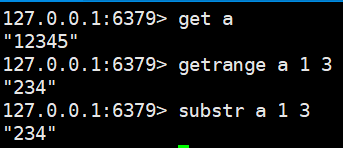
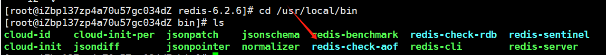
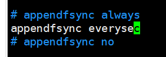
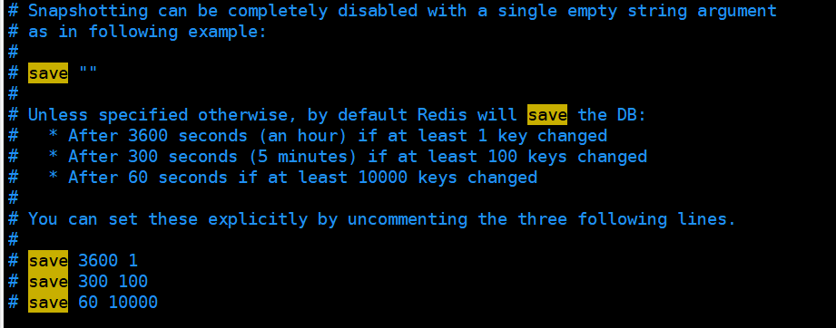
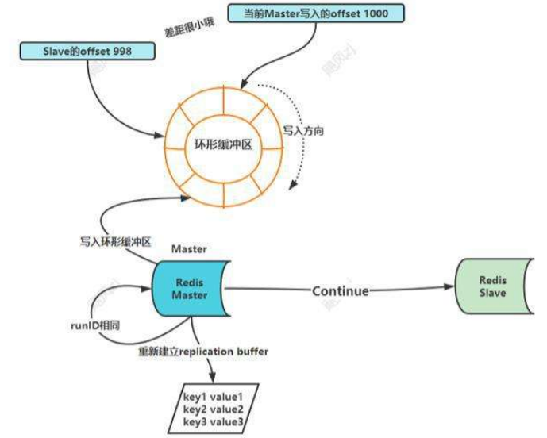

# 1. redis概述

## **1.1** 简介

- 数据库排名https://db-engines.com/en/ranking
- redis(Remote Dictionary Server) 一个开源的key-value存储系统
- 它支持存储的Value类型：包括String(字符串),list(链表),set(集合),zset(sorted set 有序集合),hash(哈希类型)。都支持push/pop、add/romove，获取交集、并集、差集等一些相关操作，操作是原子性的。
- redis支持各种不同方式的排序
- redis (与memcatched相同)数据存在内存中
- redis会周期性的把更新的数据写入磁盘，或者把修改的操作追加到记录文件
- redis支持集群，实现master-slave(主从)同步操作

## **1.2** 应用场景

- 缓存：配合关系型数据库做高速缓存
- 计数器：进行自增自减运算
- 时效性数据：利用expire过期，例如手机验证码功能
- 海量数据统计：利用位图，存储用户是否是会员、日活统计、文章已读统计、是否参加过某次活动
- 会话缓存：使用redis统一存储多台服务器用到的session信息
- 分布式队列/阻塞队列：通过List双向链表实现读取和阻塞队列
- 分布式锁: 使用redis自带setnx命令实现分布式锁
- 热点数据存储：最新文章、最新评论，可以使用redis的list存储，ltrim取出热点数据，删除旧数据
- 社交系统：通过Set功能实现，交集、并集实现获取共同好友，差集实现好友推荐，文章推荐
- 排行榜：利用sorted-set的有序性，实现排行榜功能，取top n
- 延迟队列：利用消费者和生产者模式实现延迟队列
- 去重复数据：利用Set集合，去除大量重复数据
- 发布/订阅消息：pub/sub模式

# 2.redis使用的基本命令

1. **默认16个数据库，类似数组下标从0开始，初始默认使用0号库。使用select 命令进行切换。**

   ```shell
   select < dbid>
   select 1
   ```

2. **通过key获取value**

   ```shell
   get <key>
   ```

3. **统一密码管理 ，所有库使用同样的密码**

3. **查看当前数据库的key的数量**

   ```shell
   dbsize
   ```

4.  **清空当前库**

   ```shell
   flushdb
   ```

5. **清空全部库**

   ```shell
   flushall 
   ```

6. **查看当前库所有key**

   ```shell
   keys *
   ```

7. **判断某个key是否存在**

   ```shell
   exists < key>
   ```

8.  **相看key的类型**

   ```shell
   type < key>
   ```

9.  **查看底层数据类型**

   ```shell
   object encoding < key>
   ```

10. **删除指定的key数据**

    ```shell
    del < key>
    ```

11. **根据选择非阻塞删除。仅将key从keyspace元数据中删除，真正的删除会在后续中做异步操作**

    ```shell
    unlink < key> 
    ```

12. **为给定的key设置过期时间，以秒为单位**

    ```shell
    expire < key>< seconds>：
    ```

13. **查看给定key的过期时间：-1表示永不过期 -2 表示已过期**

    ```shell
    ttl < key>：
    ```

# 3.redis常用的五种数据类型

## 3.1 Redis String字符串

### 简介

- String类型在redis中最常见的一种类型
- string类型是二制安全的，可以存放字符串、数值、json、图像数据
- value存储最大数据量是512M

### 常用命令

- **set** < key>< value>：添加键值对

  - nx：当数据库中key**不存在时**，可以将key-value添加到数据库

    ```shell
    set key value nx
    ```

  - xx: 当数据库key**存在时**，可以将key-value添加到数据库，与nx参数互斥

  - ex: 设置key-value添加到数据库，并设置key的超时时间(以秒钟为单位)

    ```shell
    set key value ex 10
    ```

  - px:设置key-value添加到数据库，并设置key的超时时间(以豪秒钟为单位)，与ex互斥

- **get** < key>查询对应键值

- **append** < key>< value>：将给定的值追加到key的末尾

- **strlen** < key>：获取值的长度

- **setnx** < key>< value>：只有在key不存在时，设置key-value加入到数据库

- **setex** < key> < timeout>< value>：添加键值对，同时设置过期时间(以秒为单位)

- **incr** < key>：将key中存储的数字加1处理，只能对数字值操作。如果是空，值为1

- **decr** < key>：将key中存储的数字减1处理，只能对数字值操作。如果是空，值为1

- **incrby** < key>< increment>：将key中存储的数字值增加指定步长的数值,如果是空，值为步长。(具有原子性)

  > `原子性`:
  >
  > 这意味着在执行命令时，Redis 会保证整个操作在一个步骤内完成，不会被其他命令中断。这种原子性确保了在高并发环境下，多个客户端同时对同一个键进行增量操作时，结果是正确且一致的。

- **decrby** < key>< decrement>: 将key中存储的数字值减少指定步长的数值,如果是空，值为步长。(具有原子性)

- **mset** < key1>< value1>[< key2>< value2>...]：同时设置1个或多个key-value值

- **mget** < key1>[< key2>...]：同时获取1个或多个value

- **msetnx** < key1>< value1>[< key2>< value2>...]：当所有给定的key都不存在时，同时设置1个或多个key-value值(具有原子性)

- **getrange** / **substr** < key>< start>< end> 将给定key，获取从start(包含)到end(包含)的值

  

- **setrange** < key>< offset>< value>：从偏移量offset开始，用value去覆盖key中存储的字符串值

- **getset**< key>< value>： 对给定的key设置新值，同时返回旧值。如果key不存在，则添加一个key-value值

### 应用场景

- **单值缓存** 

  ```shell
  set key value get key 
  ```

- **对象缓存**

  ```shell
   set stu:001 value(json)
  
   mset stu:001:name zhangsan stu:001:age 18 stu:001:gender 男
  
   mget stu:001:name stu:001:age
  ```

- **分布式锁**（⭐️）

  ```shell
  setnx key:001 true //返回1代表加锁成功
  setnx key:001 true //返回0代表加锁失败
  //.....业务操作
  del key:001 //执行完业务释放锁
  
  
  set key:001 true ex 20 nx //防止程序意外终止导致死锁 ,可以在加锁时设置过期时间。
  ```

- **分布式系统全局序列号**

  ```shell
  incrby orderid 100 //批量生成序列号	
  ```

## 3.2 Redis List列表

### 简介

- Redis列表是简单的字符串列表，单键多值。按照插入顺序排序。可以添加一个元素到列表的头部(左边)或者尾部(右边)
- 一个列表最多可以包含2^32-1个元素
- 底层是一个**双向链表**，对两端的操作性能很高，通过索引下标的操作中间的节点性能会较差

### 常用命令

- **lpush** < key> < value1>[< value2>...]：从左侧插入一个或多个值

- **lpushx** < key> < value1>[< value2>...]：将一个或多个值插入到**已存在的列表**头部

- **lrange** < key>< start>< stop>：获取列表指定范围内的元素。

  0：左边第1位

  -1：右边第1 位

  0 ~-1：取出所有

  ```java
  lrange list start stop //  取出下标[start,stop]
  
  lrange list 0 -1  // 取出所有
  ```

- **rpush** < key> < value1>[< value2>...]：从右侧插入一个或多个值

- **rpushx** < key> < value1>[< value2>...]：将一个或多个值插入到已存在的列表尾部

- **lpop** < key>[count]：移除并获取列表中左边第1个元素，count表明获取的总数量,返回的为移除的元素

- **rpop** < key>[count]：移除并获取列表中右边第1个元素，count表明获取的总数量,返回的为移除的元素

- **rpoplpush** < source>< destination>：移除源列表的尾部的元素(右边第一个)，将该元素添加到目标列表的头部(左边第一个)，并返回

- **lindex** < key>< index>:通过索引获取列表中的元素

- **llen** < key>：获取列表长度

- **linsert** < key> before|after < pivot>< element>：在< pivot>基准元素前或者后面插入<element>，如果key不存在，返回0。如果< pivot>不存在，返回-1，如果操作成功，返回执行后的列表长度

- **lrem** < key>< count>< element>：根据count的值，移除列表中与参数相等的元素

  - **count**=0 移除表中所有与参数相等的值	
  - **count**>0 从表头开始向表尾搜索，移除与参数相等的元素，**数量为count**
  - **count**<0 从表尾开始向表头搜索，移除与参数相等的元素，数量为count的绝对值

- **lset** < key>< index> < element>：设置给定索引位置的值ltrim< key>< start> < stop>：对列表进行修剪，只保留给定区间的元素，不在指定区间的被删除

- **ltrim**< key>< start> < stop>：对列表进行修剪，只保留给定区间的元素，不在指定区间的被删除

- **brpop** < key> timeout：阻塞式移除指定key的元素，如果key中没有元素，就等待，直到有元素或超时，执行结束。

### 应用场景

- 数据队列
  - 堆栈stack=lpush+lpop
  - 队列queue=lpush+rpop
  - 阻塞式消息队列 blocking mq=lpush+brpop
- 订阅号时间线
  - lrange key start stop

## 3.3 Redis Hash 哈希

### 简介

- 是一个string类型的键和value（对象），特别适合于存储对象，类似于java里面学习的Map<String,Object>。

- 假设场景：需要在redis中存储学生对象,对象属性包括(id,name,gender,age)，有以下几种处理方式

  - 方式一：用key存储学生id，用value存储序列化之后用户对象(如果用户属性数据需要修改，操作较复杂，开销较大)

  - 方式二：用key存储学生id+属性名，用value存储属性值（用户id数据冗余）

  - 方式三：用key存储学生id，用value存储field+value的hash。通过key(学生d)+field(属性)可以操作对应数据。（哈希）

### 常用命令

- **hset** < key>< field>< value>[< field>< value>...]：用于为哈希表中的字段赋值，如果字段在hash表中存在，则会被覆盖。

  ```shell
  hset stu:001 name bwh
  ```

- **hmset**:用法同hset，在redis4.0.0中被弃用

- **hsetnx** < key>< field>< value>：只有在字段不存在时，才设置哈希表字段中的值

- **hget** < key>< field> 返回哈希表中指定的字段的值

- **hmget** < key>< field>[< field>...]：获取哈希表中所有给定的字段值

- **hgetall** < key>：获取在哈希表中指定key的所有字段和值

- **hexists** < key>< field>：判断哈希表中指定的字段是否存在，存在返回1 ，否则返回0

- **hkeys** < key>：获取哈希表中所有的字段

- **hvals** < key>：获取哈希表中所有的值

- **hlen** < key>：获取哈希表中的field数量

- **hdel** < key>< field>[< field>...]：删除一个或多个哈希表字段

- **hincrby** < key>< field>< increment>：为哈希表key中指定的field字段的**整数**值加上增加increment

- **hincrbyfloat** < key>< field>< increment>：为哈希表key中指定的field字段的**浮点数**值加上增加increment

  > 如果< increment> 为负数，那就做减法。

### 应用场景

1. 对象缓存 hset stu:001 name zhangsan age 20 gender man

2. 电商购物车操作

   - 以用户id作为key, 以商品id作为field，以商品数量作为value

   - 添加商品: 
     - hset user:001 s:001 1
   
     - hset user:001 s:002 2
   
   - 增/减商品数量:
     - hincrby user:001 s:001 3

   - 查看购物车商品总数: 
     - hlen user:001
   
   - 删除商品 : 
     - hdel user:001 s:001
   
   - 获取所有商品 :
     - hgetall user:001
   

## 3.4 Redis Set集合

### 简介

set是string类型元素无序集合。对外提供的功能和list类似，是一个列表功能。集合成员是唯一的。

### 常用命令

- **sadd** < key>< member>[< member>...]：将一个或多个成员元素加入到集合中，如果集合中已经包含成员元素，则被忽略
- **smembers** < key>：返回集合中的所有成员。
- **sismember** < key>< member>：判断给定的成员元素是否是集合中的成员，如果是返回1,否则返回0
- **scard** < key>：返回集合中元素个数
- **srem** < key>< member>[< member>...]：移除集合中一个或多个元素
- **spop** < key>[< count>]：移除并返回集合中的一个或count个随机元素
- **srandmember** < key>[< count>]：与spop相似，返回随机元素，不做移除
- **smove** < source> < destination> < member>：将member元素从source源移动到destination目标

- **sinter** < key>[< key>...]：返回给定集合的**交集**(共同包含)元素
- **sinterstore** < destination> < key1>[< key2>...]：返回给定所有集合的交集，并存储到destination目标中

- **sunion** < key>[< key>...]：返回给定集合的**并集**(所有)元素
- **sunionstore** < destination> < key1>[< key2>...]：返回给定所有集合的并集，并存储到destination目标中

- **sdiff** < key>[< key>...]：返回给定集合的**差集**(key1中不包含key2中的元素)
- **sdiffstore** < destination> < key1>[< key2>...]：返回给定所有集合的差集，并存储到destination目标中

### 应用场景

- 抽奖

  - 参与抽奖：sadd cj001 user:13000000000 user:13455556666 user:13566667777

  - 查看所有参与用户： smembers cj001

  - 实现抽奖： spop cj001 3 / srandmember cj001 3 （注意区别）

- 朋友圈点赞 快手/抖音

  - 点赞 sadd like:friend001 user:001
  - sadd like:friend001 user:002取消点赞 srem like:friend001 user:001
  - 判断用户是否已点赞 sismember like:friend001 user:001

  - 显示点赞用户 smembers like:friend001

  - 获取点赞次数 scard like:friend001

- 关注模型： sinter交集 sunion并集 sdiff 差集
  - 微博 sadd g:list:u001 1001 sadd g:list:u002 1001 你们共同关注的 sinter交集
  - QQ 你们有共同好友 sinter交集
  - 快手 可能认识的人 sdiff差集

## 3.5 Redis zset有序集合

### 简介

- 有序集合是string类型元素的集合，不允许重复出现成员
- 每个元素会关联一个double类型的分数，redis是通过分数为集合中的成员进行从小到大的排序
- 有序集合的成员是唯一的，但是分数可以重复
- 成员因为有序，可以根据分数或者次序来快速获取一个范围内的元素

### 常用命令	

- **zadd** < key> < score>< member>[< score>< member>...]：将一个或多个元素及其分数加入到有序集合中

- **zrange** < key>< min>< max> [byscore|bylex] [rev] [ limit offset count] [withscores]：返回有序集合指定区间的成员，

  （byscore按分数区间，bylex按字典区间，rev 反向排序(分数大的写前边，小的写后边)，

  ​	limit分页(offset偏移量，count返回的总数)，withscores返回时带有对应的分数)

- **zrevrange** < key>< start>< stop>[ limit offset count]：返回集合反转后的成员

- **zrangebyscore** < key>< min>< max> [withscores] [ limit offset count]：参考zrange用法

- **zrevrangebyscore**< key>< max>< min> [withscores] [ limit offset count]：参考zrange用法

- **zrangebylex** < key>< min>< max>] [ limit offset count]：通过字典区间返回有序集合的成员

- **zrangebylex** k2 - +：减号最小值,加号最大值

- **zrangebylex** k2 [aa (ac：[ 中括号表示包含给定值，( 小括号表示不包含给定值 

- **zcard** < key>：获取集合中的成员数量

- **zincrby** < key> < increment>< member> ：为集合中指定成员分数加上增量increment

- **zrem** < key> < member>[< member>...]：移除集合的一个或多个成员

- **zcount** < key>< min>< max>：统计集合中指定区间分数(都包含)的成员数量

- **zrank** < key>< member>：获取集合中成员的索引位置

- **zscore** < key>< member>：获取集合中成员的分数值

### 应用场景

1. 按时间先后顺序排序：朋友圈点赞 zadd 1656667779666

2. 热搜 微博 今日头条 快手 

3. 获取topN zrevrange k1 300 10 limit 0 10

# 4.Redis AOF

## 简介

- 目前，redis的持久化主要应用AOF(Append Only File)和RDB两大机制。
- AOF以日志的形式来记录每个写操作(增量保存),将redis执行过的所有写指令全部记录下来(**读操作不记录**)。只许追加文件，但不可以改写文件。
- **redis启动之初会读取该文件，进行重新构建数据。**

## AOF的配置

- AOF默认不开启,在conf配置文件中进行配置。

- 修改redis.conf配置文件

  ```shell
  cd /opt/tools/redis-6.2.6
  vim redis.conf
  ```

  ```shell
  appendonly no
  //修改
  appendonly yes
  ```

- 默认文件名是appendonly.aof

- 默认是启动后的相对路径，redis在哪里启动，appendonly.aof文件就在哪生成

## AOF日志是如何实现

- 数据库写前日志(Write Ahead Log ,WAL)，在实际写数据库前，先把修改的数据记录到日志文件中，以便发生故障时，时行恢复。

- AOF日志是**写后日志**。redis先去执行命令，把数据写入内存中，然后才去记录日志。

  

- **查看AOF文件**

  

- **为什么使用写后日志？**

  1. redis为了避免检查开销，向AOF中记录日志，是不做检查的。如果写前执行，很有可能将错误指令记

     录到日志中，在使用redis恢复日志时，就可能会出现错误

  2. 不会阻塞当前的写操作

## AOF潜在风险

1. **aof文件可能由于异常原因被损坏。**

   可以使用redis自带的命令redis-check-aof --fix appendonly.aof文件，修复成功，可以正确启动

   ```shell
   cd /usr/local/bin
   ```

   

   ```shell
   redis-check-aof --fix /opt/tools/redis-6.2.6/appendonly.aof
   ```

2. 由于刚刚执行一个指令，还没有写入日志，就宕机了。就会导致数据永久丢失(redis做为数据库存储的情况)

3. AOF避免了对**当前**指令的阻塞，但可能会由于磁盘写入压力较大，对**下一个**操作带来阻塞风险

## AOF三种写回策略

- **打开redis.conf配置文件 appendfsync选项**

  
  
  - always：同步写回:每个写指令执行完，立即同步将指令写入磁盘日志文件中
  - everysec：每秒写回：默认配置方式。每个写指令执行完，先把日志写到AOF文件的内存缓冲区。每隔一秒把缓冲区的内容写入磁盘
  - no：操作系统控制写回：每个写指令执行完，先把日志写到AOF文件的内存缓冲区，由操作系统决定何时把缓冲区的内容写入磁盘

  | **选项** | **写日志时机** | **优点**                 | **缺点**                          |
  | -------- | -------------- | ------------------------ | --------------------------------- |
  | always   | 同步写回       | 数据可靠性高，基本不丢失 | 对性能影响较大                    |
  | everysec | 每秒写回       | 性能适中                 | 当服务器宕机时，丢失上1秒内的数据 |
  | no       | 操作系统控制写 | 性能最高                 | 当服务器宕机时，丢失的数据较多    |

## AOF重写机制

### 简介

Redis根据数据库现有数据，创建一个新的AOF文件，读取数据库中所有键值对，重新对应一条命令写入。

### AOF触发重写

- **手动触发**

​	可以使用bgrewriteaof命令手动触发 AOF 重写。

- **自动触发**


```shell
auto-aof-rewrite-percentage 100
auto-aof-rewrite-min-size 64mb
```

如果aof文件超过64m，且比上次重写后的大小增加了100%，自动触发重写。

例如 文件80m，开如重写，重写后降到50m，下一次，达到100m再开始重写。

### AOF重写流程

- bgrewirteaof触发重写，判断是否当前有重写在运行，如果有，则等待重写结束后再执行
- 主进程fork出一个子进程，执行重写操作，保证主进程不阻塞，可以继续执行命令
- 子进程循环遍历reids内存中的所有数据到临时文件，客户端的写请求同时写入aof缓冲区和aof重写缓冲区。保证原AOF文件完整以及新的AOF文件生成期间的新的数据修改操作不会丢失
- 子进程写完新AOF文件以后，向主进程发送信号，主进程更新统计信息
- 主进程把aof重写缓冲区中的数据写入到新的AOF文件
- 用新AOF文件覆盖掉旧的AOF文件，完成AOF重写

# 5.Redis RDB

## 简介

- RDB:Redis DataBase的缩写。内存快照，记录内存中某一时刻数据的状态。
- RDB和AOF相比，记录的数据，不是操作指令。
- redis提供了两个命令生成RDB文件
  - save:在主线程中执行，会导致阻塞
  - bgsave:创建一个子进程，专门用来写RDB，避免主线程的阻塞，默认配置。

例：6GB内存数据量，磁盘的写入0.3GB/S，需要20S时间，来完成RDB文件的写入。

处理技术：<font color='#2980B9'>写时复制技术</font> (copy-on-write cow)。在执行快照处理时，仍然正确执行写入操作


## **快照频率**

通过redis.conf配置文件去做处理



## 混合使用AOF和RDB

通过redis.conf配置文件

1. 打开aof

   ```shell
   appendonly yes
   ```

2. 打开混合配置

   ```shell
   aof-use-rdb-preamble yes
   ```

3. 混合过程

   ```shell
   set k1 v1
   set k2 v2
   set k3 v3
   bgrewriteaof
   set k4 v4
   set k5 v5
   ```

   在aof文件中，前半部分，就是rdb文件的内容，从rewirte之后，是aof文件内容


## 关于对redis执久化处理的建议

- 如果数据在服务器运行的时候，使用redis做缓冲，可以不使用任何持久化方式
- 数据不能丢失，rdb和aof混合使用是一个好的选择
- 如果数据不要求非常严格，要以允许分钟级别丢失，可以使用rdb
- 如果只使用AOF，建议配置策略是everysec，在可靠性和性能之间做了一个折中
- 如果磁盘允许，尽量避免AOF重写的频率,将默认值64M进行修改

# 主从复制

## 简介

- 主从库之间采用读写分离的方式
- 读操作: 主库、从库都可以处理
- 写操作：首先写到主库执行，然后再将主库同步给从库。
- 实现读写分离，性能扩展

容灾快速恢复


## 主从复制步骤

1. 创建一个目录 ,在root下创建一个myredis的目录

   ```shell
   mkdir myredis//创建目录
   cd myredis //进行目录
   cp /opt/tools/redis-6.2.6/redis.conf redis.conf //cp 源文件 目标文件
   ls
   ```

2. 关闭aof

3. 使用vi编辑三个conf文件，redis_6379.conf,redis_6380.conf,redis_6381.conf做为一主二从配置

   ```shell
   touch redis_6379.conf
   touch redis_6380.conf
   touch redis_6381.conf
   ```

   ```shell
   include redis.conf
   pidfile /var/run/reids_6379.pid
   port 6379
   dbfilename dump6379.rdb
   ```

   ```shell
   include redis.conf
   pidfile /var/run/reids_6380.pid
   port 6380
   dbfilename dump6380.rdb
   ```

   ```shell
   include redis.conf
   pidfile /var/run/reids_6381.pid
   port 6381
   dbfilename dump6381.rdb
   ```

4. 分别启动三个服务

   ```shell
   redis-server redis_6380.conf
   redis-server redis_6379.conf
   redis-server redis_6381.conf
   ps -ef|grep redis
   ```

5. 在三个客户端，模拟分别连接到不同服务器

   ```shell
   redis-cli -p 端口号
   redis-cli -p 6379
   redis-cli -p 6380
   redis-cli -p 6381
   ```

6. 查看服务器状态

   ```shell
   info replication
   ```

7. 在6380和6381上调用replicaof ，将其从属于6379

   ```shell
   replicaof 127.0.0.1 6379
   ```

   

   

8. 在主库上可以写入数据，从库不能写入数据

9. 主库和从库都可以读数据

## 服务器宕机演示

**从服务器宕机**

- 6381上调用shutdown
- 在主服务器上写入数据
- 6381重新连上时，仍然可以接收到主服务器的数据

**主服务器宕机**

- 6379服务器调用shutdown
- 在从服务器上仍然可以读取数据
- 从服务器显示主服务器的状态为down
- 当主服务器重新启动，从服务器显示主服务器的状态是up

## 主从同步原理(⭐️)


- **第一阶段**

  主从建立连接，协商同步。从库和主库建立连接，告诉主库即将进行同步操作。主库需要确认并回复，主从就可以开始进行同步处理了。

  

  从库向主库发送一个psync指令,包含两个参数。一个是主库的runID，另一个是复制进度offset。

  - runID是每个redis实例启动时生成的一个随机ID，唯一标识。第一次复制时，从库不知道主库的runid，所以设为一个"?"。
  - offset，-1表示第一次复制

  主库收到指令后，会发送给从库fullresync指令去响应，带着主库的runid，还有目前复制进度offset。

  从库会记录下这两个参数。fullresync表示全量复制。主库把所有内容都复制给从库

- **第二阶段**

  主库将所有数据发送给从库进行同步。从库收到rdb文件后，在本地把原有的数据清除，同步从主库接收到的rdb文件 。

  

  如果在主库把数据跟从库同步的过程中，主库还有数据写入，为了保证主从数据的一致性，主库会在内存中给一块空间replication buffer，专门记录rdb文件生成后收到的所有写操作

- **第三阶段**

  主库把第二阶段执行过程中新收到的操作，再发送给从库，从库再加载执行这些操作，就实现同步处理了。

## 主-从-从-模式

采用主-从-从模式，将主库生成和传输rdb文件的压力，以级联方式分散到从库上。	


## 网络连接异常情况

- 在redis2.8之前，如果网络异常，再次连接后，需要做全量复制

- 从redis2.8之后，采用增量复制方式。repl_backlog_buffer缓冲区。当主从网络断开后，主库把收到写

  操作，写入replication buffer,同时，也写入到repl_backlog_buffer缓冲区。

  

  这个缓冲区，是一个环形缓冲区，主库会记录自己写到的位置，从库会记录自己读到的位置。

  

  repl_backlog_size参数

  缓冲空间大小=主库写入速度 * 操作大小-主从库网络传输速度 * 操作大小

  repl_backlog_size=缓冲空间大小*2

  2000 * 2-1000 * 2=2000 2M 4M