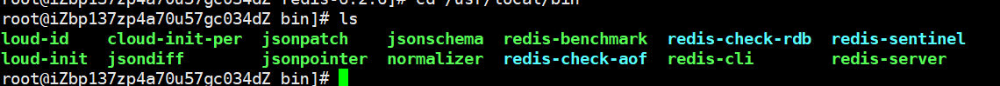
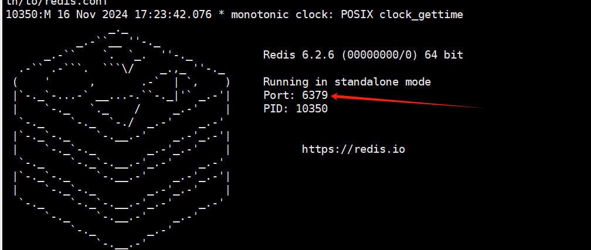
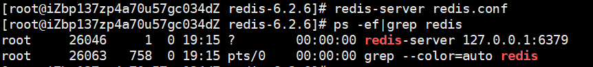

#  下载&安装

https://download.redis.io/releases/

放置Redis的目录

```shell
cd /opt/tools
```

解压redis文件

```shell
rz -be redis-6.2.6.tar.gz
```

编译redis

```shell
cd redis-6.2.6/
```

```shell
make
```

安装redis

```shell
make install
```

> 自动安装到/usr/local/bin目录下
>
> 
>
> redis-benchmark：性能测试工具
>
> redis-check-aof：修复aof持久化文件
>
> redis-check-rdb：修复rdb持久化文件
>
> redis-cli：redis命令行工具
>
> redis-sentinel：redis集群哨兵使用
>
> redis-server：启动redis

# redis启动

**前台启动(**不推荐)

```shell
cd /usr/local/bin

redis-server
```



**后台启动**(推荐)

1. 进入/opt/tools/redis-6.2.6下，找到redis.conf文件，通过 cp redis.conf redis_1.conf进行复制

   ```shell
   cd /opt/tools/redis-6.2.6
   ```

   ```shell
   cp redis.conf redis_1.conf
   ```

2. **使用vi 编辑redis.conf文件，将daemonize的no改成yes**，允许后台启动(vi 查找 / 查找内容，向下n。按insert在插入模式下修改 :wq保存退出)

3. 启动redis （⭐️）

   ```shell
   redis-server redis.conf
   ```

4. 查看redis进程

   ```shell
   ps -ef|grep redis
   ```

   

# 启动命令行

启动

```shell
redis-cli
```

> Note:
>
> 如果，启动不起，就把redis进程给杀了。

# 退出redis

1.在redis-cli调用shutdown, 再执行exit

2.先执行exit，再杀死reids进程 kill -9 redis进程id 
