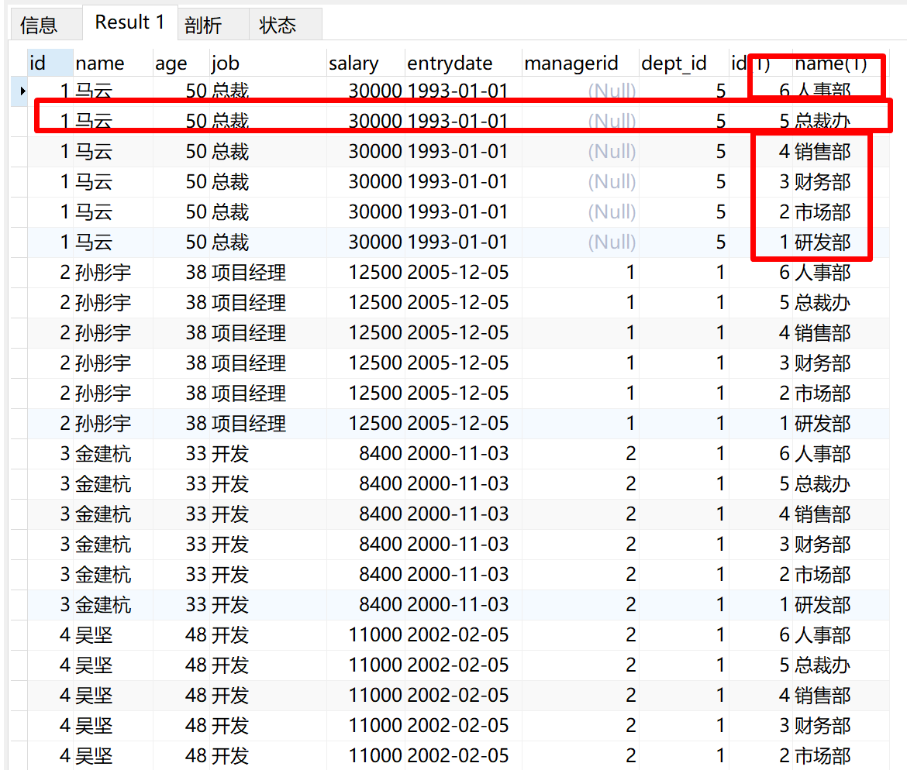
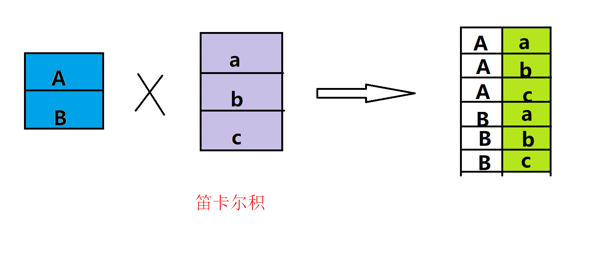
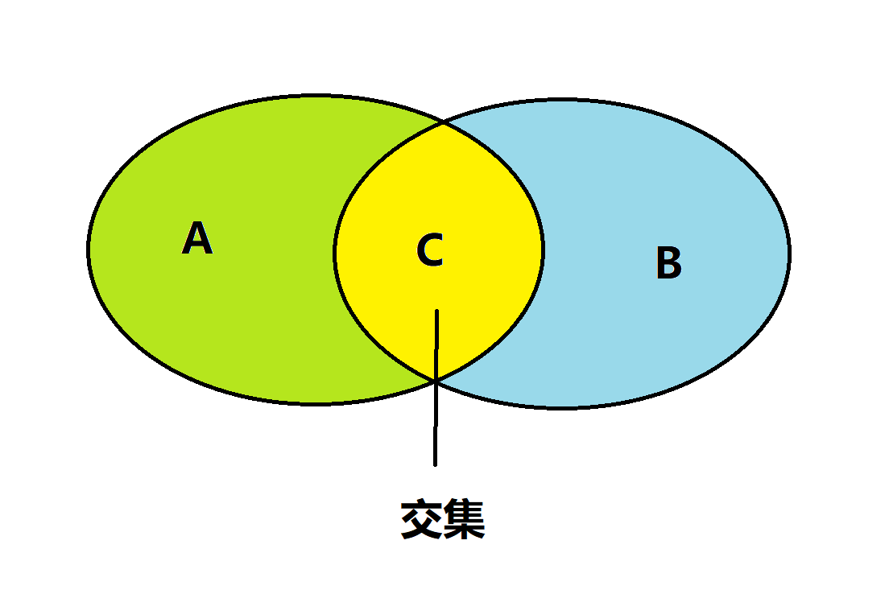
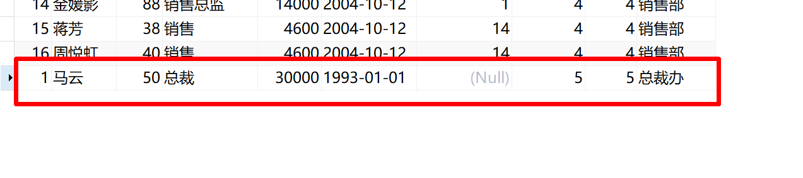
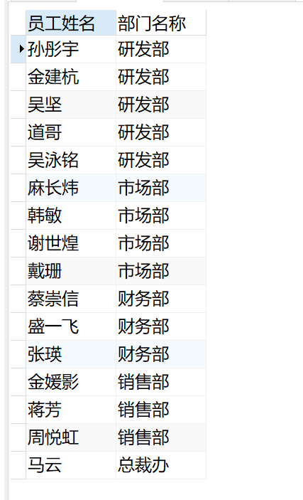
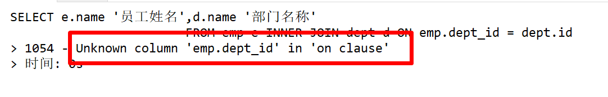
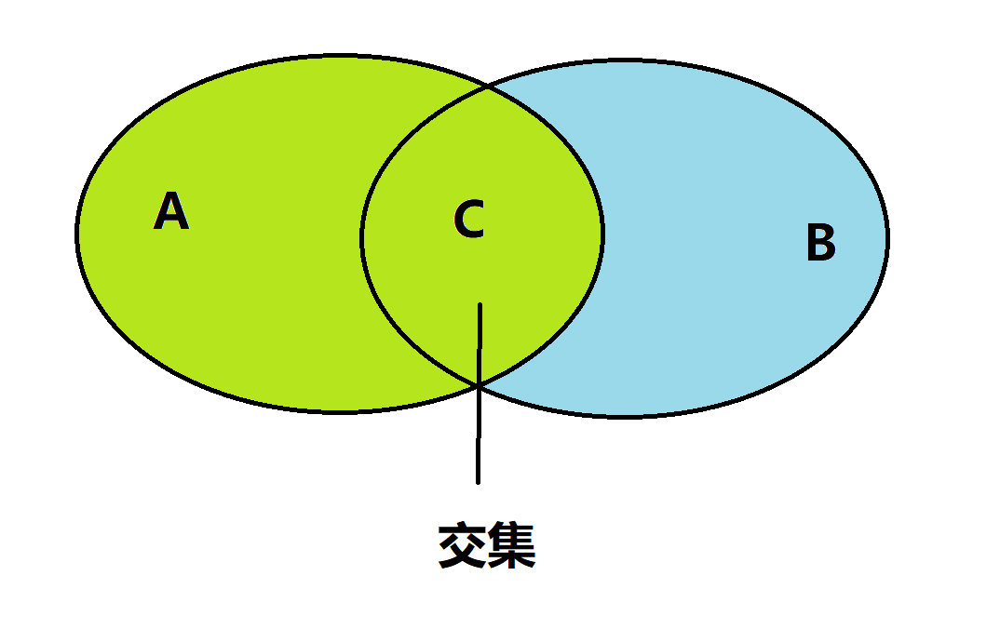
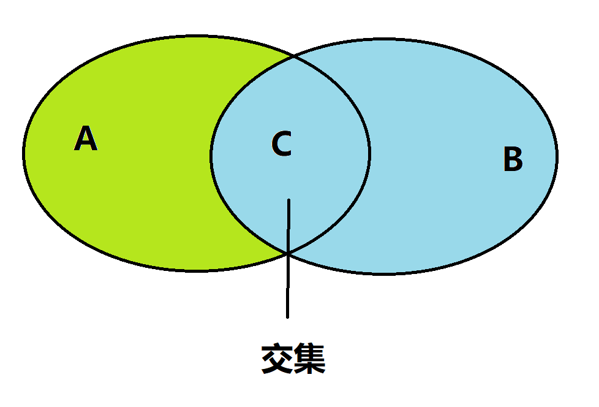
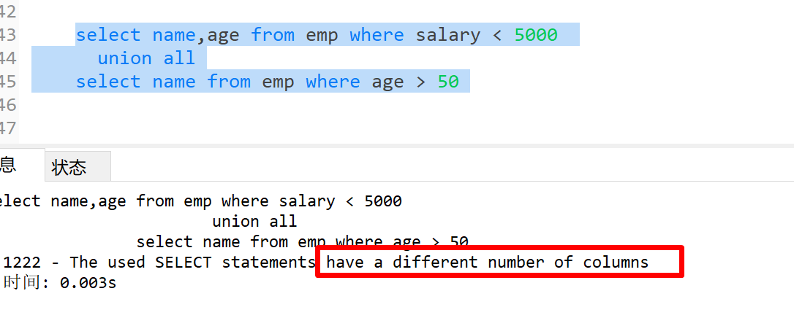
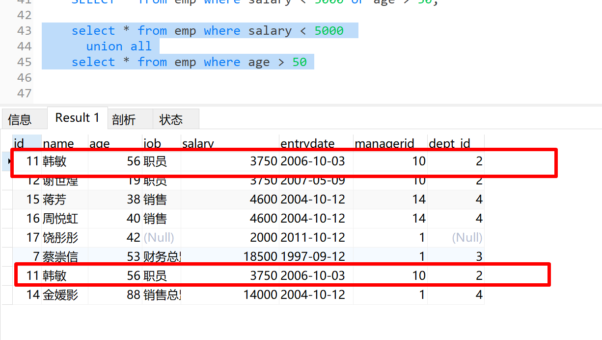

# 多表查询

1. 概述：多表查询就是多张表之间的查询。

   - 回顾：SELECT * FROM table_name

   - 多表查询 from 后面就得跟多张表。如：select * from emp,dept

     

2. 笛卡尔积：笛卡尔积在数学中，表示两个集合，集合 A 和集合 B的所有组成情况。

   

3. 如何在 sql 中去消除笛卡尔积尼？在sql 查询中，只需要加上一定的条件，就可以消除无效数据，消除笛卡尔积。

   - 比如，查询马云的时候，加上部门id 的条件，就可以消除其它无效数据

## 多表查询的分类

### 连接查询

- 内连接查询（相当于查询我们集合的交集部分（C））

  

#### 内连接查询

1. **注意：无法查询没有关联关系的数据**

##### 隐式内连接查询

1. 语法：

   ```sql
   SELECT 字段列表 FROM 表1 , 表2 WHERE 条件 ... ;
   ```

   ```sql
   SELECT * FROM emp,dept where emp.dept_id = dept.id
   ```

   

##### 显式内连接查询

1. 语法

   ```sql
   SELECT 字段列表 FROM 表1 [ INNER ] JOIN 表2 ON 连接条件 ... ;
   ```

   ```sql
   SELECT * FROM emp JOIN dept on emp.dept_id = dept.id;
   ```

   

##### 内连接查询的案例

1.  查询每一个员工的姓名 , 及关联的部门的名称 (隐式内连接实现)

   - 表结构: emp , dept
   - 连接条件: emp.dept_id = dept.id

   ```sql
   SELECT emp.name '员工姓名' ,dept.name '部门名称' from emp,dept where emp.dept_id = dept.id;
   
   
   SELECT e.name '员工姓名', d.name '部门名称'
   			FROM emp e,dept d 
   			where e.dept_id = d.id;
   ```

   

   

2. 查询每一个员工的姓名 , 及关联的部门的名称 (显式内连接实现) --- INNER JOIN ...ON ...

   - 表结构: emp , dept
   - 连接条件: emp.dept_id = dept.id

   ```sql
   SELECT e.name '员工姓名',d.name '部门名称' 
   			FROM emp e JOIN dept d ON e.dept_id = d.id;
   			
   			
   SELECT e.name '员工姓名',d.name '部门名称' 
   			FROM emp e INNER JOIN dept d ON e.dept_id = d.id;
   ```

   

3. **注意：一旦起了别名，就不能用表直接使用，此时只能使用别名，inner 可以省略（不影响任何效果，开发中基本不使用）**

   

   

#### 外连接查询

1. 外连接查询分为左外连接和右外连接

##### 左外连接

1. 语法（包含左表的所有数据，也包含两张表交集的数据）：

   ```sql
   SELECT 字段列表 FROM 表1 LEFT [ OUTER ] JOIN 表2 ON 条件 ... ;
   ```

   

##### 右外连接

1. 语法(相当于查询右边表的所有数据，也包含两张表的交集部分)：

   ```sql
   SELECT 字段列表 FROM 表1 RIGHT [ OUTER ] JOIN 表2 ON 条件 ... ;
   ```

   

   

##### 外连接查询的案例

1. 查询emp表的所有数据, 和对应的部门信息，由于需求中提到，要查询emp的所有数据，所以是不能内连接查询的，需要考虑使用外连接查询。

   - 表结构: emp, dept
   - 连接条件: emp.dept_id = dept.id

   ```sql
   SELECT e.*,d.* from emp e left join dept d on e.dept_id = d.id;
   ```

2. 查询dept表的所有数据, 和对应的员工信息(右外连接)由于需求中提到，要查询dept表的所有数据，所以是不能内连接查询的，需要考虑使用外连接查询。

   - 表结构: emp, dept
   - 连接条件: emp.dept_id = dept.id

   ```sql
   SELECT e.*,d.* from emp e right join dept d on e.dept_id = d.id;
   SELECT e.*,d.* from  dept d left join emp e  on e.dept_id = d.id;
   ```

##### 外连接查询注意

1. 左外连接，右外连接可以相互替换（只不过是颠倒顺序的问题），在开发中，你任意使用，我偏向于喜欢左连接

#### 自连接查询

1. 概述：自己连接自己，也就是把一张表当成两张表来查询，自连接查询可以使用内连接或者外连接查询

2. 语法(必须使用别名)

   ```sql
   SELECT 字段列表 FROM 表A 别名A JOIN 表A 别名B ON 条件 ... ;
   ```

##### 自连接查询的案例

1. 查询员工 及其 所属领导的名字

   ```sql
   SELECT   e.name '员工姓名' , ee.name '领导名称'  FROM emp e,emp ee where e.managerid = ee.id
   ```

2.  查询所有员工 emp 及其领导的名字 emp , 如果员工没有领导, 也需要查询出来

   ```sql
   SELECT   e.name '员工姓名' , ee.name '领导名称'  FROM emp e left join emp ee on e.managerid = ee.id
   ```

   

#### 联合查询

- union查询 （会去重）

  - 把多次查询的结果合并起来，形成一个新的查询结果集

- union all 查询

  - **将全部的数据直接合并到一起（union） 会去重**

- 语法

  ```sql
  SELECT 字段列表 FROM 表名 ...
  UNION [ALL]
  SELECT 字段列表 FROM 表名 ...
  ```

- 要求：**对于联合查询，必须保持查询的*列长度一致*，字段类型也需要保持一致**

  

  

##### 联合查询的案例

1. 将薪资低于 5000 的员工 , 和 年龄大于 50 岁的员工全部查询出来.

   ```sql
   select * from emp where salary < 5000 
       union 
   select * from emp where age > 50 
   ```

2. 注意：使用 union all 不会去重,只是把两张表的结果集做一个逻辑合并

   

### 子查询

1. 概述，实质是一种嵌套查询，把查询出来的结果集作为新表来进行查询

2. 语法：

   ```sql
   SELECT * FROM t1 WHERE column1 = ( SELECT column1 FROM t2 );
   ```

3. 对于增删改查来说,都可以使用子查询的方式

4. 分类

   - 标量子查询（查询出来的结果是单个值）
   - 列子查询（子查询的结果为一列）
   - 行子查询（子查询出来的结果是一行）
   - 表子查询（子查询查出来的结果是多行多列的）

5. 查询位置

   - where 
   - from 
   - select

#### 标量子查询

1. 查询结果是单个值（数值，日期），常用一些操作位，= ,!=,>,<,>=,<=

2. 案例：

   - 查询 "研发部" 的所有员工信息

     ```sql
     SELECT * FROM emp where dept_id = (SELECT id from dept where name = '研发部');
     ```

   - 查询在 "马云" 入职之后的员工信息

     ```sql
     SELECT * FROM emp where entrydate > (SELECT entrydate from emp where name = '马云');
     ```

#### 列子查询

1. 子查询返回的结果是一列（可以是多行），这种子查询称为列子查询。

   - 常用操作符
     - IN
     - NOT IN
     - ANY 有任意一个满足就行
     - SOME 有任意一个满足就行 ANY 和 SOME 可以替换
     - ALL 必须全部满足

2. 案例：

   - 查询 "销售部" 和 "市场部" 的所有员工信息

     ```sql
     SELECT * FROM emp WHERE dept_id in (SELECT id FROM dept where name = '销售部' or name = '市场部');
     ```

   - 查询比 "财务部" 所有人工资都高的员工信息

     ```sql
     SELECT * FROM emp where salary > all(SELECT salary from emp where dept_id = (SELECT id from dept where name = '财务部'))
     ```

   - 查询比研发部其中任意一人工资高的员工信息

     ```sql
     SELECT * FROM emp WHERE salary > any(SELECT salary from emp where dept_id = (SELECT id from dept where name = '研发部'))
     ```

#### 行子查询

1. 概述：子查询返回的结果是一行（可以是多列），这种子查询称为行子查询。

2. 常用操作符

   - =
   - !=
   - IN
   - NOT IN

3. 案例：

   - 查询与 "谢世煌" 的薪资及直属领导相同的员工信息 

     ```sql
     SELECT 	* FROM emp where (managerid,salary) = (SELECT managerid,salary from emp where name = '谢世煌');
     ```

#### 表子查询

1. 概述：就是查询的结果返回多行多列，这种子查询就是表子查询

2. 常用操作符

   - IN

3. 案例

   -  查询与 "韩敏" , "蒋芳" 的职位和薪资相同的员工信息

     ```sql
     select * from emp where (job,salary) in ( SELECT job,salary from emp where name = '韩敏' or name = '蒋芳')
     ```

   - 查询入职日期是 "2006-01-01" 之后的员工信息 , 及其部门信息

     ```sql
     SELECT e.name '员工姓名' ,e.salary '薪资', d.name '部门名称' 
     	FROM  (SELECT * FROM emp where entrydate > '2006-01-01') e
     	LEFT JOIN dept d on  d.id = e.dept_id
     ```

## 多表查询的案例

1. 查询员工的姓名、年龄、职位、部门信息 

   ```sql
   SELECT e.name , e.age ,e.job ,d.name
       FROM emp e ,dept d where e.dept_id = d.id
   ```

2. 查询年龄小于30岁的员工的姓名、年龄、职位、部门信息

   ```sql
   SELECT e.name '员工姓名', e.age '员工年龄', e.job '职位',d.name '部门信息'
   		FROM emp e join dept d on e.dept_id = d.id
   		WHERE e.age < 30
   ```

3. 查询拥有员工的部门ID、部门名称

   ```sql
   SELECT distinct d.id ,d.name
       FROM emp e join dept d on e.dept_id = d.id
   ```

4. 查询所有年龄大于40岁的员工, 及其归属的部门名称; 如果员工没有分配部门, 也需要展示出来

   ```sql
   SELECT e.*,d.name '部门名称'
   		FROM emp e left join dept d on e.dept_id = d.id
   	where e.age > 40
   ```

5. 查询所有员工的工资等级

   ```sql
   SELECT  e.* ,s.id '薪资等级'
       FROM emp e left join salgrade s on  e.salary > s.losal and e.salary <= s.hisal 
   ```

6. 查询 "研发部" 所有员工的信息及 工资等级

   ```sql
   SELECT * 
   		FROM (SELECT * FROM emp where dept_id = (SELECT id from dept where name = '研发部')) e left join salgrade s on e.salary > s.losal and e.salary <= s.hisal
   ```

7. 查询 "研发部" 员工的平均工资

   ```sql
   SELECT avg(salary)
   		FROM emp where dept_id = (SELECT id from dept where name = '研发部')
   ```

8. 查询工资比张瑛高的员工信息

   ```sql
   select * from emp where salary > (SELECT salary FROM emp where name = '张瑛')
   ```

9. 查询比平均薪资高的员工信息

   ```sql
   select * from emp where salary > (select avg(salary) from emp)
   ```

10. **查询低于本部门平均工资的员工信息**

    ```sql
    SELECT * FROM emp e1 where e1.salary < (select avg(e2.salary) from emp e2 where e1.dept_id = e2.dept_id )
    ```

    - 分析复杂sql

      ```sql
      SELECT * FROM emp e1 where e1.salary < (
              SELECT n.avgSalary from (
                      SELECT avg(e.salary) avgSalary,d.name,d.id
                          FROM dept d left join emp e on d.id = e.dept_id
                          GROUP BY d.name
                  ) n
              where e1.dept_id = n.id
          )
          
      #第一步查询出部门信息的平均薪资
      SELECT avg(e.salary) avgSalary,d.name,d.id
      						FROM dept d left join emp e on d.id = e.dept_id
      						GROUP BY d.name
      						
      #第二步
      SELECT n.avgSalary from (
      					SELECT avg(e.salary) avgSalary,d.name,d.id
      						FROM dept d left join emp e on d.id = e.dept_id
      						GROUP BY d.name
      				) n
      				
      #第三步再建立子查询查出部门员工的平均薪资
      SELECT * FROM emp e1 where e1.salary < (
      			SELECT n.avgSalary from (
      					SELECT avg(e.salary) avgSalary,d.name,d.id
      						FROM dept d left join emp e on d.id = e.dept_id
      						GROUP BY d.name
      				) n
      			where e1.dept_id = n.id
      		)	
      ```

11. 查询所有的部门信息, 并统计部门的员工人数

    ```sql
    SELECT d.name '部门名称' ,count(e.name)
        FROM dept d left join emp e on d.id = e. dept_id
        GROUP BY d.id
    		
    
    
    select d.name '部门名称',(select count(*) from emp e where e.dept_id = d.id) '人数'
    	from dept d;
    
    ```

    