# 	SQL优化

## 插入数据优化

1. 顺序插入代替乱序插入

   ```sql
   data:1,2,3,4,5,6,7
   data:4,3,1,6,5,2,7
   ```

2. 批量插入代替单个数据插入

   ```sql
   INSERT INTO `test` VALUES (1000, '软件工程-1000');
   INSERT INTO `test` VALUES (10000, '软件工程-10000');
   INSERT INTO `test` VALUES (100000, '软件工程-100000');
   
   INSERT INTO `test` VALUES (1, '软件工程-1'),(10, '软件工程-10'),(100, '软件工程-100');
   ```

3. 手动控制事务

   ```sql
   start transaction;
   	INSERT INTO `test` VALUES (1000, '软件工程-1000');
       INSERT INTO `test` VALUES (10000, '软件工程-10000');
       INSERT INTO `test` VALUES (100000, '软件工程-100000');
   commit;
   ```

4. load 指令加载大数据量

   - 命令行

     - 客户端连接服务端时，加上参数 -–local-infile

       ```sql
       mysql –-local-infile -u root -p
       ```

     - 启动从本地加载文件开关

       ```sql
       select @@local_infile 查看开关是否打开
       set global local_infile = 1;
       ```

       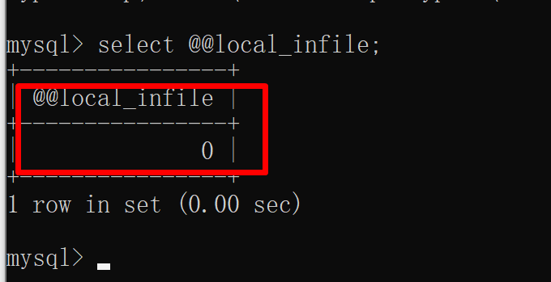

       

     - 执行load指令将准备好的数据，加载到表结构中 

       ```sql
       load data local infile '文件路径' into table table_name fields terminated by ',' lines terminated by '\n' ;
       ```

     - 实操（注意，不要去用中文路径）

       ```sql
       load data local infile 'D:\\mysql\\课件\\配套资料\\sql优化\\load_1000w.txt' into table test fields terminated by ',' lines terminated by '\n';
       ```

       


## 主键优化

1. 刚才提到了顺序插入代替乱序插入，这是为啥呢	

2. 数据组织方式：

   - innodb 主键是按顺序存放的，乱序插入会导致页分裂

   - 顺序插入

     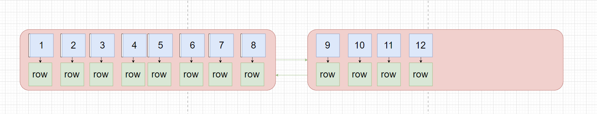

   - 乱序插入出现**页分裂**的问题（页的元素没有顺序插入）

     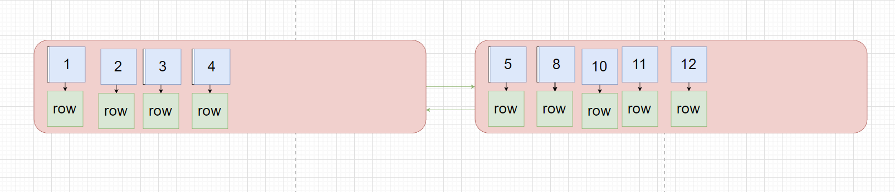

   - **页合并**

     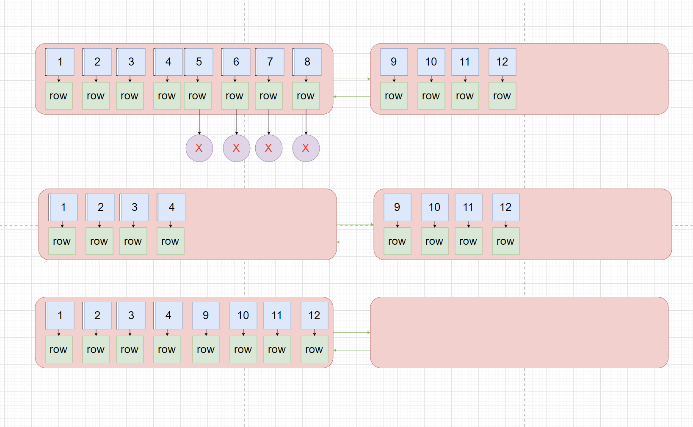

3. 设计主键的原则

   - 去使用自动递增（AUTO_INCREMENT）可以顺序插入，避免页分裂
   - 不要去使用 UUID,电话号码做为主键
   - 不要去修改主键

## order by 优化

1. mysql 排序：

   - Using filesort：通过扫描索引或者全表，读取满足的条件行，在排序缓冲区sort buffer 中的，性能低

   - **Using index：通过有序索引顺序扫描直接返回有序结果，不需要额外排序，性能高**

   - 优化具体操作：

     - 不建立索引的时候

       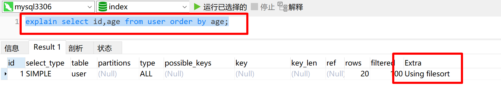

     - 建立索引时

       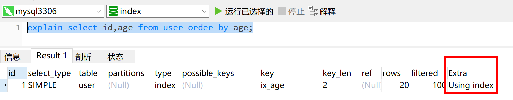

     - 给两个字段做升序排序

       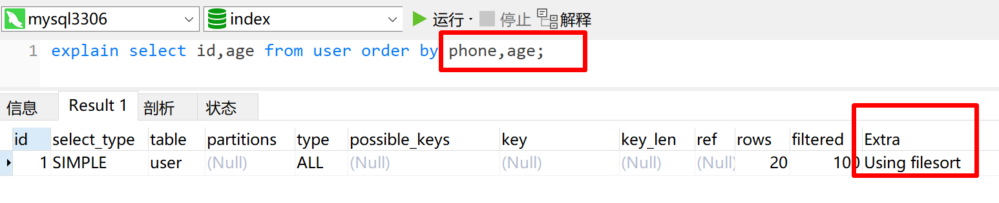

     - 建立联合索引时

       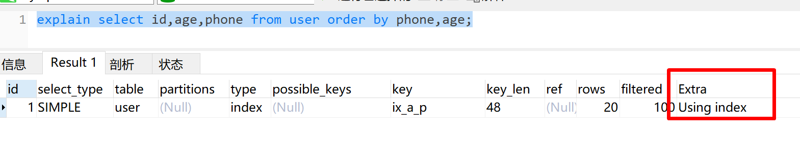

     - 一个字段升序，一个字段降序

       ```sql
       create index ix_p_a on user(phone,age desc)
       ```

       

       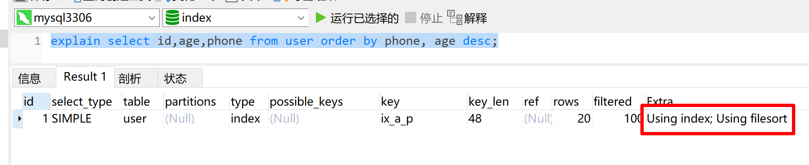

       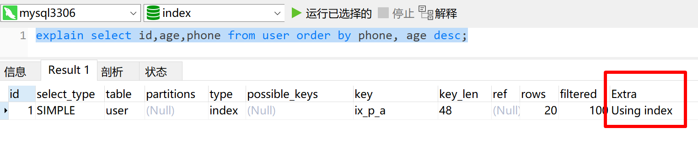

     - 两个字段都降序排列

       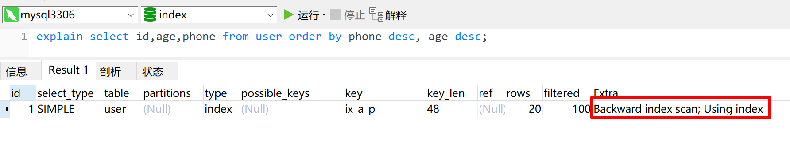

       

2. 优化原则
   - 排序字段需要建立合适索引，多字段排序，建立联合索引
   
   - 一个升序一个降序，创建索引的时候要去指定排序规则
   
     
   
   - 如果必须使用 filesort,数据量比较大的时候，可以去增大排序缓冲区的大小 sort_buffer_size(256K)
   
     可以在my.ini 文件中修改
   
     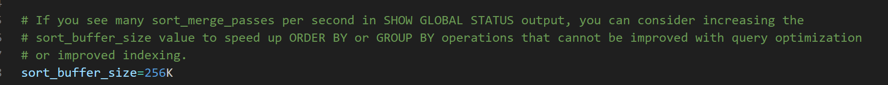

## group by 优化

1. 索引对于分组的影响

   - 没有建立索引的时候

     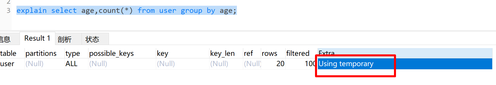

   - 建立索引的时候

     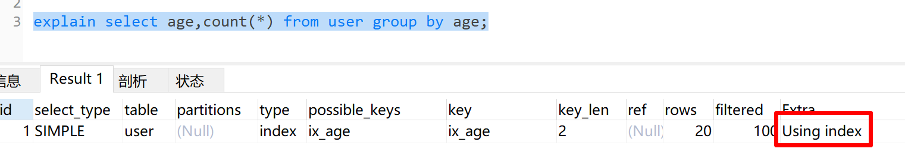

   - 多字段分组

     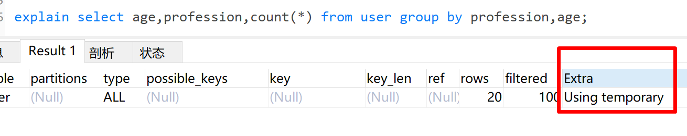

   - 建立索引后 （profession，age）

     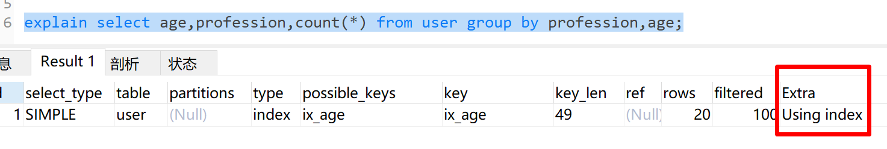

     依次放在where和group by之后也遵循index
     
     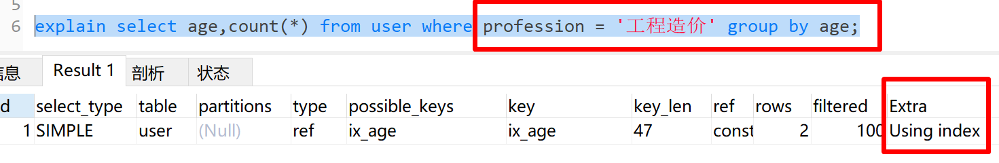
     
     交换位置发现不可以
     
     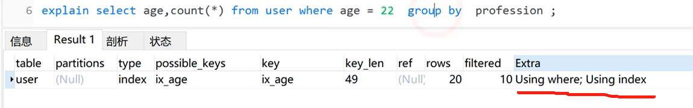

2. 优化

   - 分组时，也要建立相关索引
   - 使用联合索引时，也遵循**最左原则**

## limit 优化

1. 如果数据量很大的时候，limit 分页查询，越往后速度越慢，效率越低。

2. 查询 test 表中，第900万页的20条数据

   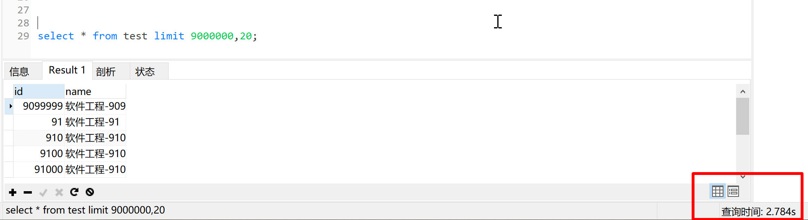

3. 如何优化

   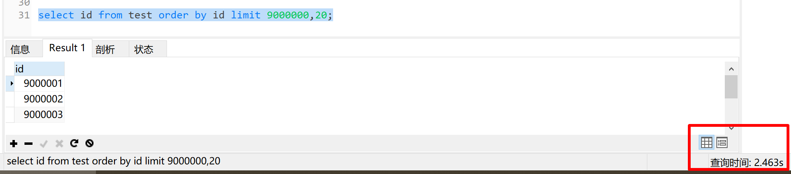

   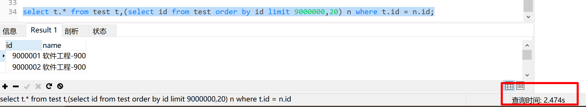


2. limit 优化
   - 通过创建索引，覆盖索引可以提升性能
   - 通过连接查询方式，相当于把查询到的结果作为临时表在进行查询

## count 优化

1. 查询表中的数据量

   ```sql
   select count(*) from tablename
   ```

2. 不同存储引擎

   - innodb count(*) 需要一行一行的从数据库读取数据，累加结果
   - MyiSAM 存储的时候存放了一个总条数的值，直接拿，效率很高。做条件查询的时候，也很慢

3. count 用法

   - count(*) 不需要取值

   - count(主键) 遍历整张表，取id 值

   - count(数字) 不需要取值

   - count(字段) 需要取值，并且还需要判断是否为空

     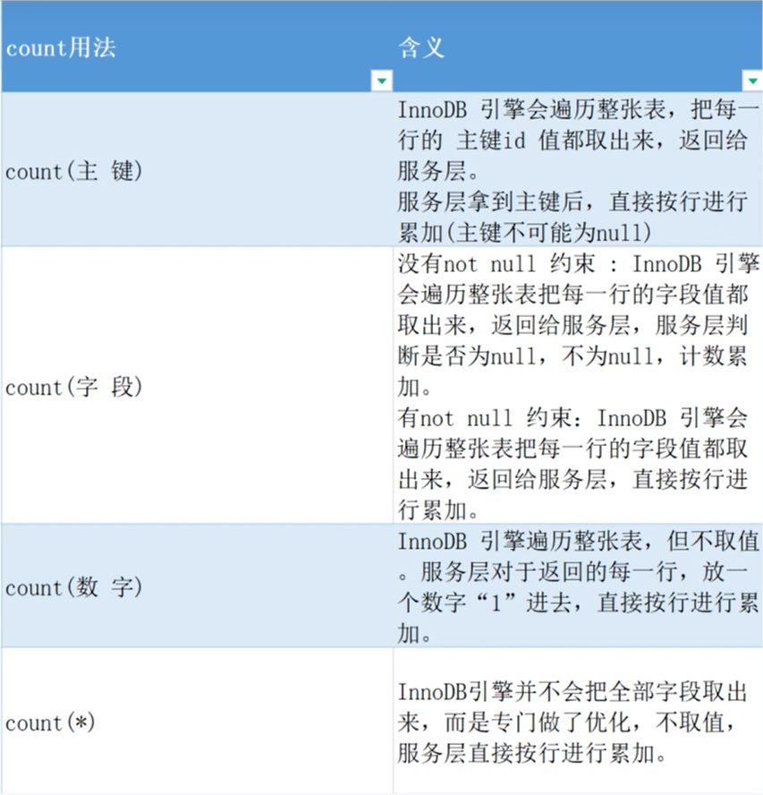

4. 排序效率

   ```sql
   count(*)=count(1) > count(主键) > count(字段)
   ```

## update 优化

1. innodb 引擎有三大特征

   - 事务
   - 外键
   - 行级锁

2. 演示注意点

   1. 如果使用id(主键操作的时候)是可以成功的

      ```sql
      update user set user_name = 'xx' where id = 1;
      
      update user set user_name = '3' where id = 3;
      ```

   2. 更新名字为曹操的这条数据，把电话号码改成1，再去更新id=4 的数据，把电话号码也改成1

      ```sql
      update user set phone = '1' where user_name = '曹操';
      update user set phone = '1' where id = 4;
      出现阻塞的状态
      ```

      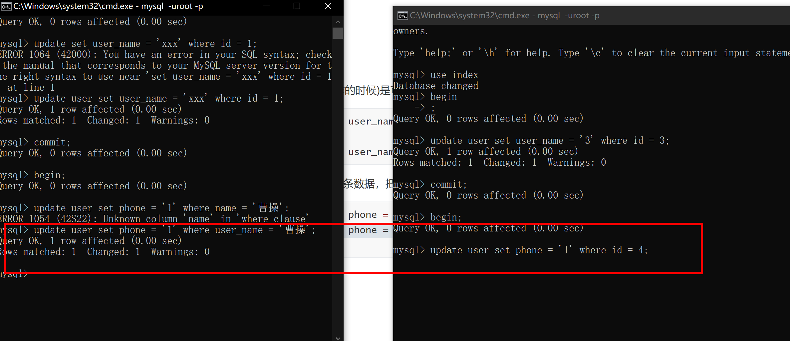

3. 优化点

   - **innodb 的行锁是针对于索引加的锁，并不是记录加的锁，如果没有索引或者是索引失效，将导致行锁升级为表锁**
   - 避免将行锁升级成表锁

# 三范式

## 第一范式

1.每列都是不可再分的最小数据单元

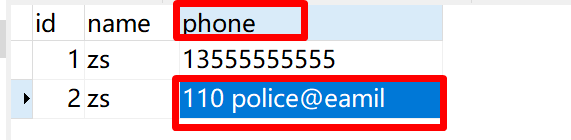

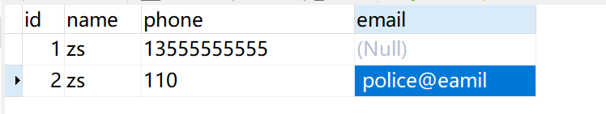


## 第二范式

1.每个表只描述一件事情，要求所有非主键字段完全依赖主键。（其他表的非主键字段，不能出现在其他表中）

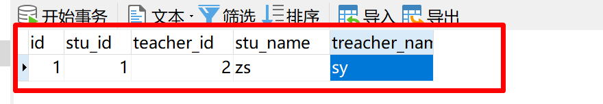

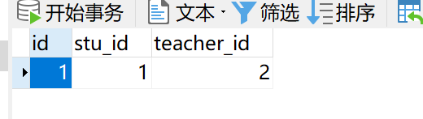

## 第三范式

1.非主键字段不能传递依赖于主键字段（不要产生传递依赖）

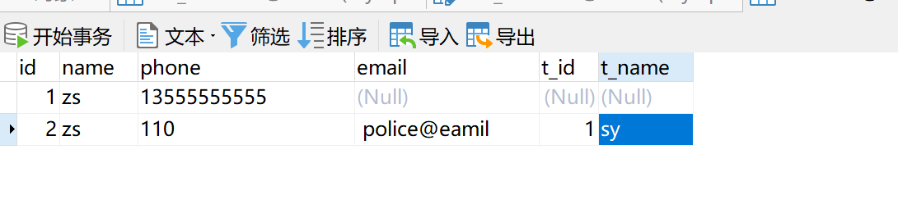

## 三范式总结

1. 第一范式：有主键，具有原子性，字段不可分割
2. 第二范式：完全依赖，没有部分依赖
3. 第三范式：没有传递依赖

**注意：实际开发中，不是完全遵循三范式，会经常使用冗余字段的。**


# 视图

视图（View）是一种虚拟存在的表。视图中的数据并不在数据库中实际存在，行和列数据来自定义视
图的查询中使用的表，并且是在使用视图时动态生成的。

视图只保存了查询的SQL逻辑，不保存查询果。所以我们在创建视图的时候，主要的工作就落在创建这条SQL查询语句上。

1. 创建

   ```sql
   CREATE [OR REPLACE] VIEW 视图名称[(列名列表)] AS SELECT语句 [ WITH [ CASCADED | LOCAL ] CHECK OPTION ]
   ```

2. 查询

   ```sql
   查看创建视图语句：SHOW CREATE VIEW 视图名称; 查看视图数据：SELECT * FROM 视图名称 ...... ;
   ```

3. 修改

   ```sql
   	方式一：CREATE [OR REPLACE] VIEW 视图名称[(列名列表)] AS SELECT语句 [ WITH [ CASCADED | LOCAL ] CHECK OPTION ] 
   	方式二：ALTER VIEW 视图名称[(列名列表)] AS SELECT语句 [ WITH [ CASCADED | LOCAL ] CHECK OPTION ]
   ```

4. 删除

   ```sql
   DROP VIEW [IF EXISTS] 视图名称 [,视图名称] ...
   ```

   - 视图演示

     ```sql
     #创建视图
     create or replace view test_view as select * from user where id >10;
     #查看视图
     show create view test_view;
     #从视图查询
     select * from test_view;
     #修改视图数据
     update test_view set user_name = '1' where id = 11;
     #修改视图
     create or replace view test_view as select id,user_name,email from user where id >10;
     #删除视图
     drop view if exists test_view;
     ```

# 存储过程

概述：经过事先编译并存储到数据库中的一段 sql 语句的集合，类似于java 的方法。

语法

- 创建

  ```sql
  CREATE PROCEDURE 存储过程名称 ([ 参数列表 ]) BEGIN
  	-- SQL语句 
  END ;
  ```

  

- 查看

  ```sql
  SELECT * FROM INFORMATION_SCHEMA.ROUTINES WHERE ROUTINE_SCHEMA = 'xxx';
  	-- 查询指定数据库的存储过程及状态信息 
  SHOW CREATE PROCEDURE 存储过程名称 ; 
  	-- 查询某个存储过程的定义
  ```

  

- 调用

  ```sql
  CALL 名称 ([ 参数 ]);
  ```

  

- 删除

  ```sql
  DROP PROCEDURE [ IF EXISTS ] 存储过程名称 ；
  ```

  ```sql
  drop tables if EXISTS test;
  create table test(id int, name varchar(255));
  
  -- 创建存储过程,定义存储方法
  create procedure batchInsert(in args int)
  begin
  declare i int default 1;
  -- 开启事务(重要!不开的话,100w数据需要论天算)
  start transaction;
  while i <= args do
  	insert into test(id,name) value(i,concat("软件工程-",i));
  set i = i+ 1;
  end while;
  commit;
  end
  
  #调用
  call batchInsert(100000);
  
  #查询指定数据库的名称的存储过程
  select * from INFORMATION_SCHEMA.ROUTINES WHERE ROUTINE_SCHEMA = 'index';
  #查询指定存储过程的详细信息
  show create PROCEDURE batchInsert;
  
  #删除指定的存储过程
  drop PROCEDURE if EXISTS batchInsert
  ```

## 变量

1. 系统变量

   - 查看系统变量

     ```sql
     show [session|global] variables; #所有变量
     select @@系统变量名 #查询指定变量
     select @@local_infile #查看导入开关是否打开
     ```

   - 设置系统变量值

     ```sql
     set [session|global] 变量名=值
     #设置事务自动提交
     set global autocommit=1;
     ```

     

2. 自定义变量

   1. 赋值

      ```sql
      1.
      	SET @var_name = expr [, @var_name = expr] ... ; SET @var_name := expr [, @var_name := expr] ... ;
      
      2.
      	SELECT @var_name := expr [, @var_name := expr] ... ; SELECT 字段名 INTO @var_name FROM 表名;
      ```

   2. 查询

      ```sql
      select @var_name;
      ```

      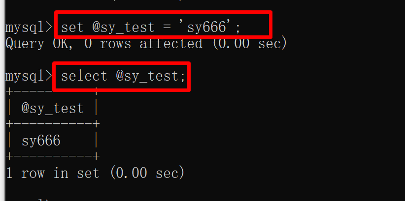

3. 局部变量

   - 声明

     ```sql
     DECLARE 变量名 变量类型 [DEFAULT ... ] ;
     ```

   - 赋值

     ```sql
     SET 变量名 = 值 ; 
     SET 变量名 := 值 ;
     SELECT 字段名 INTO 变量名 FROM 表名 ... ;
     ```

   - 演示

     ```sql
     create procedure select_sy()
     begin
     	declare user_count int default  0;
     	select count(*) into user_count from user;
     	select user_count;
     end;
     
     call select_sy();
     ```

     

# 触发器

1. 概述：指在insert\update\delete 之前或者之后触发并执行触发器中的sql 语句的集合。

2. NEW OLD 是别名，用来引用触发器中发生变化的记录内容，

   | 触发器类型 | NEW 或者 OLD                                             |
   | ---------- | -------------------------------------------------------- |
   | INSERT     | NEW 表示将要或者已经新增的数据                           |
   | UPDATE     | OLD 表示修改之前的数据，NEW 表示将要或者已经修改后的数据 |
   | DELETE     | OLD 表示将要或者已经删除的数据                           |

3. 创建

   ```sql
   CREATE TRIGGER trigger_name 
   BEFORE/AFTER INSERT/UPDATE/DELETE 
   ON tbl_name FOR EACH ROW -- 行级触发器 BEGIN
   	trigger_stmt ; 
   END;
   ```

4. 查看

   ```sql
   SHOW TRIGGERS ;
   ```

5. 删除

   ```sql
   DROP TRIGGER [schema_name.]trigger_name ; -- 如果没有指定 schema_name，默认为当前数 据库 。
   ```

6. 演示

   ```sql
   CREATE TRIGGER user_log_test1 
   AFTER delete 
   ON user FOR EACH ROW -- 行级触发器
   BEGIN
   	insert into user_log values(null,'delete',now());
   END;
   
   show triggers;
   
   delete  from user where id = 2;
   
   DROP TRIGGER user_log_test ;
   ```

   