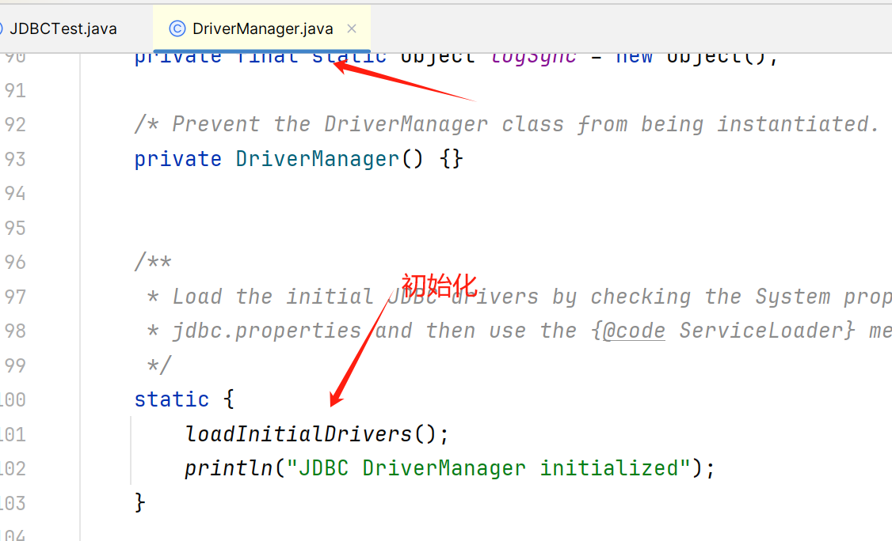
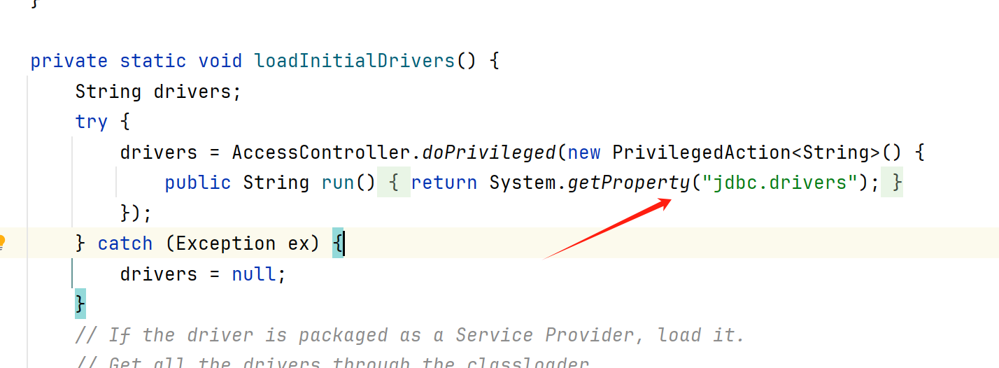
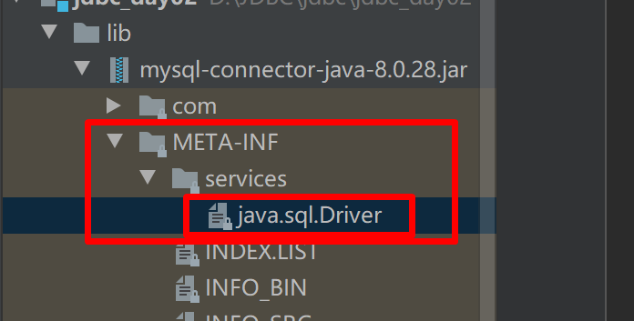
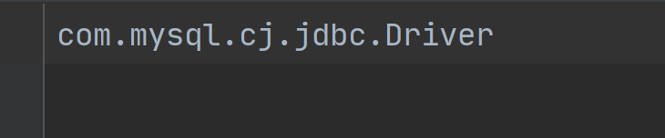
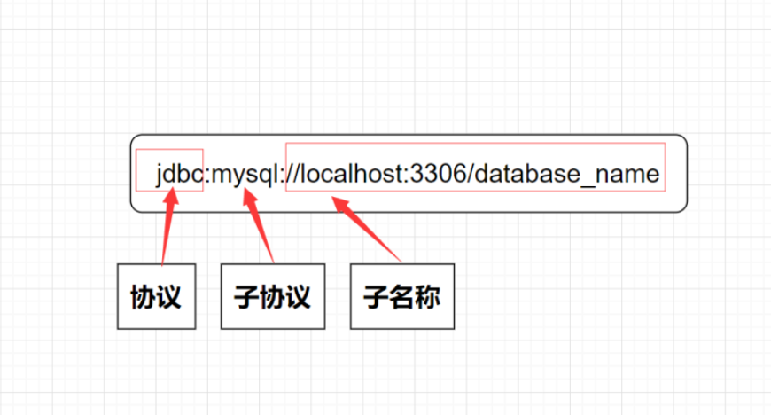
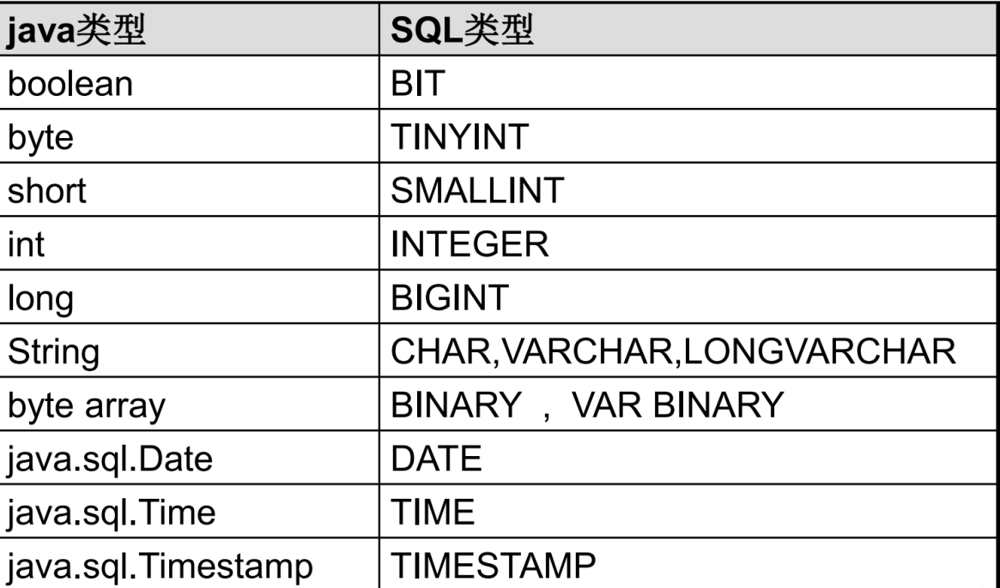
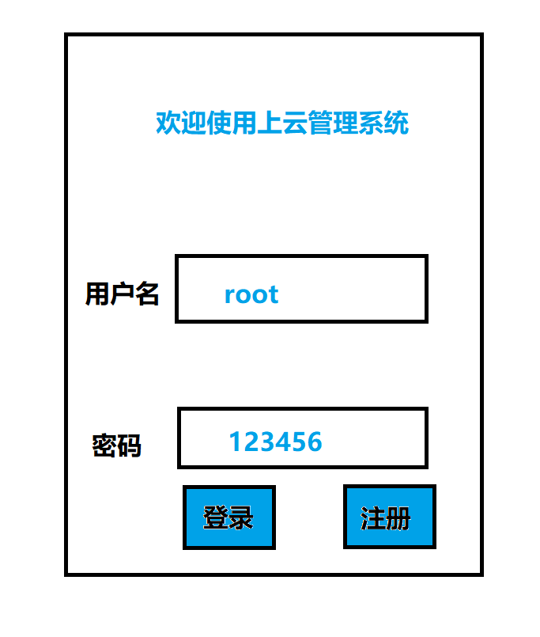
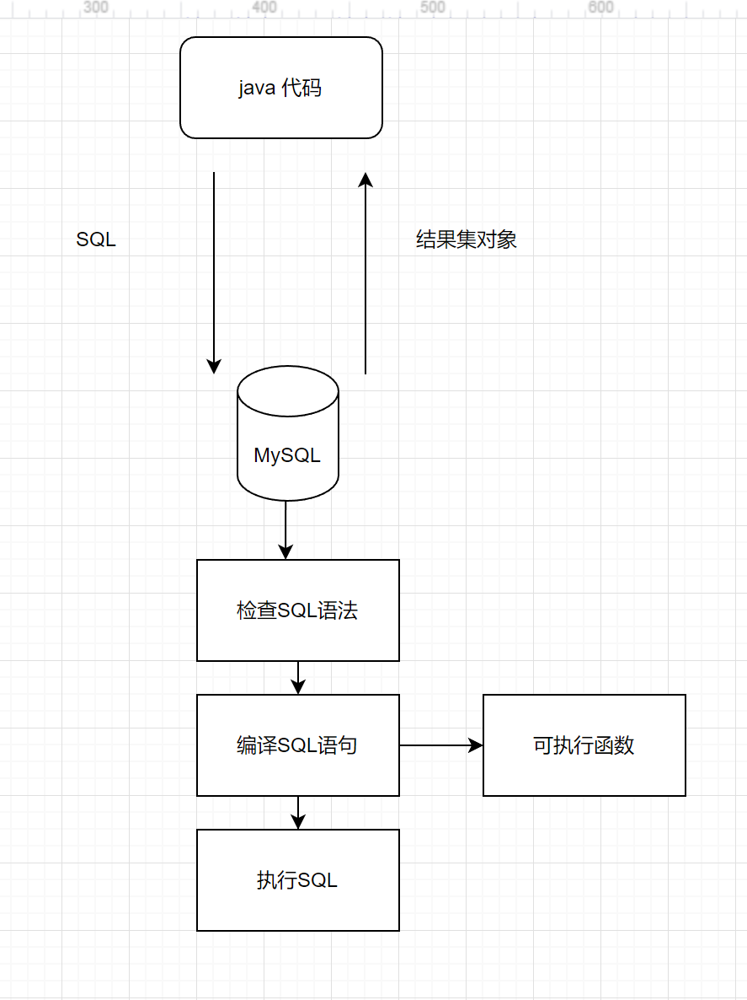
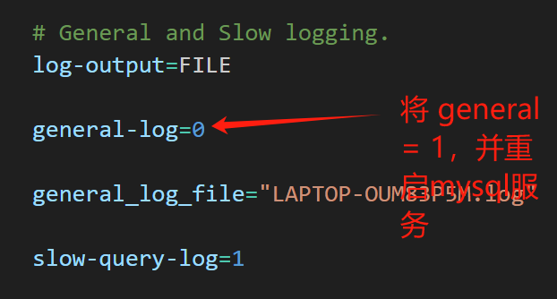
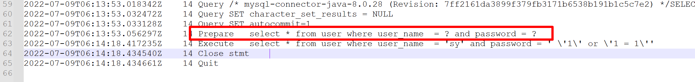

# JDBC API 详细讲解

## 一、下载驱动包

MAVEN地址

```java
地址：https://mvnrepository.com
```

## 二、加载与注册驱动

### 1.使用DriverManager类

### 2.方式

​		方法一：

- ```java
  Class.forName(“com.mysql.cj.jdbc.Driver”);
  ```

  方法二：
  
- ```java
  Driver driver = new com.mysql.cj.jdbc.Driver();
  DriverManager.registerDriver(driver);  // 可以不写java底层自动帮你注册了
  ```
  
  方法三：
  
- ```java
  System.setProperty("jdbc.drivers","com.mysql.cj.jdbc.Driver");
  ```
  
  

​			

### 3.补充：

- Mysql 驱动包是5之后的版本，可以去**省略注册驱动的步骤**

  

  

  

## 三、建立连接

### 1.URL

1.1 连接路径

1.2 参数说明

```sql
String url = "jdbc:mysql://localhost:3306/jdbc";
```

1.3 JDBC URL 的标准由三部分组成（jdbc：子协议：子名称），各部分之间用：隔开

- 协议：JDBC URL 中的协议就是 jdbc

- 子协议：用来标识数据库驱动程序

- 子名称：标识数据库的方法。定位数据库需要 ip,端口port，数据库名称

  

1.4 常见数据库的JDBC URL

- Oracle jdbc:oracle:thin:@主机名称：oracle服务端口：Databasename=数据库名称

### 2.建立连接方式

- Properties

  ```java
  String url = "jdbc:mysql://localhost:3306/jdbc";
  Properties properties = new Properties();
  properties.setProperty("user","root");
  properties.setProperty("password","123456");
  Connection connection = DriverManager.getConnection(url, properties);
  ```


### 3.事务管理

```sql
connection.setAutoCommit(false); // 开启事务

connection.commit();
```

### 4.获取 Statement 语句

1. 普通版本

   ```java
   Statement createStatement();
   ```

2. **防止 SQL 注入版本**

   ```java
   PreparedStatement connection.prepareStatement()
   ```

3. 获取存储过程

   ```java
   CallableStatement connection.prepareCall();
   ```

## 四、Statement

### 1.概述

1. Statement 对象的作用是用来执行 SQL语句，但是不同类型的 SQL语句执行语法又不太一样

   - 执行 DDL/**DML** 语句

     ```java
      int statement.executeUpdate()//会返回一个受影响行数
     ```

   - 执行 **DQL** 语句

     ```java
     ResultSet statement.executeQuery()//ResultSet 会返回一个结果集对象
     ```

     

## 五、ResultSet

### 1.概述

1. 封装了SQL查询结果

2. 执行结果集的方法

   ```sql
   ResultSet statement.executeQuery()//ResultSet 会返回一个结果集对象
   ```

### 2.ResultSet 提供的方法

- boolean next()
  - 将光标从当前位置向前移动一行
  - 判断当前行是否有效
  - 返回值 boolean 说明
    - true:有效，当前行有数据
    - false:无效，没有数据了
- xxx getXxx(参数)：获取数据
  - xxx ：数据类型（int getInt(参数)）
  - 参数
    - int 类型，列的标号，从1开始
    - String 类型，列的名称

### 3.代码实操

1. 需求：获取 account 表中的全部数据

2. 代码实现

   ```java
   		String url = "jdbc:mysql://localhost:3306/jdbc";
           Properties properties = new Properties();
           properties.setProperty("user","root");
           properties.setProperty("password","123456");
           Connection connection = DriverManager.getConnection(url, properties);
           Statement statement = connection.createStatement();
           //定义 sql
           String sql = "select * from account";
           ResultSet rs = statement.executeQuery(sql);
           //判断是否有下一行数据
   //        while (rs.next()){
   //            int id = rs.getInt(1);
   //            int money = rs.getInt(2);
   //            String userName = rs.getString(3);
   //            System.out.println("id:"+id+" money: "+money + " userName: "+userName);
   //        }
   
           while (rs.next()){
               int id = rs.getInt("id");
               int money = rs.getInt("money");
   //            String userName = rs.getString("user_name");
   //            System.out.println("id:"+id+" money: "+money + " userName: "+userName);
               System.out.println("id:"+id+" money: "+money );
           }
   
           //释放资源
           statement.close();
           connection.close();
   ```

   

## 六、SQL 注入问题

1. sql 注入(由于去改变sql 的语法结构导致的)

   ```sql
    String password = " '1' or '1 = 1'";
           //定义 sql
    String sql = "select * from user where user_name = '" +userName+"' and password = "+password +"";
   ```

   、

### 1.PreparedStatement 

1. 作用：预编译SQL语句并执行，预防SQL注入问题（需要手动开启预编译）

2. 获取PreparedStatement 对象(? 代表占位符)

   ```java
   String sql = "select * from user where user_name  = ? and password = ?";
   PreparedStatement preparedStatement = connection.prepareStatement(sql);
   ```

3. 设置参数值(获取sql 语句的时候使用？占用坑位了，那使用的时候就需要替换这些坑位)
   - setXxx(参数1，参数2)；给？赋值
   
   - 参数
     - 参数1：？的位置编号，从1开始
     - 参数2：？的值
     
   - 执行SQL语句的时候，就不需要传递SQL语句
   
     ```java
     ResultSet resultSet = preparedStatement.executeQuery();
     ```
   
     

### 2.PreparedStatement 原理



- java 将 sql 语句发送到 Mysql 服务器

- Mysql 操作

  - 检查SQL语句语法

  - 编译SQL语句，将SQL编译成可执行函数

    - 检查SQL和编译SQL时间比执行SQL时间还要长，使用预编译语句不需要重复检查SQL语句和编译，还可以提高性能

  - **PreparedStatement的预编译功能默认是关闭的**，要让其生效，必须在JDBC连接的URL设置`useServerPrepStmts=true`，让其打开

  - ```java
    useServerPrepStmts=true
    ```

  - 执行SQL

- 通过查询日志来看原理

  - **开启预编译功能（刚才只是解决了SQL注入问题，预编译还没开启）**
    - 开启：在url 加上如下参数 ？ userServerPrepstmts=true
  - 配置MySQL 执行日志
    - 重启mysql服务，在计算机中搜索服务
    - 
    - 
  
  
  
  
  
  


