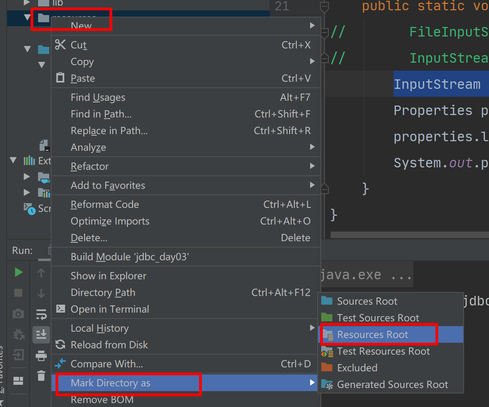

# 一、单元测试 Junit

## 1.概述

1. 定义：单元测试是针对最小的功能单元做测试代码用的，最小的功能单元是方法，单元测试就是针对于方法的测试。
2. 为什么要使用单元测试：java 中只能有一个 main方法。
3. 使用单元测试的优点：能够让单个方法顺利执行。

## 2.使用

1. 使用注解 @Test 直接放在方法上

   ```java
   @Test
   public void testJunit(){
       System.out.println("-----");
   }
   ```

2. 添加 junit 依赖到classpath


# 二、优化 JDBC 配置

## 1.反射回顾

1. 使用反射操作配置文件给类赋值（set get）
   - 配置文件 properties
   - 使用反射获取配置文件中的内容
   - 可以设置到相应的实体

## 2.优化 JDBC 配置

### 2.1新建配置文件 db.properties

### 2.2获取 db.properties 中的内容

```java
InputStream in = Env.class.getClassLoader().getResourceAsStream("db.properties");
```




### 2.3 建立获取连接的工具类

```java
 public static Connection getConnections() {
//        FileInputStream in = new FileInputStream("D:\\JDBC\\jdbc\\jdbc_day03\\src\\cn\\sycoder\\config\\db.properties");
//        InputStream in = Thread.currentThread().getContextClassLoader().getResourceAsStream("cn\\sycoder\\config\\db.properties");
        InputStream in = Env.class.getClassLoader().getResourceAsStream("db.properties");
        Properties properties = new Properties();
        try {
            properties.load(in);
        } catch (IOException e) {
            e.printStackTrace();
        }
        try {
            Class.forName(properties.getProperty("driverClassName"));
            Connection connection = DriverManager.getConnection(properties.getProperty("url"), properties.getProperty("username"), properties.getProperty("password"));
            return connection;
        } catch (Exception e) {
            e.printStackTrace();
        }
        throw new RuntimeException("连接获取异常");

    }
```

# 三、JDBC操作CRUD

## 1.建用户表

```sql
create table user_test
(
	id bigint auto_increment,
	name varchar(64) null,
	age int null comment '年龄',
	address varchar(128) null,
	sex char null,
	constraint user_test_pk
		primary key (id)
);


```

## 2.查询用户表中的数据

```java
public List<User> queryList(){
        //返回对象
        List<User> list = new ArrayList<>();
        Connection connections = DbUtil.getConnections();
        String sql = "select * from user_test";
        PreparedStatement statement = null;
        ResultSet resultSet = null;
        try {
            //获取预编译语句
            statement = connections.prepareStatement(sql);
            //执行查询操作
            resultSet = statement.executeQuery();
           while (resultSet.next()){
               User user = new User();
               long id = resultSet.getLong(1);
               String name = resultSet.getString(2);
               int age = resultSet.getInt(3);
               String address = resultSet.getString(4);
               String sex = resultSet.getString(5);

               user.setId(id);
               user.setAddress(address);
               user.setAge(age);
               user.setName(name);
               user.setSex(sex);
               list.add(user);
           }


        } catch (SQLException throwables) {
            throwables.printStackTrace();
        }finally {
            if(resultSet != null){
                try {
                    resultSet.close();
                } catch (SQLException throwables) {
                    throwables.printStackTrace();
                }
            }
            if(statement !=null){
                try {
                    statement.close();
                } catch (SQLException throwables) {
                    throwables.printStackTrace();
                }
            }
            if(connections != null){
                try {
                    connections.close();
                } catch (SQLException throwables) {
                    throwables.printStackTrace();
                }
            }
        }
        return list;
    }
```

## 3.向数据库中添加数据

```java
public int insert(User user){
        String sql = "insert into user_test(name,age,address,sex) values(?,?,?,?)";
        Connection connections = DbUtil.getConnections();
        PreparedStatement statement = null;
        try {
            statement = connections.prepareStatement(sql);
            statement.setString(1,user.getName());
            statement.setInt(2,user.getAge());
            statement.setString(3,user.getAddress());
            statement.setString(4,user.getSex());

            int count = statement.executeUpdate();
            return count;
        } catch (SQLException throwables) {
            throwables.printStackTrace();
        }finally {
            if(statement != null){
                try {
                    statement.close();
                } catch (SQLException throwables) {
                    throwables.printStackTrace();
                }
            }
            if(connections != null){
                try {
                    connections.close();
                } catch (SQLException throwables) {
                    throwables.printStackTrace();
                }
            }
        }
        throw new RuntimeException("插入失败");
    }
```

## 4.jdbc 修改如下信息

```java
 public int update(User user){
//        1.将编号为2的地址改成成都
//        2.将编号为3的年龄增加1岁

        String sql = "update user_test set name = ? ,age = ?,address = ?,sex=? where id = ?;";
        Connection connections = DbUtil.getConnections();
        PreparedStatement statement = null;
        try {
            statement = connections.prepareStatement(sql);
            statement.setString(1,user.getName());
            statement.setInt(2,user.getAge());
            statement.setString(3,user.getAddress());
            statement.setString(4,user.getSex());
            statement.setLong(5,user.getId());

            int count = statement.executeUpdate();
            return count;
        } catch (SQLException throwables) {
            throwables.printStackTrace();
        }finally {
            if(statement != null){
                try {
                    statement.close();
                } catch (SQLException throwables) {
                    throwables.printStackTrace();
                }
            }
            if(connections != null){
                try {
                    connections.close();
                } catch (SQLException throwables) {
                    throwables.printStackTrace();
                }
            }
        }
        throw new RuntimeException("更新失败");
    }
```


## 5.删除用户信息

```java
public int delete(Long id){

        String sql = "delete from user_test where id = ?";
        Connection connections = DbUtil.getConnections();
        PreparedStatement statement = null;
        try {
            statement = connections.prepareStatement(sql);
            statement.setLong(1,id);


            int count = statement.executeUpdate();
            return count;
        } catch (SQLException throwables) {
            throwables.printStackTrace();
        }finally {
            if(statement != null){
                try {
                    statement.close();
                } catch (SQLException throwables) {
                    throwables.printStackTrace();
                }
            }
            if(connections != null){
                try {
                    connections.close();
                } catch (SQLException throwables) {
                    throwables.printStackTrace();
                }
            }
        }
        throw new RuntimeException("删除失败");
    }
```

## 6.在Dbutils工具类中添加close方法

```java
public static void close(PreparedStatement statement, Connection connection, ResultSet resultSet){

        if(resultSet != null){
            try {
                resultSet.close();
            } catch (SQLException throwables) {
                throwables.printStackTrace();
            }
        }
        if(statement !=null){
            try {
                statement.close();
            } catch (SQLException throwables) {
                throwables.printStackTrace();
            }
        }
        if(connection != null){
            try {
                connection.close();
            } catch (SQLException throwables) {
                throwables.printStackTrace();
            }
}
```

## 7.也可利用try(){}catch{};自动关闭资源

```java
 try (
	Connection connections = DbUtil.getConnections();
	PreparedStatement statement = connections.prepareStatement(sql);
	ResultSet resultSet = statement.executeQuery();
                ){
           ....
      }
```

