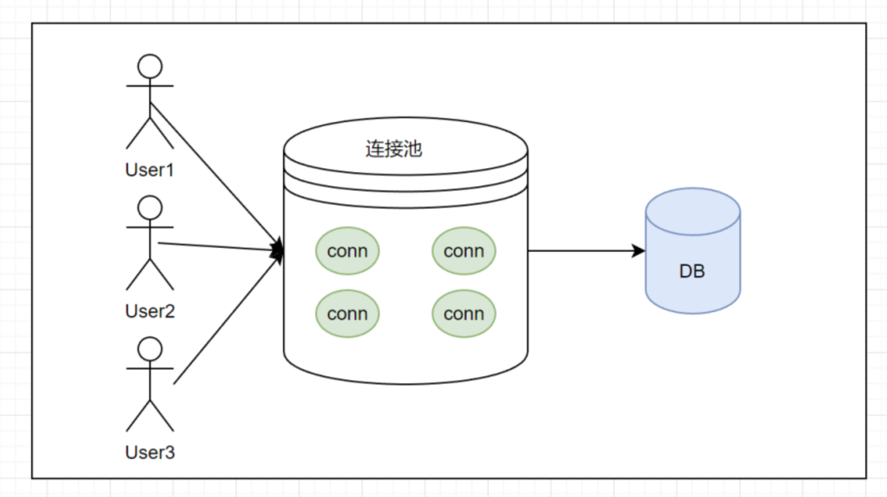
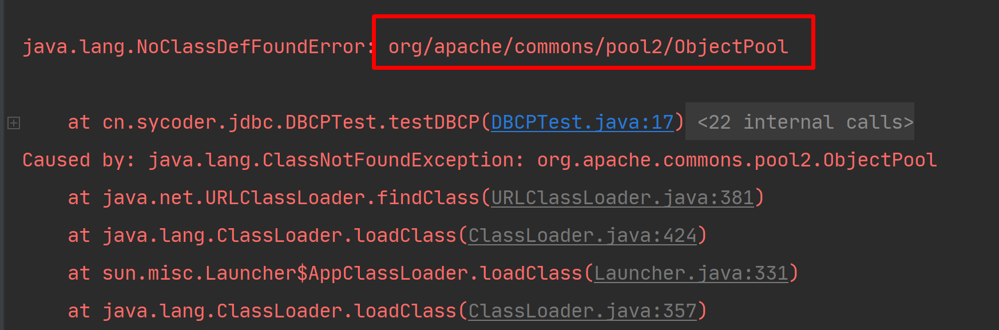
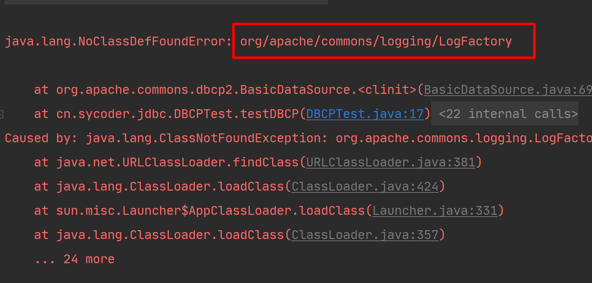
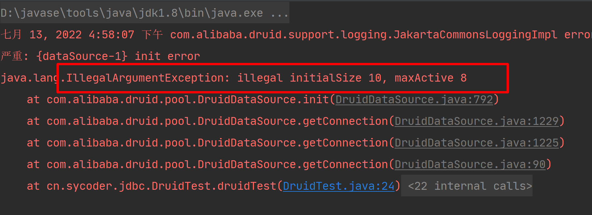

# 数据库连接池

## 一、没使用数据库连接池之前

### 1.步骤

- 在程序中获取连接
- 进行sql 操作
- 断开连接

### 2.存在问题

- 使用DriverManager 来获取连接的，每次向数据库建立连接的时候都需要将 Connection 对象加载到内存中，还需要验证账号和密码。每次建立连接和关闭资源都需要消耗资源。
- 若服务器有几百人或者几千人同时去获取连接关闭连接，可能会导致服务器崩溃。
- 这种开发方式不能去管理创建的连接对象，分配资源没有管理能力。可能会导致内存泄露服务崩溃。
- 如果建立连接之后不去断开，会导致内存泄露，导致需要重启mysql服务器。

## 二、连接池概述

### 1.概述

- 数据库的连接池就是一个容器，负责分配管理数据库的连接。
- 允许应用程序重复使用现有的数据库连接，不需要新建。
- 关闭资源时间超过了最大空闲时间的时候，数据库会释放。

### 2.意义

- 资源重用
- 提升系统的性能
- 避免数据库连接的泄露



## 三、连接池的实现

### 1.连接池介绍

- 通过标准接口 DataSource

- SUN 公司提供的数据库连接池的标准接口，由第三方组织实现这个接口，接口里面定义了获取连接的功能。

  ```java
  Connection getConnection;
  ```

- **注意：以后不需要用 DriverManager 对象去获取连接对象 Connection,通过 DataSource 获取。**

### 2.常用的连接池

- DBCP
  - Apache 提供的数据库连接池，速度相对于 C3P0 较快
  - https://commons.apache.org/proper/commons-dbcp/download_dbcp.cgi
  
- C3P0
  - 速度相对较慢，稳定性可以，Hibernate 官方推荐使用
  
  - 1.下载地址 https://sourceforge.net/projects/c3p0/
  
    2.文档 https://www.mchange.com/projects/c3p0/
  
- **Druid**（德鲁伊）
  - 阿里提供的数据库连接池，是集所有这些连接池有点于一身，速度不一定是最快的，但是确实是现在企业使用最多的。
  - https://github.com/alibaba/druid

## 四、配置连接池

#### 1.配置DBCP连接池

- DBCP 是 Apache 开源连接池实现，在使用之前需要先导入依赖。（Tomcat 的连接池就是使用DBCP实现的）

##### 1.1 DBCP 配置

```java
dbcp连接池常用基本配置属性

1.initialSize ：连接池启动时创建的初始化连接数量（默认值为0）

2.maxActive ：连接池中可同时连接的最大的连接数（默认值为8，调整为20，高峰单机器在20并发左右，自己根据应用场景定）

3.maxIdle：连接池中最大的空闲的连接数，超过的空闲连接将被释放，如果设置为负数表示不限制（默认为8个，maxIdle不能设置太小，因为假如在高负载的情况下，连接的打开时间比关闭的时间快，会引起连接池中idle的个数 上升超过maxIdle，而造成频繁的连接销毁和创建，类似于jvm参数中的Xmx设置)

4.minIdle：连接池中最小的空闲的连接数，低于这个数量会被创建新的连接（默认为0，调整为5，该参数越接近maxIdle，性能越好，因为连接的创建和销毁，都是需要消耗资源的；但是不能太大，因为在机器很空闲的时候，也会创建低于minidle个数的连接，类似于jvm参数中的Xmn设置）

5.maxWait  ：最大等待时间，当没有可用连接时，连接池等待连接释放的最大时间，超过该时间限制会抛出异常，如果设置-1表示无限等待（默认为无限，调整为60000ms，避免因线程池不够用，而导致请求被无限制挂起）

6.poolPreparedStatements：开启池的prepared（默认是false，未调整，经过测试，开启后的性能没有关闭的好。）

7.maxOpenPreparedStatements：开启池的prepared 后的同时最大连接数（默认无限制，同上，未配置）

8.minEvictableIdleTimeMillis  ：连接池中连接，在时间段内一直空闲， 被逐出连接池的时间

9.removeAbandonedTimeout  ：超过时间限制，回收没有用(废弃)的连接（默认为 300秒，调整为180）

10.removeAbandoned  ：超过removeAbandonedTimeout时间后，是否进 行没用连接（废弃）的回收（默认为false，调整为true)
```

##### 1.2出现异常 

​	都是缺少对应的jar包，从Meaven仓库中下载





##### 1.3 配置笔记

| 属性名称                   | 文字说明                                                     |
| -------------------------- | ------------------------------------------------------------ |
| initialSize                | 连接池启动时创建的初始化连接数量（默认值为0）                |
| maxActive                  | 连接池中可同时连接的最大的连接数（默认值为8，调整为20，高峰单机器在20并发左右，自己根据应用场景定） |
| maxIdle                    | 连接池中最大的空闲的连接数，超过的空闲连接将被释放，如果设置为负数表示不限制（默认为8个，maxIdle不能设置太小，因为假如在高负载的情况下，连接的打开时间比关闭的时间快，会引起连接池中idle的个数 上升超过maxIdle，而造成频繁的连接销毁和创建，类似于jvm参数中的Xmx设置) |
| minIdle                    | 连接池中最小的空闲的连接数，低于这个数量会被创建新的连接（默认为0，调整为5，该参数越接近maxIdle，性能越好，因为连接的创建和销毁，都是需要消耗资源的；但是不能太大，因为在机器很空闲的时候，也会创建低于minidle个数的连接，类似于jvm参数中的Xmn设置） |
| maxWait                    | 最大等待时间，当没有可用连接时，连接池等待连接释放的最大时间，超过该时间限制会抛出异常，如果设置-1表示无限等待（默认为无限，调整为60000ms，避免因线程池不够用，而导致请求被无限制挂起） |
| poolPreparedStatements     | 开启池的prepared（默认是false，未调整，经过测试，开启后的性能没有关闭的好。） |
| maxOpenPreparedStatements  | 开启池的prepared 后的同时最大连接数（默认无限制，同上，未配置） |
| minEvictableIdleTimeMillis | 连接池中连接，在时间段内一直空闲， 被逐出连接池的时间        |
| removeAbandonedTimeout     | 超过时间限制，回收没有用(废弃)的连接（默认为 300秒，调整为180） |
| removeAbandoned            | 超过removeAbandonedTimeout时间后，是否进 行没用连接（废弃）的回收（默认为false，调整为true) |

##### 1.4实现方式1

```java
 public void testDBCP() throws SQLException {
        BasicDataSource source = new BasicDataSource();
        source.setDriverClassName("com.mysql.cj.jdbc.Driver");
        source.setUrl("jdbc:mysql://localhost:3306/jdbc");
        source.setUsername("root");
        source.setPassword("123456");
        source.setInitialSize(10);

        Connection connection = source.getConnection();
        System.out.println(connection);
    }
```

##### 1.5实现方式2

```java
public void testDBCP2() throws Exception {
        Properties properties = new Properties();
        InputStream in = 	Thread.currentThread().getContextClassLoader().getResourceAsStream("db.properties");
        properties.load(in);

        BasicDataSource dataSource = BasicDataSourceFactory.createDataSource(properties);
        Connection connection = dataSource.getConnection();
        System.out.println(connection);
    }
```

```java
url=jdbc:mysql://localhost:3306/jdbc
username=root
password=123456
driverClassName=com.mysql.cj.jdbc.Driver
initialSize=10
```

##### 1.6 设计数据库池工具类

```java
 private static DataSource dataSource = null; 
    
    static {
        Properties properties = new Properties();
        InputStream in = Thread.currentThread().getContextClassLoader().getResourceAsStream("db.properties");
        try {
            properties.load(in);
        } catch (IOException e) {
            e.printStackTrace();
        }

        try {
            dataSource = BasicDataSourceFactory.createDataSource(properties);
        } catch (Exception e) {
            e.printStackTrace();
        }
    }
    
    public static Connection getConn() throws SQLException {
        Connection connection = dataSource.getConnection();
        System.out.println(connection);
        return connection;
    }
```

#### 2.C3P0连接池

```java
ComboPooledDataSource cpds = new ComboPooledDataSource();
        cpds.setDriverClass( "com.mysql.cj.jdbc.Driver" ); //loads the jdbc driver
        cpds.setJdbcUrl( "jdbc:mysql://localhost:3306/jdbc" );
        cpds.setUser("root");
        cpds.setPassword("123456");

        Connection connection = cpds.getConnection();

```


```java
  ComboPooledDataSource dataSource = new ComboPooledDataSource("sytest");

    @Test
    public void testC3P01() throws PropertyVetoException, SQLException {

        Connection connection = dataSource.getConnection();
        System.out.println(connection);

    }
```

#### 3.Druid （德鲁伊）连接池

- 德鲁伊是阿里开源的性能非常好的连接池

  

  ```java
  public void druidTest() throws Exception {
          Properties properties = new Properties();
          InputStream in = Thread.currentThread().getContextClassLoader().getResourceAsStream("db.properties");
          properties.load(in);
          DataSource dataSource = DruidDataSourceFactory.createDataSource(properties);
          Connection connection = dataSource.getConnection();
          System.out.println(connection);
      }
  ```

  

