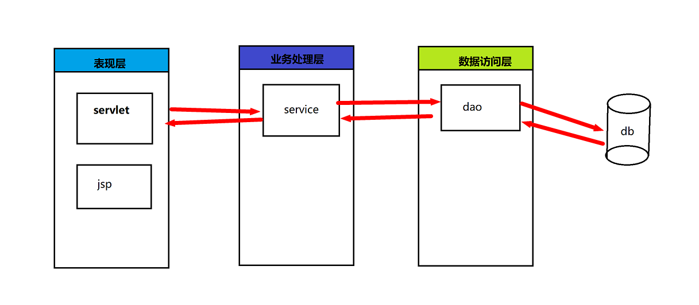

# 一、MVC 模式

- MVC 是一种分层开发的思想
  - M：Model 数据模型
    - 职责：管理应用程序的数据和业务逻辑。
    - 内容：通常包括数据库交互、数据验证和业务规则等。
    - 特点：模型是独立的，可以被多个视图共享。
  - V：View,视图页面
    - 职责：负责数据的展示和用户界面的渲染。
    - 内容：从模型获取数据，并将其展示给用户。
    - 特点：视图通常只包含与用户界面相关的代码，不包含业务逻辑。
  - C：Ctroller,控制器，处理器
    - 职责：处理用户输入，协调模型和视图之间的交互。
    - 内容：接收用户的请求（如点击按钮、输入数据等），调用模型来处理请求，然后选择合适的视图来展示结果。
    - 特点：控制器是模型和视图之间的桥梁，负责将用户的请求转发到模型，并将处理结果传递给视图。

- 意义：
  - 职责单一，低耦合，方便后期迭代升级

# 二、三层架构

- 三层架构是将我们的项目分成了三个层面，分别是 表现层 、 业务逻辑层 、 数据访问层

  

  - **db**:存储数据的
  - **dao**:操作数据库的
  - **service**:处理逻辑业务的
  - **controller**:处理请求，响应数据

### 一、表示层（UI层）

- **职责**：
  - 负责处理用户界面和用户交互。
  - 接收用户的输入，并将其传递给业务逻辑层。
  - 显示业务逻辑层返回的数据。
- **技术实现**：
  - 在Web应用中，表示层可能包括HTML、CSS、JavaScript、JSP、Servlets、Thymeleaf、Angular、React等技术。
  - 在桌面应用中，可能使用JavaFX、Swing、WPF等技术。

### 二、业务逻辑层（BLL）

- **职责**：
  - 处理应用程序的业务逻辑。
  - 执行数据验证、计算和流程控制。
  - 决定数据如何传递和处理。
  - 充当表示层和数据访问层之间的桥梁。
- **技术实现**：
  - 可能使用Java中的Spring、EJB等技术。
  - 或使用.NET中的ASP.NET、WCF等技术。

### 三、数据访问层（DAL）

- **职责**：
  - 负责与数据库或其他数据存储系统进行交互。
  - 执行CRUD操作（创建、读取、更新、删除）。
  - 将数据存储在数据库中或从数据库中检索数据。
  - 将数据库特定的操作抽象化，使业务逻辑层不需要直接与数据库打交道。
- **技术实现**：
  - 可能使用JDBC、Hibernate、JPA、MyBatis等技术。

### 四、三层架构的优点

1. **模块化**：通过将应用程序划分为不同的层次，实现了代码的模块化和分离，使得系统更易于维护和扩展。
2. **清晰的职责划分**：每个层次的职责明确，代码结构清晰，使得系统的维护和修改更加简单和可靠。
3. **松耦合**：各个层次之间的松散耦合，可以方便地扩展和替换某个层次的实现，而不影响其他层次的功能。
4. **独立测试**：每个层次都可以独立测试，方便进行单元测试和集成测试，提高系统的质量和稳定性。
5. **复用性**：业务逻辑层和数据访问层可以被多个表示层复用，提高了代码的复用性。

### 五、三层架构的应用场景

三层架构广泛应用于各种软件开发项目，特别是企业级应用和大型系统。它可以提供良好的代码组织结构和分层设计，使得开发团队更加高效和协作。在实际应用中，可以根据具体需求和规模，进行三层架构的定制和扩展。例如，可以引入缓存层、消息队列、分布式计算等技术，来提高系统的性能和可伸缩性。