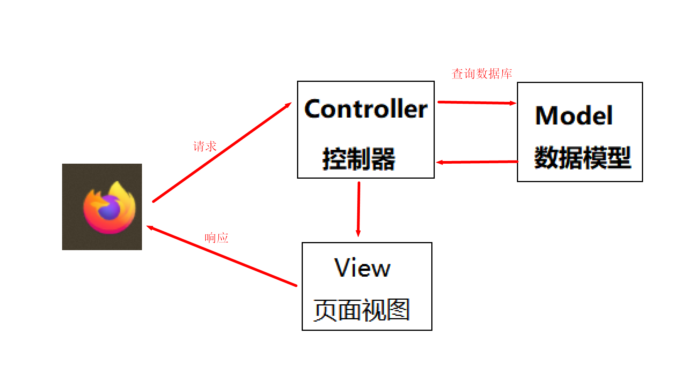

# 一、jsp

## 1.jsp 概述

- jsp 概述：JSP全称Java Server Pages，是一种动态网页开发技术。**jsp = 静态页面 + java 动态展示**

- html 中添加 jsp

  ```html
  <html>
  <body>
  <h2>Hello World!</h2>
  </body>
  <h1>欢迎来到 jsp</h1>
      <%
          System.out.println("======== jsp");
      %>
  </html>
  ```

- 思考？

  - 与纯 Servlet 相比：JSP可以很方便的编写或者修改HTML网页而不用去面对大量的println语句
  - 与JavaScript相比：虽然JavaScript可以在客户端动态生成HTML，但是很难与服务器交互，因此不能提供复杂的服务，比如访问数据库和图像处理等等
  - 与静态HTML相比：静态HTML不包含动态信息

  

  - 使用servlet 实现

    

    

    

  

  

- 使用 jsp 实现

  

## 2.简单使用

- 乱码问题

  ```jsp
  <%@ page contentType="text/html;charset=UTF-8" language="java" %>
  ```

## 3.jsp 原理

- **JSP是一种Java servlet**，主要用于实现Java web应用程序的用户界面部分。网页开发者们通过结合HTML代码、XHTML代码、XML元素以及嵌入JSP操作和命令来编写JS

- 寻找jsp 生成 servlet 代码路径

  ```java
  apache-tomcat-9.0.67\work\Catalina\localhost\ROOT\org\apache\jsp
  ```

- 下载tomcat 的源码才能找到依赖关系

  

  

  > 可以发现HttpJspBase 继承HttpServlet 可以得出  **JSP是一种Java servlet**

  

- 通过jsp 我们可以少写很多 html 响应出去的代码

  


## 4.JSP 生命周期

> JSP生命周期就是从创建到销毁的整个过程，类似于servlet生命周期，区别在于JSP生命周期还包括将JSP文件编译成servlet。

- ##### 编译阶段：

  servlet容器编译servlet源文件，生成servlet类

- ##### 初始化阶段：

  加载与JSP对应的servlet类，创建其实例，并调用它的初始化方法

- ##### 执行阶段：

  调用与JSP对应的servlet实例的服务方法

- ##### 销毁阶段：

  调用与JSP对应的servlet实例的销毁方法，然后销毁servlet实例

## 5.jsp内置对象

在JSP中，有一些预定义的对象，称为内置对象或隐式对象，这些对象可以直接在JSP页面中使用，无需显式声明。这些内置对象为开发者提供了便利，可以简化Web应用的开发过程。

1. **request**：代表客户端的请求，此对象包含了来自客户端的信息，如请求头、请求参数等。通过它可以获取用户提交的数据。
2. **response**：代表服务器对客户端的响应。可以通过它来设置响应头、状态码和响应体的内容。
3. **out**：用于向客户端输出数据。这是一个`javax.servlet.jsp.JspWriter`类型的对象，可以用来向客户端发送文本数据。
4. **session**：代表用户的会话信息。每个访问者都会有一个唯一的session对象，可以用来存储特定于用户的属性或信息。
5. **application**：代表整个Web应用程序，实际上是一个`ServletContext`对象。它可以用来存储所有用户共享的信息。
6. **config**：代表Servlet的配置信息，即`ServletConfig`对象。可以用来获取初始化参数。
7. **pageContext**：提供了一个访问JSP页面中所有其他对象的方法，如request、response等。此外，它还提供了一系列方法来处理页面的输出和错误信息。
8. **page**：代表当前的JSP页面本身，实际上是指向该页面对应的Servlet实例的引用。通常不直接使用这个对象。
9. **exception**：当JSP页面发生异常时，可以通过这个对象获取到异常信息。只有在错误页面中才能使用这个对象，即设置了`<%@ page isErrorPage="true" %>`的页面。

## 5.jsp 语法

### 1.脚本程序

- 脚本内容直接放到_jspService

  ```jsp
  <% 代码片段 %>
  ```

  ```java
  <jsp:scriptlet>
     代码片段
  </jsp:scriptlet>
  ```

  ```java
  <%
      System.out.println("======== jsp");
  %>
  ```

- 放到 servlet 类里面

  ```java
  <%! declaration; [ declaration; ]+ ... %>
  ```

  ```java
  <%!
  
      void eat(){
          System.out.println("-----------------");
      }
  
      int age = 18;
      String name = "sy";
  
  %>
  ```


- 内容放到打印方法中去,直接打印

  ```java
  <%= 表达式 %>
  ```

  ```java
  <%= "<h3> 这里是 打印内容</h3>"%>
  ```

### 2.jsp 注释


### 3.jsp 指令


### 4.jsp 隐含对象


## 6.jsp 练习

| id   | 商品名称 | 价格 |
| ---- | -------- | ---- |
| 1    | 电脑     | 5000 |
| 2    | 平板     | 2000 |
| 3    | 鼠标     | 200  |

```jsp
<%--
  Created by IntelliJ IDEA.
  User: admin
  Date: 2022/10/10
  Time: 14:12
  To change this template use File | Settings | File Templates.
--%>
<%@ page contentType="text/html;charset=UTF-8" language="java" %>
<%@page import="cn.sycoder.Product" %>
<%@ page import="java.util.ArrayList" %>
<%@ page import="java.util.List" %>	
<html>
<head>
    <title>商品练习</title>
</head>
<%
    //模拟从数据库取数据出来
    List<Product> list = new ArrayList();
    list.add(new Product("电脑", 1, 5000));
    list.add(new Product("手机", 2, 6000));
    list.add(new Product("平板", 3, 1000));
    list.add(new Product("鼠标", 4, 200));
    list.add(new Product("键盘", 5, 2000));


%>
<body>
<table border="1" cellspacing="0" width="500px">
    <tr>
        <th>id</th>
        <th>商品名称</th>
        <th>价格</th>
        <th>操作</th>
    </tr>
    <%
        for (int i = 0; i < list.size(); i++) {
            Product product = list.get(i);
    %>
    <tr align="center">
        <td><%=product.getId()%>
        </td>
        <td><%=product.getName()%>
        </td>
        <td><%=product.getPrice()%>
        </td>
        <td><a href="#">编辑</a><a href="#">删除</a></td>
    </tr>
    <%
        }
    %>
 
</table>
</body>
</html>

```

- 存在问题
  - 书写特别垃圾恶心
  - 阅读也很恶心
  - 调试 dbug 难
- **由于这些问题，jsp 淘汰了**

## 7.el 表达式

- EL（全称Expression Language ）表达式语言，用于简化 JSP 页面内的 Java 代码

  - EL表达式主要是用来获取数据的。

- 语法

  ```jsp
  ${表达式}
  ```

- **默认 el 表达式已经被禁用了，需要使用需要手动开启**

  ```jsp
  <%@page isELIgnored="true" %>
  ```


### 1.域对象

- page:页面实例的引用,当前页面

- request对象:代表这个请求，表示请求

- session对象：跟踪在各个客户端请求间的会话，表示会话

- application对象：当前的程序中

  

## 8.jstl 标签

- JSP标准标签库（JSTL）是一个JSP标签集合，它封装了JSP应用的通用核心功能。

- 导入依赖

  ```xml
  <dependency>
      <groupId>jstl</groupId>
      <artifactId>jstl</artifactId>
      <version>1.2</version>
  </dependency>
  
      <dependency>
        <groupId>taglibs</groupId>
        <artifactId>standard</artifactId>
        <version>1.1.2</version>
      </dependency>
  ```

- 循环标签

  ```java
  <%@ taglib uri="http://java.sun.com/jsp/jstl/core" prefix="c" %>
      
  <c:forEach items="${product}" var="i" begin="1" end="5">
          <tr align="center">
              <td>${i.id}
              </td>
              <td>${i.name}
              </td>
              <td>${i.price}
              </td>
              <td><a href="#">编辑</a><a href="#">删除</a></td>
          </tr>
      </c:forEach>
  ```

- 条件表达标签：模拟是否登录

  

# 二、MVC 模式

- MVC 是一种分层开发的思想
  - M：Model 数据模型
    - 职责：管理应用程序的数据和业务逻辑。
    - 内容：通常包括数据库交互、数据验证和业务规则等。
    - 特点：模型是独立的，可以被多个视图共享。
  - V：View,视图页面
    - 职责：负责数据的展示和用户界面的渲染。
    - 内容：从模型获取数据，并将其展示给用户。
    - 特点：视图通常只包含与用户界面相关的代码，不包含业务逻辑。
  - C：Ctroller,控制器，处理器
    - 职责：处理用户输入，协调模型和视图之间的交互。
    - 内容：接收用户的请求（如点击按钮、输入数据等），调用模型来处理请求，然后选择合适的视图来展示结果。
    - 特点：控制器是模型和视图之间的桥梁，负责将用户的请求转发到模型，并将处理结果传递给视图。



- 意义：
  - 职责单一，低耦合，方便后期迭代升级

# 三、三层架构

- 三层架构是将我们的项目分成了三个层面，分别是 表现层 、 业务逻辑层 、 数据访问层

  

  - **db**:存储数据的
  - **dao**:操作数据库的
  - **service**:处理逻辑业务的
  - **controller**:处理请求，响应数据

### 一、表示层（UI层）

- **职责**：
  - 负责处理用户界面和用户交互。
  - 接收用户的输入，并将其传递给业务逻辑层。
  - 显示业务逻辑层返回的数据。
- **技术实现**：
  - 在Web应用中，表示层可能包括HTML、CSS、JavaScript、JSP、Servlets、Thymeleaf、Angular、React等技术。
  - 在桌面应用中，可能使用JavaFX、Swing、WPF等技术。

### 二、业务逻辑层（BLL）

- **职责**：
  - 处理应用程序的业务逻辑。
  - 执行数据验证、计算和流程控制。
  - 决定数据如何传递和处理。
  - 充当表示层和数据访问层之间的桥梁。
- **技术实现**：
  - 可能使用Java中的Spring、EJB等技术。
  - 或使用.NET中的ASP.NET、WCF等技术。

### 三、数据访问层（DAL）

- **职责**：
  - 负责与数据库或其他数据存储系统进行交互。
  - 执行CRUD操作（创建、读取、更新、删除）。
  - 将数据存储在数据库中或从数据库中检索数据。
  - 将数据库特定的操作抽象化，使业务逻辑层不需要直接与数据库打交道。
- **技术实现**：
  - 可能使用JDBC、Hibernate、JPA、MyBatis等技术。

### 四、三层架构的优点

1. **模块化**：通过将应用程序划分为不同的层次，实现了代码的模块化和分离，使得系统更易于维护和扩展。
2. **清晰的职责划分**：每个层次的职责明确，代码结构清晰，使得系统的维护和修改更加简单和可靠。
3. **松耦合**：各个层次之间的松散耦合，可以方便地扩展和替换某个层次的实现，而不影响其他层次的功能。
4. **独立测试**：每个层次都可以独立测试，方便进行单元测试和集成测试，提高系统的质量和稳定性。
5. **复用性**：业务逻辑层和数据访问层可以被多个表示层复用，提高了代码的复用性。

### 五、三层架构的应用场景

三层架构广泛应用于各种软件开发项目，特别是企业级应用和大型系统。它可以提供良好的代码组织结构和分层设计，使得开发团队更加高效和协作。在实际应用中，可以根据具体需求和规模，进行三层架构的定制和扩展。例如，可以引入缓存层、消息队列、分布式计算等技术，来提高系统的性能和可伸缩性。
