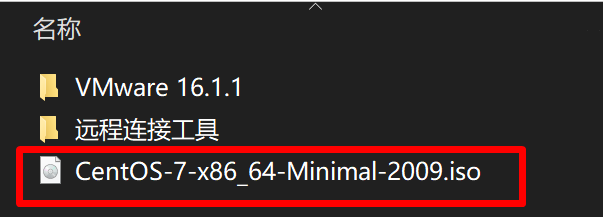
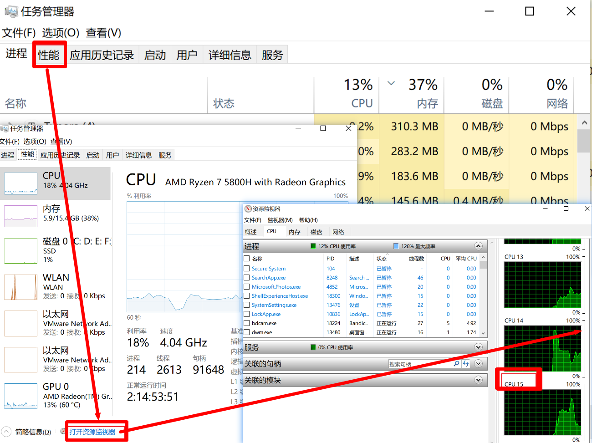
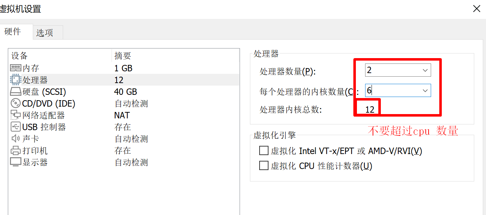
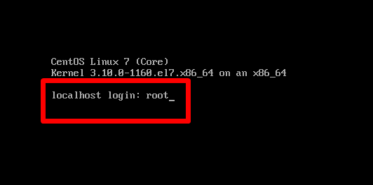
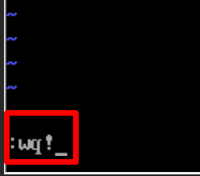

# 一、Linux 介绍

## 1.Linux 概述

**Linux：**是基于Unix的一个**开源、免费**的操作系统，其**稳定性、安全性、处理多并发**能力强，目前大多数企业级应用甚至是集群项目都部署运行在linux操作系统之上，在我国软件公司得到广泛的使用

**Unix：**是一个强大的多用户、多任务操作系统。于1969年在AT&T的贝尔实验室开发。UNIX的商标权由国际开放标准组织（The Open Group）所拥有。UNIX操作系统是商业版，需要收费，价格比 Windows 正版要贵一些 

## 2.Linux 发行版本

- Ubuntu(乌班图)

- RedHat(红帽)

- **CentOS**  

- Debain[蝶变]

- 红旗Linux(国产)

  

  

## 3.Linux 的应用

- 可以做为服务器部署javaweb 项目
- 桌面应用系统
- 数据库服务器
- 路由器、DNS

# 二、Linux 安装

- 阿里云的市场份额处于一种垄断地位的，比后面5面的市场总份额还要多，基本上的中小规模的企业都在使用阿里云

- 如果大家有**阿里云的学生服务器**，可以用阿里云的学生服务器

- 现在学习先用虚拟机安装 linux 做教学

  > Note:
  >
  > ​	当将阿里云作为服务器的时候，注意开发相应的端口，如3306（mysql）、8080（tomcat）
  >
  > ​	

## 1.VMware 安装

- 为什么使用VMware：一台电脑里面可以去装多个操作系统的，通过VMware来解决多个操作系统切换的问题。

### 1.1双击 VMware 安装包


### 1.2欢迎界面下一步


### 1.3接受许可证


### 1.4选择安装路径


### 1.5用户体验提升


### 1.6桌面快捷方式


### 1.7安装


### 1.8安装完成


### 1.9输入许可证


### 2.0成功与否判断


## 2.CentOS

### 2.1下载

- 官网地址：https://www.centos.org/download/

  

  - 寻找下载源

    

  - 常用下载仓库地址

    - http://mirrors.neusoft.edu.cn/centos/7.9.2009/isos/x86_64/
    - http://mirrors.aliyun.com/centos/7.9.2009/isos/x86_64/

    

  - 点击下载

    

    - 下载完成后的文件

    

    

### 2.2配置虚拟机

#### 2.2.1创建虚拟机


#### 2.2.2设置安装向导


#### 2.2.3选择客户机操作系统


#### 2.2.4修改虚拟机名称和路径


#### 2.2.5设置磁盘容量


#### 2.2.6配置处理器数量

- 进入任务管理器  ctrl + alt + delete

  

  

  

- 修改处理器数量

  

  

#### 2.2.7配置内存


#### 2.2.8使用自己下载的镜像文件


### 2.3开启虚拟机


### 2.4安装 CentOS


- 修改语言


- 修改日期


- 验证安装源

  

  

- 安装位置

  

  

  


- 设置密码 123456

  

- 重启

  


### 2.5鼠标控制

- ctrl + alt 鼠标可以出来操作
- ctrl + g 鼠标进入虚拟机

### 2.6Linux登录



- 敲回车输入密码 123456 就安装完成了


# 三、远程操作工具

## 1.配置ifconfig

### 1.1输入 ifconfig 查看 ip  的命令( ifconfig )


### 1.2搜索 ifconfig 命令（yum search ifconfig）


### 1.3配置网卡

- 进入如下目录配置网卡

  ```shell
  cd /etc/syscofig/network-scripts
  ```

- 编辑 ifcfg-ens33

  

  ```shell
  vi ifcfg-ens33
  ```

  

  

  - 按 i 键进入编辑模式

  

  - 按 esc 退出编辑模式，shift + : 输入 wq!  + enter 保存

    

- 重启网卡

  ```shell
  service network restart
  ```

  

### 1.4搜索 ifconfig 命令

```shell
yum search ifconfig
```


### 1.5安装 ifconfig 命令

```shell
yum install net-tools.x86_64
```


## 2.XShell 安装

### 2.1双击exe 文件


### 2.2安装向导


### 2.3许可证协议


### 2.4修改安装位置


### 2.5运行


# 四、Linux 目录结构


## 1.XShell 连接虚拟机

### 1.1查看虚拟机ip 地址（ifconfig）


### 1.2新建会话（右键）


### 1.3配置虚拟机CentOS 的ip


### 1.4输入账号密码


- 输入账号，点击记住密码


- 输入密码，点击记住密码


## 2.Linux 目录结构

### 2.1概述

**Linux没有炫目的可视化操作界面**，它的操作大部分都是**直接执行命令**，**而可执行文件都是保存在相应的目录中的**，所以我们对linux的操作大多数时候都是查找和执行这些可执行文件

linux的文件系统是**采用级层式的树状目录结构**，在此结构中的最上层是**根目录“/”**，然后在此目录下再创建其他的目录。


### 2.2目录结构详解

- **bin**：binaries 的缩写,是用来存放二进制的可执行文件的(cd ls )
- sbin：（super user binaries）存放的二进制可执行文件，只有 **root** 才能访问
- dev：（devices）用来存放设备文件
- home：存放用户文件的根目录
- mnt：（mount）超级管理员安装临时文件系统的安装点
- tmp：（temporary）临时文件存放点
- usr：（unix shared resources）存放共享系统资源
- boot：存放用于系统引导使用的文件
- etc：存放系统配置文件
- root：系统管理员的用户主目录
- lib：共享库，相当于 windows 的 dll 文件
- src：(service) 存放服务启动之后需要提取的数据
- proc：系统内存映射，虚拟的目录，进入目录可以看到系统信息
- **opt：额外安装软件的时候存放目录 **/usr/local
- **var**：存储不断增多的这种文件，比如日志文件
- run：系统运行时所需文件
- media：U盘，光盘临时放的目录

# 五、系统管理

## 1.Linux 用户管理

### 1.1概述

Linux系统是一个多用户多任务的操作系统，任何一个要使用系统资源的用户，都必须首先向系统管理员申请一个账号，然后以这个账号的身份进入系统。**root**用户是系统默认创建的管理员账号。

### 1.2添加用户

- 语法

  ```shell
  useradd [选项] 用户名 
  
  useradd -d /home/xx  wr 选项可以添加创建指定的目录文件夹
  ```

- 设置密码

  ```shell
  passwd 用户名
  ```

  

- 创建 sy 账户

  ```shell
  useradd sy
  
  passwd sy
  
  qwer1234
  ```

### 1.3删除用户

- 语法

  ```shell
  userdel[选项] 用户名
  ```

- 删除wr 用户

  ```shell
  userdel wr       // Only delete the content
  userdel -r wr   // The command will delete the content and its directory.
  ```

### 1.4查询用户

- 语法

  ```shell
  id 用户名
  ```

- 查询 sy 账户

  ```shell
  id sy
  ```

### 1.5切换用户(重点)

- **语法**

  ```shell
  su 用户名
  ```

- 切换到zs 账户

  ```shell
  su zs
  ```

- > Note: A high permission user does not need to enter a password to switch to a low permission user, but a low permission user will need to enter a password to switch to a high permission user

### 2.1Overview

Linux的组类似于**角色**，系统可以对有共性的多个用户进行统一的管理。每一个用户都至少属于一个组，创建用户时如果不指定组，会默认**创建一个跟用户名相同的组**，并且把新创建的用户分配到组中，root用户默认属于root组。

Linux groups are similar to  roles , and the system can centrally manage multiple users with common features. Each user belongs to at least one group. If you do not specify a group when creating a user, a group with the same name as the user is created by default, and the newly created user is assigned to the group.

### 2.2添加组

- 语法

  ```shell
  groupadd 组名
  ```

- 添加sy-group

  ```shell
  groupadd sy-group
  ```

  

### 2.3删除组

- 语法

  ```shell
  groupdel 组名
  ```

- 删除 sy-group 

  ```shell
  groupdel sy-group
  ```

### 2.4新添加用户属于某一组

- 语法

  ```shell
  useradd –g 组名 用户名
  ```

- 添加ww用户属于sy-group

  ```shell
  useradd -g sy-group ww
  ```

- 查看信息

  

### 2.5将用户从指定组删除

- 语法

  - -a 表示 add
  - -d 表示 delete

  ```shell
  gpasswd –a/-d 用户名 组名
  ```

- 将 ww 从 sy-group 删除

  ```shell
  gpasswd -a ww sy-group
  ```

- 查看所有组信息

  ```shell
  cat /etc/group
  ```

## 3.VI 与 VIM

### 3.1概述

- **vi编辑器：**是Linux和Unix上最基本的文本编辑器，工作在字符模式下。由于不需要图形界面，vi是效率很高的文本编辑器。

- **vim是：**vi的增强版，比vi更容易使用。vi的命令几乎全部都可以在vim上使用。

### 3.2 vi 和 vim 三种常见模式


- **一般模式**：以vi/vim 命令打开一个档案就直接进入一般模式了(这是默认的模式)
- **编辑模式**：按下i, I, o, O, a, A, r, R等任何一个字母之后才会进入编辑模式,，**通常使用 i**
- **命令模式**：在这个模式当中，可以提供你相关指令，完成读取、存盘、替换、离开vim 、显示行号等

### 3.3常用操作（重点）


- 命名行模式下 
  - 查找某一个单词 **/查找的单词**   :/ [words]
    - n 是下一个 
    - 大 N是上一个
    
  - 设置行号 set nu
  
    
  
  - 取消行号 set nonu
  
  - q 是退出文档
  
  - 保存文档 wq
  
  - ! 表示强制执行
  
- 一般模式下
  - 拷贝当前行yy  数字yy 拷贝当前光标往下的第几行
  - 粘贴下一行 p
  - u 是撤销
  - 删除当前行 dd
  - 跳转到文档最末行 G  ( shift + g)
  - 最首行 gg
  - 光标移动到具体行数 （行数）shift + g
  - 插入
    - O 是在下一行插入 o 是在上一行
    - i 是在本行插入
  - 快速移动 
    - end 快速跳转到行末
    - home 移动到头部
