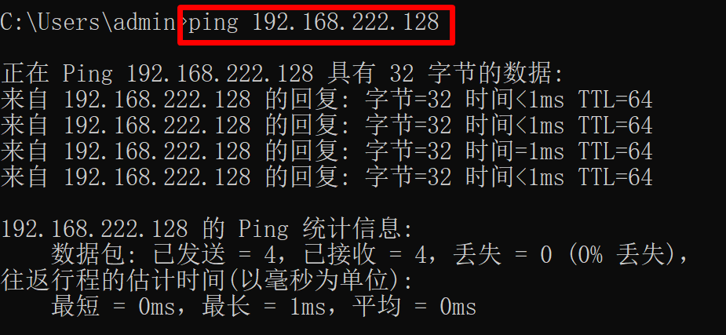
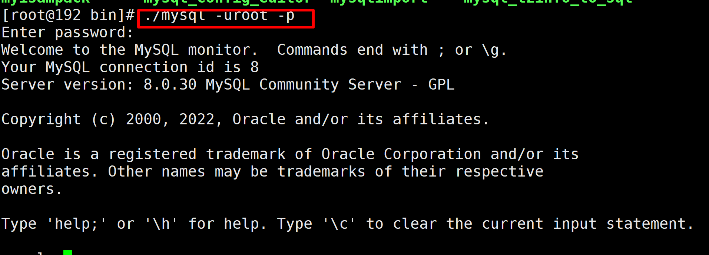

# 一、进程管理

## 1.概述

- **进程**是正在执行的**程序或命令**，**每一个进程都独立运行**，都有自己的地址空间，并占用一定的系统资源
- 以后开发会遇见：
  - 端口占用
  - 出现程序假死、卡死

## 2.PS查看系统运行进程

- 语法

  ```shell
  ps 参数
  ```

  - ps –a:显示当前终端下的所有进程信息
  - ps –u:以用户的格式显示进程信息
  - ps –x:显示后台进程运行的参数
  - ps –e:显示所有进程信息
  - ps –f:以全格式显示进程信息

- 常用命令

  - ps -ef | grep xxx
  - ps -aux | grep xxx

- ps -ef|grep xxx

  - ps -ef 操作

    

    

    | 信息  | 说明                                                         |
    | ----- | ------------------------------------------------------------ |
    | UID   | 用户id                                                       |
    | PID   | 进程id                                                       |
    | PPID  | 父进程id                                                     |
    | C     | cpu 计算优先级因子：值越大，表示密集型运算，优先级越低，值越小，i/o密集型，优先级越高 |
    | STIME | 进程启动时间                                                 |
    | TTY   | 终端名称                                                     |
    | TIME  | cpu 运行时间                                                 |
    | CMD   | 启动进程所用的命令和参数                                     |

- ps -aux|grep xxx

  - ps -aux

    

    | 信息  | 说明                                                         |
    | ----- | ------------------------------------------------------------ |
    | USER  | 进程产生的用户                                               |
    | PID   | 进程id                                                       |
    | %CPU  | cpu 执行占用%比                                              |
    | %MEM  | 内存占用率                                                   |
    | VSZ   | 占用虚拟内存大小KB                                           |
    | RSS   | 占用实际物理内存大小KB                                       |
    | TTY   | 终端名称                                                     |
    | STAT  | 进程状态 S:睡眠，R：运行，T：暂停，Z：僵尸状态，s:包含子进程，l:多线程 |
    | START | 进程启动时间                                                 |
    | TIME  | 进程占用CPU运算时间                                          |
    | CMD   | 运行命令                                                     |

## 3.kill 杀进程

- 语法

  ```shell
  kill [选项] pid
  ```

- 选项 -9 强制杀进程

- 演示杀进程

  ```shell
  kill -9 pid
  ```

## 4.top监控系统进程

- 语法

  ```shell
  top [选项]
  ```

- 选项

  - -d 秒  ：每隔几秒更新
  - -i        :   不显示闲置僵死的进程
  - -p       :   监控具体进程ip 

    ```shell
    eg:  top -p 1 // 监听 PID为1的进程
    ```

    

- 排序显示（操作之后再按）

  - P   ：以CPU使用率排序
  - M  ：以内存使用率排序
  - N   ：以PID 排序
  - q    :   退出

- top

  

  - top

    | 信息                           | 说明                  |
    | ------------------------------ | --------------------- |
    | 11:16:03                       | 系统时间              |
    | up 41 min                      | 系统运行时间          |
    | 2 users                        | 运行了两个用户        |
    | load average: 0.00, 0.01, 0.03 | 负载，大于1负载超负荷 |

  - 进程任务信息

    | 信息         | 说明             |
    | ------------ | ---------------- |
    | 174 total    | 进程总量         |
    | 1 running    | 运行中数量       |
    | 173 sleeping | 睡眠数量         |
    | 0 stopped    | 正在停止运行数量 |
    | 0 zombie     | 僵尸进程数量     |

  - cpu 占用比例信息

    | 信息     | 说明                              |
    | -------- | --------------------------------- |
    | 0.0 us   | 用户模式占用cpu百分比             |
    | 0.0 sy   | 系统占用cpu百分比                 |
    | 0.0 ni   | 改变过优先级用户进程占用cpu百分比 |
    | 100.0 id | 空闲cpu百分比                     |
    | 0.0 wa   | 等待输入输出进程占用cpu百分比     |
    | 0.0 hi   | 硬中断                            |
    | 0.0 si   | 软中断                            |
    | 0.0 st   | 虚拟机等待实际cpu的百分比         |

  - 物理内存

    | 信息              | 说明         |
    | ----------------- | ------------ |
    | 3861300           | 内存总量KB   |
    | 3382868 free      | 空闲总量     |
    | 313716 used       | 使用的总量   |
    | 164716 buff/cache | 缓存交互总量 |

  - 交换分区内存

    | 信息              | 说明           |
    | ----------------- | -------------- |
    | 4063228 total     | 分配总内存大小 |
    | 4063228 free      | 空闲内存       |
    | 0 used            | 使用大小       |
    | 3338416 avail Mem | 缓存           |

    

## 5.netstat 显示网络状态或者端口占用信息

- 语法

  ```shell
  netstat -anp|grep pid
  netstat -nlp|grep port
  netstat -ntlp|grep port
  ```

- 选项 
  		-a：显示所有正在监听（listen）和未监听的套接字（socket）
    		-n: 	能显示数字显示数字，不显示别名
    		-l :    列出监听的服务状态

  ​        -t :     tcp 端口

  ​		-p:    列出进程调用


- 查看端口是否占用 **netstat -nlp|grep port**

  

- **通过端口是否占用，可以快速的给出自己信息方便部署项目**

# 二、服务管理

## 1.概述

**服务：**是支持Linux运行的一些必要程序，本质上也是进程，叫**守护进程**。比如sshd、防火墙等

## 2.指令systemctl

- 语法

  ```shell
  systemctl [可选] 服务名称
  ```

  - 可选参数
    - start 开启
    - stop 停止
    - restart 重启
    - reload 重新加载
    - status 服务状态
    - enable 开机启动

## 3.防火墙的操作

- firewalld 服务名称

- 查看防火墙状态操作

  ```shell
  systemctl status firewalld
  ```

  

  

- 停止防火墙

  ```shell
  systemctl stop firewalld
  ```

  

- 开启防火墙

  ```shell
  systemctl start firewalld
  ```

  

  

## 4.开放指定端口（⭐️）

- **问题**：**以后部署项目的时候，经常发现访问不了，或者从本地开发环境连接测试的中间件观察数据时，发现联不通**

### 4.1检测防火墙是否开启

- systemctl status firewalld

### 4.2 开放指定端口

- **需求：开放8080端口**

  - 检测 8080 端口是否已经开通 

    ```shell
    telnet ip port
    ```

    

  - 开启 windows 的 telnet 命名

    - 找到控制面板

      

      

    - 点击程序

      

      

    - 启动或关闭 windows 功能

      

    - 勾选中 telnet 客户端

      

      

    - 测试 8080 端口是否通

      

      

  - 使用命令添加端口

    ```shell
    firewall-cmd --zone=public --add-port=8080/tcp --permanent
    ```

    - 命令含义
      - –zone #作用域
      - –add-port=8080/tcp #添加端口，格式为：端口/通讯协议
      - –permanent #永久生效，没有此参数重启后失效

    

    

  - 查看端口是否开启成功

    ```shell
    firewall-cmd --query-port=8080/tcp
    ```

    

    

  - 重启防火墙

    ```shell
    firewall-cmd --reload
    ```

    

- **注意：这是 centos7 的使用方式，如果你是之前的版本，需要去改 iptables 配置文件**

## 5.查看网络是否通

### 	5.1**ping 命令**

- 是一种网络检测工具，它主要是用检测远程主机是否正常，或是两部主机间的介质是否为断、网线是否脱落或网卡故障

- 语法

  ```shell
  ping 目标ip
  ```

  





### 5.2 **curl 命令**

- 用来发送HTTP请求

- 语法

  ```shell
  curl [可选]
  
  可选 
  -X参数：指定请求方式
  -v参数：显示响应结果
  -u参数：携带用户名/密码
  -H参数：携带请求消息头信息
  ```

- 给百度发起请求

  ```shell
  curl -X get -v https://www.baidu.com
  ```

  

  

### 5.3 **telnet** 命令

- 测试端口通否  

- 语法

  > Note: When you use the command in Linux System, you should install it .
  >
  > yum install telnet

  ```shell
  telnet ip port
  ```

- 测试与 www.sycoder.cn 80 端口通与否

  


## 6.linux 开关机操作

- **作为开发人员几乎不用**

- 重启

  - 立刻重启

    ```shell
    shutdown –r now
    
    reboot
    ```

    

- 关机

  - 关机

    ```shell
    shutdown now
    ```

- 注意：不到万不得已，不要去用，除非你的领导让你去用

# 三、软件包管理(⭐️)

## 1.文件上传与下载(☑️)

- 用来做文件上传与下载的

- 先下载 lrzsz 工具

  ```shell
  yum install lrzsz
  ```

  


- rz 从windows 上传文件到 linux

  ```shell
  rz 会弹出一个选择框
  ```

  > 当rz 上传文件时出现乱码时，可以使用  rz -be

- sz 从linux 上下载软件到 windows 

  ```shell
  sz 文件名
  ```

- 应用场景

  - **修改上传配置文件**
  - **上传 jar 包**

## 2.RMP 包管理(了解一下就行)

### 2.1概述

- 概述：用于互联网下**载包的打包及安装工具**，它生成具有.RPM扩展名的文件。
- RPM是 RedHat Package Manager（RedHat软件包管理工具）的缩写，似windows的setup.exe，这一文件格式名称虽然打上了RedHat的标志，但理念是通用的。Linux的分发版本都有采用（suse,redhat, centos等等），算是公认的行业标准。

### 2.2安装

- 很多 rmp 包的地址 https://mirrors.aliyun.com/centos/7/os/x86_64/Packages/

- 语法

  ```shell
  rpm 选项 RPM包全路径名
  选项说明：
  	-i=install 安装
  	-v=verbose 提示
  	-h=hash 进度条
  ```

- 安装一个 rpm 工具测试

  - 上传rpm 包

    

  - 安装 rpm -i  安装文件的路径（最小化安装所以缺少很多东西）

### 2.3查询

- 语法

  ```shell
  rpm –qa :查询所安装的所有软件包
  rpm –qa|more：分页查询所安装的所有软件包
  rmp –qa|grep xxx：过滤查询安装的指定软件包
  ```

### 2.4卸载

- 语法

  ```shell
  rpm –e 选项 软件包名称
  选项说明：
  	--nodeps 表示强制删除，用于被删除的软件包有依赖的情况
  ```

## 3.yum 包管理

### 3.1概述

- 概述：Yum 是一个Shell前端软件包管理器。**基于RPM包管理**，能够从指定的服务器(在公网上)**自动下载RPM包并且安装**，可以**自动处理依赖性关系**（like: maven），并且一次安装所有依赖的软件包。

### 3.2安装

- 语法

  ```shell
  yum install 包名 下载安装
  ```

- 安装火狐浏览器 firefox

  ```shell
  yum install firefox
  ```

  - 也需要下载，只不过它会自动把需要的依赖自动下载出来类似于（maven）

    

### 3.3查询

- 语法

  ```shell
  yum list|grep xx
  ```

  


### 3.4卸载

- 语法

  ```shell
  yum remove 软件名称
  ```

  

  

# 四、Linux 软件安装

## 1.JDK1.8 安装

- 先下载软件包 https://www.oracle.com

  

- 上传本地包到服务器上

  - rz 上传

    

    

- 解压

  - tar -zxvf 文件名

    

- 配置环境变量

  - vim /etc/profile 编辑profile 文件

  ```shell
  JAVA_HOME=/home/sycoder/jdk1.8.0_11
  PATH=$JAVA_HOME/bin:$PATH
  CLASSPATH=.:$JAVA_HOME/lib/tools.jar
  export JAVA_HOME PATH CLASSPATH
  ```

  

  

  - source profile 让配置生效

    

    

## 2.mysql8.0 安装

- 下载安装包

  ```shell
  https://downloads.mysql.com/archives/community/
  ```

  

- 安装xz 工具

  ```shell
  yum install xz
  ```

- 上传文件到服务器

  ```shell
  rz
  ```

  

- 解压 xz 压缩包

  ```shell
  xz -d mysql文件名
  ```

  

- 解压 tar 包

  ```shell
  tar -xvf mysql文件名
  ```

  

- 重命名 mysql8.0

  ```shell
  mv mysql文件名 mysql8.0
  ```

  

- mysql 不建议使用linux 的root启动所以需要新建一个用户来启动

  - 新建mysql 用户

    ```shell
    useradd mysql
    ```

  - 修改 mysql 配置 linux 上 mysql 的配置文件 /etc/my.cnf

    - 在mysqld 服务下新添加user=mysql

      

    

  - 新建mysql 目录 mkdir /var/lib/mysql 并且修改权限 chmod 777 mysql

- 初始化mysql 

  > 需要去mysql/bin 目录下执行

  ```shell
  ./mysqld --initialize-insecure
  ```

  > Note：
  >  出现下面错误解决办法。（安装下面两个）
  >
  > yum install -y libaio.so.1
  >
  > yum install -y libaio

  

- 启动mysql 

  ```shell
  ./mysqld &
  ```

- 使用mysql 客户端连接mysql

  ```shell
  ./mysql -uroot -p
  ```

  

  - 问题解决

  - 先试用 ps -ef | grep mysql 去 kill mysql 相关进程

  - 

    

    

- 修改 root 用户的密码为 123456

  ```shell
  alter user 'root'@'localhost' identified by '123456';
  ```

- 开启远程访问

  - ​	如果,你是使用**阿里云**作为 服务器，你会出现如下情况。

    - Problem： 你没有在阿里云上开放3306端口。

    

  - 没开前之前会出现如下问题

    

  - 使用mysql 数据库

    ```shell
    use mysql;
    ```

    

  - 查询 root 用户支持的访问方式

    ```shell
    select user,host from user;
    ```

    

  - 修改成远程访问

    ```shell
    update user set host = '%' where user = 'root';
    ```

  - 授予root 所有的库和所有的表的操作权限

    ```shell
    grant all on *.* to 'root'@'%';
    ```

    

- 适配 navicat 密码加密方式

  - 

  - 连接出现问题

    

    

  - 解决方式

    - 查询原密码加密方式

      ```sql
      Select plugin from user;
      ```

      

      
    
      

    - 修改密码加密方式

      ```shell
      update user set plugin="mysql_native_password";
      ```

      - 如果只想修改root 

        ```shell
        update user set plugin="mysql_native_password" where user = 'root';
        ```

        

      
    
      

    - 修改root 用户的密码

      ```shell
      ALTER USER 'root'@'%' IDENTIFIED  WITH mysql_native_password BY '123456';
      ```
    
      
    
      


## 3.tomcat9 安装

- 下载安装包 https://tomcat.apache.org/download-90.cgi

  

- 上传到服务器 rz

  

- 解压gz 包

  ```shell
  tar -zxvf tomcat文件名
  ```

  

- 进入 tomcat 文件目录下

  

- 启动 tomcat 

  ```shell
  ./startup.sh
  ```

  

  

  

  

- 如果没开放端口需要开放

  ```shell
  firewall-cmd --zone=public --add-port=8080/tcp --permanent
  
  重启防火墙
  firewall-cmd --reload
  
  查询端口是否已经开放
  firewall-cmd --query-port=5011/tcp
  ```

  

#### 阿里云访问问题

- 如果是使用阿里云服务器作为虚拟机的话，需要在阿里云里开放8080端口

​	


> 1. **添加安全组规则**：
>    - 在安全组配置页面，点击“配置规则”。
>    - 在“入方向”选项卡中，点击“手动添加”以添加新的安全组规则。
>    - 设置规则如下：
>      - **授权策略**：允许
>      - **优先级**：根据需求设置，通常保持默认即可
>      - **协议类型**：选择“自定义TCP”
>      - **端口范围**：填写“8080/8080”
>      - **授权对象**：填写“0.0.0.0/0”表示对所有IP地址开放（注意：这可能会降低安全性，建议根据实际需求设置具体的IP地址或IP段）
>      - **描述**：可填可不填，用于记录该规则的用途或说明
>    - 点击“保存”以应用规则。