# 一、Shell 概述

- **Shell** 是一个**命令行解释器**，用于**接收用户命令**，**调度操作系统内核**，同时还是一个**脚本程序设计语言**

  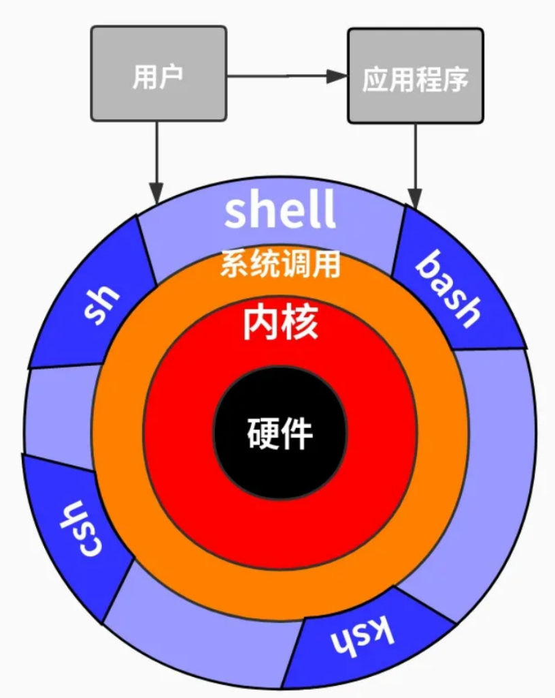

  

- Shell 功能特点：

  - 易编写
  - 易调试
  - 高灵活性

## 1.Linux 提供的 Shell 解析器

- 解析器

  ```shell
  cat /etc/shells
  ```

  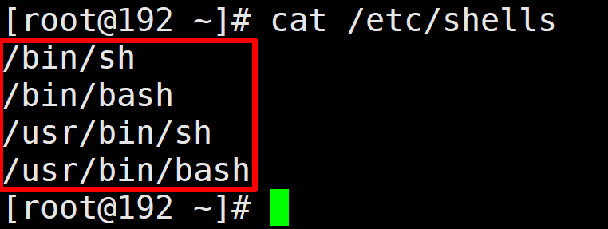

- 分类

  - sh
  - bash

## 2.sh 和 bash 关系

- sh和bash都是Linux系统shell的一种，其中bash命令是sh命令的超集，大多数sh脚本都可以在bash下运行

  

## 3.centos 默认的 shell

```shell
echo $SHELL
```

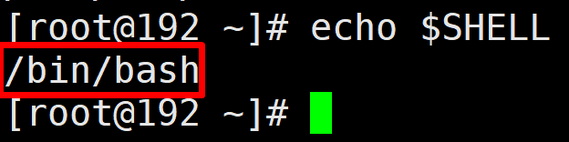

# 二、Shell 脚本快速入门

## 1.脚本格式

- 指定解析器：必须以 #!/bin/bash 开头

  ```shell
  #!/bin/bash
  ```

## 2.第一个 Shell 脚本

- 需求：第一个 Shell 脚本：HelloWorld.sh ，打印HelloWord Shell

- 代码

  ```shell
  #!/bin/bash
  echo "HelloWord Shell"
  ```

  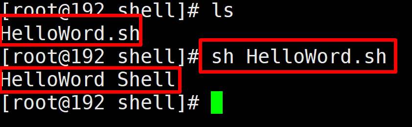

## 3.常用运行方式

- 目的是运行 shell 代码

### 3.1.以sh/bash运行

- 绝对路径执行（从/ 目录往下执行）

  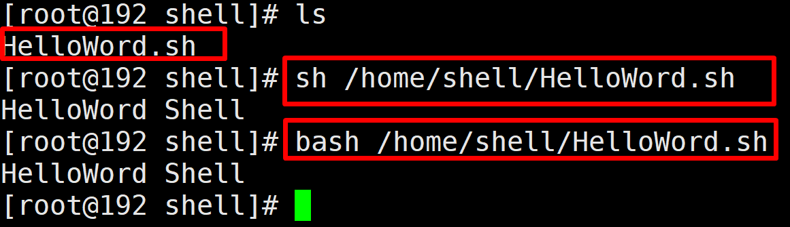

  

- 相对路径执行

  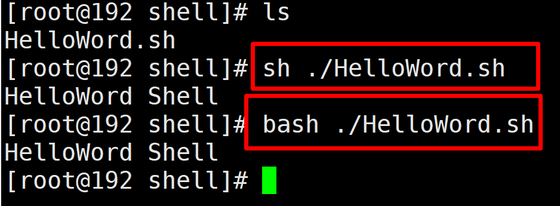

  

### 3.2赋予脚本可执行权限

- 给脚本赋予可执行权限 +x

  ```shell
  chmod +x HelloWord.sh
  ```

  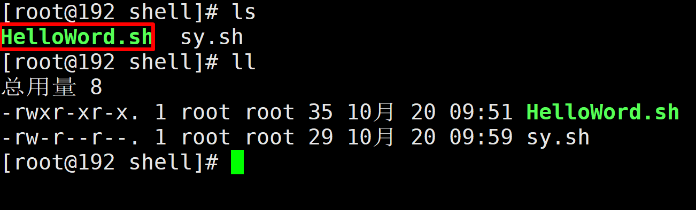

- 直接运行脚本

  - 绝对路径

    ```shell
    /home/shell/HelloWord.sh
    ```

    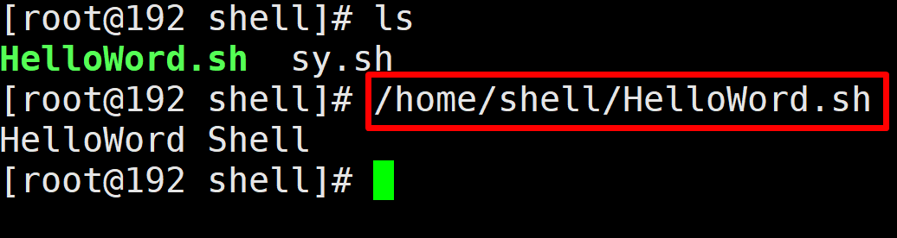

  - 相对路径

    ```shell
    ./HelloWord.sh
    ```

    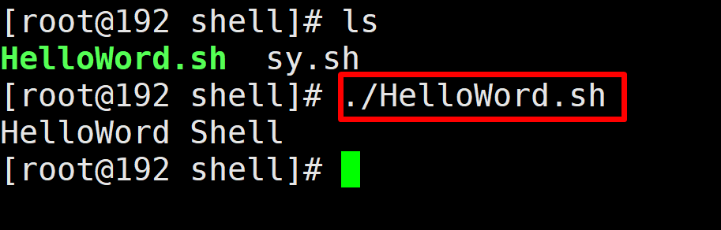

### 3.3两种方式的区别

- 第一种本质上是 **bash 解析器去完成我们脚本的执行**
- 第二种，脚本**自己执行**，所以**需要可执行权限**


# 三、Shell 语法

## 1.变量

### 1.1系统预定义变量

- $HOME

  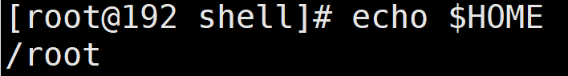

- $PWD

  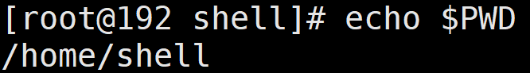

- $SHELL

  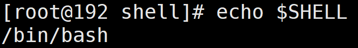

- $USER

  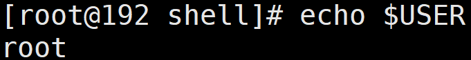

- 显示当前 Shell 中所有变量：set

  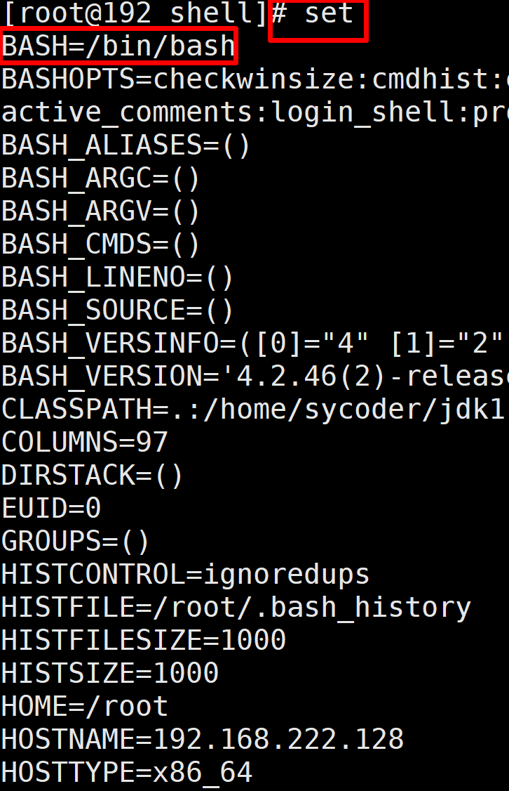

### 1.2自定义变量

- 定义变量语法

  ```shell
  变量名=变量值，注意，=号前后不能有空格
  ```

  - 定义变量 age=18

  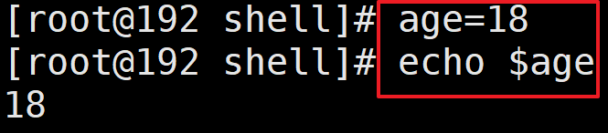

  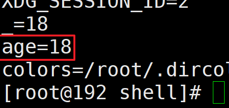

  

- 撤销变量

  ```shell
  unset 变量名
  ```

  - 撤销刚才定义的 age

    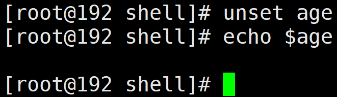

- 声明静态变量（一旦声明不可撤销）

  ```shell
  readonly 变量名
  ```

  - 声明sy的静态变量

    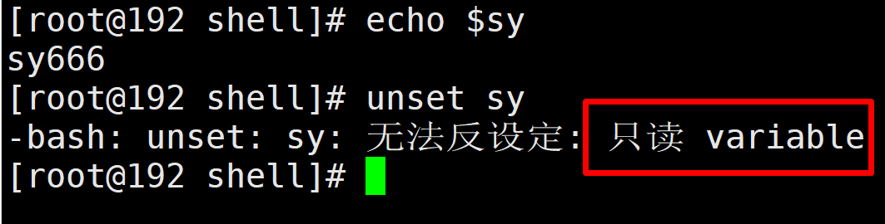

- 变量命名规则

  - 变量名称可以由字母、数字和下划线组成，但是不能以数字开头，环境变量名建议大写

  - **等号两侧不能有空格**

  - 变量的值如果有空格，需要使用双引号或单引号括起来

    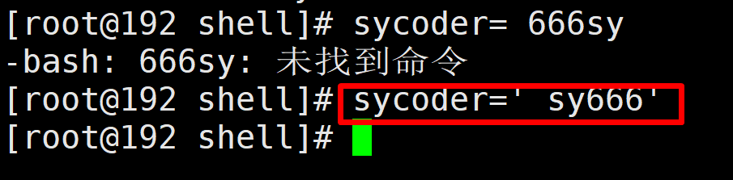

    

### 1.3特殊变量

- $n

  - n 为数字，$0 代表该脚本名称，$1-$9 代表第一到第九个参数，十以上的参数，十以上的参数需要用大括号包含，如${20}

  - 演示，写一个脚本打印输入参数

    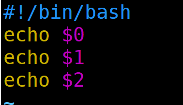

    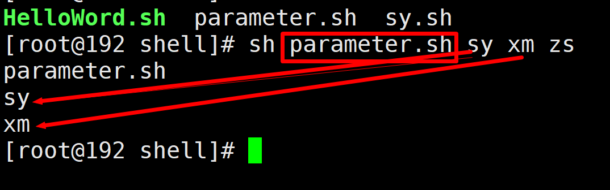

    

- $#

  - 获取所有输入参数个数，常用于循环,判断参数的个数是否正确以及加强脚本的健壮性

    > Note : Don't include $0.
    
    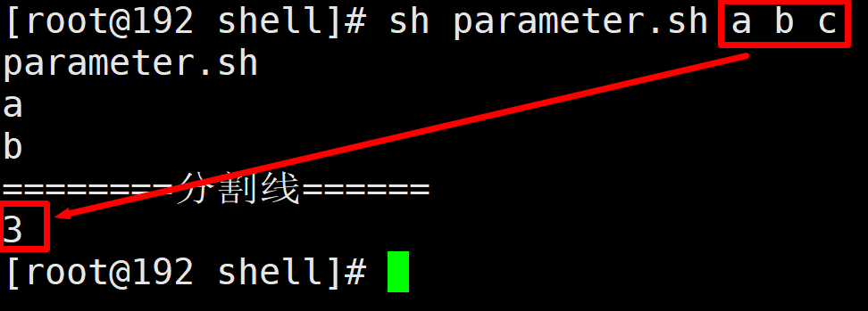

- $*

  - 代表命令行中所有的参数，$*把所有的参数看成一个整体
  - 

- $@

  - 代表命令行中所有的参数，不过$@把每个参数区分对待
  - 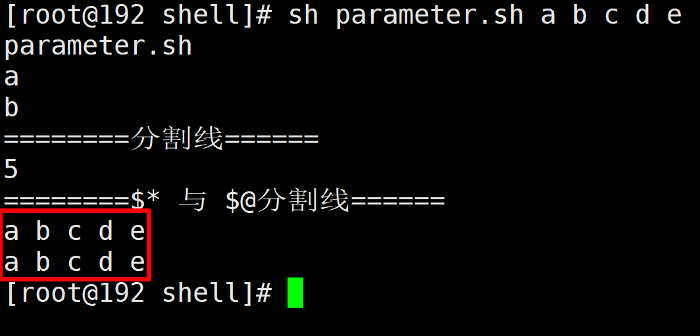

- $？

  - 最后一次执行的命令的返回状态。**如果这个变量的值为 0**，**证明上一个命令正确执行**；如果这个变量的值为非 0（具体是哪个数，由命令自己来决定），则证明上一个命令执行出错了

    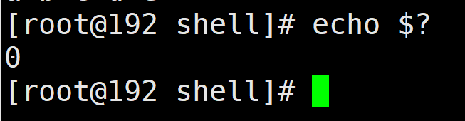

## 2.运算符

- 语法

  ```shell
  $((运算式))” 或 “$[运算式]
  ```

- 计算 （3+3）/2

  ```shell
  $[(3+3)/2]
  ```

  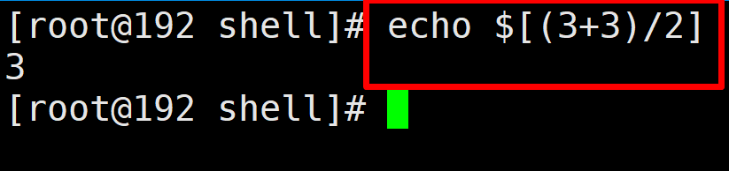

## 3.条件语句

- 语法**（注意 condition 前后要有空格）**

  ```shell
  [ condition ]
  ```

  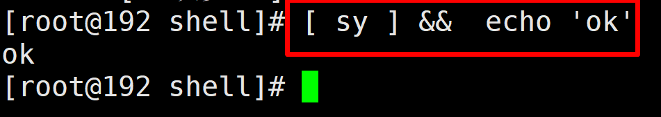

### 3.1两个整数之间比较

| condition | 说明     | 英文          |
| --------- | -------- | ------------- |
| -eq       | 等于     | equal         |
| -ne       | 不等于   | not equal     |
| -lt       | 小于     | less than     |
| -gt       | 大于     | greater than  |
| -le       | 小于等于 | less equal    |
| -ge       | 大于等于 | greater equal |

- 需求

  - 判断10是否大于5

    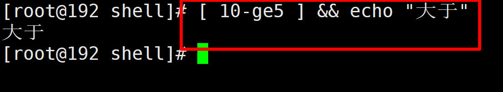

### 3.2字符串比较

- “=” 相等

- “!=” 不等

- 需求

  - 判断 sy 和 sy 是否相等

    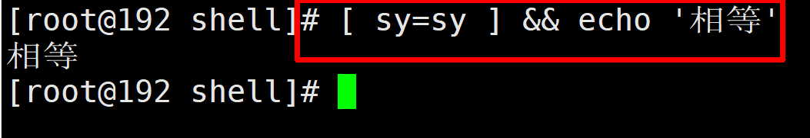

### 3.3文件权限判断

- -r 有读的权限（read）

- -w 有写的权限（write）

  - 需求：判断sy.sh 脚本是否有写的权限

    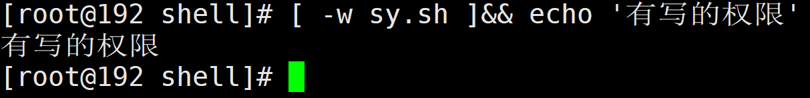

- -x 有执行的权限（execute）

  - 需求：判断 sy.sh 是否有执行权

    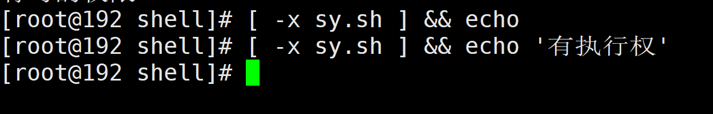

### 3.4以文件类型判断

- -e 文件存在（existence）

  - 需求：判断 sy.sh 是否存在

    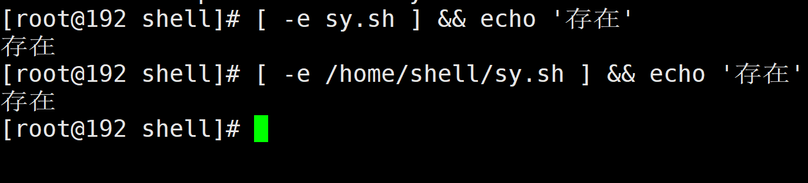

- -f 文件存在并且是一个常规的文件（file）

  - 判断 sy.sh 是否是一个常规存在文件

    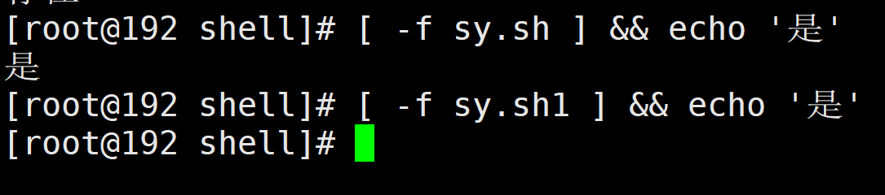

- -d 文件存在并且是一个目录（directory）

  - 判断 shell 目录是否存在

    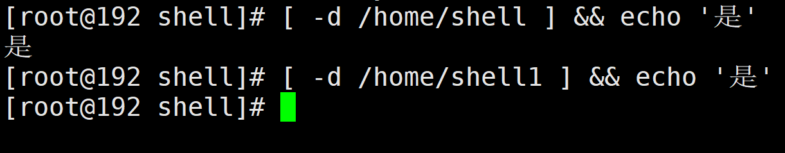

### 3.5&&  ||

- &&  满足前才执行后

  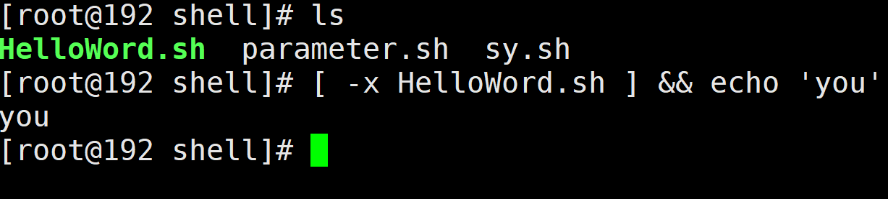

- || 满足其一就行

  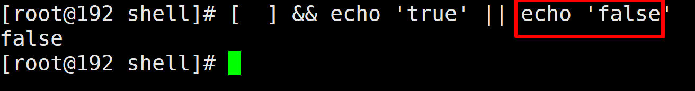

## 4.流程控制语句

### 4.1if 判断

- 单条件判断

  - 语法

    ```shell
    if [ 条件判断式 ];then
    	程序
    fi
    ```

    ```shell
    if [ 条件判断式 ]
    then
    	程序
    fi
    ```

- 多条件

  - 语法

    ```shell
    if [ 条件判断式 ]
    then
    	程序
    elif [ 条件判断式 ]
    then
    	程序
    else
    	程序
    fi
    ```

- 实操：传递一个参数，如果是 java 则打印java工程师，如果是 vue 打印前端工程师，否则打印其它工种

  ```shell
  #!/bin/bash
  if [ $1 = java  ]
  then
          echo 'java 工程师'
  elif [ $1 = vue ]
  then
          echo '前端工程师'
  else
          echo '其它工种'
  fi
  ```

  

### 4.2case 语句

- 语法

  ```shell
  case $变量名 in
  "值 1"）
  如果变量的值等于值 1，则执行程序 1
  ;;
  "值 2"）
  如果变量的值等于值 2，则执行程序 2
  ;;
  …省略其他分支…
  *）
  如果变量的值都不是以上的值，则执行此程序
  ;;
  esac
  ```

  - ;;双分号表示这一行结束了，相当于 break
  - *)表示其它的 相当于java default

- 实操：传递一个参数，如果是 java 则打印java工程师，如果是 vue 打印前端工程师，否则打印其它工种

  ```shell
  #!/bin/bash
  case $1 in
          'java')
          echo "java 工程师"
  ;;
          'vue')
          echo '前端工程师'
  ;;
          *)
          echo '其它工种'
  ;;
  esac
  
  ```

### 4.3for 循环

- 语法

  ```shell
  for (( 初始值;循环控制条件;变量变化 ))
  do
  	程序
  done
  ```

  ```shell
  for 变量 in 值 1 值 2 值 3…
  do
  	程序
  done
  ```

- 实操：从1一直加到10

  ```shell
  #!/bin/bash
  #先定义变量 sum
  sum=0
  for((i=0;i<11;i++))
  do
          echo "目前的 sum 值" $sum
          echo "$i i的值" $i
          sum=$[$sum+$i]
  done
  echo $sum
  ```

  ```shell
  #!/bin/bash
  #先定义变量 sum
  sum=0
  for((i=0;i<11;i++))
  do
          echo "目前的 sum 值" $sum
          echo "$i i的值" $i
          sum=$[$sum+$i]
  done
  echo $sum
  
  echo '===$*====='
  for ret in "$*"
  do
          echo "sy $ret"
  done
  
  echo '====$@=='
  for ret1 in "$@"
  do
          echo "sy $ret1"
  
  done
  
  ```

  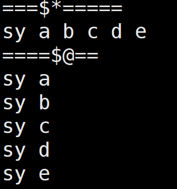

### 4.4while 循环

- 语法

  ```shell
  while [ 条件判断式 ]
  do
  	程序
  done
  ```

- 实操：从1一直加到10

  ```shell
  #!/bin/bash
  sum=0
  i=0
  while [ $i -lt 11 ]
  do
          sum=$[$sum+$i]
          i=$[$i+1]
  done
  
  echo $sum
  
  ```

## 5函数

### 5.1系统函数

- basename

  ```shell
  basename [pathname] [suffix]
  	basename [pathname]  可以获取文件名称带后缀
  	basename [pathname] [suffix] 去掉后缀文件名
  ```

  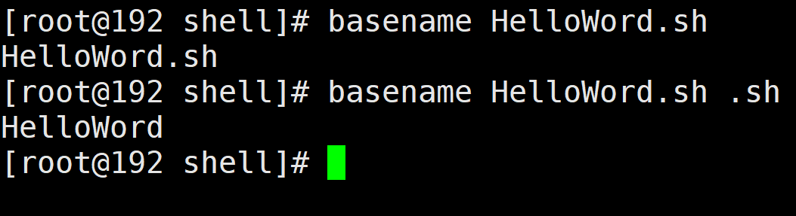

- dirname

  ```shell
  dirname 文件绝对路径
  ```

  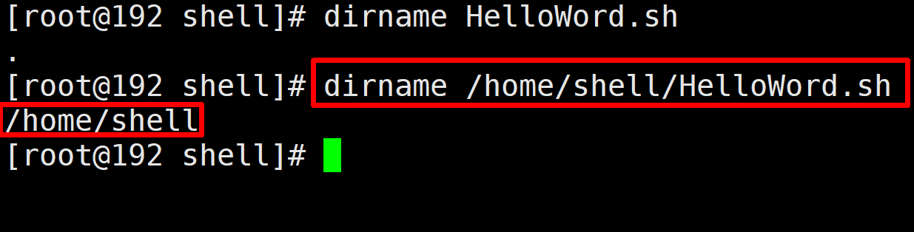

### 5.2自定义函数

- 语法

  ```shell
  [ function ] funname[()]
  {
  	Action;
  	[return int;]
  }
  ```

  - 定义函数必须在调用之前定义
  - 函数返回值可以自己设定，使用 $获取

- 实操：做一个加法计算器

  ```shell
  #!/bin/bash
  function sum(){
  
          echo ===============
          ret=0;
          ret=$[ $1+$2 ]
          echo $ret
          return $ret
  }
  num1=1
  num2=3
  sum $num1 $num2
  ```

  

# 四、正则匹配

- grep

  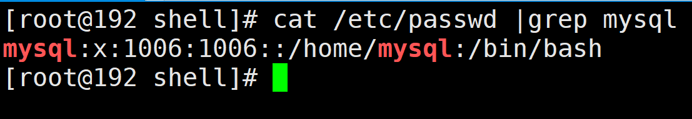

- ^ 匹配一行的开头

  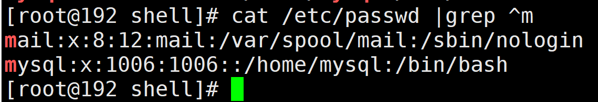

- $ 匹配一行的结束

  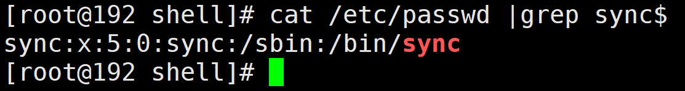

- . 匹配一个任意字符

  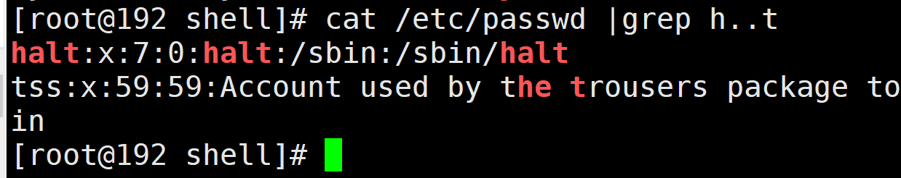

- '*'不单独使用，他和上一个字符连用，表示匹配上一个字符 **0 次或多次**

  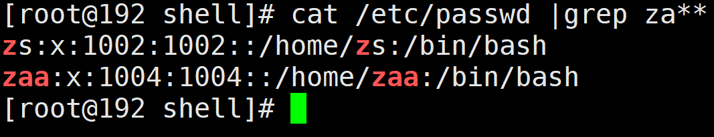


- [ ] 表示匹配某个范围内的一个字符

  - [1,3]------匹配 1 或者 3

  - [0-9]------匹配一个 0-9 的数字

  - [0-9]*------匹配任意长度的数字字符串

  - [a-z]------匹配一个 a-z 之间的字符

  - [a-z]* ------匹配任意长度的字母字符串

  - [a-c, e-f]-匹配 a-c 或者 e-f 之间的任意字符

    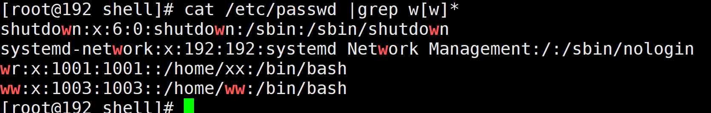

- \ 表示转义
  - \ $

# 五、文本处理工具

## 1.概述

- **awk**:文本分析工具，把**文件逐行的读入**，以**空格**为默认分隔符将每行切片，切开的部分再进行分析处理

## 2.语法

```shell
awk [参数] ‘/pattern1/{action1}...’ filename
	pattern：表示 awk 在数据中查找的内容，就是匹配模式
	action：在找到匹配内容时所执行的一系列命令

	参数
			-F 指定输入文件分隔符
			-v 赋值一个用户定义变量
```

- 拷贝数据为了避免出现问题

  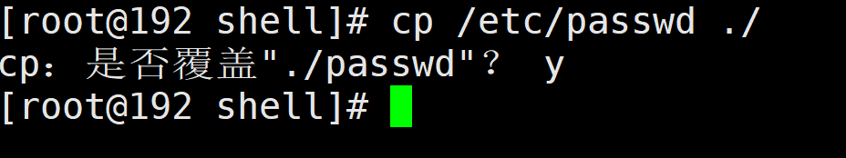

- 查看以 root 开头的数据的第二列的数据

  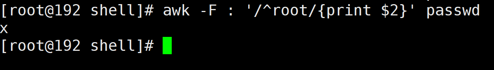

- 查看以 root 开头的数据的第二列和第五列的数据

  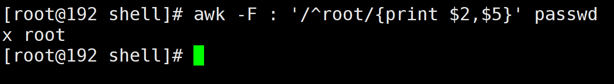

- 找到 passwd 中第一列的值

  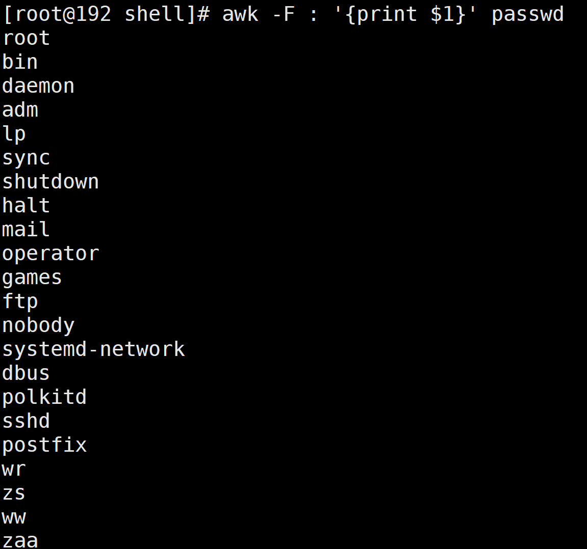

- 将用户信息id +1显示

  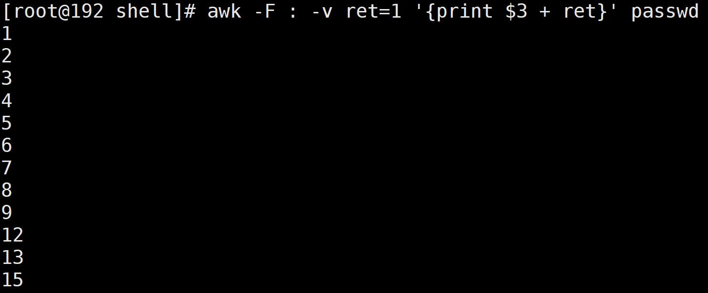

  

## 3.awk 的内置变量

- FILENAME 文件名
- NR 已读的记录数（行号）
- NF 浏览记录的域的个数（切割后，列的个数）

- 需求

  - 统计passwd 每行行号

    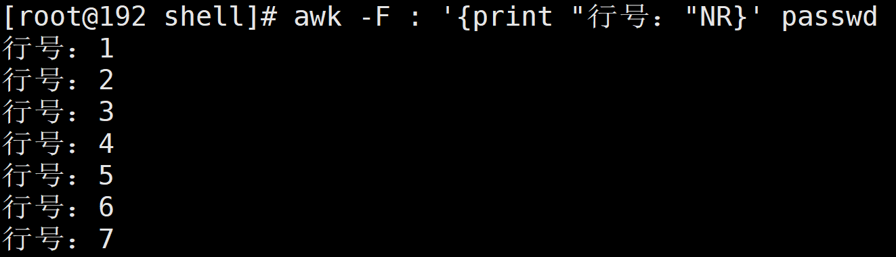

  - 查找ip 地址

    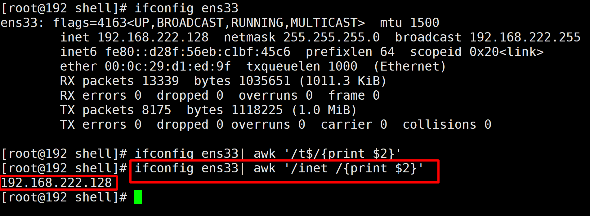

# 六、杀tomcat 进程重启

- 找到进程 pid
- kill -9 pid
- 执行tomcat sh 脚本

```shell
#!/bin/bash
pid=`ps -ef|grep apache-tomcat-9.0.68| awk 'NR==1{print $2}'`
echo "tomcat pid : $pid"
kill -9 $pid
echo "tomcat 已经停止工作"
echo "准备启动tomcat"
cd /home/sycoder/apache-tomcat-9.0.68/bin
sh ./startup.sh
tail -n 500 -f ../logs/catalina.out

```

- 注意：面试官问到你有没有写过脚本的时候，我不允许你说没有

# 七、任务布置

- 对于 vim/vi 的正常使用要会
- 查看日志
- 文件目录指令
- 查找路径指令
- 压缩和解压
- 文件权限指令
- 磁盘查看
- 查看进程
- 防火墙
  - **开放端口信息**
- 检查网络是否通
  - ping 查看ip 是否通
  - telnet 检查端口是否通
- linux 软件安装
