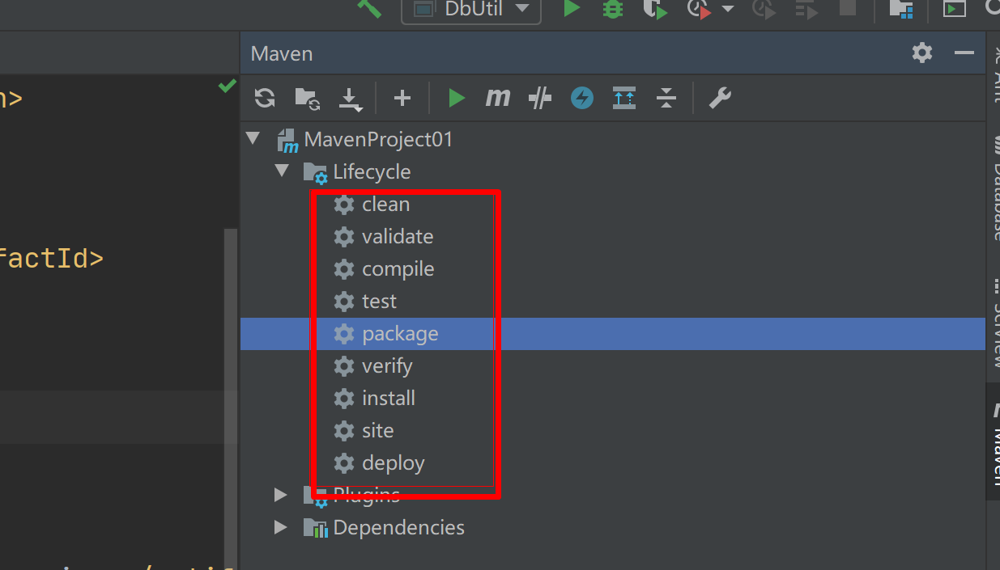

# 一、Maven 初使用

## 1.maven 概述

- Maven 是用来构建和管理 java 项目的工具
- 回顾jdbc 依赖管理
  1. 去到maven 仓库里面下载我们需要的jar 包
  2. 创建 lib 目录，把 jar 添加到我们的项目模块
  3. 真正的把 jar 添加到项目

- 没有使用 Maven 时存在的问题

  1. 下载 jar 很慢

  2. 很难找 jar

  3. 管理也很麻烦

     

     

## 2.初试Maven

- Maven 官网

  http://maven.apache.org/

- 进入官网

  

- 创建第一个 Maven 项目

  - 使用idea 创建感受一下

    

  - 创建项目的结构

    

  - 给项目添加依赖

    ```java
     <dependencies>
            <dependency>
                <groupId>mysql</groupId>
                <artifactId>mysql-connector-java</artifactId>
                <version>8.0.28</version>
            </dependency>
        </dependencies>
    ```

  - 下载了mysql 驱动包

    

    

## 3.使用Maven好处

- 不需要手动下载包
- 依赖管理更加便捷了
- 不需要添加jar
- 节约了程序员开发时间和管理项目依赖的时间

## 4.Maven 作用

- 提供了一套标准化的项目结构

  

- 提供了一套标准化的构建流程（编译，测试，打包，发布）

  

  

- 提供了一套依赖管理机制

  

# 二、Maven 模型

1. 项目对象模型
   - 提供了项目的描述，项目的坐标信息，方便其它 Maven 项目对该项目的引用
2. 依赖管理模型
   - 通过maven 坐标能够定位到具体的jar ,方便下载
3. 插件
   - 提供了编译
   - 打包
   - 清除等功能


# 三、Maven 安装配置

## 1.安装

- Maven 是apache 开源基金组织的产品
- **注意：不要去下载最新的版本**，因为idea 和Maven 不是同一家公司，很容易出现卡顿拉包不兼容
- 解压我提供的zip 包
  - 
  - 注意：解压不要放到中文目录
  - bin目录：存放可以执行命令，重点关注mvn
  - config目录：存放maven 配置文件。重点关注 setting.xml
  - lib目录：存放maven依赖

## 2.环境配置

- 此电脑-右键-高级系统设置-环境变量

- 配置

  

  path路径里：

  
  
  


# 四、Maven 仓库

仓库的分类

- 本地仓库：自己计算机的一个文件夹，里面管理了各种各样的jar
  - 
- 中央仓库：是Maven 团队维护的一个仓库
  - https://mvnrepository.com
- 公司远程私服：由公司的团队搭建的私有仓库
  - 私服就是自己公司内部使用的，不能提供给其它使用的

## 1.构建过程


- 先去本地仓库找，找得到直接返回
- 找不到去中央仓库找

## 2.更换仓库地址

- 先找到config 目录下的 setting.xml 文件

  - 

- 配置其它路径

  ```java
  <localRepository>D:\02-WEB\Maven\tools\apache-maven-3.6.1-bin\repo</localRepository>
  ```

  

  - 配置阿里私服，因为中央仓库在国外，所以下载很慢，阿里规模很大，阿里建了一个私服


  ```java
  <mirror> 
  
        <id>alimaven</id> 
  
        <name>aliyun maven</name> 
  
        <url>http://maven.aliyun.com/nexus/content/groups/public/</url>
  
        <mirrorOf>central</mirrorOf>         
  
  </mirror>
  ```

  


# 五、Maven 常用命令(⭐️)

- compile ：编译

  - 下载需要的插件
  - 生成 target 目录（字节码文件和插件）

  

  

  

- clean：清理

  - 下载需要的清理插件

  - 删除 target 目录

    

- test：测试

  - 会去编译并且执行test
  - 
  - 

- package：打包

  - 打jar 包
  - 
  - 

- install：安装

  - 把当前的项目打成 jar 包并且把他安装到本地仓库
  - 

# 六、Maven 生命周期

- 定义：Maven 构建项目所经历的整个过程
- 执行命令的先后
  - complie ---->test  ----package ---->install
  - 比如执行 install （安装命令的时候） 先编译，执行测试，执行打包最后安装
- maven 除了这些命令还有很多命令：
  - 检验
  - 初始化
  - 验证
  - ...

# 七、Maven 的具体操作

## 1.maven 的坐标

- maven 的坐标是**资源的唯一标识**
- 可以通过坐标来定义或者去创建项目

## 2.坐标的组成

- groupId:分组名，也可以使用公司**域名倒写来表示（cn.sycoder）**
- artifactId:定义这个项目的名称（order-center,pay-center）
- version:定义当前项目的一个版本号，方便管理公司项目的迭代

​	

```java
<groupId>org.example</groupId>
<artifactId>MavenProject01</artifactId>
<packaging>jar</packaging>
<version>1.0-SNAPSHOT</version>
```

## 3.idea 配置 maven

- 点击 file - setting

  

- 找到 maven 位置，设置自己配置的 maven

  

## 4.使用Idea 创建Maven 项目

- 点击 file ---new ----project
  - 
- 选中 maven 点击 next
  - 
- 创建项目名称
  - 

## 5.依赖管理

- 使用坐标引入 jar

  ```java
  <dependencies>
          <dependency>
              <groupId>mysql</groupId>
              <artifactId>mysql-connector-java</artifactId>
              <version>8.0.30</version>
          </dependency>
      </dependencies>
  ```

  

- 刷新依赖导入的快捷键是 ctrl + shift + O

- 坐标如果记不住，去maven 仓库找

- 依赖范围：通过设置 scope,可以去控制对应jar的作用范围

  - 编译环境

  - 运行环境

  - 测试环境

  - scope 取值

    | Scope 取值 | 编译环境 | 运行环境 | 测试环境 | 例子       |
    | ---------- | -------- | -------- | -------- | ---------- |
    | compile    | V        | V        | V        | logback    |
    | runtime    |          | v        | v        | 数据库驱动 |
    | test       |          |          | v        | junit      |
    | system     | v        |          | v        | 存储本地包 |
    | provided   | v        |          | v        | servlet    |

  - **注意：不指定 scope 默认值就是 compile**

## 6.导入maven 项目


# 八、可能存在的问题

## 1.没有 maven 的面板


## 2.直接去mvn 仓库进不去的时候

- alt + enter

  - 

  - 

    