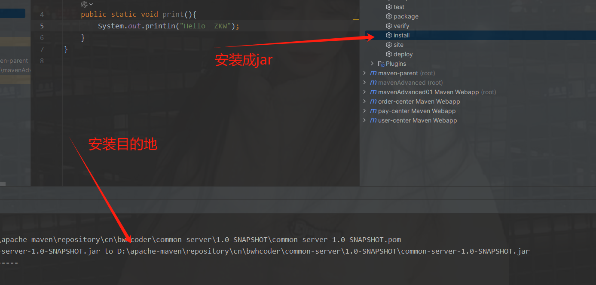
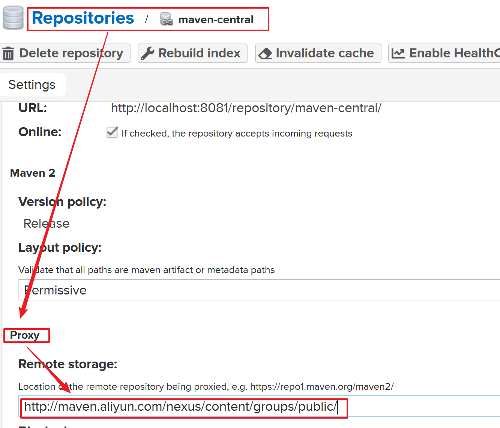

# 一、Maven分模块开发

## 1.场景介绍

- 实战开发中，一个项目是非常庞大的，会有很多模块：
  - 支付中心
  - 订单服务
  - 用户中心
  - ...
- 目前存在的问题：
  - 如果把所有的内容放到同一个项目中来管理，项目会很臃肿
  - 分工不明确，耦合太严重

- Maven 就可以解决这个问题

  

## 2.分模块开发

### 2.1构建传统冗杂在一起的老项目

- 导入依赖

  ```java
  <dependencies>
          <dependency>
              <groupId>org.springframework</groupId>
              <artifactId>spring-webmvc</artifactId>
              <version>5.2.17.RELEASE</version>
          </dependency>
  
          <dependency>
              <groupId>org.springframework</groupId>
              <artifactId>spring-jdbc</artifactId>
              <version>5.2.17.RELEASE</version>
          </dependency>
  
          <dependency>
              <groupId>org.springframework</groupId>
              <artifactId>spring-test</artifactId>
              <version>5.2.17.RELEASE</version>
          </dependency>
  
          <dependency>
              <groupId>org.mybatis</groupId>
              <artifactId>mybatis</artifactId>
              <version>3.5.6</version>
          </dependency>
  
          <dependency>
              <groupId>org.mybatis</groupId>
              <artifactId>mybatis-spring</artifactId>
              <version>1.3.0</version>
          </dependency>
  
          <dependency>
              <groupId>mysql</groupId>
              <artifactId>mysql-connector-java</artifactId>
              <version>8.0.29</version>
          </dependency>
  
          <dependency>
              <groupId>com.alibaba</groupId>
              <artifactId>druid</artifactId>
              <version>1.1.16</version>
          </dependency>
  
          <dependency>
              <groupId>junit</groupId>
              <artifactId>junit</artifactId>
              <version>4.12</version>
              <scope>test</scope>
          </dependency>
  
          <dependency>
              <groupId>javax.servlet</groupId>
              <artifactId>javax.servlet-api</artifactId>
              <version>3.1.0</version>
              <scope>provided</scope>
          </dependency>
          <dependency>
              <groupId>org.projectlombok</groupId>
              <artifactId>lombok</artifactId>
              <version>1.18.22</version>
          </dependency>
  
          <dependency>
              <groupId>com.fasterxml.jackson.core</groupId>
              <artifactId>jackson-databind</artifactId>
              <version>2.9.0</version>
          </dependency>
      </dependencies>
  ```

- 配置 springmvc

  - 提供SpringMVC 配置

    ```java
    @Configuration
    @ComponentScan(value = {"cn.bwhcoder.controller"})
    @EnableWebMvc
    public class SpringMvcConfig {
    }
    ```

  - 注册Servlet

    ```java
    public class ServletConfig extends AbstractAnnotationConfigDispatcherServletInitializer {
        @Override
        protected Class<?>[] getRootConfigClasses() {
            return new Class[0];//配置Spring交给Web 管理
        }
    
        @Override
        protected Class<?>[] getServletConfigClasses() {
            return new Class[]{SpringMvcConfig.class};
        }
    
        @Override
        protected String[] getServletMappings() {
            return new String[]{"/"};
        }
    }
    ```

  - 提供三个Controller

    - 用户中心

      ```java
      @RestController
      @RequestMapping("/user")
      public class UserController {
          @GetMapping("/{id}")
          public String getById(@PathVariable Long id){
              return "OK:user"+id;
          }
      }
      ```

    - 支付中心

      ```java
      @RestController
      @RequestMapping("/pay")
      public class PayController {
          @GetMapping("/{id}")
          public String getById(@PathVariable Long id){
              return "OK:pay"+id;
          }
      }
      ```

    - 订单中心

      ```java
      @RestController
      @RequestMapping("/order")
      public class OrderController {
          @GetMapping("/{id}")
          public String getById(@PathVariable Long id){
              return "OK:order"+id;
          }
      }
      ```

  - 项目结构图

    

    

### 2.2分模块开发

- 创建空项目

#### 2.2.1<font color="red">创建一个父模块</font>

- 添加父模块

  

- 删除src 文件

  

- 修改pom.xml

  ```java
  <?xml version="1.0" encoding="UTF-8"?>
  <project xmlns="http://maven.apache.org/POM/4.0.0"
           xmlns:xsi="http://www.w3.org/2001/XMLSchema-instance"
           xsi:schemaLocation="http://maven.apache.org/POM/4.0.0 http://maven.apache.org/xsd/maven-4.0.0.xsd">
      <modelVersion>4.0.0</modelVersion>
  
      <groupId>cn.sycodeer</groupId>
      <artifactId>maven-parent</artifactId>
      <version>1.0-SNAPSHOT</version>
      <packaging>pom</packaging>
  
  </project>
  ```

#### 2.2.2<font color="red">创建用户中心</font>

- 新添加用户中心模块

  

- 添加父模块

  

- 新建好结构图

  

#### 2.2.3<font color="red">创建订单中心</font>

- 新建订单中心模块

  

- 目前的项目结构

  

#### 2.2.4<font color="red">创建支付中心</font>

- 新建支付模块

  

- 项目结构

  

# 二、聚合和继承

## 1.聚合

> **聚合**是指将多个子模块项目组合在一起进行构建。聚合项目通常是一个父项目，它的主要目的是确保所有子模块在一次构建命令中被一起构建。聚合项目本身通常不会生成任何实际的输出文件（如JAR、WAR等），而只是一个用于管理多个子模块的容器。

### 1.1.聚合工程

- 概述：一个不具有业务功能的"空"工程（有且仅有个pom文件）

- 项目结构图

  

### 1.2.作用

- 作用：当工程中某个模块发生更新（变更）时，必须保障工程中与已更新模块关联的模块同步更新，此时可以使用聚合工程来解决批量模块同步构建的问题


### 1.3.实际开发应用（⭐️）

#### 1.3.1创建公共服务

- 打包方式
  - **jar**：
    - **用途**：用于打包Java类库。
    - **描述**：生成一个包含编译后的类文件和资源文件的JAR文件。通常用于创建可重用的库。
  - **war**：
    - **用途**：用于打包Web应用程序。
    - **描述**：生成一个包含Web应用的所有资源文件（如HTML、CSS、JavaScript等）以及编译后的类文件的WAR文件。通常用于部署到Servlet容器（如Tomcat、Jetty等）。
  - **pom**：
    - **用途**：用于聚合项目和管理多模块项目的父项目。
    - **描述**：不生成实际的输出文件，而是作为一个容器或父项目，用于组织和管理多个子模块。常用于多模块项目的依赖管理和版本控制。
  
- 先设置打包方式 & 创建通过服务模块

  

  

  

- 提供一个工具类

  

  

#### 1.3.2在其他服务中引用公共服务

- 将公共服务 install 到仓库中

  ```java
  mvn install
  ```

  

  

- 在用户中心引用公共服务

  ```java
  <dependency>
      <groupId>cn.bwhcoder</groupId>
      <artifactId>commons-server</artifactId>
      <version>1.0-SNAPSHOT</version>
  </dependency>
  ```

  

- 使用我们自己写的jar包中的工具类

  
  
- maven 依赖的细节

  
  
  


## 2.继承

> **继承**是指子模块项目从父项目继承配置信息。父项目可以定义一些公共的配置（如依赖管理、插件配置等），子模块通过继承这些配置来避免重复声明，从而简化配置管理。

### 2.1没有使用继承的问题

- 存在兄弟模块之间依赖重复问题

  

### 2.2作用

- 简化配置
- 减少版本冲突

### 2.3实际开发应用

#### 2.3.1抽重

- 将相同的依赖全部抽到父工程中

  ```java
  <?xml version="1.0" encoding="UTF-8"?>
  <project xmlns="http://maven.apache.org/POM/4.0.0"
           xmlns:xsi="http://www.w3.org/2001/XMLSchema-instance"
           xsi:schemaLocation="http://maven.apache.org/POM/4.0.0 http://maven.apache.org/xsd/maven-4.0.0.xsd">
      <modelVersion>4.0.0</modelVersion>
  
      <groupId>cn.sycodeer</groupId>
      <artifactId>maven-parent</artifactId>
      <version>1.0-SNAPSHOT</version>
      <modules>
          <module>user-center</module>
          <module>order-center</module>
          <module>pay-center</module>
      </modules>
      <packaging>pom</packaging>
  
      <dependencies>
          <dependency>
              <groupId>org.springframework</groupId>
              <artifactId>spring-webmvc</artifactId>
              <version>5.2.17.RELEASE</version>
          </dependency>
  
          <dependency>
              <groupId>org.springframework</groupId>
              <artifactId>spring-jdbc</artifactId>
              <version>5.2.17.RELEASE</version>
          </dependency>
  
          <dependency>
              <groupId>org.springframework</groupId>
              <artifactId>spring-test</artifactId>
              <version>5.2.17.RELEASE</version>
          </dependency>
  
          <dependency>
              <groupId>org.mybatis</groupId>
              <artifactId>mybatis</artifactId>
              <version>3.5.6</version>
          </dependency>
  
          <dependency>
              <groupId>org.mybatis</groupId>
              <artifactId>mybatis-spring</artifactId>
              <version>1.3.0</version>
          </dependency>
  
          <dependency>
              <groupId>mysql</groupId>
              <artifactId>mysql-connector-java</artifactId>
              <version>8.0.29</version>
          </dependency>
  
          <dependency>
              <groupId>com.alibaba</groupId>
              <artifactId>druid</artifactId>
              <version>1.1.16</version>
          </dependency>
  
          <dependency>
              <groupId>junit</groupId>
              <artifactId>junit</artifactId>
              <version>4.12</version>
              <scope>test</scope>
          </dependency>
          <dependency>
              <groupId>javax.servlet</groupId>
              <artifactId>javax.servlet-api</artifactId>
              <version>3.1.0</version>
              <scope>provided</scope>
          </dependency>
          <dependency>
              <groupId>org.projectlombok</groupId>
              <artifactId>lombok</artifactId>
              <version>1.18.22</version>
          </dependency>
  
          <dependency>
              <groupId>com.fasterxml.jackson.core</groupId>
              <artifactId>jackson-databind</artifactId>
              <version>2.9.0</version>
          </dependency>
      </dependencies>
  
  </project>
  ```

#### 2.3.2定义依赖管理dependencyManagement 

> 1. **版本集中管理**：
>    - 在父项目的 `<dependencyManagement>` 中声明依赖时，需要指定版本号。子模块在引用这些依赖时，**不需要再指定版本号**，直接继承父项目中的版本。
> 2. **依赖范围和属性**：
>    - 可以在 `<dependencyManagement>` 中声明依赖的范围（如 `compile`, `test` 等）和其他属性（如 `classifier`, `type` 等）。子模块在引用时可以选择覆盖这些属性。
> 3. **灵活性**：
>    - 子模块仍然可以覆盖父项目中声明的依赖版本，如果需要使用不同版本的依赖。

- 通过 dependencyManagement 标签，可以配置供子类选用的依赖jar包

  ```java
  <dependencyManagement>
      <dependencies>
          <dependency>
              <groupId>cn.sycoder</groupId>
              <artifactId>commons-server</artifactId>
              <version>1.0-SNAPSHOT</version>
          </dependency>
      </dependencies>
  </dependencyManagement>
  ```
  
- 子类可以正常引用，且无需提供版本信息

  ```java
  <dependencies>
      <dependency>
          <groupId>cn.sycoder</groupId>
          <artifactId>commons-server</artifactId>
      </dependency>
  </dependencies>
  ```
  


## 3.聚合和继承区别

- 作用

  - 聚合
    - 管理多个子模块，确保它们在一次构建命令中被一起构建。
  - 继承
    - 管理公共配置，避免重复声明，保持一致性。

- 异同

  - 相同点
    - 均以 pom 结构打包
  - 不同点
    - 聚合通过父项目管理子项目，并且能够知道聚合的具体的模块
    - 继承通过父项目管理子项目的依赖，无法感知子模块需要哪些依赖
  
- **总结**

  > 父项目通过 `<modules>` 标签聚合子模块，同时通过 `<dependencyManagement>` 和 `<build>` 标签管理公共配置，子模块通过 `<parent>` 标签继承这些配置。这样可以有效地管理和构建复杂的多模块项目。


# 三、属性和版本管理

## 1.属性

### 1.1目前存在问题

- 目前版本控制:版本分离控制，如果有更改会出现依赖，并且需要改的地方很多

  ```java
  <dependency>
      <groupId>org.springframework</groupId>
      <artifactId>spring-webmvc</artifactId>
      <version>5.2.17.RELEASE</version>
  </dependency>
  
  <dependency>
      <groupId>org.springframework</groupId>
      <artifactId>spring-jdbc</artifactId>
      <version>5.2.17.RELEASE</version>
  </dependency>
  
  <dependency>
      <groupId>org.springframework</groupId>
      <artifactId>spring-test</artifactId>
      <version>5.2.17.RELEASE</version>
  </dependency>
  ```

- 提出解决版本：抽出一个公共的版本属性

  

### 1.2properties标签解决

- 通过修改pom-version 信息

  ```java
  <properties>
      <spring-version>5.2.17.RELEASE</spring-version>
  </properties>
  <dependencies>
      <dependency>
          <groupId>org.springframework</groupId>
          <artifactId>spring-webmvc</artifactId>
          <version>${spring-version}</version>
      </dependency>
  
      <dependency>
          <groupId>org.springframework</groupId>
          <artifactId>spring-jdbc</artifactId>
          <version>${spring-version}</version>
      </dependency>
  
      <dependency>
          <groupId>org.springframework</groupId>
          <artifactId>spring-test</artifactId>
          <version>${spring-version}</version>
      </dependency>
  </dependencies>
  ```

  

## 2.版本信息

- 目前会经常遇到的版本

  

### 2.1经常使用版本信息

- SNAPSHOT：快照版本
  - 项目研发过程中的临时版本
  - 快照版本会不断更新
- RELEASE：发布版本
  - 项目研发成熟比较稳定后的发布版本
  - 如果进行迭代升级，也不会去改变当前版本的内容

### 2.2其它版本信息

- alpha版:内测版
  - 自己公司内部测试使用,研发基本完成，但是会存在不少bug
- beta版:公测版
  - 公司测试没问题了，需要广大用户进行公测，还存在bug
- 纯数字版本
  - 以数字标识

# 四、测试

## 1.操作普通打包

- 直接点击maven生命周期中的 package

  

- 经过如下几个过程

  - 清除
  - 验证
  - 编译
  - 测试
  - 打包

## 2.经常出现场景

- 线上出现紧急bug,需要紧急修复并且上线部署

- 模拟测试异常

  

## 3.解决办法

- 方法一：通过跳过测试解决

  - 通过idea maven 工具实现跳过

    

- 方法二：通过命令行

  ```java
  mvn package -D skipTests=true
  ```

# 五、私服

## 1.回顾私服与中央仓库

### 1.1.私服

- 概述：公司内部搭建的用于存储Maven资源的服务器

### 1.2.中央仓库

- Maven开发团队维护的用于存储Maven资源的服务器

### 1.3.目前开发现状

- 架构师会写一些基础公共的代码

  - commons-server
    - utils
    - constant

- 目前团队共享jar资源只能通过网络传输

  

- 有私服之后

  

## 2.私服下载与安装

### 2.1下载

- 网址：https://help.sonatype.com/repomanager3/product-information/download

- 下载截图

  

### 2.2安装

- 解压压缩包

  

- 启动私服（不要解压到中文目录下）

  

  

  - 执行命令 用DOS窗口

    ```java
    nexus.exe /run nexus
    ```

  - 看到如下内容，说明启动成功

    

  

### 2.3访问 nuxus

- 账号密码
  - admin
  - 123456

- 访问地址

  ```java
  localhost:8081
  ```

- 如下页面说明访问成功

  

- 登录

  

- 密码位置

  

- 重置密码

  

- 匿名访问设置

  

## 3.仓库分类

- 如果端口占用，请修改端口信息重启即可
  - nexus-3.31.1-01-win64\nexus-3.31.1-01\etc\nexus-default-properties

    
  
- 分类
  - **Hosted Repositories（托管/宿主仓库）**：
    - 存放一些无法从中央仓库获取的jar
    - 公司内容开发的jar
    - 收费的jar
  - **Proxy Repositories（代理仓库）**：
    - 代理访问远程仓库的，比如访问阿里云镜像仓库
  - **Group Repositories（组仓库）**：
    - 组仓库将多个仓库（包括托管仓库和代理仓库）组合在一起，形成一个虚拟仓库。
    - 它允许开发人员通过单一的URL访问多个仓库中的组件，简化了构建配置。
    - 组仓库中的搜索顺序可以根据需要进行配置，优先级高的仓库会被首先检查。


## 4.私服配置仓库

- 配置仓库

  

  

- 新创建两个不同版本的仓库

  

  

  

- 将创建的宿主仓库交给仓库组group 管理

  

  

  


## 5.本地仓库与私服配置

- 本地拉包是通过maven去操作的

### 5.1配置本地对neuxs 私服的访问信息

- 打开maven的setting.xml文件

  

- 配置访问信息

  > `<servers>` 元素用于配置服务器相关的认证信息。这些信息主要用于当你需要将构建的项目部署到远程仓库（例如公司的内部仓库或公共仓库如 Sonatype Nexus, Artifactory 等）时提供必要的认证凭据。
  >
  > 每个 `<server>` 元素包含以下子元素：
  >
  > - `<id>`：这是仓库的唯一标识符，它必须与你在 `pom.xml` 文件中的 `<distributionManagement>` 部分定义的仓库 ID 相匹配。这样 Maven 才能知道使用哪个服务器配置来进行部署操作。
  > - `<username>`：用于登录远程仓库的用户名。
  > - `<password>`：与用户名对应的密码。
  > - `<privateKey>`：可选，如果你使用的是 SSH 密钥对进行身份验证，这里可以指定私钥文件的位置。
  > - `<passphrase>`：可选，如果私钥文件是加密的，这里可以提供解密所需的密码短语。
  > - `<filePermissions>` 和 `<directoryPermissions>`：这两个属性可以用来设置当 Maven 将文

  ```xml
   <servers>
       <!-- 注意此处的id要和镜像保持一致 -->
        <server>
            <id>maven-public</id>
            <username>admin</username>
            <password>123456</password>
        </server>
    </servers>
  ```

- 配置私服访问地址（下载jar的地址）

  ```xml
  <mirror>
  <!--          配置组名称-->
    <id>maven-public</id>
  <!--          所有内容都可以拉取-->
    <mirrorOf>*</mirrorOf>
  <!--          仓库地址-->
    <url>http://localhost:8081/repository/maven-public/</url>
  
  </mirror>
  ```

  

## 6.jar上传与下载

- 手动上传

  

### 6.1自动上传`distributionManagement`

- **distributionManagement**: 主要用于指定项目构建输出（如 JAR 文件、WAR 文件等）的部署目标位置

  - `repository` 元素用于指定正式发布版本的部署位置。
  - `snapshotRepository` 元素用于指定快照版本的部署位置。
  - `id` 是仓库的唯一标识符，通常与 `settings.xml` 文件中的服务器配置相关联。
  - `name` 是仓库的名称，用于描述仓库。
  - `url` 是仓库的 URL 地址，Maven 将使用这个地址来上传构建产物。

- 在需要上传的pom 中添加如下配置(注意配置一定要和setting.xml 中的一致)

  ```xml
  <distributionManagement>
      <repository>
          <id>maven-public</id>
          <url>http://localhost:8081/repository/bwh-Release/</url>
      </repository>
      <snapshotRepository>
          <id>maven-public</id>
          <!-- 需要上传的对应仓库地址-->
          <url>http://localhost:8081/repository/bwh-Snapshot/</url>
      </snapshotRepository>
  </distributionManagement>
  ```

- 发布项目到nexus

  

  

### 6.2修改中央代理的地址




## 7.获取仓库的包

参考视频：

https://www.bilibili.com/video/BV1JN411G7gX?p=53&spm_id_from=333.788.videopod.episodes&vd_source=ad4f8b7bf024b8f8819493104aa6e94f

### 需要配置`repositories`

> `repositories` 元素用于指定 Maven 构建过程中可以从哪些地方下载依赖和插件。这些仓库可以是本地的、远程的或者是私有的。通过配置 `repositories`，您可以告诉 Maven 在哪里查找和下载项目所需的依赖项。
>
> ### 作用
>
> 1. **依赖解析**：Maven 使用仓库中的信息来解析和下载项目声明的依赖项。
> 2. **插件解析**：Maven 也使用仓库中的信息来解析和下载项目声明的插件。
> 3. **版本管理**：仓库中存储了不同版本的依赖和插件，Maven 可以根据项目的配置自动选择合适的版本。
> 4. **缓存管理**：Maven 会将从远程仓库下载的依赖和插件缓存到本地仓库中，以便后续构建时更快地访问。
>
> ### 主要属性
>
> - **id**：仓库的唯一标识符。
>
> - **name**：仓库的名称。
>
> - **url**：仓库的 URL 地址。
>
> - **layout**：仓库的布局，默认为 `default`。
>
> - releases
>
>   ：配置如何处理发布版本的依赖。
>
>   - **enabled**：是否启用发布版本的下载。
>   - **checksumPolicy**：校验和策略。
>   - **updatePolicy**：更新策略。
>
> - snapshots
>
>   ：配置如何处理快照版本的依赖。
>
>   - **enabled**：是否启用快照版本的下载。
>   - **checksumPolicy**：校验和策略。
>   - **updatePolicy**：更新策略。

在需要导入依赖的项目的pom.xml中加入这个，并打包。打包（package）后，就能导入快照版本的jar了

```xml
<repositories>
            <repository>
                <id>maven-public</id>
                <url>http://localhost:8081/repository/maven-public/</url>
                <releases>
                    <enabled>true</enabled>
                </releases>
                <snapshots>
                    <enabled>true</enabled>
<!--                    <updatePolicy>always</updatePolicy>-->
                </snapshots>
            </repository>
        </repositories>
```


# 六、Maven拉包过程

**1.解析 `pom.xml` 文件**

Maven 构建过程首先会解析项目的 `pom.xml` 文件，提取出项目的依赖信息。这些依赖信息包括依赖的组 ID、 artifact ID、版本号等。

**2.查找本地仓库**：

- 检查本地仓库（默认路径为 `~/.m2/repository`）中是否已有所需的依赖。
- 如果找到，直接使用。

**3.查找远程仓库**：

- 如果本地仓库中没有所需的依赖，Maven 会根据 `pom.xml` 或 `settings.xml` 中配置的远程仓库列表依次尝试下载。
- 常见的远程仓库包括 Maven 中央仓库和其他私有仓库。

**4.下载依赖**：

- 向远程仓库发送请求，获取依赖的元数据（如 `pom` 文件）。
- 解析元数据，确定依赖的具体版本和路径。
- 下载具体的依赖文件（如 JAR 文件）。
- 校验下载的文件完整性（可配置校验和策略）。

**5.存储到本地仓库**：

- 将下载的依赖文件存储到本地仓库中，以便后续使用

