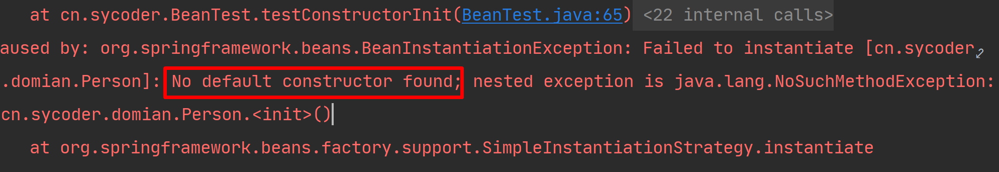
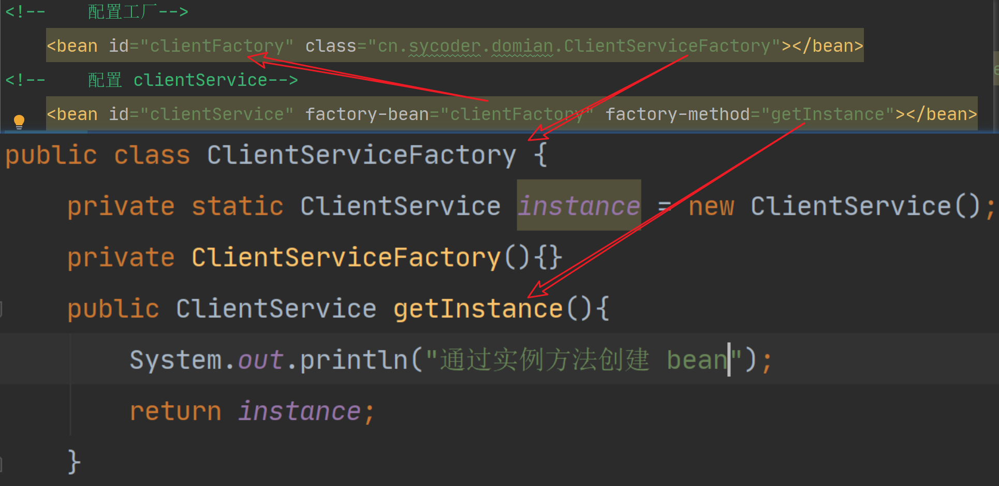
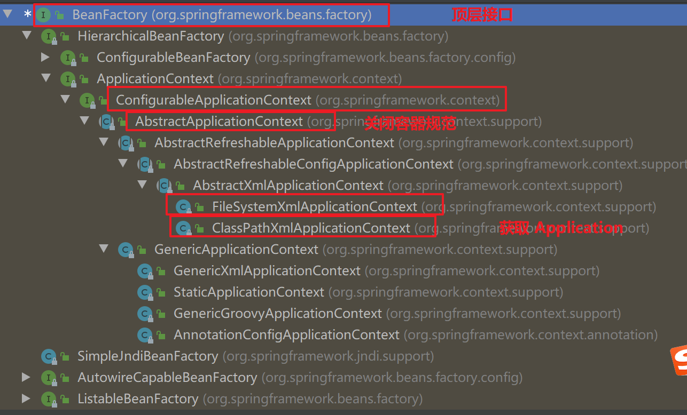

- 文档下载地址：https://docs.spring.io/spring-framework/docs/
- 官方文档地址 https://spring.io/

# 一、Spring 简介

## 1.简介

- **Spring framework** 是 Spring 基础框架
- 学习Spring 家族产品
  - Spring framework
  - SpringBoot
  - SpringCloud
- Spring 能用来做什么
  - 开发 WEB 项目
  - 微服务
  - 分布式系统
- Spring framework 是 Spring 最基础的框架，是其它框架技术的基础
- SpringBoot 是用来做简化开发的，单一项目
- SpringCloud 做分布式微服务相关的，拆分大单体项目为小模块项目


## 2.Spring 概述

- 学习内容

  

- Spring framework 介绍

  - 概述：spring 提供了基础框架，你不必关心框架细节，只需要专注于代码业务逻辑
  - 优点：
    - 组件化模块化的：通过很多模块与组件组合成 spring 应用，以后可以通过 Xml 或者注解的方式去操作
    - 控制反转（ *Inversion of Control* (IoC) ）：传统创建对象都是通过认为的new 对象的方式，把控制创建对象的权利转交给Spring
    - 依赖注入（Dependency Injection）：自动化的注入属性

## 3.模块

- Spring 系统架构图

  

  

- 模块介绍

  - **Core Container**：核心容器，是Spring 最核心的模块，以后用到的都依赖该模块实现
  - **Aop**：面向切面编程，目的是不改变原有代码的前提下对功能进行增强
    - Aspects：是Aop 具体实现
  - **Data Access/Integration**：数据层
    - Data Access：数据访问的
    - Data Integration：数据集成
    - Transactions：支持事务操作，通过 AOP 来实现，释放我们的双手
  - **Web**：WEB 层，SpringMVC 框架的
    - Servlet
    - Web
  - **Test**：做集成测试
    - 整合 Junit 做单元测试

# 二、IOC

## 1.概述

- IOC：Inversion of Control 控制反转，可以让容器负责对象的创建以及销毁操作，对象在容器中叫 bean

## 2.回顾问题

- 问题：写了太多与业务无关的代码

  

  - 耦合度非常高，写了很多和业务无关的代码
  - 不利于项目的升级迭代

  

- 思考的解决方案

  - 能够直接获取 mapper 接口，而不必去关心底层的获取方式

    

  

  

## 3.bean 配置

### 1.创建 spring01 项目

- 项目结构如下

  

- 添加 Spring 依赖

  ```xml
  <dependencies>
  <!--        添加 spring 依赖-->
          <dependency>
              <groupId>org.springframework</groupId>
              <artifactId>spring-context</artifactId>
              <version>5.2.17.RELEASE</version>
          </dependency>
  <!--        添加 junit 依赖-->
          <dependency>
              <groupId>junit</groupId>
              <artifactId>junit</artifactId>
              <version>4.12</version>
  <!--            <scope>test</scope>-->
          </dependency>
      </dependencies>
  ```

### 2.添加 Student 类

- 创建空学生类

  ```java
  public class Student {
  }
  ```

### 3.添加 Spring 配置文件

- 添加方式如下

  

- 开始配置 javabean

  ```xml
  <?xml version="1.0" encoding="UTF-8"?>
  <beans xmlns="http://www.springframework.org/schema/beans"
         xmlns:xsi="http://www.w3.org/2001/XMLSchema-instance"
         xsi:schemaLocation="http://www.springframework.org/schema/beans http://www.springframework.org/schema/beans/spring-beans.xsd">
  <!--    配置 Student 学生类-->
      <bean id="student" name="stu" class="cn.sycoder.domian.Student"></bean>
  </beans>
  ```

### 4.属性介绍

| 属性名称 | 说明                              |
| -------- | --------------------------------- |
| id       | 给 bean 起名字（定义id 不能重复） |
| name     | 给 bean 起别名                    |
| class    | 类全限定类名                      |

## 4.容器创建

### 1.ClassPathXmlApplicationContext(常用)

```java
ApplicationContext context = new ClassPathXmlApplicationContext("beans.xml");
System.out.println(context);
```


### 2.FileSystemXmlApplicationContext

```java
ApplicationContext ctx = new FileSystemXmlApplicationContext("绝对路径地址");
```

- 使用 ClassPathXmlApplicationContext 获取方式会出现如下问题

  

  

## 5.从容器中获取 bean

### 1.根据id 获取

```java
ApplicationContext context = new ClassPathXmlApplicationContext("beans.xml");
        //从容器中根据 id 获取 bean 对象
Student stu = (Student)context.getBean("student");
		//通过别名获取 bean 对象
Student stuByName = (Student)context.getBean("stu");
```

- 注意：如果id重复会有如下问题

  

  

### 2.根据id和类型

```java
ApplicationContext context = new ClassPathXmlApplicationContext("beans.xml"); 
final Student student = context.getBean("student", Student.class);
```


### 3.根据类型获取bean

```java
ApplicationContext context = new ClassPathXmlApplicationContext("beans.xml");
final Student bean = context.getBean(Student.class);
```

- 注意：使用类型获取的时候，一定要保证容器中只有一个 javabean 对象

  

### 4.注意点

- bean 的配置spring 是使用反射调用对象的无参构造器实现的。所以必须提供无参构造器，否则会出现如下错误

  

## 6.设计模式(⭐️)

### 1.单例模式

- 概述：属于创建型模式，提供了创建对象的最佳方式。单例模式只能有一个单一的类

- 懒汉式单例模式:需要用的时候，再去把对象创建出来

  ```java
  public class SingleObject {
      //线程不安全的懒汉式单例模式
      private static SingleObject instance;
  
      public static SingleObject getInstance(){
          if(instance == null){
              instance =new SingleObject();
          }
          return instance;
      }
  
  }
  ```

  

- 饿汉式单例模式：不管你有没有，我先创建出来

  ```java
  public class SingleObjectE {
      //线程不安全的饿汉式单例模式
      private static SingleObjectE instance = new SingleObjectE();
  
      public static SingleObjectE getInstance(){
          return instance;
      }
  }
  ```

  

### 2.工厂模式

- 概述：也是属于创建型模式，目的也是提供创建对象的最佳方式

- 静态工厂

  ```java
  public class BeanFactory {
  
      public static Student getBean() {
          return new Student();
      }
  
      public static Object getBean(String name) {
          if ("Student".equals(name))
              return new Student();
          else if("SingleObject".equals(name)) {
              return new SingleObject();
          }else{
              return new Object();
          }
      }
  
  }
  ```

- 实例工厂

  ```java
  public class BeanFactory {
      
      public Object getBean(){
          return new Student();
      }
  }
  ```

### 3.通过反射获取 xml 配置创建对象（⭐️）

- 导依赖

  ```xml
  <dependency>
      <groupId>org.dom4j</groupId>
      <artifactId>dom4j</artifactId>
      <version>2.1.3</version>
  </dependency>
  <dependency>
      <groupId>jaxen</groupId>
      <artifactId>jaxen</artifactId>
      <version>1.2.0</version>
  </dependency>
  ```

- 代码实现

  ```java
  public class XmlCreateBean {
      /**
       * 模拟spring 容器创建 javabean
       * @param configName
       * @param id
       * @return
       */
      public static Object getBean(String configName,String id){
          final SAXReader saxReader = new SAXReader();
          try {
              final Document dom = saxReader.read(configName);
              final Element element = dom.getRootElement();
              final List<Element> beans = element.elements("bean");
              //获取每一个 bean
              for (Element bean : beans) {
                  if(id.equals(bean.attributeValue("id"))){
                      final String aClass = bean.attributeValue("class");
                      final Class<?> clz = Class.forName(aClass);
                      
                      Constructor<?> declaredConstructor = clz.getDeclaredConstructor();
                      declaredConstructor.setAccessible(true);
                      return declaredConstructor.newInstance();
                      
                      // return clz.newInstance();
                  }
              }
          } catch (Exception e) {
              e.printStackTrace();
          }
          return null;
      }
  }
  ```
  
  

## 7.bean 实例化

- bean 交给 spring 创建，底层究竟是怎么创建的？
- 实例化 bean 三种方式：
  - 构造器(常用)
  - 静态工厂方法
  - 实例工厂方法
  - 实现 FactoryBean（常用）

### 1.无参构造器实例化

- 新建 person 类，底层是通过  clz.getDeclaredClasses() 获取构造器

  ```java
  public class Person {
      
      public Person(){
          
      }
      
  }
  ```

- 配置 Person bean

  ```xml
  <bean id="person" class="cn.sycoder.domian.Person"></bean>
  ```

- 从容器中获取 bean

  ```java
  @Test
      public void testConstructorInit(){
          final ClassPathXmlApplicationContext context = new ClassPathXmlApplicationContext("beans.xml");
          Person p = (Person) context.getBean("person");
  
      }
  ```

- 修改构造器，添加参数测试，提示找不到无参构造器

  

  

### 2.静态工厂方法实例化

- 创建 clintServer 类,提供静态工厂方法

  ```java
  public class ClientServer {
      //创建自身对象并且私有化
      private static ClientServer clientServer = new ClientServer();
      // 使得不可以通过new来实例化对象
      private ClientServer() {}
      public static ClientServer createInstance(){
          return clientServer;
      }
  }
  ```

- 配置bean 的 xml

  ```xml
  <bean id="clientServer" class="cn.sycoder.domian.ClientServer" factory-method="createInstance"></bean>
  ```

- 获取 bean

  ```java
  @Test
      public void testFactoryStaticMethodInit(){
          final ClassPathXmlApplicationContext context = new ClassPathXmlApplicationContext("beans.xml");
          final ClientServer bean = context.getBean(ClientServer.class);
      }
  ```

  

  

- 配置关系

  

  

  

### 3.实例工厂方法实例化

- 创建实例工厂类

  ```java
  public class DefaultServiceLocator {
      private static ClientService clientService = new ClientServiceImpl();
      private static AccountService accountService = new AccountServiceImpl();
      private DefaultServiceLocator() {}
      public ClientService createClientServiceInstance() {
          return clientService;
      }
      public AccountService createAccountServiceInstance() {
          return accountService;
      }
  }
  
  class ClientService{
      
  }
  
  class AccountService{
      
  }
  ```

- 配置 bean

  ```xml
  <bean id="serviceLocator" class="examples.DefaultServiceLocator">
   <!-- inject any dependencies required by this locator bean -->
  </bean>
  
  <bean id="clientService"
   class="cn.sycoder.domian.ClientService"
   factory-bean="serviceLocator"
   factory-method="createClientServiceInstance"/>
  
  <bean id="accountService"
   class="cn.sycoder.domian.AccountService"
   factory-bean="serviceLocator"
   factory-method="createAccountServiceInstance"/>
  ```

- 获取bean

  ```java
  @Test
      public void testFactoryInstanceMethodInit(){
          final ClassPathXmlApplicationContext context = new ClassPathXmlApplicationContext("beans.xml");
          final ClientService bean = context.getBean(ClientService.class);
      }
  ```

- 配置关系

  

### 4.FactoryBean

- 创建员工类

  ```java
  public class Employee {
      public void check(){
          System.out.println("检查是否能够拿到员工类对象");
      }
  }
  ```

- 创建员工 factory 类实现 FactoryBean接口

  ```java
  public class EmployeeFactory implements FactoryBean<Employee> {
      public Employee getObject() throws Exception {
          System.out.println("获取 emp 对象");
          return new Employee();
      }
  
      public Class<?> getObjectType() {
          return Employee.class;
      }
  	// 设置是否是单例设计模式
      public boolean isSingleton() {
          return false;
      }
  }
  ```

- 配置工厂类(并没有直接配置 emp 类)

  ```xml
  <bean id="employee" class="cn.sycoder.domian.EmployeeFactory"></bean>
  ```

- 获取 emp 对象

  ```java
  @Test
      public void testFactoryBeanInit(){
          final ClassPathXmlApplicationContext context = new ClassPathXmlApplicationContext("beans.xml");
          final Employee emp = (Employee)context.getBean("employee");
          emp.check();
      }
  ```

- 实现方法说明

  - **isSingleton:如果是 true 返回单例的对象**

    > 默认是true。
  
    ```java
    public boolean isSingleton() {
            return true;
        }
    ```

  - getObject:进行对象创建的
  
    ```java
    public Employee getObject() throws Exception {
        System.out.println("获取 emp 对象");
        return new Employee();
    }
    ```
  
    

# 三、DI

## 1.概述

- 概述：Dependency Injection 依赖注入，给对象设置属性，曾经我们需要自己去创建 mapper 对象，才能调用，现在交给 spring 创建，并且使用 DI 注入，直接拿来用，程序员就可以更加关注业务代码而不是创建对象
- 给对象设置属性方式：
  - 构造器
  - set 方法
- spring 也是通过构造器以及set方法来实现属性设置

## 2.回顾问题

- 如果只给了 mapper 对象，那么调用的时候会出现空指针

  

- 解决方式：使用 DI 注入，解决方案如下

  

## 3.构造器依赖注入

### 3.0 项目结构


### 3.1.创建学生类

```java
public class Student {
}
```

### 3.2.创建Mapper 接口以及实现类

- 创建 Mapper 接口

  ```java
  public interface StudentMapper {
      void insert(Student stu);
      
      int delete(Long id);
  }
  ```

- 创建 Mapper 实现类（底层都是将接口实现）

  ```java
  public class StudentMapperImpl implements StudentMapper{
      public void insert(Student stu) {
          System.out.println("保存学生信息");
      }
  
      public int delete(Long id) {
          System.out.println("删除id="+id+"的学生信息");
          return 1;
      }
  }
  ```

- 将 Mapper 交给容器管理

  ```xml
  <bean id="studentMapper" class="cn.sycoder.di.mapper.StudentMapperImpl"></bean>
  ```

  

### 3.3.创建 service 接口以及实现类

- 创建 service 接口

  ```java
  public interface IStudentService {
      void insert(Student stu);
  
      int delete(Long id);
  }
  ```

- 创建 service 实现类

  ```java
  public class StudentServiceImpl implements IStudentService {
  
      private StudentMapper mapper;
  
      public void insert(Student stu) {
          mapper.insert(stu);
      }
  
      public int delete(Long id) {
          return mapper.delete(id);
      }
  }
  ```

- 将 service 交给容器管理

  ```xml
  <bean id="iStudentService" class="cn.sycoder.di.service.impl.StudentServiceImpl"></bean>
  ```

  

### 3.4.如果没有使用DI注入直接调用

- 会产生如下问题

  


### 3.5.配置构造器注入属性

- 配置 service 构造器

  ```java
  public class StudentServiceImpl implements IStudentService {
  
      private StudentMapper mapper;
  
      public StudentServiceImpl(StudentMapper mapper){
          this.mapper = mapper;
      }
  
      public void insert(Student stu) {
          mapper.insert(stu);
      }
  
      public int delete(Long id) {
          return mapper.delete(id);
      }
  }
  ```

- 配置 xml

  ```xml
  <!--    配置 service-->
      <bean id="iStudentService" class="cn.sycoder.di.service.impl.StudentServiceImpl">
          <constructor-arg name="mapper" ref="studentMapper"></constructor-arg>
      </bean>
  <!--    配置 mapper-->
      <bean id="studentMapper" class="cn.sycoder.di.mapper.StudentMapperImpl"></bean>
  ```

- 注意：

  - name:构造器的参数名称

  - ref:配置文件中其它 bean 的名称

  - 图示如下

    

    

### 3.6.构造器配置多个引用类型参数

- service

  ```java
  public class StudentServiceImpl implements IStudentService {
  
      private StudentMapper mapper;
  
      private UserMapper userMapper;
  
      public StudentServiceImpl(StudentMapper mapper,UserMapper userMapper){
          this.mapper = mapper;
          this.userMapper = userMapper;
      }
  
      public void insert(Student stu) {
          mapper.insert(stu);
      }
  
      public int delete(Long id) {
          userMapper.delete(id);
          return mapper.delete(id);
      }
  }
  ```

- mapper

  ```java
  public interface UserMapper {
      int delete(Long id);
  }
  ```

- mapper 实现类

  ```java
  public class UserMapperImpl implements UserMapper{
  
      public int delete(Long id) {
          System.out.println("删除id="+id+"的用户信息");
          return 1;
      }
  }
  ```

- 配置

  ```xml
  <beans xmlns="http://www.springframework.org/schema/beans"
         xmlns:xsi="http://www.w3.org/2001/XMLSchema-instance"
         xsi:schemaLocation="http://www.springframework.org/schema/beans http://www.springframework.org/schema/beans/spring-beans.xsd">
  <!--    配置 service-->
      <bean id="iStudentService" class="cn.sycoder.di.service.impl.StudentServiceImpl">
          <constructor-arg name="mapper" ref="studentMapper"></constructor-arg>
          <constructor-arg name="userMapper" ref="userMapper"></constructor-arg>
      </bean>
  <!--    配置学生mapper-->
      <bean id="studentMapper" class="cn.sycoder.di.mapper.StudentMapperImpl"></bean>
  <!--    配置用户mapper-->
      <bean id="userMapper" class="cn.sycoder.di.mapper.UserMapperImpl"></bean>
  </beans>
  ```

  

### 3.7.构造器配置多个基本数据类型参数

| Attribute | Locate  the constructor argument                           |
| --------- | ---------------------------------------------------------- |
| name      | 根据参数的名称                                             |
| type      | 根据参数类型（如果，存在相同类型的参数，会出现映射不准确） |
| index     | 根据位置确定（从0开始）                                    |


- service

  ```java
  public class StudentServiceImpl implements IStudentService {
  
      private String name;
  
      private int age;
  
      private StudentMapper mapper;
  
      private UserMapper userMapper;
  
      public StudentServiceImpl(String name,int age,StudentMapper mapper,UserMapper userMapper){
          this.name = name;
          this.age = age;
          this.mapper = mapper;
          this.userMapper = userMapper;
      }
  
      public void insert(Student stu) {
          mapper.insert(stu);
      }
  
      public int delete(Long id) {
          System.out.println( name+":"+age);
          userMapper.delete(id);
          return mapper.delete(id);
      }
  }
  ```

- xml

  ```xml
  <?xml version="1.0" encoding="UTF-8"?>
  <beans xmlns="http://www.springframework.org/schema/beans"
         xmlns:xsi="http://www.w3.org/2001/XMLSchema-instance"
         xsi:schemaLocation="http://www.springframework.org/schema/beans http://www.springframework.org/schema/beans/spring-beans.xsd">
  <!--    配置 service-->
      <bean id="iStudentService" class="cn.sycoder.di.service.impl.StudentServiceImpl">
          <constructor-arg name="userMapper" ref="userMapper"></constructor-arg>
          <constructor-arg name="mapper" ref="studentMapper"></constructor-arg>
          <constructor-arg type="int" value="18"></constructor-arg>
          <constructor-arg type="java.lang.String" value="sy"></constructor-arg>
      </bean>
  <!--    配置学生mapper-->
      <bean id="studentMapper" class="cn.sycoder.di.mapper.StudentMapperImpl"></bean>
  <!--    配置用户mapper-->
      <bean id="userMapper" class="cn.sycoder.di.mapper.UserMapperImpl"></bean>
  </beans>
  ```

- 这种方式会存在参数覆盖的问题，解决方式，删除 type 添加 **index** 属性

  > Use the index attribute to specify explicitly the index of constructor arguments. 
  >
  >  Note：that the index is 0 based.
  
  ```xml
  <?xml version="1.0" encoding="UTF-8"?>
  <beans xmlns="http://www.springframework.org/schema/beans"
         xmlns:xsi="http://www.w3.org/2001/XMLSchema-instance"
         xsi:schemaLocation="http://www.springframework.org/schema/beans http://www.springframework.org/schema/beans/spring-beans.xsd">
  <!--    配置 service-->
      <bean id="iStudentService" class="cn.sycoder.di.service.impl.StudentServiceImpl">
          <constructor-arg name="userMapper" ref="userMapper"></constructor-arg>
          <constructor-arg name="mapper" ref="studentMapper"></constructor-arg>
          <constructor-arg index="2" value="18"></constructor-arg>
          <constructor-arg index="1" value="1"></constructor-arg>
          <constructor-arg type="java.lang.String" value="sy"></constructor-arg>
  
      </bean>
  <!--    配置学生mapper-->
      <bean id="studentMapper" class="cn.sycoder.di.mapper.StudentMapperImpl"></bean>
  <!--    配置用户mapper-->
      <bean id="userMapper" class="cn.sycoder.di.mapper.UserMapperImpl"></bean>
  </beans>
  ```
  
  

## 4.setter依赖注入

- 原理：

  - **Spring框架通过底层调用对象属性对应的setter方法，完成成员变量的赋值**。

  - 这种方式的优势在于实现了代码与配置文件的解耦合，属性的值都写在XML配置文件里面，后续如果需要修改属性的值，可以直接修改XML文件中的内容，而无需改动代码层面。

- 步骤:

  - **提供setter和getter方法**：在需要注入属性的Java类中，为需要注入的属性提供对应的setter和getter方法。

    > Note: set 方法严格采用驼峰的命名方式
    >
    > ```java
    > private String name;
    > public void setName(String name) {
    >     this.name = name;
    > }
    > ```

    

  - **配置Spring的配置文件**：在Spring的配置文件（如applicationContext.xml）中，通过`<bean>`标签定义Bean，并通过`<property>`标签指定需要注入的属性及其值。`<property>`标签的`name`属性应与Java类中的属性名一致，`value`属性则指定了要注入的值。

- 使用 property 属性
  - `name`: 应与Java类中的属性名一致
  - `value`:指定了要注入的值给值
  - `ref`: 允许将一个Spring容器中已经创建的Bean引用到当前正在配置的Bean的属性中。通过这种方式，可以在不同的Bean之间建立依赖关系，实现依赖注入（Dependency Injection）。


### 4.1.创建员工类

```java
public class Employee {
}
```

### 4.2.创建 mapper 接口以及实现类

- mapper 接口

  ```java
  public interface EmployeeMapper {
      int delete(Long id);
  }
  ```

- mapper 实现类

  ```java
  public class EmployeeMapperImpl implements EmployeeMapper {
      public int delete(Long id) {
          System.out.println("删除当前员工id:"+id);
          return 1;
      }
  }
  ```

### 4.3.创建 servie 接口以及实现类

- 创建 service 接口

  ```java
  public interface IEmployeeService {
      int delete(Long id);
  }
  ```

- 创建 service 接口实现类 

  ```java
  public class EmployeeServiceImpl implements IEmployeeService {
  
      private EmployeeMapper mapper;
  
      public int delete(Long id) {
          return mapper.delete(id);
      }
  }
  ```

### 4.4.配置 setter 注入

- 配置bean

  ```xml
  <?xml version="1.0" encoding="UTF-8"?>
  <beans xmlns="http://www.springframework.org/schema/beans"
         xmlns:xsi="http://www.w3.org/2001/XMLSchema-instance"
         xsi:schemaLocation="http://www.springframework.org/schema/beans http://www.springframework.org/schema/beans/spring-beans.xsd"><!--    配置mapper实现类-->
  <!--    配置mapper-->
      <bean id="empMapper" class="cn.sycoder.di.setter.mapper.EmployeeMapperImpl"></bean>
  <!--    配置service-->
      <bean id="empService" class="cn.sycoder.di.setter.service.impl.EmployeeServiceImpl"></bean>
  </beans>
  ```

  

- service 实现中提供 mapper 的setter 方法

  ```java
  public class EmployeeServiceImpl implements IEmployeeService {
  
      private EmployeeMapper employeeMapper;
  
      public int delete(Long id) {
          return employeeMapper.delete(id);
      }
      
      public void setEmployeeMapper(EmployeeMapper employeeMapper){
          this.employeeMapper = employeeMapper;
      }
  }
  ```

  

- 修改 beans.xml 通过 setter 注入

  ```xml
  <?xml version="1.0" encoding="UTF-8"?>
  <beans xmlns="http://www.springframework.org/schema/beans"
         xmlns:xsi="http://www.w3.org/2001/XMLSchema-instance"
         xsi:schemaLocation="http://www.springframework.org/schema/beans http://www.springframework.org/schema/beans/spring-beans.xsd"><!--    配置mapper实现类-->
  <!--    配置mapper-->
      <bean id="empMapper" class="cn.sycoder.di.setter.mapper.EmployeeMapperImpl"></bean>
  <!--    配置service-->
      <bean id="empService" class="cn.sycoder.di.setter.service.impl.EmployeeServiceImpl">
          <property name="employeeMapper" ref="empMapper"></property>
      </bean>
  </beans>
  ```

- 获取 service 执行 delete 方法

  ```java
  @Test
      public void testSetDi(){
          final ClassPathXmlApplicationContext context = new ClassPathXmlApplicationContext("DiSetterBeans.xml");
          final IEmployeeService empService = (IEmployeeService) context.getBean("empService");
          empService.delete(2L);
      }
  ```

  

  


### 4.5.配置多个 setter 方法注入多个属性

- 给service 添加新的属性以及新的setter方法

  ```java
  public class EmployeeServiceImpl implements IEmployeeService {
  
      private EmployeeMapper employeeMapper;
  
      private UserMapper userMapper;
  
      public int delete(Long id) {
          return employeeMapper.delete(id);
      }
  
      public void setEmployeeMapper(EmployeeMapper employeeMapper){
          System.out.println("=======使用 setter 注入=======");
          this.employeeMapper = employeeMapper;
      }
  
      public void setUserMapper(UserMapper mapper){
          this.userMapper = mapper;
      }
  }
  ```

- 配置 userMapper bean

  ```xml
  <?xml version="1.0" encoding="UTF-8"?>
  <beans xmlns="http://www.springframework.org/schema/beans"
         xmlns:xsi="http://www.w3.org/2001/XMLSchema-instance"
         xsi:schemaLocation="http://www.springframework.org/schema/beans http://www.springframework.org/schema/beans/spring-beans.xsd"><!--    配置mapper实现类-->
  <!--    配置mapper-->
      <bean id="empMapper" class="cn.sycoder.di.setter.mapper.EmployeeMapperImpl"></bean>
  <!--    配置service-->
      <bean id="empService" class="cn.sycoder.di.setter.service.impl.EmployeeServiceImpl">
          <property name="employeeMapper" ref="empMapper"></property>
      </bean>
  <!--    配置 userMapper-->
      <bean id="userMapper" class="cn.sycoder.di.constructor.mapper.StudentMapperImpl"></bean>
  </beans>
  ```

- 通过 setter 注入

  ```xml
  <?xml version="1.0" encoding="UTF-8"?>
  <beans xmlns="http://www.springframework.org/schema/beans"
         xmlns:xsi="http://www.w3.org/2001/XMLSchema-instance"
         xsi:schemaLocation="http://www.springframework.org/schema/beans http://www.springframework.org/schema/beans/spring-beans.xsd"><!--    配置mapper实现类-->
  <!--    配置mapper-->
      <bean id="empMapper" class="cn.sycoder.di.setter.mapper.EmployeeMapperImpl"></bean>
  <!--    配置service-->
      <bean id="empService" class="cn.sycoder.di.setter.service.impl.EmployeeServiceImpl">
          <property name="employeeMapper" ref="empMapper"></property>
          <property name="userMapper" ref="userMapper"></property>
      </bean>
  <!--    配置 userMapper-->
      <bean id="userMapper" class="cn.sycoder.di.constructor.mapper.UserMapperImpl"></bean>
  </beans>
  ```

- 获取 service 操作delete 方法

  ```java
  @Test
      public void testSetterSDi(){
          final ClassPathXmlApplicationContext context = new ClassPathXmlApplicationContext("DiSetterBeans.xml");
          final IEmployeeService empService = (IEmployeeService) context.getBean("empService");
          empService.delete(2L);
      }
  ```

### 4.6.使用 setter 注入简单类型

- 修改 service 类，提供两个属性 int age = 18,String name = "sy"

  ```java
  public class EmployeeServiceImpl implements IEmployeeService {
  
      private EmployeeMapper employeeMapper;
  
      private UserMapper userMapper;
      
      private String name;
      
      private int age;
      
      public void setName(String name){
          this.name = name;
      }
      public void setAge(int age){
          this.age = age;
      }
  
      public int delete(Long id) {
          System.out.println(name + ":" + age);
          userMapper.delete(id);
          return employeeMapper.delete(id);
      }
  
      public void setEmployeeMapper(EmployeeMapper employeeMapper){
          System.out.println("=======EmployeeMapper使用 setter 注入=======");
          this.employeeMapper = employeeMapper;
      }
  
      public void setUserMapper(UserMapper mapper){
          System.out.println("=======UserMapper使用 setter 注入=======");
          this.userMapper = mapper;
      }
  }
  ```

- 配置 xml 设置值

  ```xml
  <?xml version="1.0" encoding="UTF-8"?>
  <beans xmlns="http://www.springframework.org/schema/beans"
         xmlns:xsi="http://www.w3.org/2001/XMLSchema-instance"
         xsi:schemaLocation="http://www.springframework.org/schema/beans http://www.springframework.org/schema/beans/spring-beans.xsd"><!--    配置mapper实现类-->
  <!--    配置mapper-->
      <bean id="empMapper" class="cn.sycoder.di.setter.mapper.EmployeeMapperImpl"></bean>
  <!--    配置service-->
      <bean id="empService" class="cn.sycoder.di.setter.service.impl.EmployeeServiceImpl">
          <property name="employeeMapper" ref="empMapper"></property>
          <property name="userMapper" ref="userMapper"></property>
          <property name="name" value="sy"></property>
          <property name="age" value="18"></property>
      </bean>
  <!--    配置 userMapper-->
      <bean id="userMapper" class="cn.sycoder.di.constructor.mapper.UserMapperImpl"></bean>
  </beans>
  ```

- 可能出现的问题 (value 数据类型 和 setter方法对应参数类型不匹配)

  

### 4.7.setter 注入总结

- 对于引用数据类型来说使用
  
  - ```xml
    <property name="" ref=""></property>
    ```
  
- 对于简单数据类型
  - ```xml
    <property name="" value=""></property>
    ```

## 5.集合注入

- List
- Set
- Map
- Array
- Properties

### 1.添加CollectiosDemo类

```java
public class CollectionsDemo {
    private List<Integer> list;
    private Map<String,String> map;
    private Set<String> set;
    private Properties properties;
    private int[] arr;
    

    public void print(){
        System.out.println("list:"+list);
        System.out.println("map:"+map);
        System.out.println("set:"+set);
        System.out.println("properties:"+properties);
        System.out.println("arr:"+ Arrays.toString(arr));
    }

    public void setList(List<Integer> list) {
        this.list = list;
    }

    public void setMap(Map<String, String> map) {
        this.map = map;
    }

    public void setSet(Set<String> set) {
        this.set = set;
    }

    public void setProperties(Properties properties) {
        this.properties = properties;
    }

    public void setArr(int[] arr) {
        this.arr = arr;
    }
}
```


### 2.配置 bean

```xml
<?xml version="1.0" encoding="UTF-8"?>
<beans xmlns="http://www.springframework.org/schema/beans"
       xmlns:xsi="http://www.w3.org/2001/XMLSchema-instance"
       xsi:schemaLocation="http://www.springframework.org/schema/beans http://www.springframework.org/schema/beans/spring-beans.xsd">
    <bean id="collectionsDemo" class="cn.sycoder.collections.CollectionsDemo">
<!--        注入 list-->
        <property name="list">
            <list>
                <value>1</value>
                <value>2</value>
                <value>3</value>
            </list>
        </property>
        <property name="map">
            <map>
                <entry key="name" value="sy"/>
                <entry key ="age" value="18"/>
            </map>
        </property>
        <property name="set">
            <set>
                <value>just some string</value>
                <value>just string</value>
            </set>
        </property>
        <property name="properties">
            <props>
                <prop key="url">@example.org</prop>
                <prop key="user">root</prop>
                <prop key="password">123456</prop>
            </props>
        </property>
        <property name="arr">
            <array>
                <value>2</value>
                <value>2</value>
                <value>2</value>
            </array>
        </property>
        
        // 如果想配置null，就用这种方法。
        <property name="email">
           <null/>
        </property>
        
    </bean>
</beans>
```

- 如果不提供setter 方法会出现如下错误

  

  

## 6.自动装配

> Note:
>
> 使用自动装配，依旧要加入setter方法。

### 1.概述

- 概述：IOC容器根据bean所依赖的属性，自动查找并进行自动装配。

### 2.分类

- no 不启用自动装配
- byName 通过名称
  - 按照属性名称进行注入。Spring容器会查找与属性名称相同的Bean对象，并将其注入到对应的属性中。如果找不到对应的Bean对象，则不会进行注入。这种方式要求属性名称和Bean对象的名称（id）必须一致。

- byType 通过类型
  - 按照属性类型进行注入。Spring容器会查找与属性类型相同的Bean对象，并将其注入到对应的属性中。如果找到多个符合条件的Bean对象，Spring会抛出异常。这种方式要求属性类型和Bean对象的类型必须匹配。

- constructor 通过构造器
  - 按照构造方法进行注入。Spring容器会查找与构造方法参数类型相同的Bean对象，并通过构造方法将其注入到Bean中。这种方式要求构造方法的参数类型和Bean对象的类型必须匹配，并且构造方法必须是无参构造方法之外的唯一构造方法（或者是在多个构造方法中通过@Autowired注解指定的一个）。	


### 3.实操

- 准备工作

  ```java
  public class EmployeeService {
      private EmployeeMapperImpl employeeMapper;
      public int delete(Long id) {
          return employeeMapper.delete(id);
      }
      public void setEmployeeMapper(EmployeeMapperImpl employeeMapper){
          System.out.println("=======EmployeeMapper使用 setter 注入=======");
          this.employeeMapper = employeeMapper;
      }
  }
  ```

  ```java
  public class EmployeeMapperImpl{
      public int delete(Long id) {
          System.out.println("删除当前员工id:"+id);
          return 1;
      }
  }
  ```

- 配置 bean 并且通过 byType 自动装配

  ```xml
  <?xml version="1.0" encoding="UTF-8"?>
  <beans xmlns="http://www.springframework.org/schema/beans"
         xmlns:xsi="http://www.w3.org/2001/XMLSchema-instance"
         xsi:schemaLocation="http://www.springframework.org/schema/beans http://www.springframework.org/schema/beans/spring-beans.xsd">
      <bean id="empService" class="cn.sycoder.autowired.EmpService" autowire="byType"></bean>
      <bean id="empMapperImpl" class="cn.sycoder.autowired.EmpMapperImpl"></bean>
  
  </beans>
  ```

- 配置 bean 并且通过 byName 自动装配

  ```xml
  <?xml version="1.0" encoding="UTF-8"?>
  <beans xmlns="http://www.springframework.org/schema/beans"
         xmlns:xsi="http://www.w3.org/2001/XMLSchema-instance"
         xsi:schemaLocation="http://www.springframework.org/schema/beans http://www.springframework.org/schema/beans/spring-beans.xsd">
      <bean id="empService" class="cn.sycoder.autowired.EmpService" autowire="byName"></bean>
      <bean id="empMapperImpl" class="cn.sycoder.autowired.EmpMapperImpl"></bean>
  
  </beans>
  ```

  

- 通过名称和类型的自动装配

  - byName

    - 使用 id 或者是 name 别名
    - 如果自动注入时，有多个相同对象，只能使用 byName

  - byType

    - 根据类型注入

    - 通过 byType 注入要保证容器中只有一个 bean 对象，否则会出现如下错误

      

- 注意：
  - **自动注入的优先级是低于 setter 和 构造器注入的**
  - 自动注入只能用于引用类型，不能用于基本数据类型
  - 推荐使用 byType 方式实现自动注入
  - 注入流程
    - byType 根据 getClass 去注入
    - byName 根据属性名称去注入

## 7.bean scopes

- 定义了Bean在Spring容器中的生命周期和可见性。它决定了Spring容器创建Bean实例的数量以及这些实例的持久性。Bean作用域帮助开发者控制Bean的创建和销毁时机，以及它们在不同上下文中的可用性。

- 常见的作用域

  - **Singleton**（单例）
    - 在Spring容器中，单例作用域的Bean只创建一个实例。
    - 无论容器被请求多少次，都会返回同一个Bean实例。
    - 单例作用域适用于无状态的服务类，因为无状态意味着它们不依赖于任何特定的会话或请求数据。

  - **Prototype**（原型）
    - 每次请求原型作用域的Bean时，都会创建一个新的Bean实例。
    - 这意味着每次从容器中获取原型Bean时，都会得到一个新的对象实例。
    - 原型作用域适用于有状态的Bean，因为每次都需要一个新的实例来保持独立性。
  - **Request**（请求）
    - 请求作用域的Bean在HTTP请求的生命周期内存在。
    - 每个HTTP请求都会创建一个新的Bean实例，并且该实例仅在当前请求中可见。
    - 请求结束时，Bean实例会被销毁。
    - 请求作用域通常用于Web应用程序中与请求相关的数据或处理。
  - **Session**（会话）
    - 会话作用域的Bean在HTTP会话的生命周期内存在。
    - 对于同一个用户会话，Spring容器会创建一个Bean实例并将其存储在会话中。
    - 会话结束时，Bean实例会被销毁。
    - 会话作用域通常用于存储用户会话特定的数据或行为。
  - **Application/GlobalSession**（应用/全局会话）
    - 应用作用域的Bean在ServletContext的生命周期内存在，对于整个Web应用程序都是可见的。
    - 全局会话作用域类似于会话作用域，但它在基于portlet的Web应用程序中用于跨多个portlet会话。
    - 这些作用域通常用于存储应用程序级别的数据或配置

- 单例 singleton

  

- 修改对象变成多个实例的

  

  

- 注意：容器模式就是以单例的方式创建对象的，如果需要修改成非单例，使用 scope 属性修改即可

  - 以后开发中适合将哪些bean对象交给 spring 管理
  - 持久层 mapper
  - 业务层 service
  - 控制层 controller

- 单例bean会出现线程安全吗
  - 判断bean 对象是否存储数据，如果用来存储数据了，会导致线程安全问题
  - 使用局部变量做存储，方法调用结束就销毁了，所以不存在线程安全问题

## 8.bean 生命周期

### 1.概述

- 概述：生命周期就是一个对象从出生到死亡的过程

### 2.使用用户类观察生命周期

- 创建用户类

  ```java
  public class User {
      private String name;
      public User(){
          System.out.println("构造器执行====");
      }
  
      public void setName(String name) {
          System.out.println("调用 set 方法");
          this.name = name;
      }
      
      public void init(){
          System.out.println("调用 init 方法");
      }
      
      public void destroy(){
          System.out.println("调用销毁方法");
      }
  }
  ```

- 配置 bean

  ```xml
  <?xml version="1.0" encoding="UTF-8"?>
  <beans xmlns="http://www.springframework.org/schema/beans"
         xmlns:xsi="http://www.w3.org/2001/XMLSchema-instance"
         xsi:schemaLocation="http://www.springframework.org/schema/beans http://www.springframework.org/schema/beans/spring-beans.xsd">
      <bean id="user" class="cn.sycoder.lifecycle.User" init-method="init" destroy-method="destroy">
          <property name="name" value="sy"></property>
      </bean>
  </beans>
  ```

- 获取 bean 出现如下问题，没有打印销毁方法

  - 原因：
    - spring ioc 容器是运行在 jvm 虚拟机中的
    - 执行 test 方法后 jvm 虚拟机开启，spring 加载配置文件创建 bean 对象，调用构造器以及 init 方法
    - test 方法执行完毕的时候， jvm 退出，spring ioc 容器来不及关闭销毁 bean，所以没有去调用 destroy 方法

  

  - 解决办法，正常关闭容器

    

### 3.BeanPostProcessor

- BeanPostProcessor是Spring框架中一个非常重要的接口，它允许开发者在Spring容器实例化、配置Bean之后，在初始化Bean的前后插入自定义的处理逻辑。

- BeanPostProcessor接口定义了两个方法：
  1. `postProcessBeforeInitialization(Object bean, String beanName)`：在Bean初始化之**前**调用，允许开发者对Bean进行自定义处理，如检查Bean的属性、修改Bean的配置等。处理完成后，需要将Bean作为返回值返回，以便Spring继续后续的初始化流程。
  2. `postProcessAfterInitialization(Object bean, String beanName)`：在Bean初始化之**后**调用，允许开发者对已经初始化的Bean进行进一步的处理，如添加代理对象、进行AOP增强等。同样，处理完成后也需要将Bean作为返回值返回。

- 自定义自己 bean 处理器

  ```java
  public class MyBeanPostProcessor  implements BeanPostProcessor{
      
      //bean 前置处理器
      public Object postProcessBeforeInitialization(Object bean, String beanName) throws BeansException {
    
          System.out.println("bean 的前置处理器");
          return bean;
      }
      
       //bean 后置处理器
      public Object postProcessAfterInitialization(Object bean, String beanName) throws BeansException {
          System.out.println("bean 的后置处理器");
          return bean;
      }
  }
  ```

- 配置 bean

  ```xml
  <?xml version="1.0" encoding="UTF-8"?>
  <beans xmlns="http://www.springframework.org/schema/beans"
         xmlns:xsi="http://www.w3.org/2001/XMLSchema-instance"
         xsi:schemaLocation="http://www.springframework.org/schema/beans http://www.springframework.org/schema/beans/spring-beans.xsd">
      <bean id="user" class="cn.sycoder.lifecycle.User" init-method="init" destroy-method="destroy">
          <property name="name" value="sy"></property>
      </bean>
  
      <bean class="cn.sycoder.lifecycle.MyBeanPostProcessor"></bean>
  </beans>
  ```

### 4.生命周期总结

- bean 对象创建（调用无参构造器）
- 设置属性通过 setter 方法
- init 方法前调用 bean 的前置处理器
- bean 的 init 方法
- bean 的后置处理器
- 对象可以正常使用
- destroy 销毁方法
- ioc 容器关闭
- jvm 虚拟机的退出

# 四、容器执行点

## 1.整合 druid 连接池

- 添加依赖

  ```java
  <dependency>
      <groupId>com.alibaba</groupId>
      <artifactId>druid</artifactId>
      <version>1.2.8</version>
  </dependency>
  ```

### 1.硬编码方式整合

- 新建德鲁伊配置

  ```xml
  <?xml version="1.0" encoding="UTF-8"?>
  <beans xmlns="http://www.springframework.org/schema/beans"
         xmlns:xsi="http://www.w3.org/2001/XMLSchema-instance"
         xsi:schemaLocation="http://www.springframework.org/schema/beans http://www.springframework.org/schema/beans/spring-beans.xsd">
      <bean id="dataSource" class="com.alibaba.druid.pool.DruidDataSource">
          <property name="username" value="root"></property>
          <property name="password" value="123456"></property>
          <property name="driverClassName" value="com.mysql.cj.jdbc.Driver"></property>
          <property name="url" value="jdbc:mysql://localhost:3306/mybatis"></property>
      </bean>
  </beans>
  ```

  

- 注意
  - 属性是通过 set 方法注入进来的

### 2.使用占位符获取连接数据

- 建立 db.properties 配置文件

  ```properties
  username=root
  password=123456
  driverClassName=com.mysql.cj.jdbc.Driver
  url=jdbc:mysql://localhost:3306/mybatis
  ```

- 换成占位符

  ```xml
  <bean id="dataSource1" class="com.alibaba.druid.pool.DruidDataSource">
          <property name="username" value="${username}"></property>
          <property name="password" value="${password}"></property>
          <property name="driverClassName" value="${driverClassName}"></property>
          <property name="url" value="${url}"></property>
      </bean>
  ```

- 配置引用db.properties

  方法一：

  ```xml
  
  <!--    获取db.properties 配置文件-->
      <bean class="org.springframework.beans.factory.config.PropertyPlaceholderConfigurer">
          <property name="location" value="db.properties"></property>
      </bean>
  ```

  方法二:(更加简洁)（推荐）

  ```xml
  <context:property-placeholder location="db.properties"/>
  ```

### 3.注意事项

- <context:property-placeholder location="db.properties"/> 使用这个标签加载配置会加载到电脑系统配置

- 解决方式

  - 方法一： 给配置文件加上前缀变量，同时对应xml文件里的占位符里的内容也要换成jdbc.xxx。

    ```properties
    jdbc.username=root
    jdbc.password=123456
    jdbc.driverClassName=com.mysql.cj.jdbc.Driver
    jdbc.url=jdbc:mysql://localhost:3306/mybatis
    ```
    
  - 添加属性
  
    ```xml
    <context:property-placeholder system-properties-mode="NEVER" location="db.properties"/>
    ```
  
- 加载多个配置文件可以用 * 代替

  ```xml
  <context:property-placeholder system-properties-mode="NEVER" location="*.properties"/>
  ```

  

## 2.容器总结

### 1.容器层级结构

-  按两次 shift 搜索 BeanFactory

  

- 按 ctrl + h 查看继承结构

  

### 2.创建容器

- BeanFactory 是容器顶层接口
- ApplicationContext 核心接口
- AbstractApplicationContext 抽象类，提供了获取 bean 以及加载资源的功能

- **ClassPathXmlApplicationContext** 装载bean的，做初始化的

### 3.bean 配置

```xml
<bean id="user" class="cn.sycoder.lifecycle.User" init-method="init" destroy-method="destroy" scope="默认单例" autowire="byName" lazy-init="false">
        <property name="name" value="sy"></property>
    </bean>
```

- lazy-init:如果开启懒加载，默认是调用时才创建bean (默认是false)
- init-method:初始化方法
- destroy-method:销毁方法
- scope:作用域，单例，原型
- autowire：自动注入
- id:代表名称，必须唯一
- class:全限定类名

### 4.di 注入

- constructor-arg：构造器注入 
- property : setter 注入
- 集合注入


### 5.注意

- 下去的时候，一定要去多练，把 bean 配置， di 注入，以及配置第三方bean 和引入配置文件全部掌握，都是重点
