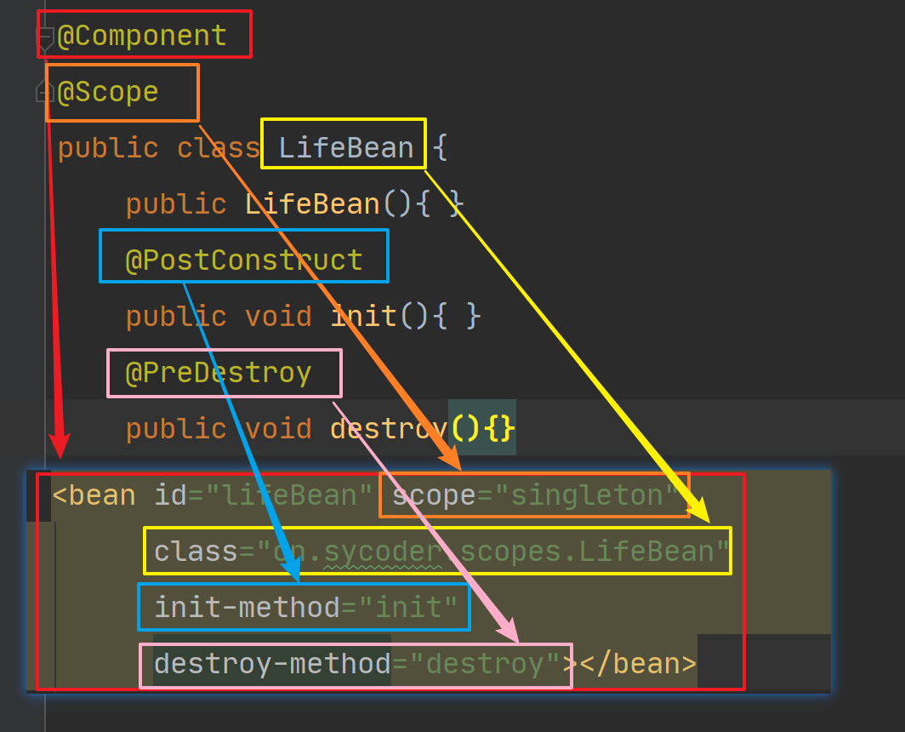
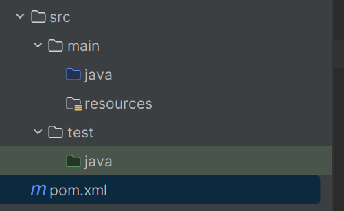

# 一、回顾XML注解 bean 配置

- 创建 bean

  ```java
  public class Student {
  }
  ```

- 配置 xml bean

  ```xml
  <?xml version="1.0" encoding="UTF-8"?>
  <beans xmlns="http://www.springframework.org/schema/beans"
         xmlns:xsi="http://www.w3.org/2001/XMLSchema-instance"
         xsi:schemaLocation="http://www.springframework.org/schema/beans http://www.springframework.org/schema/beans/spring-beans.xsd">
      <bean id="student" class="cn.sycoder.xmlbean.Student"></bean>
  </beans>
  ```

- 获取 bean

  ```java
  @Test
  public void testXmlBean(){
      ApplicationContext context = new ClassPathXmlApplicationContext("xmlbeans.xml");
      final Student student = (Student)context.getBean("student");
      System.out.println(student);
  }
  ```

  

## 1.存在问题

- 需要写xml 配置，比较麻烦，而已获取也很麻烦
- 注入属性也比较麻烦
  - 构造器
  - setter


## 2.解决办法

- 通过注解配置bean 以及注解操作 di 注入

- 注解配置的优点

  - 更简洁
  - 更短
  - 更方便

  

# 二、IOC 注解开发

- 版本了解
  - 2.0版本时开始支持注解开发（2.0之前就是昨天学习的纯 xml 操作）
  - 2.5版本才完善
  - 3.0版本支持纯注解开发

## 1.注解&xml配置Bean

### 1.1配置用户mapper

- 配置 mapper

  ```java
  public interface UserMapper {
      void save();
  }
  ```

- 配置 mapper 实现类(还没有交给 spring 管理)

  ```java
  public class UserMapperImpl implements UserMapper {
      public void save() {
          System.out.println("保存用户成功");
      }
  }
  ```

### 1.2将mapper交给spring管理

- 使用 @Component 注解

- 配置 mapper 实现类

  ```java
  @Component
  public class UserMapperImpl implements UserMapper {
      public void save() {
          System.out.println("保存用户成功");
      }
  }
  ```

- 配置 xml 包扫描路径

  > `<context:component-scan>`:主要作用是自动检测并注册 Bean，以及激活属性注入注解。
  >
  > 1. 扫描指定包及其子包
  >    - `<context:component-scan>` 元素会扫描指定的包（通过 `base-package` 属性指定）及其所有的子包。
  >    - 在扫描过程中，它会查找能够自动注册为 Spring Bean 的类。
  > 2. 查找标注了特定注解的类
  >    - 默认情况下，`<context:component-scan>` 会查找使用构造型（stereotype）注解所标注的类，如 `@Component`、`@Service`、`@Controller` 和 `@Repository`。
  >    - 这些注解分别用于标注组件、服务、控制器和数据仓库层的类。
  > 3. 注册 Bean
  >    - 对于找到的每个符合条件的类，`<context:component-scan>` 会将其注册为一个 Spring Bean。
  >    - 这意味着不需要在 XML 配置文件中显式地使用 `<bean>` 元素来定义这些 Bean。
  
  ```xml
  <context:component-scan base-package="cn.sycoder.xmlAnnotationBean.mapper"/>
  ```
  
  ```xml
  <?xml version="1.0" encoding="UTF-8"?>
  <beans xmlns="http://www.springframework.org/schema/beans"
         xmlns:xsi="http://www.w3.org/2001/XMLSchema-instance"
         xmlns:context="http://www.springframework.org/schema/context"
         xsi:schemaLocation="http://www.springframework.org/schema/beans http://www.springframework.org/schema/beans/spring-beans.xsd http://www.springframework.org/schema/context https://www.springframework.org/schema/context/spring-context.xsd">
      <context:component-scan base-package="cn.sycoder.xmlAnnotationBean.mapper"/>
  </beans>
  ```

### 1.3通过容器获取bean

- 获取 applicationContext

  ```java
   ApplicationContext context = new ClassPathXmlApplicationContext("xmlAndAnnotation.xml");
  ```

- 获取bean

  ```java
  @Test
  public void testComponent(){
      ApplicationContext context = new ClassPathXmlApplicationContext("xmlAndAnnotation.xml");
      final UserMapper bean = context.getBean(UserMapper.class);
      bean.save();
  }
  ```

  

### 1.4Component详解

- 默认不传参，bean 的名称是首字母小写其余不变

  ```java
  正规命名的时候：UserMapperImpl --- userMapperImpl
  不正规命名时候：UUserMapperImpl--- UUserMapperImpl
  ```

- 给bean 指定名称

  ```java
  @Component("u") 参数就是你bean的名称
  @Component(value = "u")
  ```

- **使用位置：具体类的上方，不要使用到接口上**

- 作用：将bean 交给spring管理

- 延伸的注解，注意，和Component一模一样的，只不过是用于给程序员区分业务组件的

  - Controller

    - 用于控制层

      ```java
      @Controller
      public class UserController {
          //写接口
      }
      ```

      

  - Service

    - 用于业务层

      ```java
      @Service
      public class UserServiceImpl implements IUserService {
          public void save() {
          }
      }
      ```

      

  - Repository

    - 用于持久层

      ```java
      @Repository
      public class UserMapperImpl implements UserMapper {
          public void save() {
              System.out.println("保存用户成功");
          }
      }
      ```

      

    

    

## 2.纯注解配置Bean

### 2.1配置学生Mapper

- mapper 接口

  ```java
  public interface StudentMapper {
      void save();
  }
  ```

- mapper 接口实现类

  ```java
  @Repository
  public class StudentMapperImpl implements StudentMapper {
      public void save() {
          System.out.println("保存学生成功");
      }
  }
  ```

### 2.2添加配置类

#### 1@Configuration详解

- 使用 @Configuration

  ```java
  @Configuration
  public class SpringConfig {
  }
  ```

  - 将 SpringConfig 类变成spring 的配置类，替换 xml 配置文件

- 作用：标识该类是spring的配置类

- 配置名称，默认首字母小写

- 属性：

  - **value**：用于指定配置类的名称或别名，该名称会作为Bean的ID存储在Spring IOC容器中。此属性是可选的，默认值为空字符串。

  - **proxyBeanMethods**：从Spring 5.2版本开始引入，用于指定被@Configuration注解标注的配置类是否会被代理，以及配置类中通过@Bean注解定义的Bean对象在IOC容器中是否是单例。当取值为true时（默认值），配置类会被代理，且Bean对象是单例的；当取值为false时，配置类不会被代理，每次调用@Bean注解标注的方法都会返回一个新的Bean对象。
  - **enforceUniqueMethods**：从Spring 6.0版本开始引入，用于指定使用@Bean注解标注的方法是否需要具有唯一的方法名称。当取值为true时（默认值），方法名称必须唯一；当取值为false时，方法名称可以重复，但存在被重叠的风险。

- 使用在类上

#### 2@ComponentScan详解

- 配置包扫描 @ComponentScan

  ```java
  @Configuration
  @ComponentScan("cn.sycoder.annotationBean.mapper")
  public class SpringConfig {
  }
  ```

- 作用：配置包扫描路径,当前包及其子包都会扫描
- **value/basePackages**：指定要扫描的基础包。可以是一个或多个包路径，Spring会扫描这些包及其子包下的所有类。如果未指定，则默认为使用该注解的类的包。

### 2.3获取bean

- 获取 applicationContext

  

  ```java
  ApplicationContext context = new AnnotationConfigApplicationContext(SpringConfig.class);
  ```

- 获取 bean

  ```java
  @Test
      public void testAnnotation(){
          ApplicationContext context = new AnnotationConfigApplicationContext(SpringConfig.class);
          System.out.println(context);
  
          final StudentMapper bean = context.getBean(StudentMapper.class);
          System.out.println(bean);
      }
  ```

## 3.注解开发与xml 的梳理

- 使用@Component 替代 xml 的过程梳理

  

- 使用 @Configuration @ComponentScan 与 xml 配置过程的梳理

  

  

## 4.bean scops

- 配置类

  ```java
  @Configuration
  @ComponentScan({"cn.sycoder.scopes"})
  public class ScopesConfig {
  }
  ```

- 配置 bean

  ```java
  @Component
  public class ScopeBean {
  }
  ```

- 获取 bean 执行发现bean 单例的

  ```java
  @Test
      public void testScope(){
          ApplicationContext context = new AnnotationConfigApplicationContext(ScopesConfig.class);
          final ScopeBean bean = context.getBean(ScopeBean.class);
          final ScopeBean bean1 = context.getBean(ScopeBean.class);
          System.out.println(bean);
          System.out.println(bean1);
      }
  ```

### 4.1通过注解修改 scope

- @Scope

  ```java
  @Component
  @Scope("prototype")
  public class ScopeBean {
  }
  ```

### 4.2@Scope 详解

- 位置：定义到类上方
- 作用：修改对象创建的作用域
- 属性：默认是singleton（单例的），可以修改成 prototype(原型)

## 5.bean 生命周期常用注解

- 建立 bean 与使用

  ```java
  @Component
  public class LifeBean {
  
      public LifeBean(){
          System.out.println("构造器执行了");
      }
      @PostConstruct
      public void init(){
          System.out.println("初始化bean");
      }
      @PreDestroy
      public void destroy(){
          System.out.println("销毁bean");
      }
  }
  ```

### 5.1@PostConstruct详解

- 位置：方法上
- 作用：设置该方法为初始化方法

### 5.2@PreDestroy

- 位置：方法上
- 作用：设置该方法为销毁方法


### 5.3注解与 xml 的梳理




# 三、DI 注解开发（Autowired）

## 1.目前面临问题

- 建立 mapper

  ```java
  public interface EmployeeMapper {
      void save();
  }
  ```

- 建立 mapper 实现类

  ```java
  @Repository
  public class EmployeeMapperImpl implements EmployeeMapper {
      public void save(){
          System.out.println("保存员工信息");
      }
  }
  ```

- 建立 service

  ```java
  public interface IEmployeeService {
      void save();
  }
  ```

- 建立 service 实现类

  ```java
  @Service
  public class EmployeeServiceImpl implements IEmployeeService {
  
      private EmployeeMapper employeeMapper;
  
      public void setEmployeeMapper(EmployeeMapper employeeMapper){
          this.employeeMapper = employeeMapper;
      }
      public void save() {
          employeeMapper.save();
      }
  }
  ```

- 设置配置类

  ```java
  @Configuration
  @ComponentScan("cn.sycoder.di.di01")
  public class DiConfig {
  }
  ```

- 出现空指针异常

  

  

## 2.使用类型注入（⭐️）

- **@Autowired按照类型注入**

- 通过构造器注入

  ```java
  @Autowired
  public EmployeeServiceImpl(EmployeeMapper employeeMapper) {
      this.employeeMapper = employeeMapper;
  }
  ```

- 通过setter 方法注入

  ```java
  @Autowired
  public void setEmployeeMapper(EmployeeMapper employeeMapper) {
      this.employeeMapper = employeeMapper;
  }
  ```

  

- 直接在属性上使用(是以后用得最多的)

  ```java
  @Service
  public class EmployeeServiceImpl implements IEmployeeService {
  
      @Autowired
      private EmployeeMapper employeeMapper;
  
      public void save() {
          employeeMapper.save();
      }
  }
  ```

  - 注意：不提供setter 方法以及构造器是使用反射创建对象的	(⭐️)

    ```java
    @Test
        public void autowired() throws Exception {
            final Class<?> aClass = Class.forName("cn.sycoder.di.di01.service.impl.EmployeeServiceImpl");
            final Object o = aClass.newInstance();
            final Field[] fields = aClass.getDeclaredFields();
            AnnotationConfigApplicationContext context = new AnnotationConfigApplicationContext(DiConfig.class);
            final EmployeeMapper bean = context.getBean(EmployeeMapper.class);
            for (Field field : fields) {
                field.setAccessible(true);
                field.set(o,bean);
            }
            final EmployeeServiceImpl service = (EmployeeServiceImpl) o;
            service.save();
        }
    ```

  - 根据类型注入必须只有一个实现类，否则会报错，添加名称也不行

    

  

- **属性required=false，如果找不到不会报错**

## 3.使用名称注入(Qualifier)

- **@Autowired & @Qualifier**

- @Autowired & @Qualifier必须同时使用，缺一不可

- 解决刚才出现两个实现类没法注入的问题

- 配置mapper 并且指定实现类的名称

  ```java
  public interface EmployeeMapper {
      void save();
  }
  
  @Repository("empMapper2")
  public class EmployeeMapperImpl implements EmployeeMapper {
      public void save(){
          System.out.println("保存员工信息");
      }
  }
  
  @Repository("empMapper1")
  public class EmployeeMapperImpl1 implements EmployeeMapper{
      public void save() {
          System.out.println("save");
      }
  }
  ```

  

- 注入的时候使用名称注入

  ```java
  @Service
  public class EmployeeServiceImpl implements IEmployeeService {
  
      @Autowired(required = false)
      @Qualifier("empMapper1")
      private EmployeeMapper employeeMapper;
  
      public void save() {
          employeeMapper.save();
      }
  
  }
  ```

## 4.简单数据类型注入

- @Value

  ```java
  @Component
  public class DbProperties {
      
      @Value("sy")
      private String username;
      @Value("123456")
      private String password;
      
  }
  ```

- 硬编码，太垃圾了，需要改成动态

## 5.注解读取配置文件参数

- @Value

- 修改配置类

  ```java
  @Configuration
  @ComponentScan("cn.sycoder.di.di01")
  @PropertySource("db.properties")
  public class DiConfig {
  }
  ```

- 修改获取方式使用 ${} 的方式

  ```java
  @Component
  public class DbProperties {
  
      @Value("${username}")
      private String username;
      @Value("${password}")
      private String password;
  
      public void test(){
          System.out.println(username + ":" + password);
      }
  }
  ```

  

### 5.1@PropertySource

- @PropertySource 加载配置文件

- 位置：配置类上

- 作用导入配置文件

- 对于多个配置文件

  ```java
  @Configuration
  @ComponentScan("cn.sycoder.di.di01")
  @PropertySource({"db.properties","xx.properties"})
  public class DiConfig {
  }
  ```

  

## 6.注解配置第三方bean

### 6.1配置 druid

- 添加依赖

  ```java
  <dependency>
      <groupId>com.alibaba</groupId>
      <artifactId>druid</artifactId>
      <version>1.2.8</version>
  </dependency>
  ```

  

- 先添加配置类 SpringConfig

  ```java
  @Configuration
  public class SpringConfig {
  
  
      public DataSource dataSource(){
          final DruidDataSource source = new DruidDataSource();
          source.setUsername("root");
          source.setPassword("123456");
          source.setDriverClassName("com.mysql.cj.jdbc.Driver");
          source.setUrl("jdbc:mysql://localhost:3306/mybatis");
          return source;
      }
  
  }
  ```

- 传统做法存在硬编码，DataSource 并且没有交给 spring 管理,每次都需要重新新建 DataSource ,并不存在单例一说

  ```java
  @Test
      public void testDruid(){
          AnnotationConfigApplicationContext context = new AnnotationConfigApplicationContext(SpringConfig.class);
          final SpringConfig bean = context.getBean(SpringConfig.class);
          System.out.println(bean.dataSource());
      }
  ```


### 6.2@Bean注解

- #### 基本用法

  - **标记方法**：@Bean注解用于标记一个方法，表明该方法会返回一个对象，该对象应该被注册为Spring应用上下文中的一个Bean。
  - **与@Configuration一起使用**：通常，@Bean注解与@Configuration注解一起使用，后者用于标记一个类为Spring的配置类。
  - **默认Bean名称**：如果不指定，则默认使用方法名作为Bean的名称。例如，如果方法名为`myBean`，则Bean的名称也为`myBean`。

- ### 属性

  - **name/value**：用于指定Bean的名称。可以通过name属性或value属性（两者是别名关系）来指定Bean的名称。如果不指定，则默认使用方法名作为Bean的名称。
  - **initMethod**：用于指定Bean的初始化方法。当Bean被创建时，会调用此方法。
  - **destroyMethod**：用于指定Bean的销毁方法。当Bean被销毁时，会调用此方法。需要注意的是，如果Bean实现了`DisposableBean`接口或定义了`close`/`shutdown`方法，则在Bean销毁时会自动执行这些方法。如果不想执行这些方法，可以通过设置destroyMethod属性为空字符串来防止触发销毁方法。
  - **autowireCandidate**：用于指示该Bean是否候选用于自动装配。默认值为true，表示该Bean是一个默认的装配目标，可被候选用于自动装配。如果将autowireCandidate属性设置为false，则说明该Bean不是默认的装配目标，不会被候选用于自动装配。

### 6.3@Bean 配置 druid

- 使用@Bean 交给 spring 管理

  ```java
  @Configuration
  public class SpringConfig {
  
      @Bean
      public DataSource dataSource(){
          final DruidDataSource source = new DruidDataSource();
          source.setUsername("root");
          source.setPassword("123456");
          source.setDriverClassName("com.mysql.cj.jdbc.Driver");
          source.setUrl("jdbc:mysql://localhost:3306/mybatis");
          return source;
      }
  
  }
  ```

- 修改配置的硬编码改成软编码

  ```java
  @Configuration
  @PropertySource("druidDb.properties")
  public class SpringConfig {
      @Value("${jdbc.username}")
      private String username;
      @Value("${jdbc.password}")
      private String password;
      @Value("${jdbc.url}")
      private String url;
      @Value("${jdbc.driverClassName}")
      private String driver;
  
      @Bean
      public DataSource dataSource(){
          final DruidDataSource source = new DruidDataSource();
          source.setUsername(username);
          source.setPassword(password);
          source.setDriverClassName(driver);
          source.setUrl(url);
          return source;
      }
  
  }
  ```

  ```properties
  jdbc.username=root
  jdbc.password=123456
  jdbc.driverClassName=com.mysql.cj.jdbc.Driver
  jdbc.url=jdbc:mysql://localhost:3306/mybatis

- @Bean 与 xml 对应

  

## 7.使用@Import 实现配置导入

- 目前存在的问题：任何类都配置到配置类里面，不方便管理，也不方便维护

### 7.1方法一：配置 Component 解决

- @Component

  ```java
  @Component
  public class DruidConfig {
     	@Value("${jdbc.username}")
      private String username;
      @Value("${jdbc.password}")
      private String password;
      @Value("${jdbc.url}")
      private String url;
      @Value("${jdbc.driverClassName}")
      private String driver;
  
  
      @Bean
      public DataSource dataSource(){
          final DruidDataSource source = new DruidDataSource();
          source.setUsername(username);
          source.setPassword(password);
          source.setDriverClassName(driver);
          source.setUrl(url);
          return source;
      }
  }
  ```

### 7.2方法二：使用@import

- 修改druidConfig

  ```java
  @Configuration
  public class DruidConfig {
      @Value("${jdbc.username}")
      private String username;
      @Value("${jdbc.password}")
      private String password;
      @Value("${jdbc.url}")
      private String url;
      @Value("${jdbc.driverClassName}")
      private String driver;
  
  
      @Bean
      public DataSource dataSource(){
          final DruidDataSource source = new DruidDataSource();
          source.setUsername(username);
          source.setPassword(password);
          source.setDriverClassName(driver);
          source.setUrl(url);
          return source;
      }
  }
  ```

- 修改spring配置类

  ```java
  @Configuration
  @PropertySource("druidDb.properties") 
  @Import({DruidConfig.class})
  public class SpringConfig {
  }
  ```

- 如果需要传参，只需要将参数交给spring管理就行了

  ```java
  @Configuration
  public class RepositoryConfig {
       @Bean
       public AccountRepository accountRepository(DataSource dataSource) {
          return new JdbcAccountRepository(dataSource);
       }
  }
  ```

## 8.注解开发总结

| 注解配置                                                   | xml 配置                                                     | 功能说明         |
| ---------------------------------------------------------- | ------------------------------------------------------------ | ---------------- |
| @Component<br />@Controller<br />@Service<br />@Repository | bean 标签（id,class）                                        | 定义bean         |
| @ComponentScan                                             | <context:component-scan base-package="cn.sycoder.ioc.xmlAnnotationBean"/> | 扫描包加载bean   |
| @Autowired<br />@Qualifier<br />@Value                     | setter 注入<br />构造器注入<br />自动装配                    | 依赖注入         |
| @Bean                                                      | bean 标签，静态工厂模式，实例工厂模式，FactoryBean           | 配置第三方bean   |
| @Scope                                                     | bean 标签中的 scope 属性                                     | 设置作用域       |
| @PostConstructor<br />@PreDestroy                          | bean 标签中的 init-method / destroy-method                   | 生命周期相关     |
| @Import                                                    |                                                              | 导入其它的配置类 |
| @PropertySource({"db.properties","xx.properties"})         | <context:property-placeholder system-properties-mode="NEVER" location="*.properties"/> | 导入配置文件     |

## 9.lombok 地址

- https://www.bilibili.com/video/BV1FV4y1V7nX/

# 四、Spring 整合

## 1.Spring 整合 Junit

> Intention:
>
> Spring 整合 JUnit 是为了在 Spring 应用程序中进行单元测试。通过整合，你可以利用 Spring 的依赖注入（DI）和其他功能来简化测试配置，并确保你的测试环境尽可能接近生产环境。

### 项目结构



### 1.1导入依赖

- 导入 junit 与 Spring 依赖

  ```java
  <!--        添加 spring 依赖-->
  <dependency>
      <groupId>org.springframework</groupId>
      <artifactId>spring-context</artifactId>
      <version>5.2.17.RELEASE</version>
  </dependency>
  <!--        添加 junit 依赖-->
  <dependency>
      <groupId>junit</groupId>
      <artifactId>junit</artifactId>
      <version>4.12</version>
      <scope>test</scope>
  </dependency>
      <!--        添加 spring test 整合依赖-->
  <dependency>
      <groupId>org.springframework</groupId>
      <artifactId>spring-test</artifactId>
      <version>5.2.7.RELEASE</version>
  </dependency>
  ```

### 1.2正常的写 spring 代码

- 添加 mapper

  ```java
  @Repository
  public class StudentMapperImpl implements StudentMapper {
      public void save() {
          System.out.println("保存操作");
      }
  }
  ```

- 添加配置类

  ```java
  @Configuration
  @ComponentScan("cn.sycoder")
  public class SpringConfig {
  }
  ```

### 1.3通过测试类拿去mapper

- 注意测试类建在

  

- 先建立测试类

  ```java
  @RunWith(SpringJUnit4ClassRunner.class)
  @ContextConfiguration(classes = {SpringConfig.class})
  public class StudentTest {
      @Autowired
      private StudentMapper studentMapper;
  
  
      @Test
      public void testStudentMapper(){
          studentMapper.save();
      }
  
  }
  ```

### 1.4@Runwith

`@ExtendWith`（在 JUnit 5 中）

| 说明 | @Runwith                                          |
| ---- | ------------------------------------------------- |
| 位置 | 测试类上方                                        |
| 作用 | 测试类注解，设置 junit 运行器的                   |
| 属性 | 使用测试运行的环境，SpringJUnit4ClassRunner.class |

### 1.5@ContextConfiguration

| 说明 | @ContextConfiguration                                        |
| ---- | ------------------------------------------------------------ |
| 位置 | 测试类上方                                                   |
| 作用 | 设置 junit 加载 spring 配置类                                |
| 属性 | classes：核心配置类，可以传入多个<br />locations：配置文件的文件路径名称<br />@ContextConfiguration(locations = {"classpath:applicationContext.xml"}) |

## 2.Spring整合JdbcTemplate

### 2.0 JdbcTemplate

- 概述: JdbcTemplate是Spring框架提供的一个用于简化数据库操作的模板类。它封装了JDBC的底层细节，提供了一组简洁的API来执行SQL语句并处理结果集。
- 功能：
  - **执行SQL语句**：JdbcTemplate提供了`execute`、`update`、`query`等方法来执行各种类型的SQL语句，包括DDL（数据定义语言）、DML（数据操作语言）和DQL（数据查询语言）语句。
  - **处理结果集**：对于查询操作，JdbcTemplate可以将结果集映射为Java对象、List集合或Map集合等，方便开发者处理。
  - **管理数据库连接**：JdbcTemplate会自动管理数据库连接的获取和释放，无需手动编写繁琐的连接管理代码。它通常与连接池（如Druid、C3P0等）一起使用，以提高数据库操作的性能和效率。
  - **异常处理**：JdbcTemplate提供了异常处理和错误转换的机制，可以将底层的JDBC异常转换为更加友好和易于理解的异常，方便开发人员进行错误处理和调试。
- 使用步骤:
  - **导入相关依赖**：在项目的pom.xml文件中添加Spring JDBC和数据库驱动的依赖。
  - **配置数据源**：在Spring配置文件中配置数据源（DataSource），包括数据库的连接信息（如URL、用户名、密码等）。
  - **创建JdbcTemplate对象**：在Spring配置文件中创建一个JdbcTemplate对象，并将数据源注入到JdbcTemplate中。或者，在Java配置类中通过`@Bean`注解来定义JdbcTemplate bean，并将数据源注入到其中。
  - **编写数据库操作代码**：在服务层或DAO层类中注入JdbcTemplate对象，并使用其提供的API来执行SQL语句和处理结果集。

### 2.1导入依赖

- 导入依赖

- 

  ```java
  <!--        添加 orm 依赖--> 
      <!--  里面有JdbcTemplate -->
          <dependency>
              <groupId>org.springframework</groupId>
              <artifactId>spring-orm</artifactId>
              <version>5.2.17.RELEASE</version>
          </dependency>
          <dependency>
              <groupId>mysql</groupId>
              <artifactId>mysql-connector-java</artifactId>
              <version>8.0.29</version>
          </dependency>
          <dependency>
              <groupId>com.alibaba</groupId>
              <artifactId>druid</artifactId>
              <version>1.2.8</version>
          </dependency>
      <dependency>
              <groupId>org.projectlombok</groupId>
              <artifactId>lombok</artifactId>
              <version>1.18.22</version>
          </dependency>
  ```

### 2.2建立 jdbc.propreties

- 创建配置文件

  ```properties
  jdbc.username=root
  jdbc.password=123456
  jdbc.driverClassName=com.mysql.cj.jdbc.Driver
  jdbc.url=jdbc:mysql://localhost:3306/mybatis

### 2.3配置druid 连接池

- 配置类

  ```java
  @Configuration
  @PropertySource("jdbc.properties")
  public class DruidConfig {
      @Value("${jdbc.username}")
      private String username;
      @Value("${jdbc.password}")
      private String password;
      @Value("${jdbc.url}")
      private String url;
      @Value("${jdbc.driverClassName}")
      private String driver;
  
  
      @Bean
      public DataSource dataSource(){
          final DruidDataSource source = new DruidDataSource();
          source.setUsername(username);
          source.setPassword(password);
          source.setDriverClassName(driver);
          source.setUrl(url);
          return source;
      }
  
  }
  ```

- 配置 jdbcTemplate 类

  ```java
  @Configuration
  @PropertySource("jdbc.properties")
  public class DruidConfig {
     @Value("${jdbc.username}")
      private String username;
      @Value("${jdbc.password}")
      private String password;
      @Value("${jdbc.url}")
      private String url;
      @Value("${jdbc.driverClassName}")
      private String driver;
  
  
      @Bean
      public DataSource dataSource(){
          final DruidDataSource source = new DruidDataSource();
          source.setUsername(username);
          source.setPassword(password);
          source.setDriverClassName(driver);
          source.setUrl(url);
          return source;
      }
      
      @Bean
      public JdbcTemplate jdbcTemplate(DataSource dataSource){
          JdbcTemplate jdbcTemplate = new JdbcTemplate(dataSource);
          return jdbcTemplate;
      }
  
  }
  ```

- 建立Student类

  ```java
  @Data
  public class Student{
      private String name;
      private int age;
  }
  ```

  

### 2.4修改 mapper 实现类做保存和查询操作

- 修改保存

  ```java
  @Repository
  public class StudentMapperImpl implements StudentMapper {
  
      @Autowired
      private JdbcTemplate template;
  
      public void save() {
          String sql = "insert into student value(null,?,?)";
          template.update(sql,"sy",18);
      }
  
      public Student getById(Long id) {
          Object student = template.queryForObject("select * from student where id = ?",
                  new BeanPropertyRowMapper(Student.class), id);
          return (Student) student;
  //        return null;
      }
  }
  ```

  
