# 一、Spring AOP 简介

## 1.概述

- 对于spring来说，有三大组件，IOC，ID，AOP

- **aop概述**：AOP(Aspect Oriented Programming)面向切面编程。

- 作用：不改变原有代码设计的基础上实现功能增强

  - 例子

    - 传统打印日志

      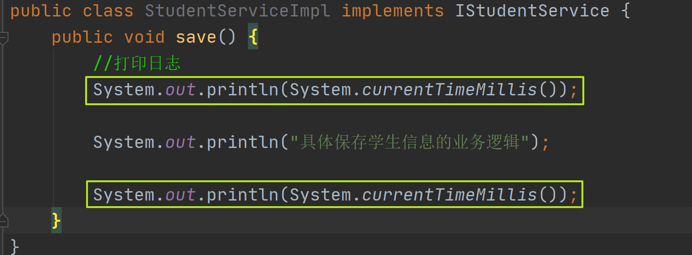

    - 使用AOP增强之后

      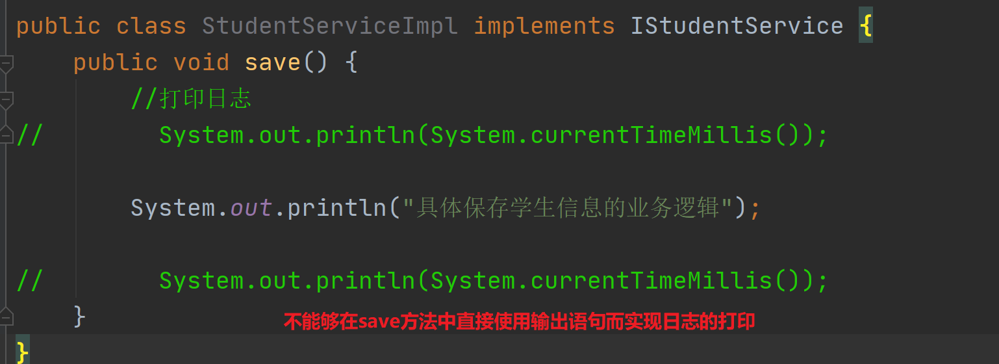

      

## 2.代理模式

- 如果没有听过代理模式，点击链接先学习代理模式 ： https://www.bilibili.com/video/BV1tY411Z799/?share_source=copy_web&vd_source=fdccda7d1272a2e0f49cadca354a5073
- 静态代理
- 动态代理
  - jdk 动态代理
  - cglib 动态代理

# 二、AOP概念

## 1.案例分析

- 创建类提供增删改查方法，实现事务增强操作功能

  ```java
  public interface IStudentService {
      void save(Student student);
  
      int update(Student student);
  
      Student queryStudentById(Long id);
  }
  ```

- 接口实现类

  ```java
  public class StudentServiceImpl implements IStudentService {
  
      public void save(Student student) {
  //        System.out.println("开启事务");
          System.out.println("保存操作");
  //        System.out.println("关闭事务");
      }
  
      public int update(Student student) {
  //        System.out.println("开启事务");
          System.out.println("更新操作");
  //        System.out.println("关闭事务");
          return 0;
      }
  
      public Student queryStudentById(Long id) {
          System.out.println("查询操作");
          return null;
      }
  }
  ```

- 提供通知类

  ```java
  public class TransactionAdvice {
      public void before(){
          System.out.println("开启事务");
      }
  
      public void after(){
          System.out.println("关闭事务");
      }
  
      public void invoke(){
          before();
          //具体的业务执行
          after();
      }
  }
  ```

## 2.核心概念

### 2.1概念

- 连接点(JoinPoint)：对于需要增强的方法就是连接点

  > *Join point*: a point during the execution of a program, such as the execution of a method or the handling of an exception. In Spring AOP, a join point *always* represents a method execution.

- 切入点(Pointcut)：需要增强的方法是切入点，匹配连接点的式子

  > a predicate that matches join points. Advice is associated with a pointcut expression and runs at any join point matched by the pointcut (for example, the execution of a method with a certain name). The concept of join points as matched by pointcut expressions is central to AOP, and Spring uses the AspectJ pointcut expression language by default.

- 通知(Advice)：存放需要增强功能的共性代码，就叫通知

  > action taken by an aspect at a particular join point. Different types of advice include "around," "before" and "after" advice. (Advice types are discussed below.) Many AOP frameworks, including Spring, model an advice as an *interceptor*, maintaining a chain of interceptors *around* the join point.

- 切面(Aspect)：通知是需要增强的功能存在多个，切入点是需要增强的方法也存在多个，需要去给切入点和通知做关联，知道哪个切入点对应哪个通知，这种描述关系就叫切面

  > a modularization of a concern that cuts across multiple classes. Transaction management is a good example of a crosscutting concern in enterprise Java applications. In Spring AOP, aspects are implemented using regular classes (the schema-based approach) or regular classes annotated with the @Aspect annotation (the @AspectJ style).

- 通知类：存放通知（方法）的类 

### 2.2图示

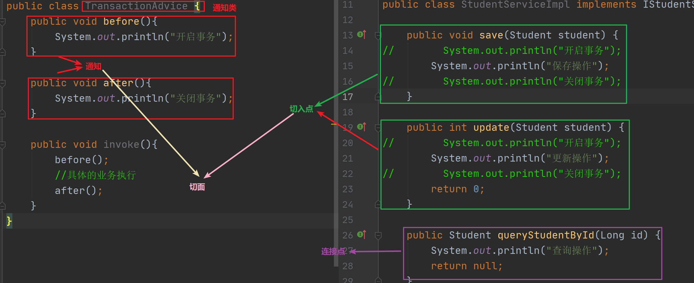

## 3.核心概念

- 目标对象 target
- 代理 proxy


# 三、通过注解实现AOP配置

## 1.导入依赖

- 导入aop依赖

  ```java
  <dependency>
      <groupId>org.springframework</groupId>
      <artifactId>spring-aspects</artifactId>
      <version>5.2.17.RELEASE</version>
  </dependency>
  ```

- 导入Spring依赖

  ```java
  <dependency>
      <groupId>org.springframework</groupId>
      <artifactId>spring-context</artifactId>
      <version>5.2.17.RELEASE</version>
  </dependency>
  ```

## 2.配置AOP支持

- @EnableAspectJAutoProxy

- 说明

  | 名称     | @EnableAspectJAutoProxy |
  | -------- | ----------------------- |
  | 使用位置 | 配置类上                |
  | 作用     | 开启注解的aop支持       |

  

- 代码

  ```java
  @Configuration
  @EnableAspectJAutoProxy
  @ComponentScan("cn.sycoder")
  public class AppConfig {
  }
  ```


## 3.创建切面类

- @Aspect

- 说明

  | 名称     | @Aspect                                      |
  | -------- | -------------------------------------------- |
  | 作用     | 设置当前类为切面类                           |
  | 使用位置 | 类上                                         |
  | 属性     | String value() default "";可以给切面指定名称 |

- @Pointcut

- 说明

  | 名称     | @Pointcut                              |
  | -------- | -------------------------------------- |
  | 作用     | 设置切入点方法                         |
  | 使用位置 | 方法上                                 |
  | 属性     | String value() default "";切入点表达式 |

  

- 代码

  > Note:
  >
  > ​	@Pointcut("execution(void cn.sycoder.service.impl.StudentServiceImpl.save(..))")   `save(..)` 里面两个点不要忘记。
  
  ```java
  @Component
  @Aspect
  public class TransactionAdvice {
      //定义通知 绑定切点和通知的关系
      @Before("pc()")
      public void before(){
          System.out.println("开启事务");
      }
      @After("pc()")
      public void after(){
          System.out.println("关闭事务");
      }
      //定义切点
      @Pointcut("execution(void cn.sycoder.service.impl.StudentServiceImpl.save(..))") 
      public void pc(){
      }
  }
  ```

## 4.测试aop

- 测试代码

  ```java
  @Test
      public void testAop(){
          AnnotationConfigApplicationContext applicationContext = new AnnotationConfigApplicationContext(AppConfig.class);
          IStudentService bean = applicationContext.getBean(IStudentService.class);
          bean.save(null);
      }
  ```

  - 打印输出

    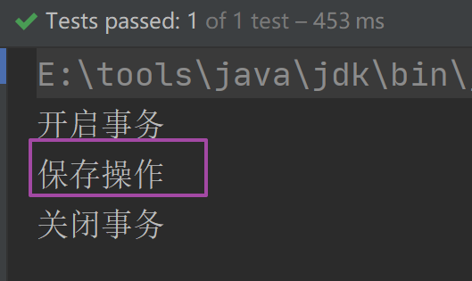


## 5.各种通知

### 5.1@Before

- 前置通知：被代理的目标方法执行前执行

- 说明

  | 名称           | @Before                      |
  | -------------- | ---------------------------- |
  | 使用位置       | 方法上                       |
  | 作用           | 前置通知，目标方法执行前执行 |
  | 属性           | String value(); 切入点表达式 |
  | 可以提供的入参 | JoinPoint joinPoint ，切点   |

  

- 使用

  ```java
  @Before("execution(void cn.sycoder.service.impl.StudentServiceImpl.save(..))")
  public void before(JoinPoint joinPoint){
      System.out.println("开启事务");
  }
  ```

### 5.2@After

- 后置通知：被代理的目标方法执行后执行

- 说明

  | 名称           | @After                               |
  | -------------- | ------------------------------------ |
  | 使用位置       | 方法上                               |
  | 作用           | 后置通知：被代理的目标方法执行后执行 |
  | 属性           | String value(); 切入点表达式         |
  | 可以提供的入参 | JoinPoint joinPoint ，切点           |

  

- 使用

  ```java
  @After("execution(void cn.sycoder.service.impl.StudentServiceImpl.save(..))")
  public void after(){
      System.out.println("关闭事务");
  }
  ```

### 5.3@AfterReturning

- 返回通知：被代理的目标方法成功结束后执行

- 说明

  | 名称           | @AfterReturning                                              |
  | -------------- | ------------------------------------------------------------ |
  | 使用位置       | 方法上                                                       |
  | 作用           | 返回通知：被代理的目标方法成功结束后执行                     |
  | 属性           | String value(); 切入点表达式，String returning()；方法返回值 |
  | 可以提供的入参 | JoinPoint joinPoint ，切点，方法返回值 obj                   |

  

- 使用

  > Note：
  >
  > execution 返回是 *
  
  ```java
  @AfterReturning(returning = "obj",value = "execution(* cn.sycoder.service.impl.StudentServiceImpl.update(..))")
  public void afterReturning(JoinPoint joinPoint,Object obj){
      System.out.println(obj);
      System.out.println("返回通知");
  }
  ```

### 5.4@AfterThrowing

- 异常通知：被代理的目标方法出现异常后执行

- 说明

  | 名称           | @AfterThrowing                                          |
  | -------------- | ------------------------------------------------------- |
  | 使用位置       | 方法上                                                  |
  | 作用           | 异常通知：被代理的目标方法出现异常后执行                |
  | 属性           | String value(); 切入点表达式String throwing()；异常返回 |
  | 可以提供的入参 | JoinPoint joinPoint ，切点，异常返回值 th               |

  

- 使用

  ```java
  @AfterThrowing(throwing = "th",value = "execution(void cn.sycoder.service.impl.StudentServiceImpl.save(..))")
  public void afterThrowing(JoinPoint pointcut,Throwable th){
      System.out.println("异常通知");
  }
  ```

  

### 5.5@Around

- 环绕通知：可以使用 try 代码块把被代理的目标方法围绕住，就可以做自己想做的操作,可以在里面做任何的操作（是前面所有通知的整合）

- 说明

  | 名称           | @Around                                                   |
  | -------------- | --------------------------------------------------------- |
  | 使用位置       | 方法上                                                    |
  | 作用           | 异常通知：被代理的目标方法出现异常后执行                  |
  | 属性           | String value(); 切入点表达式                              |
  | 可以提供的入参 | ProceedingJoinPoint joinPoint，可以通过该对象调用原始方法 |

  

- 使用

  ```java
  @Around("execution(void cn.sycoder.service.impl.StudentServiceImpl.save(..))")
      public void around(ProceedingJoinPoint joinPoint){
          try{
              System.out.println("前置通知");
              Object proceed = joinPoint.proceed();//执行目标方法
              System.out.println("返回通知");
          }catch (Exception e){
              e.printStackTrace();
          } catch (Throwable throwable) {
              System.out.println("异常通知");
              throwable.printStackTrace();
  
          } finally {
  
          }
      }
  ```

### 5.6各种通知执行顺序

- 环绕通知---前置通知---目标方法---返回通知或异常通知---后置通知

## 6.切入点表达式

- 概述：切入点表达式是用来寻找目标代理方法的

  > Note:
  >
  > ​	切入点表达式中的类型名、方法名、参数类型等都需要使用全限定名（即包括包名的完整类名）

  ```java
  execution(public void cn.sycoder.service.impl.StudentServiceImpl.save(..))
  ```

- 图示

  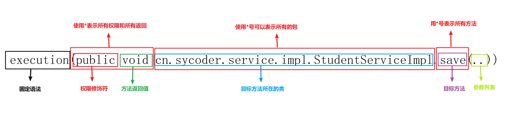

- 表达式实操

  | 编号 | 名称     | 使用位置               | 作用                                 |
  | ---- | -------- | ---------------------- | ------------------------------------ |
  | 1    | *        | 代替权限修饰符和返回值 | 表示任意权限和返回                   |
  | 2    | *        | 使用到包位置           | 一个*表示当前一层的任意              |
  | 3    | *..      | 使用到包位置           | 任意包任意类                         |
  | 4    | *        | 使用到类               | 表示任意类                           |
  | 5    | *Service | 使用到类               | 表示寻找以Service 结尾的任意接口或类 |
  | 6    | *add()   | 使用到方法             | 表示寻找add结尾的方法                |
  | 7    | ..       | 使用到参数             | 表示任意参数                         |

  1. 案例:找到实现类中的任意save方法

     ```java
     execution(* cn.sycoder.service.impl.StudentServiceImpl.save(..))
     ```

  2. 案例：sycoder 包下面的类中的任意update 方法

     ```java
     execution(* cn.sycoder.*.update(..))
     ```

  3. 案例：找到sycoder 包下面及其任意子包中的任意update 方法

     ```java
     execution(* cn.sycoder.*..update(..))
     ```

  4. 案例：找到service 下面任意类的update 方法

     ```java
     execution(* cn.sycoder.service.*.update(..))
     ```

  5. 案例：找到以Service 结尾的接口或者类的update 方法

     ```java
     execution(* cn.sycoder.service.*Service.update(..))
     ```

  6. 案例：找到Service 结尾的接口或者类的update 方法，任意参数的

     ```java
     execution(* cn.sycoder.service.*Service.update(..))
     ```

- 注意：如果你切的越模糊，那性能就会越低，所以实际开发中，建议把范围切小一点

- **优先级**

  - 如果想手动指定优先级关系，可以使用@Order(1)注解
    
    > `@Order`注解是Spring框架中的一个重要注解，它用于定义Spring IOC容器中Bean的执行顺序的优先级，而不是定义Bean的加载顺序。
    >
    > 1. **Bean的加载顺序与执行顺序**：
    >
    >    - Bean的加载顺序是指Spring容器在启动时加载Bean的顺序，这个顺序通常不受`@Order`注解或`Ordered`接口的影响。
    >    - Bean的执行顺序是指Spring容器在调用Bean的方法时的顺序，这个顺序可以通过`@Order`注解或`Ordered`接口来指定。
    >
    > 2. **集合中的顺序**：
    >
    >    - 当将多个Bean注入到数组或列表中时，这些Bean将按照`@Order`注解指定的顺序进行排序。
    >    - 但是，当将Bean注入到`Set`或`Map`集合中时，由于这些集合类型本身不保证元素的顺序，因此`@Order`注解将不起作用。
    >
    > 3. **与`Ordered`接口的关系**：
    >
    >    - `Ordered`接口也用于指定Bean的优先级，但它是一个接口，需要实现其`getOrder()`方法。
    >    - `@Order`注解是`Ordered`接口的一个便捷实现方式，它允许通过简单的注解来指定优先级。
    >
    > 4. **默认值**：
    >
    >    - 如果不指定`@Order`注解的`value`属性，则默认值为一个较大的整数（如`Integer.MAX_VALUE`），表示Bean的优先级较低。
    >
    >    
    >
    >    ### 使用示例
    >
    >    ```java
    >    @Service  
    >    @Order(1)  
    >    public class UserServiceImpl implements IUserService {  
    >        @Override  
    >        public void getUserInfo() {  
    >            System.out.println("成功获取用户信息");  
    >        }  
    >    }  
    >      
    >    @Service  
    >    @Order(2)  
    >    public class CarServiceImpl implements ICarService {  
    >        @Override  
    >        public void getCarInfo() {  
    >            System.out.println("成功获取车辆信息");  
    >        }  
    >    }
    >    ```
    >
    >    在上述示例中，`UserServiceImpl`被标记为优先级1，而`CarServiceImpl`被标记为优先级2。因此，在Spring IOC容器中，`UserServiceImpl`的Bean将先于`CarServiceImpl`的Bean被执行。
    
    - 提供的值越小，优先级越高

  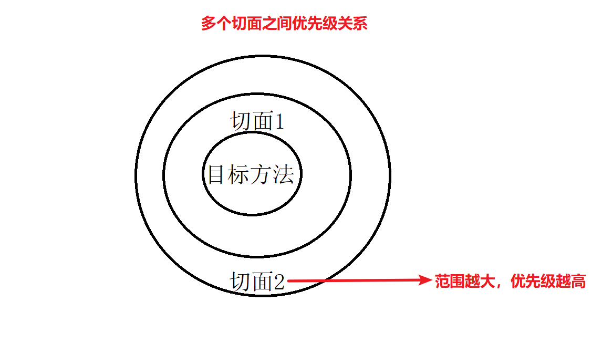

- 复用切入点表达式

  - 定义切点

    ```java
    @Component
    @Aspect
    public class TransactionAdvice {
        //定义切点
        @Pointcut("execution(public void cn.sycoder.service.impl.StudentServiceImpl.save(..))")
        public void pc(){
            System.out.println("----切点");
        }
    }
    ```

  - 在**其他切面类**通知里面重用切点

    ```java
    @Component
    @Aspect
    public class LogAdvice {
    
        @Before("cn.sycoder.advice.TransactionAdvice.pc()")
        public void log(){
            System.out.println("-0-----这里是打印日志");
        }
    }
    ```

  - 切面**内部**自己重用

    ```java
    @Component
    @Aspect
    public class TransactionAdvice {
        //定义切点
        @Pointcut("execution(public void cn.sycoder.service.impl.StudentServiceImpl.save(..))")
        public void pc(){
            System.out.println("----切点");
        }
        //定义通知 绑定切点和通知的关系
        //前置通知
        @Before("pc()")
        public void before(JoinPoint joinPoint){
            String name = joinPoint.getSignature().getName();
            System.out.println(name);
            System.out.println("开启事务");
        }
    ```

## 7.获取通知相关信息

- 获取连接点信息,在通知方法中添加参数 JoinPoint 即可

  ```java
  @Before("pc()")
  public void before(JoinPoint joinPoint){
      String name = joinPoint.getSignature().getName();
      System.out.println(name);
      System.out.println("开启事务");
  }
  ```

- 获取目标方法返回值

  - 使用AfterReturning 中的 returning 属性，这里指定的名称即是我们方法传入的名称

  ```java
  @AfterReturning(returning = "obj",value = "pc()")
      public void afterReturning(JoinPoint joinPoint,Object obj){
          System.out.println(obj);
          System.out.println("返回通知");
      }
  ```

- 获取异常

  - 使用AfterThrowing 中的 throwing 属性，这里指定的名称即是我们方法传入的参数名称

  ```java
  @AfterThrowing(throwing = "th",value = "execution(* cn.sycoder.service.impl.StudentServiceImpl.save(..))")
      public void afterThrowing(JoinPoint pointcut,Throwable th){
          System.out.println("异常通知");
      }
  ```

- 如果使用环绕通知

  - 使用ProceedingJoinPoint joinPoint

  ```java
   @Around("execution(void cn.sycoder.service.*..save(..))")
      public void around(ProceedingJoinPoint joinPoint){
          try{
              System.out.println("环绕通知");
  //            System.out.println("前置通知");
              Object proceed = joinPoint.proceed();//执行目标方法
  //            System.out.println("返回通知");
          }catch (Exception e){
              e.printStackTrace();
          } catch (Throwable throwable) {
  //            System.out.println("异常通知");
              throwable.printStackTrace();
  
          } finally {
  
          }
      }
  ```

  

# 四、XML配置AOP

## 1.导入依赖

```java
<dependency>
        <groupId>org.springframework</groupId>
        <artifactId>spring-context</artifactId>
        <version>5.2.17.RELEASE</version>
    </dependency>

    <dependency>
        <groupId>org.springframework</groupId>
        <artifactId>spring-aspects</artifactId>
        <version>5.2.17.RELEASE</version>
    </dependency>

    <dependency>
        <groupId>junit</groupId>
        <artifactId>junit</artifactId>
        <version>4.12</version>
        <!--            <scope>test</scope>-->
    </dependency>
```

## 2.基本准备

- 创建 service 接口以及方法

  ```java
  public interface IStudentService {
      void save(Student student);
  }
  ```

  ```java
  public class StudentServiceImpl implements IStudentService {
  
      public void save(Student student) {
          System.out.println("保存操作");
      }
  }
  ```

- 创建切面类

  ```java
  public class XmlAspect {
      public void before(){
          System.out.println("前置通知");
      }
  
      public void pointCut(){
  
      }
  
      public void after(JoinPoint joinPoint){
          System.out.println("后置通知");
      }
  
      public void afterReturning(Object obj){
          System.out.println("返回通知"+obj);
      }
  
      public void afterThrowing(Throwable t){
          System.out.println("异常通知");
      }
  }
  ```

  

## 3.创建xml 配置文件

- aop.xml

  ```java
  <?xml version="1.0" encoding="UTF-8"?>
  <beans xmlns="http://www.springframework.org/schema/beans"
         xmlns:xsi="http://www.w3.org/2001/XMLSchema-instance" xmlns:aop="http://www.springframework.org/schema/aop"
         xsi:schemaLocation="http://www.springframework.org/schema/beans http://www.springframework.org/schema/beans/spring-beans.xsd http://www.springframework.org/schema/aop https://www.springframework.org/schema/aop/spring-aop.xsd">
      <bean id="service" class="cn.sycoder.service.impl.StudentServiceImpl"></bean>
      <bean id="xmlAspect" class="cn.sycoder.aspect.XmlAspect"></bean>
          
       <!--  XMl启用AOP -->
      <aop:aspectj-autoproxy/>
          
          
      <aop:config>
  <!--        配置切面类-->
          <aop:aspect ref="xmlAspect">
  <!--            配置切点-->
              <aop:pointcut id="pc" expression="execution(* cn.sycoder.service.*..*(..))"/>
  <!--            配置前置通知-->
              <aop:before method="before" pointcut-ref="pc"></aop:before>
  <!--            配置后置通知-->
              <aop:after method="after" pointcut-ref="pc"></aop:after>
  <!--            配置返回通知-->
              <aop:after-returning method="afterReturning" returning="obj" pointcut-ref="pc"></aop:after-returning>
  <!--            异常通知-->
              <aop:after-throwing method="afterThrowing" throwing="t" pointcut-ref="pc"></aop:after-throwing>
              
          </aop:aspect>
      </aop:config>
  </beans>
  ```
  
  

## 4.总结

- 以后在公司使用注解的方式最流行，所以，xml 配置作为了解内容即可

# 五、Spring整合Mybatis

## 1.添加依赖

- 添加依赖

  ```java
  <dependencies>
          <dependency>
              <groupId>org.springframework</groupId>
              <artifactId>spring-context</artifactId>
              <version>5.2.17.RELEASE</version>
          </dependency>
          <dependency>
              <groupId>junit</groupId>
              <artifactId>junit</artifactId>
              <version>4.12</version>
              <!--            <scope>test</scope>-->
          </dependency>
          <dependency>
              <groupId>com.alibaba</groupId>
              <artifactId>druid</artifactId>
              <version>1.1.16</version>
          </dependency>
          <dependency>
              <groupId>mysql</groupId>
              <artifactId>mysql-connector-java</artifactId>
              <version>8.0.29</version>
          </dependency>
  <!--        spring 整合 mybatis 的包-->
          <dependency>
              <groupId>org.mybatis</groupId>
              <artifactId>mybatis-spring</artifactId>
              <version>1.3.0</version>
          </dependency>
  <!--        mybatis 包-->
          <dependency>
              <groupId>org.mybatis</groupId>
              <artifactId>mybatis</artifactId>
              <version>3.5.6</version>
          </dependency>
  <!--        spring 操作 jdbc 包-->
          <dependency>
              <groupId>org.springframework</groupId>
              <artifactId>spring-jdbc</artifactId>
              <version>4.3.29.RELEASE</version>
          </dependency>
      </dependencies>
  ```

## 2.配置类

### 2.1配置Spring配置类

- 配置类

  ```java
  @Configuration
  @ComponentScan("cn.sycoder")
  public class SpringConfig {
  }
  ```

### 2.2配置JDBC配置类

- 配置类

  ```java
  public class JdbcConfig {
      @Value("${jdbc.username}")
      private String username;
      @Value("${jdbc.password}")
      private String password;
      @Value("${jdbc.driverClassName}")
      private String driverClassName;
      @Value("${jdbc.url}")
      private String url;
      //配置连接池
      @Bean
      public DataSource dataSource(){
          DruidDataSource source = new DruidDataSource();
          source.setUsername(username);
          source.setPassword(password);
          source.setDriverClassName(driverClassName);
          source.setUrl(url);
          return source;
      }
  }
  ```

### 2.3添加数据库配置文件

- 配置文件

  ```java
  jdbc.username=root
  jdbc.password=123456
  jdbc.driverClassName=com.mysql.cj.jdbc.Driver
  jdbc.url=jdbc:mysql://localhost:3306/spring
  ```

- 导入到spring 中

  ```java
  @Configuration
  @ComponentScan("cn.sycoder")
  @PropertySource("db.properties")
  @Import({JdbcConfig.class,MyBatisConfig.class})
  public class SpringConfig {
  }
  ```

  

- 创建数据库和数据表

  ```sql
  create table account
  (
  	id bigint auto_increment
  		primary key,
  	money int null
  );
  ```

### 2.4创建Mybatis 配置类

- 创建配置类

  > 1. **配置SqlSessionFactory**：
  >
  >    - 使用`SqlSessionFactoryBean`来创建`SqlSessionFactory`实例。
  >    - `SqlSessionFactoryBean`需要指定数据源和MyBatis的配置文件（可选）。
  >    - 如果不使用MyBatis的核心配置文件，可以通过`SqlSessionFactoryBean`的属性来配置MyBatis的相关设置。
  >
  > 2. **配置Mapper接口扫描**：
  >
  >    - 使用`MapperScannerConfigurer`或`@MapperScan`注解来自动扫描Mapper接口，并将其注册为Spring Bean。
  >    - 这样就可以在业务层通过`@Autowired`注解注入Mapper接口，进行数据库操作。
  >
  >    `@MapperScan`使用示例
  >    @MapperScan("com.example.mapper")  

  ```java
  public class MyBatisConfig {
  //    配置SqlSqlSessionFactoryBean
      @Bean
      public SqlSessionFactoryBean sessionFactory(DataSource dataSource){
          SqlSessionFactoryBean bean = new SqlSessionFactoryBean();
          bean.setDataSource(dataSource);//设置数据源
          return bean;
      }
  //  配置Mapper接口扫描    
      @Bean
      public MapperScannerConfigurer mapperScannerConfigurer(){
          MapperScannerConfigurer configurer = new MapperScannerConfigurer();
          configurer.setBasePackage("cn.sycoder.mapper");
          return configurer;
      }
  }
  ```

- 配置与 xml 配置的对比

  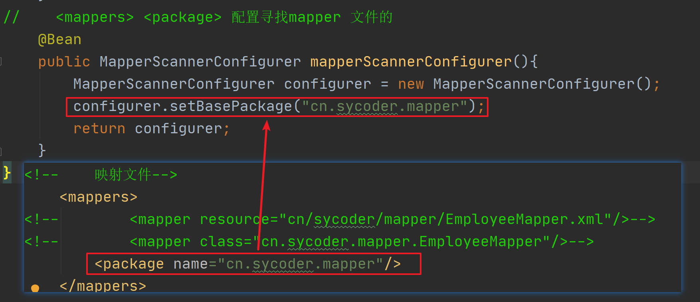

  

## 3.添加代码生成器

- 拷贝代码生成器到项目中并且配置插件

- 需要修改代码生成器的数据库连接信息

  ```java
  <build>
          <plugins>
              <!--           引入 generator 插件-->
              <plugin>
                  <groupId>org.mybatis.generator</groupId>
                  <artifactId>mybatis-generator-maven-plugin</artifactId>
                  <version>1.3.2</version>
                  <configuration>
                      <verbose>true</verbose>
                      <overwrite>false</overwrite>
                  </configuration>
                  <dependencies>
                      <!--                    引入插件需要的依赖-->
                      <dependency>
                          <groupId>mysql</groupId>
                          <artifactId>mysql-connector-java</artifactId>
                          <version>8.0.29</version>
                      </dependency>
                  </dependencies>
              </plugin>
          </plugins>
      </build>
  ```

  

## 4.出现问题

- class not find

  

- 解决方案

  ```java
  <dependency>
      <groupId>org.mybatis</groupId>
      <artifactId>mybatis</artifactId>
      <version>3.5.6</version>
  </dependency>
  ```

  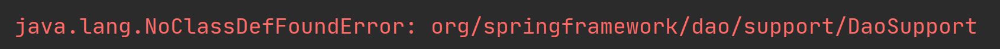

- 解决方案

  ```java
  <dependency>
      <groupId>org.springframework</groupId>
      <artifactId>spring-jdbc</artifactId>
      <version>4.3.29.RELEASE</version>
  </dependency>
  ```

- 包之间的关系

  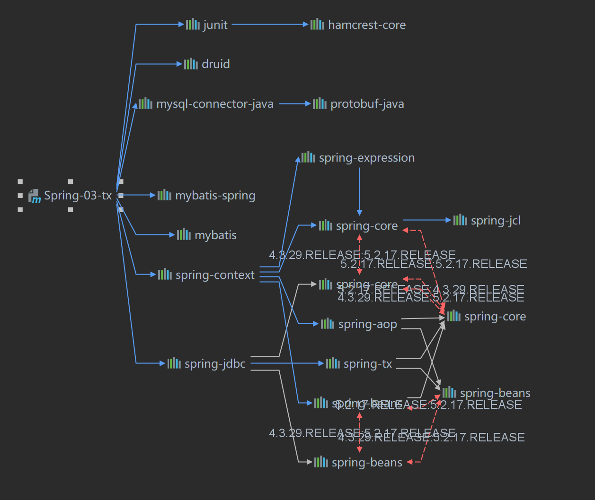

  

# 六、Spring 事务管理

## 1.Spring 事务简介

- 事务概述：保证数据库操作同时成功或者同时失败

- Spring 事务的概述：在数据层保证数据库操作同时成功或者同时失败


## 2.转账案例分析

- 转账肯定有一个业务方法：给转出用户减钱，给转入用户加钱
- 要求：
  - 要么同时成功要么同时失败

### 2.1Spring 平台事务管理器

- 提供规范接口

  ```java
  public interface PlatformTransactionManager {
      TransactionStatus getTransaction(TransactionDefinition var1) throws TransactionException;
  
      void commit(TransactionStatus var1) throws TransactionException;
  
      void rollback(TransactionStatus var1) throws TransactionException;
  }
  ```

- 方法

  - void commit(TransactionStatus var1)：用于提交事务
  - void rollback(TransactionStatus var1)：用户事务回滚

- 具体实现：DataSourceTransactionManager 来实现的，通过DataSource dataSource 以 JDBC 事务的方式来控制事务

  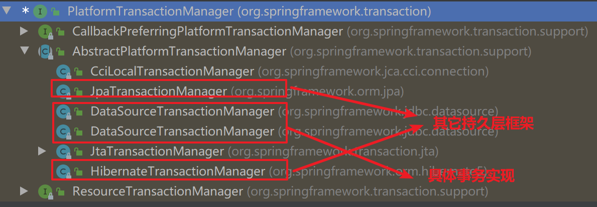

  

### 2.2转账案例分析

- 业务分析

  - 在业务层需要保证事务的同时成功或者同时失败
  - 结果
    - 出现异常：张三转账给李四，比如中途出现问题，张三的钱和李四的钱应该不出现误差
    - 没有出现异常：张三转账给李四，没有出现问题，张三的钱正常减少，李四的钱正常增多

- 提供service 方法

  ```java
  public interface IAccountService {
      /**
       * 实现转账操作
       * @param srcId 转账人
       * @param deskId 接收人
       * @param money 转账金额
       */
      public void transfer(Long srcId,Long deskId,int money);
  }
  ```

- 下载插件的官方地址 https://plugins.jetbrains.com/

- 提供service 实现方法

  ```java
  @Service
  public class AccountServiceImpl implements IAccountService {
  
      //会使用到 mapper
      @Autowired
      private AccountMapper mapper;
  
      public void transfer(Long srcId, Long deskId, int money) {
          mapper.outAccount(srcId,money);//转账扣钱
  
          mapper.inAccount(deskId,money);//接收转账钱
      }
  }
  ```

- 提供 mapper 接口

  ```java
  public interface AccountMapper {
      void outAccount(@Param("id") Long srcId, @Param("money") int money);
  
      void inAccount(@Param("id")Long deskId,@Param("money") int money);
  }
  ```

- 提供 mapper.xml

  ```xml
  <update>
      <update id="outAccount">
      update account
      set money = money-#{money,jdbcType=INTEGER}
      where id = #{id,jdbcType=BIGINT}
      </update>
    <update id="inAccount">
      update account
      set money = money+#{money,jdbcType=INTEGER}
      where id = #{id,jdbcType=BIGINT}
    </update>
  ```

- 测试

  ```java
   @Test
      public void testMybatis(){
          AnnotationConfigApplicationContext context = new AnnotationConfigApplicationContext(SpringConfig.class);
          IAccountService bean = context.getBean(IAccountService.class);
          bean.transfer(1L,2L,500);
  
      }
  ```

  

## 3.基于注解的方式实现

### 3.0 Summary

> 1. **添加依赖**：确保你的项目中已经添加了 Spring 的相关依赖。如果你使用的是 Spring Boot，通常这些依赖已经包含在内。
> 2. **创建配置类**：在一个配置类上使用 `@EnableTransactionManagement` 注解。
> 3. **配置事务管理器**：通常情况下，Spring Boot 会自动配置一个 `PlatformTransactionManager` 实例。如果你需要自定义事务管理器，可以在配置类中进行配置。
> 4. **使用 `@Transactional` 注解**：在需要事务管理的方法或类上使用 `@Transactional` 注解。

### 3.1@EnableTransactionManagement

- @EnableTransactionManagement：是 Spring 框架提供的一个注解，用于启用基于注解的事务管理功能。当你在某个配置类上使用 `@EnableTransactionManagement` 注解时，Spring 会自动扫描并管理带有 `@Transactional` 注解的方法。

- 说明

  | 名称 | @EnableTransactionManagement |
  | ---- | ---------------------------- |
  | 位置 | 配置类上方                   |
  | 作用 | 设置当前spring环境支持事务   |
  |      |                              |

- 修改配置类

  ```java
  @Configuration
  @ComponentScan("cn.sycoder")
  @PropertySource("db.properties")
  @Import({JdbcConfig.class,MyBatisConfig.class})
  //开启事务支持
  @EnableTransactionManagement
  public class SpringConfig {
  }
  ```

### 3.2@Transactional

- @Transactional:为业务添加事务的

- 说明

  | 名称 | @Transactional                                       |
  | ---- | ---------------------------------------------------- |
  | 位置 | 业务层接口上方，或者实现类上方，或者具体业务方法上方 |
  | 作用 | 为当前的业务方法添加事务支持                         |
  |      |                                                      |

- 修改业务层（三种范围不同）

  1. 业务方法上添加

    ```java
    @Transactional
    public void transfer(Long srcId, Long deskId, int money) {
        mapper.outAccount(srcId,money);//转账扣钱
        System.out.println(1/0);
        mapper.inAccount(deskId,money);//接收转账钱
    }
    ```

  2. 业务类上添加

    ```java
    @Service
    @Transactional
    public class AccountServiceImpl implements IAccountService {
    
        //会使用到 mapper
        @Autowired
        private AccountMapper mapper;
    
    
        public void transfer(Long srcId, Long deskId, int money) {
            mapper.outAccount(srcId,money);//转账扣钱
            System.out.println(1/0);
            mapper.inAccount(deskId,money);//接收转账钱
        }
    }
    ```

  3. 接口层添加

    ```java
    @Transactional
    public interface IAccountService {
        /**
         * 实现转账操作
         * @param srcId 转账人
         * @param deskId 接收人
         * @param money 转账金额
         */
        public void transfer(Long srcId,Long deskId,int money);
    }
    ```

  

### 3.3配置事务管理@PlatformTransactionManager

- PlatformTransactionManager

  > 在自己code演示中, 不@Bean PlatformTransactionManager ，idea没找到到实例。？？？

- 代码

  ```java
  public class JdbcConfig {
      @Value("${jdbc.username}")
      private String username;
      @Value("${jdbc.password}")
      private String password;
      @Value("${jdbc.driverClassName}")
      private String driverClassName;
      @Value("${jdbc.url}")
      private String url;
      //配置连接池
      @Bean
      public DataSource dataSource(){
          DruidDataSource source = new DruidDataSource();
          source.setUsername(username);
          source.setPassword(password);
          source.setDriverClassName(driverClassName);
          source.setUrl(url);
          return source;
      }
  
      @Bean
      public PlatformTransactionManager transactionManager(DataSource dataSource){
          DataSourceTransactionManager manager = new DataSourceTransactionManager();
          manager.setDataSource(dataSource);
          return manager;
      }
  }
  ```

  

## 4.事务角色

- 在没有开启Spring事务之前:两条语句分别开启两个事务 T1 和 T2

  - 如果同时成功,T1和T2都会正常提交
  - 如果T1正常，T2之前抛出异常，就会出现T1能够正常转账，但是T2收不到钱，因为不是同一个事务导致金钱异常

  ```java
  public void transfer(Long srcId, Long deskId, int money) {
      mapper.outAccount(srcId,money);//转账扣钱
      System.out.println(1/0);
      mapper.inAccount(deskId,money);//接收转账钱
  }
  ```

  

  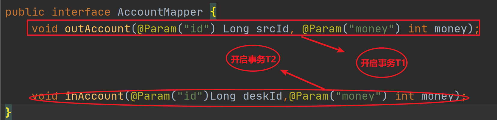

  

- 开启Spring 事务管理之后

  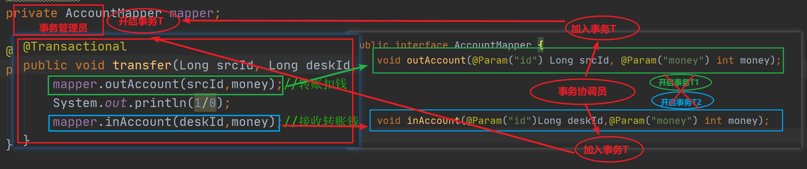

  - 在转账 transfer 方法上加入 @Transactional 注解之后，该方法会新建一个事务T
  - 把 mapper 中 outAccount 事务 T1 加入到 事务T中，把 mapper 中 inAccount 事务 T2 也加入到事务T中
  - 通过 @Transactional 注解统一了 transfer 方法的事务保证转账和入账方法变成同一事务操作

### 4.1事务管理员&事务协调员

- 事务管理员：发起新事务，使用 @Transactional 注解开启事务
- 事务协调员：加入新事务，保证多个事务变成同一事务下的操作

## 5.@Transactional 属性

### 5.1readOnly 

- 概述：表示只读，没有写操作。可以通过这个属性告诉数据库我们没有写操作，从而数据库可以针对只读sql做优化操作

- 使用

  ```java
  @Transactional(readOnly = true)
  public Account selectById(Long id){
      return mapper.selectByPrimaryKey(id);
  }
  ```

- 如果对于有写操作的使用这个属性，会报如下错误

  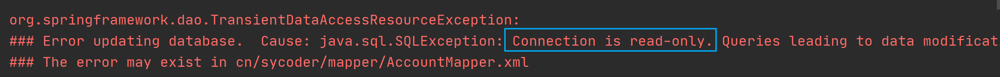

### 5.2timeout

- 超时概述：事务再执行的时候，由于某些原因卡住，长时间占用数据库资源。此时很可能程序sql有问题，希望撤销事务，能够让事务结束，释放资源，即超时回滚。

- 默认值是-1.-1表示用不回滚，单位是秒

- ```
  int timeout() default -1;
  ```

- 使用

  ```java
  @Transactional(readOnly = true,timeout = 1)
      public Account selectById(Long id){
          try {
              Thread.sleep(10000L);
          } catch (InterruptedException e) {
              e.printStackTrace();
          }
          return mapper.selectByPrimaryKey(id);
      }
  ```

  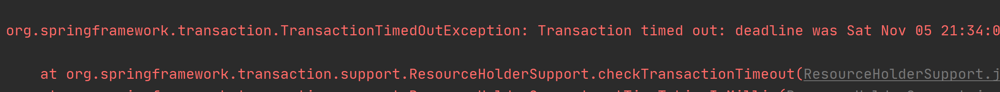

### 5.3rollbackFor&rollbackForClassName

- 回滚概述：**回滚策略**，希望对于什么样的异常回滚

- **注意：并不是所有的异常 Spring 都会回滚，Spring 只对 Error 异常和 RuntimeException 异常回滚**

- 使用

  ```java
  @Transactional(rollbackFor = IOException.class)
      public void transfer(Long srcId, Long deskId, int money) throws IOException {
          mapper.outAccount(srcId,money);//转账扣钱
          if(true){
              throw new IOException("");
          }
          mapper.inAccount(deskId,money);//接收转账钱
      }
  ```

  ```java
  @Transactional(rollbackForClassName = "IOException")
      public void transfer(Long srcId, Long deskId, int money) throws IOException {
          mapper.outAccount(srcId,money);//转账扣钱
          if(true){
              throw new IOException("");
          }
          mapper.inAccount(deskId,money);//接收转账钱
      }
  ```

### 5.4noRollbackFor&noRollbackForClassName

- 不会滚概述：出现这个异常不回滚

- 使用

  ```java
  @Transactional(noRollbackFor = ArithmeticException.class)
      public void transfer(Long srcId, Long deskId, int money) throws IOException {
          mapper.outAccount(srcId,money);//转账扣钱
          System.out.println(1/0);
          mapper.inAccount(deskId,money);//接收转账钱
      }
  ```

  ```java
  @Transactional(noRollbackForClassName = "ArithmeticException")
      public void transfer(Long srcId, Long deskId, int money) throws IOException {
          mapper.outAccount(srcId,money);//转账扣钱
          System.out.println(1/0);
          mapper.inAccount(deskId,money);//接收转账钱
      }
  ```

  

### 5.5isolation

- 概述：设置事务隔离级别；

- 如果不记得事务隔离级别，回去复习一下我讲的MySql

  - DEFAULT :默认隔离级别, 会采用数据库的隔离级别
  - READ_UNCOMMITTED : 读未提交
  - READ_COMMITTED : 读已提交
  - REPEATABLE_READ : 重复读取
  - SERIALIZABLE: 串行化

- 使用

  ```java
  @Transactional(isolation = Isolation.REPEATABLE_READ)
  public Account selectById(Long id) throws IOException {
      return mapper.selectByPrimaryKey(id);
  }
  ```

  

  

### 5.6propagation

- 事务传播行为：事务协调员对事务管理员所携带的事务的处理态度（事务传播行为决定了当一个事务方法被另一个事务方法调用时，事务应该如何处理）

- 说明

  | 传播属性         | 说明                                                         |
  | ---------------- | ------------------------------------------------------------ |
  | **REQUIRED**     | 如果当前没有事务，就新建一个事务；如果已经存在一个事务中，加入到这个事务中 |
  | SUPPORTS         | 如果当前存在事务，则加入该事务；如果当前没有事务，则以非事务的方式执行 |
  | MANDATORY        | 使用当前事务，如果当前没有事务就抛异常                       |
  | **REQUIRES_NEW** | 每次都新建一个事务，如果当前存在事务，就将当前事务挂起       |
  | NOT_SUPPORTED    | 不支持事务                                                   |
  | NEVER            | 不支持事务，如果存在事务还会抛异常                           |
  | NESTED           | 如果当前存在事务，则在嵌套事务内执行，如果不存在，执行REQUIRED类似操作 |

- 实操

  - **REQUIRED**:T1和T2会加入T中

    ```java
    @Transactional(propagation = Propagation.REQUIRED)//事务T
    public void transfer(Long srcId, Long deskId, int money) throws IOException {
        mapper.outAccount(srcId,money);//转账扣钱 //事务T1
        System.out.println(1/0);
        mapper.inAccount(deskId,money);//接收转账钱 //事务T2
    }
    ```

  - **SUPPORTS**：外围没事务，所以内部只执行自己的事务，T1 和 T2 单独执行

    ```java
    public void transfer(Long srcId, Long deskId, int money) throws IOException {
            mapper.outAccount(srcId,money);//转账扣钱//事务T1
            System.out.println(1/0);
            mapper.inAccount(deskId,money);//接收转账钱//事务T2
        }
    ```

  - **REQUIRES_NEW**：新建事务，如果当前存在事务，把当前事务挂起

    ```java
     @Transactional(propagation=Propagation.REQUIRES_NEW)
        public void outAccount(Long id,  int money){
            mapper.outAccount(id,money);//转账扣钱
        }
    
        @Transactional(propagation=Propagation.REQUIRES_NEW)
        public void inAccount(Long id,  int money){
            mapper.inAccount(id,money);//转账扣钱
        }
    
    public void transfer(Long srcId, Long deskId, int money) throws IOException {
        outAccount(srcId,money);
        inAccount(deskId,money);
        throw new RuntimeException();
    
    }
    ```

    - 这种情况上面一条语句能够正常执行

    ```java
    @Transactional(propagation = Propagation.REQUIRES_NEW)
        public void outAccount(Long id, int money) {
            mapper.outAccount(id, money);//转账扣钱
        }
    
        @Transactional(propagation = Propagation.REQUIRES_NEW)
        public void inAccount(Long id, int money) {
            if (true)
                throw new RuntimeException();
            mapper.inAccount(id, money);//转账扣钱
        }
    ```

## 6.基于XML事务

- 导入依赖

  ```java
  <dependencies>
          <dependency>
              <groupId>org.springframework</groupId>
              <artifactId>spring-context</artifactId>
              <version>5.2.17.RELEASE</version>
          </dependency>
  
          <dependency>
              <groupId>org.springframework</groupId>
              <artifactId>spring-aspects</artifactId>
              <version>5.2.17.RELEASE</version>
          </dependency>
  
          <dependency>
              <groupId>junit</groupId>
              <artifactId>junit</artifactId>
              <version>4.12</version>
              <!--            <scope>test</scope>-->
          </dependency>
          <dependency>
              <groupId>com.alibaba</groupId>
              <artifactId>druid</artifactId>
              <version>1.1.16</version>
          </dependency>
          <dependency>
              <groupId>mysql</groupId>
              <artifactId>mysql-connector-java</artifactId>
              <version>8.0.29</version>
          </dependency>
          <!--        spring 整合 mybatis 的包-->
          <dependency>
              <groupId>org.mybatis</groupId>
              <artifactId>mybatis-spring</artifactId>
              <version>1.3.0</version>
          </dependency>
          <!--        mybatis 包-->
          <dependency>
              <groupId>org.mybatis</groupId>
              <artifactId>mybatis</artifactId>
              <version>3.5.6</version>
          </dependency>
          <!--        spring 操作 jdbc 包-->
          <dependency>
              <groupId>org.springframework</groupId>
              <artifactId>spring-jdbc</artifactId>
              <version>4.3.29.RELEASE</version>
          </dependency>
      </dependencies>
  ```

  

- 配置文件

  ```java
  <?xml version="1.0" encoding="UTF-8"?>
  <beans xmlns="http://www.springframework.org/schema/beans"
         xmlns:xsi="http://www.w3.org/2001/XMLSchema-instance" xmlns:aop="http://www.springframework.org/schema/aop"
         xmlns:tx="http://www.springframework.org/schema/tx" xmlns:context="http://www.springframework.org/schema/context"
         xsi:schemaLocation="http://www.springframework.org/schema/beans
   http://www.springframework.org/schema/beans/spring-beans.xsd
   http://www.springframework.org/schema/tx
   http://www.springframework.org/schema/tx/spring-tx.xsd
   http://www.springframework.org/schema/aop
   http://www.springframework.org/schema/aop/spring-aop.xsd http://www.springframework.org/schema/context https://www.springframework.org/schema/context/spring-context.xsd">
  
      <bean id="accountService" class="cn.sycoder.service.impl.AccountServiceImpl">
  <!--        <property name="mapper" ref="mapper"/>-->
      </bean>
      <!--    <bean id="mapper" class="cn.sycoder.mapper.AccountMapper"></bean>-->
  
      <aop:config>
          <aop:advisor advice-ref="tx" pointcut="execution(* cn.sycoder.service.impl.*.*(..))"></aop:advisor>
      </aop:config>
  
      <tx:advice id="tx" transaction-manager="txManager">
          <tx:attributes>
              <tx:method name="get*" read-only="true"/>
          </tx:attributes>
      </tx:advice>
  
      <bean id="txManager" class="org.springframework.jdbc.datasource.DataSourceTransactionManager">
          <!-- (this dependency is defined somewhere else) -->
          <property name="dataSource" ref="dataSource"/>
      </bean>
      <bean id="dataSource" class="org.springframework.jdbc.datasource.DriverManagerDataSource">
          <property name="driverClassName" value="${jdbc.driverClassName}"/>
          <property name="url" value="${jdbc.url}"/>
          <property name="username" value="${jdbc.username}"/>
          <property name="password" value="${jdbc.password}"/>
      </bean>
      <context:property-placeholder location="db.properties"/>
  
  
  </beans>
  ```

- 配置详解

  - 引入db.properties

    ```java
    <context:property-placeholder location="db.properties"/>
    ```

  - 配置连接池

    ```java
    <bean id="dataSource" class="org.springframework.jdbc.datasource.DriverManagerDataSource">
        <property name="driverClassName" value="${jdbc.driverClassName}"/>
        <property name="url" value="${jdbc.url}"/>
        <property name="username" value="${jdbc.username}"/>
        <property name="password" value="${jdbc.password}"/>
    </bean>
    ```

  - 配置事务管理器

    ```java
    <bean id="txManager" class="org.springframework.jdbc.datasource.DataSourceTransactionManager">
        <property name="dataSource" ref="dataSource"/>
    </bean>
    ```

  - 配置 aop 事务增强

    ```java
    <aop:config>
            <aop:advisor advice-ref="tx" pointcut="execution(* cn.sycoder.service.impl.*.*(..))"/>
    </aop:config>
            
    <tx:advice id="tx" transaction-manager="txManager">
        <tx:attributes>
            <tx:method name="get*" read-only="true"/>
        </tx:attributes>
    </tx:advice>    
    ```

    

- **注意：如果你还想通过 xml 配置 mybatis ，那么你还需要把 mybatis 配置文件搞一份过来，通过xml 配置好 mybatis 之后，然后再获取 sqlSessionFactory 去获取 mapper 文件**