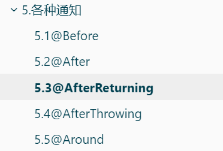

# **什么是 IoC（控制反转）？**

- 控制反转是一种设计模式，用于减少代码之间的耦合。IoC 的核心思想是将对象的创建和管理交给框架，而不是由程序员直接管理。Spring 框架通过 IoC 容器管理 Bean 的生命周期和依赖关系。

# **什么是 DI（依赖注入）？**

- 依赖注入是 IoC 的一种实现方式，通过将依赖关系注入到对象中，而不是由对象自己创建依赖。Spring 框架支持三种依赖注入的方式：构造器注入、设值注入和接口注入。

# Bean对象交给Spring管理

它带来了许多好处，如依赖注入、生命周期管理、AOP（面向切面编程）支持等。以下是一些适合将Bean对象交给Spring管理的层面或场景：

1. **服务层（Service Layer）**：
   - 服务层通常包含业务逻辑和核心业务操作。将这些服务类作为Bean交给Spring管理，可以利用Spring的依赖注入功能来注入所需的依赖项（如DAO层、其他服务类等）。
   - Spring还可以管理这些服务类的生命周期，包括初始化、销毁等。

2. **数据访问层（Data Access Layer）**：
   - 数据访问层通常包含与数据库交互的代码，如JPA Repositories、JDBC Templates等。
   - 将这些DAO类作为Bean交给Spring管理，可以利用Spring的事务管理功能来确保数据访问的一致性和完整性。
   - Spring还可以管理这些DAO类的连接池、会话工厂等资源。

3. **组件层（Component Layer）**：
   - 组件层可能包含一些辅助类、工具类或其他不直接属于服务层或数据访问层的类。
   - 如果这些类需要被多个地方使用，或者它们需要被Spring管理生命周期（如初始化、销毁等），那么可以将它们作为Bean交给Spring管理。

4. **配置层（Configuration Layer）**：
   - 配置层通常包含一些配置类，这些类使用@Configuration注解，并通过@Bean注解来定义和配置Bean。
   - 这些配置类本身就是Spring管理的一部分，它们负责创建和配置其他Bean。

5. **控制器层（Controller Layer，在Web应用中）**：
   - 在Web应用程序中，控制器层负责处理HTTP请求并返回响应。
   - 将控制器类作为Bean交给Spring管理，可以利用Spring MVC的功能来处理请求、绑定参数、返回视图等。
   - Spring还可以管理控制器的生命周期，包括请求的处理和响应的生成。

6. **其他自定义Bean**：
   - 除了上述常见的层面外，任何需要被Spring管理生命周期、依赖注入或其他Spring特性的自定义类都可以作为Bean交给Spring管理。

总的来说，将Bean对象交给Spring管理是一个很好的实践，它可以帮助开发者更好地组织代码、管理资源、提高代码的可维护性和可扩展性。在开发过程中，可以根据具体的应用场景和需求来决定哪些类应该被Spring管理。

# BeanLifeCycle

在Spring框架中，Bean的生命周期是由Spring IoC（Inversion of Control，控制反转）容器来管理的。从Bean的创建到销毁，Spring容器会按照一系列步骤来执行，这些步骤构成了Bean的生命周期。以下是Spring中Bean生命周期的详细过程：

### 一、Bean定义阶段

1. **Bean元信息配置**：
   - 通过XML配置文件、注解、Java配置类等方式定义Bean。
   - 这些定义会被Spring容器解析并转换成内部的BeanDefinition对象。

2. **BeanDefinition解析与合并**：
   - Spring容器会解析BeanDefinition，包括Bean的类名、作用域、依赖、初始化方法等。
   - 如果有父子BeanDefinition，会进行合并处理。

### 二、Bean实例化阶段

1. **实例化**：
   - 根据BeanDefinition中的信息，Spring容器会调用相应的构造函数或工厂方法来创建Bean的实例。
   - 此时创建的Bean实例是一个原始状态，尚未进行依赖注入和初始化。

2. **BeanWrapper包装**：
   - 实例化后的对象被封装在BeanWrapper对象中，BeanWrapper提供了设置对象属性的接口。

### 三、属性赋值阶段

1. **依赖注入**：
   - Spring容器会根据BeanDefinition中的信息，通过反射机制给Bean的属性赋值。
   - 这包括通过构造函数注入、Setter方法注入等方式。

2. **Aware接口回调**：
   - 如果Bean实现了xxxAware接口（如BeanNameAware、BeanFactoryAware、ApplicationContextAware等），Spring容器会在此时将相关的实例注入给Bean。

### 四、Bean初始化阶段

1. **BeanPostProcessor前置处理**：
   - 如果有BeanPostProcessor实现类存在，Spring容器会在Bean初始化之前调用它们的`postProcessBeforeInitialization`方法。

2. **初始化**：
   - 如果Bean实现了InitializingBean接口，Spring容器会调用其`afterPropertiesSet`方法进行初始化。
   - 或者，如果Bean配置了`init-method`属性，Spring容器会调用该属性指定的方法。

3. **BeanPostProcessor后置处理**：
   - 初始化完成后，Spring容器会调用BeanPostProcessor实现类的`postProcessAfterInitialization`方法进行后置处理。

### 五、Bean使用阶段

- 此时，Bean已经完成了初始化，并处于就绪状态，可以被应用程序使用。

### 六、Bean销毁阶段

1. **容器关闭**：
   - 当Spring容器关闭时，它会触发Bean的销毁流程。

2. **DisposableBean接口回调**：
   - 如果Bean实现了DisposableBean接口，Spring容器会调用其`destroy`方法进行销毁处理。
   - 或者，如果Bean配置了`destroy-method`属性，Spring容器会调用该属性指定的方法。

### 七、总结

Spring中Bean的生命周期包括定义、实例化、属性赋值、初始化、使用和销毁等阶段。在这些阶段中，Spring容器会执行一系列操作来确保Bean的正确创建、配置和使用。同时，通过BeanPostProcessor接口和Aware接口等机制，开发者可以在Bean的生命周期中插入自定义的处理逻辑，以满足特定的业务需求。


# **Spring 中的事务管理是如何工作的？**

- Spring 的事务管理通过 `PlatformTransactionManager` 接口实现，提供了声明式事务管理和编程式事务管理。声明式事务管理通过 `@Transactional` 注解和 `@EnableTransactionManagement` 注解启用。编程式事务管理通过 `TransactionTemplate` 类实现

# 各种通知



环绕通知---前置通知---目标方法---返回通知或异常通知---后置通知

# Mybatis 整合Spring

- 创建配置类

  > 1. **配置SqlSessionFactory**：
  >
  >    - 使用`SqlSessionFactoryBean`来创建`SqlSessionFactory`实例。
  >    - `SqlSessionFactoryBean`需要指定数据源和MyBatis的配置文件（可选）。
  >    - 如果不使用MyBatis的核心配置文件，可以通过`SqlSessionFactoryBean`的属性来配置MyBatis的相关设置。
  >
  > 2. **配置Mapper接口扫描**：
  >
  >    - 使用`MapperScannerConfigurer`或`@MapperScan`注解来自动扫描Mapper接口，并将其注册为Spring Bean。
  >    - 这样就可以在业务层通过`@Autowired`注解注入Mapper接口，进行数据库操作。
  >
  >    `@MapperScan`使用示例
  >    @MapperScan("com.example.mapper")  

# AOP

- 连接点(JoinPoint)：对于需要增强的方法就是连接点

  > *Join point*: a point during the execution of a program, such as the execution of a method or the handling of an exception. In Spring AOP, a join point *always* represents a method execution.

- 切入点(Pointcut)：需要增强的方法是切入点，匹配连接点的式子。（定义了哪些连接点应给被通知所影响）

  > a predicate that matches join points. Advice is associated with a pointcut expression and runs at any join point matched by the pointcut (for example, the execution of a method with a certain name). The concept of join points as matched by pointcut expressions is central to AOP, and Spring uses the AspectJ pointcut expression language by default.

- 通知(Advice)：存放需要增强功能的共性代码，就叫通知

  > action taken by an aspect at a particular join point. Different types of advice include "around," "before" and "after" advice. (Advice types are discussed below.) Many AOP frameworks, including Spring, model an advice as an *interceptor*, maintaining a chain of interceptors *around* the join point.

- 切面(Aspect)：通知是需要增强的功能存在多个，切入点是需要增强的方法也存在多个，需要去给切入点和通知做关联，知道哪个切入点对应哪个通知，这种描述关系就叫切面

在 Spring 框架中，父子容器的概念是指一个容器可以作为另一个容器的父容器。这种关系使得子容器可以访问父容器中的 Bean，但父容器不能访问子容器中的 Bean。这种设计模式在一些复杂的场景中非常有用，比如模块化应用或多层次的应用架构。

# 父子容器

在 Spring 框架中，父子容器的概念是指一个容器可以作为另一个容器的父容器。这种关系使得子容器可以访问父容器中的 Bean，但父容器不能访问子容器中的 Bean。这种设计模式在一些复杂的场景中非常有用，比如模块化应用或多层次的应用架构。

## 1. 编程方式创建父子容器

以下是一个示例，展示了如何通过编程方式创建父子容器：

```java
import org.springframework.context.ApplicationContext;
import org.springframework.context.support.ClassPathXmlApplicationContext;
import org.springframework.context.support.AbstractApplicationContext;
import org.springframework.context.support.GenericApplicationContext;

public class ParentChildContextExample {

    public static void main(String[] args) {
        // 创建父容器
        ApplicationContext parentContext = new ClassPathXmlApplicationContext("parent-context.xml");

        // 创建子容器，并将父容器传递给它
        GenericApplicationContext childContext = new GenericApplicationContext();
        childContext.setParent(parentContext);
        childContext.load("child-context.xml");
        childContext.refresh();

        // 获取父容器中的 Bean
        MyBean parentBean = parentContext.getBean("parentBean", MyBean.class);
        System.out.println("Parent Bean: " + parentBean);

        // 获取子容器中的 Bean
        MyBean childBean = childContext.getBean("childBean", MyBean.class);
        System.out.println("Child Bean: " + childBean);

        // 关闭上下文
        ((AbstractApplicationContext) parentContext).close();
        ((AbstractApplicationContext) childContext).close();
    }
}
```

## 2. XML 配置创建父子容器

你也可以通过 XML 配置文件来创建父子容器。假设你有两个配置文件 `parent-context.xml` 和 `child-context.xml`。

**parent-context.xml:**
```xml
<beans xmlns="http://www.springframework.org/schema/beans"
       xmlns:xsi="http://www.w3.org/2001/XMLSchema-instance"
       xsi:schemaLocation="http://www.springframework.org/schema/beans http://www.springframework.org/schema/beans/spring-beans.xsd">

    <bean id="parentBean" class="com.example.MyBean">
        <property name="name" value="Parent Bean"/>
    </bean>
</beans>
```

**child-context.xml:**
```xml
<beans xmlns="http://www.springframework.org/schema/beans"
       xmlns:xsi="http://www.w3.org/2001/XMLSchema-instance"
       xsi:schemaLocation="http://www.springframework.org/schema/beans http://www.springframework.org/schema/beans/spring-beans.xsd">

    <bean id="childBean" class="com.example.MyBean">
        <property name="name" value="Child Bean"/>
    </bean>
</beans>
```

**Java 代码：**
```java
import org.springframework.context.ApplicationContext;
import org.springframework.context.support.ClassPathXmlApplicationContext;
import org.springframework.context.support.GenericApplicationContext;

public class ParentChildContextExample {

    public static void main(String[] args) {
        // 创建父容器
        ApplicationContext parentContext = new ClassPathXmlApplicationContext("parent-context.xml");

        // 创建子容器，并将父容器传递给它
        GenericApplicationContext childContext = new GenericApplicationContext();
        childContext.setParent(parentContext);
        childContext.load("child-context.xml");
        childContext.refresh();

        // 获取父容器中的 Bean
        MyBean parentBean = parentContext.getBean("parentBean", MyBean.class);
        System.out.println("Parent Bean: " + parentBean);

        // 获取子容器中的 Bean
        MyBean childBean = childContext.getBean("childBean", MyBean.class);
        System.out.println("Child Bean: " + childBean);

        // 关闭上下文
        ((ClassPathXmlApplicationContext) parentContext).close();
        ((GenericApplicationContext) childContext).close();
    }
}
```

## 访问父容器中的 Bean

在子容器中，你可以通过 `@Autowired` 注解或手动注入的方式来访问父容器中的 Bean。

**MyBean.java:**
```java
package com.example;

public class MyBean {
    private String name;

    // Getter and Setter
    public String getName() {
        return name;
    }

    public void setName(String name) {
        this.name = name;
    }

    @Override
    public String toString() {
        return "MyBean{" +
                "name='" + name + '\'' +
                '}';
    }
}
```

**ChildBean.java:**
```java
package com.example;

import org.springframework.beans.factory.annotation.Autowired;
import org.springframework.stereotype.Component;

@Component
public class ChildBean {

    @Autowired
    private MyBean parentBean;

    @Override
    public String toString() {
        return "ChildBean{" +
                "parentBean=" + parentBean +
                '}';
    }
}
```

### 总结

通过创建父子容器，你可以实现模块化和层次化的应用架构。子容器可以访问父容器中的 Bean，但父容器不能访问子容器中的 Bean。这种设计模式在大型项目中非常有用，可以帮助你更好地组织和管理 Bean。

在 Spring 框架中，`BeanFactory` 和 `FactoryBean` 是两个重要的概念，它们在 Bean 的管理和创建过程中发挥着不同的作用。下面详细介绍这两个概念及其区别。

# BeanFactory  & FactoryBean

### BeanFactory 

`BeanFactory` 是 Spring 框架中的核心接口之一，它负责管理 Bean 的生命周期和配置。`BeanFactory` 提供了一种高级形式的 IoC（控制反转），通过它可以管理和操作 Bean 的定义和依赖关系。

#### 主要功能
- **Bean 的创建和管理**：`BeanFactory` 负责创建和管理 Bean 的实例。
- **依赖注入**：`BeanFactory` 可以自动注入 Bean 之间的依赖关系。
- **生命周期管理**：`BeanFactory` 可以管理 Bean 的生命周期，包括初始化和销毁方法的调用。

#### 示例
```java
import org.springframework.context.support.ClassPathXmlApplicationContext;
import org.springframework.beans.factory.BeanFactory;

public class BeanFactoryExample {
    public static void main(String[] args) {
        // 创建 BeanFactory
        BeanFactory beanFactory = new ClassPathXmlApplicationContext("applicationContext.xml");

        // 获取 Bean
        MyBean myBean = (MyBean) beanFactory.getBean("myBean");

        // 使用 Bean
        myBean.doSomething();
    }
}
```

### FactoryBean

`FactoryBean` 是一个特殊的接口，用于创建复杂的 Bean。它允许你在 Spring 容器中定义一个工厂方法，从而生成 Bean 实例。`FactoryBean` 可以用来封装复杂的初始化逻辑，使得 Bean 的创建过程更加灵活。

#### 主要功能
- **自定义 Bean 创建**：通过实现 `FactoryBean` 接口，可以自定义 Bean 的创建逻辑。
- **返回不同类型**：`FactoryBean` 可以返回任何类型的对象，而不仅仅是实现 `FactoryBean` 接口的类的实例。
- **生命周期管理**：`FactoryBean` 可以参与 Spring 容器的生命周期管理。

#### 接口方法
- `Object getObject()`：返回由 `FactoryBean` 创建的对象。
- `Class<?> getObjectType()`：返回 `getObject()` 方法返回的对象类型。
- `boolean isSingleton()`：指示 `FactoryBean` 创建的对象是否为单例。

#### 示例
假设我们有一个复杂的 Bean 需要初始化，可以使用 `FactoryBean` 来实现：

**MyBean.java:**
```java
public class MyBean {
    private String name;

    public void setName(String name) {
        this.name = name;
    }

    public void doSomething() {
        System.out.println("Doing something with " + name);
    }
}
```

**MyBeanFactoryBean.java:**
```java
import org.springframework.beans.factory.FactoryBean;

public class MyBeanFactoryBean implements FactoryBean<MyBean> {
    private String name;

    public void setName(String name) {
        this.name = name;
    }

    @Override
    public MyBean getObject() throws Exception {
        MyBean myBean = new MyBean();
        myBean.setName(name);
        return myBean;
    }

    @Override
    public Class<?> getObjectType() {
        return MyBean.class;
    }

    @Override
    public boolean isSingleton() {
        return true;
    }
}
```

**applicationContext.xml:**
```xml
<beans xmlns="http://www.springframework.org/schema/beans"
       xmlns:xsi="http://www.w3.org/2001/XMLSchema-instance"
       xsi:schemaLocation="http://www.springframework.org/schema/beans http://www.springframework.org/schema/beans/spring-beans.xsd">

    <bean id="myBeanFactoryBean" class="com.example.MyBeanFactoryBean">
        <property name="name" value="Custom Name"/>
    </bean>

    <!-- 使用 FactoryBean 创建的 Bean -->
    <bean id="myBean" factory-bean="myBeanFactoryBean" factory-method="getObject"/>
</beans>
```

**Main Application:**
```java
import org.springframework.context.ApplicationContext;
import org.springframework.context.support.ClassPathXmlApplicationContext;

public class FactoryBeanExample {
    public static void main(String[] args) {
        // 创建 ApplicationContext
        ApplicationContext context = new ClassPathXmlApplicationContext("applicationContext.xml");

        // 获取由 FactoryBean 创建的 Bean
        MyBean myBean = (MyBean) context.getBean("myBean");

        // 使用 Bean
        myBean.doSomething();
    }
}
```

### 总结

- **`BeanFactory`**：负责管理 Bean 的生命周期和依赖注入，是 Spring 框架的核心接口之一。
- **`FactoryBean`**：用于创建复杂的 Bean，允许自定义 Bean 的创建逻辑，可以返回任何类型的对象。

通过理解和使用这两个概念，你可以更好地管理和创建 Spring 容器中的 Bean，从而构建更加灵活和复杂的应用程序。
