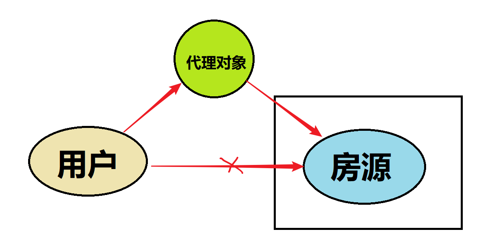
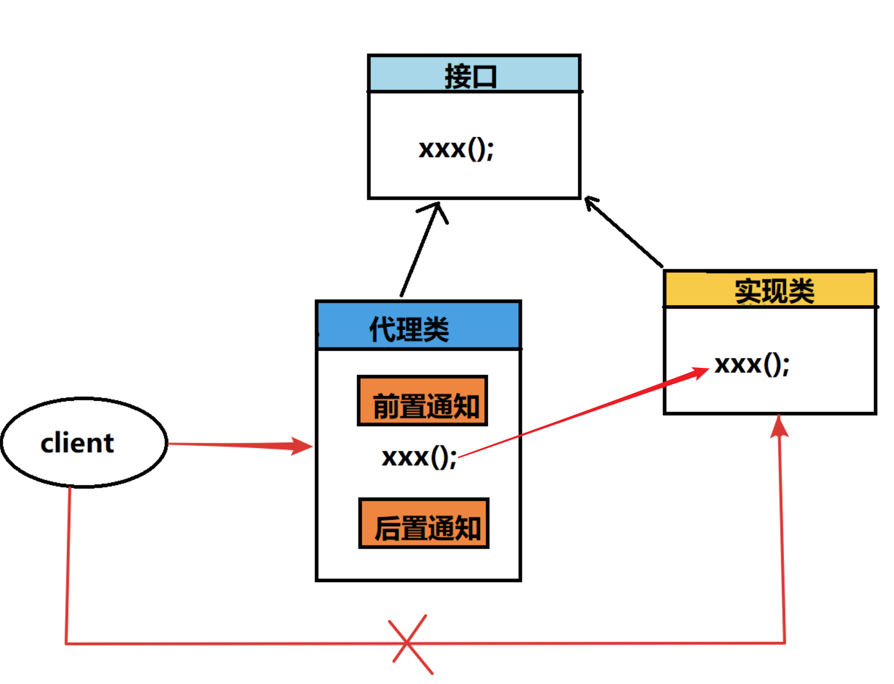
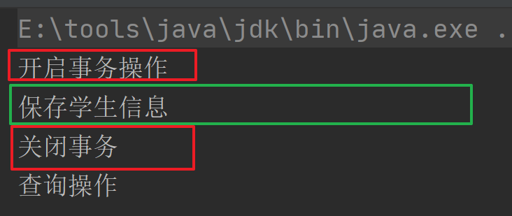
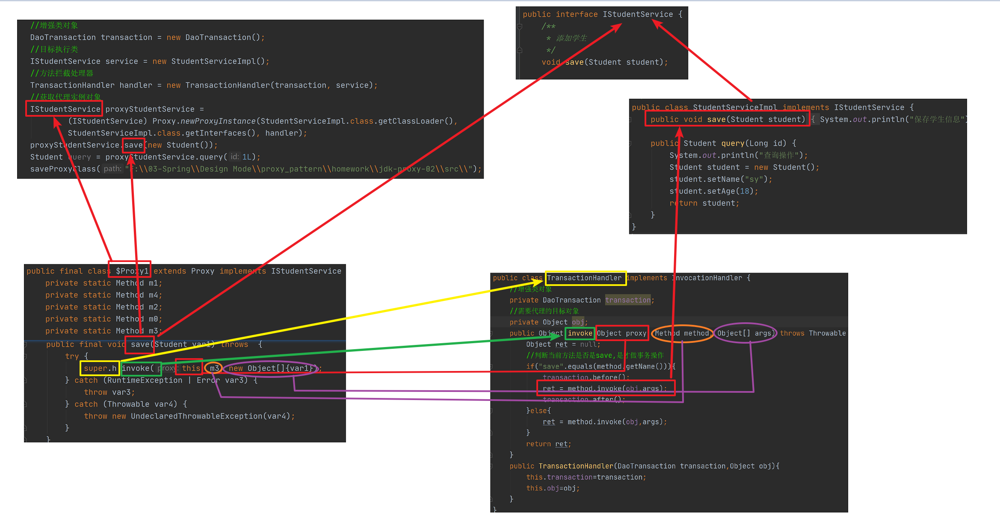
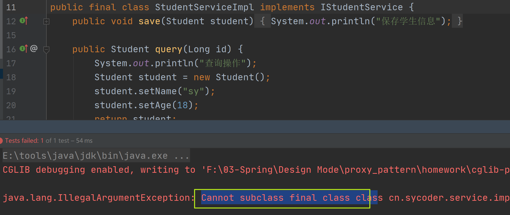

# 一、代理模式概述

## 1.生活中代理案例

- 房屋中介代理
  - 客户手里面没有房源信息，找一个中介
- 商品代购
  - 这些代购者可以去拿到比较低成本的商品，拥有自己的渠道


## 2.为什么要使用代理

- 对于消费者而言，可以减少成本，只需要关心自己需要的商品，不需要去寻找渠道或者是找房源。

## 3.代理模式在 Java 中的应用

- 统一异常处理
- Mybatis 使用了代理
- Spring aop实现原理
- 日志框架


## 4.概述

- 代理模式（Proxy Pattern）：是23种设计模式中的一种，属于结构型的模式。指一个**对象本身不做实际的操作**，而是通过**其它对象**来得到自己想得到的结果。
- **意义**：目标对象只需要关心自己的实现细节，通过代理对象来实现功能的增强，可以扩展目标对象的功能。
- 体现了非常重要的编程思想：不能随便修改源码，如果需要修改源码，通过修改代理的方式来实现功能的拓展。

## 5.生活中代理图示

- 图示

  

# 二、代理的实现方式

## 1.Java 中代理图示

- 图示

  

- 元素组成

  - 接口，定义行为和规范的
  - 被代理类，是目标对象
  - 代理类，做功能增强的

## 2.静态代理

### 2.1案例

- 通过代理模式实现事务操作

### 2.2实现案例

- 创建 domain 对象

  ```java
  @Data
  public class Student {
      private String name;
      private int age;
  }
  ```

  

- 创建service 接口定义规范

  ```java
  public interface IStudentService {
      /**
       * 添加学生
       */
      void save();
  
      /**
       * 查询学生信息
       * @param id
       * @return
       */
      Student query(Long id);
  }
  ```

  

- 创建实现类，被代理类

  ```java
  public class StudentServiceImpl implements IStudentService {
      public void save() {
          System.out.println("保存学生信息");
      }
  
      public Student query(Long id) {
          Student student = new Student();
          student.setName("sy");
          student.setAge(18);
          return student;
      }
  }
  ```

- 创建事务类对象

  ```java
  public class DaoTransaction {
      public void before(){
          System.out.println("开启事务操作");
      }
  
      public void after(){
          System.out.println("关闭事务");
      }
  }
  ```

- 创建代理类对象

  ```java
  public class ProxyStudent implements IStudentService {
      //目标类对象
      private StudentServiceImpl studentService;
      //需要做的增强对象
      private DaoTransaction transaction;
      //通过构造器获取目标类和增强类对象
      public ProxyStudent(StudentServiceImpl studentService,DaoTransaction daoTransaction){
          this.studentService = studentService;
          this.transaction = daoTransaction;
      }
          
  · 
      public void save() {
          //开启事务操作
          transaction.before();
          //目标类的操作
          studentService.save();
          //关闭事务操作
          transaction.after();
      }
  
      public Student query(Long id) {
          return studentService.query(id);
      }
  }
  ```

  

- 测试代理类对象

  ```java
  public class TestStudent {
  
      @Test
      public void testSave(){
          DaoTransaction transaction = new DaoTransaction();
          StudentServiceImpl studentService = new StudentServiceImpl();
          //获取代理类对象
          //包含了目标对象以及前置通知和后置通知
          ProxyStudent proxyStudent = new ProxyStudent(studentService, transaction);
          proxyStudent.save();
          proxyStudent.query(1L);
  
      }
  }
  ```

  

  

- 运行结果

  

  

### 2.3静态代理存在问题

- 不利于代码拓展，比如接口中新添加一个抽象方法时，所有实现类都需要重新实现，否则报错
- 代理对象需要创建很多，这种设计很不方便和麻烦

# 三、动态代理（⭐️）

## 1.概述

> - 概述：运行时动态生成代理对象的技术，它能够在不改变原始类的情况下，对原始类的方法进行拦截或者增强。
>
> - ### 一、动态代理的原理
>
>   动态代理基于Java的反射机制，在运行时动态生成一个代理类，这个代理类实现了与被代理对象相同的接口（或继承了相同的父类，但Java动态代理通常基于接口）。当通过代理对象调用方法时，方法调用会被重定向到代理类的特定方法（如`invoke`方法），在该方法中可以实现对被代理对象方法的调用以及额外功能的处理。
>
>   ### 二、动态代理的组成
>
>   动态代理主要由两部分组成：
>
>   1. **InvocationHandler接口**：定义了代理类的调用处理器，它实现了`invoke()`方法。在该方法中可以调用被代理对象的方法，并可以在调用前后插入额外的逻辑。
>   2. **Proxy类**：用来动态生成代理类的。通过调用`Proxy`类的静态方法`newProxyInstance()`，可以生成一个代理对象。该方法需要三个参数：代理类的类加载器、代理类的接口数组和`InvocationHandler`对象。
>
>   ### 三、动态代理的执行流程
>
>   1. **定义接口**：首先，需要定义一个接口，该接口是被代理类和代理类共同实现的。这个接口定义了代理对象可以调用的方法集合。
>   2. **实现InvocationHandler接口**：创建一个实现`InvocationHandler`接口的类，该类负责处理代理对象的方法调用。在该类中，需要重写`invoke`方法，并在其中实现被代理方法的调用以及额外功能的处理。
>   3. **创建代理对象**：使用`Proxy`类的静态方法`newProxyInstance()`创建代理对象。该方法会根据提供的参数动态生成一个代理类，并创建一个代理对象。
>   4. **方法调用**：当通过代理对象调用方法时，方法调用会被重定向到`InvocationHandler`的`invoke`方法。在该方法中，可以执行额外的逻辑（如权限检查、日志记录等），然后调用被代理对象的方法，并返回结果
>

- 快速实践

  > 在这个示例中，我们创建了一个 `MyInvocationHandler` 类来实现 `InvocationHandler` 接口，并在 `invoke` 方法中添加了自定义的逻辑。然后，我们使用 `Proxy.newProxyInstance` 方法创建了一个 `MyInterface` 接口的动态代理对象，并将方法调用委托给了 `MyInvocationHandler`。

  ```java
  // 假设我们有一个接口 MyInterface 和它的实现类 MyClass  
  interface MyInterface {  
      void doSomething();  
  }  
    
  class MyClass implements MyInterface {  
      @Override  
      public void doSomething() {  
          System.out.println("Doing something in MyClass");  
      }  
  }  
    
  // 自定义的 InvocationHandler  
  class MyInvocationHandler implements InvocationHandler {  
      private Object target;  
    
      public MyInvocationHandler(Object target) {  
          this.target = target;  
      }  
    
      @Override  
      public Object invoke(Object proxy, Method method, Object[] args) throws Throwable {  
          System.out.println("Before invoking " + method.getName());  
          Object result = method.invoke(target, args);  
          System.out.println("After invoking " + method.getName());  
          return result;  
      }  
  }  
    
  public class ProxyExample {  
      public static void main(String[] args) {  
          MyClass target = new MyClass();  
          MyInvocationHandler handler = new MyInvocationHandler(target);  
    
          // 创建代理对象  
          MyInterface proxy = (MyInterface) Proxy.newProxyInstance(  
                  target.getClass().getClassLoader(),  
                  target.getClass().getInterfaces(),  
                  handler  
          );  
    
          // 调用代理对象的方法  
          proxy.doSomething();  
      }  
  }
  ```

  

## 2.JDK动态代理

### 2.1基础准备

- 创建 service 接口

  ```java
  public interface IStudentService {
      /**
       * 添加学生
       */
      void save();
  
      /**
       * 查询学生信息
       * @param id
       * @return
       */
      Student query(Long id);
  }
  ```

- 创建service实现类(需要代理的类)

  ```java
  public class StudentServiceImpl implements IStudentService {
      public void save() {
          System.out.println("保存学生信息");
      }
  
      public Student query(Long id) {
          System.out.println("查询操作");
          Student student = new Student();
          student.setName("sy");
          student.setAge(18);
          return student;
      }
  }
  ```

- 增强类

  ```java
  public class DaoTransaction {
      public void before(){
          System.out.println("开启事务操作");
      }
  
      public void after(){
          System.out.println("关闭事务");
      }
  }
  ```

### 2.2实现InvocationHandler 接口

- InvocationHandler 接口，用来做方法拦截

  > InvocationHandler是Java反射机制中的一个接口，属于java.lang.reflect包。它的主要作用是为动态代理提供处理方法调用的能力。
  >
  > 作用：
  >
  > - InvocationHandler是一个接口，它定义了一个invoke()方法，该方法在代理对象的方法被调用时被触发。通过实现InvocationHandler接口，开发者可以定义在代理对象上调用方法时要执行的逻辑。这使得动态代理能够在不修改目标类源代码的情况下，为目标类的方法调用增加额外的功能，如日志记录、事务管理等。

- 实现接口

  ```java
  public class TransactionHandler implements InvocationHandler {
      //增强类对象
      private DaoTransaction transaction;
      //需要代理的目标对象
      private Object target;
      
      public TransactionHandler(DaoTransaction transaction,Object target){
          this.transaction=transaction;
          this.target=target;
      }
      
      public Object invoke(Object proxy, Method method, Object[] args) throws Throwable {
          Object ret = null;
          
          //判断当前方法是否是save,是才做事务操作
          if("save".equals(method.getName())){
              transaction.before();
              ret = method.invoke(target,args);
              transaction.after();
          }else{
              ret = method.invoke(obj,args);
          }
              
          
          return ret;
      }
  }
  ```

- invoke方法里参数介绍

  - Proxy:代理实例，可以通过newProxyInstance创建代理实例

  - `newProxyInstance` 是 Java 中 `java.lang.reflect.Proxy` 类的一个**静态方法**，它用于创建实现了指定接口的动态代理类的实例。这个方法非常关键，因为它允许开发者在运行时创建代理对象，而无需提前编写代理类的源代码。
  
    ```java
    public static Object newProxyInstance(ClassLoader loader,
                                              Class<?>[] interfaces,
                                              InvocationHandler h)
    ```
  
    - **ClassLoader loader**：指定代理类的类加载器。类加载器负责定义类的命名空间，并用于将类的字节码转换为 `Class` 对象。在这里，你需要传入目标类（即你想要代理的类）的类加载器。
    - **Class<?>[] interfaces**：目标类实现的一个或多个接口的数组。这些接口将被代理类实现。代理对象将作为这些接口的一个实现，并将方法调用委托给 `InvocationHandler`。
    - **InvocationHandler h**：调用处理器，当代理对象的方法被调用时，将调用此处理器的 `invoke` 方法。你需要实现这个接口，并在 `invoke` 方法中编写你希望在代理方法调用前后执行的逻辑。

  - Method:执行目标方法的，invoke 方法执行
  
  - args:参数数组


### 2.3测试

- 方法

  ```java
   @Test
      public void testSave(){
          //增强类对象
          DaoTransaction transaction = new DaoTransaction();
          //目标执行类
          IStudentService service = new StudentServiceImpl();
          //方法拦截处理器
          TransactionHandler handler = new TransactionHandler(transaction, service);
          //获取代理实例对象
          IStudentService proxyStudentService =(IStudentService) Proxy.newProxyInstance(StudentServiceImpl.class.getClassLoader(),
                  StudentServiceImpl.class.getInterfaces(), handler);
          proxyStudentService.save();
          Student query = proxyStudentService.query(1L);
  
      }
  ```

### **2.4底层运行原理**

- 生成代理类的字节码来学习

  ```java
  private void saveProxyClass(String path){
          byte[] $proxy1s = ProxyGenerator.generateProxyClass("$Proxy1",
                  StudentServiceImpl.class.getInterfaces());
          FileOutputStream out = null;
          try {
              out =  new FileOutputStream(new File(path + "$Proxy1.class"));
              out.write($proxy1s);
          } catch (Exception e) {
              e.printStackTrace();
          }finally {
              if(out !=null){
                  try {
                      out.flush();
                      out.close();
                  } catch (IOException e) {
                      e.printStackTrace();
                  }
              }
  
          }
  
      }
  ```

- 生成字节码反编译结果

  ```java
  public final class $Proxy1 extends Proxy implements IStudentService {
      private static Method m1;
      private static Method m4;
      private static Method m2;
      private static Method m0;
      private static Method m3;
  
      public $Proxy1(InvocationHandler var1) throws  {
          super(var1);
      }
  
      public final boolean equals(Object var1) throws  {
          try {
              return (Boolean)super.h.invoke(this, m1, new Object[]{var1});
          } catch (RuntimeException | Error var3) {
              throw var3;
          } catch (Throwable var4) {
              throw new UndeclaredThrowableException(var4);
          }
      }
  
      public final Student query(Long var1) throws  {
          try {
              return (Student)super.h.invoke(this, m4, new Object[]{var1});
          } catch (RuntimeException | Error var3) {
              throw var3;
          } catch (Throwable var4) {
              throw new UndeclaredThrowableException(var4);
          }
      }
  
      public final String toString() throws  {
          try {
              return (String)super.h.invoke(this, m2, (Object[])null);
          } catch (RuntimeException | Error var2) {
              throw var2;
          } catch (Throwable var3) {
              throw new UndeclaredThrowableException(var3);
          }
      }
  
      public final int hashCode() throws  {
          try {
              return (Integer)super.h.invoke(this, m0, (Object[])null);
          } catch (RuntimeException | Error var2) {
              throw var2;
          } catch (Throwable var3) {
              throw new UndeclaredThrowableException(var3);
          }
      }
  
      public final void save(Student var1) throws  {
          try {
              super.h.invoke(this, m3, new Object[]{var1});
          } catch (RuntimeException | Error var3) {
              throw var3;
          } catch (Throwable var4) {
              throw new UndeclaredThrowableException(var4);
          }
      }
  
      static {
          try {
              m1 = Class.forName("java.lang.Object").getMethod("equals", Class.forName("java.lang.Object"));
              m4 = Class.forName("cn.sycoder.service.IStudentService").getMethod("query", Class.forName("java.lang.Long"));
              m2 = Class.forName("java.lang.Object").getMethod("toString");
              m0 = Class.forName("java.lang.Object").getMethod("hashCode");
              m3 = Class.forName("cn.sycoder.service.IStudentService").getMethod("save", Class.forName("cn.sycoder.domain.Student"));
          } catch (NoSuchMethodException var2) {
              throw new NoSuchMethodError(var2.getMessage());
          } catch (ClassNotFoundException var3) {
              throw new NoClassDefFoundError(var3.getMessage());
          }
      }
  }
  ```

  

- 执行原理图

  

  

  - 文字说明：
    - 通过实现接口，获取到接口里面的所有方法
    - 通过Proxy 创建代理类实例
    - 通过反射机制，获取到一个个的方法对象
    - 调用InvocationHandler 接口中的invoke 方法，从而实现业务的增强

  

## 3.CGLIB动态代理

> - **概述**：CGLIB（Code Generation Library）动态代理是一种强大的、高性能的代码生成技术，它允许开发者在运行时创建代理类，以实现对目标类方法的拦截和增强。
>
> - **原理**：CGLIB动态代理的原理是基于**继承**的。它通过生成目标类的子类，并重写目标类中的非final方法来实现代理功能。在运行时，通过调用子类的方法来间接调用父类（即目标类）的方法，从而可以在方法调用前后添加额外的逻辑，如日志记录、性能监控等。
>
> - ### 使用步骤
>
>   1. **引入CGLIB依赖**：
>      - 在使用CGLIB动态代理之前，需要在项目中引入CGLIB的依赖。通常可以通过Maven或Gradle等构建工具来添加CGLIB的依赖。
>   2. **创建目标类**：
>      - 定义一个需要被代理的类，即目标类。这个类可以是普通的Java类，无需实现任何接口。
>   3. **实现MethodInterceptor接口**：
>      - 编写一个实现`MethodInterceptor`接口的类，用于处理代理逻辑。这个接口中定义了一个`intercept`方法，该方法会在代理方法被调用时执行。在`intercept`方法中，可以添加前置处理、后置处理等逻辑。
>   4. **创建CGLIB动态代理**：
>      - 使用`Enhancer`类来创建CGLIB动态代理。首先，需要设置`Enhancer`的父类为目标类；然后，设置回调对象为实现了`MethodInterceptor`接口的类；最后，通过调用`create`方法来生成代理类的实例。

- JDK动态代理有一个前提，需要代理的类必须实现接口，如果没有实现接口，只能通过CGLIB来实现，其实就是对于JDK动态代理的一个补充

- 注意：

  - 类不能被 final 修饰

  - 方法不能被 final 修饰

    

### 3.1基础准备

- 导包

  ```java
  <dependency>
      <groupId>cglib</groupId>
      <artifactId>cglib</artifactId>
      <version>2.2.2</version>
  </dependency>
  ```

- 准备需要代理目标类

  ```java
  public class StudentServiceImpl implements IStudentService {
      public void save(Student student) {
          System.out.println("保存学生信息");
      }
  
      public Student query(Long id) {
          System.out.println("查询操作");
          Student student = new Student();
          student.setName("sy");
          student.setAge(18);
          return student;
      }
  }
  ```

  ```java
  public interface IStudentService {
      /**
       * 添加学生
       */
      void save(Student student);
  
      /**
       * 查询学生信息
       * @param id
       * @return
       */
      Student query(Long id);
  }
  ```

### 3.2实现方法拦截MethodInterceptor 

- 实现方法拦截

  ```java
  public class CglibInterceptor implements MethodInterceptor {
  
      DaoTransaction transaction;
      public CglibInterceptor(DaoTransaction transaction){
          this.transaction = transaction;
      }
      
      public Object intercept(Object o, Method method, Object[] objects, MethodProxy methodProxy) throws Throwable {
          //事务增强
          transaction.before();
          Object ret = methodProxy.invokeSuper(o, objects);
          //事务增强
          transaction.after();
          return ret;
      }
  }
  ```

### 3.3测试

- 测试代码

  ```java
  @Test
      public void testSave() {
          //生成目标代理类
          System.setProperty(DebuggingClassWriter.DEBUG_LOCATION_PROPERTY,"F:\\03-Spring\\Design Mode\\proxy_pattern\\homework\\cglib-proxy-03\\src\\");
          //得到方法拦截器
          CglibInterceptor interceptor = new CglibInterceptor(new DaoTransaction());
          //使用CGLIB框架生成目标类的子类（代理类）实现增强
          Enhancer enhancer = new Enhancer();
          //设置父类字节码
          enhancer.setSuperclass(StudentServiceImpl.class);
          //设置拦截处理
          enhancer.setCallback(interceptor);
          IStudentService service = (IStudentService) enhancer.create();
          service.save(new Student());
  
      }
  ```

### **3.4底层运行原理**（⭐️）

- 运行原理图（图片看不清可以，去文件夹查看）

  

  

- 文字说明：
  - 通过继承的方式去获取到目标对象的方法
  - 通过传递方法拦截器 MethodInterceptor 实现方法拦截，在这里面做具体的增强
  - 调用生成的代理类对象具体执行重写的 save 方法，直接去调用方法拦截器里面的 intercept 方法
  - 前后加上了增强操作，从而实现了不修改目标代码实现业务增强

# 四、总结（两者对比）（⭐️）

| 代理类型      | 实现机制                                                     | 回调方式                 | 使用场景                    | 效率                                             |
| ------------- | ------------------------------------------------------------ | ------------------------ | --------------------------- | ------------------------------------------------ |
| JDK动态代理   | 通过实现接口，通过反射机制获取到接口里面的方法，并且自定义InvocationHandler 接口，实现方法拦截 | 调用 invoke 方法实现增强 | 目标类有接口实现            | 1.8高于CGLIB                                     |
| CGLIB动态代理 | 继承机制，通过继承重写目标方法，使用MethodInterceptor 调用父类的目标方法从而实现代理 | 调用interceptor方法      | 不能使用final修饰的类和方法 | 第一次调用生成字节码比较耗时间，多次调用性能还行 |

JDK动态代理和CGLIB动态代理是Java中两种常见的动态代理方式，它们各自具有独特的特点和适用场景。以下是对两者的详细对比：

### 一、实现原理

1. **JDK动态代理**

	* **基于接口**：JDK动态代理只能代理实现了接口的类，代理对象是实现了目标对象所有接口的代理类。
	* **反射机制**：使用`java.lang.reflect.Proxy`类和`java.lang.reflect.InvocationHandler`接口来创建代理对象，工作通过反射机制完成。

2. **CGLIB动态代理**

	* **基于继承**：CGLIB动态代理可以代理没有实现接口的类，通过继承目标类生成子类的方式来创建代理对象。
	* **字节码增强**：使用底层的字节码技术，通过`Enhancer`类和`MethodInterceptor`接口来创建代理对象，工作通过字节码增强技术完成。

### 二、性能

1. **JDK动态代理**：因为基于反射机制，所以在调用代理方法时性能上通常略低于CGLIB。但现代JVM对反射的优化已经相当成熟，性能差距已经不像过去那么大了。
2. **CGLIB动态代理**：通常认为其性能要比JDK动态代理更好，因为它通过直接操作字节码生成新的类，避免了使用反射的开销。此外，CGLIB还可以对生成的字节码进行一些优化，例如内联，这能进一步提高代理对象的方法调用速度。

### 三、适用场景

1. **JDK动态代理**

	* 适用于接口驱动的代理场景，在不涉及具体类，只关心接口定义时非常适用。
	* 无需添加任何额外依赖，因为它是基于JDK自带的API。
	* 使用较为简单，只需要实现`InvocationHandler`接口。

2. **CGLIB动态代理**
	* 在需要代理没有实现接口的类，或者需要通过继承来提供增强功能的场景更适用。
	* 需要添加CGLIB库的依赖。
	* 提供了更多的控制，包括方法拦截、方法回调等，但相对来说使用起来更复杂。

### 四、兼容性

1. **JDK动态代理**：是Java核心API的一部分，不需要任何额外的依赖，因此在所有Java环境中都能保证良好的兼容性。
2. **CGLIB动态代理**：需要为目标对象创建一个子类，这可能在某些复杂的类加载环境下导致问题，特别是在OSGi等模块化编程环境中。

### 五、Spring框架中的使用

Spring框架会根据情况选择使用JDK动态代理还是CGLIB动态代理。默认情况下，Spring会优先使用JDK动态代理，如果要代理的对象没有实现接口，则会使用CGLIB动态代理。

综上所述，JDK动态代理和CGLIB动态代理各有优缺点，选择哪种代理方式通常取决于具体的应用场景和需求。如果目标对象已经实现了接口，那么JDK动态代理是一个简单而有效的选择。如果目标对象没有实现接口或者有特定的继承结构要求，CGLIB可能是更好的选择。
