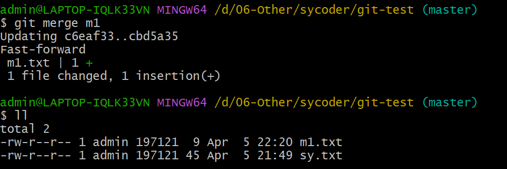

# Git分布式版本管理控制工具

# 一、认识代码管理控制工具

## 1.场景再现

### 1.1代码备份

- 上云哥写完代码，准备发布网站上前，电脑被偷了，代码拿不到了。

### 1.2代码还原

- 云粉在做项目时，上云哥新发一个需求给云粉，云粉耗时1天，把代码改得乱七八糟，处处报错，想恢复恢复不了，只有痛苦的从头做一遍。

### 1.3合作开发

- 项目实战中，两个云粉A/B同学负责订单中心代码，云粉A同学优化修改了其中某个类的代码，云粉B同学不知道也把这个类代码改了，那么最终只能呈现出云粉B同学的代码。

### 1.4追责溯源

- 网站出现重大bug流失用户，架构师要扣程序员奖金，可是追问是谁写的代码时。A、B、C、D四个开发都不承认是自己写的，相互推诿。

## 2.代码管理控制工具

### 2.1集中式版本控制工具

​		集中式版本控制工具，版本库是集中存放在中央服务器的，团队里每个人工作时从中央服务器下载代

码，是必须联网才能工作，局域网或互联网。个人修改后然后提交到中央版本库。

- SVN
- CVS

### 2.2分布式版本控制工具Git

​	git是一个开源的分布式版本控制系统，可以有效、高速地处理从很小到非常大的项目版本管理。Git是Linus Torvalds 为了帮助管理 Linux 内核开发而开发的一个开放源码的版本控制软件。

Git是分布式的，Git不需要有中心服务器，我们每台电脑拥有的东西都是一样的。我们使用Git并且有个中心服务器，仅仅是为了方便交换大家的修改，但是这个服务器的地位和我们每个人的PC是一样的。我们可以把它当做一个开发者的pc就可以就是为了大家代码容易交流不关机用的。没有它大家一样可以工作，只不过"交换"修改不方便而已。

#### 2.2.1工作流程图


#### 2.2.2常用命令

- clone（克隆）: 从远程仓库中克隆代码到本地仓库
- checkout （检出）:从本地仓库中检出一个仓库分支然后进行修订
- add（添加）: 在提交前先将代码提交到暂存区
- commit（提交）: 提交到本地仓库。本地仓库中保存修改的各个历史版本
- fetch (抓取) ： 从远程库，抓取到本地仓库，不进行任何的合并动作，一般操作比较少。
- pull (拉取) ： 从远程库拉到本地库，自动进行合并(merge)，然后放到到工作区，相当于fetch+merge
- push（推送） : 修改完成后，需要和团队成员共享代码时，将代码推送到远程仓库

# 二、Git安装与基本使用

## 1.下载/安装/配置

### 1.1下载Git

git 官方下载地址：https://git-scm.com/download

- 输入url，找到windows超链接

  

- 点击Windows超链接进入下载页面

  

- 下载完成后会得到如下安装文件

  

### 1.2安装Git

- 双击exe安装文件进行安装(选择安装路径之后，一路直接Next就行)

  

- 安装完成后，右键可以看到如下两个菜单选项，证明安装成功

  

  - Git GUI：Git提供的图形界面工具
  - Git Bash：Git提供的命令行工具

- 选择Git Bash Here菜单,通过命令验证

  ```shell
  git -v
  git --version
  ```

  

### 1.3配置Git

- 配置用户信息（用户名和邮箱）

  ```shell
  git config --global user.name "sycoder"
  git config --global user.email "sycoder@it.com" #注意，邮箱填自己邮箱即可
  ```

- 查看配置信息

  ```shell
  git config --global user.name
  git config --global user.email
  ```

  


## 2.常用操作(⭐️)

### 2.1初始化

Git软件主要用于管理文件的版本信息，但它只是一个软件，不可能安装后就直接将系统中所有的文件全部纳入到它的管理范畴中。并且，软件管理版本信息的主要目就是管理文件的修改和变更，如果将系统中所有文件都进行管理其实意义是不大的。所以一般情况下，我们需要指定某一个文件目录作为软件的管理目录。因为这个目录主要就作为Git软件的管理文件的版本变化信息，这个目录就是Git软件的版本仓库目录。

- 进入需要初始化的目录（可以通过cd 进入，也可以直接去到需要的文件夹右键，打开bash)

  

- 执行命令

  ```shell
  git init
  ```

- 执行命令后，仓库目录，可以看到.git目录，用于管理当前目录（注意：这是一个隐藏目录）

  

### 2.2版本库状态

- git status 查看版本库状态

  ```shell
  git status
  ```

  

### 2.3添加文件

- 手动创建文件sy.text

  

- git status 查看版本库状态

  ```shell
  git status
  ```

  

  从上图可以看到，sy.txt文件属于**untracked files（未追踪文件）**,这里表示当前的sy.txt文件虽然放置到了版本库的文件目录中，被Git软件识别到了，但是未纳入到版本库管理中。

- git add 添加文件进版本库

  ```shell
  git add sy.txt
  ```

  可以再次通过git status 查看当前版本库状态。

  

  此时文件状态为cached file，这是什么意思呢？其实这也是Git管理文件时的一种状态：暂存状态，草稿状态。

### 2.4提交文件

- git commit 提交文件进版本库

  - -m 表示提交的备注信息

  ```shell
  git commit -m 'first commit'
  ```

  

- 再次查看 git 版本库状态

  ```shell
  git status
  ```

  

### 2.5修改提交到版本库文件

- 手动编辑sy.txt 文件

  

- 修改后查看版本库状态

  ```shell
  git status
  ```

  

  **modified**表示文件已经修改，可以把这一次的修改提交到版本库

- 提交修改后文件进版本库

  ```shell
  #添加文件
  git add sy.txt
  #提交
  git commit -m 'update commit'
  ```

  当然，上面的语句还可以优化成一句：

  ```shell
  git commit -a -m 'update commit'
  ```

  

### 2.6查看版本历史

- git log 查看版本库历史信息

  ```shell
  git log
  ```

  

- 以行显示

  ```shell
  git log --pretty=oneline
  ```

### 2.7删除文件

- 删除文件后版本库状态

  

  版本库中文件还在，但是物理磁盘内的文件已经删除。提供了两个选择给操作者：

  - 提交删除
  - 从版本库恢复文件

### 2.8恢复历史文件

**如果版本库中一份文件已经被删除了，那么还能找回来吗**？其实原则上来讲，已经不行了，因为文件删除本身也是一种变更操作，也算是版本库管理的一部分。所以想要将已经删除的那份文件从版本库中取出来，已经是不可能了。但是，要注意的是，**版本库管理的是文件不同版本的变更操作**，这个不同版本的概念还是非常重要的。也就是说，**最后的那个删除的文件版本已经没有了，但是之前版本的文件其实还是存在的**。所以如果我们能将文件恢复到某一个版本，那么那个版本的文件就依然存在。

- 查看版本库信息

  ```shell
  git log --oneline
  ```

  

- 将版本库文件重置到某一个版本

  ```shell
  $ git reset --hard 5e03000
  ```

### 2.9回退错了，能不能前进呀

```shell
$ git reflog
# 这个命令保留了最近执行的操作及所处的版本，每条命令前的hash值，则是对应版本的hash值。使用上述的git checkout 或者 git reset命令 则可以检出或回退到对应版本。
```

### 2.10添加文件至忽略列表

一般我们总会有些文件无需纳入Git 的管理，也不希望它们总出现在未跟踪文件列表。 通常都是些自动

生成的文件，比如日志文件，或者编译过程中创建的临时文件等。 在这种情况下，我们可以在工作目录

中创建一个名为 .gitignore 的文件（文件名称固定），列出要忽略的文件模式。下面是一个示例：

```java
# no .a files
*.a
# but do track lib.a, even though you're ignoring .a files above
!lib.a
# only ignore the TODO file in the current directory, not subdir/TODO
/TODO
# ignore all files in the build/ directory
build/
# ignore doc/notes.txt, but not doc/server/arch.txt
doc/*.txt
# ignore all .pdf files in the doc/ directory
doc/**/*.pdf
```


# 三、Git实战应用

刚才的学习，仅仅争对同一条路线操作使用，但是实际开发中，会有很多分支的情况出现。


## 1. Git 分支

### 1.1 Master分支

默认情况下，Git软件就存在分支的概念，而且就是一个分支，称之为master分支，也称之为主干分支。


### 1.2 其它分支

- 创建分支操作

  ```shell
  # git branch 分支名称
  git branch m1
  git branch m2
  ```

- 查看分支

  ```shell
  git branch -v
  ```

  

- 切换分支

  ```shell
  # git checkout 分支名称
  git checkout m1
  ```

  

  - m1 分支添加文件

    

  - 切换回master 分支再次查看文件状态

    ```shell
    git checkout master
    ```

    

- 删除分支

  ```shell
  # git branch -d 分支名称
  Git branch -d m2
  ```

  


## 2. Git 合并

创建多个分支是因为需要在不同的工作环境中进行工作，但是，最后都应该将所有的分支合在一起。形成一个整体。作为项目的最终结果。

- 将m1分支中的文件提交

  ```shell
  git commit -a -m 'first commit'
  ```

- 切换到master 分支合并m1分支文件

  ```shell
  # git merge 分支名称
  git merge m1
  ```

  

  

## 3. Git 冲突

在多分支并行处理时，每一个分支可能是基于不同版本的主干分支创建的。如果每个分支都独立运行而不进行合并，就没有问题，但是如果在后续操作过程中进行合并的话，就有可能产生冲突。比如m1、m2两个分支都是基于master分支创建出来的。m1分支如果和m2分支修改了同一份文件，那么在合并时，以哪一个文件为准呢，这就是所谓的冲突。下面演示一下冲突问题，在演示之前，需要把刚才创建的分支删掉，主分支数据删掉。

- 清空环境信息

  ```shell
  git checkout master
  Git branch -d m1
  ```

  

- master 分支添加 master.txt 文件，并且提交到master 分支

  

- 创建m1/m2 两个分支

  ```shell
  git branch m1
  git branch m2
  ```

- 切换分支m1,并且修改master.txt 文件，增加内容123

  ```shell
  git checkout m1
  git add master.txt
  git commit -m '123'
  ```

  

- 切换到m2,并且修改master.txt 文件，增加内容456

  ```shell
  git chekcout m2
  git add master.txt
  git commit -m '456'
  ```

- 切换到master,合并分支m1

  ```shell
  git checkout master
  git merge m1
  ```

  

- 合并分支m2

  ```shell
  git merge m2
  #通过 git diff 查看文件不通
  git diff
  ```

  此时打开文件就出现了如下情况。

  

  这里的冲突，软件是无法判断该如何出来处理的，所以需要人工进行判断，将冲突的文件内容进行修正。

  

  重新提交到master分支。

  ```shell
   git commit -a -m 'merge master'
  ```

  

## 4.开发中分支使用建议

几乎所有的版本控制系统都以某种形式支持分支。 使用分支意味着你可以把你的工作从开发主线上分离
开来进行重大的Bug修改、开发新的功能，以免影响开发主线。

在开发中，一般有如下分支使用原则与流程：

- master （生产） 分支：线上分支，主分支，中小规模项目作为线上运行的应用对应的分支
- develop（开发）分支：是从master创建的分支，一般作为开发部门的主要开发分支，如果没有其他并行开发不同期上线要求，都可以在此版本进行开发，阶段开发完成后，需要是合并到master分支,准备上线。
- feature/xxxx分支：从develop创建的分支，一般是同期并行开发，但不同期上线时创建的分支，分支上的研发任务完成后合并到develop分支
- hotfix/xxxx分支：从master派生的分支，一般作为线上bug修复使用，修复完成后需要合并到master、test、develop分支
- 还有一些其他分支，在此不再详述，例如test分支（用于代码测试）、pre分支（预上线分支）等等

# 四、Git远程仓库

## 1. 常用的托管服务（远程仓库）

前面我们已经知道了Git存在两种类型的仓库，即本地仓库和远程仓库。

那么有哪些常见的代码托管仓库：

- GitHub：（ https://github.com/ ）是一个面向开源及私有软件项目的托管平台，因为只支持
  Git 作为唯一的版本库格式进行托管，故名GitHub
- 码云：（https://gitee.com/ ）是国内的一个代码托管平台，由于服务器在国内，所以相比于
  GitHub，码云速度会更快
- GitLab：（https://about.gitlab.com/ ）是一个用于仓库管理系统的开源项目，使用Git作
  为代码管理工具，并在此基础上搭建起来的web服务,一般用于在企业、学校等内部网络搭建git私服

**注意：**由于很多同学访问Github 较慢或者无法访问，我们不做Github讲解，使用流程和码云差不多的，学习码云即可。

## 2.Gitee托管服务

### 2.1 注册Gitee

- 地址：https://gitee.com/signup

  

### 2.2 创建远程仓库

- 点击+号创建仓库

  

- 填写仓库信息

  

- 创建完成后会看见如下地址

  

### 2.3 配置SSH公钥

- 配置后不需要输入账号密码就可以操作

- 本地生成SSH公钥

  ```shell
  ssh-keygen -t rsa
  ```

- 不断回车，如果公钥已经存在，则自动覆盖

- Gitee设置账户共公钥

  - 获取公钥

    ```shell
    cat ~/.ssh/id_rsa.pub
    ```

    

  - 设置公钥

    

  - 验证是否配置成功

    ```shell
    ssh -T git@gitee.com
    ```

### 2.4 操作Gitee

- 初始化本地仓库

  ```shell
  git init
  ```

- 添加远程仓库

  ```shell
  git remote add <远端名称> <仓库路径>
  #远端名称，默认是origin，取决于远端服务器设置
  #仓库路径，从远端服务器获取此URL
  git remote add origin git@gitee.com:lgysy/sy-study.git
  ```

  

- 查看远程仓库

  ```shell
  git remote
  ```

  

- 推送数据到远程仓库

  ```shell
  #将远程与本地仓库合并
  git pull --rebase origin master
  #推送本地仓库数据到远程仓库
  git push --set-upstream origin master
  ```

- 克隆远程仓库(还可以通过克隆远程仓库的方式实现)

  ```shell
  #本地路径可以不用写
  git clone <仓库路径> [本地目录]
  ```

- 从远程仓库中抓取与拉取

  - 抓取指令就是将仓库里的更新都抓取到本地，不会进行合并

    ```shell
    #抓取 命令：git fetch [remote name] [branch name]
    ```

  - 拉取指令就是将远端仓库的修改拉到本地并自动进行合并，等同于fetch+merge

    ```shell
    #拉取 命令：git pull [remote name] [branch name]
    ```

  - 案例：第一个创建的仓库提交代码，去到第二个仓库拉取代码。

    ```shell
    #第一个仓库推送
    git add test.txt
    git commit -m 'test'
    git push --set-upstream origin master
    #第二个仓库拉代码
    git pull
    ```

- **解决合并冲突**

  在一段时间，A、B用户修改了同一个文件，且修改了同一行位置的代码，此时会发生合并冲突。A用户在本地修改代码后优先推送到远程仓库，此时B用户在本地修订代码，提交到本地仓库后，也需要推送到远程仓库，此时B用户晚于A用户，**故需要先拉取远程仓库的提交，经过合并后才能推送到远端分支**。

  

## 3. Idea 使用 Git

### 3.1检查Idea Git 的配置


### 3.2 Idea 中操作Git

接下来分两种场景学习Idea 操作Git:

- 场景1：本地已经有一个项目，但是并不是git项目，我们需要将这个放到码云的仓库里，和其他开发人员

  继续一起协作开发。

  - 创建项目

    

  - 将本地项目添加仓库

    

  - 设置远程仓库

    

  - 提交到本地仓库

    

  - 推送本地仓库代码到远程仓库

    

    

- 场景2：你拿到了一个offer，去到公司，需要把公司项目拉下来学习。

  - 拉公司仓库代码

    

    

  - 修改个类代码bug 提交，提交后从另外一个窗口也修改同一位置代码，合并冲突。

    

    

  - 解决好冲突后

    

  - 注意，解决好冲突后，还是需要，add/commit/push

  

## 4.分支使用建议

- **切换分支前先提交本地的修改**
- **每次进入dev开发分支之前，先拉最新代码合并，避免写太多代码合并麻烦**
- **一定要先拉代码再合并解决冲突，不能直接提交把其他同事代码覆盖了**


