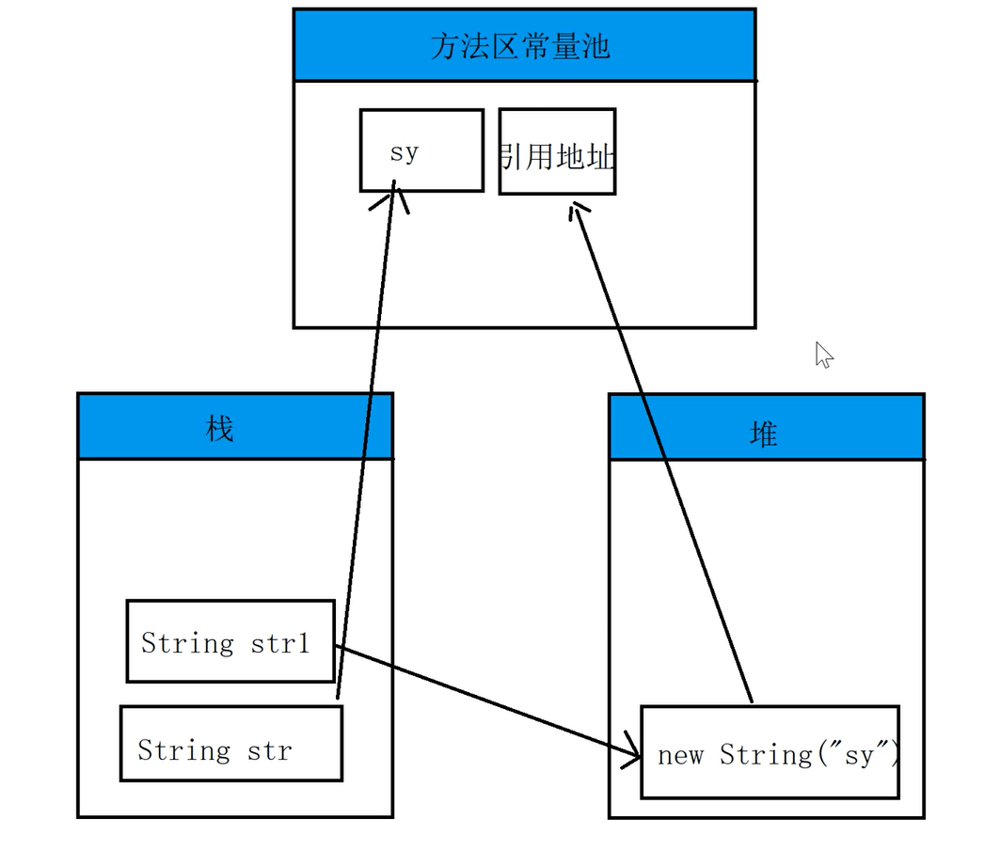

# System 系统类

1. 说明：其它老师讲的时候，会给一个 api 文档，但是我不会给（在职的人不去看）跟着源码学习，不看 api

2. 常用方法：

   ```java
   //学习数组的时候，自己写过数组拷贝的代码
    public static native void arraycopy(Object src,  int  srcPos,Object dest, int destPos, int length);
   
   //查询当前系统时间
   System.currentTimeMillis();
   public static native long currentTimeMillis();
   
   //垃圾回收器
   public static void gc() {
       Runtime.getRuntime().gc();
   }
   ```

   

# 字符串类（String）

1. 构造器 -> 字段 -> 方法

   - 构造器

     ```java
     //无参构造器
     public String() {
         //做了数组初始化
         this.value = new char[0];
     }
     //带一个参数
     public String(String original) {
         //给char 数组赋值
         this.value = original.value;
         //缓存String 的 hash 值
         this.hash = original.hash;
     }
     //传递 char 类型数组
     public String(char value[]) {
         this.value = Arrays.copyOf(value, value.length);
     }
     ```

   - 字段

     ```java
     /** The value is used for character storage. */
     //存储字符的数组
     private final char value[];
     
     /** Cache the hash code for the string */
     //缓存 hash code
     private int hash; // Default to 0
     ```

   - 方法

     ```java
     //查看字符串长度
     public int length() {
         return value.length;
     }
     //判断是否为空
     public boolean isEmpty() {
         return value.length == 0;
     }
     //返回一个索引对应字符值
     public char charAt(int index) {
         return value[index];
     }
     //判断是否包含一个字符
     public boolean contains(CharSequence s) {
         return indexOf(s.toString()) > -1;
     }
     //获取byte[]
     public byte[] getBytes() {
         return StringCoding.encode(value, 0, value.length);
     }
     //以什么开头
     public boolean startsWith(String prefix) {
         return startsWith(prefix, 0);
     }
     //以什么结尾
     public boolean endsWith(String suffix) {
         return startsWith(suffix, value.length - suffix.value.length);
     }
     //equals 方法
     equals(Object obj)
     //以什么什么断开
     public String[] split(String regex) {
         return split(regex, 0);
     }
     //去掉空字符串 “   abc   ”
     public String trim() {}
     ```

     

## 需求练习

1. 创建一个字符串 String str = "   我爱学习-java"

   - 判断是否为空字符串

   - 通过 "-" 分割字符串

   - 去除字符串两端的空格

   - 判断字符串是否包含 java

     ```java
     String str = "   我爱学习-java";
     boolean empty = str.isEmpty();
     System.out.println("当前字符串是否为空："+empty);
     
     String[] split = str.split("-");
     System.out.println(Arrays.toString(split));
     
     String trim = str.trim();
     System.out.println(trim);
     
     boolean isContains = str.contains("java");
     System.out.println("当前字符串是否包含java:"+isContains);
     ```

2. 创建两个字符串

   - String str = "sy"；
   - String strNew = new String("sy");
   - 比较内容时怎么比较？
   - 怎么判断这两块空间不是同一块？（javap -verbose xx.class）
   - 画出String 创建的一个流程图？
   - ```java
     String str = "sy";
     String str1 = new String ("sy");
     ```
   - 
   - 

3. 字符串类可以被继承吗？

   1. 不可以。 String 类被final修饰
   2. 


# StringBuilder(字符缓冲区)

1. StringBuilder 也是final 修饰的不可以不继承

2. 里面的 char[] 数组不是使用 final 修饰的，可以替换

3. 构造器

   ```java
   //默认的数组长度为16
   public StringBuilder() {
       super(16);
   }
   //指定容量
   public StringBuilder(int capacity) {
       super(capacity);
   }
   ```

4. 方法

   ```java
   //做char[] 的拷贝或者拼接
   @Override
   public StringBuilder append(String str) {
       super.append(str);
       return this;//放回当前对象
   }
   
   //将 StringBuilder 对象转换成字符串对象
   @Override
   public String toString() {
       // Create a copy, don't share the array
       return new String(value, 0, count);
   }
   ```

5. 字段

   ```java
   /**
   * The value is used for character storage.
   */
   char[] value;
   
   /**
   * The count is the number of characters used.
   */
   int count;
   ```

   

# StringBuffer

1. 使用synchronized修饰，是线程安全


# 面试题 String StringBuilder StringBuffer 区别

1. 拼接 10万次字符串，去比较各自的耗时
2. 注意：
   - StringBuilder 性能最好 > StringBuffer > String
   - StringBuffer  是线程安全的 