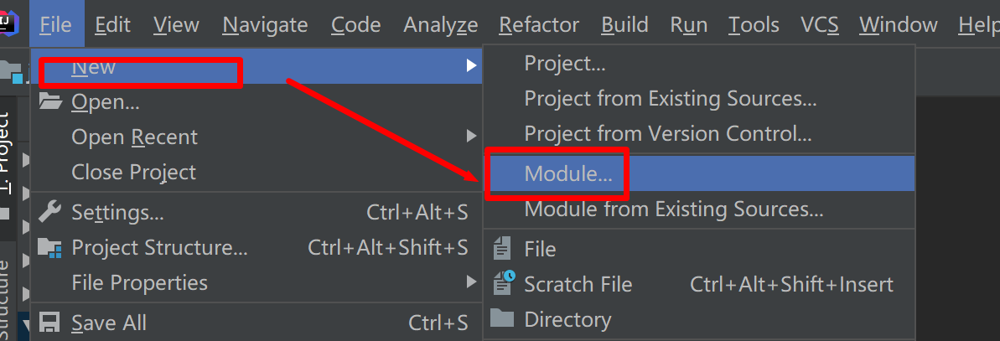
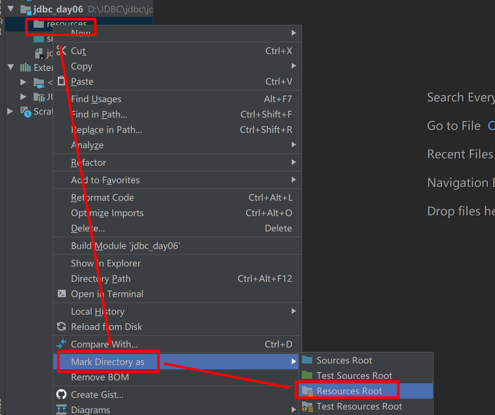
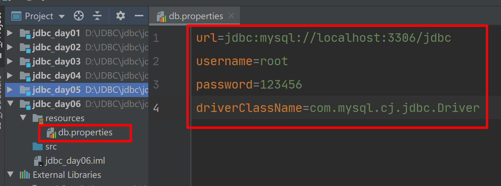
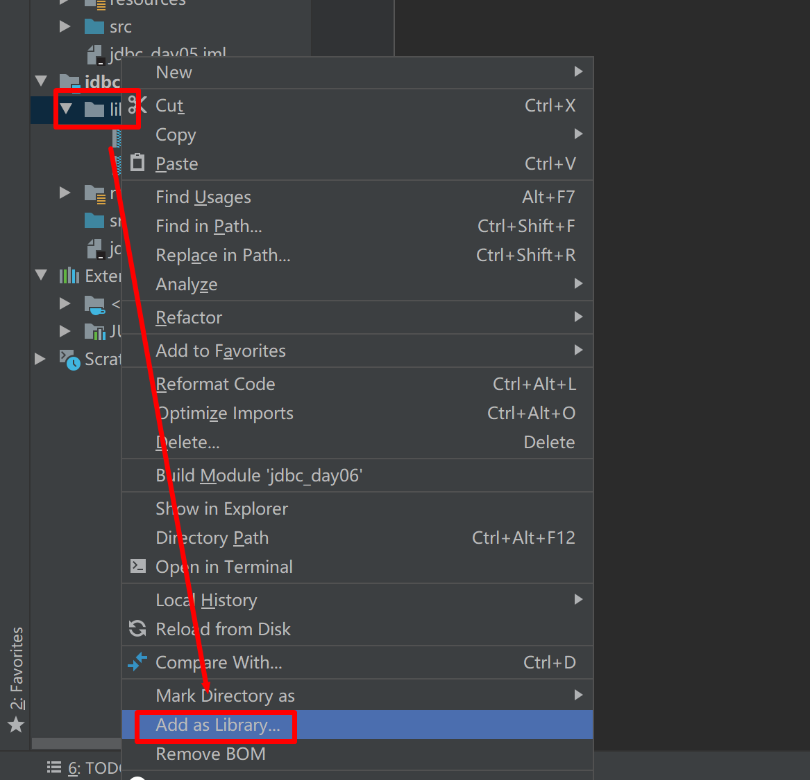
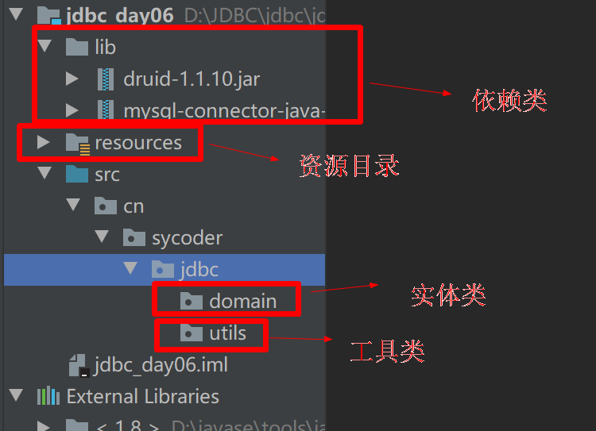

# 一、自定义工具类

## 1.项目配置

- 建模块

  

- 建资源目录

  

- 建配置 db.properties

  

- 添加依赖

  

- 项目结构

  

## 2.配置德鲁伊（Druid）连接池

### 2.1配置连接池对象

```java
 private static DataSource dataSource;

static {
    //加载配置文件资源
    Properties properties = new Properties();
    InputStream in = 	 Thread.currentThread().getContextClassLoader().getResourceAsStream("db.properties");
    try {
        properties.load(in);
    } catch (IOException e) {
        e.printStackTrace();
    }
    try {
        //程序启动的时候加载配置资源获取连接池对象
        dataSource = DruidDataSourceFactory.createDataSource(properties);
    } catch (Exception e) {
        e.printStackTrace();
    }
}
```

### 2.2打印连接池对象

```java
{
	CreateTime:"2022-07-15 10:15:40",
	ActiveCount:0,
	PoolingCount:0,
	CreateCount:0,
	DestroyCount:0,
	CloseCount:0,
	ConnectCount:0,
	Connections:[
	]
}
```

- **注意，德鲁伊连接池对象重写了toString 方法**


## 3.获取连接对象

```java
public static Connection getConn(){
    Connection connection = null;
    try {
        connection = dataSource.getConnection();
    } catch (SQLException throwables) {
        throwables.printStackTrace();
    }
    return connection;
}
```

## 4.新增、删除、更新方法

```java
public static int update(Connection conn,String sql,Object...args){
        //受影响行数
    int count = 0;
    PreparedStatement statement = null;
    try {
        //获取预编译对象
        statement = conn.prepareStatement(sql);
        //参数填充
        for (int i = 0; i < args.length; i++) {
            statement.setObject(i+1,args[i]);
        }
        //执行
        count = statement.executeUpdate();
    } catch (SQLException throwables) {
        throwables.printStackTrace();
    }finally {
        close(conn,statement,null);
    }
    return count;
}
```

```java
 public static void close(Connection conn, Statement statement, ResultSet resultSet){
        if(conn != null){
            try {
                //对于使用连接池对象来说，并不是真正的关闭，是放回连接池
                conn.close();
            } catch (SQLException throwables) {
                throwables.printStackTrace();
            }
        }

        if(statement!=null){
            try {
                statement.close();
            } catch (SQLException throwables) {
                throwables.printStackTrace();
            }
        }

        if(resultSet != null){
            try {
                resultSet.close();
            } catch (SQLException throwables) {
                throwables.printStackTrace();
            }
        }
    }
```

## 5.查询方法

- 注意，要通过反射来灵活处理工具类

  ```java
   public static <T> List<T>  query(Connection conn,String sql,Class<T> clz,Object...args){
          PreparedStatement statement = null;
          List<T> list= new ArrayList<>();
          ResultSet resultSet = null;
          try {
              statement = conn.prepareStatement(sql);
              for (int i = 0; i < args.length; i++) {
                  statement.setObject(i+1,args[0]);
              }
              //查询操作
              resultSet = statement.executeQuery();
              ResultSetMetaData metaData = resultSet.getMetaData();
              int columnCount = metaData.getColumnCount();
              //处理结果集对象
              while (resultSet.next()){
                  T t = clz.newInstance();
                  for (int i = 0; i < columnCount; i++) {
                      //获取列的值
                      Object object = resultSet.getObject(i + 1);
                      //列的名称
                      String columnLabel = metaData.getColumnLabel(i + 1);
                      //获取字段名称
                      Field field = clz.getDeclaredField(changeColumn(columnLabel));
                      field.setAccessible(true);
                      field.set(t,object);
                  }
                  list.add(t);
              }
          } catch (SQLException throwables) {
              throwables.printStackTrace();
          } catch (IllegalAccessException e) {
              e.printStackTrace();
          } catch (InstantiationException e) {
              e.printStackTrace();
          } catch (NoSuchFieldException e) {
              e.printStackTrace();
          } finally {
              close(conn,statement,resultSet);
          }
          return list;
      }
  ```

  ```java
   private static String changeColumn(String column){
      String name = column;
      int index = name.indexOf("_");
      if(index > 0 && name.length() != index + 1){
          name = name.replaceFirst("_","");
          String ret = name.substring(index, index + 1);
          ret = ret.toUpperCase();
          column = name.substring(0,index) + ret + name.substring(index+1);
      }else{
          return column;
      }
      //递归调自己不停去寻找
      return changeColumn(column);
  }
  ```

  