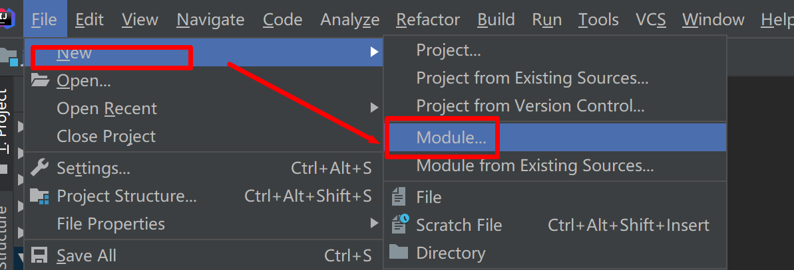
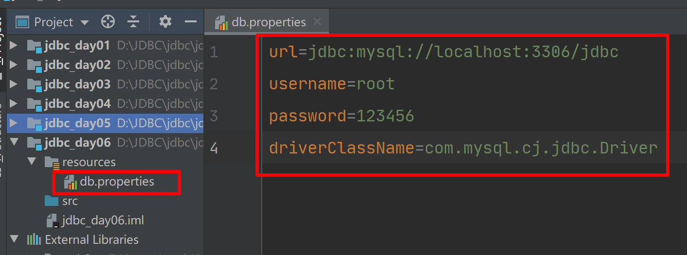
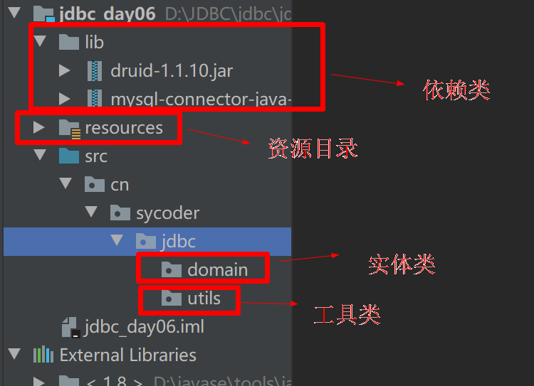

# 一、自定义工具类

## 1.项目配置

- 建模块

  

- 建资源目录

  

- 建配置 db.properties

  

- 添加依赖

  

- 项目结构

  

## 2.配置德鲁伊（Druid）连接池

### 2.1配置连接池对象

```java
 private static DataSource dataSource;

static {
    //加载配置文件资源
    Properties properties = new Properties();
    InputStream in = 	 Thread.currentThread().getContextClassLoader().getResourceAsStream("db.properties");
    try {
        properties.load(in);
    } catch (IOException e) {
        e.printStackTrace();
    }
    try {
        //程序启动的时候加载配置资源获取连接池对象
        dataSource = DruidDataSourceFactory.createDataSource(properties);
    } catch (Exception e) {
        e.printStackTrace();
    }
}
```

### 2.2打印连接池对象

```java
{
	CreateTime:"2022-07-15 10:15:40",
	ActiveCount:0,
	PoolingCount:0,
	CreateCount:0,
	DestroyCount:0,
	CloseCount:0,
	ConnectCount:0,
	Connections:[
	]
}
```

- **注意，德鲁伊连接池对象重写了toString 方法**


## 3.获取连接对象

```java
public static Connection getConn(){
    Connection connection = null;
    try {
        connection = dataSource.getConnection();
    } catch (SQLException throwables) {
        throwables.printStackTrace();
    }
    return connection;
}
```

## 4.新增、删除、更新方法

```java
public static int update(Connection conn,String sql,Object...args){
        //受影响行数
    int count = 0;
    PreparedStatement statement = null;
    try {
        //获取预编译对象
        statement = conn.prepareStatement(sql);
        //参数填充
        for (int i = 0; i < args.length; i++) {
            statement.setObject(i+1,args[i]);
        }
        //执行
        count = statement.executeUpdate();
    } catch (SQLException throwables) {
        throwables.printStackTrace();
    }finally {
        close(conn,statement,null);
    }
    return count;
}
```

```java
 public static void close(Connection conn, Statement statement, ResultSet resultSet){
        if(conn != null){
            try {
                //对于使用连接池对象来说，并不是真正的关闭，是放回连接池
                conn.close();
            } catch (SQLException throwables) {
                throwables.printStackTrace();
            }
        }

        if(statement!=null){
            try {
                statement.close();
            } catch (SQLException throwables) {
                throwables.printStackTrace();
            }
        }

        if(resultSet != null){
            try {
                resultSet.close();
            } catch (SQLException throwables) {
                throwables.printStackTrace();
            }
        }
    }
```

### Note:

- ​	**conn.close。 并不是真正的关闭，而是放回连接池。**

  ```java
   public static void main(String[] args) {
  
          System.out.println(JDBCUtil.dataSource);
  
          String sql = "update account set money = ?";
  
          JDBCUtil.update(JDBCUtil.getConn(),sql,"2000");
  
          System.out.println(JDBCUtil.dataSource);
  
   }
  ```

  con关闭前datasource输出情况

  ```java
  {
  	CreateTime:"2024-10-09 10:33:36",
  	ActiveCount:0,
  	PoolingCount:0,
  	CreateCount:0,
  	DestroyCount:0,
  	CloseCount:0,
  	ConnectCount:0,
  	Connections:[
  	]
  }
  ```

  con关闭后datasource输出情况

  ```java
  {
  	CreateTime:"2024-10-09 10:33:36",
  	ActiveCount:0,
  	PoolingCount:1,
  	CreateCount:1,
  	DestroyCount:0,
  	CloseCount:1,
  	ConnectCount:1,
  	Connections:[
  		{ID:314337396, ConnectTime:"2024-10-09 10:33:37", UseCount:1, LastActiveTime:"2024-10-09 10:33:37"}
  	]
  }
  ```

  

## 5.查询方法(⭐️)

- 注意，要通过**反射**来灵活处理工具类

  ```java
   public static <T> List<T>  query(Connection conn,String sql,Class<T> clz,Object...args){
          PreparedStatement statement = null;
          List<T> list= new ArrayList<>();
          ResultSet resultSet = null;
          try {
              statement = conn.prepareStatement(sql);
              for (int i = 0; i < args.length; i++) {
                  statement.setObject(i+1,args[i]);
              }
              //查询操作
              resultSet = statement.executeQuery();
              ResultSetMetaData metaData = resultSet.getMetaData();
              int columnCount = metaData.getColumnCount();
              //处理结果集对象
              while (resultSet.next()){
                  T t = clz.newInstance();
                  for (int i = 0; i < columnCount; i++) {
                      //获取列的值
                      Object object = resultSet.getObject(i + 1);
                      //列的名称
                      String columnLabel = metaData.getColumnLabel(i + 1);
                      //获取字段名称
                      Field field = clz.getDeclaredField(changeColumn(columnLabel));
                      field.setAccessible(true);
                      field.set(t,object);
                  }
                  list.add(t);
              }
          } catch (SQLException throwables) {
              throwables.printStackTrace();
          } catch (IllegalAccessException e) {
              e.printStackTrace();
          } catch (InstantiationException e) {
              e.printStackTrace();
          } catch (NoSuchFieldException e) {
              e.printStackTrace();
          } finally {
              close(conn,statement,resultSet);
          }
          return list;
      }
  ```

  #### Note
  
  - ##### 数据库中设置字段名，单词和单词之间采用下划线的方式
  
  - ##### Java类中设置字段名，单词和单词之间采用驼峰命名。
  
  - ##### 所以，需用写一个方法去修改字段名。  （下次,学 mybits的时候回顾一下）
  
  ```java
  //The method was written by teacher.
  private static String changeColumn(String column){
      String name = column;
      int index = name.indexOf("_");
      if(index > 0 && name.length() != index + 1){
          name = name.replaceFirst("_","");
          String ret = name.substring(index, index + 1);
          ret = ret.toUpperCase();
          column = name.substring(0,index) + ret + name.substring(index+1);
      }else{
          return column;
      }
      //递归调自己不停去寻找
      return changeColumn(column);
  }
  ```
  
  ```java
  // The method was written by me.
  public static String changeColumn(String column){
  
          StringBuilder stringBuilder = new StringBuilder();
          char[] charArray = column.toCharArray();
          int flag = 0;
          for (int i = 0; i < charArray.length; i++) {
              if (charArray[i] == '_'){
                  flag = 1;
              }else {
                  if (flag == 1){
                      stringBuilder.append(Character.toUpperCase(charArray[i]));
                      flag = 0 ;
                  }else {
                      stringBuilder.append(charArray[i]);
                  }
              }
  
          }
          return stringBuilder.toString();
      }
  ```
  
  

# 工具类

```java
import com.alibaba.druid.pool.DruidDataSourceFactory;
import org.junit.Test;

import javax.sql.DataSource;
import java.io.IOException;
import java.io.InputStream;
import java.lang.reflect.Field;
import java.sql.*;
import java.util.ArrayList;
import java.util.List;
import java.util.Properties;

public class JDBCUtil {

    @Test
    public void test() throws SQLException {

        String sql = "select * from account where user_name = ? and password = ?";
        List<Account> bwh = JDBCUtil.query(JDBCUtil.getConn(), sql, Account.class, "bwh", "12345");

        System.out.println(bwh);
    }


    public static DataSource dataSource = null;

    static {
        //加载配置文件资源
        Properties properties = new Properties();
        InputStream in = JDBCUtil.class.getClassLoader().getResourceAsStream("db.properties");
        try {
            properties.load(in);
        } catch (IOException e) {
            throw new RuntimeException(e);
        }
        try {
            // 程序启动的时候加载配置资源获取连接池对象
             dataSource = DruidDataSourceFactory.createDataSource(properties);
        } catch (Exception e) {
            throw new RuntimeException(e);
        }
    }

    public static Connection getConn(){
        Connection connection = null;
        try {
            connection = dataSource.getConnection();
        } catch (SQLException throwables) {
            throwables.printStackTrace();
        }
        return connection;
    }
    public static int update(Connection conn, String sql, Object...args){
        //受影响行数
        int count = 0;
        PreparedStatement statement = null;
        try {
            //获取预编译对象
            statement = conn.prepareStatement(sql);
            //参数填充
            for (int i = 0; i < args.length; i++) {
                statement.setObject(i+1,args[i]);
            }
            //执行
            count = statement.executeUpdate();
        } catch (SQLException throwables) {
            throwables.printStackTrace();
        }finally {
            close(conn,statement,null);
        }
        return count;
    }

    public static void close(Connection conn, Statement statement, ResultSet resultSet){
        if(conn != null){
            try {
                //对于使用连接池对象来说，并不是真正的关闭，是放回连接池
                conn.close();
            } catch (SQLException throwables) {
                throwables.printStackTrace();
            }
        }

        if(statement!=null){
            try {
                statement.close();
            } catch (SQLException throwables) {
                throwables.printStackTrace();
            }
        }

        if(resultSet != null){
            try {
                resultSet.close();
            } catch (SQLException throwables) {
                throwables.printStackTrace();
            }
        }
    }

    public static <T> List<T> query(Connection conn, String sql, Class<T> clz, Object...args){
        PreparedStatement statement = null;
        List<T> list= new ArrayList<>();
        ResultSet resultSet = null;
        try {
            statement = conn.prepareStatement(sql);
            for (int i = 0; i < args.length; i++) {
                statement.setObject(i+1,args[i]);
            }
            System.out.println(statement);

            //查询操作
            resultSet = statement.executeQuery();
            ResultSetMetaData metaData = resultSet.getMetaData();
            int columnCount = metaData.getColumnCount();
            //处理结果集对象
            while (resultSet.next()){
                T t = clz.newInstance();
                for (int i = 0; i < columnCount; i++) {
                    //获取列的值
                    Object object = resultSet.getObject(i + 1);
                    //列的名称
                    String columnLabel = metaData.getColumnLabel(i + 1);
                    //获取字段名称
                    Field field = clz.getDeclaredField((changeColumn(columnLabel)));
                    field.setAccessible(true);
                    field.set(t,object);
                }
                list.add(t);
            }
        } catch (SQLException throwables) {
            throwables.printStackTrace();
        } catch (IllegalAccessException e) {
            e.printStackTrace();
        } catch (InstantiationException e) {
            e.printStackTrace();
        } catch (NoSuchFieldException e) {
            e.printStackTrace();
        } finally {
            close(conn,statement,resultSet);
        }
        return list;
    }


    public static String changeColumn(String column){

        StringBuilder stringBuilder = new StringBuilder();
        char[] charArray = column.toCharArray();
        int flag = 0;
        for (int i = 0; i < charArray.length; i++) {
            if (charArray[i] == '_'){
                flag = 1;
            }else {
                if (flag == 1){
                    stringBuilder.append(Character.toUpperCase(charArray[i]));
                    flag = 0 ;
                }else {
                    stringBuilder.append(charArray[i]);
                }
            }

        }
        return stringBuilder.toString();
    }
}

```

