# 一、HTML

## 1.HTML 概述

- HTML 是用来写网页的语言，HyperText Markup Language 超文本标记语言。
  - 超文本：超越文本的限制，还可以去定义音频，视频，图片....
  - 标记语言：由标签构成 <html></html>

## 2.W3C

- W3C:W3C是万维网联盟,定义了网页由三部分组成

  - 结构：HTML 语言，基础框架
  - 表现：CSS 语言，控制界面的美观和排版
  - 行为：JavaScript 语言，相当于是方法可以去做一些跳转

- 先解压我提供的静态文件，双击 index.html

  - 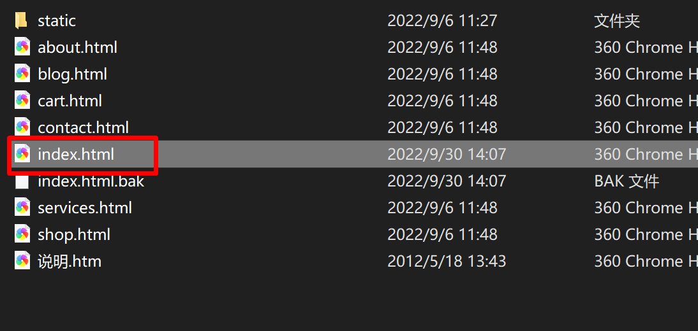

    

- 使用 css 时的界面

  - 

- 没有的时候

  - 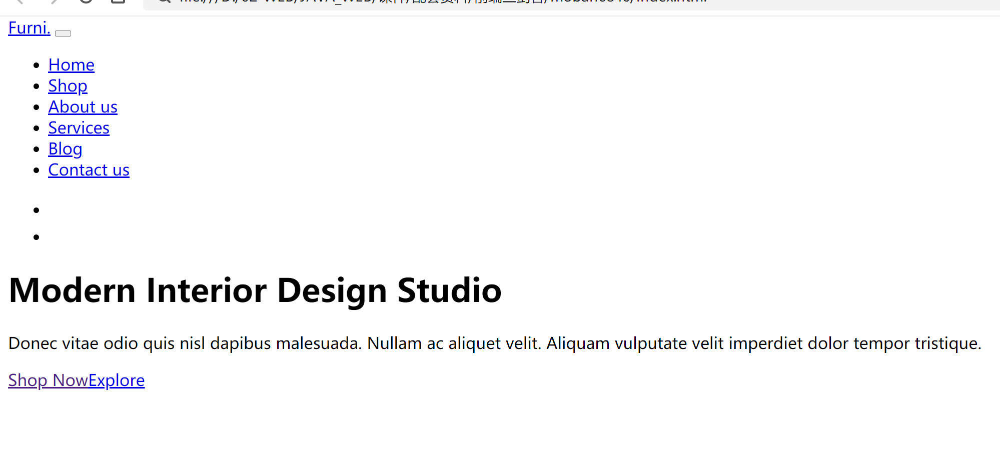

## 3.标签

- HTML 标记标签通常被称为 HTML 标签 (HTML tag)
  - HTML 标签是由*尖括号*包围的关键词，比如 < html>< /html >
  - HTML 标签通常是*成对出现*的，比如 < b >  < / b>
  - 标签的第一个元素是开始标签(开放标签)，有斜线的是结束标签（闭合标签）
- 初尝试需求：
  - 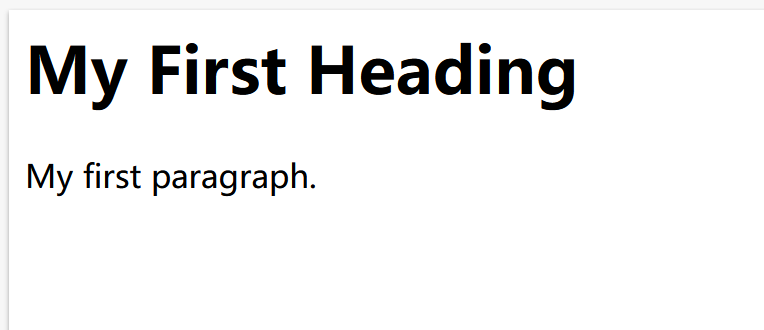
  - 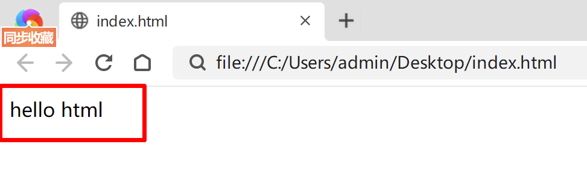
- 总结
  - html 就是用来定义网页的文档
  - < body> < /body> 定义文档身体
  - < title> < /title> 用来定义html 文档的名称

### 3.1基础标签

- 基础标签：就是处理文字相关的标签

  - 标题标签：< h1 > < /h1>
    - h1 代表1级
    - h2 代表2级
  - 水平线：
    - < hr/>
  - 段落标签：
    - < p>< /p>
  - 样式标签（官方建议不要使用）
    - 控制颜色 style="color: red"
    - 对齐方式 align
    - 控制大小
  - 字体基本操作
    - 加粗 < b> < /b>
    - 斜体 < i >< /i>
    - 下划线 < u> < /u> 
  - 换行 < br  >
  - 居中 < center> < /center>

- 图片标签 < img src="路径" >< /img>

- 表格标签 

  - table 定义表格
  - th 表示表头
  - tr 代表行
  - td 代表单元格
  - 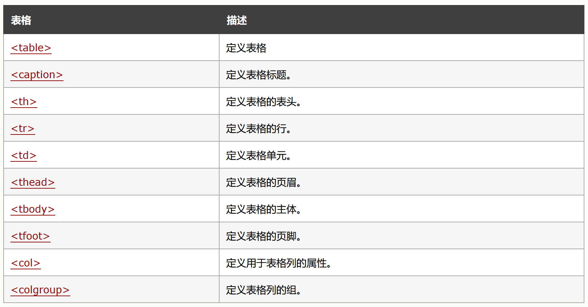

- 列表

  - 无序列表

    ```java
    <ul>
        <li>Coffee</li>
        <li>Milk</li>
    </ul>
    ```

    

  - 有序列表

    ```java
    <ol>
        <li>Coffee</li>
        <li>Milk</li>
    </ol>
    ```

- 布局使用 div

- 媒体

  - 音频 <audio src="1.mp3" controls="controls"></audio>
  - 视频  <video src="mv.ogg" controls="controls"></video>

- a  标签 < a href = "http://www.sycoder.cn"> 管理后台地址</a>

- 表单标签

  - 表单属性

    - action 指定数据提交的路径
    - method  **get post**

  - 输入框

    - type 输入类型

      - text 文本

      - radio 单选

      - checkbox 复选框

      - password 密码

      - 文本域 

        ```java
        <textarea name="message" rows="10" cols="30">
        The cat was playing in the garden.
        </textarea>
        ```

        

    - 输入属性

      - value 默认值
      - readonly 只读
      - disabled 禁用
      - size 控制大小

      

    ```java
     <input type="text" id="lname" name="lname" value="Gates"><br><br>
    ```

  - 提交按钮

    ```java
    <input type="submit" value="登录">  
    ```

  - 下拉列表

    ```java
    <select name="cars">
        <option value="volvo">信用</option>
        <option value="price">价格</option>
        <option value="fiat">销量</option>
    </select>
    ```

  - 按钮

    ```java
    <button type="button" onclick="alert('登录成功')">登录！</button>
    ```

    

# 二、CSS

## 1.CSS 概述

- CSS 是一门语言，用于控制网页表现。
  - *CSS* 指的是层叠样式表* (*C*ascading *S*tyle *S*heets)
  - CSS 描述了*如何在屏幕、纸张或其他媒体上显示 HTML 元素*
  - **CSS *节省了大量工作***。它可以同时控制多张网页的布局

## 2.快速开始

- 定义方式

  ```css
  body {
    background-color: lightblue;
  }
  ```

- 定义在 style 中

  ```css
  <style>
      body{
          background-color:lightblue;
      }
  </style>
  ```

## 3.CSS 语法

- 语法规则

  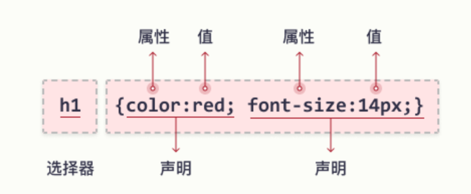

- 例子

  ```css
  p {
    color: red;
    text-align: center;
  }
  ```

  - p 是我们选择器，选择段落
  - 只要是 p 标签都能够生效

## 4.CSS 选择器

- **元素选择器**：元素选择器根据**元素名称**来选择 HTML 元素

  - 例子:页面上的所有 <p> 元素都将居中对齐，并带有红色文本颜色

    ```css
    p {
      text-align: center;
      color: red;
    }
    ```

- **id 选择器**：id 选择器使用 HTML 元素的 id 属性来选择特定元素

  - id 必须是唯一的

  - 要选择具有特定 id 的元素，请写一个井号（＃），后跟该元素的 id

  - **注意：id 不能以数字开头**

  - 例子：这条 CSS 规则将应用于 id="para1" 的 HTML 元素

    ```css
    #para1 {
      text-align: center;
      color: red;
    }
    ```

- **类选择器**：类选择器选择有特定 class 属性的 HTML 元素

  - 如需选择拥有特定 class 的元素，请写一个句点（.）字符，后面跟类名。

  - 例子：所有带有 class="center" 的 HTML 元素将为红色且居中对齐

    ```csss
    .center {
      text-align: center;
      color: red;
    }	
    ```

  - 注意：定只有特定的 HTML 元素会受类的影响(**元素名称.className**)

    ```css
    p.center {
      text-align: center;
      color: red;
    }
    ```

- 通用选择器：通用选择器（*）选择页面上的所有的 HTML 元素。

  - 例子：CSS 规则会影响页面上的每个 HTML 元素

    ```css
    * {
      text-align: center;
      color: blue;
    }
    ```

    

## 5.CSS 导入

- 外部 CSS

  - 前提是定义一个外部样式表

  - 每张 HTML 页面必须在 head 部分的 <link> 元素内包含对外部样式表文件的引用

    ```css
    <link rel="stylesheet" href="my.css">
    ```

- 内部 CSS

  - 如果一张 HTML 页面拥有唯一的样式，那么可以使用内部样式表

  - 内部样式是在 head 部分的 <style> 元素中进行定义

    ```css
    <style>
        body {
          background-color: linen;
        }
    
        h1 {
          color: maroon;
          margin-left: 40px;
        } 
    </style>
    ```

- 行内 CSS

  - 行内样式（也称内联样式）可用于为单个元素应用唯一的样式

  - 如需使用行内样式，请将 style 属性添加到相关元素。style 属性可包含任何 CSS 属性

  - 实例：行内样式在相关元素的 "style" 属性中定义

    ```css
    <h1 style="color:blue;text-align:center;">This is a heading</h1>
    <p style="color:red;">This is a paragraph.</p>
    ```

- 层叠顺序

  - 行内样式（在 HTML 元素中）
  - 外部和内部样式表（在 head 部分）
  - 浏览器默认样式

## 6.CSS 颜色

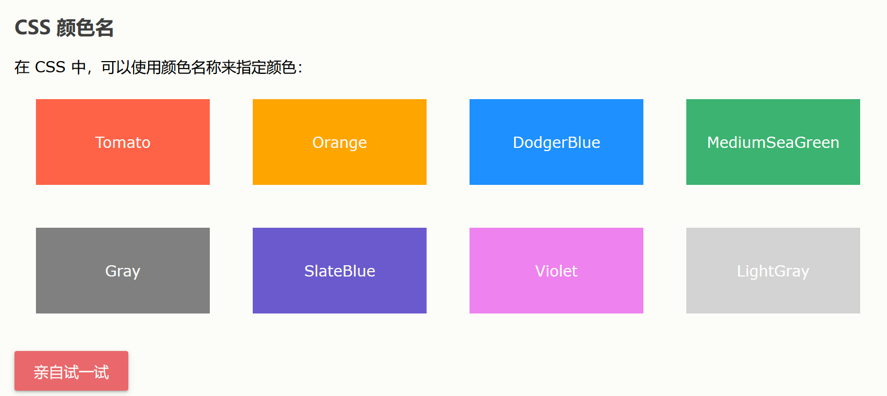


# 三、JavaScript(后端程序员了解就行了)

## 1.概述

- **JavaScript 是属于 HTML 和 Web 的编程语言。**
- **主要是去控制页面动态变化的**

### 1.1演示开灯与关灯案例

- 程序代码

  ```html
  <h1>开关灯程序演示</h1>
  <button onclick="document.getElementById('myImage').src='eg_bulbon.gif'">开灯</button>
  
  <button onclick="document.getElementById('myImage').src='eg_bulboff.gif'">关灯</button>
  ```

  

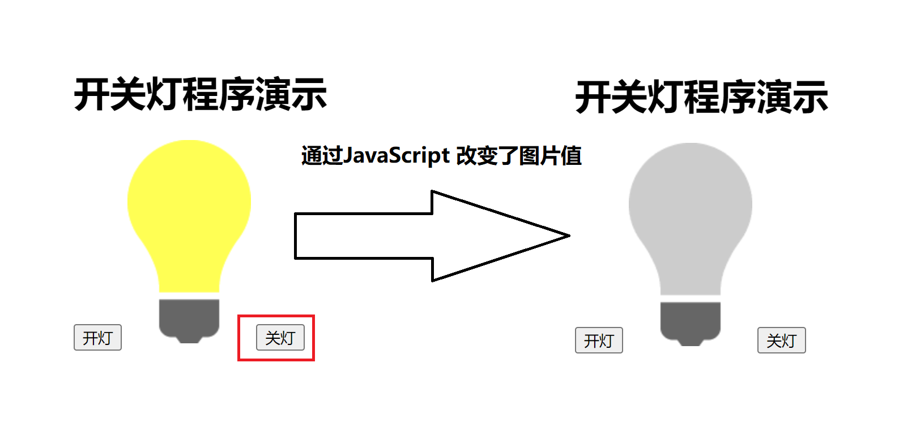

## 2.引入

- JavaScript 必须位于**<script> </script>** 标签之内
- 分类
  - 内部脚本
  - 外部脚本

### 2.1内部脚本

#### 2.1.1放入 head 里面

```html
<head>
    <script>
        function myFunction() {
            document.getElementById("demo").innerHTML = "段落被更改。";
        }
    </script>
</head>
```

#### 2.1.2放入 body 里面

```html
<body>
    <h1>js 在 body 中</h1>
    <p id="demo">没有修改段落前的值</p>
    <button onclick="myFunction()">修改</button>
    <script>
        function myFunction() {
            document.getElementById("demo").innerHTML="我把段落修改了";
        }
    </script>
</body>
```

- 注意：把脚本置于 `<body>` 元素的底部，可改善显示速度，因为脚本编译会拖慢显示

### 2.2外部脚本

- 把所有的脚本文件放到外部文件里面去，在需要使用的地方引用
- 注意：外部文件的扩展名是 js 结尾
- 在需要使用地方通过 < script src="myScript.js"></ script> 引入
- 外部脚本不能包含 `<script>` 标签。
- 外部脚本优点：
  - 能够做到分离解耦，分离了 HTML 和代码
  - 使 HTML 和 JavaScript 更易于阅读和维护
  - 已缓存的 JavaScript 文件可加速页面加载
- 如需向一张页面添加多个脚本文件 - 请使用多个 script 标签

```html
<body>
    <h1>这里是修改操作</h1>

    <h2 id="id">待修改的标题</h2>
    <p id="p">待修改的段落</p>
    <button onclick="updateTitle()">修改标题</button>
    <button onclick="updateP()">修改段落</button>
</body>
    <script src="my.js"></script>
```

## 3.基本使用

#### 1.使用js 输出

- 分类

  - 使用 `window.alert()` 写入警告框
  - 使用 `document.write()` 写入 HTML 输出
  - 使用 `innerHTML` 写入 HTML 元素
  - 使用 `console.log()` 写入浏览器控制台

- 使用 innerHTML

  ```html
  <body>
      <h1>使用innerHtml 输出</h1>
      <p id="p">这是段落的内容</p>
      <button onclick="f()">修改段落值</button>
      <script>
          function f() {
              document.getElementById("p").innerHTML="修改段落的值";
          }
      </script>
  </body>
  ```

- 使用 document.write()

  - 注意：使用之后会删除所有的 html
  - 该方法测试的时候使用就行

  ```html
  <body>
      <h1>使用writer 输出</h1>
      <script>
          document.write("我是大帅哥，我爱学java")
      </script>
      <p id="p">这是段落的内容</p>
  </body>
  ```

- 使用 window.alert()

  ```html
  <body>
          <h1>alert 输出</h1>
          <script>
              window.alert("这里是提示信息")
          </script>
          <p id="p">这是段落的内容</p>
      </body>
  ```

- 使用 console.log()

  - 先按 F12 代开 console

  ```html
  <script>
          console.log("测试使用F12的console 控制输出");
      </script>
  ```

#### 2.js 语句

- 语句的构成：值，运算符，表达式，关键词，注释

- 使用分号结尾和java一样（建议大家加上；养成良好的习惯）

- js 的关键字

  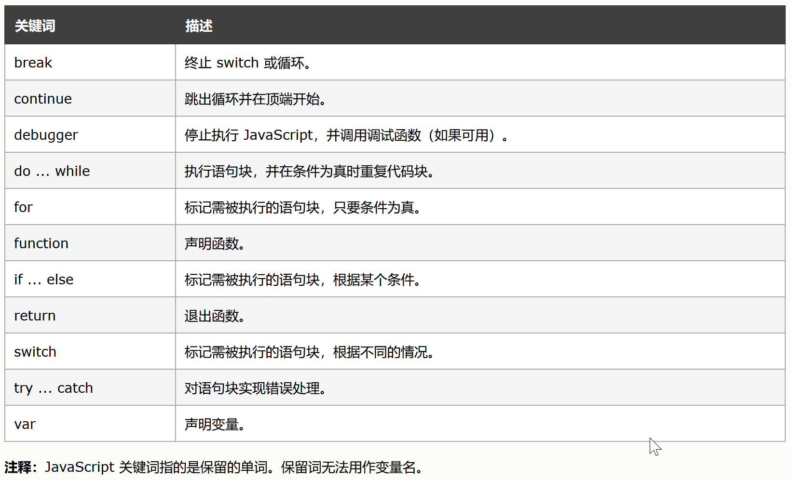

#### 3.js 语法

- 变量（和java 一样）**使用 var 修饰**
- 运算符（和java一样）
- 字面量
- 字符串
- js 标识符
  - 首字母必须使用字母、下划线、或者 $
  - 数值不可以作为首字符
  - 使用下划线或者**驼峰命名**

#### 4.js 注释

- 单行注释 //
- 多行注释  ctrl +shift +/


#### 5.let 和 var关键字

- **`let`**：`let` 是在 ES6（ECMAScript 2015）中引入的，用于声明块级作用域（block-scoped）变量。块级作用域是指在一对花括号 `{}` 内部定义的变量只在该花括号内部可见。因此，使用 `let` 声明的变量在块外部是不可访问的。

- **`var`**：`var` 声明的变量具有函数作用域（function-scoped）或全局作用域（global-scoped）。这意味着在函数内部声明的 `var` 变量在整个函数体内都是有效的，而在函数外部声明的 `var` 变量则成为全局变量，在整个程序中都可以访问。

  

#### 6.const 关键字

- 类似于java 的final

#### 7.运算符

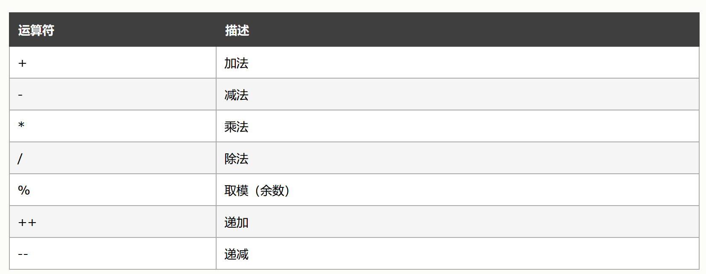

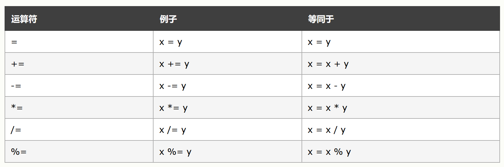

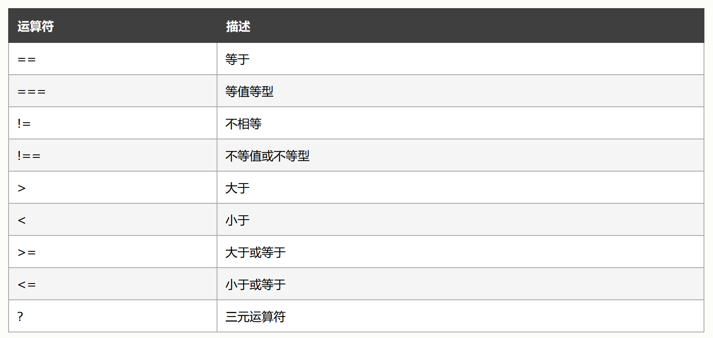

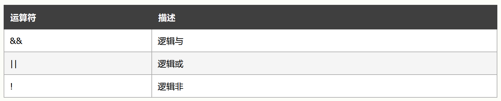

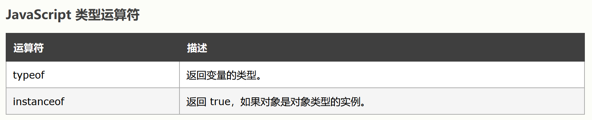

#### 8.数据类型

- 数值

- 字符串值

- 数组

- 对象

- 注意：空值和 undifiend 不是一回事

  1. null
     - `null`是JavaScript的一个关键字，表示一个空值或不存在的值。
     - 它通常用于初始化变量，表示尚未给变量赋值或需要清空变量的引用。
     - `null`也被视为`Object`的一个特殊值，如果一个`Object`为`null`，则表示这个对象不是有效对象。
  2. undefined
     - `undefined`不是JavaScript的关键字，而是全局对象（在浏览器中是`window`对象）的一个属性。
     - 它表示一个未定义的值，当声明一个变量但没有为其赋值时，它的值就是`undefined`。
     - `undefined`是JavaScript的原始数据类型之一，也是一个原始值数据。

- **== 和 === 的区别**

  #### `==`（宽松相等）

  - **类型转换**：`==` 运算符在比较之前会进行类型转换，尝试将两边的值转换为相同的类型，然后再进行比较

  - ```javascript
    console.log(5 == '5'); // true，因为字符串 '5' 被转换成了数字 5  
    console.log(null == undefined); // true，因为 null 和 undefined 在宽松相等比较中被视为相等  
    console.log(0 == ''); // true，因为空字符串被转换成了数字 0  
    console.log(false == 0); // true，因为 false 被转换成了数字 0
    ```

  #### `===`（严格相等）

  - **不进行类型转换**：`===` 运算符在比较之前不会进行类型转换，直接比较两边的值及其类型是否完全相同。

  - ```javascript
    console.log(5 === '5'); // false，因为 5 是数字，而 '5' 是字符串，类型不同  
    console.log(null === undefined); // false，因为 null 和 undefined 是不同的类型  
    console.log(0 === ''); // false，因为 0 是数字，而 '' 是字符串，类型不同  
    console.log(false === 0); // false，因为 false 是布尔值，而 0 是数字，类型不同
    ```

    

#### 9.函数

- 语法

  - 使用 function 关键字定义
  - 其后是*函数名*和括号 (参数 1, 参数 2, ...)
  - 可以有返回值，但是不用定义返回值类型,使用 return 

- 代码

  ```js
  function name(参数 1, 参数 2, 参数 3) {
      要执行的代码
  }
  ```

#### 10.条件控制

- if 语法

  ```java
  if (条件) {
      如果条件为 true 时执行的代码
  } 
  ```

- if else 语法

  ```java
  if (条件) {
      条件为 true 时执行的代码块
  } else { 
      条件为 false 时执行的代码块
  }
  ```

  

- if else if语法

  ```html
  if (条件 1) {
      条件 1 为 true 时执行的代码块
  } else if (条件 2) {
      条件 1 为 false 而条件 2 为 true 时执行的代码块
   } else {
      条件 1 和条件 2 同时为 false 时执行的代码块
  }
  ```

- switch

  ```java
  switch(表达式) {
       case n:
          代码块
          break;
       case n:
          代码块
          break;
       default:
          默认代码块
  } 
  ```

#### 11.循环

- for

  ```java
  for (语句 1; 语句 2; 语句 3) {
       要执行的代码块
  }
  ```

- while

  ```java
  while (条件) {
      要执行的代码块
  }
  ```

- do while

  ```java
  do {
      要执行的代码块
  }
  
  while (条件);
  ```

### 4.常用对象

​	对象也是一个变量，但对象可以包含多个值（多个变量），每个值以 **name:value** 对呈现。

````js
var car = {name:"Fiat", model:500, color:"white"};
````


#### 1.字符串

- 字符串长度使用 length 属性
- == 和 === 的区别


#### 2.数组

- 和java一样

- 添加

  ```java
  向数组添加新元素的最佳方法是使用 push() 方法
  ```


#### 3.自定义方法

```js
 var person = {firstName:"Bill", lastName:"Gates", age:62, eyeColor:"blue",f:function (x) {
                console.log(x);
            }};
        console.log(person.firstName);
        person.f(100000);
```

### 5.HTML DOM

- DOM 是文档对象模型**HTML DOM 是关于如何获取、更改、添加或删除 HTML 元素的标准**

  ```html
  <!DOCTYPE html>
  <html lang="en">
  <head>
      <meta charset="UTF-8">
      <title>jsDom</title>
  </head>
  <body>
      <h1>标题</h1>
      <p>段落</p>
  </body>
  </html>
  ```

  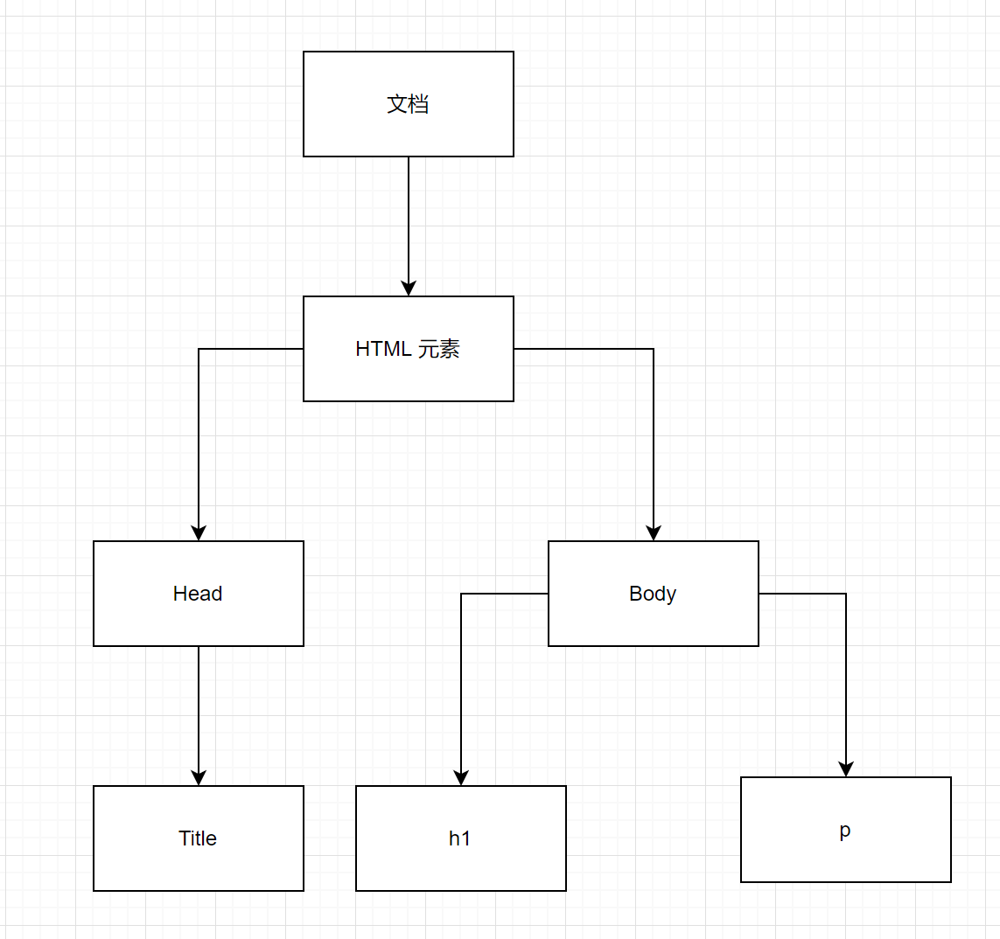

  - dom 规范
    - Document 整个文本对象
    - Element 元素对象
    - Text 文本对象
  - dom 方法
    - getElementById 方法
    - innerHTML 属性
  - 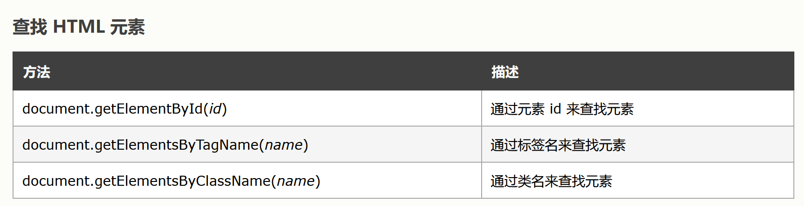

### 6.BOM

- **浏览器对象模型（Browser Object Model (BOM)）允许 JavaScript 与浏览器对话**

- 弹框方法

  - ```js
    window.prompt("sometext","defaultText");
    ```

  - ```js
    window.confirm("sometext");
    ```

  - ```js
    window.alert("sometext");
    ```
    
    

### 7.事件

- 常用事件
  - onchange 改变的时候做出操作
  - onClick 点击的时候
  - onmouseover 
  - onmouseout 
