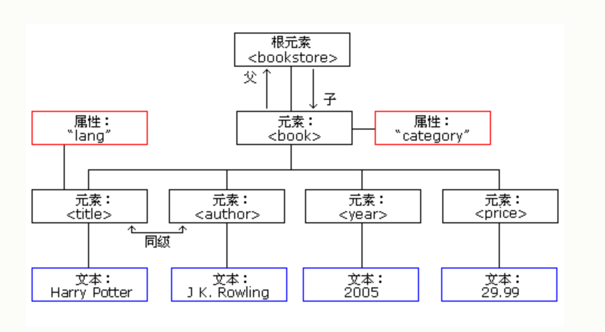
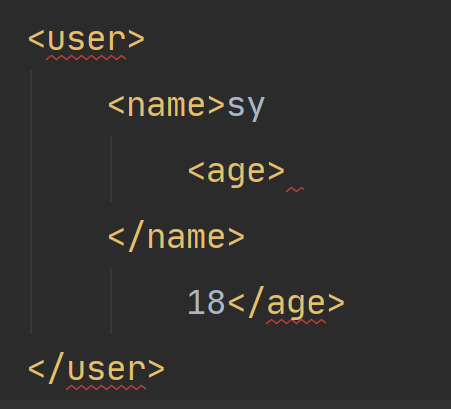
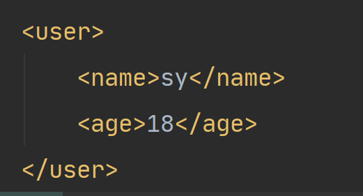
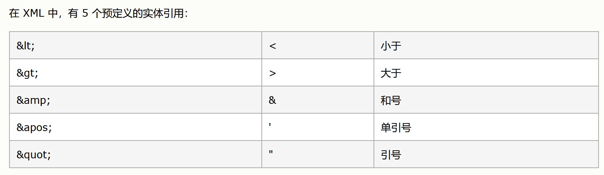
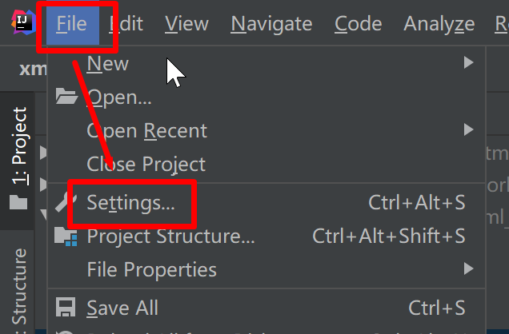
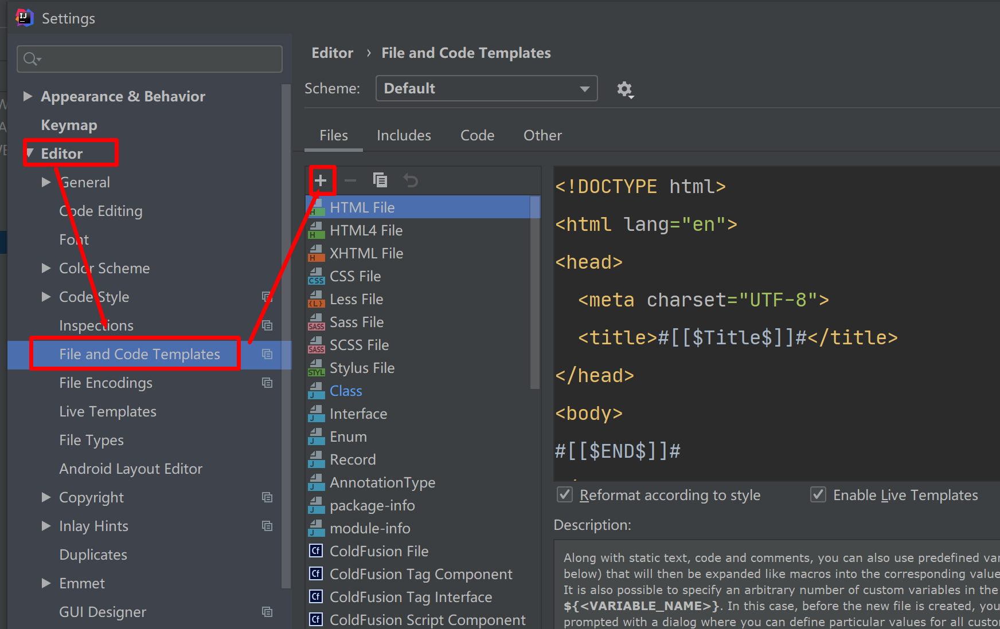
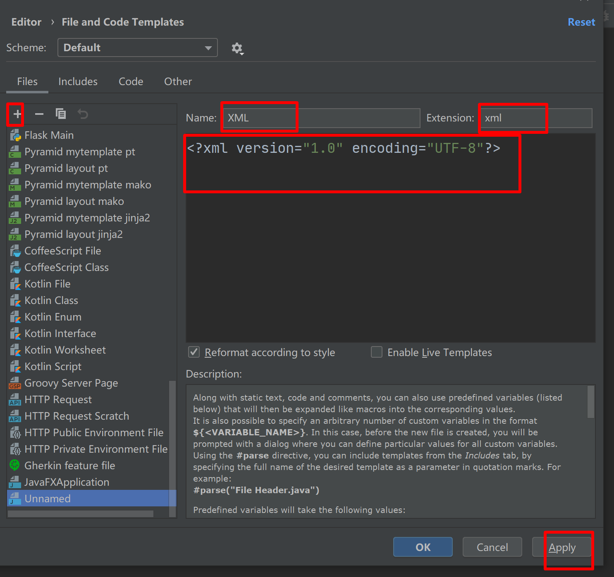
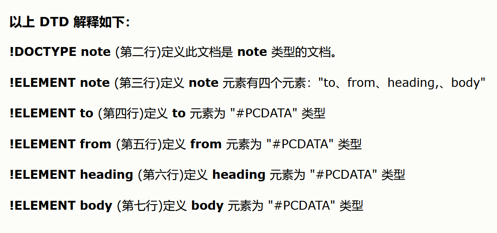

------

**讲师：上云**

**网址：www.sycoder.cn**

------


# 一、XML

## 1.XML 概述

- 学习前要求：学习过 HTML 和 JS

- **定义：XML 指可扩展标记语言（*EX*tensible *M*arkup *L*anguage）**，是数据的一种表示格式，可以用来表示数据结构，常用于做数据的传输与存储。

  - XML 是一种***标记语言***，很类似 HTML（由标签构成的）
  - XML 的设计宗旨是***传输数据***，而非显示数据（html）
  - XML 标签没有被预定义，标签**可以自定义**

- 注意：XML 和 HTML 不同：**HTML 旨在显示信息，而 XML 旨在传输信息。**

- xml 文件的创建

  ```xml
  <data>
      <name>
          上云
      </name>
      <age>
          18
      </age>
  </data>
  ```

- **xml 特点**

  - xml 一般是纯文本的
  - 标签必须成对出现

## 2.XML语法

```xml
<?xml version="1.0" encoding="UTF-8"?>
<note>
    <to>George</to>
    <from>John</from>
    <heading>Reminder</heading>
    <body>Don't forget the meeting!</body>
</note>
```

- 语法规则

  - 第一行是xml 的声明

    - 包括了xml的版本号
    - xml文档的字符编码

  - 第二行描述这是一个便签（根元素）

    ```xml
    <note>
    ```

  - 中间有四个元素

    ```xml
    <to>George</to>
    <from>John</from>
    <heading>Reminder</heading>
    <body>Don't forget the meeting!</body>
    ```

  - 最后一行代表文档的结尾

    ```xml
    </note>
    ```

- xml 注释

  - <!-  注释的内容 -> ctrl + /

### 1.XML树结构

```xml
<bookstore>
<book category="COOKING">
  <title lang="en">Everyday Italian</title> 
  <author>Giada De Laurentiis</author> 
  <year>2005</year> 
  <price>30.00</price> 
</book>
<book category="CHILDREN">
  <title lang="en">Harry Potter</title> 
  <author>J K. Rowling</author> 
  <year>2005</year> 
  <price>29.99</price> 
</book>
<book category="WEB">
  <title lang="en">Learning XML</title> 
  <author>Erik T. Ray</author> 
  <year>2003</year> 
  <price>39.95</price> 
</book>
</bookstore>
```



## 3.XML组成部分

- 文档的约束

- 标签构成元素

  - 指的是从（且包括）开始标签直到（且包括）结束标签的部分。

  - **元素里面还可以嵌套元素**

  - ```xml
    <book category="CHILDREN">
      <title>Harry Potter</title> 
      <author>J K. Rowling</author> 
      <year>2005</year> 
      <price>29.99</price> 
    </book>
    ```

- 属性

  - 属性就是在标签里面添加的

    ```xml
    <person sex="female">
      <firstname>Anna</firstname>
      <lastname>Smith</lastname>
    </person> 
    ```

  - 官方的建议:**使用元素替代属性**

    ```xml
    <person>
      <sex>man</sex>
      <firstname>Anna</firstname>
      <lastname>Smith</lastname>
    </person> 
    ```

  - 避免XML属性

    - 属性无法包含多重的值（元素可以）
    - 属性无法描述树结构（元素可以）
    - 属性不易扩展（为未来的变化）
    - 属性难以阅读和维护

- 文本

  - 元素里面的值

    ```xml
    <firstname>Anna</firstname>
    ```

    

## 4.XML的命名规则

- **命名规则**

  - 名称可以含字母、数字以及其他的字符

  - 名称不能以数字或者标点符号开始

    ```xml
    <01aaa></01aaa>
    ```

    

  - 名称不能以字符 “xml”（或者 XML、Xml）开始(验证了是可以的，但是不建议使用，担心后面解析xml会出现问题)

  - 名称不能包含空格

    

- **良好的命名习惯**

  - 见名知意
  - 名称应当比较简短，比如：<book_title>，而不是：<the_title_of_the_book>
  - 避免使用 - . :
  - 尽量和数据库命名一致

- XML 标签是对大小写敏感

  ```xml
  <name></naMe>
  ```

  

- 使用XML需要正确嵌套

  

  

## 5.XML 的引用



- 注意：特别是再使用Mybatis 的时候，一定记得大于小于之间使用引用

## 6.XML 约束

### 1.DTD约束

- **使用模板生成 xml 文件**

  

  

  

  

- 编写 DTD 约束文件，后缀是以 .dtd 结尾

  - 注意：不要去使用相对路径，我们使用绝对路径才能导入

- 导入语法

  ```xml
  <!DOCTYPE note SYSTEM "D:\02-WEB\JAVA_WEB\homework\html_project\xml\xml约束\note.dtd">
  ```

  ```xml
  <?xml version="1.0"?>
  <!DOCTYPE note [
    <!ELEMENT note (to,from,heading,body)>
    <!ELEMENT to      (#PCDATA)>
    <!ELEMENT from    (#PCDATA)>
    <!ELEMENT heading (#PCDATA)>
    <!ELEMENT body    (#PCDATA)>
  ]>
  ```

  

  

### 2.Schema 约束

- 定义：XML Schema 的作用是定义 XML 文档的合法构建模块，类似 DTD
- 约束能力：
  - 定义可出现在文档中的元素
  - 定义可出现在文档中的属性
  - 定义哪个元素是子元素
  - 定义子元素的次序
  - 定义子元素的数目
  - 定义元素是否为空，或者是否可包含文本
  - 定义元素和属性的数据类型
  - 定义元素和属性的默认值以及固定值
- **本身就是个xml 文件**,只不过格式更加严谨，能够去约束具体的字段值类型
- 后缀是.xsd
- 以后学习 mybatis 的时候，会有很多的约束，**直接用就行了不用自己去定义**


## 7.XML的解析

- 方式
  - **DOM**
    - 将标记语言的文字全部一次性读进内存里面，在内存中形成一棵树
    - 优点：操作方便，可以增删改查
    - 缺点：占内存
  - SAX
    - 逐行读取，基于事件驱动的
    - 优点：不占内存
    - 缺点：只能读，不能够增删改
- 常见的解析器
  - JAXP：sum 公司提供的解析器。支持 dom sax
  - **DOM4J**：比较优秀
  - jsoup：HTML 解析

- 使用
  - 挑选 dom4j 的版本 2.1.3以上

## 8.xml 检索

- 使用 XPath

- 先导入包

  ```java
  <dependency>
      <groupId>jaxen</groupId>
      <artifactId>jaxen</artifactId>
      <version>1.2.0</version>
  </dependency>
  ```

- 方便检索操作便于查找

# 二、JSON

## 1.js JSON 

- js 的 JSON ：**JavaScript Object Notation（JavaScript 对象标记法）**

  ```js
  { 	
      name:"Bill Gates",  
      age:62, 
      city:"Seattle"
  }
  ```

- JAVA JSON 格式

  ```json
  { 	
      "name":"Bill Gates",  
      "age":62, 
      "city":"Seattle"
  }
  ```

- 应用场景（**数据载体**）

  - 传参
  - 接收参数

## 2.JSON 语法规则

- 语法规则
  - 数据名称/值
  - 数据由逗号分隔
  - 花括号容纳对象
  - 方括号容纳数组

- js 对象和 JSON 的对比

  - json 

  - json 值类型

    - 字符串
    - 数字
    - 对象（JSON 对象）
    - 数组
    - 布尔
    - null

    ```json
    { "name":"Bill Gates" }
    ```

  - js 对象

    ```js
    { name:"Bill Gates" }
    ```

  ## 3.js 中 json 使用

  ```html
  <!DOCTYPE html>
  <html lang="en">
  <head>
      <meta charset="UTF-8">
      <title>JSON 操作</title>
  </head>
  <body>
  <script>
      var json  = {"name":"sy","age":18};
      window.alert("这里是我们的弹框")
      console.log(json);
  
  </script>
  </body>
  </html>
  ```

  - js 将 json 字符串转换成 js 对象

    ```js
    let ret = JSON.parse(json);
    ```

    

  - 将 js 对象转换成 json 字符串

    ```js
    let strJson = JSON.stringify(ret);
    ```

    

## 3.JSON 和 java 对象的相互转换

- 背景
  - 可以通过json 实现前后端的交互
  - json 的数据格式较小，减少资源消耗
- 后端需掌握
  - 请求数据：json 字符串提交给后端处理
  - 响应数据：java 对象转换成 json 字符串

### 3.1 fastjson的使用

- 导包

  ```java
  <dependency>
      <groupId>com.alibaba</groupId>
      <artifactId>fastjson</artifactId>
      <version>1.2.79</version>
  </dependency>
  ```

- java 对象转 json

  ```java
  JSON.toJSONString(obj);
  ```

- json 转 java 对象

  ```java
  JSON.parseObject(jsonStr,Person.class)
  ```

### 3.2代码实操

```java
Person person = new Person();
person.setUsername("sy");
person.setPassword("123");

//        JSON.toJSONString();
//        JSON.toJSONString(person);
String s = JSON.toJSONString(person);
System.out.println(s);
String jsonString = "{ \"username\":\"zs\", \"password\": \"sycoder\" }";
Person person1 = JSON.parseObject(jsonString, Person.class);

System.out.println(person1.getUsername());
```

