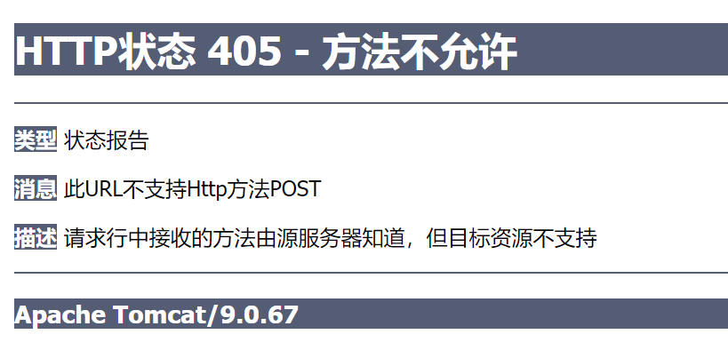
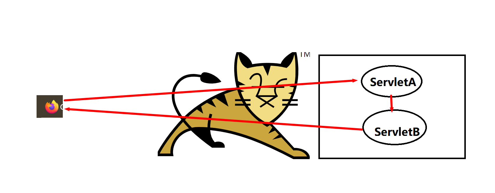
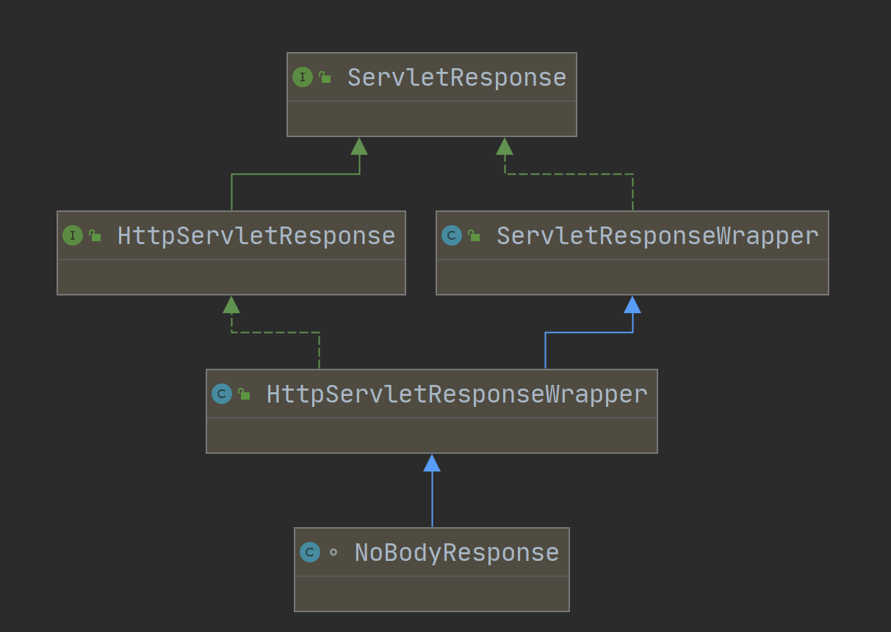
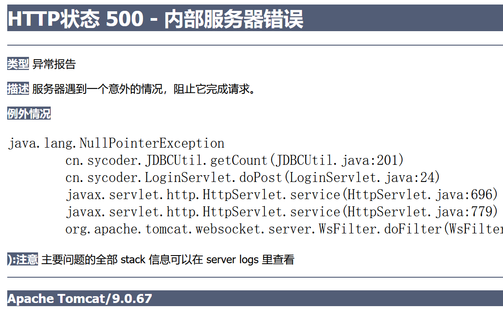

# 一、Request 与 Response

## 1.概述

- **Request**:获取请求数据的

  - 请求头，请求行，请求体
  - tomcat 会把请求数据解析，并且存储 request 对象中，然后我们直接从 servlet 对象中取就可以用了

- **Response:**响应数据的

  - 响应头，响应行，响应体
  - 业务的封装数据设置到响应数据包中来
  - 封装数据进 response 对象中，tomcat 会把封装数据解析成特定格式返回给浏览器

  

## 2.模拟登录小案例

- 创建webapp 后端服务

- 写一个 loginservlet 类，重写 doPost 方法（405 就是我们的请求类型不匹配）

  

  ```java
  protected void doPost(HttpServletRequest req, HttpServletResponse resp) throws ServletException, IOException {
          /**
           * 如果传过来的参数是 sy 123456 证明登录成功，否则就是失败
           */
          String ret = "";
          String username = req.getParameter("username");
          String password = req.getParameter("password");
          //假如这是从数据库查询出来的
          if("sy".equals(username) && "123456".equals(password)){
              ret = "<h1>"+"登录成功"+"</h1>";
          }else{
              ret = "<h1 color='red'>"+"请重新登录，账号或者密码不正确"+"</h1>";
          }
  
          //响应回前端
          resp.setHeader("content-type","text/html;charset=utf-8");
          resp.getWriter().write(ret);
      }
  ```

- 通过 Request 和 Response 可以实现浏览器与服务器的交互

# 二、Request

- 概述：获取请求数据的

## 1.Request 继承体系


- ServletRequest 规范接口
- HttpServletRequest  封装 http 协议内容
- HttpServletRequestWrapper 这个是提供具体的实现

## 2.Request 获取请求数据

- 请求分为**请求头、请求行，请求体**
- https://docs.oracle.com/javaee/7/api/toc.htm

### 2.1获取请求头数据

```java
String getHeader(String name)
```

```java
 @Override
    protected void doGet(HttpServletRequest req, HttpServletResponse resp) throws ServletException, IOException {/**
         /* *
         *  获取请求头
         */
        String accept = req.getHeader("Accept");
        System.out.println(accept);
    }
```


### 2.2获取请求行数据

- 获取请求方法

  ```java
  String 	getMethod()
  ```

- 获取请求路径（项目的访问路径）/x

  ```java
  String 	getContextPath()
  ```

- 获取URL（统一资源定位符）http://localhost:8082/x/request

  ```java
  StringBuffer 	getRequestURL()
  ```

- 获取URI（统一资源标识符） /x/request
  ```java
  String 	getRequestURI()
  ```

- 获取get 的请求参数http://localhost:8082/x/request?username=sy (username=sy )

  ```java
  String 	getQueryString()
  ```

- 代码

  ```java
  String method = req.getMethod();
  System.out.println(method);
  
  String contextPath = req.getContextPath();
  System.out.println(contextPath);
  
  StringBuffer requestURL = req.getRequestURL();
  System.out.println(requestURL);
  
  String requestURI = req.getRequestURI();
  System.out.println(requestURI);
  
  String queryString = req.getQueryString();
  System.out.println(queryString);
  ```


### 2.3获取请求体数据

- 注意：需要使用Post put等

- 获取字符输入流

  ```java
  BufferedReader getReader()throws IOException
  ```

- 代码

  ```java
  @Override
      protected void doPost(HttpServletRequest req, HttpServletResponse resp) throws ServletException, IOException {
          //请求体
          System.out.println("==================请求体==================");
          BufferedReader reader = req.getReader();
          String s = reader.readLine();
          System.out.println(s);
      }
  ```

- 获取字节输入流

  ```java
  ServletInputStream getInputStream() throws IOException
  ```

- 代码

  ```java
  @Override
      protected void doPost(HttpServletRequest req, HttpServletResponse resp) throws ServletException, IOException {
          //请求体
  //        System.out.println("==================请求体==================");
  //        BufferedReader reader = req.getReader();
  //        String s = reader.readLine();
  //        System.out.println(s);
          ServletInputStream inputStream = req.getInputStream();
          byte[] buffer = new byte[1024];
          int len = 0;
          while ((len = inputStream.read(buffer)) != -1 ){
              System.out.println(new String(buffer, 0, len));
          }
          inputStream.close();
      }
  ```

### 2.4获取请求参数

- 如果是Get请求，那么请求参数就在请求行中

- 如果是Post 请求，请求参数一般就在请求体中

- Get 请求参数获取

  ```java
  String	getQueryString()
  ```

- Post 请求获取参数

  ```java
  BufferedReader getReader()throws IOException
  ServletInputStream getInputStream() throws IOException
  ```

  

  

  - 获取所有参数的 map 集合

    ```java
    Map<String,String[]> getParameterMap()
    ```

  - 获取单个参数

    ```java
    String getParameter(String name)
    ```

    

### 2.5请求参数乱码问题

- 注意，如果你还用的是 tomcat7 这种服务器，就会出现Get 请求乱码问题

  

  

- 解决办法：获取之前修改一下字符编码

  ```java
  req.setCharacterEncoding("UTF-8");
  ```

- tomcat 默认编码 iso-8859-1

- 浏览器以 utf-8 编码，所以解码需要以 utf-8解码

## 3.请求转发

- **请求转发（forward）：在服务器内部做资源跳转**



- 请求转发的实现方式

  ```java
  RequestDispatcher getRequestDispatcher(String path)
  ```

  ```java
  void forward(ServletRequest request,ServletResponse response)
        throws ServletException,IOException
  ```

- 转发实战

  ```java
  @WebServlet("/hello")
  public class RequestHello extends HttpServlet {
  
      @Override
      protected void doGet(HttpServletRequest req, HttpServletResponse resp) throws ServletException, IOException {
          System.out.println("hello begin====================");
          req.getRequestDispatcher("/word").forward(req,resp);
          System.out.println("hello end====================");
  
          resp.getWriter().write("<h1 color='red'>hello</h1>");
      }
  }
  ```

  ```java
  @WebServlet("/word")
  public class RequestWord extends HttpServlet {
      @Override
      protected void doGet(HttpServletRequest req, HttpServletResponse resp) throws ServletException, IOException {
          System.out.println(" word begin===================");
          resp.getWriter().write("<h1 color='red'>word</h1>");
      }
  }
  ```

- 数据共享问题：使用 request

  ```java
  void setAttribute(String name, Object o)
  
  Object getAttribute(String name)
      
  void removeAttribute(String name)
  ```

- **请求转发特点**

  - 浏览器地址不会改变
  - 只能内部服务之间转发
  - 只发起一次请求

# 三、Response

- **概述：响应数据的**

### 1.Response 继承体系



- ServletResponse 规范接口
- HttpServletResponse  封装 http 协议内容
- HttpServletResponseWrapper 这个是提供具体的实现

### 2.Response 响应数据

- **分类：响应头，响应行，响应体**

#### 2.1设置响应头数据

```java
void 	addHeader(String name, String value)
```

```java
@WebServlet("/resp")
public class RespServlet extends HttpServlet {
    @Override
    protected void doGet(HttpServletRequest req, HttpServletResponse resp) throws ServletException, IOException {
        resp.addHeader("userdiv","12321312");
    }
}
```


#### 2.2设置响应行数据

```java
void 	setStatus(int sc)
```

```java
@WebServlet("/resp")
public class RespServlet extends HttpServlet {
    @Override
    protected void doGet(HttpServletRequest req, HttpServletResponse resp) throws ServletException, IOException {
        resp.addHeader("userdiv","12321312");

        resp.setStatus(500);
    }
}
```


#### 2.3设置响应体数据

```java
ServletOutputStream getOutputStream()
    
PrintWriter getWriter()
```

```java
@WebServlet("/resp")
public class RespServlet extends HttpServlet {
    @Override
    protected void doGet(HttpServletRequest req, HttpServletResponse resp) throws ServletException, IOException {
        //设置响应头
        resp.addHeader("userdiv","12321312");
        //设置响应行
//        resp.setStatus(500);
        //设置响应体
        resp.getOutputStream().write(12123);
    }
}
```

#### 2.4需求：下载一张服务器上的 tomcat 图片

- 从服务器上读取图片资源

  ```java
  File file = new File("D:\\02-WEB\\JAVA_WEB\\homework\\ReqResp-web\\src\\main\\resources\\tomcat.png");
          FileInputStream in = new FileInputStream(file);
  ```

- 循环写出

  ```java
  ServletOutputStream out = resp.getOutputStream();
          byte[] buffer = new byte[1024];
          int len = 0;
  
          while ((len = in.read(buffer)) != -1){
              out.write(buffer,0,len);
          }
  ```

### 3.重定向

- **概述：资源能够实现跳转访问**

- 

  ```java
  void 	sendRedirect(String location)
  ```

  - **跨域以及不跨域**

    ```java
    resp.sendRedirect("http://www.sycoder.cn");    
    ```

    ```java
    resp.sendRedirect("/login");
    ```

- **重定向的特点**

  - 浏览器地址栏发生变化了
  - 可以重定向任何位置
  - 两次请求

### 4.重定向和请求转发的区别

| 重定向             | 请求转发             |
| ------------------ | -------------------- |
| 浏览器地址变化     | 不变                 |
| 可以重定向任何位置 | 只能是当前服务器内部 |
| 两次请求           | 一次请求             |
| 不可以资源共享     | 资源可以共享         |

# 四、模拟实战登录与注册


- 遇到的问题

  

  - **漏到 mysql 驱动包**
  - **jdbc 工具类出现问题**
  - **SQL 出现错误**
