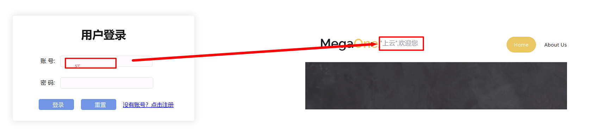
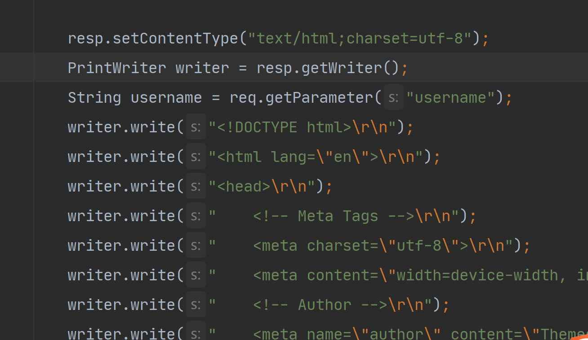
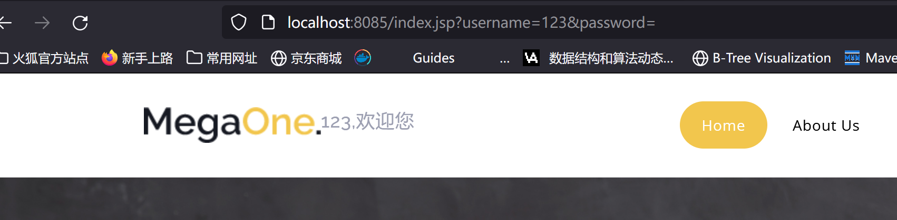
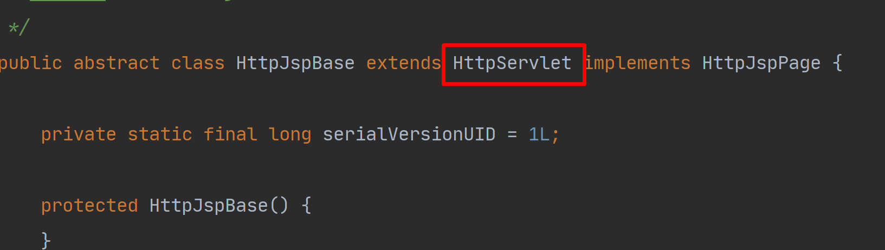
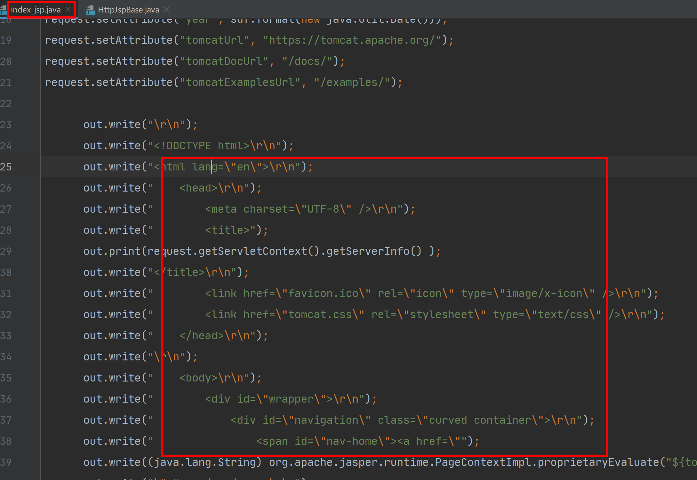
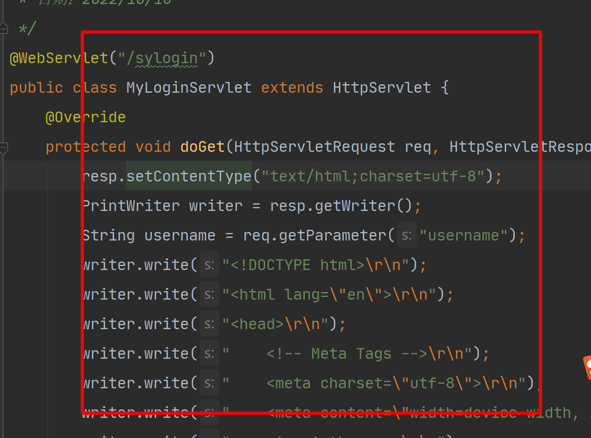
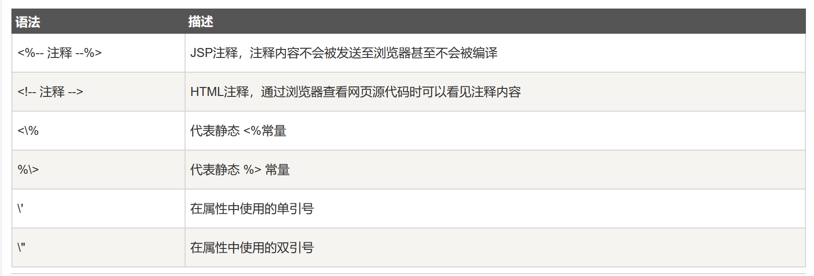
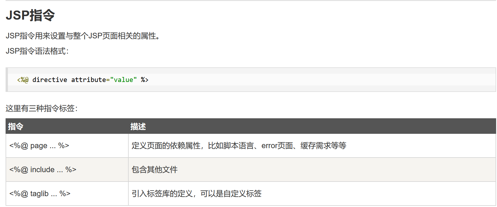
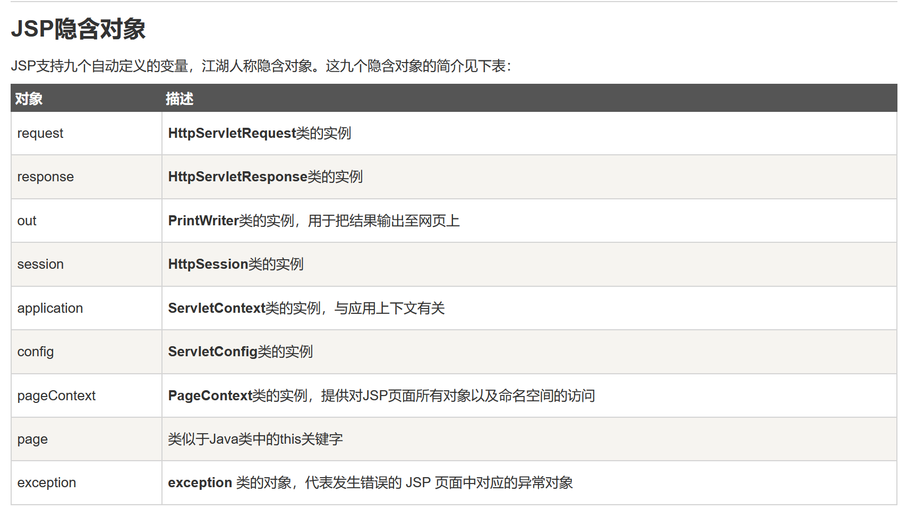
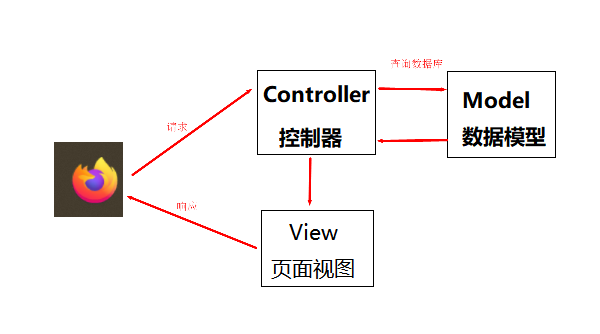

------

**讲师：上云**

**网址：www.sycoder.cn**

------

# 一、jsp

## 1.jsp 概述

- jsp 概述：JSP全称Java Server Pages，是一种动态网页开发技术。**jsp = 静态页面 + java 动态展示**

- html 中添加 jsp

  ```html
  <html>
  <body>
  <h2>Hello World!</h2>
  </body>
  <h1>欢迎来到 jsp</h1>
      <%
          System.out.println("======== jsp");
      %>
  </html>
  ```

- 思考？

  - 与纯 Servlet 相比：JSP可以很方便的编写或者修改HTML网页而不用去面对大量的println语句
  - 与JavaScript相比：虽然JavaScript可以在客户端动态生成HTML，但是很难与服务器交互，因此不能提供复杂的服务，比如访问数据库和图像处理等等
  - 与静态HTML相比：静态HTML不包含动态信息

  

  - 使用servlet 实现

    

    

    

  

  

- 使用 jsp 实现

  

## 2.简单使用

- 乱码问题

  ```jsp
  <%@ page contentType="text/html;charset=UTF-8" language="java" %>
  ```

## 3.jsp 原理

- JSP是一种Java servlet，主要用于实现Java web应用程序的用户界面部分。网页开发者们通过结合HTML代码、XHTML代码、XML元素以及嵌入JSP操作和命令来编写JS

- 寻找jsp 生成 servlet 代码路径

  ```java
  apache-tomcat-9.0.67\work\Catalina\localhost\ROOT\org\apache\jsp
  ```

  

- 下载tomcat 的源码才能找到依赖关系

  

  

  

- 通过jsp 我们可以少写很多 html 响应出去的代码

  

  

  

## 4.jsp 语法

### 1.脚本程序

- 脚本内容直接放到_jspService

  ```
  <% 代码片段 %>
  ```

  ```java
  <jsp:scriptlet>
     代码片段
  </jsp:scriptlet>
  ```

  ```java
  <%
      System.out.println("======== jsp");
  %>
  ```

- 放到 servlet 类里面

  ```
  <%! declaration; [ declaration; ]+ ... %>
  ```

  ```java
  <%!
  
      void eat(){
          System.out.println("-----------------");
      }
  
      int age = 18;
      String name = "sy";
  
  %>
  ```


- 内容放到打印方法中去,直接打印

  ```java
  <%= 表达式 %>
  ```

  ```java
  <%= "<h3> 这里是 打印内容</h3>"%>
  ```

### 2.jsp 注释




### 3.jsp 指令



### 4.jsp 隐含对象



## 5.jsp 练习

| id   | 商品名称 | 价格 |
| ---- | -------- | ---- |
| 1    | 电脑     | 5000 |
| 2    | 平板     | 2000 |
| 3    | 鼠标     | 200  |

```jsp
<%--
  Created by IntelliJ IDEA.
  User: admin
  Date: 2022/10/10
  Time: 14:12
  To change this template use File | Settings | File Templates.
--%>
<%@ page contentType="text/html;charset=UTF-8" language="java" %>
<%@page import="cn.sycoder.Product" %>
<%@ page import="java.util.ArrayList" %>
<%@ page import="java.util.List" %>
<html>
<head>
    <title>商品练习</title>
</head>
<%
    //模拟从数据库取数据出来
    List<Product> list = new ArrayList();
    list.add(new Product("电脑", 1, 5000));
    list.add(new Product("手机", 2, 6000));
    list.add(new Product("平板", 3, 1000));
    list.add(new Product("鼠标", 4, 200));
    list.add(new Product("键盘", 5, 2000));


%>
<body>
<table border="1" cellspacing="0" width="500px">
    <tr>
        <th>id</th>
        <th>商品名称</th>
        <th>价格</th>
        <th>操作</th>
    </tr>
    <%
        for (int i = 0; i < list.size(); i++) {
            Product product = list.get(i);
    %>
    <tr align="center">
        <td><%=product.getId()%>
        </td>
        <td><%=product.getName()%>
        </td>
        <td><%=product.getPrice()%>
        </td>
        <td><a href="#">编辑</a><a href="#">删除</a></td>
    </tr>
    <%
        }
    %>
 
</table>
</body>
</html>

```

- 存在问题
  - 书写特别垃圾恶心
  - 阅读也很恶心
  - 调试 dbug 难
- **由于这些问题，jsp 淘汰了**

## 6.el 表达式

- EL（全称Expression Language ）表达式语言，用于简化 JSP 页面内的 Java 代码

- EL表达式主要是用来获取数据的。

- 语法

  ```jsp
  ${表达式}
  ```

- **默认 el 表达式已经被禁用了，需要使用需要手动开启**

### 1.域对象

- page:页面实例的引用,当前页面

- request对象:代表这个请求，表示请求

- session对象：跟踪在各个客户端请求间的会话，表示会话

- application对象：当前的程序中

  

## 7.jstl 标签

- JSP标准标签库（JSTL）是一个JSP标签集合，它封装了JSP应用的通用核心功能。

- 导入依赖

  ```java
  <dependency>
      <groupId>jstl</groupId>
      <artifactId>jstl</artifactId>
      <version>1.2</version>
  </dependency>
  
      <dependency>
        <groupId>taglibs</groupId>
        <artifactId>standard</artifactId>
        <version>1.1.2</version>
      </dependency>
  ```

- 循环标签

  ```java
  <%@ taglib uri="http://java.sun.com/jsp/jstl/core" prefix="c" %>
      
  <c:forEach items="${product}" var="i" begin="1" end="5">
          <tr align="center">
              <td>${i.id}
              </td>
              <td>${i.name}
              </td>
              <td>${i.price}
              </td>
              <td><a href="#">编辑</a><a href="#">删除</a></td>
          </tr>
      </c:forEach>
  ```

- 条件表达标签：模拟是否登录

  

# 二、MVC 模式

- MVC 是一种分层开发的思想
  - M：Model 数据模型
  - V：View,视图页面
  - C：Ctroller,控制器，处理器



- 意义：
  - 职责单一，低耦合，方便后期迭代升级

# 三、三层架构

- 三层架构是将我们的项目分成了三个层面，分别是 表现层 、 业务逻辑层 、 数据访问层

  

  - **db**:存储数据的
  - **dao**:操作数据库的
  - **service**:处理逻辑业务的
  - **controller**:处理请求，响应数据

- 意义：职责单一，方便迭代升级，方便后期开发维护

