# 一、会话

- 会话：访问浏览器，访问web服务器的资源，建立会话，直到有一方断开连接，会话结束。

- 注意：在同一会话中，可以包含多次请求

  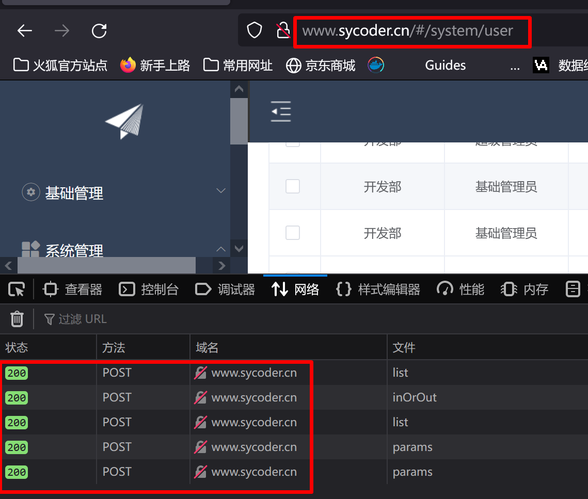

  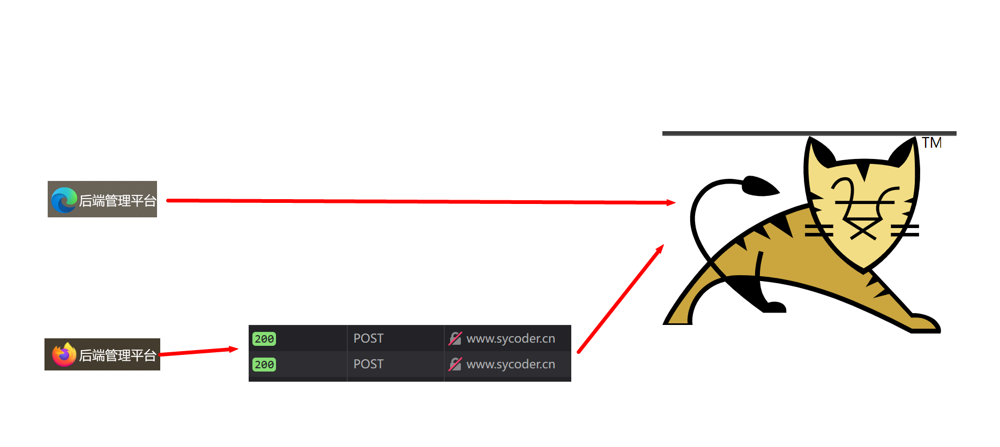

  - 同一窗口发起多次请求，产生多次响应是同一会话
  - **不同浏览器之间是不同会话**

## 1.会话跟踪

- 会话跟踪：为了共享数据，保证用户访问的时候不会出现紊乱

- 实际应用：

  - 获取用户登录信息

    

  - 用户在做操作的时候，可以去填写操作人信息

    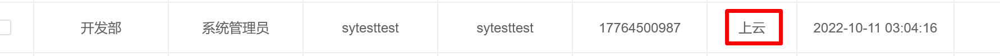

  - 记住当前密码信息，下次进入网站不需要再去输入账号密码

    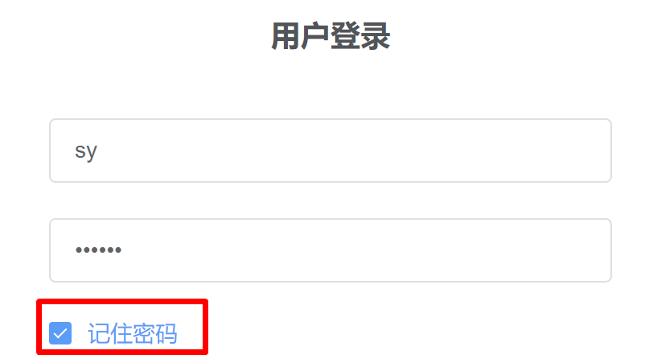

    

- 会话跟踪技术通过什么方式实现

  - **服务端技术：Session**
  - **客户端技术：Cookie**

  

# 二、Cookie

## 1.Cookie 概述

- Cookie:是客户端技术，可以将数据存储到客户端，然后每次请求访问的时候，都会携带 Cookie 数据访问。

  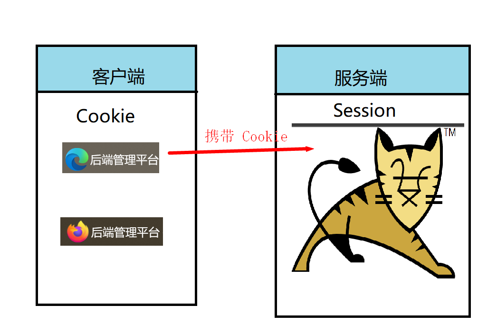

  

## 2.基本使用

- 如何创建 Cookie 对象

  ```java
  Cookie cookie = new Cookie(String name, String value)
  ```

- 响应Cookie 给客户端

  ```java
  void addCookie(Cookie cookie)
  
  Parameters:
  cookie - the Cookie to return to the client
  ```

- 获取 Cookie

  ```java
  Cookie[] getCookies()
  Returns:
  an array of all the Cookies included with this request, or null if the request has no cookies
  ```

  

- Cookie 常用方法

  ```java
  String	getName()
      
  String	getValue()
  ```

  

- 试一试

  - 添加依赖

    ```java
    <dependency>
          <groupId>javax.servlet</groupId>
          <artifactId>javax.servlet-api</artifactId>
          <version>3.1.0</version>
          <scope>provided</scope>
          <!--            提供provided 编译和测试有效，避免和 tomcat 中的 servlet-api 包冲突报错-->
        </dependency>
        <dependency>
          <groupId>javax.servlet</groupId>
          <artifactId>jsp-api</artifactId>
          <version>2.0</version>
          <scope>provided</scope>
        </dependency>
        <dependency>
          <groupId>jstl</groupId>
          <artifactId>jstl</artifactId>
          <version>1.2</version>
        </dependency>
        <dependency>
          <groupId>taglibs</groupId>
          <artifactId>standard</artifactId>
          <version>1.1.2</version>
        </dependency>
    ```

  - 编写 servlet

    ```java
    @WebServlet("/respCookie")
    public class RespCookieServlet extends HttpServlet {
        @Override
        protected void doGet(HttpServletRequest req, HttpServletResponse resp) throws ServletException, IOException {
            Cookie cookie = new Cookie("username", "sy");
            resp.addCookie(cookie);
        }
    }
    ```

  - 查看 Cookie

    

    

  - 获取 Cookie

    ```java
    @WebServlet("/reqCookie")
    public class ReqCookieServlet extends HttpServlet {
    
        public static final String USER_NAME = "username";
    
        @Override
        protected void doGet(HttpServletRequest req, HttpServletResponse resp) throws ServletException, IOException {
            Cookie[] cookies = req.getCookies();
            for (Cookie cookie : cookies) {
                if(ReqCookieServlet.USER_NAME.equals(cookie.getName())){
                    System.out.println("当前用户用户名为："+cookie.getValue());
                }
            }
        }
    }
    ```

    

## 3.Cookie 原理

- 原理分析图

  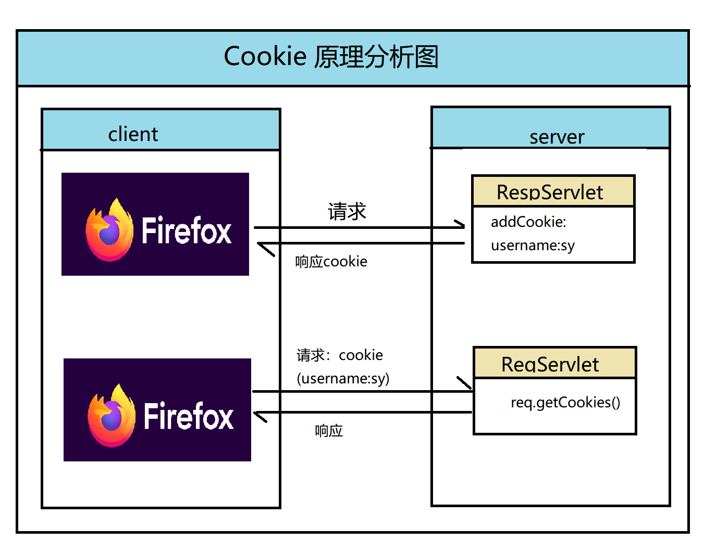

  - 请求 RespServlet ，添加了cookie 响应数据（username:sy）,响应给浏览器

  - Tomcat 设置响应数据头 Set-Cookie:(username=sy)

    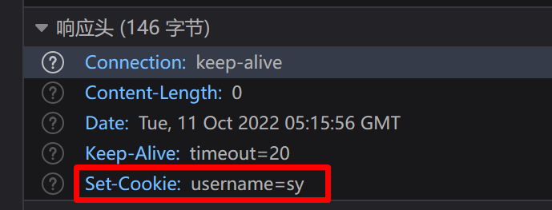

  - 得到 Cookie 值之后，会将数据存储到存储里面的Cookie 中（浏览器不一样名称也不太一样）

  - 第二次发起请求的时候，从我们的缓存文件里面去到 Cookie 值，在请求头里面设置 Cookie

    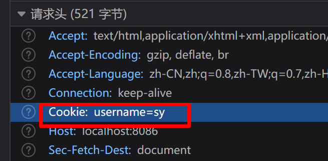

  - 从 server（服务端） 就可以通过 getCookies 获取所有的 Cookie
  
  > ### Cookie的存储过程
  >
  > 1. **服务器创建Cookie**：当用户访问网站时，服务器会根据用户信息和请求创建一个或多个Cookie，并通过HTTP响应头中的Set-Cookie字段发送给浏览器。
  > 2. **浏览器接收并存储Cookie**：浏览器接收到Set-Cookie响应头后，会自动将Cookie内容保存在本地。存储位置通常与浏览器和操作系统相关，如Windows系统中可能存储在C:\Users\用户名\AppData\Roaming\Microsoft\Windows\Cookies\等目录下。
  > 3. **浏览器携带Cookie发起请求**：当用户再次访问同一网站时，浏览器会自动从本地存储中读取相关的Cookie，并将其放在HTTP请求头中的Cookie字段内发送给服务器。

## 4.Cookie 使用

### 4.1 Cookie 有效期设置

- 新打开一个浏览器已经不能使用Cookie

- 记住密码的功能是有时间限制的

  - 设置 Cookie 存活时间

    ```java
    public void setMaxAge(int expiry)
    ```

  - 设置0 ：删除 Cookie

    ```java
    Cookie cookie = new Cookie("username", "sy");
            cookie.setMaxAge(0);
    ```

  - 正数：设置过期时间，到时间自动删除

    ```java
    Cookie cookie = new Cookie("username", "sy");
            cookie.setMaxAge(24*60*60);
    ```

    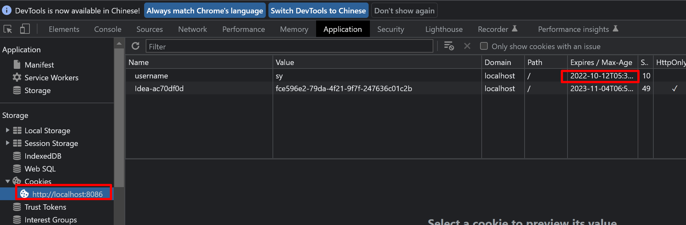

  - 负数：关闭浏览器就没

    ```java
    Cookie cookie = new Cookie("username", "sy");
            cookie.setMaxAge(-1);
    ```

    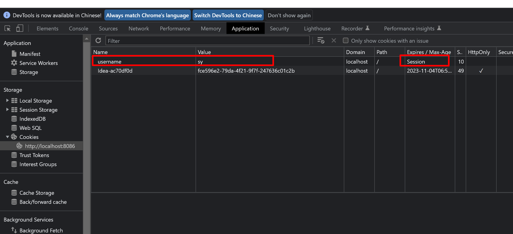

### 4.2 Cookie 使用中文

- 会出现乱码问题

  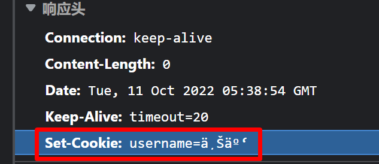

- 设置cookie 的时候使用URLEncode编码

- 使用的时候使用URLDecoder 解码

  

  

# 三、Session

## 1.Session 概述

- Session：服务端会话跟踪技术，将数据保存到服务端。
- Session 和 Cookie 存储区别
  - Cookie 存储到 client,容易被钓鱼网站拿过去用，有安全隐患
  - Session 存储到 Server，会相对安全

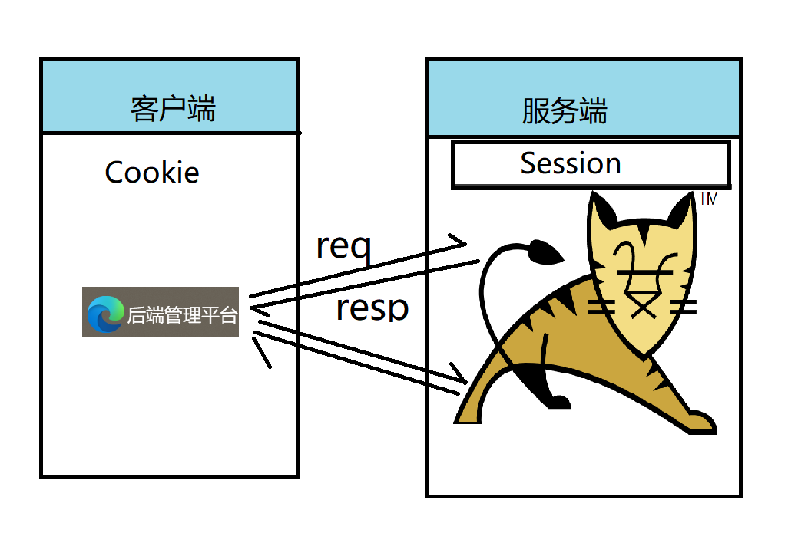

- 可以实现数据共享（存储会话请求的 Session ，每一次请求都可以调用（没有过期））

## 2.基本使用

- 获取 Session 对象(如果第一次请求没有，就创建一个)

  ```java
  HttpSession getSession()
  Returns the current session associated with this request, or if the request does not have a session, creates one.
  ```

- 共享数据

  - 设置值进 Session 中

    ```java
    void setAttribute(String name,
                      Object value)
    ```

  - 从 Session 中取值

    ```java
    Object getAttribute(String name)
    ```

  - 从 Session 中删除属性

    ```java
    void removeAttribute(String name)
    ```

    

- 试一试

  - 编写三个Servlet

    ```java
    @WebServlet("/reqSession")
    public class ReqSession extends HttpServlet {
        @Override
        protected void doGet(HttpServletRequest req, HttpServletResponse resp) throws ServletException, IOException {
            //获取session对象
            HttpSession session = req.getSession();
            //做数据共享
            session.setAttribute("age",18);
    
        }
    }
    ```

    ```java
    @WebServlet("/respSession")
    public class RespSession  extends HttpServlet {
        @Override
        protected void doGet(HttpServletRequest req, HttpServletResponse resp) throws ServletException, IOException {
            //获取session对象
            HttpSession session = req.getSession();
            //做数据共享
            Object age = session.getAttribute("age");
            System.out.println("==============获取req 里面设置到 session 中的值");
            System.out.println(age);
    
        }
    }
    ```

    ```java
    @WebServlet("/removerSession")
    public class RemoverSession extends HttpServlet {
        @Override
        protected void doGet(HttpServletRequest req, HttpServletResponse resp) throws ServletException, IOException {
            //获取session对象
            HttpSession session = req.getSession();
    
            session.removeAttribute("age");
        }
    }
    ```

    

## 3.Session 原理

- **Session 是基于 Cookie 实现的**

- 原理分析图

  

  - 文字说明

    1. **客户端发送请求**：当用户首次访问Web应用时，客户端（通常是浏览器）会发送一个HTTP请求到服务器端。
    2. **服务器创建Session**：服务器接收到请求后，会为该用户创建一个唯一的Session对象，并为该Session生成一个唯一的Session ID。这个Session ID通常是一个长随机字符串，用于标识用户的会话。
    3. **Session存储数据**：服务器使用Session ID作为键，将用户的状态信息（如身份认证信息、购物车内容、用户偏好设置等）存储在服务器端的某个存储介质（如内存、数据库或文件）中。
    4. **发送Session ID给客户端**：服务器在响应中将Session ID发送给客户端，通常是通过设置Set-Cookie响应头的方式。这样，客户端浏览器就会保存一个包含Session ID的Cookie。
    5. **客户端发送Session ID**：在后续的请求中，客户端会自动将包含Session ID的Cookie发送给服务器端。服务器根据请求中的Session ID来检索对应的Session数据，并根据需要进行处理或返回相应的结果。
    6. **Session过期与销毁**：Session有一个过期时间，如果用户在一段时间内没有活动，或者超过了设定的最大存活时间，Session会被服务器自动销毁。此外，Web应用也可以手动创建和销毁Session，使开发人员更加灵活地管理和使用Session。
  
  - 演示如下
  
    - 发起请求得到如下 JESSIONID
  
      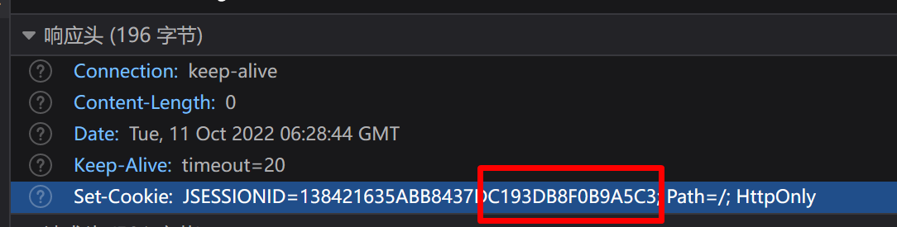
  
    - 再次发起请求时，会携带刚才得到的 Cookie
  
      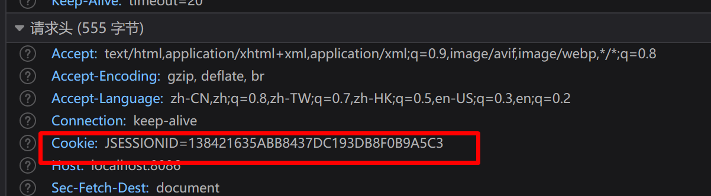
  
    - 修改JSESSIONID=1后无法获取到session 共享数据
  
      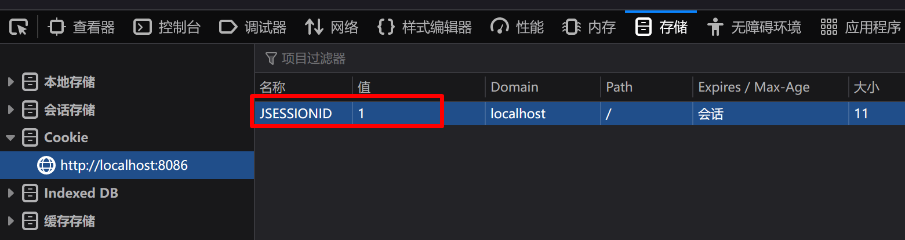
  
    - 此时已经取不到刚才的值了
  
      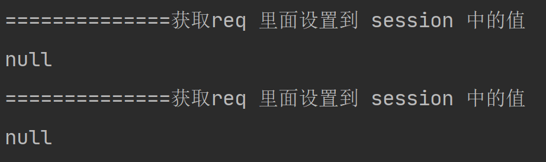
  
      

## 4.Session 的使用

### 4.1Session 的钝化与活化

> #### 钝化
>
> - **定义**：
>   - **Session钝化**是指将Session及其内部的对象从服务器的内存中序列化并保存到硬盘上的过程
>
> - **作用**：
>   - 保护Session数据，防止数据丢失。
>   - 减轻服务器内存压力，提升服务器性能。当在线用户很多时，Session内存的开销是巨大的，会直接影响Web服务器的性能，而Session钝化机制可以解决这个问题。
> - **触发条件**：
>   - 通常在服务器关闭或重启时自动触发，以确保用户会话数据不会因服务器关闭而丢失。
>   - 也可以配置为在Session空闲时间超过一定阈值时，将不常使用的Session对象钝化到硬盘上。
> - **实现方式**：
>   - 在Tomcat等服务器中，可以通过配置Session管理器（如PersistentManager）来实现Session钝化。
>   - Session钝化过程是由服务器自动完成的，无需手动操作

> #### 活化
>
> - **定义**：
>   - **Session活化**是指将之前保存在硬盘上的Session数据反序列化，重新加载到服务器内存中的过程。
> - **作用**：
>   - 恢复用户会话，使用户无需重新登录或重新进行之前的操作，即可继续之前的会话。
> - **触发条件**：
>   - 当服务器重启并需要恢复之前的会话时，活化机制会被触发。
>   - 用户对钝化的Session进行首次操作时，也会触发活化机制。
> - **实现方式**：
>   - 在Tomcat等服务器中，Session活化过程也是由服务器自动完成的。
>   - 当需要恢复Session时，服务器会从硬盘上读取相应的Session文件，并将其反序列化后加载到内存中

#### 分析以下 session 使用可能出现的问题

- 第一次请求获取的Session存储到服务器之后
- 此时公司内部重启服务器
- 第二次去访问的时候，Session 已经不存在了
- 很影响用户体验感

---

- 钝化与活化的目的


- 为了存储session,保证正常关闭下正常启动的时候，同一会话有效

- 演示钝化与活化

  - 拷贝jar 到 tomcat webapps 下面去部署

    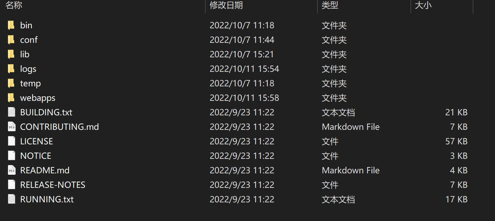

  - 请求 reqSession 以及 respSession

    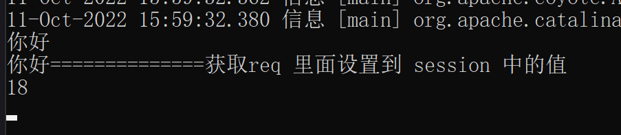

  - **服务器正常关闭**（shutdown.bat）

    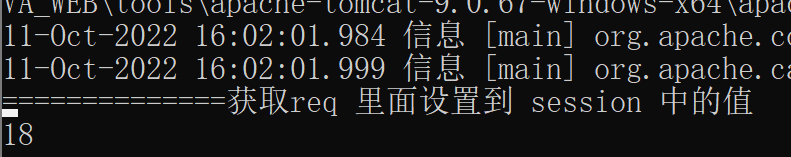

  - 正常关闭的时候，就会通过序列化保存sessions.ser

    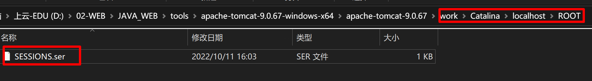

- 钝化

  - 服务器正常关闭的时候，tomcat 会把 session 数据写入硬盘work 目录下（sessions.ser文件）

- 活化

  - 服务器启动的时候，tomcat 读取 sessions.ser 中的数据，并且删掉这个文件（删掉的目的是为了减少不需要的钝化文件污染磁盘，造成磁盘空间的浪费）

### 4.2Session 销毁

- 分为两种方式:自动销毁和手动销毁

  - 自动销毁

    - **默认情况下无操作 30分钟**
    - 修改默认的配置(都是 web.xml 的配置)

    ```java
    <!DOCTYPE web-app PUBLIC
     "-//Sun Microsystems, Inc.//DTD Web Application 2.3//EN"
     "http://java.sun.com/dtd/web-app_2_3.dtd" >
    
    <web-app>
      <display-name>Archetype Created Web Application</display-name>
      <session-config>
        <session-timeout>33333</session-timeout>
      </session-config>
    </web-app>
    ```
  
    > 在tomcat的config文件下
  
    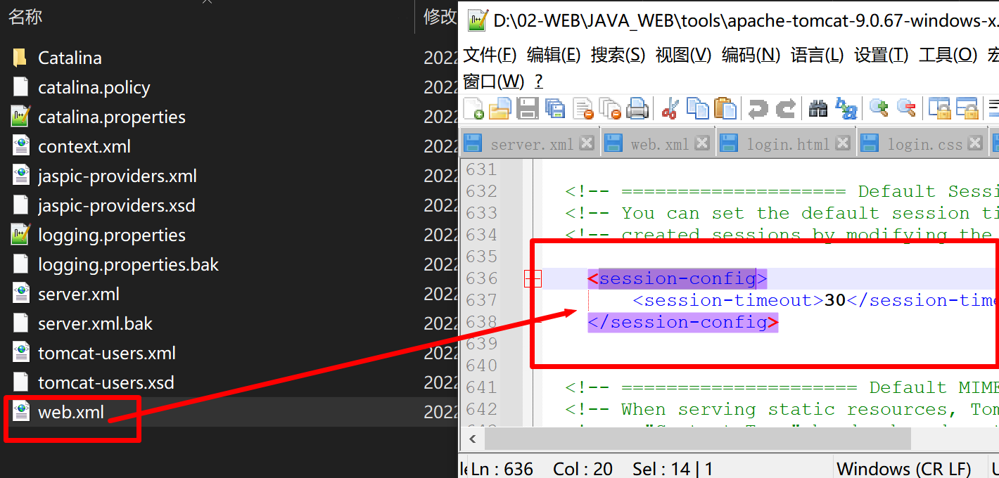
  
  - 手动销毁
  
    ```java
    void invalidate()
    Invalidates this session then unbinds any objects bound to it.
    ```
  
    ```java
    @WebServlet("/reqSession")
    public class ReqSession extends HttpServlet {
        @Override
        protected void doGet(HttpServletRequest req, HttpServletResponse resp) throws ServletException, IOException {
            //获取session对象
            HttpSession session = req.getSession();
            //做数据共享
            session.setAttribute("age",18);
    
            session.invalidate();
    
        }
    }
    ```
  
    

# 四、小结

- Cookie 与 Session 作用：用来在会话中做数据共享，存储数据。

  | 不同点                     | Cookie                  | Session                              |
  | -------------------------- | ----------------------- | ------------------------------------ |
  | 存储位置                   | client                  | server                               |
  | 存储时间                   | setMaxAge()可以长期存储 | 默认30分钟                           |
  | key-value结构中的value类型 | 字符串类型              | object类型，可以存储更复杂的数据结构 |
  | 存储数据大小               | 最大3KB                 | 无限制                               |
  | 安全性                     | 不安全                  | 安全                                 |
  | 服务器性能影响             | 不占用服务器资源        | 占用服务器资源                       |
  
  | 应用场景 | Cookie     | Session     |
  | -------- | ---------- | ----------- |
  | 记住密码 | 使用Cookie |             |
  | 验证码   |            | 使用Session |
  | 登录名称 |            | Session     |
  | 购物车   | 使用Cookie |             |


# 五、任务

- 流程分析图

  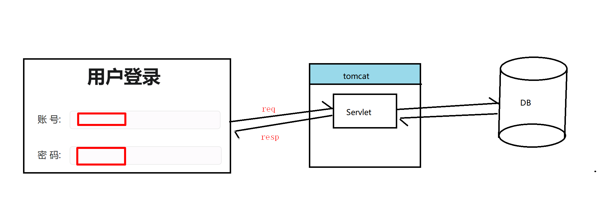

  1. servlet 获取前端传送的 username 和 password 数据
  2. 拷贝 jdbcUtil 工具类，将得到的数据和数据库比较（以三层架构的方式去做）
  3. 响应给浏览器
  4. 记住账号密码功能需要响应 cookie
  5. 验证码功能需要设置 session
  6. 登录成功之后，跳转到index.jsp 页面，并且用 h1 标签显示当前登录的用户信息

- 代码实现

  - 新建 servlet 

    ```java
    @WebServlet("/csLogin")
    public class LoginServlet extends HttpServlet {
        @Override
        protected void doGet(HttpServletRequest req, HttpServletResponse resp) throws ServletException, IOException {
            String username = req.getParameter("username");
            String password = req.getParameter("password");
    
            System.out.println(username);
            System.out.println(password);
    
            ILoginService service = new LoginServiceImpl();
            User user = service.login(username, password);
            if(user == null){
                System.out.println("没有登录成功");
                req.getRequestDispatcher("/login.html").forward(req,resp);
            }else{
                HttpSession session = req.getSession();
                session.setAttribute("user",user);
                resp.sendRedirect("/index.jsp");
            }
    
        }
    }
    ```

  - 新建 service  dao

    ```java
    public class LoginServiceImpl implements ILoginService {
        @Override
        public User login(String username, String password) {
            User domain = JDBCUtil.getDomain(JDBCUtil.getConn(),
                    "select * from user where username = ? and password = ?", User.class, username, password);
            return domain;
        }
    }
    ```

  - 记住账号密码

    ```java
    @WebServlet("/csLogin")
    public class LoginServlet extends HttpServlet {
        @Override
        protected void doGet(HttpServletRequest req, HttpServletResponse resp) throws ServletException, IOException {
            String username = req.getParameter("username");
            String password = req.getParameter("password");
            String remember = req.getParameter("remember");
            String checkCode = req.getParameter("checkCode");
    
            HttpSession session = req.getSession();
    
    
            if ("on".equals(remember)) {
                //创建 cookie
                Cookie usernameCookie = new Cookie("username", username);
                Cookie passwordCookie = new Cookie("password", password);
                Cookie rememberCookie = new Cookie("remember", "on");
                //发送 cookie
                resp.addCookie(usernameCookie);
                resp.addCookie(passwordCookie);
                resp.addCookie(rememberCookie);
            } else {
    //            Cookie[] cookies = req.getCookies();
    //            for (Cookie cookie : cookies) {
    //                if("username".equals(cookie.getName()) || "password".equals(cookie.getName())){
    //                    cookie.setValue("");
    //                }
    //            }
            }
            System.out.println(username);
            System.out.println(password);
            String ret = (String) session.getAttribute("checkCode");
            if (!ret.equalsIgnoreCase(checkCode)) {
                req.setAttribute("check_msg", "验证码错误");
                req.getRequestDispatcher("/login.jsp").forward(req, resp);
                return;
            }
            ILoginService service = new LoginServiceImpl();
            User user = service.login(username, password);
            if (user == null) {
                System.out.println("没有登录成功");
                req.getRequestDispatcher("/login.jsp").forward(req, resp);
            } else {
    
                session.setAttribute("user", user);
                resp.sendRedirect("/index.jsp");
            }
    
        }
    }
    ```

  - 验证码

    ```java
    @WebServlet("/checkCode")
    public class CheckCoderServlet  extends HttpServlet {
    
        @Override
        protected void doGet(HttpServletRequest req, HttpServletResponse resp) throws ServletException, IOException {
            //生成验证码
            String code = VerifyCodeUtil.outputVerifyImage(500, 200, resp.getOutputStream(), 4);
            //存储到 session 方便验证
            HttpSession session = req.getSession();
            session.setAttribute("checkCode",code);
        }
    }
    ```

    