------

**讲师：上云**

**网址：www.sycoder.cn**

------

# 一、Filter

## 1.Filter 概述

- WEB 的三大组件

  - Servlet
  - Filter
  - Listener

- 过滤器：可以想象成家里面的净水器，必须在用水前净水

- Filter 是过滤器：可以把请求或者是响应资源拦截下来。Filter 是 WEB 的三大组件之一

  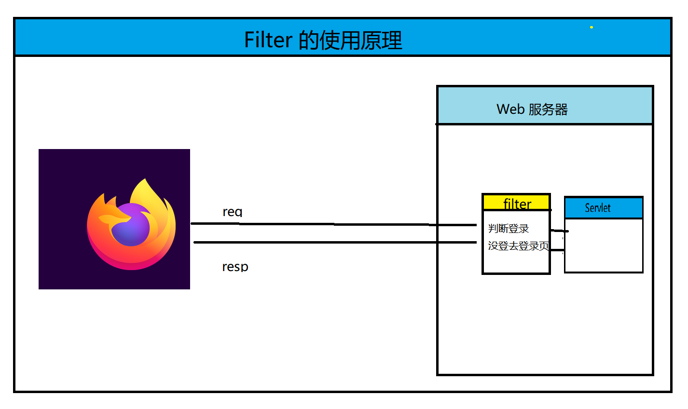

  - **filter 可以控制鉴权操作**

## 2.Filter 使用

- 自定义Filter 类实现Filter 接口

  ```java
  public class FirstFilter implements Filter {
      @Override
      public void init(FilterConfig filterConfig) throws ServletException {
  
      }
  
      @Override
      public void doFilter(ServletRequest servletRequest, ServletResponse servletResponse, FilterChain filterChain) throws IOException, ServletException {
  
      }
  
      @Override
      public void destroy() {
  
      }
  }
  ```

- 配置资源的拦截路径

  - 拦截所有资源

    ```java
    @WebFilter("/*")
    public class FirstFilter implements Filter {
        @Override
        public void init(FilterConfig filterConfig) throws ServletException {}
        @Override
        public void doFilter(ServletRequest servletRequest, ServletResponse servletResponse, FilterChain filterChain) throws IOException, ServletException { }
        @Override
        public void destroy() { }
    }
    ```

- 操作 doFilter 方法

  ```java
    @Override
      public void doFilter(ServletRequest req, ServletResponse resp, FilterChain filterChain) throws IOException, ServletException {
          String username = req.getParameter("username");
          System.out.println(username);
          //放行
          filterChain.doFilter(req,resp);
      }
  ```

## 3.Filter 执行流程

- 流程图

  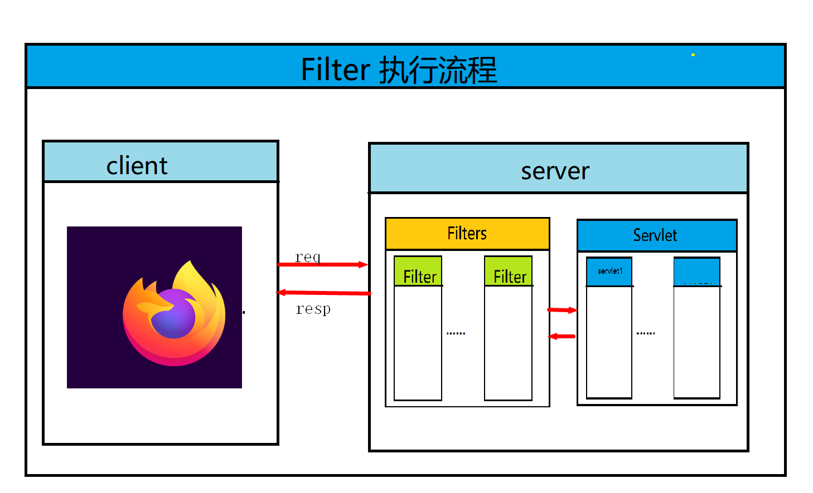

  - 放行后访问资源访问完成还是会回到 filter

    ```java
    A filter is an object that performs filtering tasks on either the request to a resource (a servlet or static content), or on the response from a resource, or both.
    ```

  - 回来是继续往下执行，并不是从头往下执行

    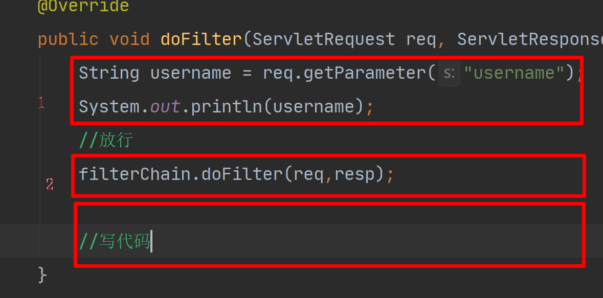

  - 验证

    ```java
     @Override
        public void doFilter(ServletRequest req, ServletResponse resp, FilterChain filterChain) throws IOException, ServletException {
            String username = req.getParameter("username");
            System.out.println(username);
            System.out.println("=============刚进入 filter");
            //放行
            filterChain.doFilter(req,resp);
    
            //写代码
            System.out.println("=============最后执行的filter");
    
        }
    ```

    ```java
    <body>
        <h1>欢迎 index.jsp</h1>
        <%
            System.out.println("================filter 放行中");
        %>
    </body>
    ```

    

## 4.Filter 拦截路径配置

- 拦截路径概述：表示我们需要拦截的资源

- 注意：一般我们都是使用注解配置 @WebFilter("")

- 配置如下

  - 具体化的配置 
    - 配置登录接口的拦截（"/login"）
  - 拦截所有
    - /* 只要访问资源都会被拦截
  - 拦截后缀名
    - *.do *.action 以.do 或者 .action 结尾的资源都会被拦截
  - 目录拦截
    - /目录名/*  /api/* 访问 api 目录下的资源都会被拦截

- 配置代码演示

  - 具体化配置代码

    ```java
    @WebFilter("/login")
    public class LoginFilter implements Filter {
        @Override
        public void doFilter(ServletRequest servletRequest, ServletResponse servletResponse, FilterChain filterChain) throws IOException, ServletException {
            System.out.println("拦截登录方法=================");
            filterChain.doFilter(servletRequest,servletResponse);
        }
    }
    ```

  - 拦截后缀名

    ```java
    @WebFilter("*.do")
    public class DoFilter implements Filter {
        @Override
        public void doFilter(ServletRequest servletRequest, ServletResponse servletResponse, FilterChain filterChain) throws IOException, ServletException {
            System.out.println("拦截以.do 为结尾的=================");
            filterChain.doFilter(servletRequest,servletResponse);
        }
    }
    ```

  - 拦截目录名下所有的

    ```java
    @WebFilter("/api/*")
    public class DirFilter implements Filter {
        @Override
        public void doFilter(ServletRequest servletRequest, ServletResponse servletResponse, FilterChain filterChain) throws IOException, ServletException {
            System.out.println("拦截 api 下面的所有 =================");
            filterChain.doFilter(servletRequest,servletResponse);
        }
    
    }
    ```

    

## 5.过滤器链

- 概述：在 web 服务中配置了多个的过滤器

  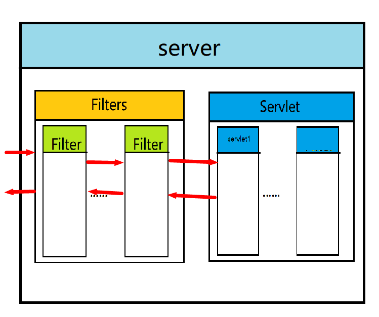

  - **先进后出的一个原则**
  - **注意：具体的拦截的优先级是大于模糊的优先级的**

- 做登录拦截

  ```java
  package cn.sycoder.filter.login;
  
  
  import javax.servlet.*;
  import javax.servlet.annotation.WebFilter;
  import javax.servlet.http.HttpServletRequest;
  import javax.servlet.http.HttpSession;
  import java.io.IOException;
  
  /**
   * 作者：上云
   * 网址：http://www.sycoder.cn
   * 日期：2022/10/12
   */
  @WebFilter("/*")
  public class LoginFilter implements Filter {
      @Override
      public void doFilter(ServletRequest servletRequest, ServletResponse servletResponse, FilterChain filterChain) throws IOException, ServletException {
          HttpServletRequest req = (HttpServletRequest) servletRequest;
          //放行需要放行的方法和接口
          String requestURI = req.getRequestURI();
          String[] urls = {"/login.jsp","/login"};
          for (String url : urls) {
              if(url.equals(requestURI)){
                  filterChain.doFilter(servletRequest,servletResponse);
                  return;
              }
          }
          //判断是否有资源需要放行
  
  
          HttpSession session = req.getSession();
          String username = (String) session.getAttribute("username");
          if(username != null && !username.trim().equals("")){
              filterChain.doFilter(servletRequest,servletResponse);
          }else{
              req.setAttribute("loginMsg","请登录");
              req.getRequestDispatcher("/login.jsp").forward(servletRequest,servletResponse);
          }
  
      }
  
      @Override
      public void destroy() {
  
      }
  
      @Override
      public void init(FilterConfig filterConfig) throws ServletException {
  
      }
  
  }
  
  ```

  

# 二、Listener

## 1.Listener 概述

- Listener : 表示监听器，监听容器 application（ServletContext）,session,request等对象的创建，销毁，元素的添加，元素的删除时可以执行的功能组件

- 分类

  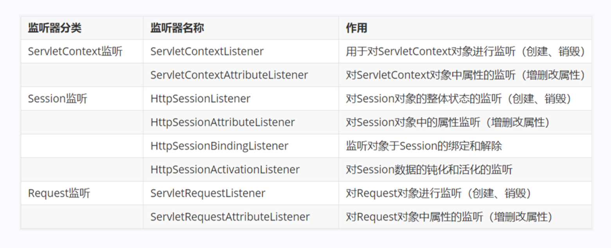

- 学习 ServletContextListener

  - 常用方法

    ```java
    void	contextDestroyed(ServletContextEvent sce)
        
    void	contextInitialized(ServletContextEvent sce)
    ```

  - 演示

    - 创建监听器类,记得使用@ WebListener 实现 ServletContextListener 接口

      ```java
      @WebListener
      public class FirstListener implements ServletContextListener {
          @Override
          public void contextInitialized(ServletContextEvent servletContextEvent) {
              System.out.println("容器已经初始化了==================");
          }
      
          @Override
          public void contextDestroyed(ServletContextEvent servletContextEvent) {
              System.out.println("容器销毁了====================");
          }
      }
      ```

# 三、Ajax

## 1.Ajax 概述

- Ajax:可以发送异步请求，AJAX = *A*synchronous *J*avaScript *A*nd *X*ML.

  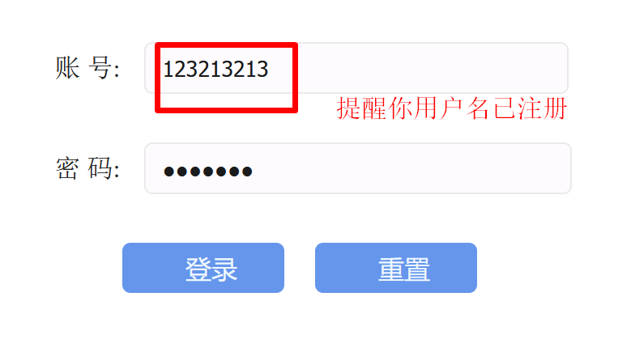

  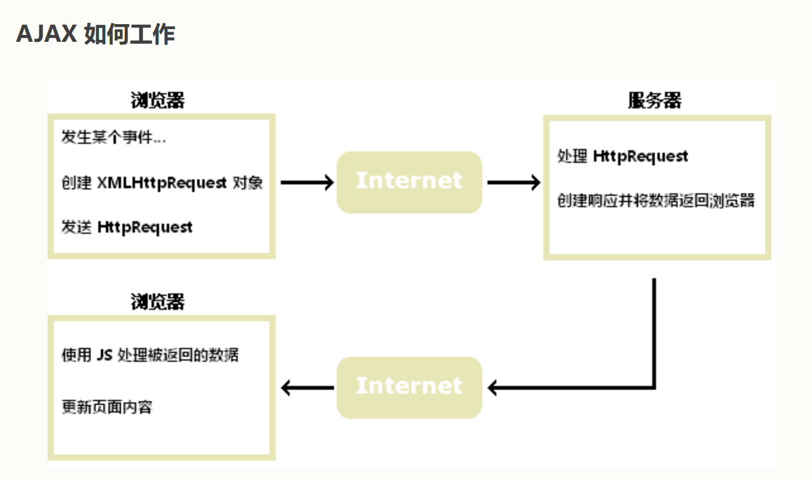

- 作用

  - 发起异步请求，可以做到部分数据更新
  - 可以去请求服务器获取服务器的数据

- 应用

  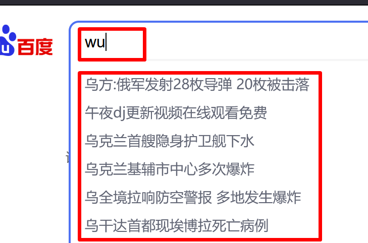

  

## 2.同步请求与异步请求

- 图例说明

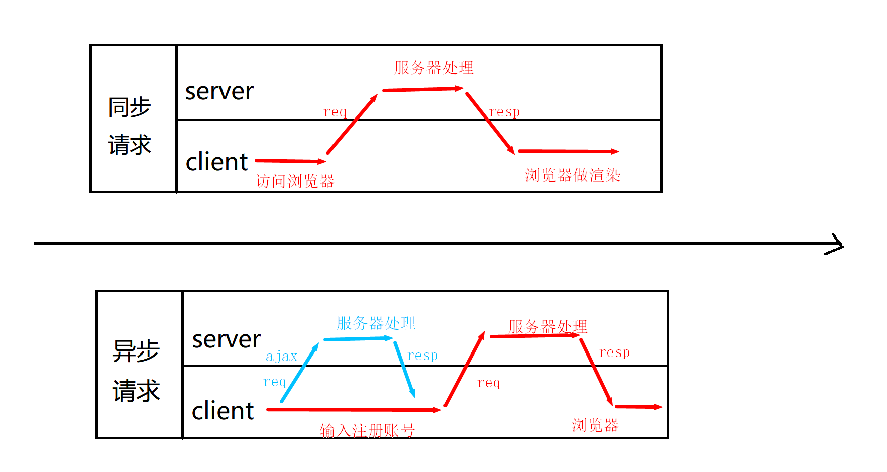


## 3.Ajax 使用

- 写一个 Servlet 服务，响应一串文字

  ```java
  @WebServlet("/ajax")
  public class AjaxServlet extends HttpServlet {
  
      @Override
      protected void doGet(HttpServletRequest req, HttpServletResponse resp) throws ServletException, IOException {
          //响应一串字符串就行
  
          resp.getWriter().write("修改后的文字内容：hello ajax");
      }
  }
  ```

- 修改 index.jsp 里面的代码

  ```java
  <div id="demo">
      <h1>欢迎 index.jsp</h1>
      <button type="button" onclick="loadDoc()">修改内容</button>
  </div>
  ```

  ```java
  <script>
      function loadDoc() {
          let xhttp = new XMLHttpRequest();
          xhttp.onreadystatechange = function() {
              //获取响应数据
              if (this.readyState == 4 && this.status == 200) {
                  document.getElementById("demo").innerHTML =
                      this.responseText;
              }
          };
      //建立连接
          xhttp.open("GET", "/ajax", true);
      //真正的发送请求    
      xhttp.send();
      }
  </script>
  ```

  

## 4.axios

- 概述Axios 是一个基于 *[promise](https://javascript.info/promise-basics)* 网络请求库，作用于[`node.js`](https://nodejs.org) 和浏览器中。 它是 *[isomorphic](https://www.lullabot.com/articles/what-is-an-isomorphic-application)* 的(即同一套代码可以运行在浏览器和node.js中)。在服务端它使用原生 node.js `http` 模块, 而在客户端 (浏览端) 则使用 XMLHttpRequests。
- 官网地址 https://www.axios-http.cn/docs

- 使用

  - 引入js 文件

    <script src="https://unpkg.com/axios/dist/axios.min.js"></script>

  - 直接调用

    ```java
    axios.get('/ajax')
            .then(function (response) {
                // 处理成功情况
                console.log(response);
            })
            .catch(function (error) {
                // 处理错误情况
                console.log(error);
            })
            .then(function () {
                // 总是会执行
            });
    ```

    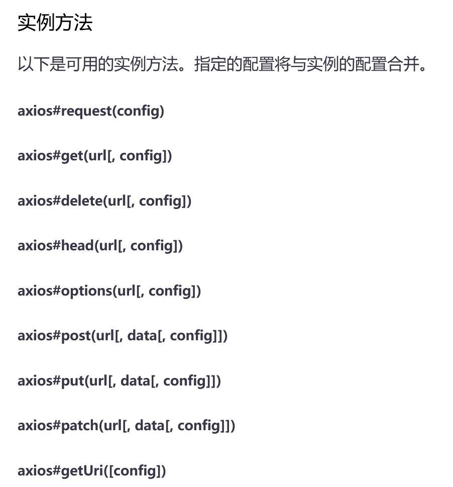

  - 可以进入官网的 Axios api 查看具体使用细节

    ```js
    axios({
      method: 'get',
      url: 'http://bit.ly/2mTM3nY',
      responseType: 'stream'
    })
      .then(function (response) {
        response.data.pipe(fs.createWriteStream('ada_lovelace.jpg'))
      });
    ```

# 四、完成注册小案例

- 流程分析图

  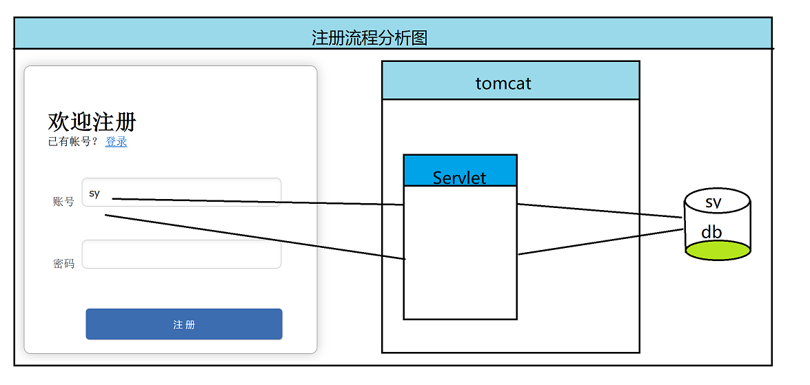

  - 前端要完成的功能
    - 给输入框绑定光标输入实践 onBlur
    - 发送 ajax 请求
    - 处理响应
  - 后端
    - 接收用户
    - 判断是否存在
    - 返回

- 代码实现

  - 后端

    ```java
    @WebServlet("/register")
    public class RegisterServlet extends HttpServlet {
        @Override
        protected void doGet(HttpServletRequest req, HttpServletResponse resp) throws ServletException, IOException {
            //获取前端传过来的数据
            String username = req.getParameter("username");
            //模拟数据库的查询
            List<String> list = new ArrayList<>();
            list.add("sy");
            list.add("sy666");
            list.add("123");
            boolean contains = list.contains(username);
            if(contains){
                resp.getWriter().write("no");
            }else{
                resp.getWriter().write("yes");
            }
    
    
        }
    }
    ```

  - 前端

    ```java
    <script>
            //失去焦点触发事件
            document.getElementById("username").onblur=function () {
                console.log(this.value)
                console.log("==================")
                axios({
                    method: 'get',
                    url: '/register',
                    params: {
                        username: this.value
                    }
    
                })
                    .then(function (response) {
                        console.log("=============")
                        console.log("no" == response.data);
                        console.log("no" === response.data);
                        if("yes" == response.data){//这里是有问题的
                            document.getElementById("username_err").style.display = ''
                        }else{
                            document.getElementById("username_err").style.display = 'none'
                        }
    
                    });
            }
        </script>
    ```

    

