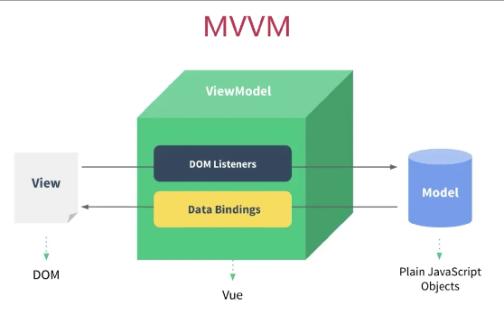
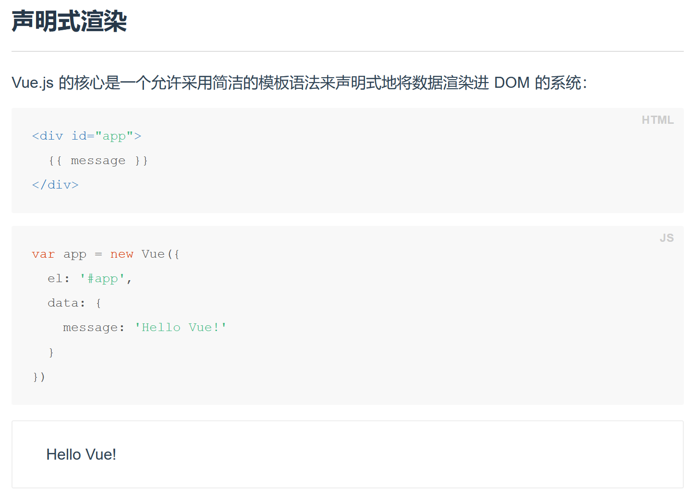
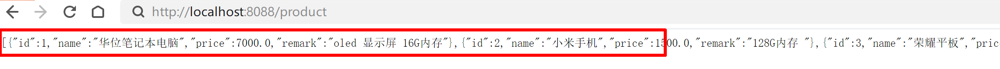
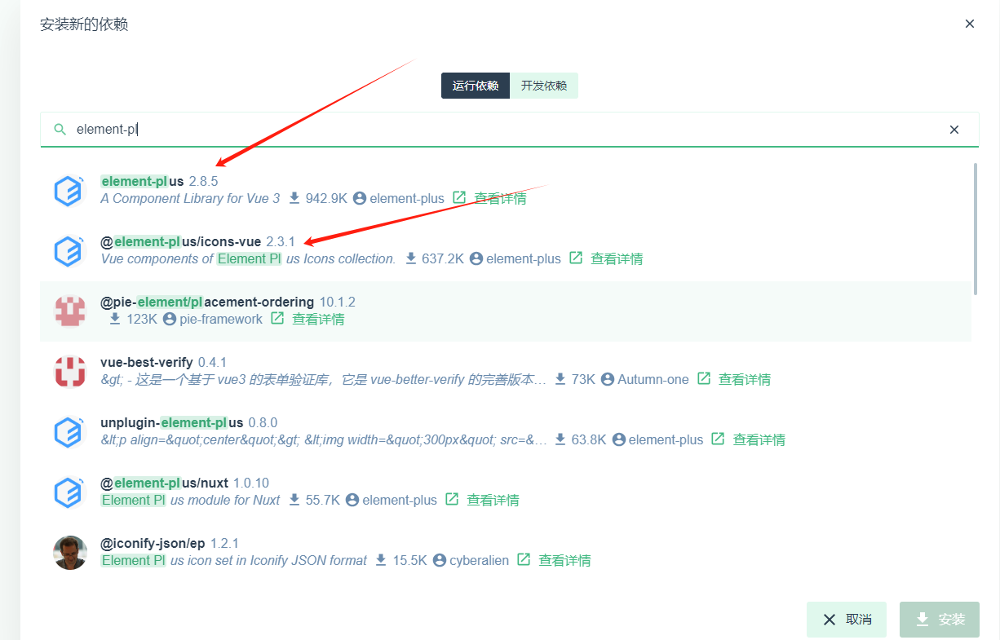
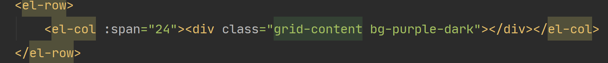
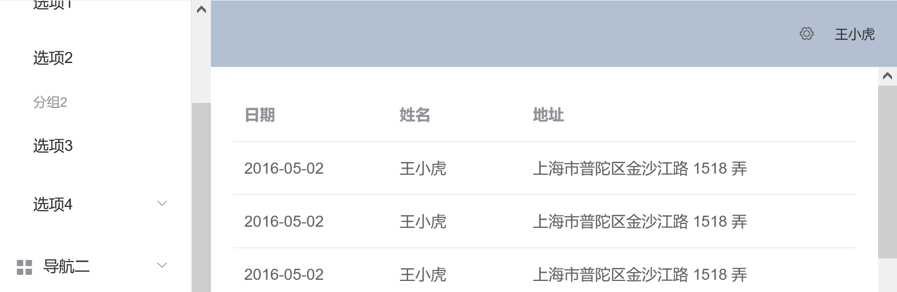
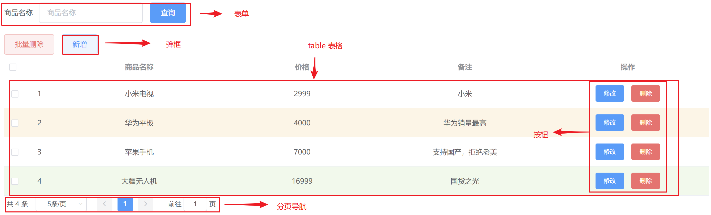

# 一、Vue

## 1.Vue 概述

- Vue 学习中文文档 https://cn.vuejs.org/

- Vue (读音 /vjuː/，类似于 **view**) 是一套用于构建用户界面的**渐进式框架**

  

- vue 是使用数据的双向绑定

  

## 2.快速入门

- 引入 vue.js 文件

  > vue2  https://cdn.jsdelivr.net/npm/vue/dist/vue.js
  >
  > vue3 https://unpkg.com/vue@3/dist/vue.global.js

  > Tips:
  > 如果你没有使用任何构建工具，而是从 CDN 或其他源来加载 Vue，请确保在部署时使用的是生产环境版本（以 .prod.js 结尾的构建文件）。生产环境版本会被最小化，并移除了所有仅用于开发环境的代码分支。
  >
  > vue3 https://unpkg.com/vue@3/dist/vue.global.prod.js 

- ```html
  <!DOCTYPE html>
  <html lang="cn">
  <head>
      <meta charset="UTF-8">
      <title>test</title>
      <!-- 在线引入vue3 -->
      <!-- <script src="https://unpkg.com/vue@3/dist/vue.global.js"></script> -->
      <script src="https://unpkg.com/vue@3/dist/vue.global.prod.js"></script>
  </head>
  <body>
      <!-- id 绑定应用范围 -->
      <div id="app">
          {{test}} <button @click="fun_test">increment</button>
      </div>
  </body>
  <script>
      //使用 vue3 的基本格式
      const {createApp , ref } = Vue
      const app =  createApp({
          // 逻辑代码全部写在setup里面
          // 因为没有语法糖，无论是定义的"变量"或者"函数"都必须！
          // 把名称再多写一次！放在在最后return里面
          setup(){
              //测试变量
              const test = ref(0)
              //测试函数
              const fun_test = () => {
                  test.value++;
              }
              //h5页面必须把名称return，vite中不需要（重要区别）
              return {
                  test,
                  fun_test
              }
          }
      })
      //应用vue（就是挂载在上面ID绑定的元素上）
      app.mount("#app")
  </script>
  </html>
  ```

- ### `ref()`

  > - 模板中使用 ref 时，我们**不**需要附加 `.value`  (在模板中使用时，ref 会自动解包)
  > - 在js中使用ref时，需要附加 `.value`

## 3.Vue 实例

### 3.1创建vue实例

- 创建 Vue 实例

  ```js
  var vm = new Vue({
    // 选项
  })
  ```

- el

  - id 选择器 #加上id

  ```html
  Vue 实例使用的根 DOM 元素
  ```

- data

  ```html
  选项 / 数据 - data
  ```

### 3.2生命周期

- 生命周期图示

  

  

  - 注意：不需要去背，我们只需要关注 mounted 挂载完成部分就行了
    - **发送异步请求就可以实现数据的绑定**

  

## 4.模板语法

### 4.1插值

- 文本:双大括号实现文本插值,可以随着属性的更新而更新

  ```html
  <span>Message: {{ msg }}</span>
  ```

  - v-once:只插值一次

    ```html
    <span v-once>{{message}}</span>
    ```

### 4.2指令

- v-bind 指令:可以实现 Class 与 Style 绑定

  ```html
  <div id="app">
          <a v-bind:href="url"> 点击我 </a>
      <a :href="url"> 点击我 </a>
  </div>
  ```

  

- v-model 表单输入绑定： `<input>`、`<textarea>` 及 `<select>` 元素上创建双向数据绑定

  ```html
  <div id="app">
      <a v-bind:href="url"> 点击我 </a>
      <input v-model="url" placeholder="输入修改">
      <textarea v-model="message" placeholder="add multiple lines"></textarea>
  </div>
  ```

### 4.3条件渲染

- v-if

- v-else-if

- v-else

  ```html
  <div id="app">
      <span v-if="number == 1"> 星期一</span>
      <span v-else-if="number == 2"> 星期二</span>
      <span v-else-if="number == 3"> 星期三</span>
      <span v-else-if="number == 4"> 星期四</span>
      <span v-else-if="number == 5"> 星期五</span>
      <span v-else-if="number == 6"> 星期六</span>
      <span v-else> 星期天</span>
  
      <input v-model="number">
  </div>
  ```

- v-show 修改 style 控制是否隐藏

  ```html
  <span v-show="number==8">星期八</span>
  ```

### 4.4列表渲染

- v-for

  ```html
  <li v-for="(item,i) in items" :key="item.course">
      {{i+1}}:{{ item.course }}
  </li>
  ```

  

### 4.5事件处理

- v-on

  ```html
  <button v-on:click="counter += 1">点击次数加 1</button>
      <p>已经点击的次数 {{ counter }} </p>
  ```

  ```html
  <!DOCTYPE html>
  <html lang="en" xmlns:v-on="http://www.w3.org/1999/xhtml">
  <head>
      <meta charset="UTF-8">
      <title>Title</title>
      <script src="https://cdn.jsdelivr.net/npm/vue/dist/vue.js"></script>
  </head>
  <body>
  <div id="app">
      <button v-on:click="counter += 1">点击次数加 1</button>
      <button v-on:click="add('what')">点击</button>
      <p>已经点击的次数 {{ counter }} </p>
  </div>
  
  <script>
      var app = new Vue({
          el: '#app',
          data: {
              items:[
                  {course:'java'},
                  {course:'mysql'},
                  {course:'spring'}
              ],
              counter:0
          },
          methods:{
              add:function (hi) {
                  alert('Hello ' + hi)
              }
          }
      })
  </script>
  </body>
  </html>
  ```

### 4.6指令汇总

| **指令**  | **作用**                                            |
| --------- | --------------------------------------------------- |
| v-bind    | 为HTML标签绑定属性值，如设置  href , css样式等      |
| v-model   | 在表单元素上创建双向数据绑定                        |
| v-on      | 为HTML标签绑定事件                                  |
| v-if      | 条件性的渲染某元素，判定为true时渲染,否则不渲染     |
| v-else    | 条件性渲染某元素 执行 else语句                      |
| v-else-if | 条件性渲染某元素 执行 else if语句 判断              |
| v-show    | 根据条件展示某元素，区别在于切换的是display属性的值 |
| v-for     | 列表渲染，遍历容器的元素或者对象的属性              |

## 5.案例操作

### 5.1列表展示查询操作

- 先验证后端响应数据的正确性

  ```java
  List<Product> list = ProductDao.list;
  String s = JSON.toJSONString(list);
  //把json string 响应到浏览器
  resp.setContentType("text/json;charset=utf-8");
  resp.getWriter().write(s);
  ```

  

- 前端操作

  ```html
  <!DOCTYPE html>
  <html lang="en">
  <head>
      <meta charset="UTF-8">
      <title>Title</title>
      <script src="https://cdn.jsdelivr.net/npm/vue/dist/vue.js"></script>
      <script src="https://unpkg.com/axios/dist/axios.min.js"></script>
  </head>
  <body>
  <div id="app">
      <a href="#">新增</a>
      <table border="1" cellspacing="0" width="100%">
          <tr>
              <th>序号</th>
              <th>商品名称</th>
              <th>价格</th>
              <th>备注</th>
              <th>操作</th>
          </tr>
          <tr v-for="(product,i) in products" align="center">
              <td>{{i+1}}</td>
              <td>{{product.name}}</td>
              <td>{{product.price}}</td>
              <td>{{product.remark}}</td>
              <td><a href="#">修改</a><a href="#">删除</a></td>
          </tr>
      </table>
  </div>
  <script>
     <script>
      //使用 vue3 的基本格式
      const { createApp, ref, onMounted } = Vue
      const app = createApp({
          setup() {
              let products = ref([]);
              
  
              onMounted(() => {
                  axios.get('/product')
                      .then( response => {
                          products.value = response.data;
                          console.log(products.value);
                      })
              })
  
              
              return {
                  products,
              }
          }
      })
      app.mount("#app")
  </script>
  </script>
  </body>
  </html>
  ```
  
  > 1. **将 `products` 初始化为一个空数组**：因为您期望 `products` 是一个数组，以便能够使用 `v-for` 指令来迭代它。
  > 2. **使用正确的响应式变量更新方法**：在 `axios` 的回调中，您应该直接更新 `products.value`，因为 `ref` 返回的是一个对象，其 `.value` 属性存储了实际的响应式数据。
  > 3. **使用箭头函数保持 `this` 的上下文**：虽然在 `setup` 中不需要 `this`，但在处理异步数据时使用`箭头函数`可以保持回调函数中 `this` 的预期行为

### 5.4添加商品

- 后端代码

  ```java
  @Override
      protected void doPost(HttpServletRequest req, HttpServletResponse resp) throws ServletException, IOException {
          List<Product> list = new ArrayList<>();
          list.add(new Product("电脑",1000,"Laptop"));
          list.add(new Product("phone",130,"smart_phone"));
          //接收前端传参数据
          Object json = JSON.toJSON(list);
          resp.setContentType("text/json;charset=utf-8");
  
          resp.getWriter().write(json.toString());
      }
  ```


# 二、Element-plus

## 1.Element 概述

- 中文学习地址 https://element-plus.org/zh-CN/component/layout.html

- 饿了么公司前端开发出来的一套组件库，是基于 Vue
- 提供了丰富的组件库，方便程序员迭代开发

## 2.快速入门(准备工作)

- 利用vue脚手架创建项目，并使用element-plus 和 icon

  

  > 在main.js文件里添加

  ```js
  import { createApp } from 'vue'
  import App from './App.vue'
  
  import ElementPlus from 'element-plus' // 引入模块
  import 'element-plus/dist/index.css' // 引入css
  
  import * as ElementPlusIconsVue from '@element-plus/icons-vue' // 引入icon库
  
  const app = createApp(App);
  
  for (const [key, component] of Object.entries(ElementPlusIconsVue)) {  //进行全局注册。
      app.component(key, component)
  }
  
  app.use(ElementPlus).mount('#app')
  ```

  

## 3.组件

- 学习怎么学？直接拷贝 **ctrl c ctrl v** 学习的原则，需要什么就去官网拷贝就行了
- 表格
  - 斑马条纹带颜色
  - 带复选框
- 分页
- 弹出对话框
- 按钮
- 单选
- 多选
- 输入框

## 4.布局

- layout 

  - 将画布分成 24块

    

- container  以容器的方式

  

## 5.Element 应用




```html
<!DOCTYPE html>
<html lang="en">
<head>
    <meta charset="UTF-8">
    <title>Title</title>
    <!--    引入js 和 css-->
    <script src="../js/vue.js"></script>
    <script src="../element-ui/lib/index.js"></script>
    <link rel="stylesheet" href="../element-ui/lib/theme-chalk/index.css">

    <!--    引入样式-->
    <style>
        .el-table .warning-row {
            background: oldlace;
        }

        .el-table .success-row {
            background: #f0f9eb;
        }
    </style>
</head>
<body>


<div id="app">
    <!--        表单输入框-->
    <el-form :inline="true" :model="formInline" class="demo-form-inline">
        <el-form-item label="商品名称">
            <el-input v-model="formInline.name" placeholder="请输入商品名称"></el-input>
        </el-form-item>

        </el-form-item>
        <el-form-item>
            <el-button type="primary" @click="onSubmit">查询</el-button>
        </el-form-item>
    </el-form>
    <el-button type="danger">批量删除</el-button>
    <el-button @click="dialogVisible = true" type="primary">新增</el-button>
    <!--        表格-->
    <template>
        <el-table
                :data="tableData"
                style="width: 100%"
                :row-class-name="tableRowClassName"
                @selection-change="handleSelectionChange"

        >
            <el-table-column
                    type="selection"
                    width="55">
            </el-table-column>
            <el-table-column
                    type="index"
                    prop="id"
                    width="50">
            </el-table-column>
            <el-table-column
                    prop="name"
                    align="center"
                    label="商品名称"
            >
            </el-table-column>
            <el-table-column
                    prop="price"
                    align="center"
                    label="价格"
            >
            </el-table-column>
            <el-table-column
                    prop="remark"
                    align="center"
                    label="备注">
            </el-table-column>
            <el-table-column
                    fixed="right"
                    label="操作">
                <template slot-scope="scope">
                    <el-button @click="updateProduct(scope.row)" type="primary">修改</el-button>
                    <el-button @click="del(scope.row)" type="danger">删除</el-button>
                </template>
            </el-table-column>
        </el-table>
    </template>
    <div class="block">
        <el-pagination
                @size-change="handleSizeChange"
                @current-change="handleCurrentChange"
                :current-page="currentPage4"
                :page-sizes="[5, 10, 15, 20]"
                :page-size="23"
                layout="total, sizes, prev, pager, next, jumper"
                :total="200">
        </el-pagination>

        <!--            新增对话框-->
        <el-dialog
                title="新增"
                :visible.sync="dialogVisible"
                width="30%"
        >
            <el-form :model="ruleForm" status-icon :rules="rules" ref="ruleForm" label-width="100px"
                     class="demo-ruleForm">
                <el-form-item label="商品名称" prop="name">
                    <el-input type="text" v-model="ruleForm.name" autocomplete="off"></el-input>
                </el-form-item>
                <el-form-item label="价格" prop="price">
                    <el-input type="text" v-model="ruleForm.price" autocomplete="off"></el-input>
                </el-form-item>
                <el-form-item label="备注" prop="age">
                    <el-input
                            type="textarea"
                            :rows="2"
                            placeholder="请输入内容"
                            v-model="ruleForm.remark">
                    </el-input>

                </el-form-item>
            </el-form>
            <span slot="footer" class="dialog-footer">
    <el-button @click="dialogVisible = false">取 消</el-button>
    <el-button type="primary" @click="dialogVisible = false">确 定</el-button>
  </span>
        </el-dialog>

        <!--            编辑对话框-->
        <el-dialog
                title="编辑"
                :visible.sync="updateDialogVisible"
                width="30%"
        >
            <el-form :model="updateForm" status-icon :rules="rules" ref="updateForm" label-width="100px"
                     class="demo-ruleForm">
                <el-form-item label="商品id" prop="id">
                    <el-input  type="text" v-model="updateForm.id" autocomplete="off" :disabled="true"></el-input>
                </el-form-item>
                <el-form-item label="商品名称" prop="name">
                    <el-input type="text" v-model="updateForm.name" autocomplete="off"></el-input>
                </el-form-item>
                <el-form-item label="价格" prop="price">
                    <el-input type="text" v-model="updateForm.price" autocomplete="off"></el-input>
                </el-form-item>
                <el-form-item label="备注" prop="age">
                    <el-input
                            type="textarea"
                            :rows="2"
                            placeholder="请输入内容"
                            v-model="updateForm.remark">
                    </el-input>

                </el-form-item>
            </el-form>
            <span slot="footer" class="dialog-footer">
    <el-button @click="updateDialogVisible = false">取 消</el-button>
    <el-button type="primary" @click="updateDialogVisible = false">确 定</el-button>
  </span>
        </el-dialog>
    </div>
</div>
<script>
    new Vue({
        el: '#app',

        methods: {

            //删除方法
            del(row){
                console.log(row);

                console.log(row.id);
            },
            //编辑方法
            updateProduct(row) {
                console.log(row);
                var _this = this;
                this.updateForm = row;
                this.updateDialogVisible = true;

            },


            //弹框方法
            submitForm(formName) {
                this.$refs[formName].validate((valid) => {
                    if (valid) {
                        alert('submit!');
                    } else {
                        console.log('error submit!!');
                        return false;
                    }
                });
            },
            resetForm(formName) {
                this.$refs[formName].resetFields();
            },
            handleDelete(index, row) {
                console.log(index, row);
            },
            setCurrentRow(row) {
                console.log(row)
            },

            tableRowClassName({row, rowIndex}) {
                if (rowIndex === 1) {
                    return 'warning-row';
                } else if (rowIndex === 3) {
                    return 'success-row';
                }
                return '';
            },
            handleSelectionChange(val) {
                this.multipleSelection = val;
                console.log(this.multipleSelection)
            },
            handleSizeChange(val) {
                console.log(`每页 ${val} 条`);
            },
            handleCurrentChange(val) {
                console.log(`当前页: ${val}`);
            },
            //表单提交方法
            onSubmit() {
                console.log('submit!');
            },


        },
        data() {
            return {
                //编辑的 form
                updateForm:{
                    id:'',
                    name:'',
                    price:'',
                    remark:''
                },

                ruleForm: {
                    pass: '',
                    checkPass: '',
                    age: ''
                },
                rules: {},
                //新增
                dialogVisible: false,
                //编辑
                updateDialogVisible: false,
                formInline: {
                    name: ''
                },
                currentPage4: 4,
                multipleSelection: [],
                tableData: [{
                    id: '1',
                    price: '2000',
                    name: '小米电视',
                    remark: '经济实惠',
                }, {
                    id: '2',
                    price: '3000',
                    name: '平板',
                    remark: '上海市普陀区金沙江路 1518 弄'
                }]
            }
        }
    })
</script>
</body>
</html>
```


