# Linux 实操指令

## 一、帮助指令

### 1.man 指令

- 语法

  ```shell
  man [命令或配置文件] //功能描述：获得帮助手册上的信息
  ```

- 查看 ls 命令的帮助信息

  ```shell
  man ls
  ```

  > Note: When you enter man view，please press ‘q’ to quit the view
  
  | 信息        | 作用         |
  | ----------- | ------------ |
  | NAME        | 命令名称     |
  | SYNOPSIS    | 如何使用命令 |
  | DESCRIPTION | 描述命令     |
  | SEE ALSO    | 相关的手册   |

### 2.help 指令

- 语法

  ```shell
  help [命令] //功能描述：获得命令内置的帮助信息
  ```

- 查看 cd 命令帮助信息

  ```shell
  help cd
  ```

- 注意：不用特意去记什么命令用什么帮助指令，随便用，会给提示的

  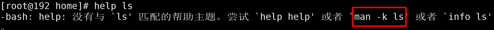

  

## 二、文件目录相关指令

### 1.pwd 显示当前工作路径

- 语法

  ```shell
  pwd
  ```

- 查看当前工作目录

  ```shell
  pwd
  ```

  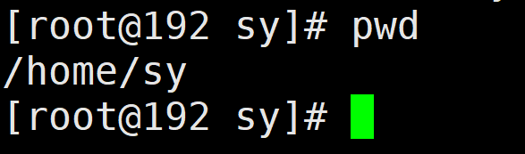

### 2.ls 列出目录内容

- 语法

  ```shell
  ls [选项] [目录或是文件]
  
  ls -a 列出全部文件，包括隐藏文件
  
  ls -i
  
  ls -ai 列出文件的所有信息
  
  ls -l
  ```

- 列出当前路径下的所有目录或是文件

  ```shell
  ls -a
  ```

  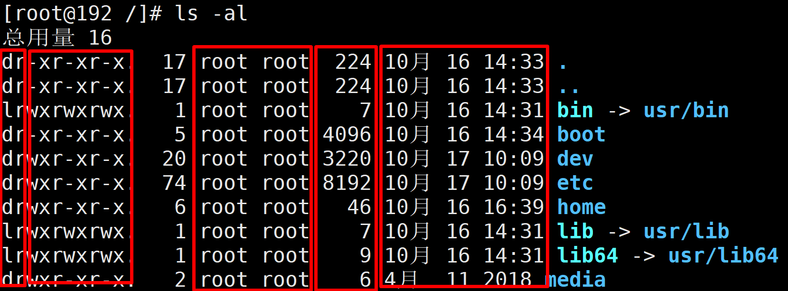

  - 文件的类型与权限
  - 链接数
  - 属于用户
  - 用户组
  - 文件大小（byte）
  - 日期
  - 名称

### 3.cd 切换目录

- 语法

  ```shell
  cd [参数] 
  功能描述：切换到指定目录
  ```

- 案例

  - 切换到根目录

    ```shell
    cd /
    ```

  - 切换到具体目录home 目录

    ```shell
    cd /home
    ```

  - ./ 代表当前目录  

    > 作用：如果，你想查看当前目录的子目录。  cd ./xx  (也可以直接 cd  xx)
  
    ```shell
    cd ./
    ```

    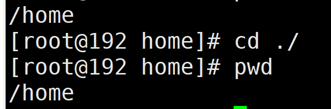

  - ../ 代表上一层目录
  
    ```shell
    cd ../
    ```

    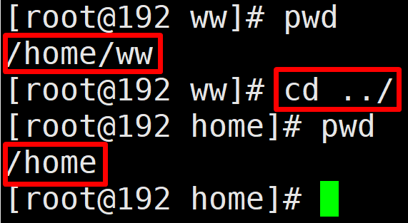

  - cd ~ 切换到系统根目录
  
  - 可以用 tab 键来补全

### 4.mkdir 创建目录

- 语法

  ```shell
  mkdir 目录(可以是多级的)
  ```

- 在 ww 目录下创建 test 和 app 目录

  ```shell
  mkdir test 
  mkdir /home/ww/app
  ```

### 5.rmdir 删除目录

- 语法

  ```shell
  rmdir 目录名称
  ```

- 删除 ww 下的 test 目录

  ```shell
  rmdir /home/ww/test
  ```

### 6.touch 创建空文件

- 语法

  ```shell
  touch 文件名称列表
  ```

- 在 ww 目录下创建 db.properties 文件

  ```shell
  touch db.properties
  ```

  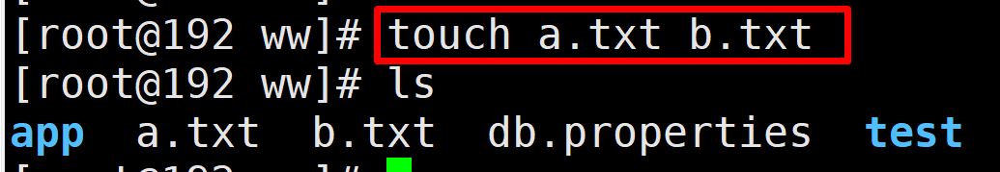

  

### 7.cp 拷贝文件、目录

- 语法

  ```shell
  cp [选项] source dest //source 源文件 dest 目标文件
  
  cp -r source dest  // -r 递归的去复制整个文件
  ```

- 拷贝 a.txt 文件到 zs 目录下

  ```shell
  cp a.txt ../zs/
  ```

  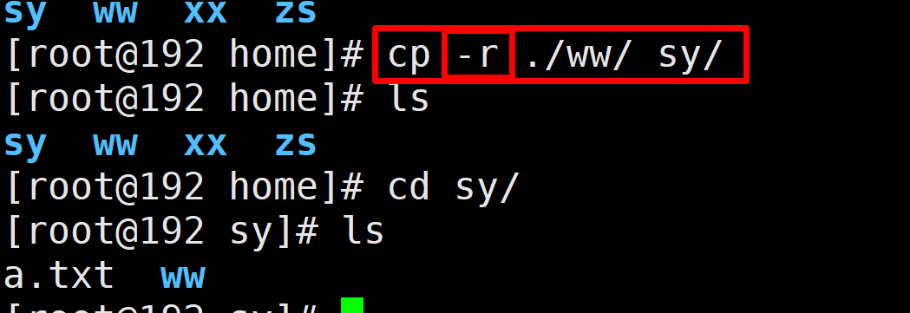

- 覆盖不提示 \cp

  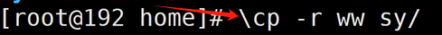


### 8.rm 删除目录、文件

- 语法

  ```shell
  rm [选项] 要删除的文件或目录
  常用选项：
  		-r ：递归删除整个文件夹
  		-f ：强制删除不提示
  ```

- 删除 sy 目录下 ww 目录及其目录下的文件

  ```shell
  rm -rf ww
  ```

- **rm -rf 慎用** 


### 9.mv 移动目录、文件或者重命名

- **重命名语法**

  ```shell
  mv oldNameFile newNameFile
  ```

- 重命名 a.txt 文件 叫 test.txt

  ```shell
  mv a.txt test.txt
  ```

- **移动语法** （文件夹）

  ```shell
  mv /temp/movefile /targetFolder 
  ```

- 移动 test.txt 文件到 ww 文件夹下

  ```shell
  mv test.txt ../ww/
  ```

  

### 10.cat 查看文件内容

- 语法

  ```shell
  cat [选项] 要查看的文件名
  
  常用选项
  		-n ：显示行号
  ```

- 查看 test.txt 文件

  ```shell
  cat -n test.txt 
  ```

  

### 11.more 把文件内容分屏查看

- 语法

  ```shell
  more 要查看的文件名
  
  功能说明：more指令是一个基于VI编辑器的文本过滤器，它以全屏幕的方式按页显示文本文件的内容。
  
  空格键向下翻页
  enter 向下翻行
  q 退出
  ```

- 查看 test.txt 文件

  ```shell
  more test.txt
  ```

  | 操作快捷键   | 说明     |
  | ------------ | -------- |
  | 空格键 space | 向下翻页 |
  | enter        | 向下翻行 |
  | q            | 退出     |

  

### 12.less 用于大文件显示

- 根据需要加载内容进行显示，所以支持大文件的查找效率更高

- 语法

  ```shell
  less 文件
  
  空格键 向下翻页
  / 向下查找 n 向下查找 N向上查找
  ？ 向上查找 n 向上哈找 N向下查找
  ```

  | 操作   | 说明                                      |
  | ------ | ----------------------------------------- |
  | 空格键 | 向下翻页                                  |
  | /内容  | 向下查找【内容】**n 向下查找 N 向上查找** |
  | ？内容 | 向上查找【内容】**n 向上查找 N向下查找**  |

### 13.head 显示文件头部内容

- 语法

  ```shell
  head 文件(功能描述：默认查看文件头10行内容)
  head -n 5 文件(功能描述：查看文件头5行内容，5可以是任意行数)
  ```

- **-n 代表行数**


### 14.echo 输出内容到控制台

- 语法

  ```shell
  echo [选项] [输出内容]
  功能介绍：输出变量或常量内容到控制台
  ```

- 控制台打印 hello word

  

  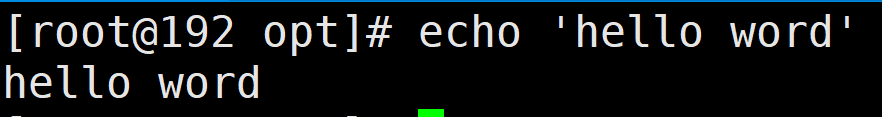

### 15.重定向输出>和>>

- 语法

  ```shell
  查看指令 > 目标文件
  功能说明：将前一个查看指令中的结果 覆盖写入 到目标文件中，如果目标文件不存在，则新建。
  
  查看指令 >> 目标文件
  功能说明：将前一个查看指令中的结果 追加写入 到目标文件中，如果目标文件不存在，则新建。
  ```

- 操作

  ```shell
  ls -al >pwd.txt
  
  ls -al >>pwd.txt
  
  
  ```

### 16.history 查看执行过的命令

- 语法

  ```shell
  history
  ```

- 查看执行过的历史命令

  ```shell
  history
  ```

## 三、查看日志常用

### 1.head 显示文件头部内容

- 语法

  ```shell
  head 文件(功能描述：默认查看文件头10行内容)
  head -n 5 文件(功能描述：查看文件头5行内容，5可以是任意行数)
  ```

- **-n 代表行数**

### 2.tail 显示文件尾部内容

- 语法

  ```shell
  tail 文件（功能描述：默认查看文件尾10行内容）
  tail -n 5 文件（功能描述：查看文件尾5行内容，5可以是任意行数）
  ```

- `常用 -f 追加新内容，监听文件的内容变化`

  

  

## 四、时间日期指令

### 1.date 指令

- 语法

  ```shell
  date [options] [format]
  ```

- 显示当前时间

  

- 当前的年月日（双引号可以不加）

  - date +"%Y"（功能描述：显示当前年份）

  - date +"%m"（功能描述：显示当前月份）

  - date +"%d"（功能描述：显示当前是哪一天）

    ```shell
    date +%Y
    date +%m
    date +%d
    ```
    
    > Note: 此处的 ‘+’ 也要输入进去。

### 3.cal 查看日历

- 语法

  ```shell
  cal [选项]（功能描述：不加选项，显示本月日历）
  ```

  

## 五、搜索与查找指令

### 1.find 查找文件或者目录

- 概述：find指令将从**指定目录**向下递归地遍历其各个子目录，将满足条件的文件或者目录显示在终端

- 语法

  ```shell
  find [搜索范围] [选项]
  ```

  - -name 按照指定名称查找

    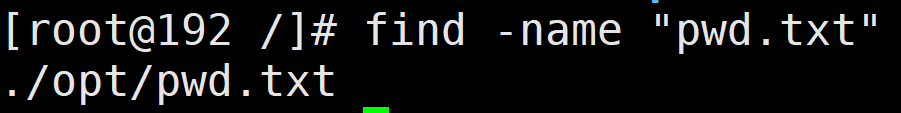

    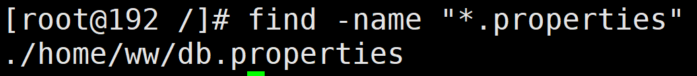

  - -size 查找指定大小的文件

    - +大于
    - -小于
    - M
    - G

    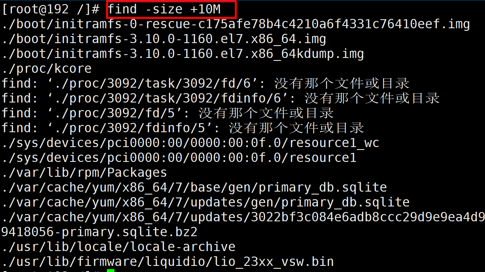

  - -user 查询某一个用户拥有的文件

    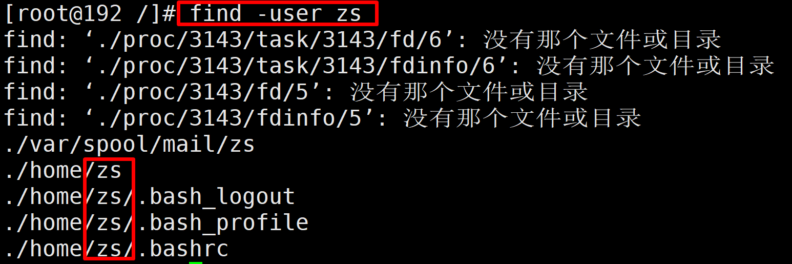

### 2.locate 快速定位文件路径

- 概述：**locate指令可以快速在整个系统中定位文件路径**。locate指令利用事先建立的系统中所有文件名称及路径的locate数据库实现快速定位给定的文件。locate指令无需遍历整个文件系统，**查询速度较快**。为了保证查询结果的准确度，**使用前 updatedb 创建 locate 数据库**

- 语法

  ```shell
  locate 要搜索的文件名
  ```

- 先按照 locate

  ```shell
  yum install mlocate
  ```

- 查找 pwd.txt 文件

  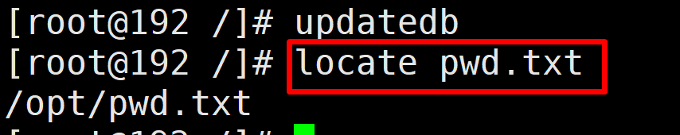

### 3.管道符 |

- **概述**：管道符，“|”，**表示将前一个命令的处理结果输出传递给后面的命令处理**

- ps -ef|grep java 查看当前java进程

  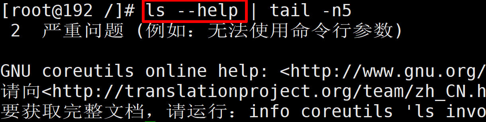

### 4.grep 过滤查找

- 语法

  ```shell
  grep [选项]... PATTERN [FILE]
  选项 -n 查行数
  ```

- ps -ef|grep java


## 六、压缩与解压缩指令

### 1.gzip 与 gunzip

- 语法

  - gzip 文件 压缩文件后缀名 .gz文件

    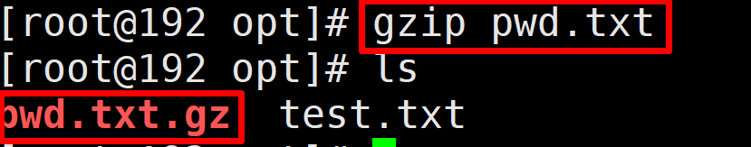

  - gunzip  文件.gz 解压文件

    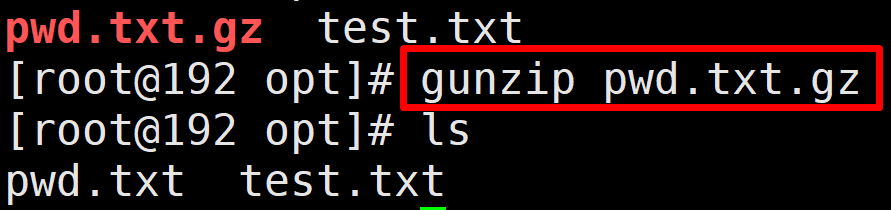

  - 注意：

    - 不会保留原来文件
    - 不能压缩目录，只能压缩文件
    - 压缩多个文件也是出来多个压缩包

### 2.zip 与 unzip

- **先安装 yum install zip           /                     yum install unzip**

- 语法

  - zip [选项] 名称.zip 压缩文件

    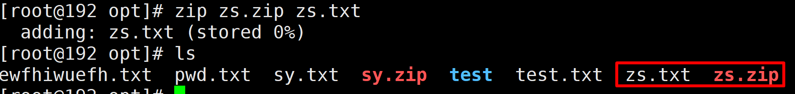

  - unzip [选项] 名称.zip

    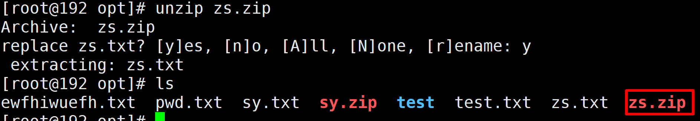

  - 解压到指定目录 -d

    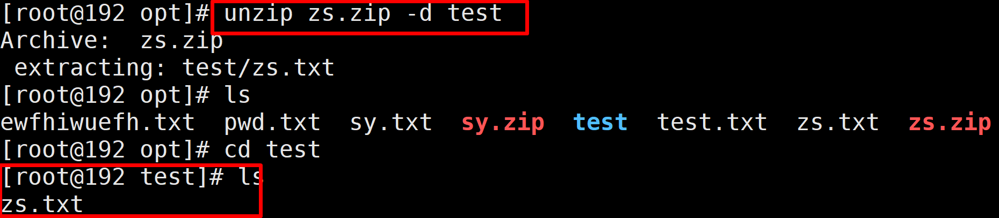

  - 压缩指定目录 -r  (也可不加，但最好加上用于区分)

- 注意：

  - 压缩后源文件还在
  - 解压后压缩包也还在
  - 还可以做重名名什么的


### 3.tar 打包命令

- 语法

  ```shell
  tar [选项] XXX.tar.gz [打包的内容]
  ```

  - 选项说明
    - -c：产生.tar.gz打包文件
    - -v：显示详细信息
    - -f：指定压缩后的文件名
    - -z：打包同时压缩
    - -x：解压.tar.gz文件
    - -C: 指定解压到哪个目录

- **压缩文件 tar -zcvf**

  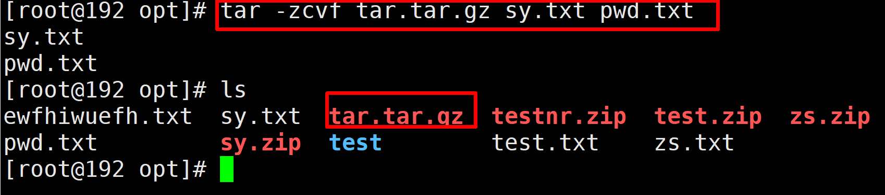

- **解压文件 tar -zxvf**

  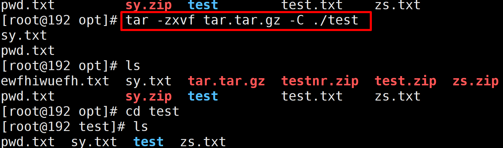

## 七、文件权限指令

### 1.概述

- 概述：Linux/Unix 文件调用权限分为三级（Owner）(Group)(Other Users)

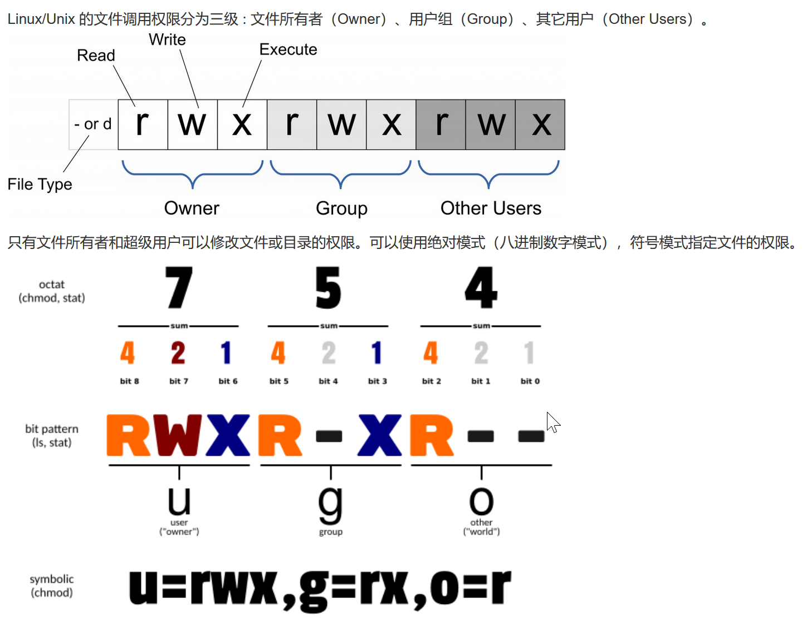

### 2.作用于文件和目录的区别

- 文件
  - r  --- 读
  - w --- 写（有写的权限不代表可以删除该文件，必须具有该文件目录写的权限才能删除）
  - x --- 表示可以执行
- 目录
  - r --- 读
  - w --- 写 （目录内创建、删除、重命名目录）
  - x --- 表示可以执行

### 3.操作演示

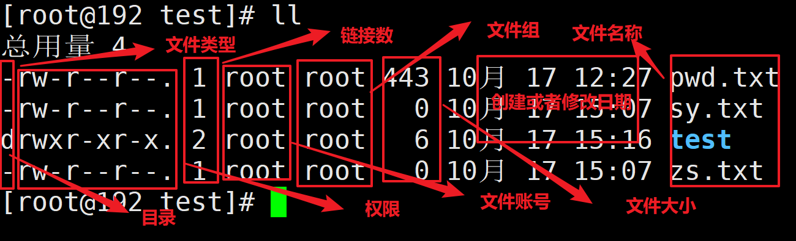

### 4.chmod 改变权限

- 语法

  ```shell
  chmod [mode=421] 文件或者目录
  ```

  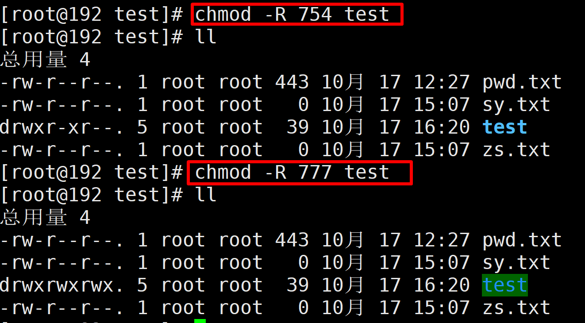

- 数字最好用

### 5.chown 改变所有者

- 语法

  ```shell
  chown [-R][用户][文件目录]
  ```

  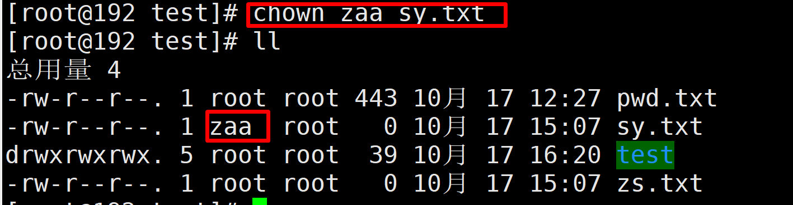

  

### 6.chgrp 改变所属组

- 语法

  ```shell
  chgrp [用户组][文件或目录]
  ```

  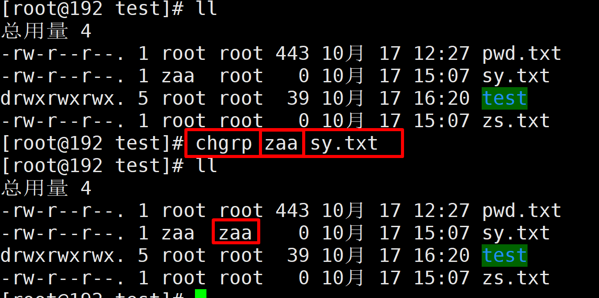

  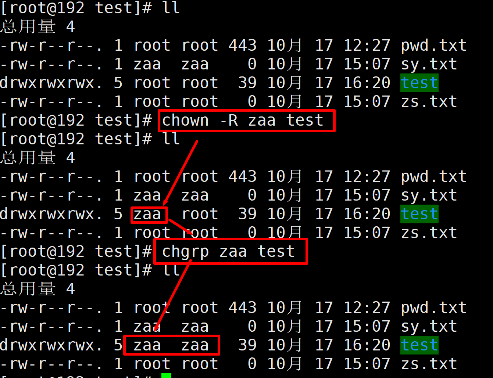

### 7.总结

- 第一不要轻易去动文件权限，除非你的leader让你去动
- **留个心眼，避免同事坑你的时候，然后害你加班**

## 八、磁盘查看

### 1.du 查看目录或文件的磁盘空间占用

- 概述： disk usage

- 语法

  ```shell
  du [可选] 目录或文件
  ```

  - 可选
    - **-h  以 K-M-G显示**
    - -a  查看目录及其文件大小
    - -c  显示总和和目录和子目录大小
    - -s  只显示总和

  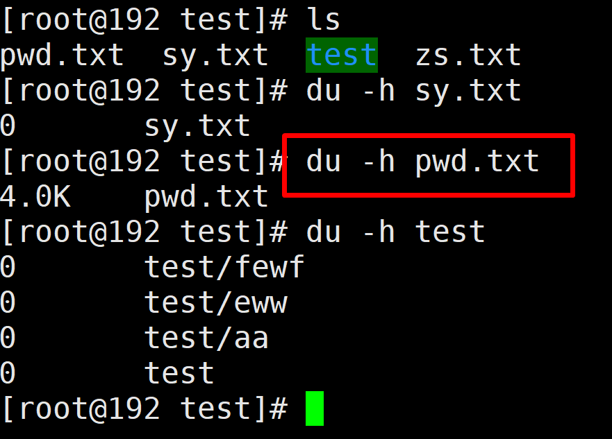

  

### 2.df 磁盘空间余额情况

- 概述：disk free 空余空间

- 语法

  ```shell
  df [-h]
  ```

  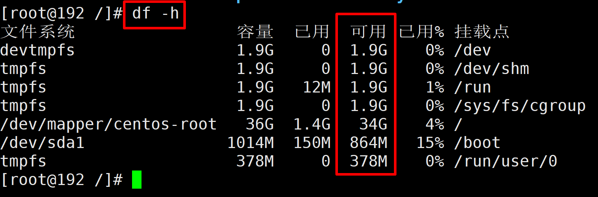

  