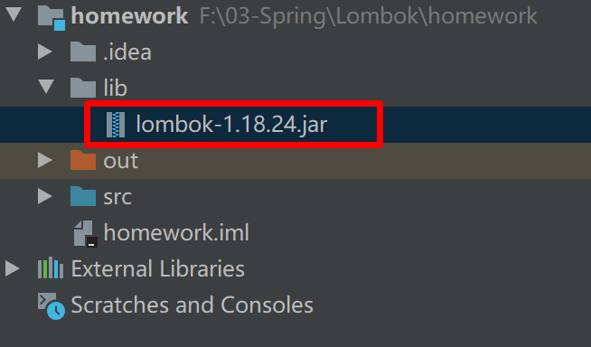
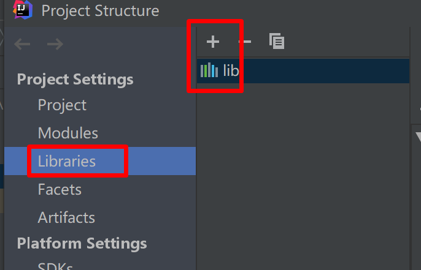
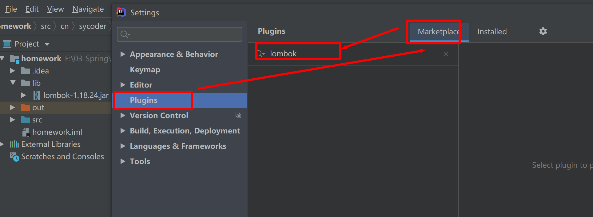
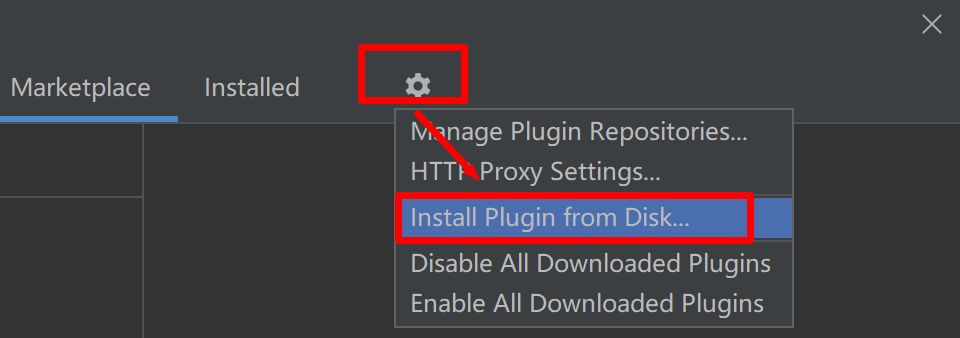
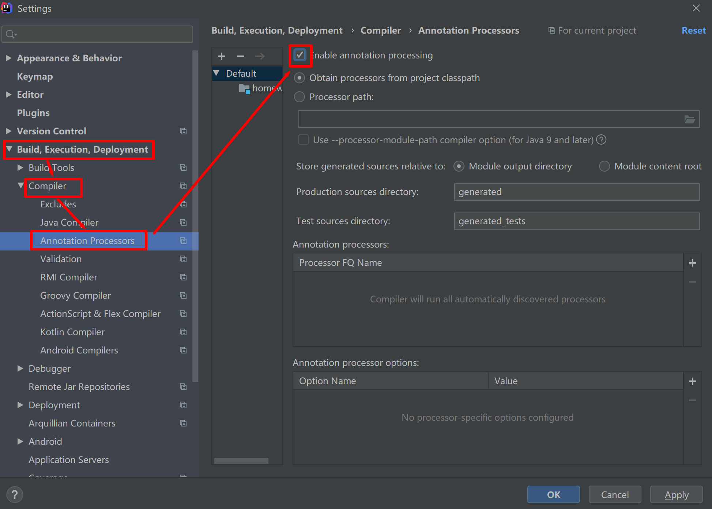
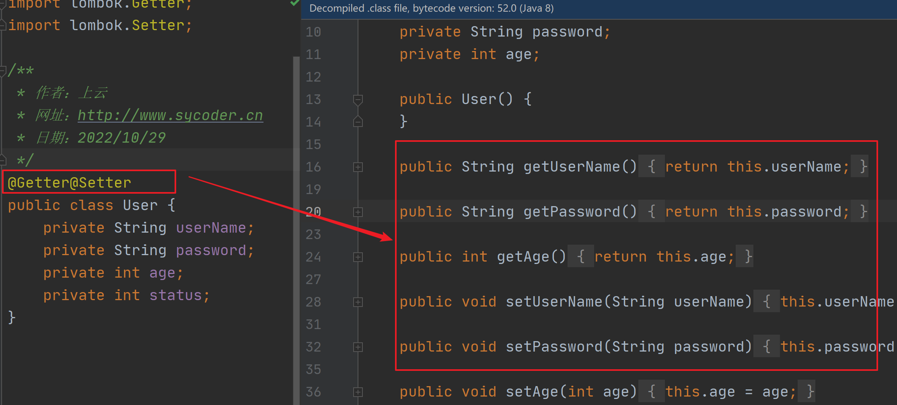
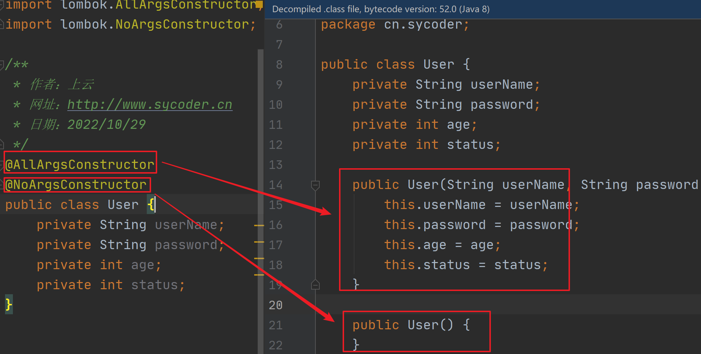
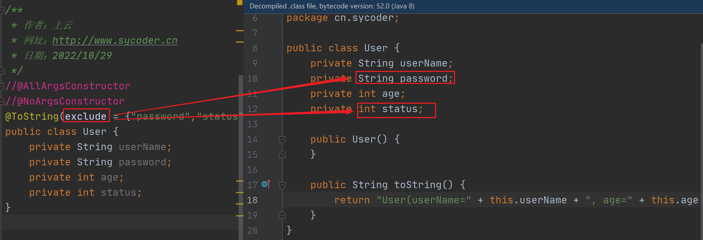
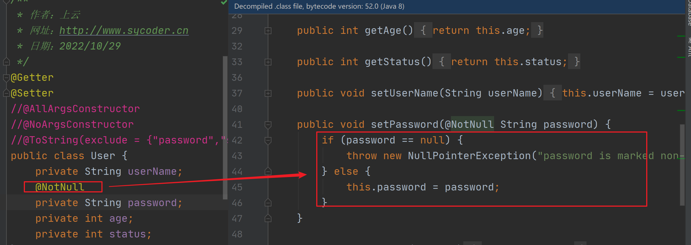
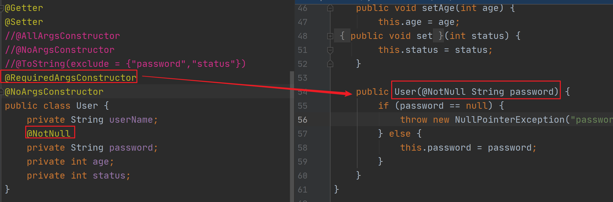

# Lombok 插件

# 一、回顾

- 没有使用插件添加
  - getter
  - setter
  - 构造器
  - toString方法
- 使用鼠标右键 --->Generate---> 选择对应要生成的代码
- 这种方式存在如下问题：
  - 新增字段时，不能自动增加常用的需求操作
  - 删除的时候，也不能动态删除
- 可以使用 lombok 插件来解决这个问题


# 二、添加依赖

- 如果你是 maven 项目，直接添加 pom 就行

  ```java
  <dependency>
      <groupId>org.projectlombok</groupId>
      <artifactId>lombok</artifactId>
      <version>1.18.24</version>
      <scope>provided</scope>
  </dependency>
  ```

- 手动添加依赖的方式

  - 将lombok.jar 拷贝进项目

    

  - 导入 jar 给项目使用

    

# 三、Idea 安装插件

## 1.在线安装

- 在线安装

  - 点击 file --- setting --- plugins

  - 搜索 lombok 插件

    

## 2.离线安装

- 离线安装

  - 找到我提供的插件包

    

  - 添加到idea

    

  - 点击重启即可

    

  

## 3.启用注解支持

- 添加注解支持

  

# 四、常用注解

## 1.Getter & Setter

- 使用

  ```java
  @Getter@Setter
  public class User {
      private String userName;
      private String password;
      private int age;
  }
  ```

- 等价于

  

## 2.@NoArgsConstructor & @AllArgsConstructor

- 构造器使用

  ```java
  @AllArgsConstructor
  @NoArgsConstructor
  public class User {
      private String userName;
      private String password;
      private int age;
      private int status;
  }
  ```

  

  

## 3.@ToString

- 使用,一般直接用即可

  ```java
  @ToString(exclude = {"password","status"})
  public class User {
      private String userName;
      private String password;
      private int age;
      private int status;
  }
  ```

  


## 4.@NotNull

- 使用,如果你不传参就报错

  ```java
  public class User {
      private String userName;
      @NotNull
      private String password;
      private int age;
      private int status;
  }
  ```

  


## 5.@RequiredArgsConstructor

- 使用,提供notnull 的参数构造器

  ```java
  @Getter
  @Setter
  @RequiredArgsConstructor
  @NoArgsConstructor
  public class User {
      private String userName;
      @NotNull
      private String password;
      private int age;
      private int status;
  }
  ```

  


## 6.@Data

- 使用

  ```java
  @Data
  public class User {
      private String userName;
      //    @NotNull
      private String password;
      private int age;
      private int status;
  }
  ```

- 拥有功能

  - getter setter
  - 无参构造器
  - toString 方法
  - equals 方法
  - hashcode 方法

## 7.@EqualsAndHashCode

- 使用

  ```java
      @EqualsAndHashCode
  public class User {
      private String userName;
      //    @NotNull
      private String password;
      private int age;
      private int status;
  }
  ```

- 功能

  - equals 方法
  - hashcode 方法
  - 无参构造器