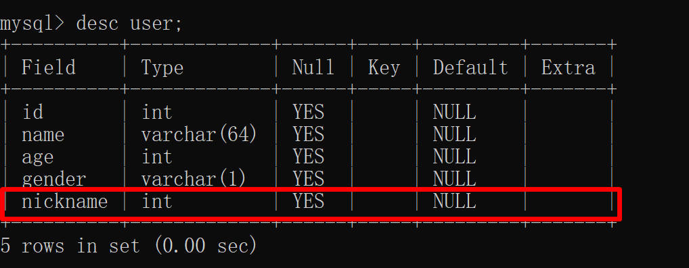

day01

## mysql 概述

1. 为什么要去使用数据库？需要让数据持久化，（基础阶段我们使用对象流来做序列化存储数据）
2. 数据库概念：DataBase（简称DB）即存储数据的“仓库”，其本质是一个文件系统。它保存了一系列有组织的数据。
3. 数据库管理系统：（Database Management System（简称DBMS），操作和管理数据库的大型软件。
4. SQL概念：Structured Query Language 简称（SQL）操作关系型数据库的编程语言，定义了一套操作关系型数据库的统一标准。


### 关系型与非关系型

1. 关系型数据库：把复杂的数据结构归结为简单的二维关系（二维表）。（X,Y）

   

2. 非关系型数据库：redis(key-value)类似于Map 结构


### 常见的数据库

Oracle,**MySQL**,SQL Server

​	

## mysql 安装

1. 检查你本机有没有安装mysql

2. 去 https://www.mysql.com 官网去下载mysql,得到一个 msi

3. 点击得到的 msi

4. 验证安装成功与否
   1. mysql -u root -p 
   2. 输入密码：（我的密码是 123456）


### mysql 连接

1. 使用自带的客户端

2. 通过 cmd 访问（配置环境变量）


## SQL 语言

### SQL 语言通用语法

1. SQL 语句可以单行或者多行来写，以分号结尾；
2. SQL 语句可以使用空格或者缩进来增强语句的可读性；
3. MySQL 数据库的SQL语句不区分大小写，关键字建议使用大写。
4. 注释：
   - 单行注释：-- 注释内容，或者以 #注释内容
   - 多行注释：/* 注释内容 */

### SQL 语言的分类

1. 根据其功能，主要分为四类：DDL,DML,DQL,DCL；

   | 分类 | 英文名称                   | 说明                                                         |
   | ---- | -------------------------- | ------------------------------------------------------------ |
   | DDL  | Data Definition Language   | 语句定义了不同的数据库、表、视图、索引等数据库对象，还可以用来创建、删除、修改数据库和数据表的结构 |
   | DML  | Data Manipulation Language | 数据操作语言，用来对数据库表中的数据进行增删改               |
   | DQL  | Data Query Language        | 数据查询语言，用来查询数据库中表的记录                       |
   | DCL  | Data Control Language      | 数据控制语言，用来创建数据库用户、控制数据库的<br/>访问权限  |

#### DCL 

1. 定义：Data Control Language(数据控制语言)，用来管理数据库用户、控制数据库的访问权限。

##### 管理用户(% 代表通配符)

-  查询用户

  - SELECT * FROM mysql.user;

- 创建用户

  - CREATE USER '用户名'@'主机名' IDENTIFIED BY '密码';

- 修改用户

  - ALTER USER '用户名'@'主机名' IDENTIFIED  WITH mysql_native_password BY '新密码' ;

- 删除用户

  - DROP USER '用户名'@'主机名' ;

- 案例实操

  - 创建用户itsy, 只能够在当前主机localhost访问, 密码123456;

    ```sql
    CREATE USER 'itsy'@'localhost' IDENTIFIED BY '123456';
    ```

    

    

  - 创建用户sycoder, 可以在任意主机访问该数据库, 密码123456;

    ```sql
    CREATE USER 'sycoder'@'%' IDENTIFIED BY '123456';
    ```

  - 修改用户sycoder的访问密码为111111;

    ```sql
    ALTER USER 'sycoder'@'%' IDENTIFIED  WITH mysql_native_password BY '111111' ;
    ```

  - 删除 itsy@localhost 用户

    ```sql
    DROP USER 'itsy'@'localhost';
    ```

##### 权限控制

1. 一些常用基本权限

   

2. 语法

   - 查询权限

     ```sql
     SHOW GRANTS FOR '用户名'@'主机名' ;
     ```

   - 授予权限

     ```sql
     GRANT 权限列表 ON 数据库名.表名 TO '用户名'@'主机名';
     ```

   - 撤销权限

     ```sql
     REVOKE 权限列表 ON 数据库名.表名 FROM '用户名'@'主机名';
     ```

3. 案例

   - 查询 'itsy'@'%' 用户的权限

     ```sql
     SHOW GRANTS FOR 'itsy'@'%' ;
     ```

   - 授予 'sycoder'@'%' 用户itsy数据库所有表的所有操作权限

     ```sql
     GRANT all ON mysql.* TO 'sycoder'@'%';
     ```

   - 撤销 'sycoder'@'%' 用户的itsy数据库的所有权限

     ```sql
     REVOKE all ON mysql.* FROM 'sycoder'@'%';
     ```

4. 注意：DCL 不用花时间，跟着我练一下做做笔记以后用到的时候能够查笔记找到就行了。

#### DDL

##### 数据库操作

- 查看当前有哪些数据库

  ```sql
  SHOW databases;#查看哪些数据库
  ```

- 查询当前数据库

  ```sql
  SELECT database();
  ```

- 创建数据库

  ```sql
  create database [ if not exists ] 数据库名 [ default charset 字符集 ] [ collate 排序 规则 ] ;
  ```

  - 创建一个sycoder数据库, 使用数据库默认的字符集

    ```sql
    CREATE database sycoder;
    ```

  - 创建一个itsy数据库，并且指定字符集utf8

    ```sql
    CREATE database itsy DEFAULT CHARSET UTF8;
    ```

  - 注意：如果数据库存在，直接执行是会报错的

    

  - 加上可选参数可以解决这个问题

    ```sql
    CREATE database IF NOT EXISTS itsy DEFAULT CHARSET UTF8;
    ```

    

- 删除数据库

  ```sql
  drop database [ if exists ] 数据库名 ; 
  ```

  - 删除itsy这个数据库

    ```sql
    DROP DATABASE itsy; 
    ```

  - 注意，当你要删除的数据库不存在的时候，会报错，加上可选参数可以解决这个问题

    ```sql
    DROP DATABASE IF EXISTS itsy; 
    ```

- 切换数据库

  ```sql
  use 数据库名 ;
  ```

  - 切换到 sycoder 数据库中去

    ```sql
    USE sycoder;
    ```

##### 表操作

- 查询当前数据库所有表

  ```sql
  show tables;
  ```

- 查看指定表结构

  ```sql
  desc 表名 ;
  ```

  

- 查询指定表的建表语句

  ```sql
  show create table 表名 ;	
  ```

- 创建表结构

  ```sql
  CREATE TABLE 表名( 
  	字段1 字段1类型 	[COMMENT 字段1注释 ],
  	字段2 字段2类型 	[COMMENT 字段2注释 ], 
  	字段3 字段3类型 	[COMMENT 字段3注释 ], 
  	...... 字段n 字段n类型 	[COMMENT 字段n注释 ] ) 
  [ COMMENT 表注释 ] ;
  ```

  | id   | name | age  | gender |
  | ---- | ---- | ---- | ------ |
  | 1    | sy   | 18   | 男     |
  | 2    | 小明 | 22   | 男     |

  ```sql
  CREATE TABLE user(
  	id int comment '编号',
  	name varchar(64) comment '名字',
  	age int comment '年龄',
  	gender varchar(1) comment '性别'
  )comment '用户表';
  ```


##### 修改

1. 添加字段

   ```sql
   ALTER TABLE 表名 ADD 字段名 类型 (长度)
    [ COMMENT 注释 ] [ 约束 ]; 
   ```

   - 需求：给 user 表添加一个 nickname 字段，类型 varchar(10);

     ```sql
     ALTER TABLE user ADD nickname varchar(10) COMMENT '昵称';
     ```

     

2. 修改数据类型

   ```sql
   ALTER TABLE 表名 MODIFY 字段名 新数据类型 (长度);
   ```

   - 需求：修改刚才的 nickname 数据类型为 int(5);

     ```sql
     ALTER TABLE user MODIFY nickname int(5) comment '昵称新类型';
     ```

     ​	

3.  修改字段名和字段类型

   ```sql
   ALTER TABLE 表名 CHANGE 旧字段名 新字段名 类型 (长度) [ COMMENT 注释 ] [ 约束 ];
   ```

   - 需求：将 nickname 字段修改成 address varchar(64) 

     ```sql
     ALTER TABLE user CHANGE nickname address varchar(64);
     ```

     

4. 删除字段

   ```sql
   ALTER TABLE 表名 DROP 字段名;
   ```

   - 需求：将employee表的字段address删除

     ```sql
     ALTER TABLE user DROP address;
     ```

5. 修改表名

   ```sql
   ALTER TABLE 表名 RENAME TO 新表名;
   ```

   - 将employee表的表名修改为 emp

     ```sql
     ALTER TABLE employee RENAME TO emp; 
     ```

     


##### 删除

1. 删除表

   ```sql
   DROP TABLE [ IF EXISTS ] 表名;
   ```

   - 删除 emp 表

     ```sql
     DROP TABLE IF EXISTS emp;
     ```

     

   

   2. 删除指定表, 并重新创建表

      ```sql
      TRUNCATE TABLE 表名;
      ```

   

   

   

## 可视化工具 Navicat 安装与使用

1. 没有使用可视化工具时候存在如下问题：

   - 开发效率太低
   - 不直观，不方便

2. 市面上常用的可视化工具

   - **Navicat**

   - Sqlyong

   - DataGrip

     

##### Navicat 安装


##### 使用


##### 创建表


##### 注意点

1. 做完操作记得保存 ctrl + s
2. 右键选择设计表