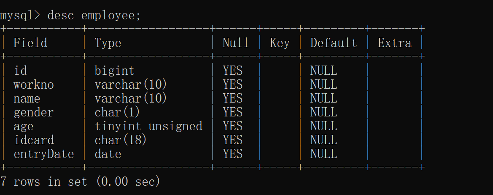

## 数值类型

| **类型**     | 有符号(SIGNED)取值范围                                 | 无符号(UNSIGNED)取值范围                                   | 大小   | 描述            |
| ------------ | ------------------------------------------------------ | ---------------------------------------------------------- | ------ | --------------- |
| TINYINT      | (-128，127)                                            | (0，255)                                                   | 1byte  | 小整数值        |
| SMALLINT     | (-32768，32767)                                        | (0，65535)                                                 | 2bytes | 大整数值        |
| INT/INTEGER  | (-2147483648，2147483647)                              | (0，4294967295)                                            | 4bytes | 大整数值        |
| BIGINT(Long) | (-2^63，2^63-1)                                        | (0，2^64-1)                                                | 8bytes | 极大整数值      |
| FLOAT        | (-3.402823466 E+38，3.402823466351 E+38)               | 0 和 (1.175494351 E- 38，3.402823466 E+38)                 | 4bytes | 单精度浮点数值  |
| DOUBLE       | (-1.7976931348623157 E+308， 1.7976931348623157 E+308) | 0 和 (2.2250738585072014 E-308， 1.7976931348623157 E+308) | 8bytes | 双精 度浮点数值 |
| DECIMAL      |                                                        |                                                            |        | 小数值(精确)    |

例子：

- 用户年龄字段

  ```sql
  age tinyint unsigned
  ```

- 分数100

  ```sql
  score double(4,1)
  ```

  

## 字符串类型

| 类型     | 大小                  | 描述                     |
| -------- | --------------------- | ------------------------ |
| CHAR     | 0-255 bytes           | 定长字符串(需要指定长度) |
| VARCHAR  | 0-65535 bytes         | 变长字符串(需要指定长度) |
| BLOB     | 0-65 535 bytes        | 二进制形式的长文本数据   |
| TEXT     | 0-65 535 bytes        | 长文本数据               |
| LONGTEXT | 0-4 294 967 295 bytes | 极大文本数据             |

例子：

- 性别

  ```sql
  gender char(1)
  ```

- 用户名

  ```sql
  username varchar(64)
  ```

  

## 日期时间类型

| 类型      | 格式                | 范围                                      | 大小 | 描述                     |
| --------- | ------------------- | ----------------------------------------- | ---- | ------------------------ |
| DATE      | YYYY-MM-DD          | 1000-01-01 至 9999-12-31                  | 3    | 日期值                   |
| TIME      | HH:MM:SS            | -838:59:59 至 838:59:59                   | 3    | 时间值或持续时间         |
| YEAR      | YYYY                | 1901 至 2155                              | 1    | 年份值                   |
| DATETIME  | YYYY-MM-DD HH:MM:SS | 1000-01-01 00:00:00 至9999-12-31 23:59:59 | 8    | 混合日期和时间值         |
| TIMESTAMP | YYYY-MM-DD          | 1970-01-01 00:00:01 至2038-01-19 03:14:07 | 4    | 混合日期和时间值，时间戳 |

例子

- 生日

  ```sql
  birthday date
  ```

- 更新时间

  ```sql
  updatetime datetime
  ```

  

1. 需求

   ```sql
   需求：
   设计一张员工信息表，要求如下：
   	1. 编号（纯数字）
   	2. 员工工号 (字符串类型，长度不超过10位)
   	3. 员工姓名（字符串类型，长度不超过10位）
   	4. 性别（男/女，存储一个汉字）
   	5. 年龄（正常人年龄，不可能存储负数）
   	6. 身份证号（二代身份证号均为18位，身份证中有X这样的字符）
   	7. 入职时间（取值年月日即可）
   	
   create table employee(
   	id bigint comment '编号',
       workno varchar(10) comment '员工工号',
       name varchar(10) comment '员工姓名',
       gender char(1) comment '性别',
       age tinyint UNSIGNED  comment '年龄',
       idcard char(18) comment '身份证号',
       entryDate date comment '入职时间'
   )comment '员工表';
   ```

   

